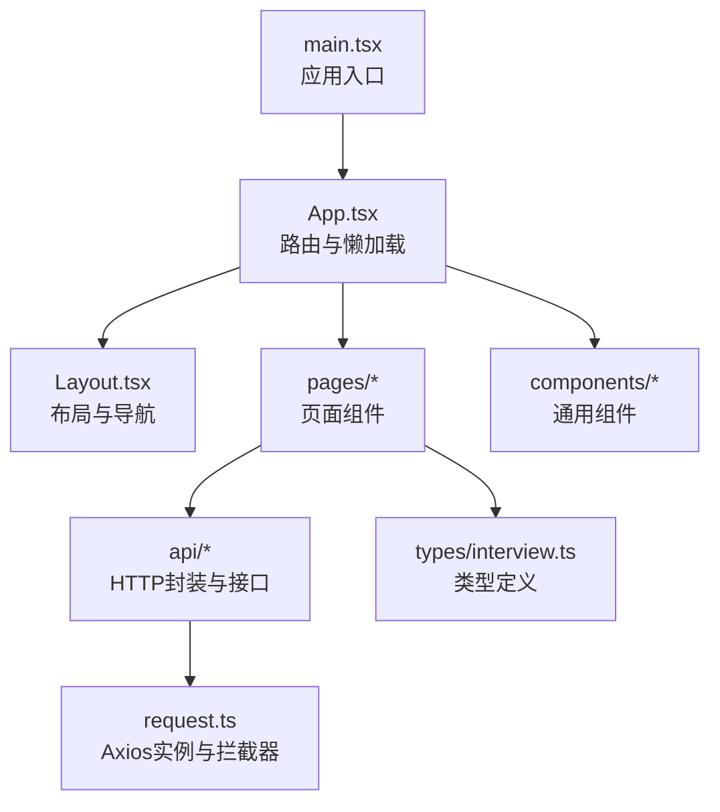
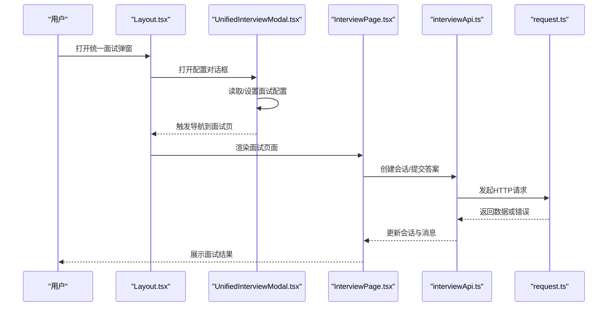
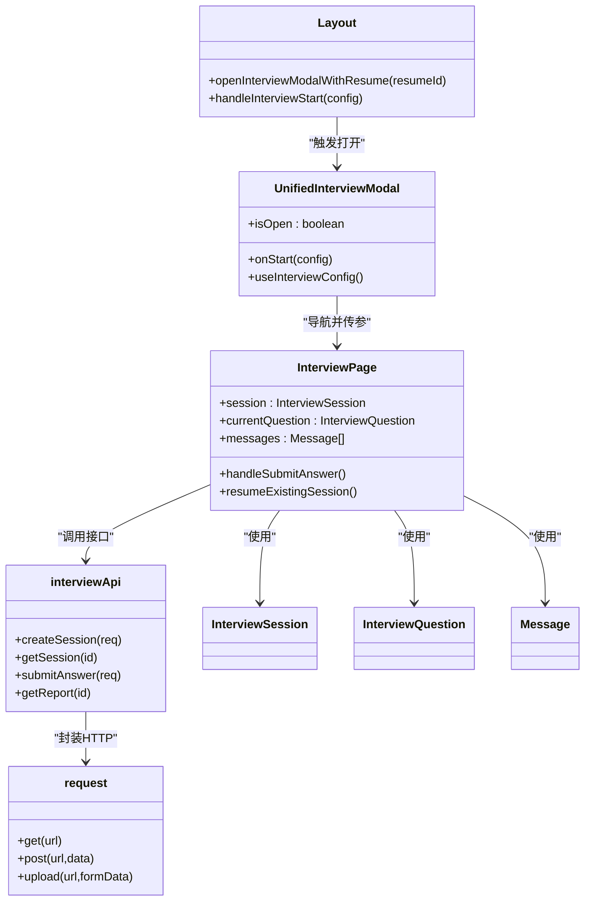
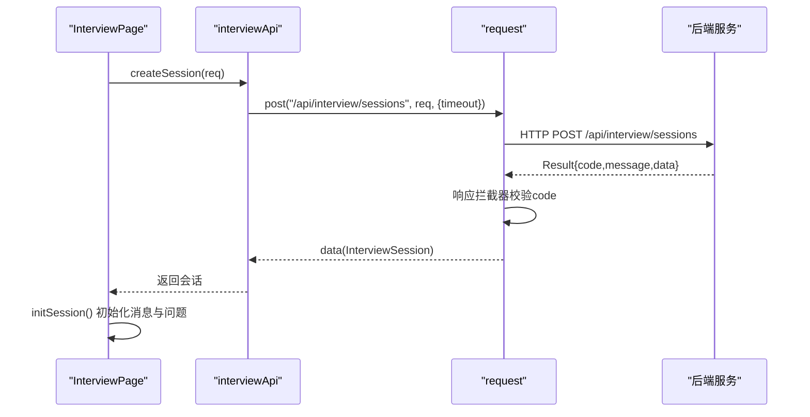
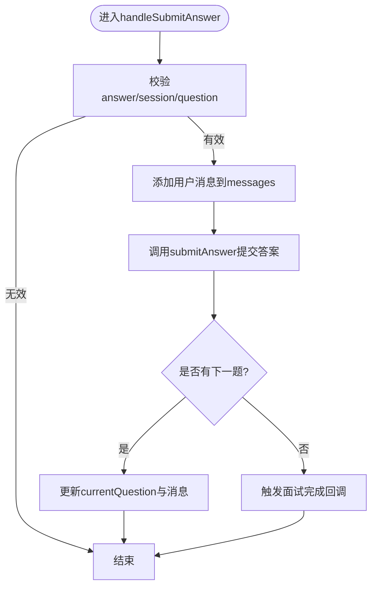
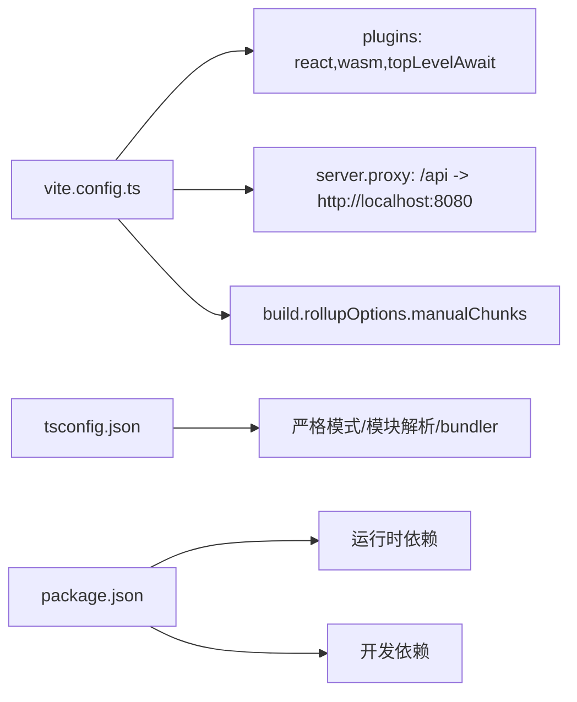

# React前端调试

<cite>
**本文引用的文件**
- [frontend/package.json](file://frontend/package.json)
- [frontend/vite.config.ts](file://frontend/vite.config.ts)
- [frontend/tsconfig.json](file://frontend/tsconfig.json)
- [frontend/src/main.tsx](file://frontend/src/main.tsx)
- [frontend/src/App.tsx](file://frontend/src/App.tsx)
- [frontend/src/constants/routes.ts](file://frontend/src/constants/routes.ts)
- [frontend/src/api/request.ts](file://frontend/src/api/request.ts)
- [frontend/src/api/interview.ts](file://frontend/src/api/interview.ts)
- [frontend/src/pages/InterviewPage.tsx](file://frontend/src/pages/InterviewPage.tsx)
- [frontend/src/components/UnifiedInterviewModal.tsx](file://frontend/src/components/UnifiedInterviewModal.tsx)
- [frontend/src/components/Layout.tsx](file://frontend/src/components/Layout.tsx)
- [frontend/src/hooks/useTheme.ts](file://frontend/src/hooks/useTheme.ts)
- [frontend/src/types/interview.ts](file://frontend/src/types/interview.ts)
</cite>

## 目录
1. [简介](#简介)
2. [项目结构](#项目结构)
3. [核心组件](#核心组件)
4. [架构总览](#架构总览)
5. [详细组件分析](#详细组件分析)
6. [依赖关系分析](#依赖关系分析)
7. [性能考量](#性能考量)
8. [故障排查指南](#故障排查指南)
9. [结论](#结论)
10. [附录](#附录)

## 简介
本指南面向面试指南平台的React前端应用，提供系统化的调试方法论与实操步骤，覆盖以下关键领域：
- Chrome开发者工具：Elements面板、Console控制台、Sources断点调试、Network网络请求分析
- React DevTools：安装与使用、组件树查看、Props与State检查、性能分析
- TypeScript调试：类型检查、编译错误定位、Source Map使用
- Vite开发服务器调试：热重载调试、代理配置调试、构建优化调试
- 前端特有调试技巧：状态管理调试（Redux/Context替代方案）、路由调试、样式调试

## 项目结构
前端位于frontend目录，采用Vite + React + TypeScript技术栈，核心入口为main.tsx，应用根组件为App.tsx，路由通过react-router-dom进行组织，API封装在src/api下，页面组件位于src/pages，通用组件位于src/components。

图表来源
- [frontend/src/main.tsx:1-21](file://frontend/src/main.tsx#L1-L21)
- [frontend/src/App.tsx:1-379](file://frontend/src/App.tsx#L1-L379)
- [frontend/src/components/Layout.tsx:1-257](file://frontend/src/components/Layout.tsx#L1-L257)
- [frontend/src/api/request.ts:1-128](file://frontend/src/api/request.ts#L1-L128)
- [frontend/src/types/interview.ts:1-88](file://frontend/src/types/interview.ts#L1-L88)

章节来源
- [frontend/src/main.tsx:1-21](file://frontend/src/main.tsx#L1-L21)
- [frontend/src/App.tsx:167-229](file://frontend/src/App.tsx#L167-L229)

## 核心组件
- 应用入口与主题初始化：在入口处初始化深色/浅色主题，避免首屏闪烁；通过StrictMode确保严格模式下的副作用暴露。
- 路由与懒加载：App集中声明路由与Suspense占位，页面组件均采用动态导入与懒加载，减少首屏体积。
- API层：统一的Axios实例与响应拦截器，集中处理后端Result格式与错误提示；提供文件上传专用逻辑与超时配置。
- 页面与对话框：InterviewPage负责文字面试流程，UnifiedInterviewModal负责面试配置与启动；两者通过状态与回调协作。

章节来源
- [frontend/src/main.tsx:6-14](file://frontend/src/main.tsx#L6-L14)
- [frontend/src/App.tsx:11-26](file://frontend/src/App.tsx#L11-L26)
- [frontend/src/api/request.ts:12-17](file://frontend/src/api/request.ts#L12-L17)
- [frontend/src/api/request.ts:26-75](file://frontend/src/api/request.ts#L26-L75)
- [frontend/src/pages/InterviewPage.tsx:35-42](file://frontend/src/pages/InterviewPage.tsx#L35-L42)
- [frontend/src/components/UnifiedInterviewModal.tsx:43-53](file://frontend/src/components/UnifiedInterviewModal.tsx#L43-L53)

## 架构总览
前端采用“入口 -> 路由 -> 页面/组件 -> API”的单向数据流。路由负责页面切换与参数传递，页面组件负责状态管理与交互，API层负责与后端通信并统一封装错误。

图表来源
- [frontend/src/components/Layout.tsx:35-80](file://frontend/src/components/Layout.tsx#L35-L80)
- [frontend/src/components/UnifiedInterviewModal.tsx:69-91](file://frontend/src/components/UnifiedInterviewModal.tsx#L69-L91)
- [frontend/src/pages/InterviewPage.tsx:73-97](file://frontend/src/pages/InterviewPage.tsx#L73-L97)
- [frontend/src/api/interview.ts:25-40](file://frontend/src/api/interview.ts#L25-L40)
- [frontend/src/api/request.ts:77-115](file://frontend/src/api/request.ts#L77-L115)

## 详细组件分析

### 组件类图：面试相关组件与类型

图表来源
- [frontend/src/components/Layout.tsx:35-80](file://frontend/src/components/Layout.tsx#L35-L80)
- [frontend/src/components/UnifiedInterviewModal.tsx:43-91](file://frontend/src/components/UnifiedInterviewModal.tsx#L43-L91)
- [frontend/src/pages/InterviewPage.tsx:35-42](file://frontend/src/pages/InterviewPage.tsx#L35-L42)
- [frontend/src/api/interview.ts:25-106](file://frontend/src/api/interview.ts#L25-L106)
- [frontend/src/api/request.ts:77-115](file://frontend/src/api/request.ts#L77-L115)
- [frontend/src/types/interview.ts:5-87](file://frontend/src/types/interview.ts#L5-L87)

章节来源
- [frontend/src/components/Layout.tsx:22-256](file://frontend/src/components/Layout.tsx#L22-L256)
- [frontend/src/components/UnifiedInterviewModal.tsx:1-476](file://frontend/src/components/UnifiedInterviewModal.tsx#L1-L476)
- [frontend/src/pages/InterviewPage.tsx:1-292](file://frontend/src/pages/InterviewPage.tsx#L1-L292)
- [frontend/src/api/interview.ts:1-107](file://frontend/src/api/interview.ts#L1-L107)
- [frontend/src/types/interview.ts:1-88](file://frontend/src/types/interview.ts#L1-L88)

### API工作流序列图：创建面试会话

图表来源
- [frontend/src/pages/InterviewPage.tsx:73-97](file://frontend/src/pages/InterviewPage.tsx#L73-L97)
- [frontend/src/api/interview.ts:36-40](file://frontend/src/api/interview.ts#L36-L40)
- [frontend/src/api/request.ts:26-43](file://frontend/src/api/request.ts#L26-L43)

章节来源
- [frontend/src/pages/InterviewPage.tsx:73-147](file://frontend/src/pages/InterviewPage.tsx#L73-L147)
- [frontend/src/api/interview.ts:25-40](file://frontend/src/api/interview.ts#L25-L40)
- [frontend/src/api/request.ts:26-75](file://frontend/src/api/request.ts#L26-L75)

### 复杂逻辑流程图：提交答案与继续下一题

图表来源
- [frontend/src/pages/InterviewPage.tsx:149-186](file://frontend/src/pages/InterviewPage.tsx#L149-L186)
- [frontend/src/api/interview.ts:59-67](file://frontend/src/api/interview.ts#L59-L67)

章节来源
- [frontend/src/pages/InterviewPage.tsx:149-186](file://frontend/src/pages/InterviewPage.tsx#L149-L186)
- [frontend/src/api/interview.ts:59-67](file://frontend/src/api/interview.ts#L59-L67)

## 依赖关系分析
- 构建与运行：Vite作为开发服务器与打包工具，配置了插件（react、wasm、top-level-await）与代理；TypeScript编译器选项启用严格模式与bundler解析。
- 运行时依赖：React、react-router-dom、axios、framer-motion、lucide-react等；开发依赖包含Vite、TypeScript及相关插件。
- 代码分割：Rollup手动分包策略将react生态、UI库、语法高亮等拆分为独立chunk，提升缓存命中率。

图表来源
- [frontend/vite.config.ts:7-41](file://frontend/vite.config.ts#L7-L41)
- [frontend/tsconfig.json:2-18](file://frontend/tsconfig.json#L2-L18)
- [frontend/package.json:6-44](file://frontend/package.json#L6-L44)

章节来源
- [frontend/vite.config.ts:7-41](file://frontend/vite.config.ts#L7-L41)
- [frontend/tsconfig.json:2-18](file://frontend/tsconfig.json#L2-L18)
- [frontend/package.json:6-44](file://frontend/package.json#L6-L44)

## 性能考量
- 懒加载与Suspense：通过动态导入与Suspense占位，避免一次性加载大量页面组件，降低首屏阻塞。
- 代码分割：手动分包策略将第三方库拆分，提升浏览器缓存效率与并发加载能力。
- 动画与渲染：使用Framer Motion进行轻量动画，注意在移动端的性能影响；避免在动画路径中频繁重排。
- 网络请求：为AI相关接口设置较长超时；上传接口单独配置超时与multipart头；统一拦截器处理错误，避免重复请求。
- 主题与SSR：入口处初始化主题，避免首屏闪烁；深色/浅色切换通过CSS类名切换，避免不必要的重渲染。

章节来源
- [frontend/src/App.tsx:11-33](file://frontend/src/App.tsx#L11-L33)
- [frontend/vite.config.ts:16-22](file://frontend/vite.config.ts#L16-L22)
- [frontend/src/main.tsx:6-14](file://frontend/src/main.tsx#L6-L14)
- [frontend/src/api/request.ts:101-107](file://frontend/src/api/request.ts#L101-L107)
- [frontend/src/hooks/useTheme.ts:19-28](file://frontend/src/hooks/useTheme.ts#L19-L28)

## 故障排查指南

### Chrome开发者工具调试
- Elements面板
  - 定位元素：在Elements中查看DOM结构，结合React DevTools定位对应组件。
  - 样式调试：检查类名与内联样式，验证暗色/亮色主题切换是否生效；关注Layout中的主题切换逻辑。
- Console控制台
  - 错误定位：观察网络错误、类型错误、未捕获异常；结合Source Map定位到源码行号。
  - 日志输出：在关键函数（如handleSubmitAnswer、createSession）添加console日志，确认数据流转。
- Sources断点调试
  - 在断点处检查变量：session、currentQuestion、messages、answer等状态。
  - 条件断点：针对特定问题索引或会话ID设置条件断点，缩小问题范围。
- Network网络请求分析
  - 关注/api前缀请求：确认代理配置正确；检查请求头、超时、响应体结构。
  - 文件上传：确认multipart/form-data头与超时设置；观察后端返回的Result结构。

章节来源
- [frontend/src/components/Layout.tsx:149-166](file://frontend/src/components/Layout.tsx#L149-L166)
- [frontend/src/api/request.ts:12-17](file://frontend/src/api/request.ts#L12-L17)
- [frontend/vite.config.ts:27-32](file://frontend/vite.config.ts#L27-L32)
- [frontend/src/pages/InterviewPage.tsx:149-186](file://frontend/src/pages/InterviewPage.tsx#L149-L186)

### React DevTools调试
- 安装与使用
  - 安装React DevTools扩展；在页面中打开开发者工具，切换到Components标签。
- 组件树查看
  - 展开组件树，定位Layout、UnifiedInterviewModal、InterviewPage等关键组件。
- Props与State检查
  - 在组件上右键选择“Store as global variable”，在Console中检查props与state。
  - 关注InterviewPage的session、currentQuestion、messages；UnifiedInterviewModal的mode、skillId、difficulty等。
- 性能分析
  - 使用Profiler录制渲染过程，识别高频重渲染组件；结合React StrictMode定位副作用。
  - 关注Suspense边界与懒加载组件的渲染时机。

章节来源
- [frontend/src/components/UnifiedInterviewModal.tsx:54-67](file://frontend/src/components/UnifiedInterviewModal.tsx#L54-L67)
- [frontend/src/pages/InterviewPage.tsx:43-51](file://frontend/src/pages/InterviewPage.tsx#L43-L51)
- [frontend/src/App.tsx:167-229](file://frontend/src/App.tsx#L167-L229)

### TypeScript调试技巧
- 类型检查
  - 严格模式开启：noUnusedLocals、noUnusedParameters、noFallthroughCasesInSwitch等。
  - 使用类型守卫与解构赋值，避免any泛滥；在API响应处明确Result结构。
- 编译错误定位
  - 结合IDE的快速修复与TS提示；在tsconfig.json中调整moduleResolution为bundler。
- Source Map使用
  - 开发环境启用Source Map；在Sources中查看映射后的源文件，便于断点调试。

章节来源
- [frontend/tsconfig.json:2-18](file://frontend/tsconfig.json#L2-L18)
- [frontend/src/api/request.ts:6-10](file://frontend/src/api/request.ts#L6-L10)
- [frontend/src/types/interview.ts:5-87](file://frontend/src/types/interview.ts#L5-L87)

### Vite开发服务器调试
- 热重载调试
  - 修改组件或API文件后，观察浏览器自动刷新；若未生效，检查插件顺序与依赖优化。
- 代理配置调试
  - /api代理指向后端8080端口；若请求失败，检查代理目标与changeOrigin设置。
- 构建优化调试
  - 关注manualChunks分包策略；使用构建预览（vite preview）验证产物。
- Sourcemap忽略
  - 对第三方库的sourcemap警告进行忽略配置，避免干扰调试。

章节来源
- [frontend/vite.config.ts:24-41](file://frontend/vite.config.ts#L24-L41)
- [frontend/package.json:6-10](file://frontend/package.json#L6-L10)

### 状态管理调试（上下文/全局状态）
- 当前项目未使用Redux，采用React Context与局部状态管理：
  - Layout通过useOutletContext向下传递openInterviewModalWithResume回调。
  - InterviewPage内部维护session、currentQuestion、messages等状态。
- 调试建议
  - 在组件顶部打印props与state；使用React DevTools查看组件树与渲染次数。
  - 对于跨组件共享的状态，考虑抽离为自定义Hook并在测试环境中验证。

章节来源
- [frontend/src/components/Layout.tsx:238-239](file://frontend/src/components/Layout.tsx#L238-L239)
- [frontend/src/pages/InterviewPage.tsx:43-51](file://frontend/src/pages/InterviewPage.tsx#L43-L51)

### 路由调试
- 路由配置集中在App.tsx，使用react-router-dom的lazy与Suspense。
- 调试要点
  - 检查路由参数与state传递（如InterviewWrapper中的entryState）。
  - 使用useLocation与useNavigate在组件内打印当前路径与跳转行为。
  - 注意默认重定向与嵌套路由的匹配规则。

章节来源
- [frontend/src/App.tsx:167-229](file://frontend/src/App.tsx#L167-L229)
- [frontend/src/App.tsx:85-165](file://frontend/src/App.tsx#L85-L165)
- [frontend/src/constants/routes.ts:1-6](file://frontend/src/constants/routes.ts#L1-L6)

### 样式调试
- 主题切换：useTheme同步documentElement类名与localStorage；在Elements中检查dark类是否正确添加/移除。
- 组件样式：通过Elements面板临时禁用/启用样式，定位冲突与覆盖问题。
- 动画：在Performance标签录制动画帧，观察FPS变化。

章节来源
- [frontend/src/hooks/useTheme.ts:19-28](file://frontend/src/hooks/useTheme.ts#L19-L28)
- [frontend/src/main.tsx:6-14](file://frontend/src/main.tsx#L6-L14)
- [frontend/src/components/Layout.tsx:132-256](file://frontend/src/components/Layout.tsx#L132-L256)

## 结论
本指南提供了从工具到架构、从类型到构建的全链路调试方法。建议在日常开发中：
- 优先使用React DevTools与Chrome Sources进行组件与状态调试；
- 借助Vite代理与TypeScript严格模式提升开发体验；
- 通过Network面板与API拦截器定位接口问题；
- 利用Suspense与懒加载优化用户体验与性能。

## 附录
- 常用命令
  - 开发：pnpm dev
  - 构建：pnpm build
  - 预览：pnpm preview
- 关键配置
  - Vite插件：react、wasm、top-level-await
  - 代理：/api -> http://localhost:8080
  - TypeScript：严格模式、bundler解析、noEmit

章节来源
- [frontend/package.json:6-10](file://frontend/package.json#L6-L10)
- [frontend/vite.config.ts:8-12](file://frontend/vite.config.ts#L8-L12)
- [frontend/vite.config.ts:27-32](file://frontend/vite.config.ts#L27-L32)
- [frontend/tsconfig.json:14-18](file://frontend/tsconfig.json#L14-L18)