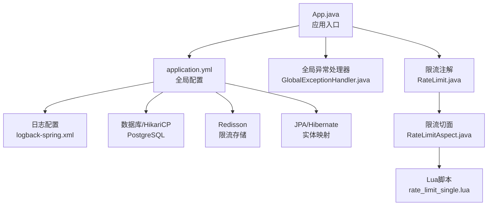
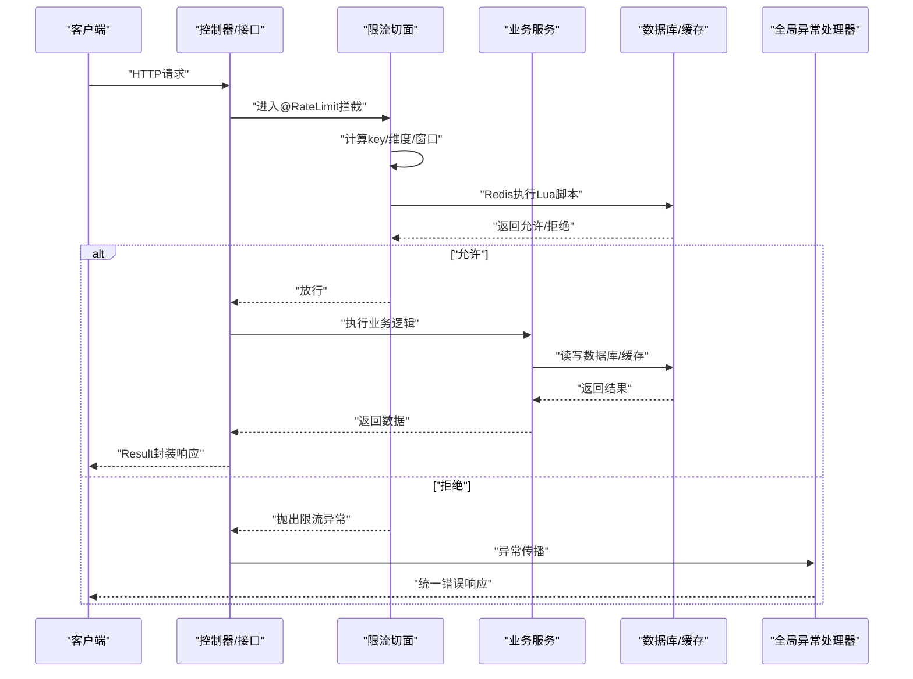
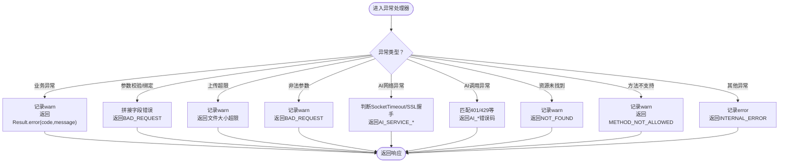
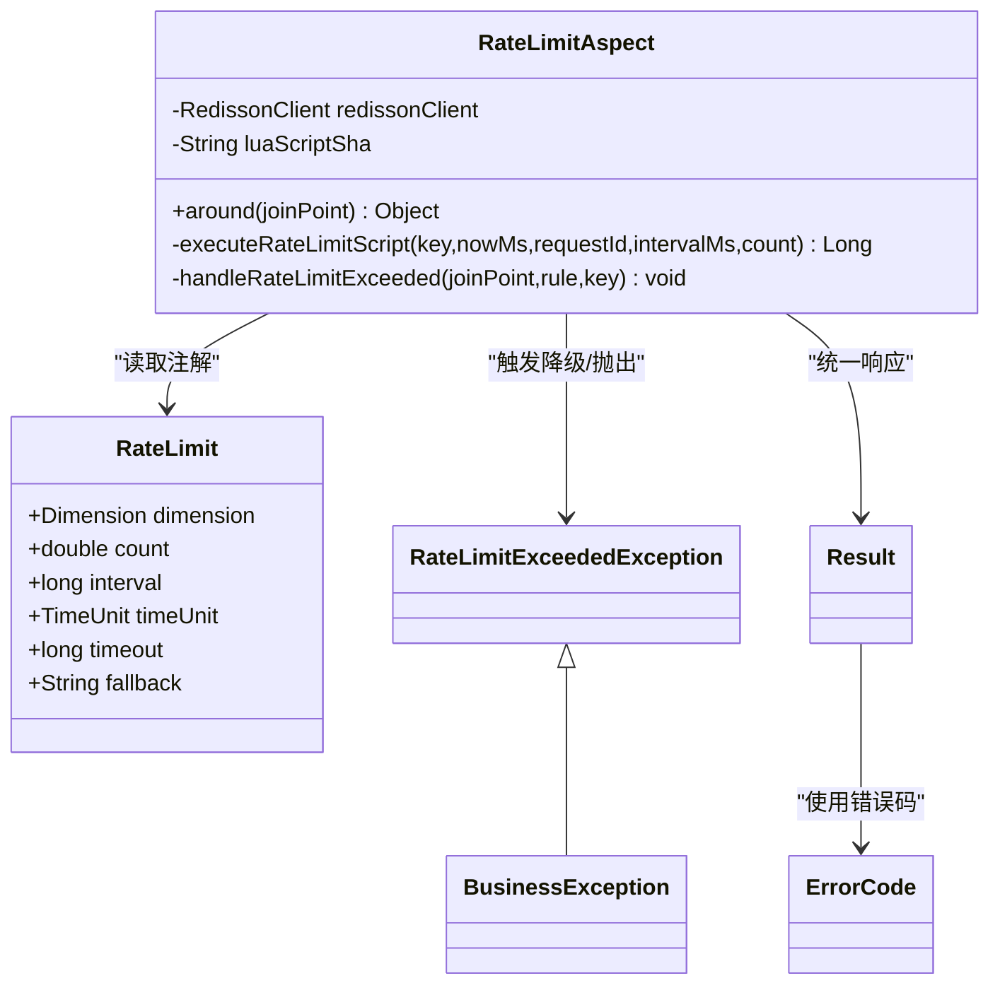
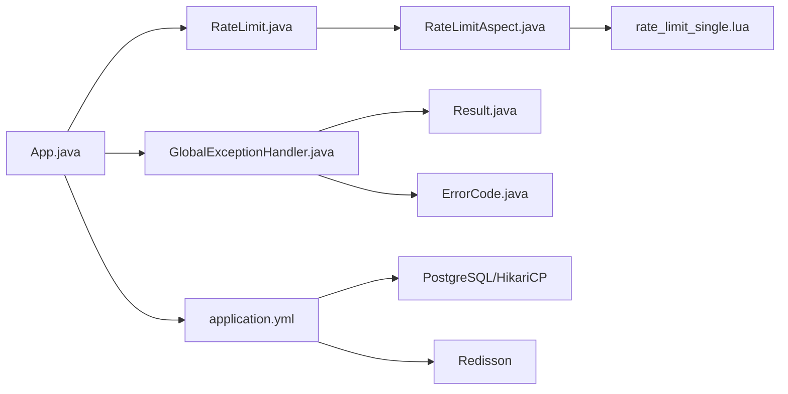

# Spring Boot应用调试

<cite>
**本文引用的文件**
- [App.java](file://app/src/main/java/interview/guide/App.java)
- [application.yml](file://app/src/main/resources/application.yml)
- [logback-spring.xml](file://app/src/main/resources/logback-spring.xml)
- [GlobalExceptionHandler.java](file://app/src/main/java/interview/guide/common/exception/GlobalExceptionHandler.java)
- [BusinessException.java](file://app/src/main/java/interview/guide/common/exception/BusinessException.java)
- [ErrorCode.java](file://app/src/main/java/interview/guide/common/exception/ErrorCode.java)
- [Result.java](file://app/src/main/java/interview/guide/common/result/Result.java)
- [RateLimit.java](file://app/src/main/java/interview/guide/common/annotation/RateLimit.java)
- [RateLimitAspect.java](file://app/src/main/java/interview/guide/common/aspect/RateLimitAspect.java)
- [rate_limit_single.lua](file://app/src/main/resources/scripts/rate_limit_single.lua)
- [application-test.yml](file://app/src/test/resources/application-test.yml)
- [RateLimitExceededExceptionTest.java](file://app/src/test/java/interview/guide/common/exception/RateLimitExceededExceptionTest.java)
- [RateLimitScriptTest.java](file://app/src/test/java/interview/guide/common/aspect/RateLimitScriptTest.java)
- [RateLimitIntegrationTest.java](file://app/src/test/java/interview/guide/common/aspect/RateLimitIntegrationTest.java)
</cite>

## 目录
1. [简介](#简介)
2. [项目结构](#项目结构)
3. [核心组件](#核心组件)
4. [架构总览](#架构总览)
5. [详细组件分析](#详细组件分析)
6. [依赖分析](#依赖分析)
7. [性能考虑](#性能考虑)
8. [故障排查指南](#故障排查指南)
9. [结论](#结论)
10. [附录](#附录)

## 简介
本指南面向面试指南平台的Spring Boot应用，聚焦于开发与运维过程中的调试实践，涵盖远程调试配置（IDEA/Eclipse）、JVM参数建议、断点技巧；日志系统（Logback配置、动态级别调整、结构化日志）；全局异常处理器调试；AOP切面（注解拦截、参数传递、返回值处理）；以及数据库连接、事务、缓存（Redis）相关的实用调试技巧。目标是帮助开发者快速定位问题、稳定线上运行。

## 项目结构
应用采用标准Spring Boot多模块布局，核心代码位于 app/src/main/java，资源配置位于 app/src/main/resources。关键调试相关配置集中在：
- 应用主入口与调度启用：App.java
- 全局配置与连接池、虚拟线程、OpenAPI等：application.yml
- 日志编码与基础配置：logback-spring.xml
- 全局异常处理：common.exception
- 限流注解与AOP切面：common.annotation 与 common.aspect
- 限流Lua脚本：resources/scripts/rate_limit_single.lua
- 测试配置与单元/集成测试：src/test

图表来源
- [App.java:1-19](file://app/src/main/java/interview/guide/App.java#L1-L19)
- [application.yml:1-282](file://app/src/main/resources/application.yml#L1-L282)
- [logback-spring.xml:1-11](file://app/src/main/resources/logback-spring.xml#L1-L11)
- [GlobalExceptionHandler.java:1-161](file://app/src/main/java/interview/guide/common/exception/GlobalExceptionHandler.java#L1-L161)
- [RateLimit.java:1-120](file://app/src/main/java/interview/guide/common/annotation/RateLimit.java#L1-L120)
- [RateLimitAspect.java:1-265](file://app/src/main/java/interview/guide/common/aspect/RateLimitAspect.java#L1-L265)
- [rate_limit_single.lua:1-61](file://app/src/main/resources/scripts/rate_limit_single.lua#L1-L61)

章节来源
- [App.java:1-19](file://app/src/main/java/interview/guide/App.java#L1-L19)
- [application.yml:1-282](file://app/src/main/resources/application.yml#L1-L282)

## 核心组件
- 应用入口与调度：启用调度注解，便于定时任务与异步流程调试。
- 全局异常处理：集中捕获业务异常、参数校验异常、AI服务异常、网络异常等，并统一返回业务错误码与消息。
- 限流注解与AOP：基于Redisson的Lua脚本实现滑动窗口限流，支持多维度（全局/IP/用户）与可选降级方法。
- 日志系统：固定UTF-8编码，结合Spring Boot默认基础配置，保证终端与文件日志一致性。
- 数据库与缓存：PostgreSQL + HikariCP连接池；Redisson单机配置用于限流与缓存。

章节来源
- [App.java:11-18](file://app/src/main/java/interview/guide/App.java#L11-L18)
- [GlobalExceptionHandler.java:20-161](file://app/src/main/java/interview/guide/common/exception/GlobalExceptionHandler.java#L20-L161)
- [RateLimit.java:11-120](file://app/src/main/java/interview/guide/common/annotation/RateLimit.java#L11-L120)
- [RateLimitAspect.java:27-265](file://app/src/main/java/interview/guide/common/aspect/RateLimitAspect.java#L27-L265)
- [logback-spring.xml:1-11](file://app/src/main/resources/logback-spring.xml#L1-L11)
- [application.yml:48-98](file://app/src/main/resources/application.yml#L48-L98)

## 架构总览
以下序列图展示一次典型请求从进入应用到返回的路径，重点标注异常处理与限流拦截的关键节点。

图表来源
- [RateLimitAspect.java:66-90](file://app/src/main/java/interview/guide/common/aspect/RateLimitAspect.java#L66-L90)
- [RateLimitAspect.java:92-126](file://app/src/main/java/interview/guide/common/aspect/RateLimitAspect.java#L92-L126)
- [GlobalExceptionHandler.java:154-159](file://app/src/main/java/interview/guide/common/exception/GlobalExceptionHandler.java#L154-L159)
- [Result.java:10-61](file://app/src/main/java/interview/guide/common/result/Result.java#L10-L61)

## 详细组件分析

### 全局异常处理器调试
- 捕获范围：业务异常、参数校验/绑定异常、文件上传超限、非法参数、AI服务网络/调用异常、资源未找到、请求方法不支持、其他未知异常。
- 返回策略：统一返回HTTP 200，通过业务错误码与消息区分问题类型，便于前端统一处理。
- 日志记录：对业务异常与未知异常进行warn/error记录，包含关键上下文（如错误码、消息、资源路径、方法支持集合等）。
- 调试要点：
  - 在业务层抛出 BusinessException 或其子类，确保错误码与消息准确。
  - 对AI服务异常，根据异常链判断超时/握手失败/401/429等，返回相应业务码。
  - 通过浏览器/Postman/日志查看统一响应体结构，确认前后端约定一致。

图表来源
- [GlobalExceptionHandler.java:28-159](file://app/src/main/java/interview/guide/common/exception/GlobalExceptionHandler.java#L28-L159)
- [ErrorCode.java:11-81](file://app/src/main/java/interview/guide/common/exception/ErrorCode.java#L11-L81)
- [Result.java:39-53](file://app/src/main/java/interview/guide/common/result/Result.java#L39-L53)

章节来源
- [GlobalExceptionHandler.java:20-161](file://app/src/main/java/interview/guide/common/exception/GlobalExceptionHandler.java#L20-L161)
- [BusinessException.java:1-50](file://app/src/main/java/interview/guide/common/exception/BusinessException.java#L1-L50)
- [ErrorCode.java:11-81](file://app/src/main/java/interview/guide/common/exception/ErrorCode.java#L11-L81)
- [Result.java:10-61](file://app/src/main/java/interview/guide/common/result/Result.java#L10-L61)

### AOP切面与限流调试
- 注解维度：支持GLOBAL/IP/USER三类维度，可重复注解实现多规则组合。
- 切面逻辑：环绕通知拦截带注解的方法，逐条规则计算key并调用Redis Lua脚本，任一规则不通过即触发降级或抛出限流异常。
- Lua脚本：基于滑动时间窗口的原子限流，维护令牌桶与过期回收，设置合理过期时间。
- 调试要点：
  - 断点位置：around方法入口、executeRateLimitScript、handleRateLimitExceeded。
  - 关键变量：className/methodName、key维度、intervalMs、count、requestId。
  - 降级方法：fallback方法签名需与原方法一致或无参，注意反射调用与参数传递。
  - Redis脚本：关注NOSCRIPT重载与evalSha失败重试逻辑。

图表来源
- [RateLimit.java:30-120](file://app/src/main/java/interview/guide/common/annotation/RateLimit.java#L30-L120)
- [RateLimitAspect.java:35-265](file://app/src/main/java/interview/guide/common/aspect/RateLimitAspect.java#L35-L265)
- [RateLimitExceededException.java:1-22](file://app/src/main/java/interview/guide/common/exception/RateLimitExceededException.java#L1-L22)
- [BusinessException.java:1-50](file://app/src/main/java/interview/guide/common/exception/BusinessException.java#L1-L50)
- [Result.java:10-61](file://app/src/main/java/interview/guide/common/result/Result.java#L10-L61)
- [ErrorCode.java:11-81](file://app/src/main/java/interview/guide/common/exception/ErrorCode.java#L11-L81)

章节来源
- [RateLimit.java:11-120](file://app/src/main/java/interview/guide/common/annotation/RateLimit.java#L11-L120)
- [RateLimitAspect.java:66-213](file://app/src/main/java/interview/guide/common/aspect/RateLimitAspect.java#L66-L213)
- [rate_limit_single.lua:1-61](file://app/src/main/resources/scripts/rate_limit_single.lua#L1-L61)

### 日志系统调试
- 编码统一：logback-spring.xml显式设置控制台与文件UTF-8，避免Windows环境下GBK导致的中文乱码。
- 动态级别调整：可通过application.yml或外部日志配置在不重启情况下调整包级别（如com.example.module: DEBUG）。
- 结构化日志：建议在业务关键路径增加MDC（如traceId、userId）以便串联请求链路；结合统一响应体结构化输出，便于检索与告警。

章节来源
- [logback-spring.xml:1-11](file://app/src/main/resources/logback-spring.xml#L1-L11)
- [application.yml:4-8](file://app/src/main/resources/application.yml#L4-L8)

### 数据库连接与事务调试
- 连接池：HikariCP在application.yml中配置最大池大小、空闲连接、超时与生命周期，适配虚拟线程场景。
- Hibernate：show-sql关闭，format_sql开启，batch批量插入/更新优化，open-in-view关闭避免虚拟线程占用数据库连接。
- 调试要点：
  - 使用慢查询日志与SQL格式化辅助定位性能瓶颈。
  - 事务边界清晰，避免跨事务持有数据库连接；必要时使用只读事务。
  - 测试环境使用内存数据库（H2）与自动建模，便于快速回归。

章节来源
- [application.yml:48-78](file://app/src/main/resources/application.yml#L48-L78)
- [application-test.yml:4-47](file://app/src/test/resources/application-test.yml#L4-L47)

### 缓存与Redis调试
- Redisson：单机配置，连接池与订阅连接池参数可调；限流脚本预加载与SHA缓存丢失重载。
- 调试要点：
  - 关注NOSCRIPT异常并自动重载脚本。
  - 使用Redis命令查看限流键空间（如value/permits集合与过期时间）。
  - 降级方法触发时，检查fallback方法签名与参数传递。

章节来源
- [application.yml:86-98](file://app/src/main/resources/application.yml#L86-L98)
- [RateLimitAspect.java:52-61](file://app/src/main/java/interview/guide/common/aspect/RateLimitAspect.java#L52-L61)
- [RateLimitAspect.java:111-125](file://app/src/main/java/interview/guide/common/aspect/RateLimitAspect.java#L111-L125)

## 依赖分析
- 组件耦合：
  - RateLimitAspect依赖RedissonClient与Lua脚本；与RateLimit注解强耦合。
  - GlobalExceptionHandler依赖Result与ErrorCode，向上游业务暴露统一错误语义。
  - 应用入口启用调度，便于异步与定时任务调试。
- 外部依赖：
  - PostgreSQL/HikariCP、Redisson、Spring AI DashScope、OpenAPI/Swagger。

图表来源
- [App.java:11-18](file://app/src/main/java/interview/guide/App.java#L11-L18)
- [application.yml:48-98](file://app/src/main/resources/application.yml#L48-L98)
- [GlobalExceptionHandler.java:20-161](file://app/src/main/java/interview/guide/common/exception/GlobalExceptionHandler.java#L20-L161)
- [RateLimit.java:30-120](file://app/src/main/java/interview/guide/common/annotation/RateLimit.java#L30-L120)
- [RateLimitAspect.java:35-265](file://app/src/main/java/interview/guide/common/aspect/RateLimitAspect.java#L35-L265)
- [rate_limit_single.lua:1-61](file://app/src/main/resources/scripts/rate_limit_single.lua#L1-L61)
- [Result.java:10-61](file://app/src/main/java/interview/guide/common/result/Result.java#L10-L61)
- [ErrorCode.java:11-81](file://app/src/main/java/interview/guide/common/exception/ErrorCode.java#L11-L81)

## 性能考虑
- 虚拟线程：启用spring.threads.virtual.enabled，显著提升I/O密集型并发（AI调用、SSE长连接）。
- 连接池：HikariCP适度池大小，避免过多连接竞争；开启批处理与顺序优化。
- 限流：Lua脚本原子执行，避免热点key竞争；合理设置维度与窗口，降低Redis压力。
- 日志：控制台与文件UTF-8统一，避免编码转换开销；生产环境谨慎使用DEBUG级别。

章节来源
- [application.yml:42-47](file://app/src/main/resources/application.yml#L42-L47)
- [application.yml:54-61](file://app/src/main/resources/application.yml#L54-L61)

## 故障排查指南

### 远程调试配置
- IDEA远程调试：
  - VM参数：添加 JVM 参数以启用远程调试（端口、暂停策略等），在运行配置中选择“远程”模式，连接本地或容器内进程。
  - 断点技巧：在控制器、全局异常处理器、限流切面关键方法处设置条件断点（如userId/IP/请求ID），结合日志快速定位。
- Eclipse远程调试：
  - 同样通过VM参数启用调试监听，使用Debug配置连接目标进程。
- 常见问题：
  - 端口冲突：修改调试端口或停止占用进程。
  - 类路径问题：确保打包包含调试符号，或使用IDE内置运行配置。

### 日志系统调试
- 中文乱码：确认logback-spring.xml中charset为UTF-8，避免Windows默认GBK影响。
- 动态级别：在application.yml中临时提高特定包级别（如DEBUG）观察细节，再恢复默认。
- 结构化：在关键业务入口设置MDC（traceId、userId），配合统一响应体结构化输出，便于链路追踪。

章节来源
- [logback-spring.xml:1-11](file://app/src/main/resources/logback-spring.xml#L1-L11)
- [application.yml:4-8](file://app/src/main/resources/application.yml#L4-L8)

### 全局异常处理器调试
- 业务异常：确保抛出 BusinessException 并携带正确错误码；在处理器中核对warn/error日志与响应体。
- AI服务异常：区分超时、握手失败、401/429等，返回相应业务码；在调用方做好重试与降级策略。
- 未知异常：统一记录error日志，避免泄露敏感信息；返回通用内部错误码。

章节来源
- [GlobalExceptionHandler.java:28-159](file://app/src/main/java/interview/guide/common/exception/GlobalExceptionHandler.java#L28-L159)
- [ErrorCode.java:11-81](file://app/src/main/java/interview/guide/common/exception/ErrorCode.java#L11-L81)

### AOP切面与限流调试
- 注解拦截：确认方法上存在@RateLimit或容器注解，检查多规则组合是否满足“任一不通过即拒绝”的语义。
- 参数与返回：在around入口断点检查joinPoint签名、参数与返回类型；在handleRateLimitExceeded断点检查降级分支。
- Redis脚本：关注NOSCRIPT重载与evalSha失败重试；使用Redis命令查看value/permits集合与过期时间。

章节来源
- [RateLimitAspect.java:66-213](file://app/src/main/java/interview/guide/common/aspect/RateLimitAspect.java#L66-L213)
- [rate_limit_single.lua:1-61](file://app/src/main/resources/scripts/rate_limit_single.lua#L1-L61)

### 数据库连接与事务调试
- 连接池：检查maximum-pool-size、connection-timeout、idle-timeout、max-lifetime；结合慢查询与SQL格式化定位问题。
- 事务：避免跨事务持有连接；必要时使用只读事务；测试环境使用H2自动建模。
- 回滚：在异常路径确保事务回滚；在全局异常处理器中统一返回，避免状态不一致。

章节来源
- [application.yml:54-61](file://app/src/main/resources/application.yml#L54-L61)
- [application-test.yml:4-18](file://app/src/test/resources/application-test.yml#L4-L18)

### 缓存失效与限流调试
- 缓存键空间：使用Redis命令查看限流键（如value/permits集合），确认过期时间与回收逻辑。
- 降级方法：确保fallback方法签名与原方法一致或无参；在handleRateLimitExceeded断点观察降级分支。
- 集成测试：准备Redis服务，运行集成测试用例验证多规则、独立计数与脚本重载逻辑。

章节来源
- [RateLimitIntegrationTest.java:36-159](file://app/src/test/java/interview/guide/common/aspect/RateLimitIntegrationTest.java#L36-L159)
- [RateLimitScriptTest.java:18-87](file://app/src/test/java/interview/guide/common/aspect/RateLimitScriptTest.java#L18-L87)
- [RateLimitExceededExceptionTest.java:11-58](file://app/src/test/java/interview/guide/common/exception/RateLimitExceededExceptionTest.java#L11-L58)

## 结论
通过统一的异常处理、可配置的限流策略、完善的日志与数据库/缓存配置，面试指南平台具备良好的可调试性与稳定性。建议在开发与测试阶段充分利用断点、日志与集成测试，在生产环境保持合理的日志级别与监控告警，确保问题可定位、可恢复。

## 附录

### 关键配置清单（调试相关）
- 应用端口与虚拟线程：application.yml
- 日志编码：logback-spring.xml
- 数据库/HikariCP：application.yml
- Redisson：application.yml
- 测试数据库/Redis：application-test.yml

章节来源
- [application.yml:9-24](file://app/src/main/resources/application.yml#L9-L24)
- [application.yml:42-47](file://app/src/main/resources/application.yml#L42-L47)
- [application.yml:48-98](file://app/src/main/resources/application.yml#L48-L98)
- [logback-spring.xml:4-8](file://app/src/main/resources/logback-spring.xml#L4-L8)
- [application-test.yml:4-26](file://app/src/test/resources/application-test.yml#L4-L26)