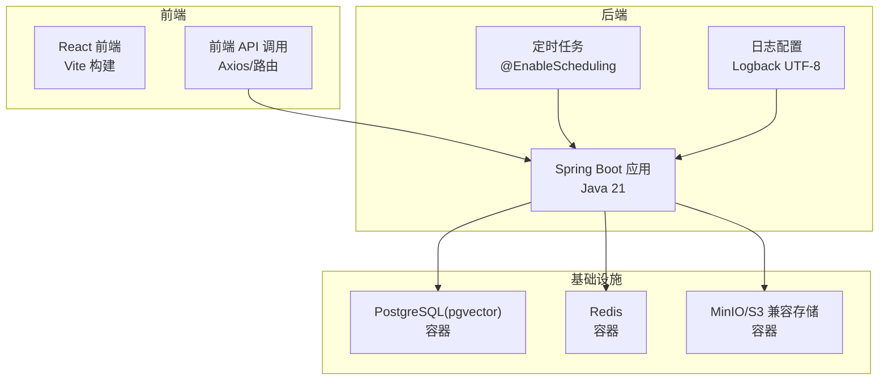
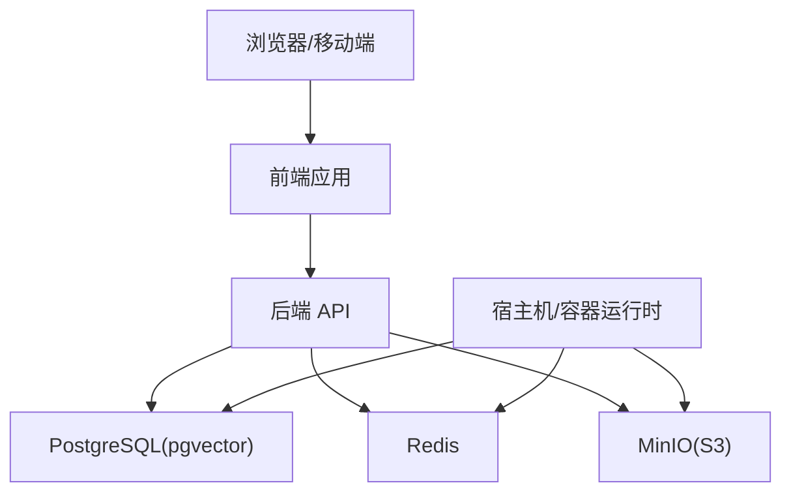
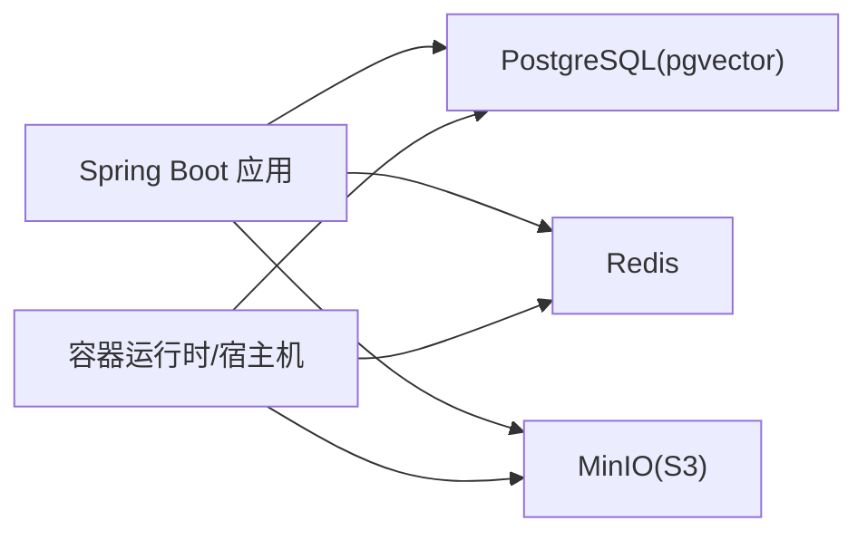

# 内存分析和性能监控

<cite>
**本文档引用的文件**
- [app/build.gradle](file://app/build.gradle)
- [docker-compose.yml](file://docker-compose.yml)
- [docker-compose.dev.yml](file://docker-compose.dev.yml)
- [app/src/main/resources/logback-spring.xml](file://app/src/main/resources/logback-spring.xml)
- [app/src/main/java/interview/guide/App.java](file://app/src/main/java/interview/guide/App.java)
- [docs/superpowers/plans/2026-05-12-rag-search-optimization.md](file://docs/superpowers/plans/2026-05-12-rag-search-optimization.md)
- [app/src/main/resources/skills/_shared/references/java.md](file://app/src/main/resources/skills/_shared/references/java.md)
- [app/src/main/resources/skills/_shared/references/browser.md](file://app/src/main/resources/skills/_shared/references/browser.md)
- [frontend/package.json](file://frontend/package.json)
- [frontend/src/hooks/useInterviewConfig.ts](file://frontend/src/hooks/useInterviewConfig.ts)
</cite>

## 目录
1. [简介](#简介)
2. [项目结构](#项目结构)
3. [核心组件](#核心组件)
4. [架构总览](#架构总览)
5. [详细组件分析](#详细组件分析)
6. [依赖关系分析](#依赖关系分析)
7. [性能考量](#性能考量)
8. [故障排查指南](#故障排查指南)
9. [结论](#结论)
10. [附录](#附录)

## 简介
本指南面向“面试指南平台”的内存分析与性能监控实践，覆盖以下关键领域：
- Java 应用内存分析：Heap Dump 生成与分析、GC 日志采集与解读、内存泄漏检测方法
- JVM 性能监控工具实战：jstat、jmap、jstack、VisualVM 等
- 前端内存分析：Chrome DevTools 内存面板、堆快照对比、分配时间线、内存泄漏检测与大对象分析
- Docker 容器资源监控：CPU 使用率、内存占用、网络 IO 监控
- 系统级性能分析：操作系统层面的性能瓶颈识别、磁盘 I/O 分析、网络性能监控
- 性能基准测试：方法论与工具链集成

## 项目结构
平台采用前后端分离架构，后端基于 Spring Boot 4.0 + Java 21，前端基于 React/Vite，通过 Docker Compose 编排 PostgreSQL、Redis、MinIO 等基础设施。

图表来源
- [docker-compose.yml:13-171](file://docker-compose.yml#L13-L171)
- [app/src/main/java/interview/guide/App.java:11-17](file://app/src/main/java/interview/guide/App.java#L11-L17)
- [app/src/main/resources/logback-spring.xml:1-11](file://app/src/main/resources/logback-spring.xml#L1-L11)

章节来源
- [docker-compose.yml:1-197](file://docker-compose.yml#L1-L197)
- [app/build.gradle:1-136](file://app/build.gradle#L1-L136)
- [frontend/package.json:1-47](file://frontend/package.json#L1-L47)

## 核心组件
- 后端应用入口与调度：主启动类启用调度，便于周期性任务与指标采集
- 日志系统：统一字符集配置，避免控制台乱码
- 基础设施编排：数据库、缓存、对象存储均以容器形式提供，便于监控与压测
- 前端运行时：React 生态，支持性能与内存分析工具链

章节来源
- [app/src/main/java/interview/guide/App.java:11-17](file://app/src/main/java/interview/guide/App.java#L11-L17)
- [app/src/main/resources/logback-spring.xml:1-11](file://app/src/main/resources/logback-spring.xml#L1-L11)
- [docker-compose.yml:13-171](file://docker-compose.yml#L13-L171)

## 架构总览
下图展示平台整体运行时拓扑及监控关注点：

图表来源
- [docker-compose.yml:13-171](file://docker-compose.yml#L13-L171)

## 详细组件分析

### Java 应用内存分析与 GC 日志
- Heap Dump 生成与分析
  - 生成：在高内存压力或 OOM 场景下，可通过 JVM 参数触发堆转储；结合容器进程信号进行远程触发
  - 分析：使用 Eclipse MAT/VisualVM 等工具对比不同时间点的堆快照，定位不可回收对象与增长趋势
- GC 日志采集与解读
  - 开启 GC 日志：通过 JVM 参数记录 GC 时间线、停顿原因与回收效果
  - 关注指标：Young GC/Mixed GC 频率、晋升失败、Full GC 次数与停顿
- 内存泄漏检测
  - 方法：对比堆快照、观察长时间运行后的对象存活曲线、确认引用链是否被正确释放
  - 关键路径：服务端定时任务、缓存清理、流式处理与异步队列消费

章节来源
- [app/src/main/resources/skills/_shared/references/java.md:44-46](file://app/src/main/resources/skills/_shared/references/java.md#L44-L46)

### JVM 性能监控工具实战
- jstat：查看 GC 统计、内存区使用率、吞吐量
- jmap：生成堆快照、查看堆摘要、查看对象分布
- jstack：导出线程栈，定位死锁、长时间阻塞与热点线程
- VisualVM/JMC：图形化聚合 CPU/内存/GC/线程视图，辅助定位热点与泄漏

章节来源
- [app/src/main/resources/skills/_shared/references/java.md:25-46](file://app/src/main/resources/skills/_shared/references/java.md#L25-L46)

### 前端内存分析（Chrome DevTools）
- 内存面板使用
  - 堆快照对比：捕获不同阶段的堆快照，比较对象数量与大小变化
  - 分配时间线：观察对象分配随时间的变化，定位异常增长
- 内存泄漏检测
  - 保留集分析：确认对象是否仍被活跃引用持有
  - 事件监听器与闭包：排查未解绑的监听器与长生命周期缓存
- 大对象分析
  - 图片/视频/Canvas 数据：检查二进制缓冲区与 DOM 节点大小
  - 虚拟列表/分页：避免一次性渲染过多节点导致峰值内存过高

章节来源
- [app/src/main/resources/skills/_shared/references/browser.md:27-38](file://app/src/main/resources/skills/_shared/references/browser.md#L27-L38)

### Docker 容器资源监控
- CPU 使用率
  - 使用 docker stats 或 Prometheus + cAdvisor 抓取容器 CPU 使用率、负载与节流情况
- 内存占用
  - 观察容器内存使用、限制与 swap 使用，结合 GC 日志判断是否由 JVM 侧内存压力引起
- 网络 IO
  - 通过容器网络统计或系统层面 netstat/ss 查看连接数、带宽与丢包

章节来源
- [docker-compose.yml:13-171](file://docker-compose.yml#L13-L171)

### 系统级性能分析
- 磁盘 I/O 分析
  - 使用 iostat/iotop 查看读写延迟与争用；关注数据库 WAL 与缓存命中
- 网络性能监控
  - 结合容器网络与宿主机网络统计，定位慢请求与连接抖动
- 宿主机资源瓶颈
  - CPU/内存/磁盘/网络四维监控，结合容器资源限制与隔离策略

[本节为通用指导，不直接分析具体文件]

### 性能基准测试方法与工具
- 方法论
  - 明确目标平台与硬件规格，设定帧率/内存/加载时间等指标阈值
  - 设计压力场景（高并发、大数据量、复杂计算）与回归基线
- 工具链
  - 前端：Lighthouse、WebPageTest、Chrome Performance/内存面板
  - 后端：JMH、Gatling、k6、Prometheus + Grafana
  - 容器：cAdvisor、Node Exporter、系统监控

[本节为通用指导，不直接分析具体文件]

## 依赖关系分析

图表来源
- [docker-compose.yml:13-171](file://docker-compose.yml#L13-L171)

章节来源
- [docker-compose.yml:13-171](file://docker-compose.yml#L13-L171)

## 性能考量
- JVM 层面
  - 合理设置堆大小与 GC 策略，避免 Full GC 频繁发生
  - 监控线程池与异步任务，防止阻塞与饥饿
- 前端层面
  - 代码分割与懒加载，减少首屏内存峰值
  - 避免全局状态无限增长，定期清理无用引用
- 基础设施层面
  - 数据库连接池与查询优化，避免慢查询引发的线程堆积
  - 缓存命中率与过期策略，降低后端压力

[本节为通用指导，不直接分析具体文件]

## 故障排查指南
- 后端指标采集
  - 使用 Micrometer 记录查询耗时与热门查询，辅助定位慢查询与热点
- 日志与字符集
  - 统一 UTF-8 字符集，避免控制台乱码影响问题定位
- 定时任务与资源
  - 启用调度便于周期性采样与清理，避免长时间运行导致的资源累积

章节来源
- [docs/superpowers/plans/2026-05-12-rag-search-optimization.md:825-866](file://docs/superpowers/plans/2026-05-12-rag-search-optimization.md#L825-L866)
- [app/src/main/resources/logback-spring.xml:1-11](file://app/src/main/resources/logback-spring.xml#L1-L11)
- [app/src/main/java/interview/guide/App.java:11-17](file://app/src/main/java/interview/guide/App.java#L11-L17)

## 结论
通过将 JVM 内存分析、前端内存诊断、容器资源监控与系统级性能观测相结合，可以形成闭环的性能保障体系。建议在开发与测试阶段持续集成基准测试与监控告警，在生产环境建立快速定位与恢复机制。

[本节为总结性内容，不直接分析具体文件]

## 附录

### 前端性能与内存分析要点（基于仓库前端配置）
- 依赖生态：React、Vite、Axios、Recharts 等，注意第三方库的内存占用与打包体积
- Hook 使用：避免在 useEffect 中累积副作用，及时清理订阅与定时器
- API 调用：统一错误处理与重试策略，防止重复请求导致的内存压力

章节来源
- [frontend/package.json:11-28](file://frontend/package.json#L11-L28)
- [frontend/src/hooks/useInterviewConfig.ts:70-121](file://frontend/src/hooks/useInterviewConfig.ts#L70-L121)