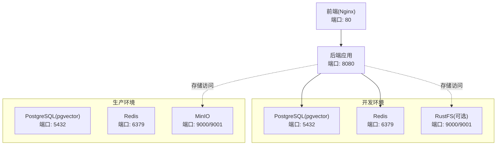
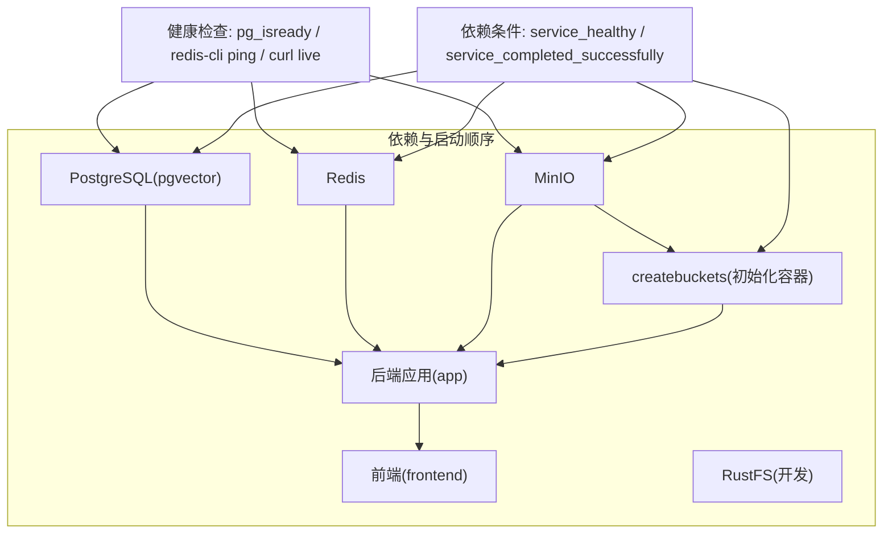
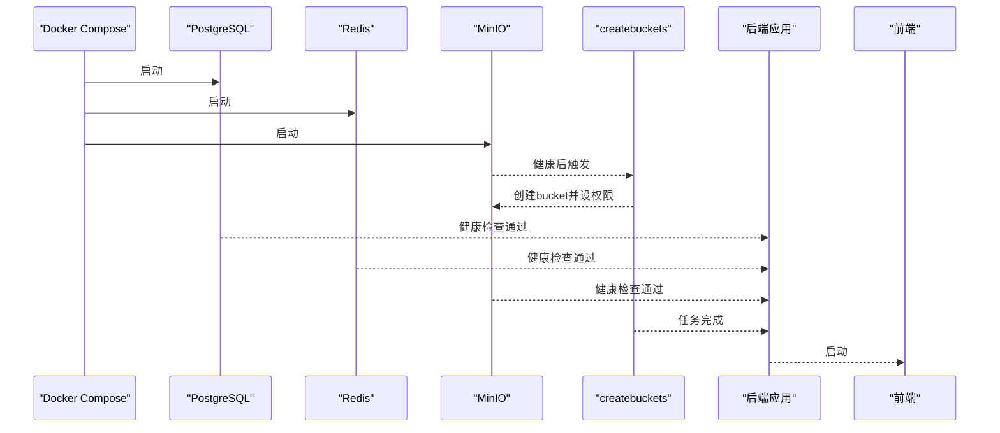

# 容器和Docker调试

<cite>
**本文引用的文件**
- [docker-compose.yml](file://docker-compose.yml)
- [docker-compose.dev.yml](file://docker-compose.dev.yml)
- [frontend/Dockerfile](file://frontend/Dockerfile)
- [app/build.gradle](file://app/build.gradle)
- [app/src/main/java/interview/guide/App.java](file://app/src/main/java/interview/guide/App.java)
- [app/src/main/resources/logback-spring.xml](file://app/src/main/resources/logback-spring.xml)
- [frontend/nginx.conf](file://frontend/nginx.conf)
- [docker/postgres/init.sql](file://docker/postgres/init.sql)
- [scripts/init-vibe-kit.sh](file://scripts/init-vibe-kit.sh)
- [scripts/start-bmad-workflow.sh](file://scripts/start-bmad-workflow.sh)
</cite>

## 目录
1. [简介](#简介)
2. [项目结构](#项目结构)
3. [核心组件](#核心组件)
4. [架构总览](#架构总览)
5. [详细组件分析](#详细组件分析)
6. [依赖分析](#依赖分析)
7. [性能考虑](#性能考虑)
8. [故障排查指南](#故障排查指南)
9. [结论](#结论)
10. [附录](#附录)

## 简介
本指南面向面试指南平台的容器与Docker调试实践，覆盖容器日志查看、进程分析、文件系统检查、网络连接诊断；Docker Compose服务依赖、启动顺序、健康检查与配置验证；容器资源监控（CPU、内存、磁盘、网络IO）；容器间通信调试（服务发现、负载均衡、数据交换、状态同步）；容器安全调试（权限、网络安全、数据加密、访问控制）；以及容器性能优化调试（镜像优化、启动时间优化、资源使用优化）。文档以平台现有Compose与多阶段构建配置为基础，提供可落地的调试方法与最佳实践。

## 项目结构
平台采用多服务编排，包含数据库（PostgreSQL+pgvector）、缓存与消息队列（Redis）、对象存储（MinIO）、后端应用（Spring Boot）、前端（Nginx反向代理）。开发环境提供替代对象存储（RustFS）以适配不同场景。

图表来源
- [docker-compose.yml:13-197](file://docker-compose.yml#L13-L197)
- [docker-compose.dev.yml:7-64](file://docker-compose.dev.yml#L7-L64)

章节来源
- [docker-compose.yml:1-197](file://docker-compose.yml#L1-L197)
- [docker-compose.dev.yml:1-64](file://docker-compose.dev.yml#L1-L64)

## 核心组件
- 数据库服务（PostgreSQL + pgvector）
  - 作用：持久化业务数据与向量数据，支撑RAG检索。
  - 健康检查：使用pg_isready探测数据库就绪状态。
  - 初始化：通过init.sql启用vector扩展。
- 缓存与消息队列（Redis）
  - 作用：会话缓存、临时数据与异步任务（Stream）。
  - 健康检查：redis-cli ping。
- 对象存储（MinIO）
  - 作用：S3兼容的对象存储，承载简历、头像等非结构化数据。
  - 健康检查：curl探测live接口。
  - 初始化容器：mc客户端自动创建bucket并设置公开读。
- 后端应用（Spring Boot）
  - 作用：REST API、业务逻辑、AI集成、异步任务处理。
  - 端口：8080。
- 前端（Nginx）
  - 作用：静态资源托管、SPA路由回退、API反向代理。
  - 端口：80。
- 开发环境替代存储（RustFS）
  - 作用：本地开发替代MinIO，提供S3兼容接口与Web控制台。

章节来源
- [docker-compose.yml:13-197](file://docker-compose.yml#L13-L197)
- [docker-compose.dev.yml:7-64](file://docker-compose.dev.yml#L7-L64)
- [docker/postgres/init.sql:1-2](file://docker/postgres/init.sql#L1-L2)

## 架构总览
下图展示容器间的依赖关系、启动顺序与健康检查策略，帮助定位启动失败、依赖缺失与网络连通性问题。

图表来源
- [docker-compose.yml:13-197](file://docker-compose.yml#L13-L197)
- [docker-compose.dev.yml:7-64](file://docker-compose.dev.yml#L7-L64)

章节来源
- [docker-compose.yml:13-197](file://docker-compose.yml#L13-L197)
- [docker-compose.dev.yml:7-64](file://docker-compose.dev.yml#L7-L64)

## 详细组件分析

### 数据库服务（PostgreSQL + pgvector）
- 健康检查
  - 使用pg_isready检测数据库可用性，间隔与超时可调。
- 初始化
  - 通过init.sql启用vector扩展，满足RAG向量检索需求。
- 调试要点
  - 启动慢：检查pg_isready探测频率与重试次数；确认数据卷挂载与初始化脚本执行。
  - 连接失败：核对容器网络、端口映射、凭据与数据库名。

章节来源
- [docker-compose.yml:13-36](file://docker-compose.yml#L13-L36)
- [docker/postgres/init.sql:1-2](file://docker/postgres/init.sql#L1-L2)

### 缓存与消息队列（Redis）
- 健康检查
  - 使用redis-cli ping，快速判断实例健康。
- 调试要点
  - 内存不足：观察内存峰值与淘汰策略；检查Stream堆积。
  - 性能瓶颈：关注慢查询与阻塞命令。

章节来源
- [docker-compose.yml:47-59](file://docker-compose.yml#L47-L59)

### 对象存储（MinIO）与初始化容器
- MinIO
  - 端口：9000（API）、9001（控制台）。
  - 健康检查：curl探测live接口。
- 初始化容器（createbuckets）
  - 通过mc客户端在MinIO启动后自动创建bucket并设置公开读。
  - 依赖条件：等待MinIO健康后执行。
- 调试要点
  - 控制台不可用：确认9001端口映射与防火墙。
  - Bucket不存在：检查初始化容器日志与mc alias配置。
  - 权限问题：确认匿名读策略是否生效。

章节来源
- [docker-compose.yml:72-117](file://docker-compose.yml#L72-L117)

### 后端应用（Spring Boot）
- 启动与入口
  - 主类位于App.java，启用调度以便后台任务。
- 日志配置
  - logback-spring.xml固定控制台与文件字符集为UTF-8，避免中文乱码。
- 端口与环境
  - 暴露8080端口；通过环境变量配置数据库、Redis与对象存储连接。
- 调试要点
  - 启动顺序：依赖PostgreSQL、Redis、MinIO健康与初始化容器成功。
  - 日志：优先查看容器日志与后端日志级别；结合UTF-8配置避免乱码。
  - 端口冲突：确认8080未被占用。

章节来源
- [app/src/main/java/interview/guide/App.java:1-19](file://app/src/main/java/interview/guide/App.java#L1-L19)
- [app/src/main/resources/logback-spring.xml:1-11](file://app/src/main/resources/logback-spring.xml#L1-L11)
- [docker-compose.yml:125-171](file://docker-compose.yml#L125-L171)

### 前端（Nginx）
- 多阶段构建
  - 第一阶段：Node.js安装依赖并构建；第二阶段：Nginx托管静态资源。
- 反向代理
  - 将/api/请求代理至后端8080端口；设置超时以适配长请求。
- 调试要点
  - SPA路由404：确认try_files回退至index.html。
  - 代理失败：检查Nginx日志与后端可达性。

章节来源
- [frontend/Dockerfile:1-44](file://frontend/Dockerfile#L1-L44)
- [frontend/nginx.conf:1-32](file://frontend/nginx.conf#L1-L32)

### 开发环境替代存储（RustFS）
- 作用：替代MinIO，提供S3兼容接口与Web控制台。
- 端口：9000（API）、9001（控制台）。
- 健康检查：TCP端口探测。
- 调试要点
  - 首次使用：通过控制台创建bucket并设置权限。
  - 与后端联调：确认APP_STORAGE_ENDPOINT指向RustFS。

章节来源
- [docker-compose.dev.yml:38-56](file://docker-compose.dev.yml#L38-L56)

## 依赖分析
- 服务依赖
  - app依赖PostgreSQL、Redis、MinIO健康；依赖初始化容器成功。
  - frontend依赖app启动。
- 启动顺序
  - 数据库与缓存优先；对象存储随后；初始化容器最后；应用再后；前端最后。
- 健康检查
  - 三类健康检查分别对应数据库、缓存与对象存储，确保应用启动前基础设施可用。

图表来源
- [docker-compose.yml:13-197](file://docker-compose.yml#L13-L197)

章节来源
- [docker-compose.yml:13-197](file://docker-compose.yml#L13-L197)

## 性能考虑
- 镜像优化
  - 多阶段构建：前端使用Nginx仅托管静态资源，减少运行时体积。
  - 依赖缓存：Dockerfile中优先复制包管理清单以复用缓存层。
- 启动时间优化
  - 健康检查合理配置：避免过短间隔导致频繁探测；确保初始化脚本与数据卷准备充分。
  - 依赖顺序：先数据库/缓存，再应用，减少应用反复重试。
- 资源使用优化
  - CPU与内存：根据并发与AI请求特点调整容器资源限制与后端线程池大小。
  - 磁盘：对象存储与数据库数据卷持久化，定期清理与备份。
  - 网络IO：代理超时适当增大以适配长请求；避免不必要的跨容器重定向。

章节来源
- [frontend/Dockerfile:1-44](file://frontend/Dockerfile#L1-L44)
- [frontend/nginx.conf:19-30](file://frontend/nginx.conf#L19-L30)
- [docker-compose.yml:13-197](file://docker-compose.yml#L13-L197)

## 故障排查指南

### 容器日志查看
- 查看容器日志
  - 使用容器名称或服务名查看日志，结合时间戳定位异常。
- 日志级别与编码
  - 后端日志字符集统一为UTF-8，避免中文乱码；必要时临时提高日志级别辅助排查。

章节来源
- [app/src/main/resources/logback-spring.xml:1-11](file://app/src/main/resources/logback-spring.xml#L1-L11)

### 进程分析
- 进入容器
  - 使用交互式shell进入容器，检查进程、端口监听与网络状态。
- 健康检查失败
  - 根据健康检查命令逐项验证：数据库连接、Redis ping、MinIO live接口。

章节来源
- [docker-compose.yml:31-35](file://docker-compose.yml#L31-L35)
- [docker-compose.yml:54-58](file://docker-compose.yml#L54-L58)
- [docker-compose.yml:85-89](file://docker-compose.yml#L85-L89)

### 文件系统检查
- 数据卷与持久化
  - 确认postgres_data、redis_data、minio_data卷存在且挂载正确。
- 初始化脚本
  - 检查init.sql是否被容器入口脚本执行，确保vector扩展启用。

章节来源
- [docker-compose.yml:21-25](file://docker-compose.yml#L21-L25)
- [docker/postgres/init.sql:1-2](file://docker/postgres/init.sql#L1-L2)

### 网络连接诊断
- 端口映射
  - 确认宿主机端口与容器端口映射正确（如8080:8080、9000、9001）。
- 服务间连通
  - 使用容器内部DNS（服务名）访问其他服务；检查防火墙与安全组。
- 反向代理
  - 前端Nginx代理后端API，检查代理头与超时设置。

章节来源
- [docker-compose.yml:26-27](file://docker-compose.yml#L26-L27)
- [docker-compose.yml:80-82](file://docker-compose.yml#L80-L82)
- [frontend/nginx.conf:19-30](file://frontend/nginx.conf#L19-L30)

### Docker Compose调试
- 服务依赖与启动顺序
  - 通过depends_on与healthcheck条件控制启动顺序，避免应用过早启动。
- 健康检查
  - 调整interval、timeout与retries，平衡启动速度与稳定性。
- 配置验证
  - 环境变量（数据库、Redis、对象存储）需与后端配置一致。

章节来源
- [docker-compose.yml:130-139](file://docker-compose.yml#L130-L139)
- [docker-compose.yml:140-169](file://docker-compose.yml#L140-L169)

### 容器资源监控
- CPU与内存
  - 使用容器监控工具（如Docker stats或Prometheus）观察CPU与内存使用趋势。
- 磁盘空间
  - 定期检查数据卷与日志目录占用，清理历史日志与临时文件。
- 网络IO
  - 关注代理超时与并发请求，避免长时间阻塞导致队列积压。

章节来源
- [frontend/nginx.conf:26-30](file://frontend/nginx.conf#L26-L30)

### 容器间通信调试
- 服务发现
  - 使用Docker内部DNS通过服务名访问其他服务。
- 负载均衡
  - 平台为单实例部署，若扩展需引入外部LB与健康探针。
- 数据交换与状态同步
  - Redis用于会话与异步任务；MinIO提供对象存储；数据库负责结构化数据。

章节来源
- [docker-compose.yml:140-169](file://docker-compose.yml#L140-L169)

### 容器安全调试
- 权限检查
  - 对象存储与数据库凭据需妥善管理，避免硬编码。
- 网络安全
  - 仅暴露必要端口；控制台端口（9001）建议限制访问。
- 数据加密
  - 建议启用传输加密（TLS）与静态加密（数据库与对象存储）。
- 访问控制
  - 对象存储公开读策略需谨慎评估；必要时改为签名URL或私有访问。

章节来源
- [docker-compose.yml:77-82](file://docker-compose.yml#L77-L82)
- [docker-compose.yml:154-159](file://docker-compose.yml#L154-L159)

### 容器性能优化调试
- 镜像优化
  - 复用Docker缓存层，减少重复安装依赖；前端仅运行Nginx。
- 启动时间优化
  - 合理设置健康检查参数；确保初始化脚本与数据卷准备就绪。
- 资源使用优化
  - 根据并发与AI请求特点调整容器资源限制与后端线程池大小。

章节来源
- [frontend/Dockerfile:1-44](file://frontend/Dockerfile#L1-L44)
- [docker-compose.yml:13-197](file://docker-compose.yml#L13-L197)

## 结论
通过明确的健康检查、严格的启动顺序与完善的日志/网络/资源监控，面试指南平台可在Docker环境下稳定运行。建议在生产环境中进一步完善安全策略（加密、访问控制）与可观测性（分布式追踪、动态日志级别、指标暴露），以提升可维护性与可运营性。

## 附录
- 开发脚本
  - init-vibe-kit.sh：初始化Vibe开发环境与文档目录。
  - start-bmad-workflow.sh：BMad七步工作流启动器，指导功能开发流程。

章节来源
- [scripts/init-vibe-kit.sh:1-42](file://scripts/init-vibe-kit.sh#L1-L42)
- [scripts/start-bmad-workflow.sh:1-253](file://scripts/start-bmad-workflow.sh#L1-L253)