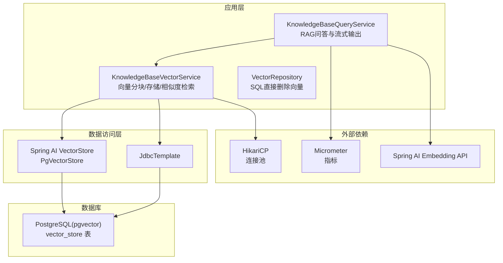
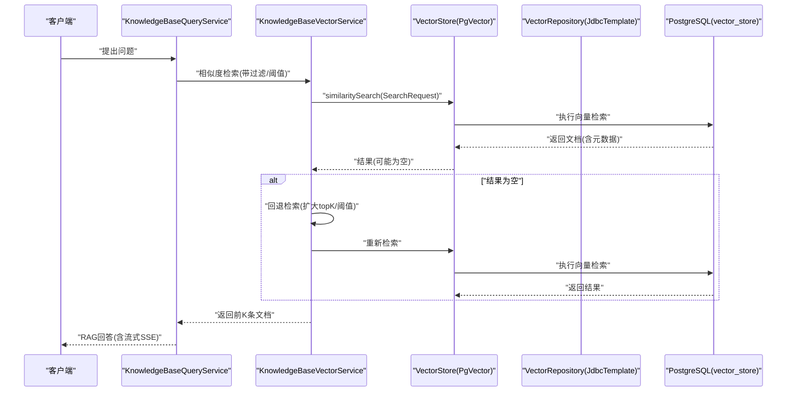
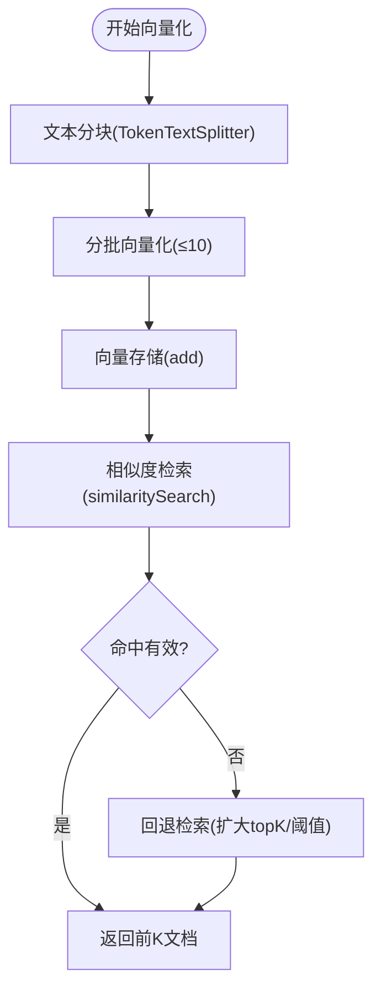
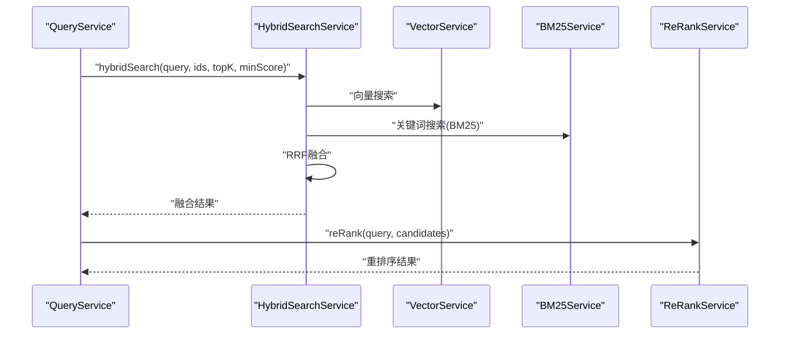
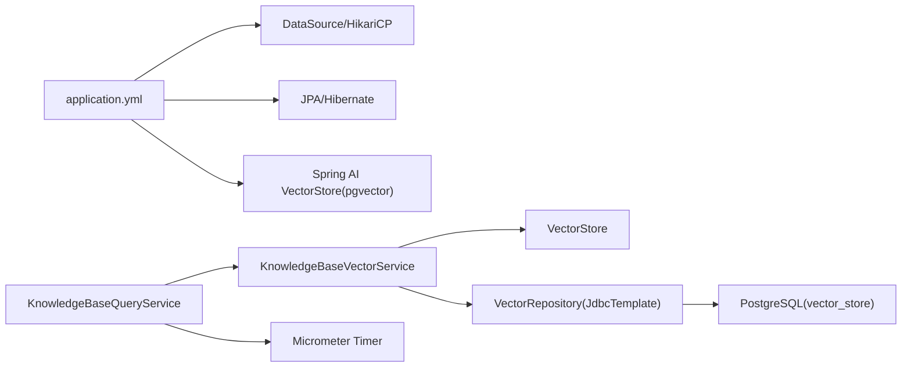

# 数据库性能分析

<cite>
**本文引用的文件**
- [docker-compose.yml](file://docker-compose.yml)
- [init.sql](file://docker/postgres/init.sql)
- [application.yml](file://app/src/main/resources/application.yml)
- [application-test.yml](file://app/src/test/resources/application-test.yml)
- [VectorRepository.java](file://app/src/main/java/interview/guide/modules/knowledgebase/repository/VectorRepository.java)
- [KnowledgeBaseVectorService.java](file://app/src/main/java/interview/guide/modules/knowledgebase/service/KnowledgeBaseVectorService.java)
- [KnowledgeBaseQueryService.java](file://app/src/main/java/interview/guide/modules/knowledgebase/service/KnowledgeBaseQueryService.java)
- [SearchMetricsService.java](file://docs/superpowers/plans/2026-05-12-rag-search-optimization.md)
- [2026-05-12-rag-search-optimization.md](file://docs/superpowers/plans/2026-05-12-rag-search-optimization.md)
- [VoiceInterviewWebSocketHandler.java](file://app/src/main/java/interview/guide/modules/voiceinterview/handler/VoiceInterviewWebSocketHandler.java)
</cite>

## 目录
1. [简介](#简介)
2. [项目结构](#项目结构)
3. [核心组件](#核心组件)
4. [架构总览](#架构总览)
5. [详细组件分析](#详细组件分析)
6. [依赖关系分析](#依赖关系分析)
7. [性能考量](#性能考量)
8. [故障排查指南](#故障排查指南)
9. [结论](#结论)
10. [附录](#附录)

## 简介
本指南面向面试指南平台的数据库性能分析与调试，聚焦以下主题：
- PostgreSQL 慢查询日志配置与分析：log_min_duration_statement、log_line_prefix、查询统计收集
- 执行计划分析：EXPLAIN/EXPLAIN ANALYZE 的使用、计划解读、索引使用情况
- 数据库连接池调试：连接数监控、超时处理、死锁检测
- pgvector 向量搜索性能优化：索引类型、相似度计算、批量操作
- 备份恢复调试、数据一致性检查、性能指标监控

平台采用 Spring Boot + Spring AI + PostgreSQL(pgvector) + HikariCP + Micrometer 的组合，具备向量检索、混合搜索、重排序与缓存等能力。

## 项目结构
平台数据库相关的关键位置：
- Docker Compose：定义 PostgreSQL 服务、健康检查与初始化脚本挂载
- 初始化脚本：启用 pgvector 扩展
- 应用配置：数据源、连接池、JPA、Spring AI 向量存储参数
- 服务层：向量检索、查询服务、混合搜索与重排序
- 监控：Micrometer 指标记录与定时任务检查

图表来源
- [docker-compose.yml:13-35](file://docker-compose.yml#L13-L35)
- [init.sql:1-2](file://docker/postgres/init.sql#L1-L2)
- [application.yml:48-124](file://app/src/main/resources/application.yml#L48-L124)
- [KnowledgeBaseQueryService.java:100-155](file://app/src/main/java/interview/guide/modules/knowledgebase/service/KnowledgeBaseQueryService.java#L100-L155)
- [KnowledgeBaseVectorService.java:45-81](file://app/src/main/java/interview/guide/modules/knowledgebase/service/KnowledgeBaseVectorService.java#L45-L81)
- [VectorRepository.java:31-64](file://app/src/main/java/interview/guide/modules/knowledgebase/repository/VectorRepository.java#L31-L64)

章节来源
- [docker-compose.yml:13-35](file://docker-compose.yml#L13-L35)
- [init.sql:1-2](file://docker/postgres/init.sql#L1-L2)
- [application.yml:48-124](file://app/src/main/resources/application.yml#L48-L124)

## 核心组件
- 数据库服务：PostgreSQL(pgvector)，容器化部署，健康检查，初始化加载向量扩展
- 连接池：HikariCP，针对虚拟线程场景优化
- ORM/JDBC：JPA(Hibernate) + JdbcTemplate，批量插入/更新与直接SQL删除
- 向量检索：Spring AI PgVectorStore + 自定义过滤表达式
- 混合搜索与重排序：RRF 融合 + LLM 重排序
- 指标监控：Micrometer Timer 记录搜索耗时

章节来源
- [application.yml:48-124](file://app/src/main/resources/application.yml#L48-L124)
- [KnowledgeBaseVectorService.java:91-125](file://app/src/main/java/interview/guide/modules/knowledgebase/service/KnowledgeBaseVectorService.java#L91-L125)
- [VectorRepository.java:31-64](file://app/src/main/java/interview/guide/modules/knowledgebase/repository/VectorRepository.java#L31-L64)
- [SearchMetricsService.java:825-865](file://docs/superpowers/plans/2026-05-12-rag-search-optimization.md#L825-L865)

## 架构总览
平台数据库层围绕 pgvector 展开，向量数据存储在 vector_store 表，元数据以 JSONB 字段保存。应用通过 Spring AI 的向量存储接口进行相似度检索，并在服务层实现过滤表达式与兜底逻辑。连接池与指标监控贯穿全链路。

图表来源
- [KnowledgeBaseQueryService.java:264-281](file://app/src/main/java/interview/guide/modules/knowledgebase/service/KnowledgeBaseQueryService.java#L264-L281)
- [KnowledgeBaseVectorService.java:91-125](file://app/src/main/java/interview/guide/modules/knowledgebase/service/KnowledgeBaseVectorService.java#L91-L125)
- [VectorRepository.java:31-64](file://app/src/main/java/interview/guide/modules/knowledgebase/repository/VectorRepository.java#L31-L64)

## 详细组件分析

### PostgreSQL 慢查询日志配置与分析
- 目标：定位慢查询、分析执行计划、统计热点SQL
- 建议配置要点
  - log_min_duration_statement：设置为 200~500ms，仅在问题复现期间临时开启
  - log_line_prefix：建议包含时间戳、进程ID、用户、数据库名、会话ID，便于跨组件关联
  - 查询统计：启用 track_activities/track_counts，结合 pg_stat_statements 或自定义审计
  - 日志轮转：容器内使用日志驱动或挂载目录，避免日志过大
- 分析步骤
  - 采集慢日志，筛选 topN SQL
  - EXPLAIN/EXPLAIN ANALYZE 分析执行计划，关注全表扫描、缺失索引、NestLoop代价
  - 结合业务热点，评估索引策略与查询重写

章节来源
- [docker-compose.yml:13-35](file://docker-compose.yml#L13-L35)
- [init.sql:1-2](file://docker/postgres/init.sql#L1-L2)

### 执行计划分析与优化
- 使用 EXPLAIN/EXPLAIN ANALYZE
  - EXPLAIN：查看计划树、估算成本、行数、排序/哈希/连接类型
  - EXPLAIN ANALYZE：包含实际执行耗时、实际行数、共享/本地页读取
- 关注点
  - 索引使用：是否走索引扫描、索引选择性、覆盖索引
  - 连接策略：Nested Loop/Hash Join/Merge Join 的代价与数据分布
  - 排序/聚合：是否触发临时文件排序、内存限制
- 针对向量检索
  - HNSW 索引：Cosine 距离下的近似最近邻搜索，注意索引构建参数与向量维度
  - 过滤表达式：确保元数据字段可被高效过滤，必要时建立复合索引或物化列

章节来源
- [KnowledgeBaseVectorService.java:176-183](file://app/src/main/java/interview/guide/modules/knowledgebase/service/KnowledgeBaseVectorService.java#L176-L183)

### 数据库连接池调试
- HikariCP 参数（虚拟线程友好）
  - maximum-pool-size：根据并发与CPU核数适度设置
  - connection-timeout/idle-timeout/max-lifetime：避免连接泄漏与过期连接
  - auto-commit：开启可降低事务切换开销
- 监控与告警
  - 连接池指标：active、idle、waiting、usage等
  - 超时与拒绝：记录获取连接超时事件，定位瓶颈
  - 死锁检测：开启 deadlock_timeout，结合日志定位循环等待
- 诊断流程
  - 观察连接池指标与慢查询日志
  - 逐步降低 maximum-pool-size，验证资源占用与吞吐
  - 检查业务层是否滥用长事务或未及时释放连接

章节来源
- [application.yml:54-62](file://app/src/main/resources/application.yml#L54-L62)

### pgvector 向量搜索性能优化
- 索引类型与距离
  - HNSW + Cosine：适用于大规模向量检索，支持近似搜索
  - IVFFLAT：精度更高但内存与构建成本更高
- 相似度计算优化
  - 归一化向量：Cosine 距离前预处理单位向量
  - 批量嵌入：分批调用 Embedding API，避免单次超大批量
- 批量操作
  - 分批 add：控制批次大小，避免单批过大导致网络/服务端压力
  - 批量删除：使用元数据过滤一次性清理，避免逐条删除
- 过滤与回退
  - 服务层构建过滤表达式，兜底时扩大 topK 与阈值，避免误判

图表来源
- [KnowledgeBaseVectorService.java:45-81](file://app/src/main/java/interview/guide/modules/knowledgebase/service/KnowledgeBaseVectorService.java#L45-L81)
- [KnowledgeBaseVectorService.java:127-159](file://app/src/main/java/interview/guide/modules/knowledgebase/service/KnowledgeBaseVectorService.java#L127-L159)

章节来源
- [application.yml:116-124](file://app/src/main/resources/application.yml#L116-L124)
- [KnowledgeBaseVectorService.java:91-125](file://app/src/main/java/interview/guide/modules/knowledgebase/service/KnowledgeBaseVectorService.java#L91-L125)
- [VectorRepository.java:31-64](file://app/src/main/java/interview/guide/modules/knowledgebase/repository/VectorRepository.java#L31-L64)

### 混合搜索与重排序（向量+关键词）
- 混合搜索：向量 + BM25 关键词召回，RRF 融合
- 重排序：使用 LLM 对候选进行相关性打分
- 缓存：热门查询结果缓存，降低重复检索成本
- 指标：记录搜索耗时、热门查询统计

图表来源
- [2026-05-12-rag-search-optimization.md:282-405](file://docs/superpowers/plans/2026-05-12-rag-search-optimization.md#L282-L405)
- [2026-05-12-rag-search-optimization.md:511-637](file://docs/superpowers/plans/2026-05-12-rag-search-optimization.md#L511-L637)

章节来源
- [2026-05-12-rag-search-optimization.md:825-865](file://docs/superpowers/plans/2026-05-12-rag-search-optimization.md#L825-L865)

### 搜索性能监控与指标
- 指标类型
  - 搜索耗时：Timer，按类型(tag)区分
  - 热门查询：计数统计，辅助缓存策略
- 记录方式
  - 在混合搜索/重排序前后记录耗时
  - 在查询服务入口/出口埋点
- 可视化
  - Micrometer + Prometheus/Datadog 暴露 /metrics

章节来源
- [SearchMetricsService.java:825-865](file://docs/superpowers/plans/2026-05-12-rag-search-optimization.md#L825-L865)

### 连接池与会话监控（示例：WebSocket 定时任务）
- 示例：定时检查会话活跃度，超时处理
- 启示：数据库侧可类比会话/连接超时策略，避免僵尸连接

章节来源
- [VoiceInterviewWebSocketHandler.java:872-890](file://app/src/main/java/interview/guide/modules/voiceinterview/handler/VoiceInterviewWebSocketHandler.java#L872-L890)

## 依赖关系分析
- 应用配置依赖
  - 数据源与连接池：HikariCP
  - ORM/JDBC：JPA + JdbcTemplate
  - 向量存储：Spring AI PgVectorStore
- 服务层依赖
  - 查询服务依赖向量服务与计数服务
  - 向量服务依赖向量存储与JDBC删除
- 监控依赖
  - Micrometer Timer 记录搜索耗时

图表来源
- [application.yml:48-124](file://app/src/main/resources/application.yml#L48-L124)
- [KnowledgeBaseQueryService.java:61-91](file://app/src/main/java/interview/guide/modules/knowledgebase/service/KnowledgeBaseQueryService.java#L61-L91)
- [KnowledgeBaseVectorService.java:34-39](file://app/src/main/java/interview/guide/modules/knowledgebase/service/KnowledgeBaseVectorService.java#L34-L39)
- [VectorRepository.java:20-21](file://app/src/main/java/interview/guide/modules/knowledgebase/repository/VectorRepository.java#L20-L21)

章节来源
- [application.yml:48-124](file://app/src/main/resources/application.yml#L48-L124)
- [KnowledgeBaseQueryService.java:61-91](file://app/src/main/java/interview/guide/modules/knowledgebase/service/KnowledgeBaseQueryService.java#L61-L91)
- [KnowledgeBaseVectorService.java:34-39](file://app/src/main/java/interview/guide/modules/knowledgebase/service/KnowledgeBaseVectorService.java#L34-L39)
- [VectorRepository.java:20-21](file://app/src/main/java/interview/guide/modules/knowledgebase/repository/VectorRepository.java#L20-L21)

## 性能考量
- 连接池容量：结合虚拟线程与I/O密集特性，适度增大但避免过度
- 批量操作：JDBC 批量与向量分批，避免单次超大事务
- 索引策略：向量索引(HNSW/Cosine)+元数据过滤，必要时物化列
- 查询重写：短查询与中文问句的核心词提取，减少无效命中
- 缓存：热门查询与混合搜索结果缓存，降低重复检索
- 指标：记录搜索耗时与热门查询，指导容量与索引优化

## 故障排查指南
- 慢查询定位
  - 临时开启 log_min_duration_statement，采集慢日志
  - 使用 EXPLAIN/EXPLAIN ANALYZE 分析计划与索引使用
- 连接池问题
  - 观察等待队列与超时事件，调整 maximum-pool-size 与超时参数
  - 检查业务层长事务与连接泄漏
- 死锁与阻塞
  - 设置 deadlock_timeout，定位循环等待
  - 分析事务隔离级别与锁竞争
- 向量检索异常
  - 检查过滤表达式与元数据字段类型
  - 回退检索扩大 topK 与阈值，避免误判
- 指标与可观测性
  - 记录搜索耗时与热门查询，结合告警系统

章节来源
- [application.yml:54-62](file://app/src/main/resources/application.yml#L54-L62)
- [KnowledgeBaseVectorService.java:127-159](file://app/src/main/java/interview/guide/modules/knowledgebase/service/KnowledgeBaseVectorService.java#L127-L159)
- [SearchMetricsService.java:825-865](file://docs/superpowers/plans/2026-05-12-rag-search-optimization.md#L825-L865)

## 结论
通过合理的 PostgreSQL 慢查询日志配置、执行计划分析、连接池优化与 pgvector 索引策略，配合混合搜索、重排序与缓存，以及 Micrometer 指标监控，可显著提升面试指南平台的知识库检索性能与稳定性。建议在问题复现阶段临时开启慢日志与详细统计，问题解决后回归默认配置，持续以指标驱动优化迭代。

## 附录
- 测试环境配置：H2 内存数据库，向量存储参数与生产一致，便于集成测试
- Docker Compose：PostgreSQL 容器化部署，健康检查与初始化脚本挂载

章节来源
- [application-test.yml:4-47](file://app/src/test/resources/application-test.yml#L4-L47)
- [docker-compose.yml:13-35](file://docker-compose.yml#L13-L35)