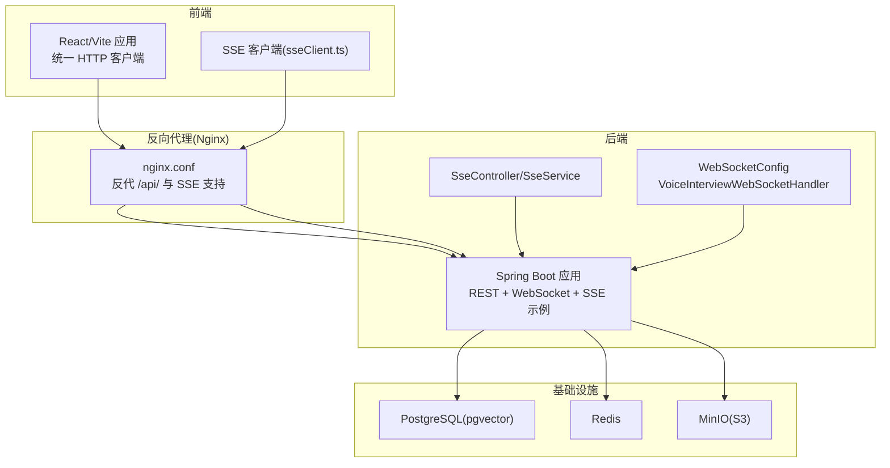
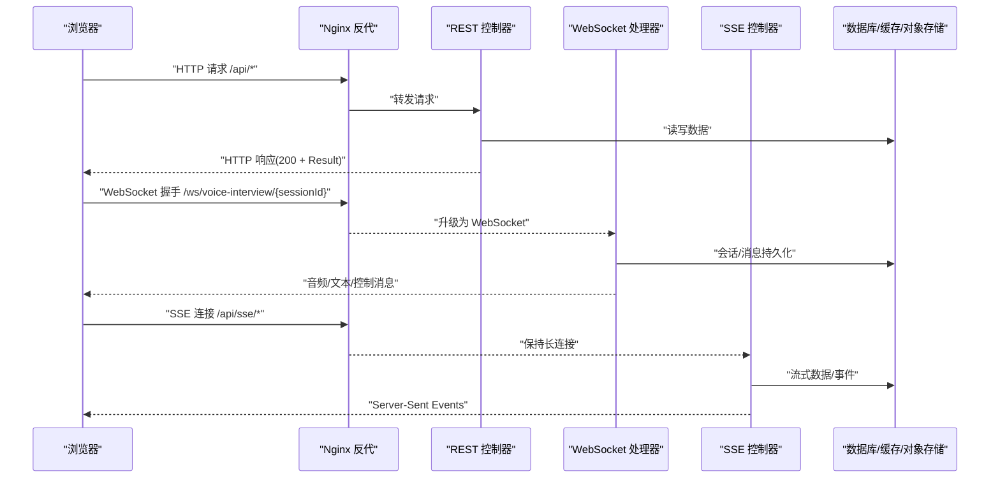
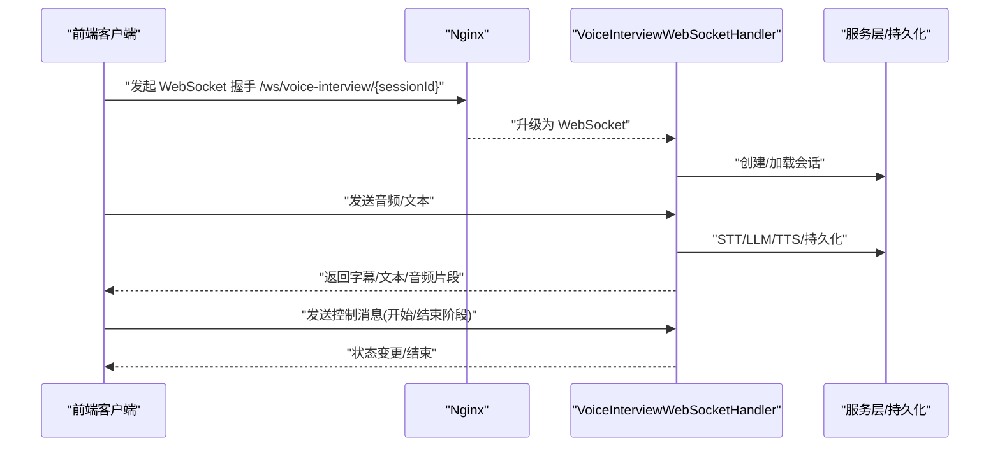
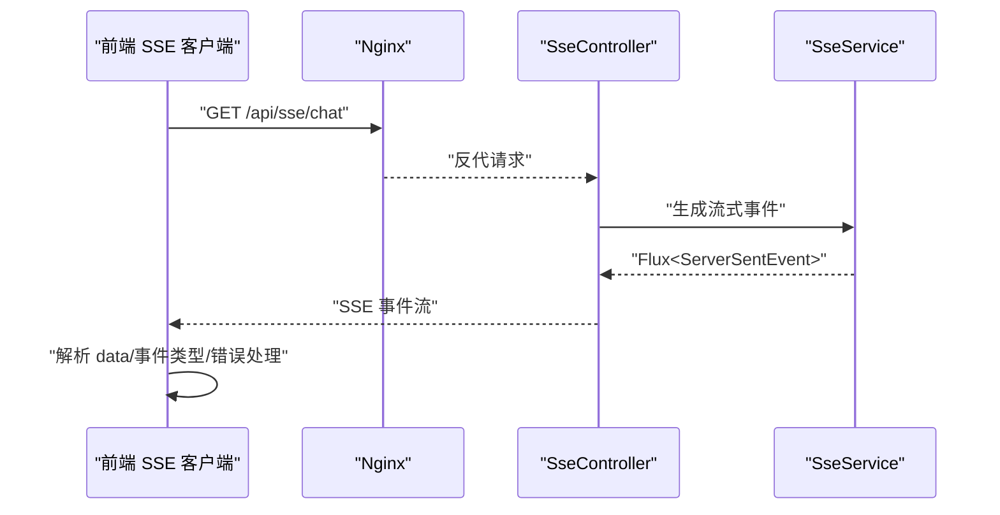
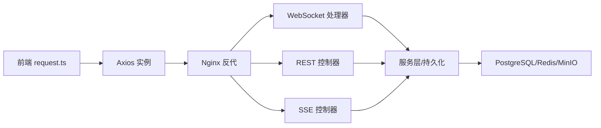

# 网络请求和通信调试

<cite>
**本文引用的文件**
- [CorsConfig.java](file://app/src/main/java/interview/guide/common/config/CorsConfig.java)
- [CorsProperties.java](file://app/src/main/java/interview/guide/common/config/CorsProperties.java)
- [WebSocketConfig.java](file://app/src/main/java/interview/guide/modules/voiceinterview/config/WebSocketConfig.java)
- [VoiceInterviewWebSocketHandler.java](file://app/src/main/java/interview/guide/modules/voiceinterview/handler/VoiceInterviewWebSocketHandler.java)
- [VoiceInterviewService.java](file://app/src/main/java/interview/guide/modules/voiceinterview/service/VoiceInterviewService.java)
- [QwenTtsService.java](file://app/src/main/java/interview/guide/modules/voiceinterview/service/QwenTtsService.java)
- [WebSocketControlMessage.java](file://app/src/main/java/interview/guide/modules/voiceinterview/dto/WebSocketControlMessage.java)
- [WebSocketSubtitleMessage.java](file://app/src/main/java/interview/guide/modules/voiceinterview/dto/WebSocketSubtitleMessage.java)
- [SessionResponseDTO.java](file://app/src/main/java/interview/guide/modules/voiceinterview/dto/SessionResponseDTO.java)
- [VoiceInterviewMessageDTO.java](file://app/src/main/java/interview/guide/modules/voiceinterview/dto/VoiceInterviewMessageDTO.java)
- [request.ts](file://frontend/src/api/request.ts)
- [voiceInterview.ts](file://frontend/src/api/voiceInterview.ts)
- [ragChat.ts](file://frontend/src/api/ragChat.ts)
- [SseController.java](file://sse-demo/backend/src/main/java/com/example/sse/controller/SseController.java)
- [SseService.java](file://sse-demo/backend/src/main/java/com/example/sse/service/SseService.java)
- [App.tsx](file://sse-demo/frontend/src/App.tsx)
- [sseClient.ts](file://sse-demo/frontend/src/utils/sseClient.ts)
- [nginx.conf](file://sse-demo/frontend/nginx.conf)
- [docker-compose.yml](file://docker-compose.yml)
- [AbstractStreamConsumer.java](file://app/src/main/java/interview/guide/common/async/AbstractStreamConsumer.java)
- [AbstractStreamProducer.java](file://app/src/main/java/interview/guide/common/async/AbstractStreamProducer.java)
</cite>

## 目录
1. [简介](#简介)
2. [项目结构](#项目结构)
3. [核心组件](#核心组件)
4. [架构总览](#架构总览)
5. [详细组件分析](#详细组件分析)
6. [依赖关系分析](#依赖关系分析)
7. [性能考虑](#性能考虑)
8. [故障排查指南](#故障排查指南)
9. [结论](#结论)
10. [附录](#附录)

## 简介
本指南面向面试指南平台的网络请求与通信调试，覆盖以下主题：
- REST API 调试：Postman 使用、curl 命令行、HTTP 客户端最佳实践
- WebSocket 通信调试：连接建立、消息收发、断线重连、协议升级
- Server-Sent Events (SSE) 调试：事件流监听、连接状态监控、错误处理
- 跨域问题调试：CORS 配置验证、预检请求分析、安全头设置
- 实时通信调试：音频流传输、视频流调试、延迟测量
- 网络性能优化调试：带宽测试、延迟分析、丢包检测

## 项目结构
平台由后端 Spring Boot 应用、前端 React/Vite 应用、以及可选的 SSE 示例工程组成。后端提供 REST API、WebSocket 语音面试通道与 SSE 示例；前端通过统一 HTTP 客户端与后端交互，并内置 SSE 流式聊天客户端；Nginx 作为反向代理支持 SSE 长连接与跨域。

图表来源
- [docker-compose.yml:1-197](file://docker-compose.yml#L1-L197)
- [nginx.conf:1-52](file://sse-demo/frontend/nginx.conf#L1-L52)
- [SseController.java:1-114](file://sse-demo/backend/src/main/java/com/example/sse/controller/SseController.java#L1-L114)
- [WebSocketConfig.java:1-24](file://app/src/main/java/interview/guide/modules/voiceinterview/config/WebSocketConfig.java#L1-L24)

章节来源
- [docker-compose.yml:1-197](file://docker-compose.yml#L1-L197)
- [nginx.conf:1-52](file://sse-demo/frontend/nginx.conf#L1-L52)

## 核心组件
- CORS 配置：统一跨域策略，允许特定源访问 /api/** 路径
- REST 客户端：Axios 封装，统一封装响应结构与错误处理
- WebSocket 语音面试：基于 Spring WebSocket，支持音频/文本双向流
- SSE 示例：Spring WebFlux + EventSource，演示心跳、进度事件与流式对话
- Nginx 反代：支持 SSE 长连接、禁用缓冲、超时配置

章节来源
- [CorsConfig.java:1-43](file://app/src/main/java/interview/guide/common/config/CorsConfig.java#L1-L43)
- [request.ts:1-128](file://frontend/src/api/request.ts#L1-L128)
- [WebSocketConfig.java:1-24](file://app/src/main/java/interview/guide/modules/voiceinterview/config/WebSocketConfig.java#L1-L24)
- [SseController.java:1-114](file://sse-demo/backend/src/main/java/com/example/sse/controller/SseController.java#L1-L114)
- [nginx.conf:1-52](file://sse-demo/frontend/nginx.conf#L1-L52)

## 架构总览
下图展示从浏览器到后端的关键网络路径与组件交互，涵盖 REST、WebSocket、SSE 三种通信方式。

图表来源
- [docker-compose.yml:1-197](file://docker-compose.yml#L1-L197)
- [nginx.conf:1-52](file://sse-demo/frontend/nginx.conf#L1-L52)
- [SseController.java:1-114](file://sse-demo/backend/src/main/java/com/example/sse/controller/SseController.java#L1-L114)
- [WebSocketConfig.java:1-24](file://app/src/main/java/interview/guide/modules/voiceinterview/config/WebSocketConfig.java#L1-L24)

## 详细组件分析

### REST API 调试与最佳实践
- 统一响应结构：后端约定所有响应为 HTTP 200 + Result，前端拦截器自动解析并按 code 分支处理
- 错误处理：无响应时区分上传场景，给出更贴切的提示
- 超时与上传：上传接口采用较长超时，与 Nginx proxy_read_timeout 对齐
- 跨域：CORS 过滤器对 /api/** 注册，允许方法、头、凭据与最大缓存时间

建议调试步骤
- 使用 Postman：选择方法、填入路径与头；Body 选择 JSON 或 form-data；查看响应体与状态码
- 使用 curl：构造请求，添加必要头；结合 -v 查看握手与响应头
- 最佳实践：固定 baseURL、统一鉴权头、分环境配置、记录请求 ID 便于追踪

章节来源
- [request.ts:1-128](file://frontend/src/api/request.ts#L1-L128)
- [CorsConfig.java:1-43](file://app/src/main/java/interview/guide/common/config/CorsConfig.java#L1-L43)
- [CorsProperties.java:1-14](file://app/src/main/java/interview/guide/common/config/CorsProperties.java#L1-L14)

### WebSocket 通信调试（语音面试）
- 连接建立：后端注册 WebSocket 处理器，路径 /ws/voice-interview/{sessionId}，允许任意源（开发阶段）
- 协议升级：Nginx 配置 Upgrade/Connection 头，支持 WebSocket 升级
- 消息类型：音频、文本、字幕、控制消息
- 断线重连：前端在 onclose 中根据 wasClean 判定是否重连，指数退避
- 生命周期：处理器维护会话状态、STT/LLM/TTS 流水线、消息持久化与指标计数

调试要点
- 使用浏览器开发者工具 Network → WS，观察握手与帧
- 检查 onopen/onmessage/onclose/onerror 回调链路
- 观察音频/文本/字幕消息的时序与完整性
- 验证控制消息（开始/结束阶段、结束面试）触发的业务行为

图表来源
- [WebSocketConfig.java:1-24](file://app/src/main/java/interview/guide/modules/voiceinterview/config/WebSocketConfig.java#L1-L24)
- [VoiceInterviewWebSocketHandler.java:28-729](file://app/src/main/java/interview/guide/modules/voiceinterview/handler/VoiceInterviewWebSocketHandler.java#L28-L729)
- [VoiceInterviewService.java:25-68](file://app/src/main/java/interview/guide/modules/voiceinterview/service/VoiceInterviewService.java#L25-L68)
- [QwenTtsService.java:20-63](file://app/src/main/java/interview/guide/modules/voiceinterview/service/QwenTtsService.java#L20-L63)
- [WebSocketControlMessage.java:1-18](file://app/src/main/java/interview/guide/modules/voiceinterview/dto/WebSocketControlMessage.java#L1-L18)
- [WebSocketSubtitleMessage.java:1-16](file://app/src/main/java/interview/guide/modules/voiceinterview/dto/WebSocketSubtitleMessage.java#L1-L16)
- [SessionResponseDTO.java:1-25](file://app/src/main/java/interview/guide/modules/voiceinterview/dto/SessionResponseDTO.java#L1-L25)
- [nginx.conf:22-44](file://sse-demo/frontend/nginx.conf#L22-L44)

章节来源
- [VoiceInterviewWebSocketHandler.java:28-729](file://app/src/main/java/interview/guide/modules/voiceinterview/handler/VoiceInterviewWebSocketHandler.java#L28-L729)
- [VoiceInterviewService.java:25-68](file://app/src/main/java/interview/guide/modules/voiceinterview/service/VoiceInterviewService.java#L25-L68)
- [QwenTtsService.java:20-63](file://app/src/main/java/interview/guide/modules/voiceinterview/service/QwenTtsService.java#L20-L63)
- [WebSocketControlMessage.java:1-18](file://app/src/main/java/interview/guide/modules/voiceinterview/dto/WebSocketControlMessage.java#L1-L18)
- [WebSocketSubtitleMessage.java:1-16](file://app/src/main/java/interview/guide/modules/voiceinterview/dto/WebSocketSubtitleMessage.java#L1-L16)
- [SessionResponseDTO.java:1-25](file://app/src/main/java/interview/guide/modules/voiceinterview/dto/SessionResponseDTO.java#L1-L25)
- [nginx.conf:22-44](file://sse-demo/frontend/nginx.conf#L22-L44)

### Server-Sent Events (SSE) 调试
- 后端：使用 Spring WebFlux 的 Flux<ServerSentEvent<T>> 返回流式事件，支持心跳、进度事件与结构化事件
- 前端：提供两种监听方式
  - fetch + ReadableStream：自定义解析 SSE，支持取消与错误回调
  - EventSource：原生 API，监听 onmessage 与自定义事件
- Nginx：禁用缓冲、设置长超时、透传 Upgrade/Connection，保证 SSE 正常工作

调试要点
- 使用浏览器 Network → EventStream，观察事件流与重连行为
- 检查 data 字段转义与事件类型（event 字段）
- 监控连接关闭与错误事件，验证自动重连策略
- 通过 Nginx 日志定位代理层问题

图表来源
- [SseController.java:1-114](file://sse-demo/backend/src/main/java/com/example/sse/controller/SseController.java#L1-L114)
- [SseService.java:1-53](file://sse-demo/backend/src/main/java/com/example/sse/service/SseService.java#L1-L53)
- [App.tsx:54-91](file://sse-demo/frontend/src/App.tsx#L54-L91)
- [sseClient.ts:51-104](file://sse-demo/frontend/src/utils/sseClient.ts#L51-L104)
- [nginx.conf:22-44](file://sse-demo/frontend/nginx.conf#L22-L44)

章节来源
- [SseController.java:1-114](file://sse-demo/backend/src/main/java/com/example/sse/controller/SseController.java#L1-L114)
- [SseService.java:1-53](file://sse-demo/backend/src/main/java/com/example/sse/service/SseService.java#L1-L53)
- [App.tsx:54-91](file://sse-demo/frontend/src/App.tsx#L54-L91)
- [sseClient.ts:51-104](file://sse-demo/frontend/src/utils/sseClient.ts#L51-L104)
- [nginx.conf:22-44](file://sse-demo/frontend/nginx.conf#L22-L44)

### 跨域问题调试（CORS）
- CORS 过滤器：对 /api/** 注册配置，允许的方法、头、凭据与缓存时间
- 属性驱动：允许的源可通过配置项动态调整
- 开发环境：WebSocket 配置允许任意源（开发阶段），生产需收紧

调试步骤
- 使用浏览器 Network → Headers，检查响应头是否包含 Access-Control-Allow-* 与 Vary
- 预检请求：复杂请求会先发 OPTIONS，确认方法/头是否被允许
- 常见问题：凭据与通配符源不能同时使用；允许源需精确匹配

章节来源
- [CorsConfig.java:1-43](file://app/src/main/java/interview/guide/common/config/CorsConfig.java#L1-L43)
- [CorsProperties.java:1-14](file://app/src/main/java/interview/guide/common/config/CorsProperties.java#L1-L14)
- [WebSocketConfig.java:1-24](file://app/src/main/java/interview/guide/modules/voiceinterview/config/WebSocketConfig.java#L1-L24)

### 实时通信调试（音频/视频流）
- 音频流：前端通过 WebSocket 发送音频帧，后端进行 STT/LLM/TTS 并回传音频
- 字幕与文本：后端推送字幕与最终文本，前端实时渲染
- 延迟测量：可在处理器中记录各阶段耗时（STT/LLM/TTS），并上报指标
- 断线重连：前端 onclose 中判断 wasClean，未正常关闭则指数退避重连

章节来源
- [VoiceInterviewWebSocketHandler.java:28-729](file://app/src/main/java/interview/guide/modules/voiceinterview/handler/VoiceInterviewWebSocketHandler.java#L28-L729)
- [QwenTtsService.java:20-63](file://app/src/main/java/interview/guide/modules/voiceinterview/service/QwenTtsService.java#L20-L63)
- [WebSocketSubtitleMessage.java:1-16](file://app/src/main/java/interview/guide/modules/voiceinterview/dto/WebSocketSubtitleMessage.java#L1-L16)

### 网络性能优化调试
- 带宽与延迟：通过 WebSocket 处理器记录各阶段耗时，结合 Nginx 超时配置评估端到端延迟
- 丢包检测：前端 onerror 与 onclose 中区分网络异常与业务错误，结合日志定位
- 上传优化：上传接口超时与 Nginx 代理超时对齐，避免中间层截断
- Redis Stream：异步任务通过 Redis Stream 解耦，降低主流程阻塞

章节来源
- [AbstractStreamConsumer.java:1-176](file://app/src/main/java/interview/guide/common/async/AbstractStreamConsumer.java#L1-L176)
- [AbstractStreamProducer.java:1-55](file://app/src/main/java/interview/guide/common/async/AbstractStreamProducer.java#L1-L55)
- [nginx.conf:32-35](file://sse-demo/frontend/nginx.conf#L32-L35)

## 依赖关系分析
- 前端依赖 axios 统一 HTTP 客户端，后端提供 REST 接口与 SSE 示例
- WebSocket 通道与 REST 接口共享同一反向代理层，Nginx 配置需同时支持升级与长连接
- CORS 过滤器与属性配置共同决定跨域策略
- Redis Stream 作为异步任务承载，减少主流程压力

图表来源
- [request.ts:1-128](file://frontend/src/api/request.ts#L1-L128)
- [nginx.conf:1-52](file://sse-demo/frontend/nginx.conf#L1-L52)
- [SseController.java:1-114](file://sse-demo/backend/src/main/java/com/example/sse/controller/SseController.java#L1-L114)
- [WebSocketConfig.java:1-24](file://app/src/main/java/interview/guide/modules/voiceinterview/config/WebSocketConfig.java#L1-L24)

章节来源
- [request.ts:1-128](file://frontend/src/api/request.ts#L1-L128)
- [nginx.conf:1-52](file://sse-demo/frontend/nginx.conf#L1-L52)

## 性能考虑
- SSE 长连接：Nginx 禁用缓冲、设置长超时，避免中间层截断
- WebSocket 升级：确保 Upgrade/Connection 头正确透传
- 上传超时：前端上传与 Nginx 代理超时一致，避免中间层超时
- 异步解耦：Redis Stream 承载后台任务，降低主流程阻塞

章节来源
- [nginx.conf:32-44](file://sse-demo/frontend/nginx.conf#L32-L44)
- [request.ts:101-107](file://frontend/src/api/request.ts#L101-L107)
- [AbstractStreamConsumer.java:1-176](file://app/src/main/java/interview/guide/common/async/AbstractStreamConsumer.java#L1-L176)
- [AbstractStreamProducer.java:1-55](file://app/src/main/java/interview/guide/common/async/AbstractStreamProducer.java#L1-L55)

## 故障排查指南
- REST API
  - 症状：返回非 200 但业务成功
  - 排查：检查响应拦截器是否正确解析 Result.code
  - 工具：Postman/curl 查看响应体与状态码
- CORS
  - 症状：跨域失败或预检失败
  - 排查：确认允许源、方法、头与凭据配置；检查响应头
- WebSocket
  - 症状：握手失败或连接断开
  - 排查：检查 Nginx 升级头、路径匹配、断线重连逻辑
  - 工具：浏览器 Network → WS，观察帧与错误
- SSE
  - 症状：连接中断或事件缺失
  - 排查：确认 Nginx 禁用缓冲、长超时；前端 EventSource/自定义解析
- 上传
  - 症状：上传超时或连接中断
  - 排查：对比前端超时与 Nginx 代理超时，检查网络稳定性

章节来源
- [request.ts:1-128](file://frontend/src/api/request.ts#L1-L128)
- [CorsConfig.java:1-43](file://app/src/main/java/interview/guide/common/config/CorsConfig.java#L1-L43)
- [WebSocketConfig.java:1-24](file://app/src/main/java/interview/guide/modules/voiceinterview/config/WebSocketConfig.java#L1-L24)
- [SseController.java:1-114](file://sse-demo/backend/src/main/java/com/example/sse/controller/SseController.java#L1-L114)
- [nginx.conf:32-44](file://sse-demo/frontend/nginx.conf#L32-L44)

## 结论
本指南提供了面试指南平台在网络请求与通信方面的系统性调试方法，涵盖 REST、WebSocket、SSE 三大通信范式，并结合 CORS、Nginx 反代与异步任务解耦，帮助快速定位与解决网络层面问题。建议在开发与测试环境中持续验证跨域、长连接与超时配置，确保端到端体验稳定可靠。

## 附录
- API 调试清单
  - 使用 Postman/curl 验证请求与响应
  - 检查响应拦截器与错误分支
  - 验证跨域响应头与预检请求
- WebSocket 调试清单
  - 握手与升级头校验
  - 消息类型与时序验证
  - 断线重连与错误处理
- SSE 调试清单
  - 长连接与缓冲配置
  - 事件类型与数据解析
  - 自动重连与错误回调
- 性能调试清单
  - 端到端延迟与吞吐测量
  - 上传超时与代理一致性
  - 异步任务队列与背压