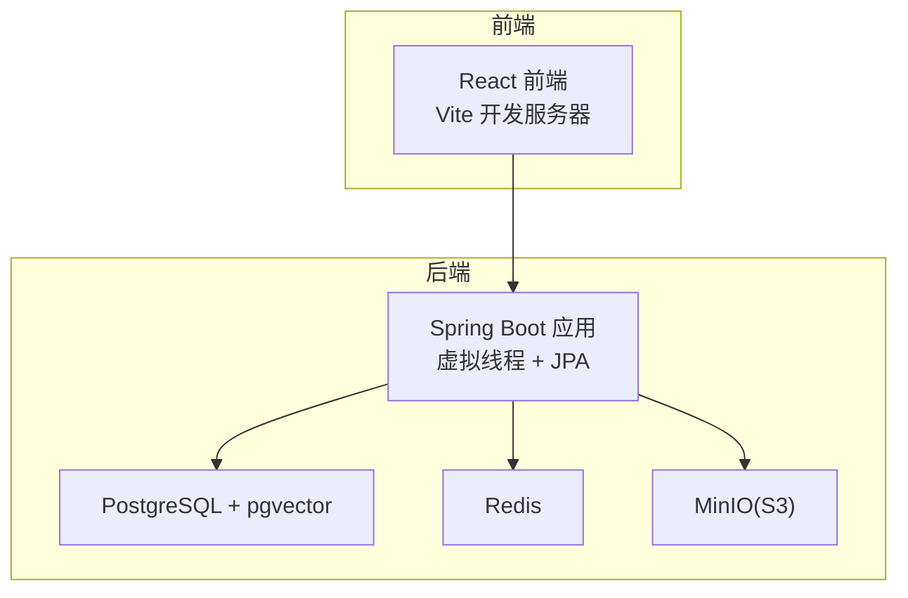
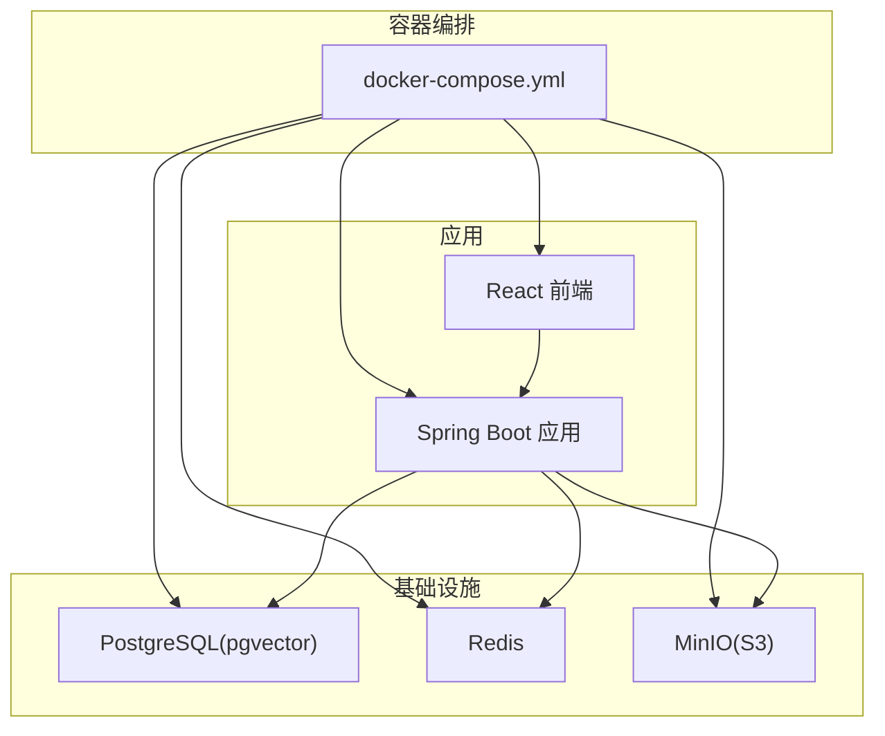
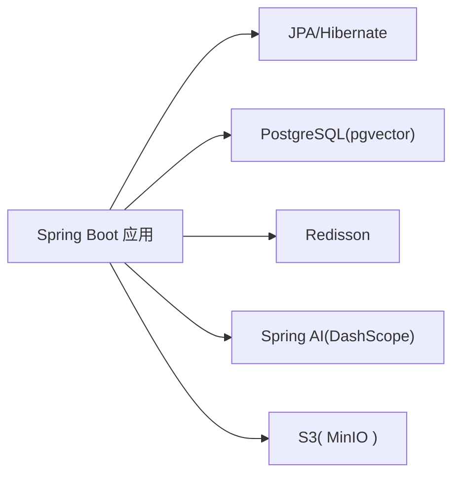

# 调试和性能分析工具

<cite>
**本文引用的文件**
- [App.java](file://app/src/main/java/interview/guide/App.java)
- [application.yml](file://app/src/main/resources/application.yml)
- [logback-spring.xml](file://app/src/main/resources/logback-spring.xml)
- [build.gradle](file://app/build.gradle)
- [GlobalExceptionHandler.java](file://app/src/main/java/interview/guide/common/exception/GlobalExceptionHandler.java)
- [RateLimitAspect.java](file://app/src/main/java/interview/guide/common/aspect/RateLimitAspect.java)
- [docker-compose.yml](file://docker-compose.yml)
- [vite.config.ts](file://frontend/vite.config.ts)
- [package.json](file://frontend/package.json)
- [tsconfig.json](file://frontend/tsconfig.json)
</cite>

## 目录
1. [简介](#简介)
2. [项目结构](#项目结构)
3. [核心组件](#核心组件)
4. [架构总览](#架构总览)
5. [详细组件分析](#详细组件分析)
6. [依赖分析](#依赖分析)
7. [性能考虑](#性能考虑)
8. [故障排查指南](#故障排查指南)
9. [结论](#结论)
10. [附录](#附录)

## 简介
本指南面向面试指南平台的开发与运维团队，提供一套完整的调试与性能分析实践手册。内容覆盖：
- Spring Boot 应用的本地与远程调试配置、断点与变量监视、日志与异常处理策略
- React 前端的浏览器开发者工具、React DevTools、网络与状态调试技巧
- 数据库查询性能分析（慢查询日志、执行计划、索引优化建议）
- 内存泄漏检测与分析（Heap Dump、GC 日志）
- 网络请求调试（API 测试、WebSocket、SSE）
- Docker 容器调试（日志、进程、资源监控）
- 性能基准与压力测试（JMeter、LoadRunner 等工具的配置与使用）

## 项目结构
平台采用前后端分离架构：
- 后端：Spring Boot 4.0 + Java 21，使用虚拟线程、JPA/Hibernate、PostgreSQL、Redis、S3 兼容对象存储
- 前端：React 18 + Vite，使用 TypeScript、TailwindCSS、Axios、路由与组件化
- 基础设施：Docker Compose 编排 PostgreSQL（pgvector）、Redis、MinIO（S3 兼容）、后端与前端服务

图表来源
- [docker-compose.yml:13-186](file://docker-compose.yml#L13-L186)
- [application.yml:48-98](file://app/src/main/resources/application.yml#L48-L98)

章节来源
- [docker-compose.yml:1-197](file://docker-compose.yml#L1-L197)
- [application.yml:1-282](file://app/src/main/resources/application.yml#L1-L282)

## 核心组件
- 启动入口与调度：主应用类启用调度，便于定时任务与异步流程
- 配置中心：集中管理日志、服务器、数据库、Redis、AI 服务、CORS、语音面试等配置
- 异常统一处理：全局异常处理器对业务异常、参数校验、网络异常、资源未找到等进行统一响应
- 限流切面：基于 Redis Lua 脚本实现多维限流（全局/IP/用户），支持降级方法
- 日志与编码：Logback 固定 UTF-8 字符集，避免控制台乱码
- 构建与运行：Gradle 任务注入 .env 环境变量，设置 JVM 编码

章节来源
- [App.java:11-18](file://app/src/main/java/interview/guide/App.java#L11-L18)
- [application.yml:4-282](file://app/src/main/resources/application.yml#L4-L282)
- [GlobalExceptionHandler.java:23-160](file://app/src/main/java/interview/guide/common/exception/GlobalExceptionHandler.java#L23-L160)
- [RateLimitAspect.java:34-264](file://app/src/main/java/interview/guide/common/aspect/RateLimitAspect.java#L34-L264)
- [logback-spring.xml:1-11](file://app/src/main/resources/logback-spring.xml#L1-L11)
- [build.gradle:104-135](file://app/build.gradle#L104-L135)

## 架构总览
后端通过 Docker Compose 与数据库、缓存、对象存储协同工作，前端通过反向代理访问后端 API。

图表来源
- [docker-compose.yml:13-186](file://docker-compose.yml#L13-L186)

章节来源
- [docker-compose.yml:1-197](file://docker-compose.yml#L1-L197)

## 详细组件分析

### Spring Boot 调试与性能配置
- 远程调试参数
  - 在 Gradle bootRun 任务中已设置 JVM 编码参数，便于本地调试时控制台输出正确显示
  - 如需启用远程调试，可在 bootRun jvmArgs 中添加标准 JDWP 参数（例如：-agentlib:jdwp=transport=dt_socket,server=y,suspend=n,address=*:5005）
- 断点与变量监视
  - 使用 IDE 设置断点于控制器、服务层、切面与异常处理器，结合变量监视窗口观察请求上下文、限流键、Redis 脚本执行结果
- 日志与字符集
  - Logback 已显式设置控制台与文件编码为 UTF-8，避免 Windows 控制台乱码
- 虚拟线程与线程池
  - 已启用虚拟线程，Tomcat 线程参数与 HikariCP 连接池参数已针对 I/O 密集场景优化
- 全局异常处理
  - 统一返回业务错误码与消息，便于前端与监控系统识别与追踪

章节来源
- [build.gradle:106-135](file://app/build.gradle#L106-L135)
- [logback-spring.xml:1-11](file://app/src/main/resources/logback-spring.xml#L1-L11)
- [application.yml:9-62](file://app/src/main/resources/application.yml#L9-L62)
- [GlobalExceptionHandler.java:23-160](file://app/src/main/java/interview/guide/common/exception/GlobalExceptionHandler.java#L23-L160)

### React 前端调试技巧
- 开发服务器与代理
  - Vite 开发服务器监听 5173，通过代理将 /api 前缀转发至后端 8080 端口，便于联调
- 浏览器开发者工具
  - 使用 Network 面板观察请求路径、响应时间、状态码与响应体；使用 Elements/Console/Debugger 分析渲染与交互问题
- React DevTools
  - 安装 React DevTools 浏览器扩展，查看组件树、Props、State、Hooks、渲染次数与性能面板
- Redux DevTools（如使用）
  - 若项目集成 Redux Toolkit，可通过 Redux DevTools 扩展观察状态变化与中间件日志
- TypeScript 与构建优化
  - tsconfig 严格模式有助于早期发现类型问题；Vite 构建按 vendor 拆分包，有利于分析首屏性能

章节来源
- [vite.config.ts:24-37](file://frontend/vite.config.ts#L24-L37)
- [package.json:6-10](file://frontend/package.json#L6-L10)
- [tsconfig.json:2-18](file://frontend/tsconfig.json#L2-L18)

### 数据库查询性能分析
- 慢查询日志
  - 在 PostgreSQL 中启用慢查询日志（log_min_duration_statement、log_line_prefix 等），定位耗时 SQL
- 执行计划分析
  - 使用 EXPLAIN/EXPLAIN ANALYZE 分析查询计划，关注全表扫描、缺失索引、隐式类型转换
- 索引优化
  - 针对高频过滤字段、连接字段与排序字段建立复合索引；定期统计信息更新与索引维护
- 连接池与批处理
  - HikariCP 已设置批量插入/更新顺序与批大小，避免不必要的锁竞争与上下文切换

章节来源
- [application.yml:48-78](file://app/src/main/resources/application.yml#L48-L78)

### 内存泄漏检测与分析
- Heap Dump 分析
  - 通过 JVM 参数生成 Heap Dump（如 -XX:+HeapDumpOnOutOfMemoryError），使用分析工具（如 Eclipse MAT、VisualVM）定位不可达对象与大对象
- GC 日志分析
  - 启用 GC 日志（-Xloggc、-XX:+PrintGC、-XX:+PrintGCDetails），观察晋升失败、长时间 Full GC、老年代回收效率
- 前端内存泄漏
  - 使用浏览器 Performance/Memory 面板录制内存增长曲线，排查事件监听未移除、定时器未清理、闭包持有等问题

[本节为通用指导，无需列出章节来源]

### 网络请求调试
- API 测试
  - 使用 Postman 或 curl 验证接口行为、鉴权与参数校验；结合全局异常处理器返回的业务错误码定位问题
- WebSocket 调试
  - 使用浏览器 Network 面板 WebSocket 标签，观察握手、帧类型、消息收发与断线重连
- SSE 流调试
  - 使用浏览器 Network 面板查看 EventSource 连接、事件类型与数据流，关注心跳与重连策略

[本节为通用指导，无需列出章节来源]

### Docker 容器调试
- 日志查看
  - 使用 docker compose logs -f 查看应用、数据库、缓存与对象存储的日志，结合容器名称过滤
- 进程分析
  - 使用 docker exec -it <container> bash 进入容器，使用 top/htop/iotop 观察 CPU、内存与磁盘 IO
- 资源监控
  - 使用 docker stats 实时查看 CPU、内存、网络与卷使用情况
- 端口与健康检查
  - 根据 docker-compose.yml 中的端口映射与健康检查配置，确认服务可用性

章节来源
- [docker-compose.yml:13-186](file://docker-compose.yml#L13-L186)

### 性能基准与压力测试
- JMeter
  - 创建线程组、HTTP 请求采样器与聚合报告，设置 Ramp-Up 与循环次数，观察吞吐量、响应时间与错误率
- LoadRunner
  - 设计场景脚本（如 REST API 场景），配置并发用户与持续时间，采集 CPU、内存、网络与数据库指标
- 基准测试清单
  - 接口基准：认证、上传、查询、评估等关键路径
  - 资源基准：CPU、内存、连接池、缓存命中率
  - 数据库基准：慢查询比例、锁等待、缓冲区命中

[本节为通用指导，无需列出章节来源]

## 依赖分析
后端应用的关键依赖与配置要点：
- 虚拟线程与线程池：提升 I/O 密集型并发能力
- JPA/Hibernate：SQL 输出与批处理优化
- PostgreSQL + pgvector：向量检索与 RAG 场景
- Redisson：分布式限流与缓存
- Spring AI（DashScope/OpenAI 兼容）：模型调用与嵌入
- S3 兼容存储：MinIO 对象存储

图表来源
- [application.yml:48-124](file://app/src/main/resources/application.yml#L48-L124)

章节来源
- [application.yml:48-124](file://app/src/main/resources/application.yml#L48-L124)

## 性能考虑
- 虚拟线程：适用于高并发 I/O 密集场景，降低线程切换开销
- 连接池：HikariCP 小而精，避免过度连接导致上下文切换
- 批处理：开启 JDBC 批量与顺序优化，减少网络往返
- 缓存：合理使用 Redis 缓存热点数据，降低数据库压力
- 日志：统一编码与结构化日志，便于检索与分析

章节来源
- [application.yml:42-78](file://app/src/main/resources/application.yml#L42-L78)
- [logback-spring.xml:1-11](file://app/src/main/resources/logback-spring.xml#L1-L11)

## 故障排查指南
- 全局异常处理
  - 业务异常、参数校验异常、文件上传超限、AI 服务网络异常、资源未找到、方法不支持等均有统一处理
- 限流与降级
  - 限流切面支持全局/IP/用户维度，触发后可执行降级方法或抛出限流异常
- 日志与编码
  - Logback 已固定 UTF-8，避免控制台乱码；建议在生产中开启结构化日志与动态日志级别
- 环境变量与 .env
  - Gradle bootRun 任务会从 .env 注入环境变量，确保本地与 CI 环境一致

章节来源
- [GlobalExceptionHandler.java:23-160](file://app/src/main/java/interview/guide/common/exception/GlobalExceptionHandler.java#L23-L160)
- [RateLimitAspect.java:66-191](file://app/src/main/java/interview/guide/common/aspect/RateLimitAspect.java#L66-L191)
- [logback-spring.xml:1-11](file://app/src/main/resources/logback-spring.xml#L1-L11)
- [build.gradle:106-135](file://app/build.gradle#L106-L135)

## 结论
通过统一的调试与性能分析体系，平台能够在开发、测试与生产环境中快速定位问题、优化性能并保障稳定性。建议在团队内推广以下实践：
- 统一日志规范与异常处理策略
- 基于限流与降级的弹性设计
- 定期进行数据库慢查询与索引体检
- 使用容器化与可观测性工具进行端到端调试

[本节为总结性内容，无需列出章节来源]

## 附录

### Spring Boot 启动与调试要点
- 启动类：启用调度，便于定时任务与异步流程
- 配置：集中管理日志、服务器、数据库、Redis、AI 服务、CORS、语音面试等
- 异常：统一返回业务错误码，便于前端与监控系统识别
- 限流：多维限流与降级，保障系统稳定

章节来源
- [App.java:11-18](file://app/src/main/java/interview/guide/App.java#L11-L18)
- [application.yml:4-282](file://app/src/main/resources/application.yml#L4-L282)
- [GlobalExceptionHandler.java:23-160](file://app/src/main/java/interview/guide/common/exception/GlobalExceptionHandler.java#L23-L160)
- [RateLimitAspect.java:34-264](file://app/src/main/java/interview/guide/common/aspect/RateLimitAspect.java#L34-L264)

### React 前端调试要点
- 开发服务器：端口与代理配置，便于联调
- 工具链：React DevTools、浏览器开发者工具、TypeScript 严格模式
- 构建：vendor 拆分与 sourcemap 忽略策略

章节来源
- [vite.config.ts:24-37](file://frontend/vite.config.ts#L24-L37)
- [package.json:6-10](file://frontend/package.json#L6-L10)
- [tsconfig.json:2-18](file://frontend/tsconfig.json#L2-L18)

### 数据库与缓存调试要点
- PostgreSQL：慢查询日志、执行计划、索引优化
- Redis：键空间扫描、内存使用、Lua 脚本执行
- 连接池：HikariCP 参数与批处理优化

章节来源
- [application.yml:48-98](file://app/src/main/resources/application.yml#L48-L98)