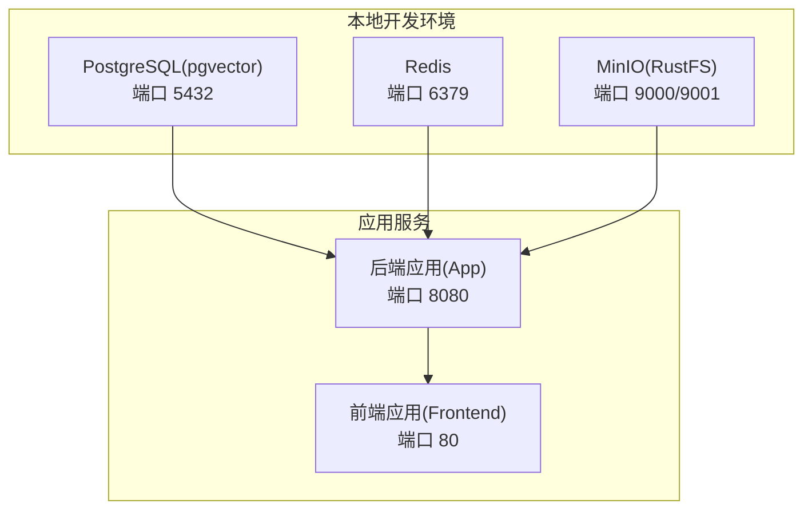
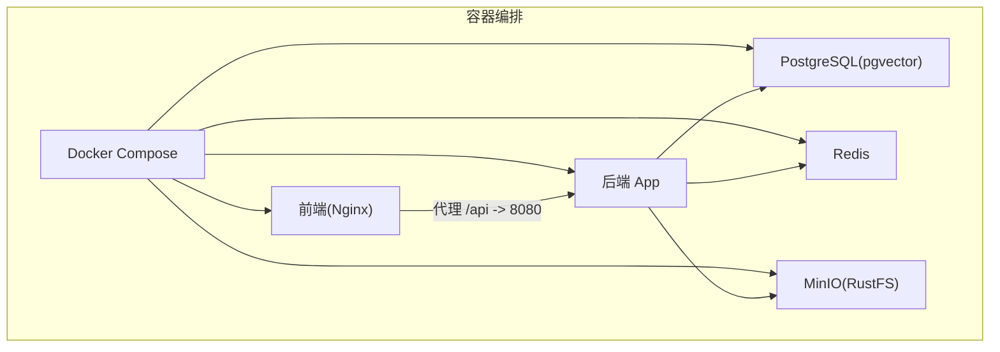
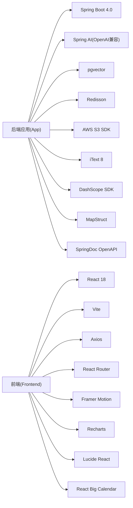

# 快速开始

<cite>
**本文引用的文件**
- [README.md](file://README.md)
- [docker-compose.yml](file://docker-compose.yml)
- [docker-compose.dev.yml](file://docker-compose.dev.yml)
- [app/build.gradle](file://app/build.gradle)
- [app/src/main/resources/application.yml](file://app/src/main/resources/application.yml)
- [frontend/package.json](file://frontend/package.json)
- [frontend/vite.config.ts](file://frontend/vite.config.ts)
- [frontend/Dockerfile](file://frontend/Dockerfile)
- [docker/postgres/init.sql](file://docker/postgres/init.sql)
- [gradle/libs.versions.toml](file://gradle/libs.versions.toml)
</cite>

## 目录
1. [简介](#简介)
2. [项目结构](#项目结构)
3. [核心组件](#核心组件)
4. [架构总览](#架构总览)
5. [详细组件分析](#详细组件分析)
6. [依赖关系分析](#依赖关系分析)
7. [性能注意事项](#性能注意事项)
8. [故障排查指南](#故障排查指南)
9. [结论](#结论)
10. [附录](#附录)

## 简介
本指南面向首次接触“面试指南平台”的开发者与运维人员，提供从环境准备、依赖安装到项目启动的完整流程。项目采用前后端分离架构：后端基于 Spring Boot 4.0 + Java 21，前端基于 React 18 + Vite，数据库为 PostgreSQL（含 pgvector 向量扩展），缓存与消息队列为 Redis，对象存储兼容 S3（MinIO/RustFS）。项目同时提供 Docker Compose 一键部署与本地手动安装两种启动方式，并覆盖 AI API 密钥配置、环境变量说明、常见问题排查以及多操作系统安装要点。

## 项目结构
- 后端应用位于 app/，使用 Gradle 构建，主启动类为 App.java。
- 前端应用位于 frontend/，使用 Vite + React，开发服务器默认端口 5173。
- 依赖服务通过 docker-compose.yml 编排：PostgreSQL（pgvector）、Redis、MinIO（S3 兼容）、后端应用、前端应用（Nginx）。
- 本地开发依赖服务通过 docker-compose.dev.yml 编排：PostgreSQL、Redis、RustFS（S3 兼容）。

图表来源
- [docker-compose.yml:13-170](file://docker-compose.yml#L13-L170)
- [docker-compose.dev.yml:7-58](file://docker-compose.dev.yml#L7-L58)

章节来源
- [README.md:210-247](file://README.md#L210-L247)
- [docker-compose.yml:1-197](file://docker-compose.yml#L1-L197)
- [docker-compose.dev.yml:1-64](file://docker-compose.dev.yml#L1-L64)

## 核心组件
- 后端（Spring Boot 4.0 + Java 21）
  - 通过 application.yml 读取环境变量进行数据库、Redis、S3、AI 模型等配置。
  - 通过 build.gradle 注入 .env 环境变量到 bootRun 任务，便于本地开发。
- 前端（React 18 + Vite）
  - 通过 vite.config.ts 配置代理到后端 8080 端口，开发时自动转发 /api 前缀请求。
  - 通过 package.json 管理依赖与脚本。
- 依赖服务（Docker Compose）
  - PostgreSQL（pgvector）、Redis、MinIO（S3 兼容）、后端、前端（Nginx）。
  - docker-compose.dev.yml 提供本地开发用的 RustFS 替代 MinIO。

章节来源
- [app/src/main/resources/application.yml:36-282](file://app/src/main/resources/application.yml#L36-L282)
- [app/build.gradle:104-136](file://app/build.gradle#L104-L136)
- [frontend/vite.config.ts:24-37](file://frontend/vite.config.ts#L24-L37)
- [frontend/package.json:1-47](file://frontend/package.json#L1-L47)
- [docker-compose.yml:1-197](file://docker-compose.yml#L1-L197)
- [docker-compose.dev.yml:1-64](file://docker-compose.dev.yml#L1-L64)

## 架构总览
系统采用“容器化 + 微服务风格”的单仓多服务编排，核心依赖通过 Docker Compose 启动，后端通过环境变量动态配置数据库、缓存、对象存储与 AI 模型。前端通过 Vite 开发服务器代理后端 API，生产环境由 Nginx 提供静态资源服务。

图表来源
- [docker-compose.yml:13-170](file://docker-compose.yml#L13-L170)
- [frontend/vite.config.ts:27-32](file://frontend/vite.config.ts#L27-L32)

章节来源
- [README.md:21-42](file://README.md#L21-L42)
- [docker-compose.yml:1-197](file://docker-compose.yml#L1-L197)

## 详细组件分析

### 环境准备与安装
- JDK 21
  - 后端使用 Java 21 Toolchain，Gradle 构建时明确指定语言版本。
- Node.js 18+
  - 前端使用 Vite + React，推荐使用 Node.js 18+（仓库中 Dockerfile 使用 Node 20，本地开发亦建议 18+）。
- Docker（可选）
  - 使用 docker-compose.yml 一键启动 PostgreSQL、Redis、MinIO、后端、前端。
  - 使用 docker-compose.dev.yml 启动 PostgreSQL、Redis、RustFS（S3 兼容）。

章节来源
- [app/build.gradle:89-93](file://app/build.gradle#L89-L93)
- [frontend/Dockerfile:5](file://frontend/Dockerfile#L5)
- [README.md:251-259](file://README.md#L251-L259)

### 环境变量与配置
- 必填项
  - AI_BAILIAN_API_KEY：用于 DashScope/OpenAI 兼容模式的 API Key。
- 可选项
  - AI_MODEL：默认 qwen-plus，可选 qwen-max、qwen-long 等。
  - APP_VOICE_INTERVIEW_LLM_PROVIDER：可选 dashscope、minimax、openai、deepseek、lmstudio。
  - APP_INTERVIEW_FOLLOW_UP_COUNT：每个主问题生成追问数量（默认 1）。
  - APP_INTERVIEW_EVALUATION_BATCH_SIZE：回答评估分批大小（默认 8）。
  - 其他数据库、Redis、S3、语音面试等参数均可通过环境变量覆盖。
- .env 示例与位置
  - docker-compose.yml 中的环境变量来自宿主机 .env 文件。
  - 本地开发时，Gradle bootRun 任务会读取 .env 文件注入环境变量。

章节来源
- [README.md:268-290](file://README.md#L268-L290)
- [README.md:355-378](file://README.md#L355-L378)
- [app/src/main/resources/application.yml:99-189](file://app/src/main/resources/application.yml#L99-L189)
- [app/build.gradle:115-135](file://app/build.gradle#L115-L135)

### 启动方式一：Docker Compose 一键启动
- 步骤
  - 复制并编辑 .env，填入 AI_BAILIAN_API_KEY 等配置。
  - 执行 docker-compose up -d --build 启动全部服务。
- 服务访问
  - 前端：http://localhost
  - 后端 API：http://localhost:8080
  - 接口文档：http://localhost:8080/swagger-ui.html
  - MinIO 控制台：http://localhost:9001
  - PostgreSQL：localhost:5432
  - Redis：localhost:6379

章节来源
- [README.md:344-414](file://README.md#L344-L414)
- [docker-compose.yml:140-170](file://docker-compose.yml#L140-L170)

### 启动方式二：手动安装依赖服务
- PostgreSQL（含 pgvector）
  - 安装 PostgreSQL 14+，并在首次启动时执行初始化 SQL 创建 vector 扩展。
- Redis 6+
  - 安装并启动 Redis 服务。
- S3 兼容存储（MinIO 或 RustFS）
  - 若使用 RustFS，首次启动后需在控制台创建名为 interview-guide 的 Bucket。
- 启动后端与前端
  - 后端：./gradlew bootRun（默认端口 8080）。
  - 前端：cd frontend && pnpm install && pnpm dev（默认端口 5173）。

章节来源
- [README.md:292-336](file://README.md#L292-L336)
- [docker/postgres/init.sql:1-2](file://docker/postgres/init.sql#L1-L2)
- [docker-compose.dev.yml:38-58](file://docker-compose.dev.yml#L38-L58)

### 验证步骤
- 后端
  - 访问 http://localhost:8080/swagger-ui.html，确认接口文档加载正常。
- 前端
  - 访问 http://localhost，进入首页，确认代理到后端 API 的 /api 前缀请求正常。
- 依赖服务
  - 通过 docker-compose ps 查看服务状态；必要时使用 docker-compose logs -f app 查看后端日志。

章节来源
- [README.md:380-414](file://README.md#L380-L414)
- [frontend/vite.config.ts:27-32](file://frontend/vite.config.ts#L27-L32)

### 多操作系统安装要点
- Windows
  - PowerShell 中可能出现后端日志中文乱码，建议按 README 的说明统一编码。
  - 使用 .\gradlew.bat 启动后端，避免执行策略与路径解析问题。
- macOS/Linux
  - 建议将 AI_BAILIAN_API_KEY 等环境变量写入 ~/.zshrc 或 ~/.bashrc，确保重启后仍生效。
  - Docker Compose 默认使用 docker.sock，确保当前用户有权限访问。

章节来源
- [README.md:477-494](file://README.md#L477-L494)
- [README.md:280-290](file://README.md#L280-L290)

## 依赖关系分析
- 后端依赖
  - Spring Boot 4.0、Spring AI（OpenAI 兼容模式）、pgvector 向量存储、Redisson、AWS S3 SDK、iText 8、DashScope SDK、MapStruct、SpringDoc OpenAPI 等。
- 前端依赖
  - React 18、Vite、Tailwind CSS、Axios、Day.js、Framer Motion、Recharts、Lucide React、ONNX Runtime Web、React Big Calendar 等。
- 构建工具
  - Gradle 8.x（后端），Vite/TypeScript（前端）。

图表来源
- [app/build.gradle:23-87](file://app/build.gradle#L23-L87)
- [frontend/package.json:11-28](file://frontend/package.json#L11-L28)
- [gradle/libs.versions.toml:3-29](file://gradle/libs.versions.toml#L3-L29)

章节来源
- [app/build.gradle:1-136](file://app/build.gradle#L1-L136)
- [frontend/package.json:1-47](file://frontend/package.json#L1-L47)
- [gradle/libs.versions.toml:1-30](file://gradle/libs.versions.toml#L1-L30)

## 性能注意事项
- 虚拟线程与连接池
  - 后端启用虚拟线程，Tomcat 线程池与 HikariCP 连接池参数已针对 I/O 密集场景优化。
- Redis Stream 异步处理
  - 简历分析、知识库向量化、语音面试评估等采用 Redis Stream 异步处理，前端轮询状态。
- 前端构建优化
  - Vite 通过 manualChunks 将第三方库拆分为独立 chunk，提升缓存命中率与加载性能。

章节来源
- [app/src/main/resources/application.yml:42-78](file://app/src/main/resources/application.yml#L42-L78)
- [frontend/vite.config.ts:13-23](file://frontend/vite.config.ts#L13-L23)

## 故障排查指南
- 数据库表创建失败/数据丢失
  - 检查 JPA 的 ddl-auto 配置，开发环境推荐 update，避免使用 create 导致数据丢失。
- 知识库向量化失败
  - 当 initialize-schema: false 时，Spring AI 不会自动创建 vector_store 表，需手动创建或设置为 true。
- 简历分析失败
  - 检查 AI_BAILIAN_API_KEY 是否正确配置。
- 简历分析一直显示“分析中”
  - 检查 Redis 连接与 Stream Consumer 是否正常运行，查看后端日志定位错误。
- PDF 导出失败或中文显示异常
  - 确认内置中文字体存在、日志中字体加载信息正常、iText 依赖正确。
- Windows PowerShell 中文乱码
  - 按 README 的说明统一控制台编码与 Gradle/JVM 参数，或写入 PowerShell 配置文件。

章节来源
- [README.md:424-494](file://README.md#L424-L494)
- [app/src/main/resources/application.yml:116-124](file://app/src/main/resources/application.yml#L116-L124)

## 结论
通过本指南，您可以根据自身需求选择 Docker Compose 一键启动或手动安装依赖服务两种方式快速运行“面试指南平台”。请务必完成 AI API 密钥配置与必要的环境变量设置，并在遇到问题时参考故障排查章节进行定位与修复。项目已针对多操作系统与常见问题提供相应建议，确保顺利启动与稳定运行。

## 附录

### 环境变量清单（摘要）
- 必填
  - AI_BAILIAN_API_KEY：用于 DashScope/OpenAI 兼容模式。
- 可选
  - AI_MODEL：默认 qwen-plus。
  - APP_VOICE_INTERVIEW_LLM_PROVIDER：dashscope/minimax/openai/deepseek/lmstudio。
  - APP_INTERVIEW_FOLLOW_UP_COUNT：默认 1。
  - APP_INTERVIEW_EVALUATION_BATCH_SIZE：默认 8。
  - 其他数据库、Redis、S3、语音面试等参数。

章节来源
- [README.md:268-290](file://README.md#L268-L290)
- [app/src/main/resources/application.yml:99-282](file://app/src/main/resources/application.yml#L99-L282)