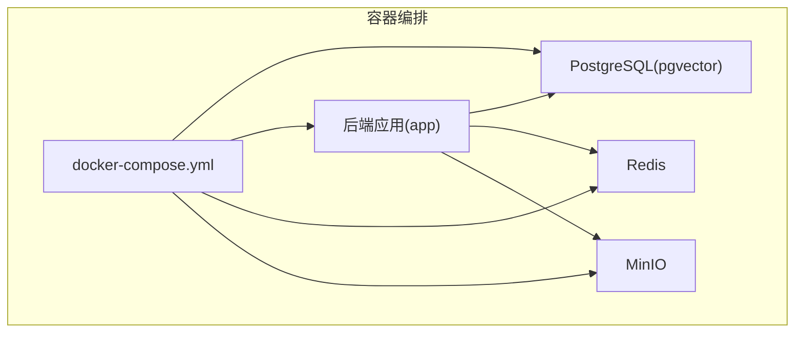
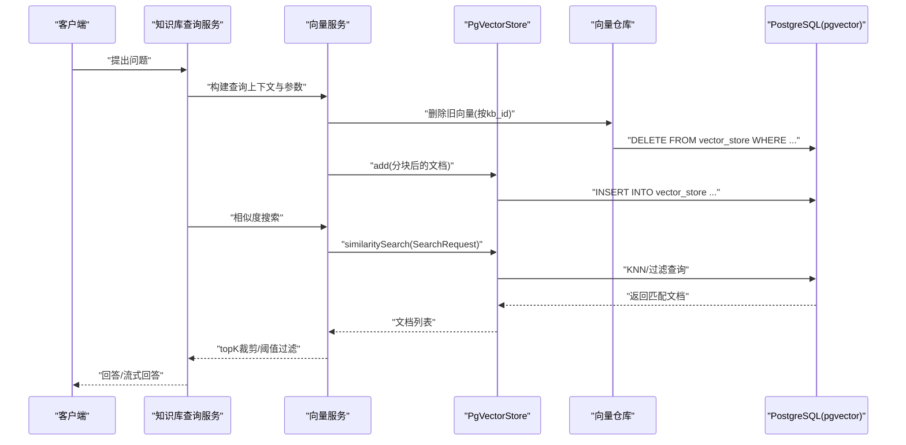
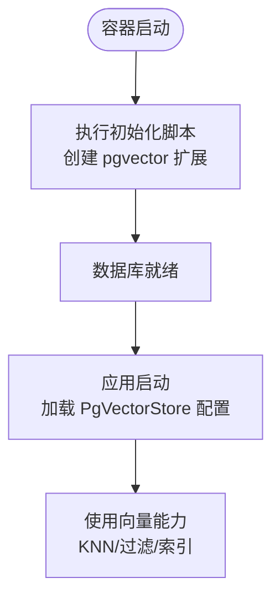
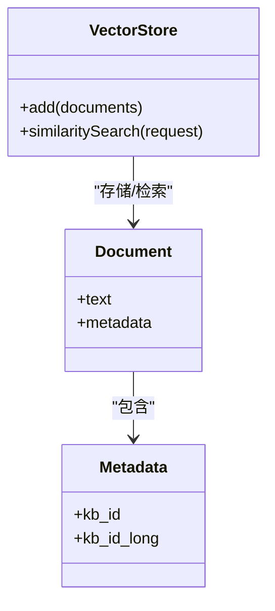
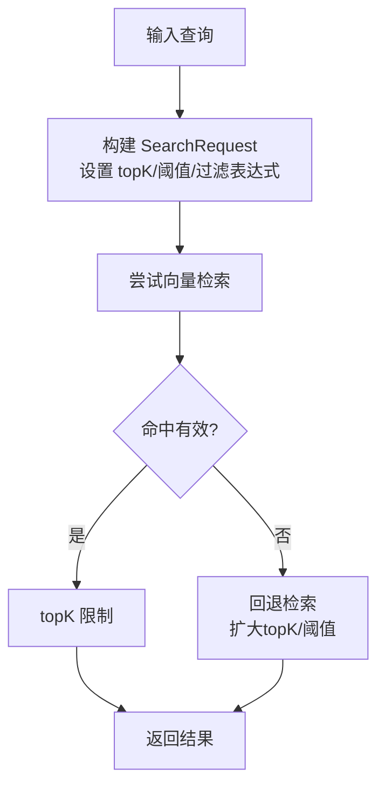
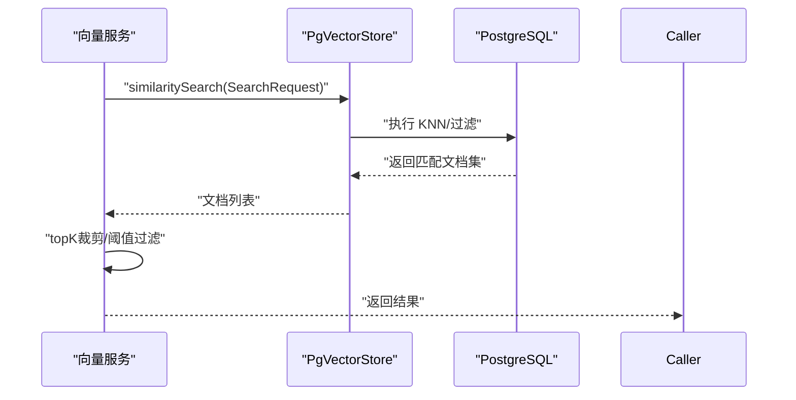
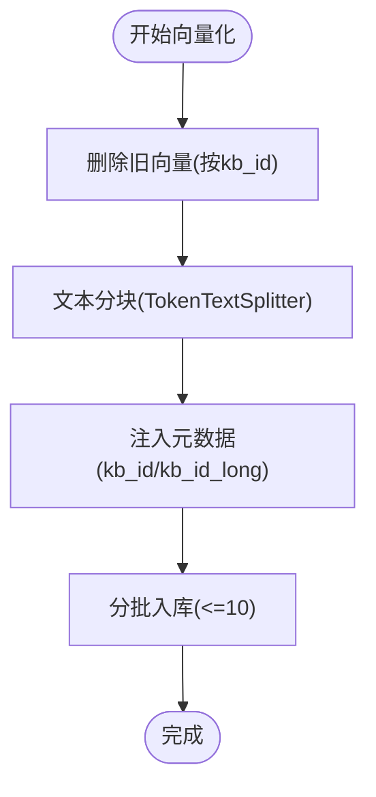
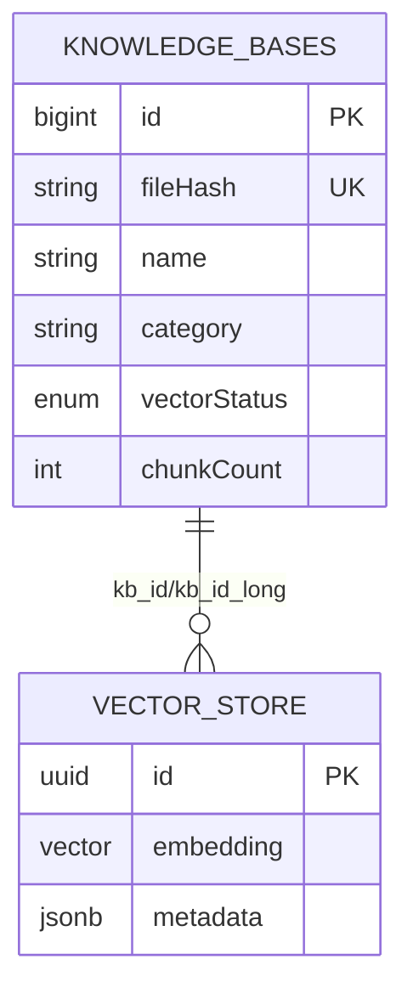
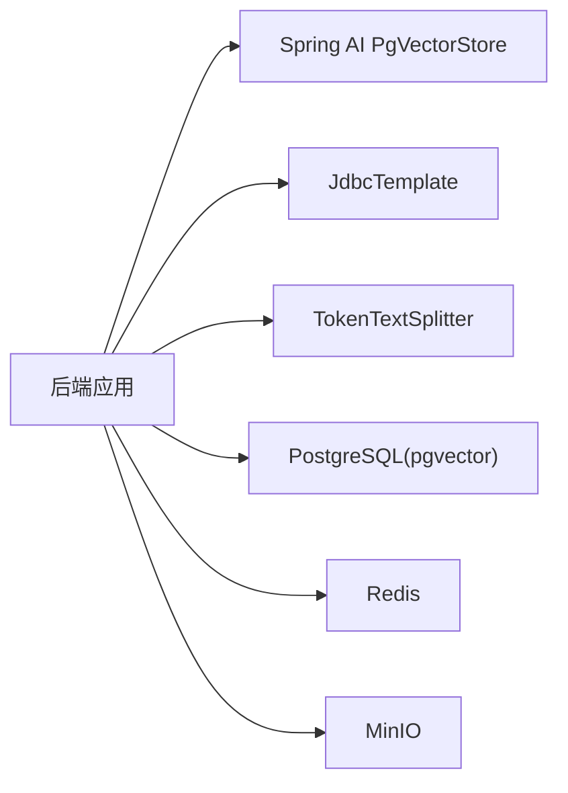

# 向量数据库集成

<cite>
**本文引用的文件**
- [init.sql](file://docker/postgres/init.sql)
- [application.yml](file://app/src/main/resources/application.yml)
- [docker-compose.yml](file://docker-compose.yml)
- [KnowledgeBaseVectorService.java](file://app/src/main/java/interview/guide/modules/knowledgebase/service/KnowledgeBaseVectorService.java)
- [VectorRepository.java](file://app/src/main/java/interview/guide/modules/knowledgebase/repository/VectorRepository.java)
- [KnowledgeBaseQueryService.java](file://app/src/main/java/interview/guide/modules/knowledgebase/service/KnowledgeBaseQueryService.java)
- [KnowledgeBaseEntity.java](file://app/src/main/java/interview/guide/modules/knowledgebase/model/KnowledgeBaseEntity.java)
- [KnowledgeBaseVectorServiceTest.java](file://app/src/test/java/interview/guide/modules/knowledgebase/service/KnowledgeBaseVectorServiceTest.java)
</cite>

## 目录
1. [简介](#简介)
2. [项目结构](#项目结构)
3. [核心组件](#核心组件)
4. [架构总览](#架构总览)
5. [详细组件分析](#详细组件分析)
6. [依赖分析](#依赖分析)
7. [性能考虑](#性能考虑)
8. [故障排查指南](#故障排查指南)
9. [结论](#结论)
10. [附录](#附录)

## 简介
本文件面向面试指南平台的向量数据库集成，围绕 pgvector 扩展在 PostgreSQL 中的安装与配置、向量字段设计、相似度计算与索引策略、向量查询与批量处理、以及与传统关系数据的关联查询进行系统化说明。文档同时结合项目现有实现，给出可落地的实践建议与可视化图示。

## 项目结构
面试指南平台采用容器化编排，PostgreSQL 使用 pgvector/pgvector:pg16 镜像以启用向量搜索能力；应用通过 Spring AI 的 PgVectorStore 抽象对接向量检索，并在容器启动时自动执行初始化脚本以创建 pgvector 扩展。

**图表来源**
- [docker-compose.yml:1-197](file://docker-compose.yml#L1-L197)

**章节来源**
- [docker-compose.yml:1-197](file://docker-compose.yml#L1-L197)

## 核心组件
- 向量扩展与初始化：容器首次启动时执行初始化脚本，创建 pgvector 扩展。
- 向量存储配置：通过 Spring AI 的 PgVectorStore 配置，指定索引类型、距离度量、维度与模式初始化策略。
- 向量服务：负责文本分块、向量化、批量入库、相似度检索与过滤。
- 关联查询：通过元数据字段与传统关系表进行联合查询与过滤。

**章节来源**
- [init.sql:1-2](file://docker/postgres/init.sql#L1-L2)
- [application.yml:115-124](file://app/src/main/resources/application.yml#L115-L124)
- [KnowledgeBaseVectorService.java:19-81](file://app/src/main/java/interview/guide/modules/knowledgebase/service/KnowledgeBaseVectorService.java#L19-L81)
- [VectorRepository.java:11-66](file://app/src/main/java/interview/guide/modules/knowledgebase/repository/VectorRepository.java#L11-L66)

## 架构总览
下图展示从应用到数据库的向量检索链路，包括向量入库、相似度检索与回退策略。

**图表来源**
- [KnowledgeBaseQueryService.java:93-155](file://app/src/main/java/interview/guide/modules/knowledgebase/service/KnowledgeBaseQueryService.java#L93-L155)
- [KnowledgeBaseVectorService.java:45-125](file://app/src/main/java/interview/guide/modules/knowledgebase/service/KnowledgeBaseVectorService.java#L45-L125)
- [VectorRepository.java:22-66](file://app/src/main/java/interview/guide/modules/knowledgebase/repository/VectorRepository.java#L22-L66)

## 详细组件分析

### pgvector 扩展安装与配置
- 扩展安装：容器首次启动时，初始化脚本自动执行以创建 pgvector 扩展。
- 数据库镜像：使用 pgvector/pgvector:pg16，内置向量搜索能力。
- Spring AI 配置：在应用配置中指定 PgVectorStore 的索引类型、距离度量、维度与模式初始化策略。

**图表来源**
- [init.sql:1-2](file://docker/postgres/init.sql#L1-L2)
- [docker-compose.yml:13-36](file://docker-compose.yml#L13-L36)
- [application.yml:115-124](file://app/src/main/resources/application.yml#L115-L124)

**章节来源**
- [init.sql:1-2](file://docker/postgres/init.sql#L1-L2)
- [docker-compose.yml:13-36](file://docker-compose.yml#L13-L36)
- [application.yml:115-124](file://app/src/main/resources/application.yml#L115-L124)

### 向量字段设计与元数据组织
- 向量字段类型：使用 vector 数据类型，维度由嵌入模型决定（配置中设置为 1024）。
- 元数据设计：向量存储的元数据字段统一存放知识库标识，兼容字符串与长整型两种格式，便于查询与过滤。
- 文档分块：使用 TokenTextSplitter 将长文本切分为约 800 tokens 的片段，提高检索粒度与准确性。

**图表来源**
- [KnowledgeBaseVectorService.java:52-81](file://app/src/main/java/interview/guide/modules/knowledgebase/service/KnowledgeBaseVectorService.java#L52-L81)
- [KnowledgeBaseVectorService.java:176-183](file://app/src/main/java/interview/guide/modules/knowledgebase/service/KnowledgeBaseVectorService.java#L176-L183)

**章节来源**
- [KnowledgeBaseVectorService.java:52-81](file://app/src/main/java/interview/guide/modules/knowledgebase/service/KnowledgeBaseVectorService.java#L52-L81)
- [KnowledgeBaseVectorService.java:176-183](file://app/src/main/java/interview/guide/modules/knowledgebase/service/KnowledgeBaseVectorService.java#L176-L183)

### 相似度计算与距离度量
- 距离度量：配置中采用余弦距离（COSINE_DISTANCE），适用于语义相似度比较。
- 阈值与 TopK：支持设置相似度阈值与返回条数上限，确保检索质量与性能平衡。
- 回退策略：当前置过滤失败时，自动降采样扩大检索范围并回退到本地过滤，保证可用性。

**图表来源**
- [KnowledgeBaseVectorService.java:91-125](file://app/src/main/java/interview/guide/modules/knowledgebase/service/KnowledgeBaseVectorService.java#L91-L125)
- [KnowledgeBaseVectorService.java:127-159](file://app/src/main/java/interview/guide/modules/knowledgebase/service/KnowledgeBaseVectorService.java#L127-L159)

**章节来源**
- [KnowledgeBaseVectorService.java:91-125](file://app/src/main/java/interview/guide/modules/knowledgebase/service/KnowledgeBaseVectorService.java#L91-L125)
- [KnowledgeBaseVectorService.java:127-159](file://app/src/main/java/interview/guide/modules/knowledgebase/service/KnowledgeBaseVectorService.java#L127-L159)

### 索引类型与优化策略
- 索引类型：配置中采用 HNSW，适合高维向量的近似最近邻检索，兼顾召回与性能。
- IVFFLAT 与 HNSW 对比（概念性说明）：
  - HNSW：适合高维、动态插入场景，查询速度快，内存占用相对较高。
  - IVFFLAT：适合大批量静态数据，内存占用较低，但查询延迟略高。
- 选择建议：当前配置优先 HNSW；若数据规模极大且更新频率低，可评估 IVFFLAT 并结合分片策略。

**章节来源**
- [application.yml:119-120](file://app/src/main/resources/application.yml#L119-L120)

### 向量查询实现模式
- KNN 搜索：基于向量相似度的最近邻检索，支持阈值与 topK 限制。
- 范围查询：通过相似度阈值实现范围过滤，避免返回弱相关结果。
- 批量向量处理：分批向量化与入库，避免单次请求过大导致超时或限流。
- 过滤表达式：基于元数据字段（kb_id/kb_id_long）进行知识库级过滤，兼容字符串与长整型。

**图表来源**
- [KnowledgeBaseVectorService.java:91-125](file://app/src/main/java/interview/guide/modules/knowledgebase/service/KnowledgeBaseVectorService.java#L91-L125)

**章节来源**
- [KnowledgeBaseVectorService.java:91-125](file://app/src/main/java/interview/guide/modules/knowledgebase/service/KnowledgeBaseVectorService.java#L91-L125)

### 向量数据的插入与更新流程
- 删除旧数据：按知识库 ID 删除历史向量，避免重复与陈旧信息影响检索。
- 文本分块：将长文本切分为多个片段，提高检索粒度。
- 元数据注入：统一设置 kb_id 与 kb_id_long，确保查询一致性。
- 分批入库：受嵌入 API 批量限制，按批次提交，提升吞吐与稳定性。

**图表来源**
- [VectorRepository.java:22-66](file://app/src/main/java/interview/guide/modules/knowledgebase/repository/VectorRepository.java#L22-L66)
- [KnowledgeBaseVectorService.java:45-81](file://app/src/main/java/interview/guide/modules/knowledgebase/service/KnowledgeBaseVectorService.java#L45-L81)

**章节来源**
- [VectorRepository.java:22-66](file://app/src/main/java/interview/guide/modules/knowledgebase/repository/VectorRepository.java#L22-L66)
- [KnowledgeBaseVectorService.java:45-81](file://app/src/main/java/interview/guide/modules/knowledgebase/service/KnowledgeBaseVectorService.java#L45-L81)

### 与传统关系数据的关联查询
- 元数据字段：向量存储的元数据字段包含知识库标识，便于与关系表进行关联。
- 过滤表达式：通过 kb_id in [...] 表达式实现知识库级过滤，兼容字符串与长整型。
- 实体模型：知识库实体包含向量化状态、错误信息与分块数量等字段，支撑向量化的可观测性与治理。

**图表来源**
- [KnowledgeBaseEntity.java:10-75](file://app/src/main/java/interview/guide/modules/knowledgebase/model/KnowledgeBaseEntity.java#L10-L75)
- [VectorRepository.java:26-45](file://app/src/main/java/interview/guide/modules/knowledgebase/repository/VectorRepository.java#L26-L45)

**章节来源**
- [KnowledgeBaseEntity.java:10-75](file://app/src/main/java/interview/guide/modules/knowledgebase/model/KnowledgeBaseEntity.java#L10-L75)
- [VectorRepository.java:26-45](file://app/src/main/java/interview/guide/modules/knowledgebase/repository/VectorRepository.java#L26-L45)

## 依赖分析
- 容器编排依赖：PostgreSQL(pgvector)、Redis、MinIO 三者健康状态决定应用启动时机。
- 应用依赖：Spring AI PgVectorStore 抽象、JDBC 模板用于直接删除旧向量、文本分块器与向量服务。

**图表来源**
- [docker-compose.yml:125-171](file://docker-compose.yml#L125-L171)
- [KnowledgeBaseVectorService.java:32-39](file://app/src/main/java/interview/guide/modules/knowledgebase/service/KnowledgeBaseVectorService.java#L32-L39)
- [VectorRepository.java:20-21](file://app/src/main/java/interview/guide/modules/knowledgebase/repository/VectorRepository.java#L20-L21)

**章节来源**
- [docker-compose.yml:125-171](file://docker-compose.yml#L125-L171)
- [KnowledgeBaseVectorService.java:32-39](file://app/src/main/java/interview/guide/modules/knowledgebase/service/KnowledgeBaseVectorService.java#L32-L39)
- [VectorRepository.java:20-21](file://app/src/main/java/interview/guide/modules/knowledgebase/repository/VectorRepository.java#L20-L21)

## 性能考虑
- 索引与距离：HNSW + 余弦距离适合高维语义检索；如需更低内存占用可评估 IVFFLAT。
- 批量入库：受嵌入 API 批量限制，采用分批入库策略，避免单次超时。
- 过滤与阈值：合理设置相似度阈值与 topK，减少无效匹配与下游模型负担。
- 回退策略：前置过滤失败时扩大检索范围并回退本地过滤，保障可用性与稳定性。

## 故障排查指南
- 向量搜索失败：检查嵌入 API 可用性与网络连通；查看回退路径日志，定位阈值与 topK 参数是否合理。
- 删除向量失败：确认元数据字段格式（kb_id/kb_id_long）与查询条件一致；关注异常抛出与事务回滚。
- 分批入库异常：核对分批大小与嵌入 API 限制；检查文本分块是否过小导致批次过多。

**章节来源**
- [KnowledgeBaseVectorService.java:76-81](file://app/src/main/java/interview/guide/modules/knowledgebase/service/KnowledgeBaseVectorService.java#L76-L81)
- [VectorRepository.java:59-63](file://app/src/main/java/interview/guide/modules/knowledgebase/repository/VectorRepository.java#L59-L63)
- [KnowledgeBaseVectorServiceTest.java:176-200](file://app/src/test/java/interview/guide/modules/knowledgebase/service/KnowledgeBaseVectorServiceTest.java#L176-L200)

## 结论
面试指南平台已基于 pgvector 完成向量数据库的基础设施与应用集成，涵盖扩展安装、配置、向量入库与检索、过滤与回退策略，以及与关系数据的关联查询。建议在生产环境中进一步完善索引策略评估、监控与容量规划，并持续优化查询参数与回退策略以提升用户体验与系统稳定性。

## 附录
- 配置要点摘要
  - 索引类型：HNSW
  - 距离度量：COSINE_DISTANCE
  - 维度：1024
  - 初始化策略：开发环境初始化，生产环境手动管理
- 关键实现参考
  - 向量服务：向量化、分批入库、相似度检索与过滤
  - 向量仓库：基于元数据的删除与过滤
  - 查询服务：RAG 流程、查询改写与流式输出

**章节来源**
- [application.yml:115-124](file://app/src/main/resources/application.yml#L115-L124)
- [KnowledgeBaseVectorService.java:45-125](file://app/src/main/java/interview/guide/modules/knowledgebase/service/KnowledgeBaseVectorService.java#L45-L125)
- [VectorRepository.java:22-66](file://app/src/main/java/interview/guide/modules/knowledgebase/repository/VectorRepository.java#L22-L66)
- [KnowledgeBaseQueryService.java:93-155](file://app/src/main/java/interview/guide/modules/knowledgebase/service/KnowledgeBaseQueryService.java#L93-L155)