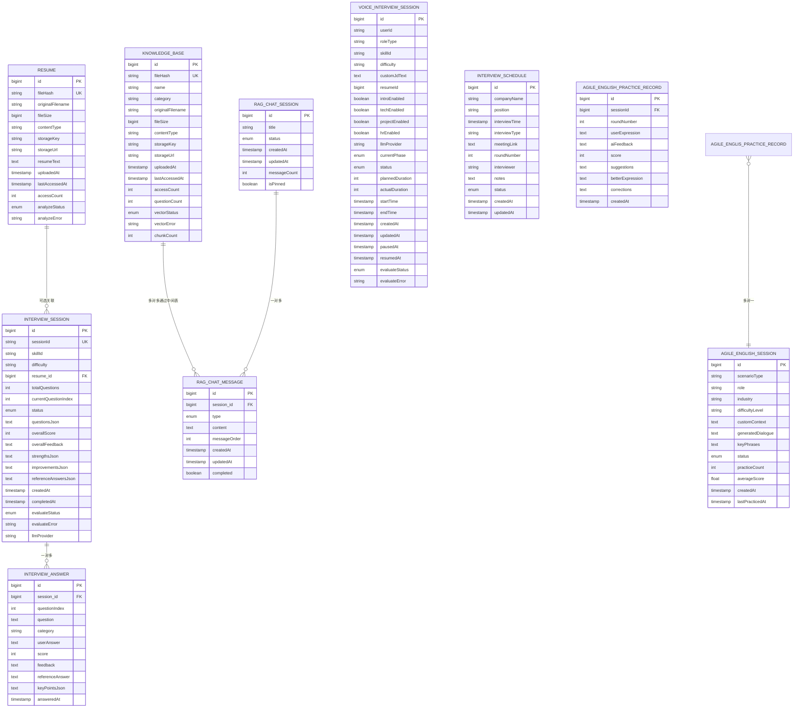
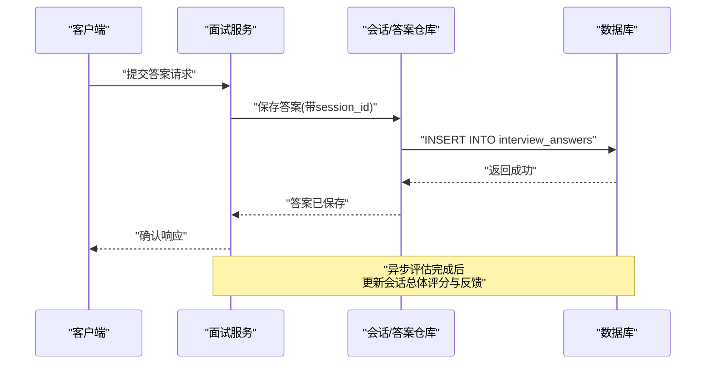
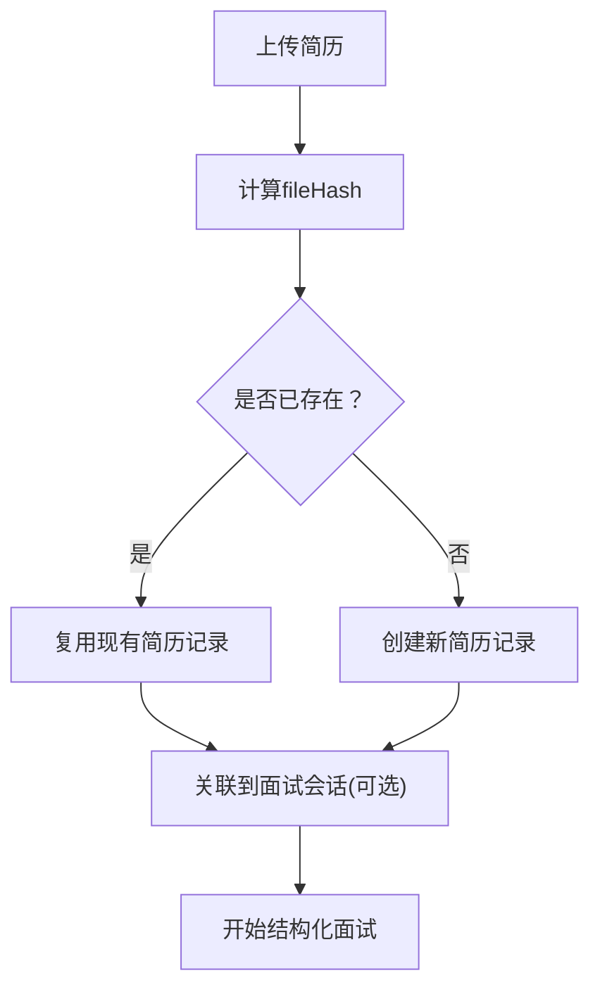
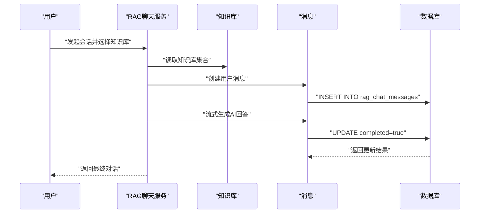

# 实体关系模型

<cite>
**本文引用的文件**
- [InterviewSessionEntity.java](file://app/src/main/java/interview/guide/modules/interview/model/InterviewSessionEntity.java)
- [InterviewAnswerEntity.java](file://app/src/main/java/interview/guide/modules/interview/model/InterviewAnswerEntity.java)
- [ResumeEntity.java](file://app/src/main/java/interview/guide/modules/resume/model/ResumeEntity.java)
- [KnowledgeBaseEntity.java](file://app/src/main/java/interview/guide/modules/knowledgebase/model/KnowledgeBaseEntity.java)
- [RagChatSessionEntity.java](file://app/src/main/java/interview/guide/modules/knowledgebase/model/RagChatSessionEntity.java)
- [RagChatMessageEntity.java](file://app/src/main/java/interview/guide/modules/knowledgebase/model/RagChatMessageEntity.java)
- [VoiceInterviewSessionEntity.java](file://app/src/main/java/interview/guide/modules/voiceinterview/model/VoiceInterviewSessionEntity.java)
- [InterviewScheduleEntity.java](file://app/src/main/java/interview/guide/modules/interviewschedule/model/InterviewScheduleEntity.java)
- [AgileEnglishPracticeSessionEntity.java](file://app/src/main/java/interview/guide/modules/interview/model/AgileEnglishPracticeSessionEntity.java)
- [AgileEnglishPracticeRecordEntity.java](file://app/src/main/java/interview/guide/modules/interview/model/AgileEnglishPracticeRecordEntity.java)
- [VectorStatus.java](file://app/src/main/java/interview/guide/modules/knowledgebase/model/VectorStatus.java)
- [VoiceInterviewSessionStatus.java](file://app/src/main/java/interview/guide/modules/voiceinterview/model/VoiceInterviewSessionStatus.java)
- [AsyncTaskStatus.java](file://app/src/main/java/interview/guide/common/model/AsyncTaskStatus.java)
- [init.sql](file://docker/postgres/init.sql)
</cite>

## 目录
1. [简介](#简介)
2. [项目结构](#项目结构)
3. [核心组件](#核心组件)
4. [架构总览](#架构总览)
5. [详细组件分析](#详细组件分析)
6. [依赖分析](#依赖分析)
7. [性能考量](#性能考量)
8. [故障排查指南](#故障排查指南)
9. [结论](#结论)
10. [附录](#附录)

## 简介
本文件面向面试指南平台，系统化梳理核心业务实体及其关系，重点覆盖以下实体：
- InterviewSessionEntity：结构化面试会话
- ResumeEntity：简历档案与去重
- KnowledgeBaseEntity：知识库与向量化
- VoiceInterviewSessionEntity：语音面试会话
- RagChatSessionEntity / RagChatMessageEntity：RAG聊天会话与消息
- InterviewScheduleEntity：面试日程
- AgileEnglishPracticeSessionEntity / AgileEnglishPracticeRecordEntity：敏捷英语练习会话与记录

文档将从实体设计思路、属性与业务含义、关系映射（一对一/一对多/多对多）、外键与约束策略、ER图说明、最佳实践等方面展开，并给出性能与排错建议。

## 项目结构
围绕“面试”“简历”“知识库/RAG”“语音面试”“日程”“英语练习”六大领域，采用按模块分层的组织方式：
- modules/interview：结构化面试、答案、英语练习
- modules/resume：简历解析与持久化
- modules/knowledgebase：知识库、RAG聊天
- modules/voiceinterview：语音面试
- modules/interviewschedule：面试日程
- common：公共枚举与工具

```mermaid
graph TB
subgraph "面试模块"
IS["InterviewSessionEntity"]
IA["InterviewAnswerEntity"]
AES["AgileEnglishPracticeSessionEntity"]
AER["AgileEnglishPracticeRecordEntity"]
end
subgraph "简历模块"
RES["ResumeEntity"]
end
subgraph "知识库/RAG模块"
KB["KnowledgeBaseEntity"]
RCS["RagChatSessionEntity"]
RCM["RagChatMessageEntity"]
end
subgraph "语音面试模块"
VIS["VoiceInterviewSessionEntity"]
end
subgraph "日程模块"
SCHED["InterviewScheduleEntity"]
end
RES <-- "可选关联" --> IS
IS --> IA
KB < --> RCS
RCS --> RCM
VIS -. "独立实体" .- KB
SCHED -. "独立实体" .- RES
AES -. "独立实体" .- RES
AER --> AES
```

图表来源
- [InterviewSessionEntity.java:14-287](file://app/src/main/java/interview/guide/modules/interview/model/InterviewSessionEntity.java#L14-L287)
- [InterviewAnswerEntity.java:10-157](file://app/src/main/java/interview/guide/modules/interview/model/InterviewAnswerEntity.java#L10-L157)
- [ResumeEntity.java:12-184](file://app/src/main/java/interview/guide/modules/resume/model/ResumeEntity.java#L12-L184)
- [KnowledgeBaseEntity.java:10-223](file://app/src/main/java/interview/guide/modules/knowledgebase/model/KnowledgeBaseEntity.java#L10-L223)
- [RagChatSessionEntity.java:18-127](file://app/src/main/java/interview/guide/modules/knowledgebase/model/RagChatSessionEntity.java#L18-L127)
- [RagChatMessageEntity.java:14-93](file://app/src/main/java/interview/guide/modules/knowledgebase/model/RagChatMessageEntity.java#L14-L93)
- [VoiceInterviewSessionEntity.java:13-122](file://app/src/main/java/interview/guide/modules/voiceinterview/model/VoiceInterviewSessionEntity.java#L13-L122)
- [InterviewScheduleEntity.java:7-59](file://app/src/main/java/interview/guide/modules/interviewschedule/model/InterviewScheduleEntity.java#L7-L59)
- [AgileEnglishPracticeSessionEntity.java:15-133](file://app/src/main/java/interview/guide/modules/interview/model/AgileEnglishPracticeSessionEntity.java#L15-L133)
- [AgileEnglishPracticeRecordEntity.java:15-95](file://app/src/main/java/interview/guide/modules/interview/model/AgileEnglishPracticeRecordEntity.java#L15-L95)

章节来源
- [InterviewSessionEntity.java:14-287](file://app/src/main/java/interview/guide/modules/interview/model/InterviewSessionEntity.java#L14-L287)
- [KnowledgeBaseEntity.java:10-223](file://app/src/main/java/interview/guide/modules/knowledgebase/model/KnowledgeBaseEntity.java#L10-L223)
- [VoiceInterviewSessionEntity.java:13-122](file://app/src/main/java/interview/guide/modules/voiceinterview/model/VoiceInterviewSessionEntity.java#L13-L122)

## 核心组件
本节聚焦关键实体的属性设计与业务含义，以及其在整体流程中的作用。

- InterviewSessionEntity（结构化面试会话）
  - 设计要点：会话标识、技能标签、难度、关联简历（可空）、问题清单、分数与反馈、答案集合、异步评估状态与错误、LLM提供商等。
  - 关系：一对多到 InterviewAnswerEntity；可选多对一到 ResumeEntity。
  - 索引：基于简历+创建时间、简历+状态+创建时间、技能+创建时间，优化查询与排序。
  - 章节来源
    - [InterviewSessionEntity.java:14-110](file://app/src/main/java/interview/guide/modules/interview/model/InterviewSessionEntity.java#L14-L110)
    - [InterviewSessionEntity.java:112-116](file://app/src/main/java/interview/guide/modules/interview/model/InterviewSessionEntity.java#L112-L116)

- ResumeEntity（简历实体）
  - 设计要点：文件哈希去重、原始文件名、大小、类型、存储Key/URL、解析文本、上传/最后访问时间、访问计数、分析状态与错误。
  - 索引：fileHash 唯一索引，保证去重与快速查找。
  - 章节来源
    - [ResumeEntity.java:12-72](file://app/src/main/java/interview/guide/modules/resume/model/ResumeEntity.java#L12-L72)

- KnowledgeBaseEntity（知识库）
  - 设计要点：文件哈希去重、名称、分类、原始文件名、大小、类型、存储Key/URL、上传/最后访问时间、访问计数、问题计数、向量化状态与错误、分块数量。
  - 索引：fileHash 唯一索引、category 索引，便于检索与聚合。
  - 章节来源
    - [KnowledgeBaseEntity.java:10-81](file://app/src/main/java/interview/guide/modules/knowledgebase/model/KnowledgeBaseEntity.java#L10-L81)

- VoiceInterviewSessionEntity（语音面试会话）
  - 设计要点：用户ID、角色类型、技能ID、难度、自定义JD、简历ID、各阶段开关、计划/实际时长、起止时间、状态、评估状态与错误。
  - 章节来源
    - [VoiceInterviewSessionEntity.java:13-122](file://app/src/main/java/interview/guide/modules/voiceinterview/model/VoiceInterviewSessionEntity.java#L13-L122)

- RagChatSessionEntity / RagChatMessageEntity（RAG聊天）
  - 设计要点：会话标题、状态、多对多关联知识库、一对多消息列表、消息顺序、置顶标记、更新时间等。
  - 索引：会话更新时间、消息会话+顺序。
  - 章节来源
    - [RagChatSessionEntity.java:18-106](file://app/src/main/java/interview/guide/modules/knowledgebase/model/RagChatSessionEntity.java#L18-L106)
    - [RagChatMessageEntity.java:14-93](file://app/src/main/java/interview/guide/modules/knowledgebase/model/RagChatMessageEntity.java#L14-L93)

- InterviewAnswerEntity（面试答案）
  - 设计要点：会话外键、问题索引、问题/类别、用户答案、得分/反馈、参考答案、关键点（JSON）、回答时间。
  - 约束：session_id+question_index 唯一，确保同一会话内每题仅一条答案。
  - 章节来源
    - [InterviewAnswerEntity.java:10-66](file://app/src/main/java/interview/guide/modules/interview/model/InterviewAnswerEntity.java#L10-L66)

- InterviewScheduleEntity（面试日程）
  - 设计要点：公司、岗位、时间、形式、会议链接、轮次、面试官、备注、状态、创建/更新时间。
  - 章节来源
    - [InterviewScheduleEntity.java:7-59](file://app/src/main/java/interview/guide/modules/interviewschedule/model/InterviewScheduleEntity.java#L7-L59)

- AgileEnglishPracticeSessionEntity / AgileEnglishPracticeRecordEntity（英语练习）
  - 设计要点：场景类型、角色、行业、难度、自定义上下文、生成对话、关键短语、状态、练习次数与平均分、创建/最后练习时间；记录包含轮次、用户表达、AI反馈、评分、建议、更好表达、纠正内容。
  - 章节来源
    - [AgileEnglishPracticeSessionEntity.java:15-133](file://app/src/main/java/interview/guide/modules/interview/model/AgileEnglishPracticeSessionEntity.java#L15-L133)
    - [AgileEnglishPracticeRecordEntity.java:15-95](file://app/src/main/java/interview/guide/modules/interview/model/AgileEnglishPracticeRecordEntity.java#L15-L95)

## 架构总览
下图展示核心实体之间的关系与数据流向，突出外键、主键、唯一性与多对多连接表。



图表来源
- [ResumeEntity.java:12-184](file://app/src/main/java/interview/guide/modules/resume/model/ResumeEntity.java#L12-L184)
- [InterviewSessionEntity.java:14-287](file://app/src/main/java/interview/guide/modules/interview/model/InterviewSessionEntity.java#L14-L287)
- [InterviewAnswerEntity.java:10-157](file://app/src/main/java/interview/guide/modules/interview/model/InterviewAnswerEntity.java#L10-L157)
- [KnowledgeBaseEntity.java:10-223](file://app/src/main/java/interview/guide/modules/knowledgebase/model/KnowledgeBaseEntity.java#L10-L223)
- [RagChatSessionEntity.java:18-127](file://app/src/main/java/interview/guide/modules/knowledgebase/model/RagChatSessionEntity.java#L18-L127)
- [RagChatMessageEntity.java:14-93](file://app/src/main/java/interview/guide/modules/knowledgebase/model/RagChatMessageEntity.java#L14-L93)
- [VoiceInterviewSessionEntity.java:13-122](file://app/src/main/java/interview/guide/modules/voiceinterview/model/VoiceInterviewSessionEntity.java#L13-L122)
- [InterviewScheduleEntity.java:7-59](file://app/src/main/java/interview/guide/modules/interviewschedule/model/InterviewScheduleEntity.java#L7-L59)
- [AgileEnglishPracticeSessionEntity.java:15-133](file://app/src/main/java/interview/guide/modules/interview/model/AgileEnglishPracticeSessionEntity.java#L15-L133)
- [AgileEnglishPracticeRecordEntity.java:15-95](file://app/src/main/java/interview/guide/modules/interview/model/AgileEnglishPracticeRecordEntity.java#L15-L95)

## 详细组件分析

### InterviewSessionEntity 与 InterviewAnswerEntity
- 关系映射：一对多（会话-答案），答案通过 session_id 外键回指会话。
- 唯一性：答案表对 (session_id, question_index) 唯一，确保每会话每题仅一条答案。
- 级联策略：答案集合使用 cascade = CascadeType.ALL，孤儿移除 orphanRemoval = true，保证会话删除时自动清理答案。
- 查询优化：会话表对 resume_id+created_at、resume_id+status+created_at、skillId+createdAt 建有索引，提升筛选与排序效率。
- 数据流向：创建会话 -> 逐题提交答案 -> 异步评估 -> 生成总体评分与反馈。



图表来源
- [InterviewAnswerEntity.java:10-66](file://app/src/main/java/interview/guide/modules/interview/model/InterviewAnswerEntity.java#L10-L66)
- [InterviewSessionEntity.java:82-83](file://app/src/main/java/interview/guide/modules/interview/model/InterviewSessionEntity.java#L82-L83)

章节来源
- [InterviewSessionEntity.java:82-83](file://app/src/main/java/interview/guide/modules/interview/model/InterviewSessionEntity.java#L82-L83)
- [InterviewAnswerEntity.java:12-17](file://app/src/main/java/interview/guide/modules/interview/model/InterviewAnswerEntity.java#L12-L17)

### ResumeEntity 与 InterviewSessionEntity
- 关系映射：可选多对一（会话-简历）。会话表保留 resume_id 列以避免懒加载触发额外查询。
- 去重策略：简历表以 fileHash 唯一索引保证内容去重，提升复用率。
- 数据流向：上传简历 -> 解析与入库 -> 结构化面试时可选择关联简历，驱动个性化问题生成。



图表来源
- [ResumeEntity.java:12-72](file://app/src/main/java/interview/guide/modules/resume/model/ResumeEntity.java#L12-L72)
- [InterviewSessionEntity.java:38-45](file://app/src/main/java/interview/guide/modules/interview/model/InterviewSessionEntity.java#L38-L45)

章节来源
- [ResumeEntity.java:12-72](file://app/src/main/java/interview/guide/modules/resume/model/ResumeEntity.java#L12-L72)
- [InterviewSessionEntity.java:38-45](file://app/src/main/java/interview/guide/modules/interview/model/InterviewSessionEntity.java#L38-L45)

### KnowledgeBaseEntity、RagChatSessionEntity、RagChatMessageEntity
- 关系映射：
  - 多对多：知识库与聊天会话通过中间表 rag_session_knowledge_bases 关联。
  - 一对多：会话到消息，按 messageOrder 排序。
- 约束与索引：知识库 fileHash 唯一；会话与消息均有相应索引，保障检索与流式更新。
- 数据流向：上传知识库 -> 向量化 -> 创建RAG会话 -> 多轮问答 -> 流式更新消息完成状态。



图表来源
- [RagChatSessionEntity.java:47-60](file://app/src/main/java/interview/guide/modules/knowledgebase/model/RagChatSessionEntity.java#L47-L60)
- [RagChatMessageEntity.java:14-93](file://app/src/main/java/interview/guide/modules/knowledgebase/model/RagChatMessageEntity.java#L14-L93)
- [KnowledgeBaseEntity.java:10-81](file://app/src/main/java/interview/guide/modules/knowledgebase/model/KnowledgeBaseEntity.java#L10-L81)

章节来源
- [RagChatSessionEntity.java:47-60](file://app/src/main/java/interview/guide/modules/knowledgebase/model/RagChatSessionEntity.java#L47-L60)
- [RagChatMessageEntity.java:14-93](file://app/src/main/java/interview/guide/modules/knowledgebase/model/RagChatMessageEntity.java#L14-L93)

### VoiceInterviewSessionEntity
- 设计要点：包含角色类型、技能ID、难度、自定义JD、简历ID、各阶段开关、计划/实际时长、起止时间、状态、评估状态与错误。
- 章节来源
  - [VoiceInterviewSessionEntity.java:13-122](file://app/src/main/java/interview/guide/modules/voiceinterview/model/VoiceInterviewSessionEntity.java#L13-L122)

### 其他实体
- InterviewScheduleEntity：用于管理面试日程，字段覆盖公司、岗位、时间、形式、会议链接、轮次、面试官、备注、状态及时间戳。
- 章节来源
  - [InterviewScheduleEntity.java:7-59](file://app/src/main/java/interview/guide/modules/interviewschedule/model/InterviewScheduleEntity.java#L7-L59)

- AgileEnglishPracticeSessionEntity / AgileEnglishPracticeRecordEntity：记录英语练习场景、角色、难度、上下文、生成对话、关键短语、状态、练习统计；记录包含轮次、用户表达、AI反馈、评分、建议、更好表达、纠正内容。
- 章节来源
  - [AgileEnglishPracticeSessionEntity.java:15-133](file://app/src/main/java/interview/guide/modules/interview/model/AgileEnglishPracticeSessionEntity.java#L15-L133)
  - [AgileEnglishPracticeRecordEntity.java:15-95](file://app/src/main/java/interview/guide/modules/interview/model/AgileEnglishPracticeRecordEntity.java#L15-L95)

## 依赖分析
- 枚举类型
  - AsyncTaskStatus：异步任务状态（如 PENDING、COMPLETED、FAILED）。
  - VectorStatus：知识库向量化状态（与 KnowledgeBaseEntity 的 vectorStatus 字段对应）。
  - VoiceInterviewSessionStatus：语音面试会话状态（与 VoiceInterviewSessionEntity 的 status 字段对应）。
- 外部依赖
  - Postgres 扩展 vector：用于向量相似度检索与RAG增强。
- 章节来源
  - [AsyncTaskStatus.java](file://app/src/main/java/interview/guide/common/model/AsyncTaskStatus.java)
  - [VectorStatus.java](file://app/src/main/java/interview/guide/modules/knowledgebase/model/VectorStatus.java)
  - [VoiceInterviewSessionStatus.java](file://app/src/main/java/interview/guide/modules/voiceinterview/model/VoiceInterviewSessionStatus.java)
  - [init.sql:1-2](file://docker/postgres/init.sql#L1-L2)

## 性能考量
- 索引策略
  - InterviewSessionEntity：对 resume_id+created_at、resume_id+status+created_at、skillId+createdAt 建有索引，有利于按简历与技能维度快速筛选与排序。
  - RagChatSessionEntity：对 updatedAt 建有索引，便于最近活跃会话检索。
  - RagChatMessageEntity：对 session_id、session_id+messageOrder 建有索引，保障消息有序检索与流式更新。
  - ResumeEntity/KnowledgeBaseEntity：对 fileHash 建有唯一索引，加速去重与存在性检查。
- 延迟加载与直连列
  - InterviewSessionEntity 中 resume_id 使用 insertable=false, updatable=false，避免懒加载触发额外查询，同时保留直连列以支持高效过滤。
- JSON/大字段
  - 多处使用 TEXT 类型存储 JSON/长文本，注意在查询中避免全表扫描，必要时结合索引或物化视图。
- 向量化与扩展
  - Postgres 安装 vector 扩展，配合 KnowledgeBaseEntity 的向量化状态与分块数量，支撑 RAG 检索性能。

[本节为通用性能指导，不直接分析具体文件]

## 故障排查指南
- 异步任务状态
  - AsyncTaskStatus：用于跟踪简历解析、知识库向量化、面试评估等异步任务的生命周期。若出现长时间 PENDING 或 FAILED，需检查对应错误字段与日志。
- 章节来源
  - [AsyncTaskStatus.java](file://app/src/main/java/interview/guide/common/model/AsyncTaskStatus.java)

- 知识库向量化
  - VectorStatus：当状态长期为 PENDING 或出现 vectorError 时，检查向量化服务链路与存储配置。
- 章节来源
  - [VectorStatus.java](file://app/src/main/java/interview/guide/modules/knowledgebase/model/VectorStatus.java)

- 语音面试会话
  - VoiceInterviewSessionStatus：若状态异常停滞，检查评估状态 evaluateStatus 与 evaluateError，确认外部 LLM 服务可用性。
- 章节来源
  - [VoiceInterviewSessionStatus.java](file://app/src/main/java/interview/guide/modules/voiceinterview/model/VoiceInterviewSessionStatus.java)

- 答案唯一性冲突
  - InterviewAnswerEntity 对 (session_id, question_index) 唯一约束，重复提交同一题答案会触发唯一性冲突。应确保前端/服务端正确传递 questionIndex。
- 章节来源
  - [InterviewAnswerEntity.java:12-14](file://app/src/main/java/interview/guide/modules/interview/model/InterviewAnswerEntity.java#L12-L14)

## 结论
本实体关系模型围绕“简历-会话-答案-知识库-RAG-语音面试-日程-英语练习”的完整闭环构建，通过合理的索引、唯一约束与外键策略，兼顾查询性能与数据一致性。建议在后续迭代中持续关注：
- 向量化检索的性能与召回优化
- 异步任务的可观测性与重试机制
- 大字段查询的索引与缓存策略
- 多对多中间表的维护与清理

[本节为总结性内容，不直接分析具体文件]

## 附录

### 实体设计最佳实践
- 字段命名规范
  - 使用下划线分隔的英文全称，如 resume_id、session_id、message_order。
  - 时间戳统一使用 createdAt/updatedAt，区分创建与更新。
- 数据类型选择
  - 主键：bigint（PostgreSQL IDENTITY）。
  - 文本：TEXT 用于长文本/JSON；CHAR/VARCHAR 明确长度限制。
  - 枚举：使用 EnumType.STRING 存储字符串，便于迁移与阅读。
- 长度限制
  - UUID/ID 字符串：长度 36；文件哈希：64；常见枚举字段：长度 20；较长描述：长度 1000。
- 约束与索引
  - 唯一性：fileHash、sessionId、(session_id, question_index)。
  - 索引：常用过滤/排序字段建立单列或多列索引。
- 外键与级联
  - 明确外键指向，一对多使用级联删除/孤儿移除控制子对象生命周期。
  - 可选关联使用直连列（如 resume_id）减少 N+1 查询风险。
- 事务与幂等
  - 对外键插入与唯一约束冲突做好幂等处理与重试策略。
- 向量化与扩展
  - Postgres 安装 vector 扩展，结合分块数量与向量化状态字段，支撑 RAG 检索。

[本节为通用最佳实践，不直接分析具体文件]