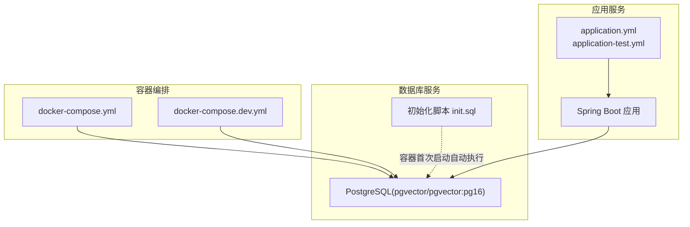
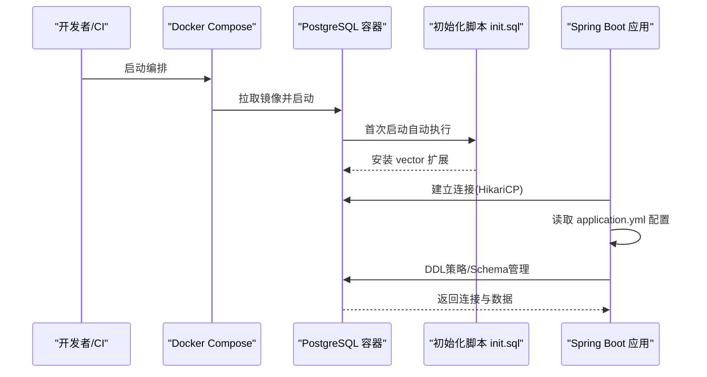
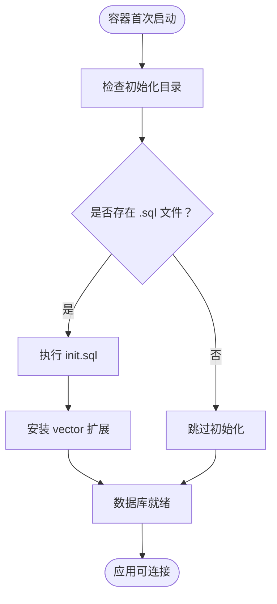
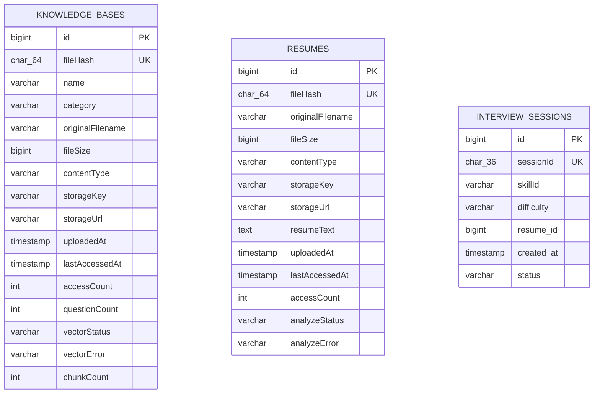
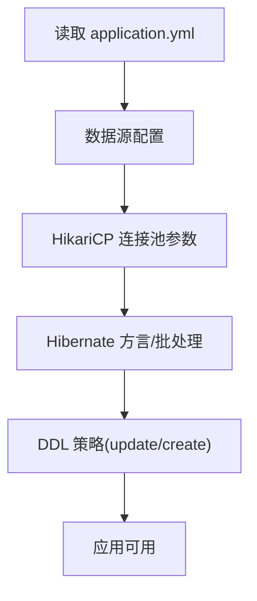
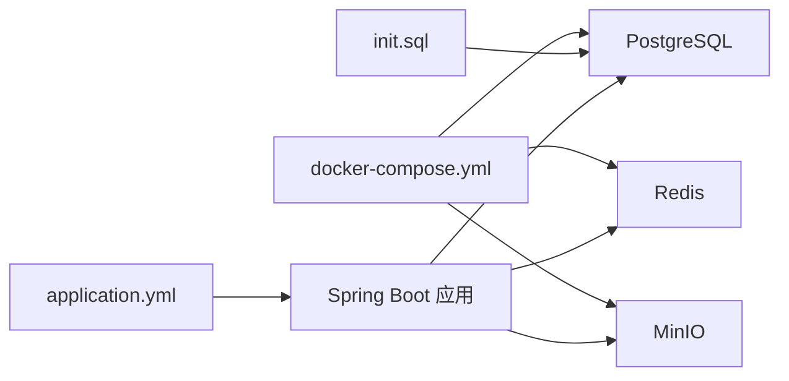

# 数据库初始化

<cite>
**本文引用的文件**   
- [init.sql](file://docker/postgres/init.sql)
- [docker-compose.yml](file://docker-compose.yml)
- [docker-compose.dev.yml](file://docker-compose.dev.yml)
- [application.yml](file://app/src/main/resources/application.yml)
- [application-test.yml](file://app/src/test/resources/application-test.yml)
- [KnowledgeBaseEntity.java](file://app/src/main/java/interview/guide/modules/knowledgebase/model/KnowledgeBaseEntity.java)
- [ResumeEntity.java](file://app/src/main/java/interview/guide/modules/resume/model/ResumeEntity.java)
- [InterviewSessionEntity.java](file://app/src/main/java/interview/guide/modules/interview/model/InterviewSessionEntity.java)
</cite>

## 目录
1. [简介](#简介)
2. [项目结构](#项目结构)
3. [核心组件](#核心组件)
4. [架构总览](#架构总览)
5. [详细组件分析](#详细组件分析)
6. [依赖分析](#依赖分析)
7. [性能考量](#性能考量)
8. [故障排除指南](#故障排除指南)
9. [结论](#结论)
10. [附录](#附录)

## 简介
本文件面向面试指南平台的数据库初始化与运维，聚焦以下目标：
- 解释PostgreSQL数据库初始化脚本与容器编排，确保扩展安装、表结构与索引一致性
- 详解pgvector扩展的安装与使用，覆盖扩展启用、权限配置、版本兼容性
- 给出数据库连接配置优化建议，包括连接池、超时、驱动与方言
- 明确初始化顺序与依赖关系，保证数据库结构完整
- 提供错误处理与故障排除清单，涵盖扩展安装失败、权限不足、版本冲突等
- 区分开发与生产环境的初始化策略，包括环境变量、种子数据、监控配置

## 项目结构
平台采用多服务编排，数据库初始化由容器镜像与初始化脚本共同完成，并通过Spring Boot应用进行连接与Schema管理。

图表来源
- [docker-compose.yml:13-35](file://docker-compose.yml#L13-L35)
- [docker-compose.dev.yml:7-23](file://docker-compose.dev.yml#L7-L23)
- [init.sql:1-2](file://docker/postgres/init.sql#L1-L2)
- [application.yml:48-62](file://app/src/main/resources/application.yml#L48-L62)

章节来源
- [docker-compose.yml:1-197](file://docker-compose.yml#L1-L197)
- [docker-compose.dev.yml:1-64](file://docker-compose.dev.yml#L1-L64)
- [init.sql:1-2](file://docker/postgres/init.sql#L1-L2)
- [application.yml:48-124](file://app/src/main/resources/application.yml#L48-L124)

## 核心组件
- PostgreSQL容器与pgvector扩展：使用官方pgvector镜像，首次启动自动执行初始化脚本启用vector扩展
- 初始化脚本：仅包含扩展安装语句，确保容器内具备向量检索能力
- Spring Boot数据源与JPA/Hibernate：通过HikariCP连接池、PostgreSQL方言、DDL策略与索引注解实现Schema一致性
- 开发/测试配置：开发环境使用pgvector镜像，测试环境使用内存数据库，避免对真实数据库产生影响

章节来源
- [docker-compose.yml:13-35](file://docker-compose.yml#L13-L35)
- [docker-compose.dev.yml:7-23](file://docker-compose.dev.yml#L7-L23)
- [init.sql:1-2](file://docker/postgres/init.sql#L1-L2)
- [application.yml:48-78](file://app/src/main/resources/application.yml#L48-L78)
- [application-test.yml:1-47](file://app/src/test/resources/application-test.yml#L1-L47)

## 架构总览
数据库初始化与运行的关键流程如下：

图表来源
- [docker-compose.yml:13-35](file://docker-compose.yml#L13-L35)
- [docker-compose.dev.yml:7-23](file://docker-compose.dev.yml#L7-L23)
- [init.sql:1-2](file://docker/postgres/init.sql#L1-L2)
- [application.yml:48-78](file://app/src/main/resources/application.yml#L48-L78)

## 详细组件分析

### PostgreSQL 初始化脚本与扩展安装
- 初始化脚本位于容器入口点的初始化目录，首次启动自动执行
- 脚本内容为安装pgvector扩展，确保数据库具备向量索引与相似度检索能力
- 该脚本不包含表结构与索引创建，表结构与索引由应用侧通过JPA/Hibernate与实体注解统一管理

图表来源
- [docker-compose.yml:24-25](file://docker-compose.yml#L24-L25)
- [init.sql:1-2](file://docker/postgres/init.sql#L1-L2)

章节来源
- [docker-compose.yml:13-35](file://docker-compose.yml#L13-L35)
- [docker-compose.dev.yml:14-16](file://docker-compose.dev.yml#L14-L16)
- [init.sql:1-2](file://docker/postgres/init.sql#L1-L2)

### 表结构与索引设计
- 实体通过JPA注解定义表名与索引，确保查询性能与唯一性约束
- 示例实体包含：
  - 知识库表：唯一文件哈希索引、分类索引
  - 简历表：唯一文件哈希索引
  - 面试会话表：复合索引覆盖简历ID与时间、技能ID与时间等高频查询条件

图表来源
- [KnowledgeBaseEntity.java:10-71](file://app/src/main/java/interview/guide/modules/knowledgebase/model/KnowledgeBaseEntity.java#L10-L71)
- [ResumeEntity.java:12-66](file://app/src/main/java/interview/guide/modules/resume/model/ResumeEntity.java#L12-L66)
- [InterviewSessionEntity.java:14-40](file://app/src/main/java/interview/guide/modules/interview/model/InterviewSessionEntity.java#L14-L40)

章节来源
- [KnowledgeBaseEntity.java:10-71](file://app/src/main/java/interview/guide/modules/knowledgebase/model/KnowledgeBaseEntity.java#L10-L71)
- [ResumeEntity.java:12-66](file://app/src/main/java/interview/guide/modules/resume/model/ResumeEntity.java#L12-L66)
- [InterviewSessionEntity.java:14-40](file://app/src/main/java/interview/guide/modules/interview/model/InterviewSessionEntity.java#L14-L40)

### 数据库连接配置与优化
- 数据源：PostgreSQL JDBC驱动，支持HikariCP连接池
- 连接池参数：最大池大小、最小空闲、连接超时、空闲超时、最大生存时间、自动提交
- 方言与批处理：PostgreSQL方言、批量插入/更新顺序优化
- DDL策略：开发阶段可使用自动更新，生产环境建议改为受控迁移策略

图表来源
- [application.yml:48-78](file://app/src/main/resources/application.yml#L48-L78)
- [application.yml:116-124](file://app/src/main/resources/application.yml#L116-L124)

章节来源
- [application.yml:48-78](file://app/src/main/resources/application.yml#L48-L78)
- [application.yml:116-124](file://app/src/main/resources/application.yml#L116-L124)

### 开发与生产环境差异
- 开发环境
  - 使用pgvector镜像，初始化脚本启用扩展
  - 应用通过环境变量连接数据库，健康检查保障启动顺序
  - 测试环境使用内存数据库，避免对真实数据库产生影响
- 生产环境
  - 建议禁用自动DDL，采用受控迁移工具管理Schema
  - 明确扩展安装与权限授予流程，确保只授予必要权限
  - 配置连接池与超时参数，结合监控与告警

章节来源
- [docker-compose.yml:13-35](file://docker-compose.yml#L13-L35)
- [docker-compose.dev.yml:7-23](file://docker-compose.dev.yml#L7-L23)
- [application-test.yml:1-47](file://app/src/test/resources/application-test.yml#L1-L47)

## 依赖分析
- 容器编排依赖：应用服务依赖数据库、缓存与对象存储健康状态
- 初始化依赖：容器首次启动执行初始化脚本，确保扩展可用
- 应用依赖：应用通过配置文件连接数据库，DDL策略与实体注解共同维护Schema

图表来源
- [docker-compose.yml:13-35](file://docker-compose.yml#L13-L35)
- [docker-compose.yml:125-169](file://docker-compose.yml#L125-L169)
- [init.sql:1-2](file://docker/postgres/init.sql#L1-L2)
- [application.yml:48-78](file://app/src/main/resources/application.yml#L48-L78)

章节来源
- [docker-compose.yml:13-35](file://docker-compose.yml#L13-L35)
- [docker-compose.yml:125-169](file://docker-compose.yml#L125-L169)
- [application.yml:48-78](file://app/src/main/resources/application.yml#L48-L78)

## 性能考量
- 连接池：根据I/O密集型场景调整最大池大小与空闲超时，避免过多连接导致上下文切换开销
- 批处理：启用批量插入/更新顺序优化，降低网络往返与锁竞争
- 索引：实体注解定义的索引应与查询模式匹配，避免冗余索引造成写入性能下降
- 向量检索：pgvector扩展的索引类型与距离度量需与嵌入维度一致，避免检索性能退化

章节来源
- [application.yml:54-61](file://app/src/main/resources/application.yml#L54-L61)
- [application.yml:73-77](file://app/src/main/resources/application.yml#L73-L77)
- [application.yml:116-124](file://app/src/main/resources/application.yml#L116-L124)

## 故障排除指南
- 扩展安装失败
  - 现象：容器启动后无法使用向量功能
  - 排查：确认初始化脚本已执行、数据库用户具备扩展安装权限
  - 处理：检查容器日志与初始化目录挂载路径
- 权限不足
  - 现象：应用无法创建表或修改Schema
  - 排查：核对数据源用户名与密码、DDL策略配置
  - 处理：在生产环境使用专用数据库用户并授予最小必要权限
- 版本冲突
  - 现象：pgvector与PostgreSQL版本不兼容
  - 排查：确认镜像标签与PostgreSQL版本匹配
  - 处理：使用官方pgvector镜像对应版本
- 连接超时/抖动
  - 现象：应用启动阶段反复重试连接
  - 排查：健康检查间隔与超时、网络连通性
  - 处理：调整健康检查参数与连接池超时

章节来源
- [docker-compose.yml:31-35](file://docker-compose.yml#L31-L35)
- [docker-compose.dev.yml:19-23](file://docker-compose.dev.yml#L19-L23)
- [application.yml:54-61](file://app/src/main/resources/application.yml#L54-L61)

## 结论
平台通过容器化编排与初始化脚本确保数据库扩展可用，配合应用侧的连接池、方言与DDL策略实现Schema一致性与性能优化。开发与生产环境在初始化策略、权限与迁移方式上应差异化配置，以满足不同阶段的安全性与稳定性需求。

## 附录
- 环境变量与配置要点
  - 数据库：主机、端口、数据库名、用户名、密码
  - 连接池：最大池大小、最小空闲、连接超时、空闲超时、最大生存时间
  - DDL策略：开发阶段可使用自动更新，生产环境建议改为受控迁移
- 初始化顺序与依赖
  - 容器健康检查优先于应用启动
  - 初始化脚本在容器首次启动时执行
  - 应用连接数据库后按配置执行Schema管理

章节来源
- [docker-compose.yml:140-169](file://docker-compose.yml#L140-L169)
- [application.yml:48-78](file://app/src/main/resources/application.yml#L48-L78)
- [application.yml:116-124](file://app/src/main/resources/application.yml#L116-L124)