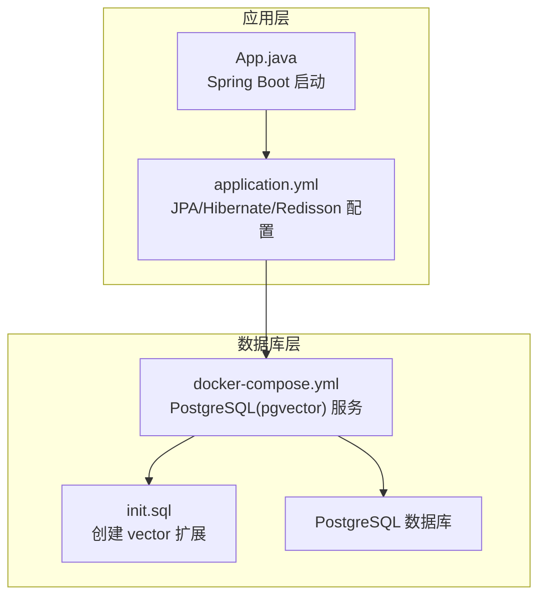
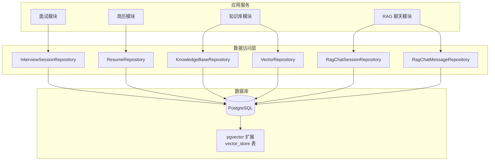
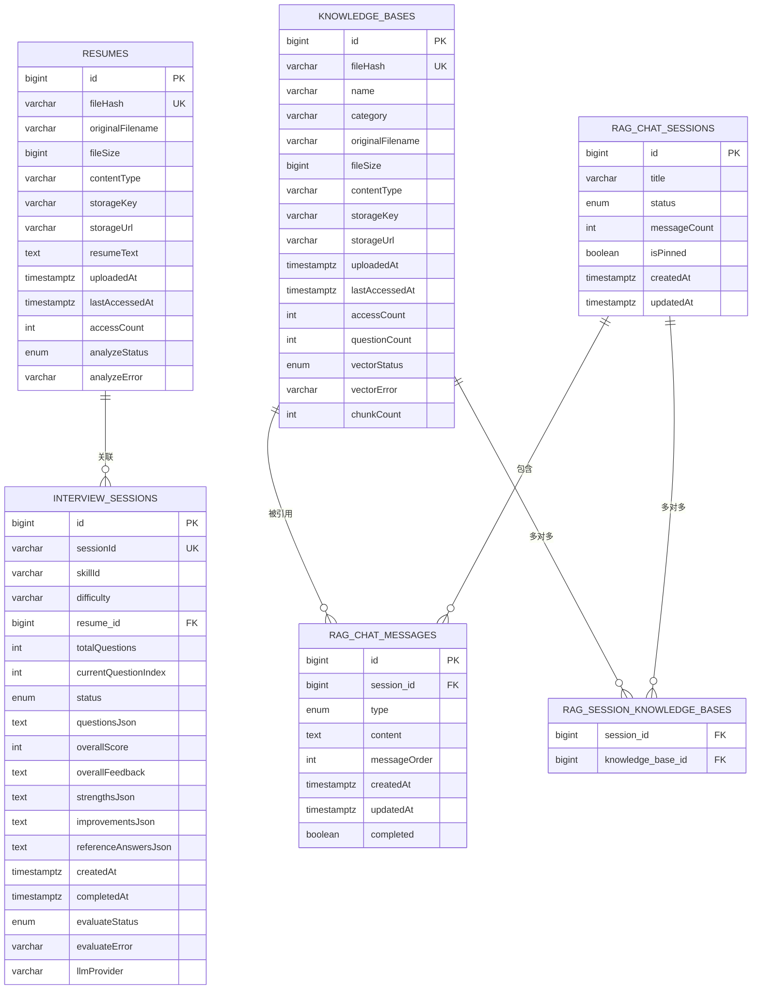
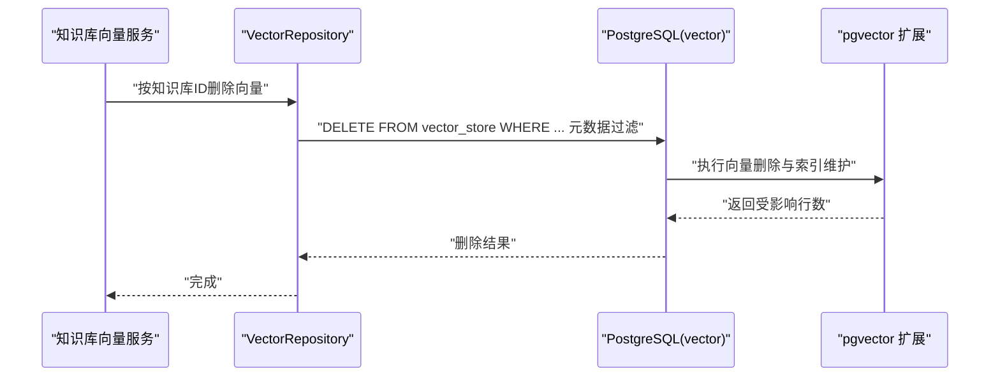
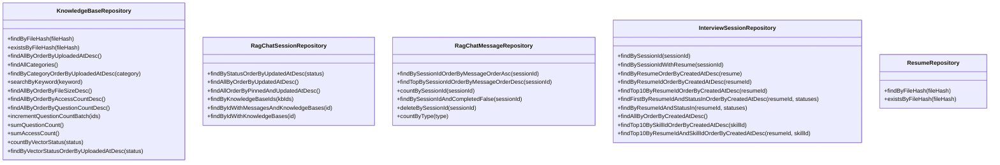
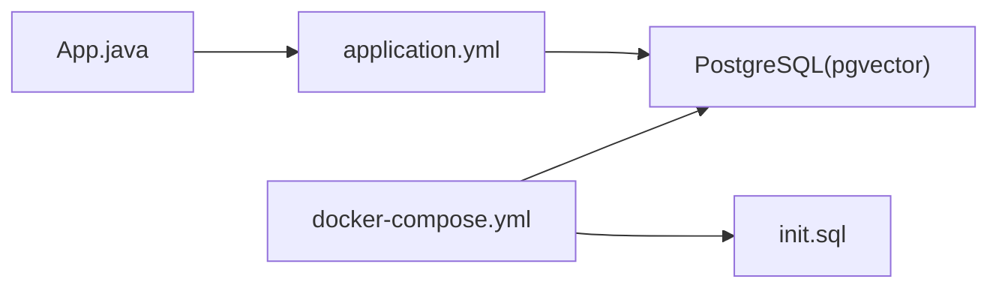

# 数据库设计

<cite>
**本文引用的文件**
- [App.java](file://app/src/main/java/interview/guide/App.java)
- [application.yml](file://app/src/main/resources/application.yml)
- [docker-compose.yml](file://docker-compose.yml)
- [init.sql](file://docker/postgres/init.sql)
- [KnowledgeBaseEntity.java](file://app/src/main/java/interview/guide/modules/knowledgebase/model/KnowledgeBaseEntity.java)
- [RagChatMessageEntity.java](file://app/src/main/java/interview/guide/modules/knowledgebase/model/RagChatMessageEntity.java)
- [RagChatSessionEntity.java](file://app/src/main/java/interview/guide/modules/knowledgebase/model/RagChatSessionEntity.java)
- [InterviewSessionEntity.java](file://app/src/main/java/interview/guide/modules/interview/model/InterviewSessionEntity.java)
- [ResumeEntity.java](file://app/src/main/java/interview/guide/modules/resume/model/ResumeEntity.java)
- [KnowledgeBaseRepository.java](file://app/src/main/java/interview/guide/modules/knowledgebase/repository/KnowledgeBaseRepository.java)
- [RagChatMessageRepository.java](file://app/src/main/java/interview/guide/modules/knowledgebase/repository/RagChatMessageRepository.java)
- [RagChatSessionRepository.java](file://app/src/main/java/interview/guide/modules/knowledgebase/repository/RagChatSessionRepository.java)
- [InterviewSessionRepository.java](file://app/src/main/java/interview/guide/modules/interview/repository/InterviewSessionRepository.java)
- [ResumeRepository.java](file://app/src/main/java/interview/guide/modules/resume/repository/ResumeRepository.java)
- [VectorRepository.java](file://app/src/main/java/interview/guide/modules/knowledgebase/repository/VectorRepository.java)
</cite>

## 目录
1. [简介](#简介)
2. [项目结构](#项目结构)
3. [核心组件](#核心组件)
4. [架构总览](#架构总览)
5. [详细组件分析](#详细组件分析)
6. [依赖分析](#依赖分析)
7. [性能考虑](#性能考虑)
8. [故障排查指南](#故障排查指南)
9. [结论](#结论)
10. [附录](#附录)

## 简介
本文件面向面试指南平台的数据库设计，系统化阐述实体关系模型、表结构与约束、索引策略、规范化设计、pgvector向量数据库集成、数据访问模式（Repository）、数据库初始化与迁移、安全与访问控制、以及性能优化与监控策略。目标是帮助开发者与运维人员快速理解并高效维护该系统的数据层。

## 项目结构
数据库相关的核心由以下部分组成：
- 容器编排与初始化：通过 docker-compose 启动 PostgreSQL 并挂载初始化脚本；初始化脚本启用 pgvector 扩展。
- ORM 映射：JPA 实体类定义业务实体及其字段、索引与注解。
- 数据访问：Spring Data JPA Repository 提供查询与批量更新能力。
- 应用配置：Spring Boot 配置 Hibernate 方言、批处理参数、Redisson 缓存等。

图表来源
- [docker-compose.yml:1-35](file://docker-compose.yml#L1-L35)
- [init.sql:1-2](file://docker/postgres/init.sql#L1-L2)
- [application.yml:63-100](file://app/src/main/resources/application.yml#L63-L100)
- [App.java:1-19](file://app/src/main/java/interview/guide/App.java#L1-L19)

章节来源
- [docker-compose.yml:1-35](file://docker-compose.yml#L1-L35)
- [init.sql:1-2](file://docker/postgres/init.sql#L1-L2)
- [application.yml:63-100](file://app/src/main/resources/application.yml#L63-L100)
- [App.java:1-19](file://app/src/main/java/interview/guide/App.java#L1-L19)

## 核心组件
本平台围绕以下核心业务实体展开：
- 简历（Resumes）：用于简历去重、解析与访问统计。
- 面试会话（Interview Sessions）：记录一次面试过程、状态、评估结果与关联简历。
- 知识库（Knowledge Bases）：文档上传、去重、分类、向量化状态与统计。
- RAG 聊天会话与消息（RAG Chat Sessions & Messages）：多轮对话、消息顺序、与知识库的多对多关联。

章节来源
- [ResumeEntity.java:1-184](file://app/src/main/java/interview/guide/modules/resume/model/ResumeEntity.java#L1-L184)
- [InterviewSessionEntity.java:1-287](file://app/src/main/java/interview/guide/modules/interview/model/InterviewSessionEntity.java#L1-L287)
- [KnowledgeBaseEntity.java:1-223](file://app/src/main/java/interview/guide/modules/knowledgebase/model/KnowledgeBaseEntity.java#L1-L223)
- [RagChatSessionEntity.java:1-127](file://app/src/main/java/interview/guide/modules/knowledgebase/model/RagChatSessionEntity.java#L1-L127)
- [RagChatMessageEntity.java:1-93](file://app/src/main/java/interview/guide/modules/knowledgebase/model/RagChatMessageEntity.java#L1-L93)

## 架构总览
下图展示数据库层与应用层的关系，以及向量扩展的引入位置。

图表来源
- [docker-compose.yml:13-35](file://docker-compose.yml#L13-L35)
- [init.sql:1-2](file://docker/postgres/init.sql#L1-L2)
- [InterviewSessionRepository.java:1-77](file://app/src/main/java/interview/guide/modules/interview/repository/InterviewSessionRepository.java#L1-L77)
- [ResumeRepository.java:1-25](file://app/src/main/java/interview/guide/modules/resume/repository/ResumeRepository.java#L1-L25)
- [KnowledgeBaseRepository.java:1-108](file://app/src/main/java/interview/guide/modules/knowledgebase/repository/KnowledgeBaseRepository.java#L1-L108)
- [RagChatSessionRepository.java:1-54](file://app/src/main/java/interview/guide/modules/knowledgebase/repository/RagChatSessionRepository.java#L1-L54)
- [RagChatMessageRepository.java:1-50](file://app/src/main/java/interview/guide/modules/knowledgebase/repository/RagChatMessageRepository.java#L1-L50)
- [VectorRepository.java:1-47](file://app/src/main/java/interview/guide/modules/knowledgebase/repository/VectorRepository.java#L1-L47)

## 详细组件分析

### 实体关系模型与表结构设计
- 简历（Resumes）
  - 主键：自增 id
  - 唯一索引：fileHash（用于去重）
  - 字段：原始文件名、大小、类型、存储键/URL、解析文本、上传/最后访问时间、访问次数、分析状态与错误
  - 约束：fileHash 唯一，上传时间非空
- 面试会话（Interview Sessions）
  - 主键：自增 id
  - 唯一索引：sessionId（UUID）
  - 外键：resume_id 引用 resumes(id)，采用延迟加载（LAZY）并通过列映射避免 N+1 查询
  - 索引：按 resume_id+created_at、resume_id+status+created_at、skillId+createdAt 排序查询
  - 字段：技能标签、难度、问题 JSON、总分与反馈、参考答案 JSON、评估状态与错误、LLM 提供商
  - 约束：sessionId 唯一，createdAt 非空
- 知识库（Knowledge Bases）
  - 主键：自增 id
  - 唯一索引：fileHash（去重）
  - 索引：category
  - 字段：名称、分类、原始文件名、大小、类型、存储键/URL、上传/最后访问时间、访问/提问次数、向量化状态/错误、分块数量
  - 约束：fileHash 唯一，上传时间非空
- RAG 聊天会话（RAG Chat Sessions）
  - 主键：自增 id
  - 多对多：与知识库通过中间表 rag_session_knowledge_bases 关联
  - 一对多：与消息 rag_chat_messages 有序关联（按 messageOrder 升序）
  - 索引：updatedAt
  - 字段：标题、状态、消息数量冗余、置顶标记
- RAG 聊天消息（RAG Chat Messages）
  - 主键：自增 id
  - 外键：session_id 引用 rag_chat_sessions(id)
  - 索引：session_id、(session_id, messageOrder)
  - 字段：类型（用户/助手）、内容、顺序、创建/更新时间、完成标记

图表来源
- [ResumeEntity.java:1-184](file://app/src/main/java/interview/guide/modules/resume/model/ResumeEntity.java#L1-L184)
- [InterviewSessionEntity.java:1-287](file://app/src/main/java/interview/guide/modules/interview/model/InterviewSessionEntity.java#L1-L287)
- [KnowledgeBaseEntity.java:1-223](file://app/src/main/java/interview/guide/modules/knowledgebase/model/KnowledgeBaseEntity.java#L1-L223)
- [RagChatSessionEntity.java:1-127](file://app/src/main/java/interview/guide/modules/knowledgebase/model/RagChatSessionEntity.java#L1-L127)
- [RagChatMessageEntity.java:1-93](file://app/src/main/java/interview/guide/modules/knowledgebase/model/RagChatMessageEntity.java#L1-L93)

章节来源
- [ResumeEntity.java:1-184](file://app/src/main/java/interview/guide/modules/resume/model/ResumeEntity.java#L1-L184)
- [InterviewSessionEntity.java:1-287](file://app/src/main/java/interview/guide/modules/interview/model/InterviewSessionEntity.java#L1-L287)
- [KnowledgeBaseEntity.java:1-223](file://app/src/main/java/interview/guide/modules/knowledgebase/model/KnowledgeBaseEntity.java#L1-L223)
- [RagChatSessionEntity.java:1-127](file://app/src/main/java/interview/guide/modules/knowledgebase/model/RagChatSessionEntity.java#L1-L127)
- [RagChatMessageEntity.java:1-93](file://app/src/main/java/interview/guide/modules/knowledgebase/model/RagChatMessageEntity.java#L1-L93)

### 规范化设计与约束
- 第二范式（2NF）：所有非主属性完全依赖于主键，如 resumes 的 fileHash、uploadedAt 等。
- 第三范式（3NF）：消除传递依赖，如 interview_sessions 的 resume_id 作为外键而非冗余字段。
- 外键约束：通过 JPA 注解声明（如 @ManyToOne/@OneToMany/@ManyToMany）并在运行期由数据库执行约束。
- 唯一性：fileHash 在 resumes 与 knowledge_bases 上唯一，sessionId 在 interview_sessions 上唯一。
- 索引策略：
  - 简历：fileHash 唯一索引
  - 面试会话：复合索引（resume_id, created_at）、（resume_id, status, created_at）、（skillId, createdAt）
  - 知识库：fileHash 唯一索引、category 索引
  - RAG 会话：updatedAt 索引
  - RAG 消息：session_id、(session_id, messageOrder) 复合索引

章节来源
- [ResumeEntity.java:13-15](file://app/src/main/java/interview/guide/modules/resume/model/ResumeEntity.java#L13-L15)
- [InterviewSessionEntity.java:15-19](file://app/src/main/java/interview/guide/modules/interview/model/InterviewSessionEntity.java#L15-L19)
- [KnowledgeBaseEntity.java:11-14](file://app/src/main/java/interview/guide/modules/knowledgebase/model/KnowledgeBaseEntity.java#L11-L14)
- [RagChatSessionEntity.java:19-21](file://app/src/main/java/interview/guide/modules/knowledgebase/model/RagChatSessionEntity.java#L19-L21)
- [RagChatMessageEntity.java:15-18](file://app/src/main/java/interview/guide/modules/knowledgebase/model/RagChatMessageEntity.java#L15-L18)

### pgvector 向量数据库集成
- 扩展启用：初始化脚本创建 vector 扩展，使数据库具备向量类型与相似度函数。
- 存储表：Spring AI 的 PgVectorStore 默认表名为 vector_store，元数据以 JSONB 字段存储。
- 删除策略：按知识库 ID 删除向量数据，兼容两种元数据键形式，避免 JDBC 占位符冲突。
- 相似度计算：通过向量列与查询向量的距离函数进行检索（具体调用由向量服务封装）。
- 索引优化：结合向量索引与元数据过滤，减少全表扫描。

图表来源
- [init.sql:1-2](file://docker/postgres/init.sql#L1-L2)
- [VectorRepository.java:31-47](file://app/src/main/java/interview/guide/modules/knowledgebase/repository/VectorRepository.java#L31-L47)

章节来源
- [docker-compose.yml:13-35](file://docker-compose.yml#L13-L35)
- [init.sql:1-2](file://docker/postgres/init.sql#L1-L2)
- [VectorRepository.java:1-47](file://app/src/main/java/interview/guide/modules/knowledgebase/repository/VectorRepository.java#L1-L47)

### 数据访问模式（Repository）
- Repository 接口：基于 Spring Data JPA，提供 CRUD、条件查询、排序、分页与批量更新。
- 查询优化：
  - 使用 @Query 与原生 JPQL，避免 N+1 查询（如 LEFT JOIN FETCH）。
  - 利用索引覆盖查询（如按 resume_id/status/created_at 排序）。
- 批量更新：通过 @Modifying 执行批量计数累加（如知识库提问次数）。
- 流式场景：RAG 消息支持 completed 标记与清理逻辑。

图表来源
- [KnowledgeBaseRepository.java:1-108](file://app/src/main/java/interview/guide/modules/knowledgebase/repository/KnowledgeBaseRepository.java#L1-L108)
- [RagChatSessionRepository.java:1-54](file://app/src/main/java/interview/guide/modules/knowledgebase/repository/RagChatSessionRepository.java#L1-L54)
- [RagChatMessageRepository.java:1-50](file://app/src/main/java/interview/guide/modules/knowledgebase/repository/RagChatMessageRepository.java#L1-L50)
- [InterviewSessionRepository.java:1-77](file://app/src/main/java/interview/guide/modules/interview/repository/InterviewSessionRepository.java#L1-L77)
- [ResumeRepository.java:1-25](file://app/src/main/java/interview/guide/modules/resume/repository/ResumeRepository.java#L1-L25)

章节来源
- [KnowledgeBaseRepository.java:1-108](file://app/src/main/java/interview/guide/modules/knowledgebase/repository/KnowledgeBaseRepository.java#L1-L108)
- [RagChatSessionRepository.java:1-54](file://app/src/main/java/interview/guide/modules/knowledgebase/repository/RagChatSessionRepository.java#L1-L54)
- [RagChatMessageRepository.java:1-50](file://app/src/main/java/interview/guide/modules/knowledgebase/repository/RagChatMessageRepository.java#L1-L50)
- [InterviewSessionRepository.java:1-77](file://app/src/main/java/interview/guide/modules/interview/repository/InterviewSessionRepository.java#L1-L77)
- [ResumeRepository.java:1-25](file://app/src/main/java/interview/guide/modules/resume/repository/ResumeRepository.java#L1-L25)

### 数据库初始化脚本说明
- 初始化流程：容器首次启动时执行 /docker-entrypoint-initdb.d/init.sql，创建 vector 扩展。
- 扩展用途：启用向量类型与距离函数，支撑 RAG 向量检索。
- 建议：将后续表结构与索引迁移纳入版本化脚本，配合迁移工具管理。

章节来源
- [docker-compose.yml:24-25](file://docker-compose.yml#L24-L25)
- [init.sql:1-2](file://docker/postgres/init.sql#L1-L2)

### 数据迁移与版本管理策略
- 建议采用 Flyway/Liquibase 等迁移工具，将表结构、索引、约束与初始数据纳入版本控制。
- 迁移脚本组织：按功能域拆分（如 resumes、interviews、knowledgebases、rag_chats），每个版本包含 up/down 脚本。
- 回滚机制：保留 down 脚本，确保回滚到上一个稳定版本；对破坏性变更（如删除列）需谨慎评估。
- 发布流程：先在测试环境验证，再灰度到生产，记录变更摘要与风险点。

（本节为通用实践建议，不直接分析具体文件）

### 数据安全与访问控制
- 用户权限：通过 Spring Security 控制 API 层访问，数据库层面建议使用最小权限账户与只读副本。
- 数据加密：静态数据加密（TDE）与传输加密（SSL/TLS）建议开启；敏感字段可在应用层加密存储。
- 审计日志：记录 DDL 变更与关键 DML 操作，便于追踪与合规审计。
- 密钥管理：数据库凭据与第三方密钥统一纳入密钥管理服务。

（本节为通用实践建议，不直接分析具体文件）

## 依赖分析
- 应用启动：App.java 启动 Spring Boot，加载 application.yml 中的 JPA/Hibernate/Redisson 配置。
- 数据库连接：PostgreSQL 16 + pgvector 镜像，健康检查依赖 pg_isready。
- 初始化：init.sql 创建 vector 扩展，供向量检索使用。

图表来源
- [App.java:1-19](file://app/src/main/java/interview/guide/App.java#L1-L19)
- [application.yml:63-100](file://app/src/main/resources/application.yml#L63-L100)
- [docker-compose.yml:13-35](file://docker-compose.yml#L13-L35)
- [init.sql:1-2](file://docker/postgres/init.sql#L1-L2)

章节来源
- [App.java:1-19](file://app/src/main/java/interview/guide/App.java#L1-L19)
- [application.yml:63-100](file://app/src/main/resources/application.yml#L63-L100)
- [docker-compose.yml:1-35](file://docker-compose.yml#L1-L35)
- [init.sql:1-2](file://docker/postgres/init.sql#L1-L2)

## 性能考虑
- 索引优化：按查询模式建立复合索引（如面试按 resume_id+status+created_at 排序），避免全表扫描。
- 批量操作：合理设置 hibernate.jdbc.batch_size，开启 order_inserts/order_updates，降低网络往返。
- 连接池与并发：根据业务峰值调整连接池大小，避免长时间持有数据库连接。
- 向量检索：为向量列建立索引，结合元数据过滤减少候选集；对高频查询结果做缓存（Redis）。
- 查询优化：优先使用覆盖索引的查询路径，避免 SELECT *；对大文本字段（TEXT）仅在必要时加载。

（本节提供通用指导，不直接分析具体文件）

## 故障排查指南
- 数据库不可用：检查 docker-compose 健康检查与环境变量；确认 init.sql 成功执行。
- 向量检索异常：确认 vector 扩展已创建；检查向量维度与相似度函数是否匹配。
- 查询慢：核对索引是否命中；使用 EXPLAIN 分析执行计划；必要时调整复合索引顺序。
- 批量更新无效：确认 @Modifying 事务边界与回滚规则；检查批量更新语句的绑定参数。

章节来源
- [docker-compose.yml:31-35](file://docker-compose.yml#L31-L35)
- [init.sql:1-2](file://docker/postgres/init.sql#L1-L2)
- [VectorRepository.java:31-47](file://app/src/main/java/interview/guide/modules/knowledgebase/repository/VectorRepository.java#L31-L47)

## 结论
本设计以 JPA 实体为核心，结合 Spring Data JPA Repository 提供清晰的数据访问层；通过合理的索引与约束满足常见查询需求，并以 pgvector 扩展支撑 RAG 场景的向量检索。建议在生产环境中引入版本化迁移工具、完善的缓存与监控体系，持续优化查询与向量检索性能。

## 附录
- 配置要点
  - Hibernate 方言：PostgreSQLDialect
  - 批处理参数：batch_size、order_inserts、order_updates
  - Redisson：单机配置、连接池大小与空闲阈值
- 初始化清单
  - docker-compose 启动 PostgreSQL(pgvector)
  - init.sql 创建 vector 扩展
  - 应用启动后执行迁移脚本（建议 Flyway/Liquibase）

章节来源
- [application.yml:63-100](file://app/src/main/resources/application.yml#L63-L100)
- [docker-compose.yml:13-35](file://docker-compose.yml#L13-L35)
- [init.sql:1-2](file://docker/postgres/init.sql#L1-L2)