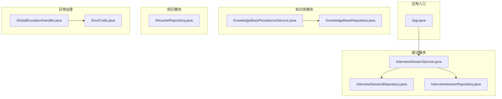
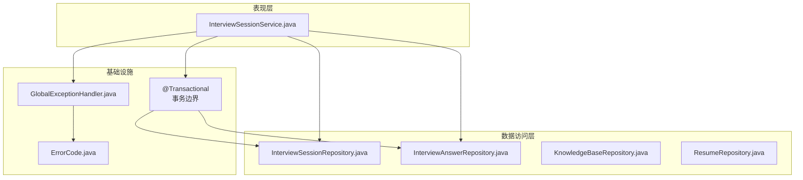
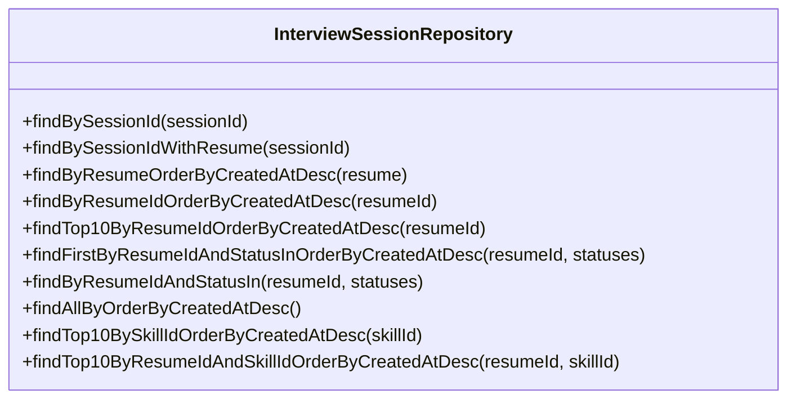
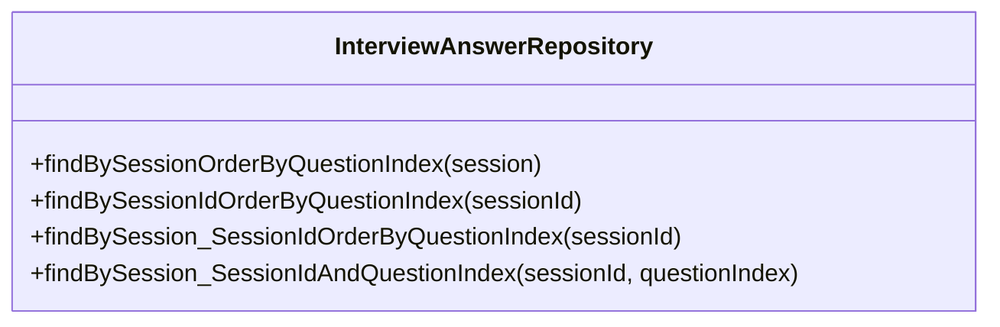
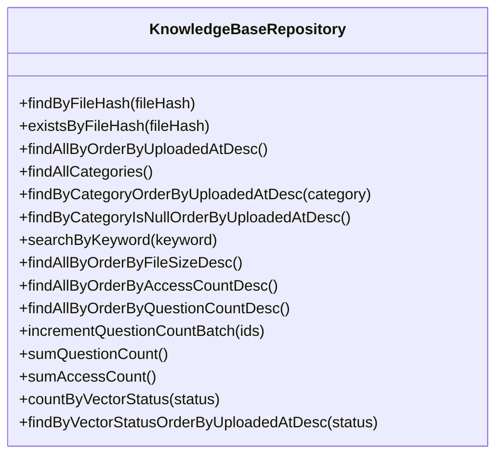
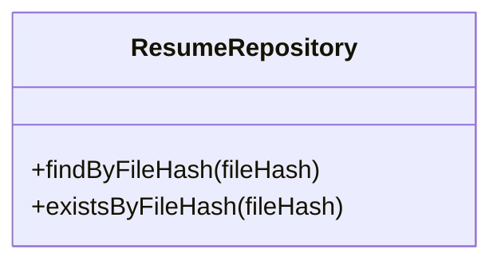
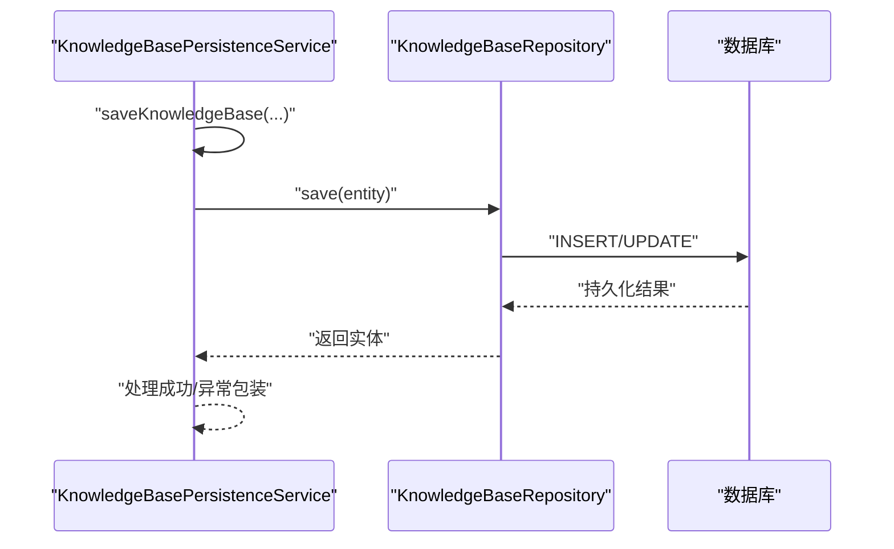
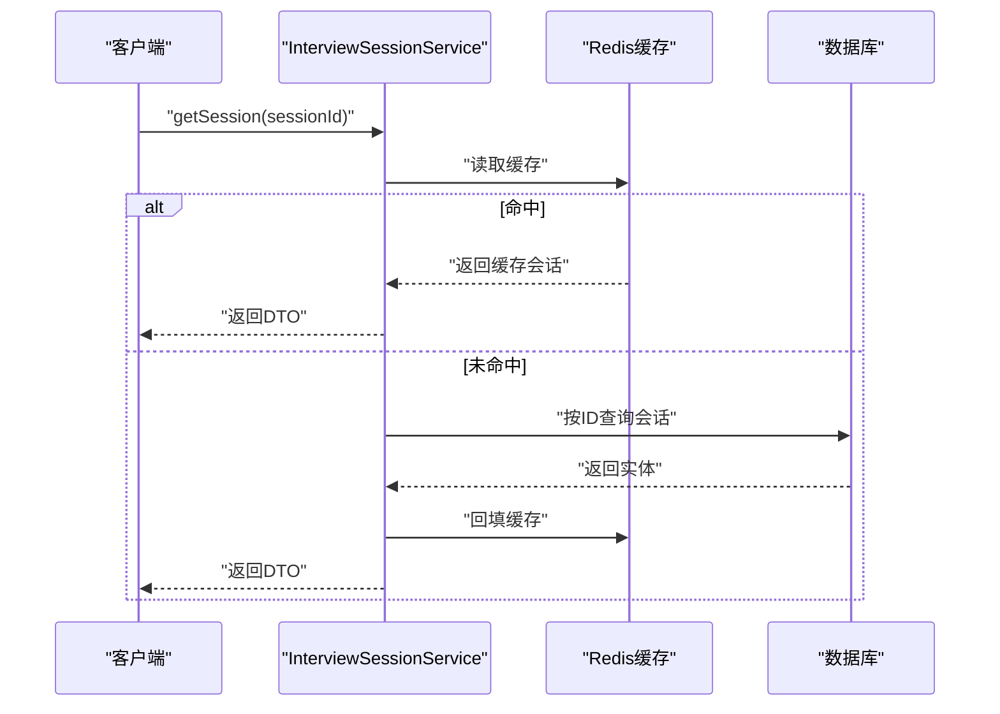
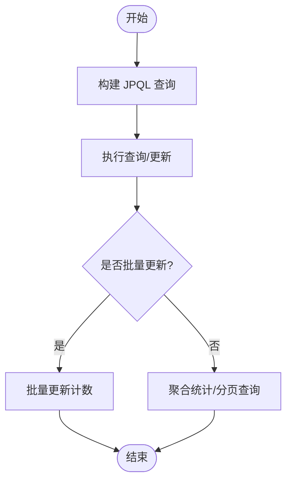
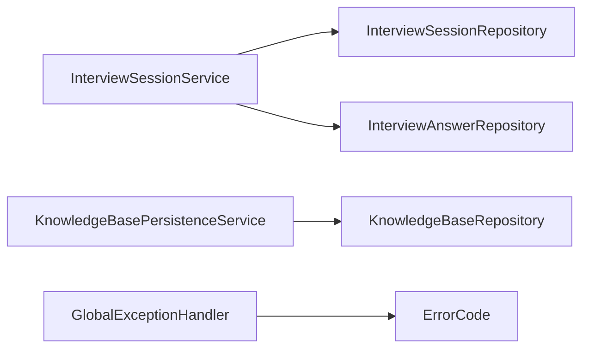

# 数据访问模式

<cite>
**本文引用的文件**
- [App.java](file://app/src/main/java/interview/guide/App.java)
- [InterviewSessionRepository.java](file://app/src/main/java/interview/guide/modules/interview/repository/InterviewSessionRepository.java)
- [InterviewAnswerRepository.java](file://app/src/main/java/interview/guide/modules/interview/repository/InterviewAnswerRepository.java)
- [KnowledgeBaseRepository.java](file://app/src/main/java/interview/guide/modules/knowledgebase/repository/KnowledgeBaseRepository.java)
- [ResumeRepository.java](file://app/src/main/java/interview/guide/modules/resume/repository/ResumeRepository.java)
- [InterviewSessionService.java](file://app/src/main/java/interview/guide/modules/interview/service/InterviewSessionService.java)
- [KnowledgeBasePersistenceService.java](file://app/src/main/java/interview/guide/modules/knowledgebase/service/KnowledgeBasePersistenceService.java)
- [GlobalExceptionHandler.java](file://app/src/main/java/interview/guide/common/exception/GlobalExceptionHandler.java)
- [ErrorCode.java](file://app/src/main/java/interview/guide/common/exception/ErrorCode.java)
</cite>

## 目录
1. [简介](#简介)
2. [项目结构](#项目结构)
3. [核心组件](#核心组件)
4. [架构总览](#架构总览)
5. [详细组件分析](#详细组件分析)
6. [依赖分析](#依赖分析)
7. [性能考虑](#性能考虑)
8. [故障排查指南](#故障排查指南)
9. [结论](#结论)
10. [附录](#附录)

## 简介
本文件面向面试指南平台的数据访问层，系统性阐述基于 Spring Data JPA 的 Repository 模式、JPQL 与原生 SQL 的使用场景、事务管理策略、查询优化与缓存设计、以及异常处理与容错机制。内容以仓库中的实际代码为依据，结合类图、时序图与流程图，帮助读者快速理解并正确应用数据访问模式。

## 项目结构
平台采用分层与按功能域划分的组织方式：入口类位于顶层应用包；数据访问层由各模块的 repository 接口组成；业务服务层负责事务边界与跨仓储协调；异常处理集中在全局异常处理器中统一输出。

图表来源
- [App.java:1-19](file://app/src/main/java/interview/guide/App.java#L1-L19)
- [InterviewSessionRepository.java:1-77](file://app/src/main/java/interview/guide/modules/interview/repository/InterviewSessionRepository.java#L1-L77)
- [InterviewAnswerRepository.java:1-37](file://app/src/main/java/interview/guide/modules/interview/repository/InterviewAnswerRepository.java#L1-L37)
- [KnowledgeBaseRepository.java:1-108](file://app/src/main/java/interview/guide/modules/knowledgebase/repository/KnowledgeBaseRepository.java#L1-L108)
- [ResumeRepository.java:1-25](file://app/src/main/java/interview/guide/modules/resume/repository/ResumeRepository.java#L1-L25)
- [InterviewSessionService.java:1-507](file://app/src/main/java/interview/guide/modules/interview/service/InterviewSessionService.java#L1-L507)
- [KnowledgeBasePersistenceService.java:1-110](file://app/src/main/java/interview/guide/modules/knowledgebase/service/KnowledgeBasePersistenceService.java#L1-L110)
- [GlobalExceptionHandler.java:1-161](file://app/src/main/java/interview/guide/common/exception/GlobalExceptionHandler.java#L1-L161)
- [ErrorCode.java:1-81](file://app/src/main/java/interview/guide/common/exception/ErrorCode.java#L1-L81)

章节来源
- [App.java:1-19](file://app/src/main/java/interview/guide/App.java#L1-L19)

## 核心组件
- Repository 接口：定义数据访问契约，继承 JpaRepository 即可获得基础 CRUD 与分页排序能力；通过方法命名约定自动生成查询；必要时使用 @Query 指定 JPQL 或原生 SQL。
- 业务服务层：通过 @Service 聚合多个 Repository 操作，使用 @Transactional 定义事务边界，确保一致性与原子性。
- 异常处理：全局异常处理器统一捕获并映射为业务错误码与消息，保证对外一致的响应格式。

章节来源
- [InterviewSessionRepository.java:17-76](file://app/src/main/java/interview/guide/modules/interview/repository/InterviewSessionRepository.java#L17-L76)
- [InterviewAnswerRepository.java:14-36](file://app/src/main/java/interview/guide/modules/interview/repository/InterviewAnswerRepository.java#L14-L36)
- [KnowledgeBaseRepository.java:17-106](file://app/src/main/java/interview/guide/modules/knowledgebase/repository/KnowledgeBaseRepository.java#L17-L106)
- [ResumeRepository.java:12-24](file://app/src/main/java/interview/guide/modules/resume/repository/ResumeRepository.java#L12-L24)
- [InterviewSessionService.java:40-507](file://app/src/main/java/interview/guide/modules/interview/service/InterviewSessionService.java#L40-L507)
- [KnowledgeBasePersistenceService.java:23-108](file://app/src/main/java/interview/guide/modules/knowledgebase/service/KnowledgeBasePersistenceService.java#L23-L108)
- [GlobalExceptionHandler.java:23-161](file://app/src/main/java/interview/guide/common/exception/GlobalExceptionHandler.java#L23-L161)
- [ErrorCode.java:11-81](file://app/src/main/java/interview/guide/common/exception/ErrorCode.java#L11-L81)

## 架构总览
下图展示数据访问层在系统中的位置与交互关系：控制器/服务通过 Repository 访问数据库；服务层承担事务与跨仓储协调；异常处理统一拦截并返回业务错误码。

图表来源
- [InterviewSessionService.java:40-507](file://app/src/main/java/interview/guide/modules/interview/service/InterviewSessionService.java#L40-L507)
- [InterviewSessionRepository.java:17-76](file://app/src/main/java/interview/guide/modules/interview/repository/InterviewSessionRepository.java#L17-L76)
- [InterviewAnswerRepository.java:14-36](file://app/src/main/java/interview/guide/modules/interview/repository/InterviewAnswerRepository.java#L14-L36)
- [KnowledgeBaseRepository.java:17-106](file://app/src/main/java/interview/guide/modules/knowledgebase/repository/KnowledgeBaseRepository.java#L17-L106)
- [ResumeRepository.java:12-24](file://app/src/main/java/interview/guide/modules/resume/repository/ResumeRepository.java#L12-L24)
- [KnowledgeBasePersistenceService.java:30-93](file://app/src/main/java/interview/guide/modules/knowledgebase/service/KnowledgeBasePersistenceService.java#L30-L93)
- [GlobalExceptionHandler.java:23-161](file://app/src/main/java/interview/guide/common/exception/GlobalExceptionHandler.java#L23-L161)
- [ErrorCode.java:11-81](file://app/src/main/java/interview/guide/common/exception/ErrorCode.java#L11-L81)

## 详细组件分析

### 面试会话仓储与查询模式
- 方法命名约定：findByXxx、findAllByOrderByXxx、findTopNByXxx 等，遵循 Spring Data JPA 的约定式查询规则，自动推导 SQL。
- JPQL 查询：使用 @Query 明确复杂条件与联表查询，如带 JOIN FETCH 的关联加载，避免 N+1 问题。
- 示例要点
  - 条件查询：按会话 ID、简历 ID、状态集合等组合查询。
  - 关联加载：使用 JOIN FETCH 预加载关联实体，减少懒加载引发的额外查询。
  - 排序与分页：通过排序方法与分页参数控制结果集顺序与大小。

图表来源
- [InterviewSessionRepository.java:17-76](file://app/src/main/java/interview/guide/modules/interview/repository/InterviewSessionRepository.java#L17-L76)

章节来源
- [InterviewSessionRepository.java:17-76](file://app/src/main/java/interview/guide/modules/interview/repository/InterviewSessionRepository.java#L17-L76)

### 面试答案仓储与 upsert 场景
- 约定式查询：按会话或会话 ID 查询答案列表，并按问题索引排序。
- upsert 支持：通过复合条件查询定位唯一记录，配合服务层执行保存或更新。

图表来源
- [InterviewAnswerRepository.java:14-36](file://app/src/main/java/interview/guide/modules/interview/repository/InterviewAnswerRepository.java#L14-L36)

章节来源
- [InterviewAnswerRepository.java:14-36](file://app/src/main/java/interview/guide/modules/interview/repository/InterviewAnswerRepository.java#L14-L36)

### 知识库仓储：JPQL、聚合与批量更新
- JPQL 使用：DISTINCT 查询分类、模糊搜索、排序等。
- 聚合计数：SUM 聚合统计访问与提问次数。
- 批量更新：@Modifying + @Query 实现批量计数累加，减少往返与循环更新成本。
- 状态统计：按向量化状态计数与筛选。

图表来源
- [KnowledgeBaseRepository.java:17-106](file://app/src/main/java/interview/guide/modules/knowledgebase/repository/KnowledgeBaseRepository.java#L17-L106)

章节来源
- [KnowledgeBaseRepository.java:17-106](file://app/src/main/java/interview/guide/modules/knowledgebase/repository/KnowledgeBaseRepository.java#L17-L106)

### 简历仓储：去重与存在性检查
- 基于文件哈希的去重查询与存在性判断，支撑上传幂等与重复检测。

图表来源
- [ResumeRepository.java:12-24](file://app/src/main/java/interview/guide/modules/resume/repository/ResumeRepository.java#L12-L24)

章节来源
- [ResumeRepository.java:12-24](file://app/src/main/java/interview/guide/modules/resume/repository/ResumeRepository.java#L12-L24)

### 事务管理与服务层编排
- 事务边界：在需要原子性的持久化操作上使用 @Transactional，如知识库保存、重复处理与状态更新。
- 传播行为：默认传播行为满足大多数场景；复杂流程中可通过合理拆分与调用链控制事务范围。
- 异常策略：在服务层捕获并包装为业务异常，避免将底层异常直接暴露给客户端。

图表来源
- [KnowledgeBasePersistenceService.java:57-78](file://app/src/main/java/interview/guide/modules/knowledgebase/service/KnowledgeBasePersistenceService.java#L57-L78)
- [KnowledgeBaseRepository.java:17-106](file://app/src/main/java/interview/guide/modules/knowledgebase/repository/KnowledgeBaseRepository.java#L17-L106)

章节来源
- [KnowledgeBasePersistenceService.java:30-93](file://app/src/main/java/interview/guide/modules/knowledgebase/service/KnowledgeBasePersistenceService.java#L30-L93)

### 面试会话服务：缓存与数据库双写
- 缓存优先：会话信息优先从缓存读取，未命中时从数据库恢复并回填缓存。
- 双写一致性：提交答案、更新索引与状态时，同时更新缓存与数据库，并在异常时记录告警。
- 异步评估：完成时触发评估任务，确保用户体验与后台处理解耦。

图表来源
- [InterviewSessionService.java:120-137](file://app/src/main/java/interview/guide/modules/interview/service/InterviewSessionService.java#L120-L137)
- [InterviewSessionService.java:180-191](file://app/src/main/java/interview/guide/modules/interview/service/InterviewSessionService.java#L180-L191)

章节来源
- [InterviewSessionService.java:120-137](file://app/src/main/java/interview/guide/modules/interview/service/InterviewSessionService.java#L120-L137)
- [InterviewSessionService.java:180-191](file://app/src/main/java/interview/guide/modules/interview/service/InterviewSessionService.java#L180-L191)

### 复杂查询与聚合统计流程
- 模糊搜索：使用 JPQL 的 LOWER + LIKE 实现不区分大小写的关键词检索。
- 聚合计数：使用 SUM 聚合统计访问与提问次数，避免应用侧聚合带来的性能损耗。
- 批量更新：使用 @Modifying 的 JPQL 对多条记录进行批量更新，降低网络往返与事务开销。

图表来源
- [KnowledgeBaseRepository.java:54-55](file://app/src/main/java/interview/guide/modules/knowledgebase/repository/KnowledgeBaseRepository.java#L54-L55)
- [KnowledgeBaseRepository.java:88-89](file://app/src/main/java/interview/guide/modules/knowledgebase/repository/KnowledgeBaseRepository.java#L88-L89)
- [KnowledgeBaseRepository.java:80-81](file://app/src/main/java/interview/guide/modules/knowledgebase/repository/KnowledgeBaseRepository.java#L80-L81)

章节来源
- [KnowledgeBaseRepository.java:54-55](file://app/src/main/java/interview/guide/modules/knowledgebase/repository/KnowledgeBaseRepository.java#L54-L55)
- [KnowledgeBaseRepository.java:88-89](file://app/src/main/java/interview/guide/modules/knowledgebase/repository/KnowledgeBaseRepository.java#L88-L89)
- [KnowledgeBaseRepository.java:80-81](file://app/src/main/java/interview/guide/modules/knowledgebase/repository/KnowledgeBaseRepository.java#L80-L81)

## 依赖分析
- 组件内聚：每个模块的 Repository 与其 Service 形成高内聚，职责清晰。
- 组件耦合：服务层对多个 Repository 进行编排，形成横向依赖；异常处理作为横切关注点集中管理。
- 外部依赖：全局异常处理器依赖错误码枚举，统一输出格式。

图表来源
- [InterviewSessionService.java:40-507](file://app/src/main/java/interview/guide/modules/interview/service/InterviewSessionService.java#L40-L507)
- [InterviewSessionRepository.java:17-76](file://app/src/main/java/interview/guide/modules/interview/repository/InterviewSessionRepository.java#L17-L76)
- [InterviewAnswerRepository.java:14-36](file://app/src/main/java/interview/guide/modules/interview/repository/InterviewAnswerRepository.java#L14-L36)
- [KnowledgeBasePersistenceService.java:23-108](file://app/src/main/java/interview/guide/modules/knowledgebase/service/KnowledgeBasePersistenceService.java#L23-L108)
- [KnowledgeBaseRepository.java:17-106](file://app/src/main/java/interview/guide/modules/knowledgebase/repository/KnowledgeBaseRepository.java#L17-L106)
- [GlobalExceptionHandler.java:23-161](file://app/src/main/java/interview/guide/common/exception/GlobalExceptionHandler.java#L23-L161)
- [ErrorCode.java:11-81](file://app/src/main/java/interview/guide/common/exception/ErrorCode.java#L11-L81)

章节来源
- [InterviewSessionService.java:40-507](file://app/src/main/java/interview/guide/modules/interview/service/InterviewSessionService.java#L40-L507)
- [KnowledgeBasePersistenceService.java:23-108](file://app/src/main/java/interview/guide/modules/knowledgebase/service/KnowledgeBasePersistenceService.java#L23-L108)
- [GlobalExceptionHandler.java:23-161](file://app/src/main/java/interview/guide/common/exception/GlobalExceptionHandler.java#L23-L161)

## 性能考虑
- 懒加载 vs 急加载
  - 使用 JOIN FETCH 在查询时预加载关联实体，避免 N+1 查询；仅在必要时使用，防止过度加载导致内存压力。
  - 对于只读场景，优先使用投影或 DTO，减少实体完整加载。
- N+1 查询问题
  - 通过 @Query + JOIN FETCH 或 @NamedEntityGraph 预加载关联。
  - 对集合查询使用分页与投影，避免一次性加载大量数据。
- 批量操作优化
  - 使用 @Modifying 的批量更新减少往返；合理设置批大小，避免单次事务过大。
- 缓存策略
  - 会话状态与问题列表优先从缓存读取；未命中时从数据库恢复并回填缓存。
  - 对热点查询结果进行短期缓存，结合失效策略与主动刷新。
- 查询优化建议
  - 为高频过滤字段建立索引；避免 SELECT *，仅选择必要列。
  - 使用分页与排序参数控制结果集规模；对大结果集使用游标或分段查询。

## 故障排查指南
- 异常分类与处理
  - 业务异常：由服务层抛出并被全局异常处理器捕获，统一返回业务错误码与消息。
  - 参数校验异常：字段校验失败时返回统一的 BAD_REQUEST 错误。
  - AI 服务异常：根据异常类型映射为超时、密钥无效、频率超限等具体错误码。
- 错误码体系
  - 错误码枚举覆盖通用、简历、面试、知识库、AI 服务等模块，便于前端统一处理。
- 重试与降级
  - 对临时性网络异常（如 AI 服务超时）建议在调用方进行有限重试与退避。
  - 对数据库写入失败，可在服务层记录告警并提示用户稍后重试。

章节来源
- [GlobalExceptionHandler.java:31-128](file://app/src/main/java/interview/guide/common/exception/GlobalExceptionHandler.java#L31-L128)
- [ErrorCode.java:11-81](file://app/src/main/java/interview/guide/common/exception/ErrorCode.java#L11-L81)

## 结论
本平台的数据访问层以 Spring Data JPA 为核心，结合约定式查询与 JPQL/原生 SQL 实现复杂业务需求；通过服务层统一事务边界与跨仓储编排，配合全局异常处理与错误码体系，实现了稳定、可维护且易扩展的数据访问模式。建议在后续演进中持续完善缓存策略、监控与可观测性，进一步提升性能与可靠性。

## 附录
- 最佳实践清单
  - 优先使用约定式查询，必要时使用 @Query 明确 JPQL。
  - 对关联查询使用 JOIN FETCH 预加载，避免 N+1。
  - 批量更新使用 @Modifying，合理批大小与事务粒度。
  - 服务层统一 @Transactional 边界，异常时进行业务包装。
  - 使用全局异常处理器统一输出，配合错误码枚举。