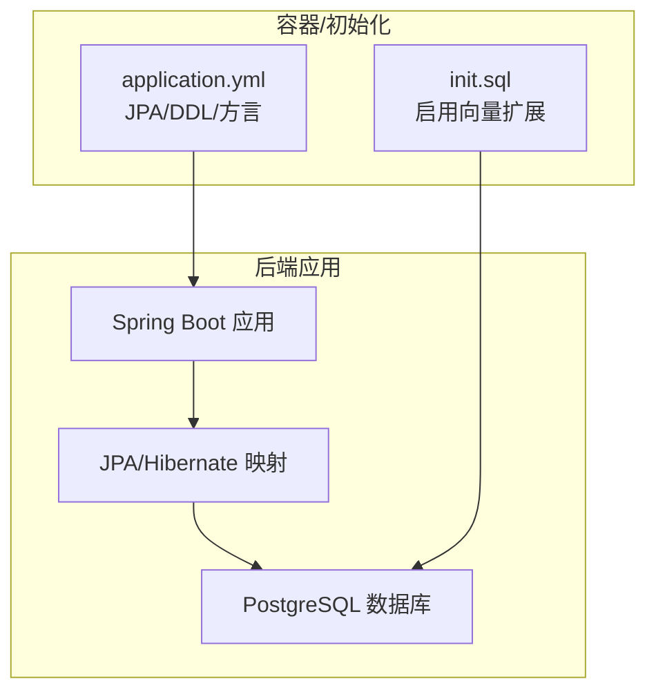
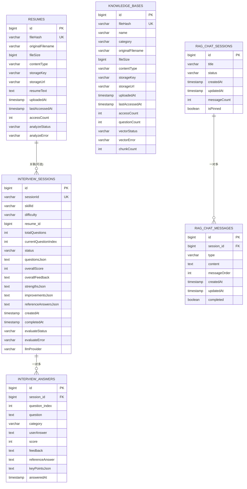
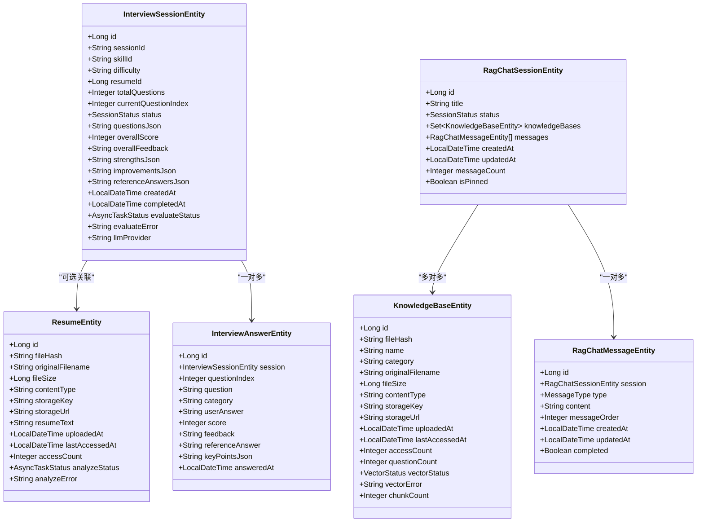

# 表结构设计

<cite>
**本文引用的文件**
- [InterviewSessionEntity.java](file://app/src/main/java/interview/guide/modules/interview/model/InterviewSessionEntity.java)
- [ResumeEntity.java](file://app/src/main/java/interview/guide/modules/resume/model/ResumeEntity.java)
- [KnowledgeBaseEntity.java](file://app/src/main/java/interview/guide/modules/knowledgebase/model/KnowledgeBaseEntity.java)
- [InterviewAnswerEntity.java](file://app/src/main/java/interview/guide/modules/interview/model/InterviewAnswerEntity.java)
- [RagChatSessionEntity.java](file://app/src/main/java/interview/guide/modules/knowledgebase/model/RagChatSessionEntity.java)
- [RagChatMessageEntity.java](file://app/src/main/java/interview/guide/modules/knowledgebase/model/RagChatMessageEntity.java)
- [application.yml](file://app/src/main/resources/application.yml)
- [init.sql](file://docker/postgres/init.sql)
- [db-design.md](file://app/src/main/resources/skills/_shared/references/db-design.md)
</cite>

## 目录
1. [简介](#简介)
2. [项目结构](#项目结构)
3. [核心组件](#核心组件)
4. [架构总览](#架构总览)
5. [详细组件分析](#详细组件分析)
6. [依赖分析](#依赖分析)
7. [性能考量](#性能考量)
8. [故障排查指南](#故障排查指南)
9. [结论](#结论)
10. [附录](#附录)

## 简介
本文件面向面试指南平台，系统化梳理核心业务表的结构设计，覆盖以下关键表：
- 面试会话表：interview_sessions
- 简历表：resumes
- 知识库表：knowledge_bases
- 面试答案表：interview_answers
- RAG 聊天会话表：rag_chat_sessions
- RAG 聊天消息表：rag_chat_messages

文档从主键/外键设计、索引策略、约束条件、规范化设计、字段类型选择等方面进行深入说明，并结合实际实体类注解与配置文件给出落地依据。

## 项目结构
平台采用 Spring Boot + JPA/Hibernate 的后端架构，数据库方言为 PostgreSQL。DDL 自动更新策略为开发环境使用 update，生产建议改为更严格的迁移策略。PostgreSQL 使用向量扩展支持 RAG 场景的相似度检索。

图表来源
- [application.yml:63-100](file://app/src/main/resources/application.yml#L63-L100)
- [init.sql:1-2](file://docker/postgres/init.sql#L1-L2)

章节来源
- [application.yml:63-100](file://app/src/main/resources/application.yml#L63-L100)
- [init.sql:1-2](file://docker/postgres/init.sql#L1-L2)

## 核心组件
本节概述三大核心业务表及其职责边界：
- resumes：简历的元数据与解析状态，支持去重与访问统计。
- knowledge_bases：知识库文档的元数据、向量化状态与访问统计。
- interview_sessions：一次面试会话的上下文，可关联简历，包含问题与评估结果。

章节来源
- [ResumeEntity.java:12-184](file://app/src/main/java/interview/guide/modules/resume/model/ResumeEntity.java#L12-L184)
- [KnowledgeBaseEntity.java:10-223](file://app/src/main/java/interview/guide/modules/knowledgebase/model/KnowledgeBaseEntity.java#L10-L223)
- [InterviewSessionEntity.java:14-287](file://app/src/main/java/interview/guide/modules/interview/model/InterviewSessionEntity.java#L14-L287)

## 架构总览
下图展示核心表之间的关系与典型查询路径：

图表来源
- [ResumeEntity.java:12-184](file://app/src/main/java/interview/guide/modules/resume/model/ResumeEntity.java#L12-L184)
- [KnowledgeBaseEntity.java:10-223](file://app/src/main/java/interview/guide/modules/knowledgebase/model/KnowledgeBaseEntity.java#L10-L223)
- [InterviewSessionEntity.java:14-287](file://app/src/main/java/interview/guide/modules/interview/model/InterviewSessionEntity.java#L14-L287)
- [InterviewAnswerEntity.java:10-157](file://app/src/main/java/interview/guide/modules/interview/model/InterviewAnswerEntity.java#L10-L157)
- [RagChatSessionEntity.java:18-127](file://app/src/main/java/interview/guide/modules/knowledgebase/model/RagChatSessionEntity.java#L18-L127)
- [RagChatMessageEntity.java:14-93](file://app/src/main/java/interview/guide/modules/knowledgebase/model/RagChatMessageEntity.java#L14-L93)

## 详细组件分析

### 面试会话表 interview_sessions
- 主键：自增主键 id
- 唯一约束：sessionId（UUID）
- 外键：resume_id 引用 resumes.id；实体注解中通过 @JoinColumn 声明
- 索引：
  - idx_interview_session_resume_created(resume_id, created_at)
  - idx_interview_session_resume_status_created(resume_id, status, created_at)
  - idx_interview_session_skill_created(skillId, createdAt)
- 字段要点：
  - skillId/difficulty 提供筛选维度
  - JSON 字段存储问题、反馈、参考答案等，便于灵活扩展
  - 评估状态 evaluateStatus 与错误 evaluateError 支持异步评估流程
- 默认值与约束：
  - sessionId 长度 36，确保 UUID 字符串
  - skillId/difficulty 设定默认值，减少空值
  - createdAt 在持久化前填充
- 查询优化建议：
  - 按简历维度查询会话时，利用复合索引提升性能
  - 按技能与时间范围查询时，利用联合索引

章节来源
- [InterviewSessionEntity.java:14-287](file://app/src/main/java/interview/guide/modules/interview/model/InterviewSessionEntity.java#L14-L287)

### 简历表 resumes
- 主键：自增主键 id
- 唯一约束：fileHash（SHA-256，长度 64）
- 索引：idx_resume_hash(fileHash)
- 字段要点：
  - 存储原始文件名、大小、类型、存储键与 URL
  - 解析状态 analyzeStatus 与错误 analyzeError 支持异步解析
  - 访问统计：accessCount、lastAccessedAt
- 默认值与约束：
  - originalFilename、uploadedAt 非空
  - analyzeStatus 默认 PENDING
- 规范化与冗余：
  - fileHash 作为去重与导入幂等的关键字段，符合 2NF
  - 访问统计字段属于事务事实，适合范式化存储

章节来源
- [ResumeEntity.java:12-184](file://app/src/main/java/interview/guide/modules/resume/model/ResumeEntity.java#L12-L184)

### 知识库表 knowledge_bases
- 主键：自增主键 id
- 唯一约束：fileHash（SHA-256，长度 64）
- 索引：
  - idx_kb_hash(fileHash)
  - idx_kb_category(category)
- 字段要点：
  - 名称、分类、原始文件名、大小、类型、存储键与 URL
  - 向量化状态 vectorStatus、错误 vectorError、块数 chunkCount
  - 访问统计：accessCount、questionCount、lastAccessedAt
- 默认值与约束：
  - name/originalFilename 非空
  - category 长度限制 100
  - vectorStatus 默认 PENDING
- 规范化与冗余：
  - fileHash 去重，category 便于检索
  - questionCount 作为统计冗余字段，提升查询效率

章节来源
- [KnowledgeBaseEntity.java:10-223](file://app/src/main/java/interview/guide/modules/knowledgebase/model/KnowledgeBaseEntity.java#L10-L223)

### 面试答案表 interview_answers
- 主键：自增主键 id
- 唯一约束：(session_id, question_index)
- 索引：idx_interview_answer_session_question(session_id, question_index)
- 字段要点：
  - 关联会话 session_id
  - 问题索引 question_index 保证同一会话内问题顺序唯一
  - JSON 字段存储问题、用户答案、参考答案与关键点
  - 评分 score 与反馈 feedback
- 默认值与约束：
  - answeredAt 非空，持久化时填充
- 规范化与冗余：
  - 将问题与答案拆分为独立表，符合 1NF/2NF
  - 通过唯一约束确保同一会话内问题索引不重复

章节来源
- [InterviewAnswerEntity.java:10-157](file://app/src/main/java/interview/guide/modules/interview/model/InterviewAnswerEntity.java#L10-L157)

### RAG 聊天会话表 rag_chat_sessions
- 主键：自增主键 id
- 索引：idx_rag_session_updated(updatedAt)
- 字段要点：
  - 标题 title、状态 status（ACTIVE/ARCHIVED）
  - 多对多：与知识库集合关联（通过中间表 rag_session_knowledge_bases）
  - 一对多：消息列表 messages，按 messageOrder 升序
  - 冗余字段：messageCount
  - 时间戳：createdAt、updatedAt
- 默认值与约束：
  - title 非空
  - status 默认 ACTIVE
  - isPinned 默认 false（通过 @Column 默认值）

章节来源
- [RagChatSessionEntity.java:18-127](file://app/src/main/java/interview/guide/modules/knowledgebase/model/RagChatSessionEntity.java#L18-L127)

### RAG 聊天消息表 rag_chat_messages
- 主键：自增主键 id
- 索引：
  - idx_rag_message_session(session_id)
  - idx_rag_message_order(session_id, messageOrder)
- 字段要点：
  - 类型 type（USER/ASSISTANT）
  - 内容 content（TEXT）
  - 顺序 messageOrder
  - 流式响应标记 completed
- 默认值与约束：
  - type/content/createdAt 非空
  - completed 默认 true

章节来源
- [RagChatMessageEntity.java:14-93](file://app/src/main/java/interview/guide/modules/knowledgebase/model/RagChatMessageEntity.java#L14-L93)

## 依赖分析
- 实体间依赖关系：
  - InterviewSessionEntity 与 ResumeEntity：可选关联（支持无简历面试）
  - InterviewSessionEntity 与 InterviewAnswerEntity：一对多
  - RagChatSessionEntity 与 KnowledgeBaseEntity：多对多（中间表）
  - RagChatSessionEntity 与 RagChatMessageEntity：一对多
- 外键约束：
  - interview_answers.session_id → interview_sessions.id
  - rag_chat_messages.session_id → rag_chat_sessions.id
  - interview_sessions.resume_id → resumes.id（逻辑外键，注解声明）
- 约束与索引：
  - 唯一约束：interview_answers.uk_interview_answer_session_question
  - 复合索引：多处联合索引用于高频查询过滤

图表来源
- [ResumeEntity.java:12-184](file://app/src/main/java/interview/guide/modules/resume/model/ResumeEntity.java#L12-L184)
- [KnowledgeBaseEntity.java:10-223](file://app/src/main/java/interview/guide/modules/knowledgebase/model/KnowledgeBaseEntity.java#L10-L223)
- [InterviewSessionEntity.java:14-287](file://app/src/main/java/interview/guide/modules/interview/model/InterviewSessionEntity.java#L14-L287)
- [InterviewAnswerEntity.java:10-157](file://app/src/main/java/interview/guide/modules/interview/model/InterviewAnswerEntity.java#L10-L157)
- [RagChatSessionEntity.java:18-127](file://app/src/main/java/interview/guide/modules/knowledgebase/model/RagChatSessionEntity.java#L18-L127)
- [RagChatMessageEntity.java:14-93](file://app/src/main/java/interview/guide/modules/knowledgebase/model/RagChatMessageEntity.java#L14-L93)

## 性能考量
- 索引设计策略
  - 高选择性列优先：fileHash（唯一）具备极高区分度
  - 联合索引最左前缀：按等值条件在前、范围条件在后
  - 覆盖索引：将查询所需列纳入索引，避免回表
  - 避免过度索引：平衡写入开销与查询收益
- 查询路径优化
  - 面试会话：按 resume_id + created_at、status + created_at、skillId + createdAt
  - 知识库：按 fileHash 去重、按 category 过滤
  - RAG 会话：按 updatedAt 排序、按 session_id + messageOrder 排序
- 数据类型与长度
  - UUID 字段长度 36；fileHash 64；分类 category 100；状态枚举长度 20
  - TEXT 用于大文本字段（问题、答案、反馈、JSON）
- 向量检索
  - 初始化启用 PostgreSQL 向量扩展，支持 RAG 场景的相似度检索

章节来源
- [db-design.md:9-13](file://app/src/main/resources/skills/_shared/references/db-design.md#L9-L13)
- [init.sql:1-2](file://docker/postgres/init.sql#L1-L2)

## 故障排查指南
- 常见约束冲突
  - 唯一约束冲突：fileHash 重复导致插入失败；应先查重再入库
  - 复合唯一冲突：(session_id, question_index) 重复；检查会话内问题索引是否正确
- 索引未命中
  - 检查查询条件是否满足联合索引最左前缀
  - 对高频过滤列补充索引
- 枚举与默认值
  - analyzeStatus/vectorStatus/evaluateStatus 缺省值需与业务一致
  - isPinned 默认 false，避免空值影响前端渲染
- 时间戳与并发
  - createdAt/updatedAt 在持久化层统一填充，避免业务层遗漏
- 向量扩展
  - 确认 init.sql 已执行，向量扩展可用

章节来源
- [ResumeEntity.java:12-184](file://app/src/main/java/interview/guide/modules/resume/model/ResumeEntity.java#L12-L184)
- [KnowledgeBaseEntity.java:10-223](file://app/src/main/java/interview/guide/modules/knowledgebase/model/KnowledgeBaseEntity.java#L10-L223)
- [InterviewAnswerEntity.java:10-157](file://app/src/main/java/interview/guide/modules/interview/model/InterviewAnswerEntity.java#L10-L157)
- [RagChatSessionEntity.java:18-127](file://app/src/main/java/interview/guide/modules/knowledgebase/model/RagChatSessionEntity.java#L18-L127)
- [RagChatMessageEntity.java:14-93](file://app/src/main/java/interview/guide/modules/knowledgebase/model/RagChatMessageEntity.java#L14-L93)
- [init.sql:1-2](file://docker/postgres/init.sql#L1-L2)

## 结论
本设计以 JPA 注解驱动的实体映射为核心，围绕“去重（fileHash）、高效检索（复合索引）、状态机（枚举）、JSON 扩展（问题/答案/反馈）”构建面试与知识库两大主线。通过合理的主键/外键、唯一约束与索引策略，兼顾了 OLTP 场景下的读写性能与可维护性。向量扩展的引入为 RAG 场景提供了基础能力。建议在生产环境中进一步完善迁移脚本与索引审计机制，持续优化热点查询路径。

## 附录

### 字段类型与长度选择依据
- fileHash：VARCHAR(64)，SHA-256 输出长度
- sessionId：VARCHAR(36)，UUID 字符串长度
- category：VARCHAR(100)，便于分类检索且不过度占用空间
- 状态枚举：VARCHAR(20)，统一长度便于排序与比较
- 大文本：TEXT，支持长 JSON 与自然语言内容
- 布尔：BOOLEAN，默认值通过 @Column 定义，兼容旧数据

章节来源
- [ResumeEntity.java:12-184](file://app/src/main/java/interview/guide/modules/resume/model/ResumeEntity.java#L12-L184)
- [KnowledgeBaseEntity.java:10-223](file://app/src/main/java/interview/guide/modules/knowledgebase/model/KnowledgeBaseEntity.java#L10-L223)
- [InterviewSessionEntity.java:14-287](file://app/src/main/java/interview/guide/modules/interview/model/InterviewSessionEntity.java#L14-L287)
- [InterviewAnswerEntity.java:10-157](file://app/src/main/java/interview/guide/modules/interview/model/InterviewAnswerEntity.java#L10-L157)
- [RagChatSessionEntity.java:18-127](file://app/src/main/java/interview/guide/modules/knowledgebase/model/RagChatSessionEntity.java#L18-L127)
- [RagChatMessageEntity.java:14-93](file://app/src/main/java/interview/guide/modules/knowledgebase/model/RagChatMessageEntity.java#L14-L93)