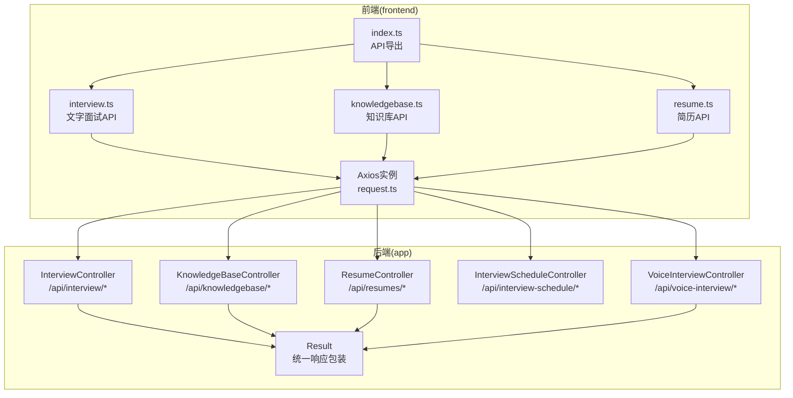
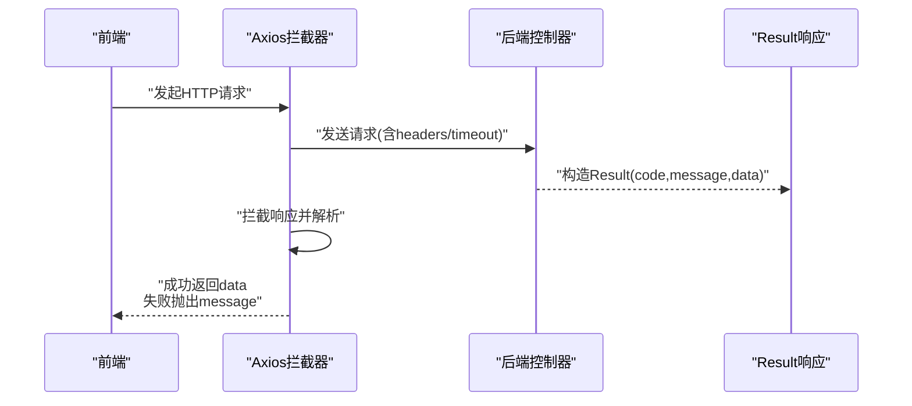
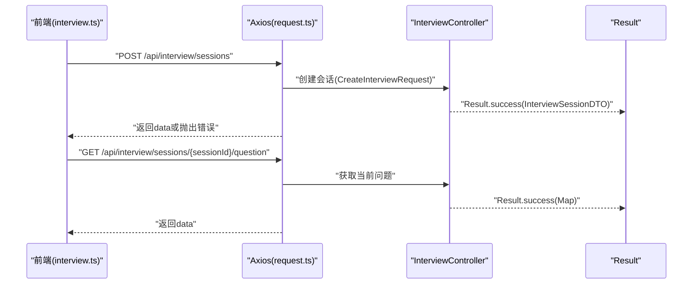
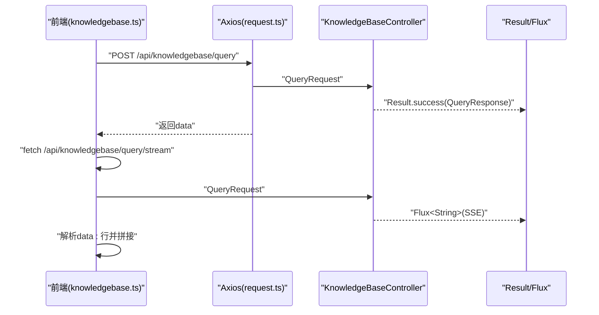
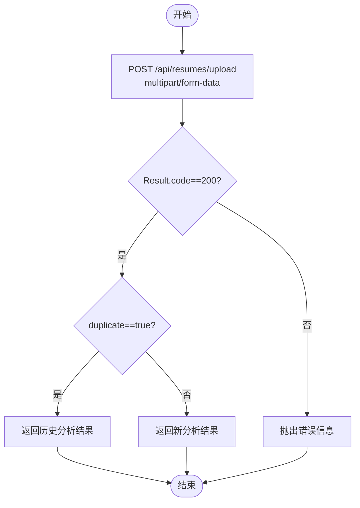
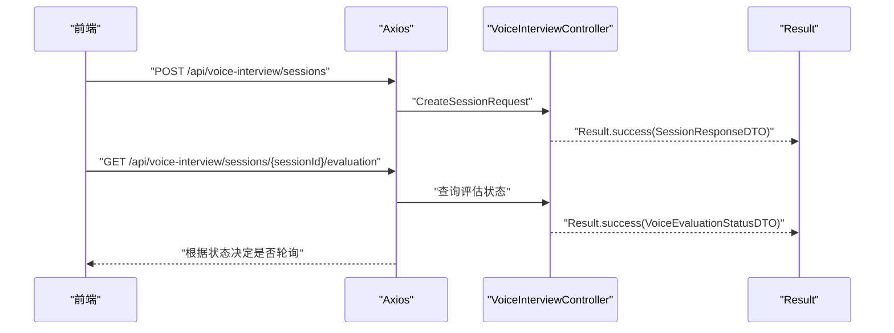
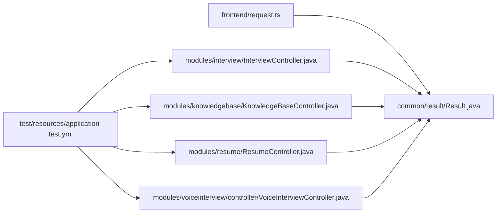

# API测试

<cite>
**本文引用的文件**
- [InterviewController.java](file://app/src/main/java/interview/guide/modules/interview/InterviewController.java)
- [KnowledgeBaseController.java](file://app/src/main/java/interview/guide/modules/knowledgebase/KnowledgeBaseController.java)
- [ResumeController.java](file://app/src/main/java/interview/guide/modules/resume/ResumeController.java)
- [InterviewScheduleController.java](file://app/src/main/java/interview/guide/modules/interviewschedule/InterviewScheduleController.java)
- [VoiceInterviewController.java](file://app/src/main/java/interview/guide/modules/voiceinterview/controller/VoiceInterviewController.java)
- [Result.java](file://app/src/main/java/interview/guide/common/result/Result.java)
- [request.ts](file://frontend/src/api/request.ts)
- [interview.ts](file://frontend/src/api/interview.ts)
- [knowledgebase.ts](file://frontend/src/api/knowledgebase.ts)
- [resume.ts](file://frontend/src/api/resume.ts)
- [index.ts](file://frontend/src/api/index.ts)
- [application-test.yml](file://app/src/test/resources/application-test.yml)
- [README.md](file://README.md)
</cite>

## 目录
1. [简介](#简介)
2. [项目结构](#项目结构)
3. [核心组件](#核心组件)
4. [架构总览](#架构总览)
5. [详细组件分析](#详细组件分析)
6. [依赖分析](#依赖分析)
7. [性能考虑](#性能考虑)
8. [故障排查指南](#故障排查指南)
9. [结论](#结论)
10. [附录](#附录)

## 简介
本文件面向面试指南平台的API测试，系统性阐述RESTful API测试的核心概念与最佳实践，结合本项目的后端控制器与前端请求封装，给出可落地的测试策略与用例设计。内容涵盖：
- REST基础：HTTP方法、状态码、统一响应结构
- Postman/Insomnia使用要点：集合创建、环境变量、预请求/测试脚本
- 测试策略：参数校验、响应格式、错误处理、边界条件
- 前端API测试：Axios拦截器、错误处理、数据转换
- 实际接口测试：面试、简历、知识库、语音面试、面试安排
- 自动化测试：Cypress/Playwright在端到端场景下的API测试思路
- 最佳实践：测试数据管理、环境隔离、结果分析

## 项目结构
后端采用Spring Boot，按模块划分控制器，统一返回Result包装结构；前端使用Axios封装统一请求与响应拦截，便于测试与调试。

图表来源
- [InterviewController.java:1-176](file://app/src/main/java/interview/guide/modules/interview/InterviewController.java#L1-L176)
- [KnowledgeBaseController.java:1-211](file://app/src/main/java/interview/guide/modules/knowledgebase/KnowledgeBaseController.java#L1-L211)
- [ResumeController.java:1-132](file://app/src/main/java/interview/guide/modules/resume/ResumeController.java#L1-L132)
- [InterviewScheduleController.java:1-132](file://app/src/main/java/interview/guide/modules/interviewschedule/InterviewScheduleController.java#L1-L132)
- [VoiceInterviewController.java:1-201](file://app/src/main/java/interview/guide/modules/voiceinterview/controller/VoiceInterviewController.java#L1-L201)
- [Result.java:1-61](file://app/src/main/java/interview/guide/common/result/Result.java#L1-L61)
- [request.ts:1-128](file://frontend/src/api/request.ts#L1-L128)
- [interview.ts:1-107](file://frontend/src/api/interview.ts#L1-L107)
- [knowledgebase.ts:1-281](file://frontend/src/api/knowledgebase.ts#L1-L281)
- [resume.ts:1-21](file://frontend/src/api/resume.ts#L1-L21)
- [index.ts:1-9](file://frontend/src/api/index.ts#L1-L9)

章节来源
- [README.md:210-247](file://README.md#L210-L247)

## 核心组件
- 统一响应结构：后端通过Result包装所有响应，前端Axios拦截器按约定解析，简化测试断言。
- 控制器层：按模块暴露REST接口，涵盖面试、简历、知识库、语音面试、面试安排。
- 前端请求封装：统一基地址、超时、上传、拦截器，便于测试与复用。

章节来源
- [Result.java:1-61](file://app/src/main/java/interview/guide/common/result/Result.java#L1-L61)
- [request.ts:1-128](file://frontend/src/api/request.ts#L1-L128)

## 架构总览
后端控制器负责路由与业务编排，统一返回Result；前端通过Axios封装调用，自动处理成功/失败分支与错误信息。

图表来源
- [request.ts:26-75](file://frontend/src/api/request.ts#L26-L75)
- [Result.java:17-59](file://app/src/main/java/interview/guide/common/result/Result.java#L17-L59)

## 详细组件分析

### 文字面试API测试
- 接口范围：会话列表、创建、详情、当前问题、提交答案、生成报告、未完成会话、暂存答案、提前交卷、导出PDF、删除会话。
- 关键点：
  - 统一响应：Result.success(data)/Result.error(message)
  - 速率限制：部分接口标注限流注解，测试需考虑并发与配额
  - 导出PDF：返回二进制流并设置Content-Disposition与类型
  - 会话生命周期：创建→答题→生成报告→导出/删除

图表来源
- [InterviewController.java:39-100](file://app/src/main/java/interview/guide/modules/interview/InterviewController.java#L39-L100)
- [interview.ts:25-106](file://frontend/src/api/interview.ts#L25-L106)
- [request.ts:77-115](file://frontend/src/api/request.ts#L77-L115)

章节来源
- [InterviewController.java:1-176](file://app/src/main/java/interview/guide/modules/interview/InterviewController.java#L1-L176)
- [interview.ts:1-107](file://frontend/src/api/interview.ts#L1-L107)

### 知识库API测试
- 接口范围：列表、详情、删除、查询、流式查询(SSE)、分类管理、上传下载、搜索、统计、向量化重试。
- 关键点：
  - 流式SSE：前端自定义fetch解析，需单独测试流式事件与错误处理
  - 上传下载：multipart/form-data，注意文件大小与类型限制
  - 向量化状态：枚举状态(PENDING/PROCESSING/COMPLETED/FAILED)，需轮询或监听

图表来源
- [KnowledgeBaseController.java:86-103](file://app/src/main/java/interview/guide/modules/knowledgebase/KnowledgeBaseController.java#L86-L103)
- [knowledgebase.ts:177-280](file://frontend/src/api/knowledgebase.ts#L177-L280)

章节来源
- [KnowledgeBaseController.java:1-211](file://app/src/main/java/interview/guide/modules/knowledgebase/KnowledgeBaseController.java#L1-L211)
- [knowledgebase.ts:1-281](file://frontend/src/api/knowledgebase.ts#L1-L281)

### 简历API测试
- 接口范围：上传并分析、列表、详情、导出PDF、删除、重新分析、健康检查。
- 关键点：
  - 重复检测：返回duplicate字段，测试需覆盖重复与非重复场景
  - 导出PDF：二进制流与Content-Disposition头
  - 重新分析：失败重试入口

图表来源
- [ResumeController.java:44-54](file://app/src/main/java/interview/guide/modules/resume/ResumeController.java#L44-L54)
- [resume.ts:8-12](file://frontend/src/api/resume.ts#L8-L12)

章节来源
- [ResumeController.java:1-132](file://app/src/main/java/interview/guide/modules/resume/ResumeController.java#L1-L132)
- [resume.ts:1-21](file://frontend/src/api/resume.ts#L1-L21)

### 语音面试API测试
- 接口范围：会话创建、详情、结束、暂停/恢复、消息历史、评估状态/触发评估。
- 关键点：
  - 异步评估：状态轮询(PENDING/PROCESSING/COMPLETED/FAILED)，前端需实现轮询逻辑
  - 会话存在性：不存在时返回错误，测试需覆盖正反场景

图表来源
- [VoiceInterviewController.java:48-157](file://app/src/main/java/interview/guide/modules/voiceinterview/controller/VoiceInterviewController.java#L48-L157)

章节来源
- [VoiceInterviewController.java:1-201](file://app/src/main/java/interview/guide/modules/voiceinterview/controller/VoiceInterviewController.java#L1-L201)

### 面试安排API测试
- 接口范围：解析邀约文本、CRUD、状态更新。
- 关键点：
  - 时间参数：ISO日期时间格式，测试需覆盖边界与时区
  - 状态枚举：PATCH/PUT均可更新状态，测试需覆盖不同方法

章节来源
- [InterviewScheduleController.java:1-132](file://app/src/main/java/interview/guide/modules/interviewschedule/InterviewScheduleController.java#L1-L132)

## 依赖分析
- 前端Axios拦截器依赖后端Result约定，测试时需确保断言命中code与message/data字段。
- 控制器依赖统一Result封装，测试关注成功/失败分支与异常路径。
- 测试环境配置(application-test.yml)提供内存数据库、Redis、AI服务等测试依赖，确保可重复性与隔离性。

图表来源
- [request.ts:26-75](file://frontend/src/api/request.ts#L26-L75)
- [Result.java:17-59](file://app/src/main/java/interview/guide/common/result/Result.java#L17-L59)
- [InterviewController.java:39-100](file://app/src/main/java/interview/guide/modules/interview/InterviewController.java#L39-L100)
- [KnowledgeBaseController.java:86-103](file://app/src/main/java/interview/guide/modules/knowledgebase/KnowledgeBaseController.java#L86-L103)
- [ResumeController.java:44-54](file://app/src/main/java/interview/guide/modules/resume/ResumeController.java#L44-L54)
- [VoiceInterviewController.java:137-199](file://app/src/main/java/interview/guide/modules/voiceinterview/controller/VoiceInterviewController.java#L137-L199)
- [application-test.yml:1-165](file://app/src/test/resources/application-test.yml#L1-L165)

章节来源
- [application-test.yml:1-165](file://app/src/test/resources/application-test.yml#L1-L165)

## 性能考虑
- 超时设置：前端对AI生成/评估较长耗时的接口设置了较长超时，测试时应覆盖超时与重试策略。
- 速率限制：控制器上标注的限流注解需在测试中模拟并发与配额耗尽场景。
- 流式SSE：知识库流式查询需测试断连、重连与缓冲区处理。
- 导出与上传：PDF导出与大文件上传需关注网络抖动与超时重试。

章节来源
- [interview.ts:38-75](file://frontend/src/api/interview.ts#L38-L75)
- [knowledgebase.ts:179-181](file://frontend/src/api/knowledgebase.ts#L179-L181)
- [request.ts:102-107](file://frontend/src/api/request.ts#L102-L107)

## 故障排查指南
- 统一错误处理：前端拦截器优先解析后端Result.message，若非Result格式或网络错误，给出明确提示。
- 文件上传失败：区分有响应与无响应两种情况，避免误判为文件大小问题。
- 语音面试评估：不存在会话时抛BusinessException，测试需覆盖该异常路径。

章节来源
- [request.ts:44-75](file://frontend/src/api/request.ts#L44-L75)
- [VoiceInterviewController.java:142-144](file://app/src/main/java/interview/guide/modules/voiceinterview/controller/VoiceInterviewController.java#L142-L144)

## 结论
本项目以统一的Result响应与Axios拦截器为基础，形成清晰的前后端契约，便于API测试的标准化与自动化。通过覆盖参数校验、响应格式、错误处理、边界条件与异步状态轮询，可构建稳健的API测试体系。

## 附录

### REST基础与测试要点
- HTTP方法：GET/POST/PUT/PATCH/DELETE，配合路径参数与查询参数
- 状态码：后端统一返回HTTP 200 + Result.code判断成功/失败
- 请求/响应格式：JSON；文件上传使用multipart/form-data
- 速率限制：控制器注解限流，测试需并发压测与配额耗尽场景

章节来源
- [Result.java:25-49](file://app/src/main/java/interview/guide/common/result/Result.java#L25-L49)
- [request.ts:12-17](file://frontend/src/api/request.ts#L12-L17)

### Postman/Insomnia使用建议
- 环境变量：后端基地址、AI密钥、桶名等
- 集合组织：按模块分集合（面试、简历、知识库、语音面试、面试安排）
- 预请求脚本：设置Authorization、动态参数（如时间戳、签名）
- 测试脚本：断言Result.code、响应体字段、Content-Type与Content-Disposition

### API测试策略清单
- 参数验证测试：必填、类型、长度、枚举、格式（邮箱/URL/日期）
- 响应格式测试：字段存在性、类型一致性、嵌套结构
- 错误处理测试：4xx/5xx、Result.code!=200、异常路径
- 边界条件测试：空值、极小/极大值、特殊字符、超长字符串
- 异步状态测试：轮询评估状态、SSE流式事件、重试机制
- 并发与限流：模拟高并发、触发限流、观察退避与排队

### 前端API测试要点
- Axios拦截器：统一成功/失败分支、错误信息提取
- 数据转换：将后端Result映射为前端状态与UI提示
- 文件操作：上传/下载、Blob处理、进度与错误提示

章节来源
- [request.ts:26-75](file://frontend/src/api/request.ts#L26-L75)

### 自动化测试（Cypress/Playwright）
- 端到端场景：从登录到提交答案/导出报告的完整流程
- API层：直接调用后端接口，断言Result与状态
- Mock与Fixture：使用Mock数据与固定Fixture减少外部依赖
- 截图与日志：失败时截图与日志采集，便于定位

### 测试数据管理与环境隔离
- 测试环境：application-test.yml提供内存数据库与Redis，确保隔离与可重复
- 数据清理：测试结束后清理临时文件与状态
- 环境切换：通过环境变量切换后端基地址与AI密钥

章节来源
- [application-test.yml:1-165](file://app/src/test/resources/application-test.yml#L1-L165)