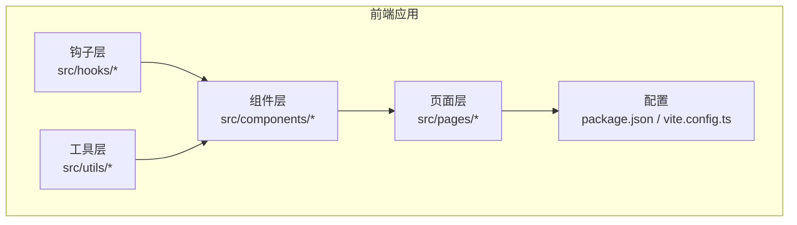
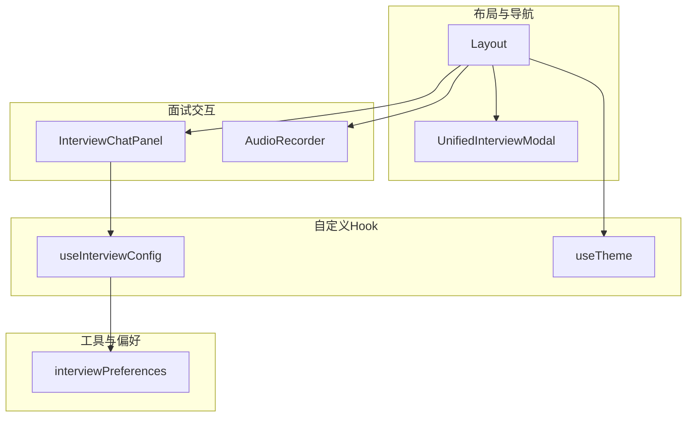
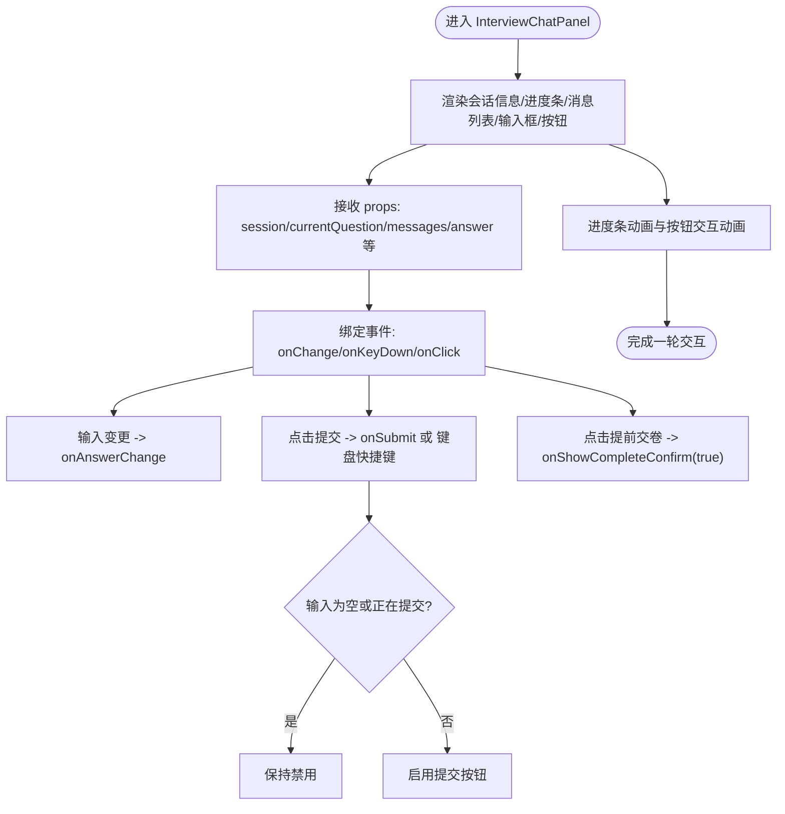
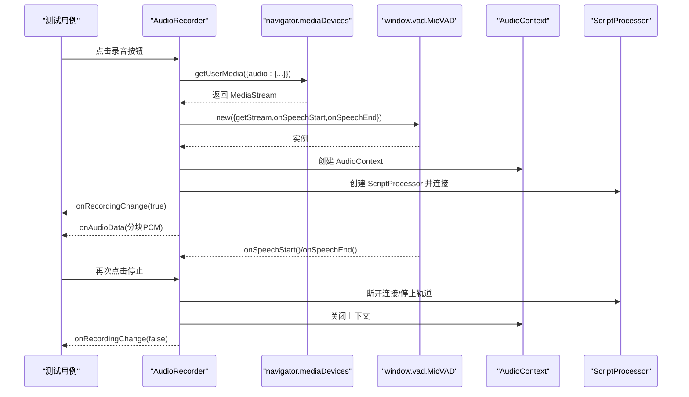
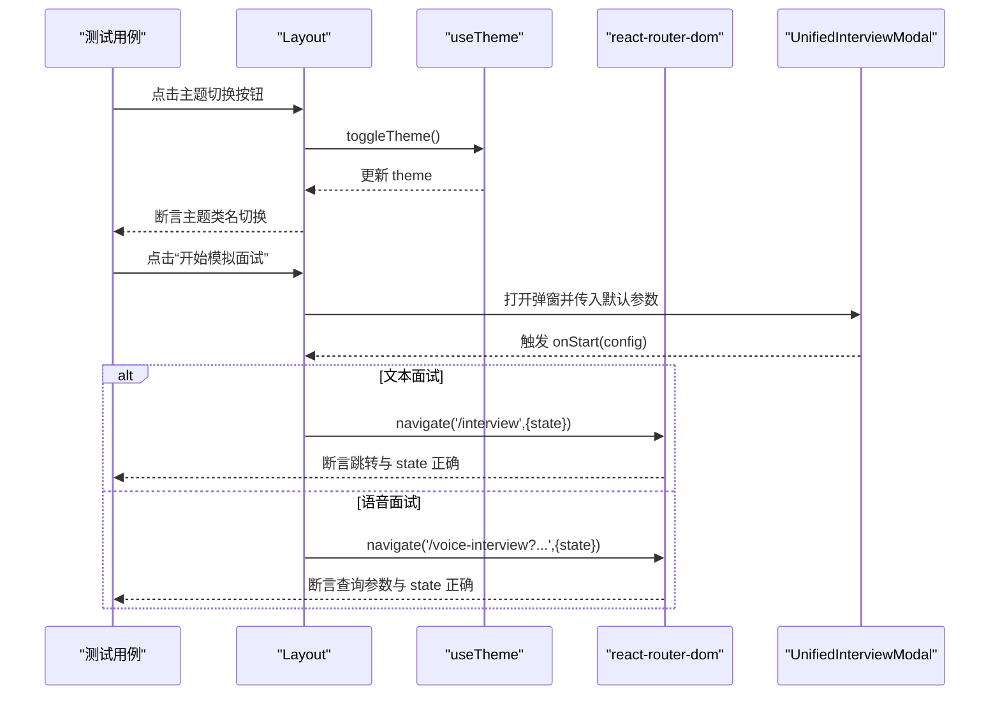
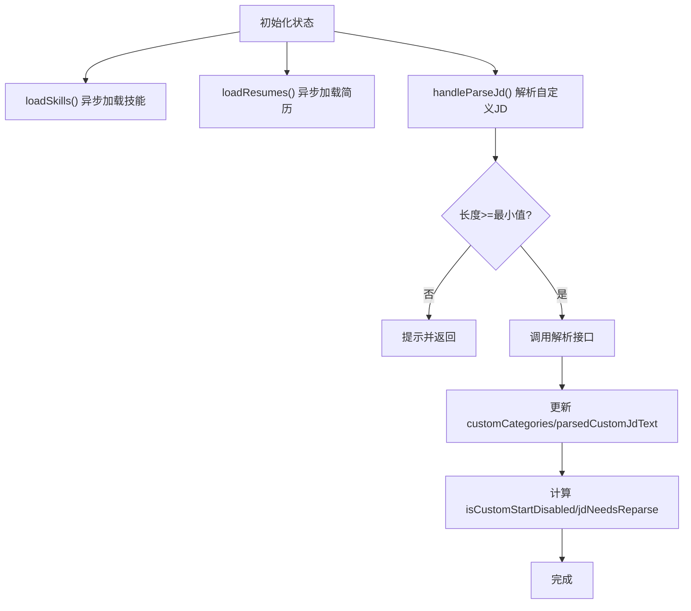
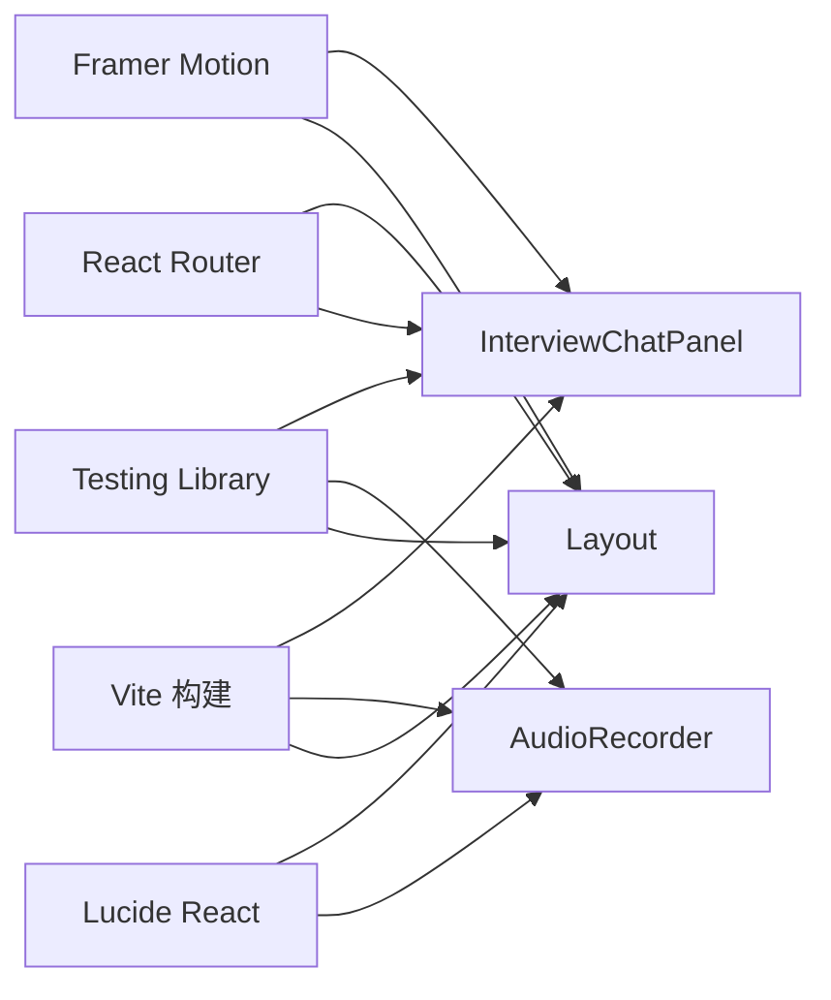

# 前端测试

<cite>
**本文引用的文件**
- [InterviewChatPanel.tsx](file://frontend/src/components/InterviewChatPanel.tsx)
- [AudioRecorder.tsx](file://frontend/src/components/AudioRecorder.tsx)
- [Layout.tsx](file://frontend/src/components/Layout.tsx)
- [useInterviewConfig.ts](file://frontend/src/hooks/useInterviewConfig.ts)
- [useTheme.ts](file://frontend/src/hooks/useTheme.ts)
- [interviewPreferences.ts](file://frontend/src/utils/interviewPreferences.ts)
- [package.json](file://frontend/package.json)
- [vite.config.ts](file://frontend/vite.config.ts)
</cite>

## 目录
1. [简介](#简介)
2. [项目结构](#项目结构)
3. [核心组件](#核心组件)
4. [架构总览](#架构总览)
5. [详细组件分析](#详细组件分析)
6. [依赖分析](#依赖分析)
7. [性能考虑](#性能考虑)
8. [故障排查指南](#故障排查指南)
9. [结论](#结论)
10. [附录](#附录)

## 简介
本文件面向面试指南平台前端，系统化阐述React组件测试与前端测试最佳实践，覆盖以下主题：
- 组件渲染测试、属性传递测试、事件处理测试
- Testing Library 使用要点（screen、render、fireEvent 等）
- 用户交互测试（按钮点击、表单输入、路由导航）
- Hook 测试（自定义 Hook、状态管理、副作用）
- 实际组件测试方案（InterviewChatPanel、AudioRecorder、Layout）
- 性能测试（渲染性能、内存泄漏、用户体验）
- 自动化配置（Jest、测试环境、CI/CD）
- 最佳实践（用例组织、Mock 策略、测试数据管理）

## 项目结构
前端位于 frontend 目录，采用 React + TypeScript + Vite 构建，核心目录与文件如下：
- 组件层：src/components 下包含 UI 组件与页面容器
- 钩子层：src/hooks 下包含自定义 Hook
- 工具层：src/utils 下包含偏好设置与工具函数
- 配置层：package.json、vite.config.ts 等
- 页面层：src/pages 下为路由页面

**章节来源**
- [package.json:1-47](file://frontend/package.json#L1-L47)
- [vite.config.ts:1-42](file://frontend/vite.config.ts#L1-L42)

## 核心组件
本节聚焦三个关键组件及其测试关注点：
- InterviewChatPanel：聊天输入、进度条、提交与提前交卷交互
- AudioRecorder：录音控制、音量可视化、VAD 回调、媒体流与音频上下文生命周期
- Layout：导航、主题切换、统一面试弹窗、路由跳转

**章节来源**
- [InterviewChatPanel.tsx:1-151](file://frontend/src/components/InterviewChatPanel.tsx#L1-L151)
- [AudioRecorder.tsx:1-257](file://frontend/src/components/AudioRecorder.tsx#L1-L257)
- [Layout.tsx:1-257](file://frontend/src/components/Layout.tsx#L1-L257)

## 架构总览
下图展示测试视角下的组件关系与交互路径，便于理解测试覆盖范围与断言重点。

**图表来源**
- [Layout.tsx:22-256](file://frontend/src/components/Layout.tsx#L22-L256)
- [InterviewChatPanel.tsx:31-42](file://frontend/src/components/InterviewChatPanel.tsx#L31-L42)
- [AudioRecorder.tsx:28-34](file://frontend/src/components/AudioRecorder.tsx#L28-L34)
- [useInterviewConfig.ts:41-151](file://frontend/src/hooks/useInterviewConfig.ts#L41-L151)
- [useTheme.ts:5-36](file://frontend/src/hooks/useTheme.ts#L5-L36)
- [interviewPreferences.ts:19-50](file://frontend/src/utils/interviewPreferences.ts#L19-L50)

## 详细组件分析

### InterviewChatPanel 组件测试
该组件负责面试过程中的消息展示、输入框与提交按钮、进度条与“提前交卷”确认流程。测试应覆盖：
- 渲染：会话信息、题目序号、进度百分比、消息列表、输入框与按钮
- 属性传递：session、currentQuestion、messages、answer、回调函数、提交状态
- 事件处理：输入变更、键盘快捷键（Ctrl/Cmd + Enter）、提交按钮禁用条件、提前交卷触发
- 动画与视觉反馈：进度条动画、按钮悬停/按压态

建议断言清单（以伪断言形式描述）：
- 断言渲染包含“题目 X/Y”文本与进度百分比
- 断言 Virtuoso 列表项数量与内容
- 断言输入框初始值与受控更新
- 断言按钮在空输入或提交中时禁用
- 断言 Ctrl/Cmd + Enter 触发 onSubmit
- 断言“提前交卷”按钮触发 onShowCompleteConfirm(true)

**图表来源**
- [InterviewChatPanel.tsx:56-149](file://frontend/src/components/InterviewChatPanel.tsx#L56-L149)

**章节来源**
- [InterviewChatPanel.tsx:15-42](file://frontend/src/components/InterviewChatPanel.tsx#L15-L42)
- [InterviewChatPanel.tsx:50-54](file://frontend/src/components/InterviewChatPanel.tsx#L50-L54)
- [InterviewChatPanel.tsx:102-110](file://frontend/src/components/InterviewChatPanel.tsx#L102-L110)
- [InterviewChatPanel.tsx:112-144](file://frontend/src/components/InterviewChatPanel.tsx#L112-L144)

### AudioRecorder 组件测试
该组件负责录音控制、音量可视化、VAD 回调、媒体流与音频上下文生命周期管理。测试应覆盖：
- 渲染：录音按钮、音量涟漪效果
- 行为：开始/停止录音、音量监控定时器、音频分块与编码、VAD 初始化与回调
- 副作用：媒体流与音频上下文的创建与销毁、清理定时器
- 错误处理：麦克风权限拒绝、VAD 未加载错误提示

建议断言清单：
- 断言点击按钮切换 isRecording 状态
- 断言开始录音成功初始化 MediaStream、AudioContext、Analyser、VAD
- 断言音量涟漪元素在录音时出现且样式随音量变化
- 断言 onAudioData 按固定采样率被调用（通过 Mock）
- 断言 onSpeechStart/End 回调被触发
- 断言停止录音后媒体流与上下文被正确关闭
- 断言组件卸载时资源被清理

**图表来源**
- [AudioRecorder.tsx:69-178](file://frontend/src/components/AudioRecorder.tsx#L69-L178)
- [AudioRecorder.tsx:180-205](file://frontend/src/components/AudioRecorder.tsx#L180-L205)
- [AudioRecorder.tsx:207-211](file://frontend/src/components/AudioRecorder.tsx#L207-L211)

**章节来源**
- [AudioRecorder.tsx:20-34](file://frontend/src/components/AudioRecorder.tsx#L20-L34)
- [AudioRecorder.tsx:48-67](file://frontend/src/components/AudioRecorder.tsx#L48-L67)
- [AudioRecorder.tsx:87-101](file://frontend/src/components/AudioRecorder.tsx#L87-L101)
- [AudioRecorder.tsx:115-151](file://frontend/src/components/AudioRecorder.tsx#L115-L151)
- [AudioRecorder.tsx:180-205](file://frontend/src/components/AudioRecorder.tsx#L180-L205)

### Layout 组件测试
该组件负责侧边栏导航、主题切换、统一面试弹窗、路由跳转。测试应覆盖：
- 渲染：Logo、主题切换按钮、导航分组与项、活动态高亮
- 交互：主题切换、导航链接点击、打开统一面试弹窗
- 路由：根据配置跳转至文本/语音面试页，携带查询参数与 state

建议断言清单：
- 断言渲染包含各导航分组与项
- 断言当前路径激活态样式与指示符
- 断言点击主题切换按钮触发 useTheme.toggleTheme
- 断言点击“开始模拟面试”打开弹窗并传入默认参数
- 断言文本面试跳转至 /interview 并携带 state
- 断言语音面试跳转至 /voice-interview 并携带查询参数与 state

**图表来源**
- [Layout.tsx:22-80](file://frontend/src/components/Layout.tsx#L22-L80)
- [Layout.tsx:107-129](file://frontend/src/components/Layout.tsx#L107-L129)
- [Layout.tsx:243-253](file://frontend/src/components/Layout.tsx#L243-L253)

**章节来源**
- [Layout.tsx:82-104](file://frontend/src/components/Layout.tsx#L82-L104)
- [Layout.tsx:107-129](file://frontend/src/components/Layout.tsx#L107-L129)
- [Layout.tsx:243-253](file://frontend/src/components/Layout.tsx#L243-L253)

### 自定义 Hook 测试

#### useInterviewConfig 测试
关注点：
- 状态初始化与默认值（模式、难度、技能、问题数、时长、LLM 提供商）
- 加载技能与简历列表（异步、错误兜底）
- 自定义 JD 解析（长度校验、解析流程、状态标记）
- 计算派生状态（是否自定义技能、是否可开始、是否需要重新解析）

建议断言清单：
- 断言默认值符合预期（如默认技能、默认 LLM 提供商）
- 断言 loadSkills 成功/失败分支
- 断言 loadResumes 成功/失败分支
- 断言 handleParseJd 在 JD 太短时提示并中断
- 断言解析成功后更新 customCategories 与 parsedCustomJdText
- 断言 isCustomStartDisabled 的计算逻辑

**图表来源**
- [useInterviewConfig.ts:41-151](file://frontend/src/hooks/useInterviewConfig.ts#L41-L151)

**章节来源**
- [useInterviewConfig.ts:41-151](file://frontend/src/hooks/useInterviewConfig.ts#L41-L151)

#### useTheme 测试
关注点：
- 初始主题来源（localStorage 优先、系统偏好其次）
- 切换主题后同步到 documentElement 类名与 localStorage
- 切换函数 toggleTheme 的行为

建议断言清单：
- 断言初始化从 localStorage 或系统偏好读取
- 断言切换主题后添加/移除 'dark' 类名
- 断言切换主题后写入 localStorage

**章节来源**
- [useTheme.ts:5-36](file://frontend/src/hooks/useTheme.ts#L5-L36)

#### interviewPreferences 测试
关注点：
- 默认值、序列化/反序列化、兼容旧结构、异常处理
- 保存与重置偏好

建议断言清单：
- 断言默认 LLM 提供商
- 断言空存储返回默认值
- 断言非法 JSON 返回默认值
- 断言保存后可读取
- 断言重置后恢复默认

**章节来源**
- [interviewPreferences.ts:19-50](file://frontend/src/utils/interviewPreferences.ts#L19-L50)

## 依赖分析
- 组件间依赖：Layout 作为根布局，承载导航、主题与统一面试弹窗；InterviewChatPanel 与 AudioRecorder 作为面试交互核心，前者依赖 useInterviewConfig 管理状态，后者独立于 Hook。
- 第三方库：Testing Library（用于 DOM 查询与事件模拟）、Framer Motion（动画）、Lucide React（图标）、React Router（导航）。
- 构建与运行：Vite 提供开发服务器与打包，chunk 分离优化 vendor 包。

**图表来源**
- [InterviewChatPanel.tsx:1-151](file://frontend/src/components/InterviewChatPanel.tsx#L1-L151)
- [AudioRecorder.tsx:1-257](file://frontend/src/components/AudioRecorder.tsx#L1-L257)
- [Layout.tsx:1-257](file://frontend/src/components/Layout.tsx#L1-L257)
- [vite.config.ts:13-23](file://frontend/vite.config.ts#L13-L23)

**章节来源**
- [vite.config.ts:13-23](file://frontend/vite.config.ts#L13-L23)

## 性能考虑
- 渲染性能
  - Virtuoso 列表：对大量消息使用虚拟滚动，避免全量节点渲染。
  - 动画：进度条与按钮动画使用 Framer Motion，注意在低性能设备上的帧率。
- 内存泄漏检测
  - AudioRecorder：确保停止录音时断开 ScriptProcessor、关闭 AudioContext、停止媒体轨道与清理定时器。
  - 组件卸载：确保在 useEffect cleanup 中释放资源。
- 用户体验
  - 提交按钮禁用与加载态反馈，避免重复提交。
  - 键盘快捷键（Ctrl/Cmd + Enter）提升输入效率。

**章节来源**
- [InterviewChatPanel.tsx:82-97](file://frontend/src/components/InterviewChatPanel.tsx#L82-L97)
- [AudioRecorder.tsx:162-170](file://frontend/src/components/AudioRecorder.tsx#L162-L170)
- [AudioRecorder.tsx:207-211](file://frontend/src/components/AudioRecorder.tsx#L207-L211)

## 故障排查指南
- 录音不可用
  - 检查浏览器权限与 HTTPS 环境
  - 确认 VAD 资源已通过 script 标签正确加载
  - 查看控制台错误与 alert 提示
- 主题切换无效
  - 检查 localStorage 是否可写
  - 确认 documentElement 上 'dark' 类名同步
- 路由跳转异常
  - 检查 navigate 参数与 state 结构
  - 确认路由配置与路径拼接

**章节来源**
- [AudioRecorder.tsx:83-85](file://frontend/src/components/AudioRecorder.tsx#L83-L85)
- [useTheme.ts:19-28](file://frontend/src/hooks/useTheme.ts#L19-L28)
- [Layout.tsx:47-79](file://frontend/src/components/Layout.tsx#L47-L79)

## 结论
本文围绕面试指南平台前端的关键组件与自定义 Hook，系统梳理了组件测试、用户交互测试、Hook 测试与性能测试的实施要点，并提供了可落地的断言思路与流程图。结合 Testing Library 的核心 API 与 Vite 构建体系，可在保证覆盖率的同时兼顾可维护性与性能表现。

## 附录
- Testing Library 常用 API
  - screen：用于查询 DOM 元素（如 getByRole、getAllByText 等）
  - render：渲染组件并返回查询与事件工具
  - fireEvent：模拟用户事件（click、change、keydown 等）
- Jest 与测试环境
  - 使用 Vite 与 React 插件进行构建与测试
  - 可通过环境变量与别名配置适配测试场景
- CI/CD 集成
  - 将测试脚本纳入流水线，确保每次提交均执行单元测试与交互测试
  - 对关键组件（如 InterviewChatPanel、AudioRecorder、Layout）设置阈值与覆盖率要求