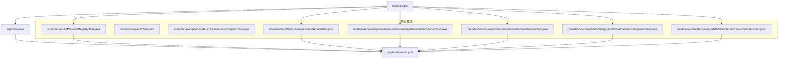
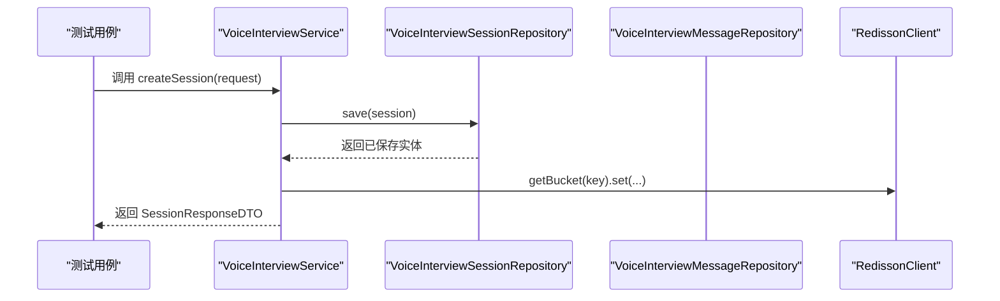
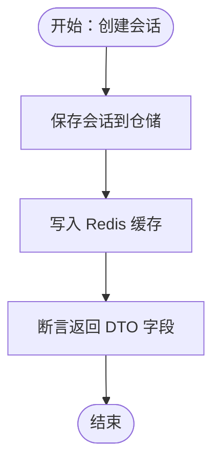
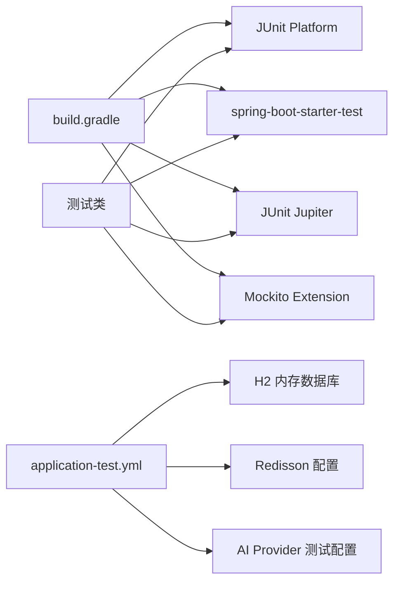

# 单元测试

<cite>
**本文引用的文件**
- [AppTest.java](file://app/src/test/java/interview/guide/AppTest.java)
- [application-test.yml](file://app/src/test/resources/application-test.yml)
- [build.gradle](file://app/build.gradle)
- [LlmProviderRegistryTest.java](file://app/src/test/java/interview/guide/common/ai/LlmProviderRegistryTest.java)
- [VoiceInterviewServiceTest.java](file://app/src/test/java/interview/guide/modules/voiceinterview/service/VoiceInterviewServiceTest.java)
- [VoiceInterviewIntegrationTest.java](file://app/src/test/java/interview/guide/modules/voiceinterview/integration/VoiceInterviewIntegrationTest.java)
- [RateLimitIntegrationTest.java](file://app/src/test/java/interview/guide/common/aspect/RateLimitIntegrationTest.java)
- [VoiceInterviewSessionStatusTest.java](file://app/src/test/java/interview/guide/modules/voiceinterview/model/VoiceInterviewSessionStatusTest.java)
- [RateLimitExceededExceptionTest.java](file://app/src/test/java/interview/guide/common/exception/RateLimitExceededExceptionTest.java)
- [DocumentParseServiceTest.java](file://app/src/test/java/interview/guide/infrastructure/file/DocumentParseServiceTest.java)
- [KnowledgeBaseVectorServiceTest.java](file://app/src/test/java/interview/guide/modules/knowledgebase/service/KnowledgeBaseVectorServiceTest.java)
</cite>

## 更新摘要
**所做更改**
- 删除了关于 Dashscope LLM 服务测试、Qwen ASR/TTS 服务测试、语音面试提示词服务测试和语音面试暂停/恢复测试的相关内容
- 更新了测试文件列表，反映了实际存在的测试文件
- 调整了项目结构图，移除了已删除的测试文件
- 更新了详细组件分析部分，删除了对应测试文件的分析内容

## 目录
1. [简介](#简介)
2. [项目结构](#项目结构)
3. [核心组件](#核心组件)
4. [架构总览](#架构总览)
5. [详细组件分析](#详细组件分析)
6. [依赖分析](#依赖分析)
7. [性能考虑](#性能考虑)
8. [故障排查指南](#故障排查指南)
9. [结论](#结论)
10. [附录](#附录)

## 简介
本文件面向面试指南平台的单元测试实践，系统讲解 JUnit 5 与 Mockito 在本项目中的使用方式，覆盖测试生命周期、断言策略、异常测试、测试数据准备与清理、以及针对控制器、服务层、Repository 层的典型测试场景。同时结合项目实际，给出 Spring Boot 测试注解的适用场景与选择建议，并提供测试覆盖率分析与优化建议。

## 项目结构
测试代码集中在 app/src/test 下，采用按模块与层次划分的组织方式：
- common：通用能力测试（AI Provider 注册器、限流注解与脚本、异常模型）
- infrastructure：基础设施测试（文件解析、文本清洗等）
- modules：业务模块测试（语音面试、知识库向量、简历等）

图表来源
- [AppTest.java:1-18](file://app/src/test/java/interview/guide/AppTest.java#L1-L18)
- [application-test.yml:1-165](file://app/src/test/resources/application-test.yml#L1-L165)
- [build.gradle:83-102](file://app/build.gradle#L83-L102)

章节来源
- [build.gradle:83-102](file://app/build.gradle#L83-L102)
- [application-test.yml:1-165](file://app/src/test/resources/application-test.yml#L1-L165)

## 核心组件
- JUnit 5：统一的测试框架，使用 @Test、@DisplayName、@Nested、@BeforeEach、@AfterEach 等注解组织测试。
- Mockito：用于模拟依赖对象，配合 @Mock、@Spy、@InjectMocks、@ExtendWith(MockitoExtension.class) 等实现隔离测试。
- 断言体系：使用 org.junit.jupiter.api.Assertions 与静态导入，覆盖空值、相等、同一实例、布尔、异常等断言。
- Spring Boot 测试基础：通过 application-test.yml 提供内存数据库、Redis、AI Provider 等测试配置；Gradle 统一使用 JUnit Platform。

章节来源
- [AppTest.java:10-16](file://app/src/test/java/interview/guide/AppTest.java#L10-L16)
- [build.gradle:83-102](file://app/build.gradle#L83-L102)
- [application-test.yml:4-47](file://app/src/test/resources/application-test.yml#L4-L47)

## 架构总览
以下序列图展示典型的"服务层 + 仓储 + 缓存"测试交互，体现 Mockito 的依赖注入与桩函数设置：

图表来源
- [VoiceInterviewServiceTest.java:94-133](file://app/src/test/java/interview/guide/modules/voiceinterview/service/VoiceInterviewServiceTest.java#L94-L133)

章节来源
- [VoiceInterviewServiceTest.java:94-133](file://app/src/test/java/interview/guide/modules/voiceinterview/service/VoiceInterviewServiceTest.java#L94-L133)

## 详细组件分析

### JUnit 5 与测试生命周期
- 测试类与方法：使用 @Test 标注单测方法，@DisplayName 提供可读性更强的测试描述。
- 嵌套测试：@Nested 用于分组测试场景，提升可维护性。
- 生命周期：
  - @BeforeEach：在每个测试方法前执行，适合初始化 Mock、默认属性与缓存桩。
  - @AfterEach：在每个测试方法后执行，适合资源清理（如 Redis 脚本测试中的清理）。
  - @TestInstance：项目中未显式使用，若需调整实例策略可引入。
- 断言：
  - 空值/相等/同一实例：assertNotNull/assertEquals/assertSame。
  - 布尔：assertTrue/assertFalse。
  - 异常：assertThrows/assertDoesNotThrow。
  - 参数匹配：ArgumentCaptor 捕获参数，verify 验证调用次数与条件。

章节来源
- [VoiceInterviewServiceTest.java:73-90](file://app/src/test/java/interview/guide/modules/voiceinterview/service/VoiceInterviewServiceTest.java#L73-L90)
- [RateLimitIntegrationTest.java:151-157](file://app/src/test/java/interview/guide/common/aspect/RateLimitIntegrationTest.java#L151-L157)

### Mockito 使用与策略
- @Mock：创建依赖的模拟对象。
- @Spy：对真实对象进行部分模拟（调用真实方法时保留原实现）。
- @InjectMocks：将 @Mock/@Spy 注入到被测对象中。
- @ExtendWith(MockitoExtension.class)：启用 Mockito 扩展。
- when/then：设置桩函数；verify：验证调用次数与条件；ArgumentCaptor：捕获参数。
- lenient：在复杂场景（如 Redis Bucket）中放宽校验，避免过度 stubbing。

章节来源
- [LlmProviderRegistryTest.java:22-41](file://app/src/test/java/interview/guide/common/ai/LlmProviderRegistryTest.java#L22-L41)
- [VoiceInterviewServiceTest.java:53-90](file://app/src/test/java/interview/guide/modules/voiceinterview/service/VoiceInterviewServiceTest.java#L53-L90)

### 控制器测试与 Spring Boot 测试注解
- 本项目测试以服务层与集成场景为主，未直接出现 @WebMvcTest、@SpringBootTest、@DataJpaTest 等注解的使用。
- 若需控制器测试，推荐：
  - @WebMvcTest：仅加载 Web 层 Bean，适合控制器与视图层测试。
  - @SpringBootTest：启动完整上下文，适合集成测试。
  - @DataJpaTest：专注 JPA/Repository 测试，配合 @AutoConfigureTestDatabase 与嵌入式数据库。
- 选择建议：
  - 服务层：优先使用 @ExtendWith(MockitoExtension.class) + @BeforeEach 初始化。
  - Repository：使用 @DataJpaTest + application-test.yml 的内存数据库配置。
  - 控制ler：使用 @WebMvcTest + @MockBean 替换服务层依赖。

章节来源
- [application-test.yml:4-47](file://app/src/test/resources/application-test.yml#L4-L47)
- [build.gradle:83-102](file://app/build.gradle#L83-L102)

### 服务层测试示例：语音面试服务
- 覆盖点：
  - 会话生命周期：创建、结束、暂停/恢复、历史加载。
  - 阶段转换：基于时长、问题数与建议阈值的判断。
  - Redis 缓存：缓存命中/未命中路径。
  - 异常与边界：会话不存在、非法 ID、阶段状态不合法等。
- 关键断言与策略：
  - 使用 verify 验证仓储与缓存调用次数与条件。
  - 使用 ArgumentCaptor 捕获保存实体，断言字段。
  - 使用 assertThrows/assertDoesNotThrow 验证异常路径。

图表来源
- [VoiceInterviewServiceTest.java:100-133](file://app/src/test/java/interview/guide/modules/voiceinterview/service/VoiceInterviewServiceTest.java#L100-L133)

章节来源
- [VoiceInterviewServiceTest.java:94-196](file://app/src/test/java/interview/guide/modules/voiceinterview/service/VoiceInterviewServiceTest.java#L94-L196)

### 集成测试示例：语音面试集成测试
- 覆盖点：
  - 完整面试流程：从会话创建到结束的端到端测试。
  - 阶段转换逻辑：基于配置的时间和问题数判断。
  - 数据库持久化：验证会话数据的存储和检索。
  - 错误处理：无效会话ID的优雅处理。
  - 配置验证：面试阶段配置的完整性和合理性。
- 关键断言与策略：
  - 使用 @SpringBootTest 启动完整应用上下文。
  - 使用 @ActiveProfiles("test") 加载测试配置。
  - 通过 @BeforeEach 和 @AfterEach 清理测试数据。

章节来源
- [VoiceInterviewIntegrationTest.java:30-321](file://app/src/test/java/interview/guide/modules/voiceinterview/integration/VoiceInterviewIntegrationTest.java#L30-L321)

### LLM Provider 注册器测试
- 场景：验证 ChatClient 获取、缓存、默认 Provider 获取、未知 Provider 异常。
- 关键点：通过 @Mock 注入配置与工具注册器，使用 when/then 设置返回值，断言返回非空与同一实例。

章节来源
- [LlmProviderRegistryTest.java:43-119](file://app/src/test/java/interview/guide/common/ai/LlmProviderRegistryTest.java#L43-L119)

### 文件解析服务测试
- 场景：TXT/MD 解析、字节数组解析、空文件、特殊字符、URL、IO 异常、下载解析、文本清理集成。
- 关键点：使用 @MockMultipartFile 与 TempDir 进行真实文件集成测试，验证 TextCleaningService 被调用。

章节来源
- [DocumentParseServiceTest.java:52-418](file://app/src/test/java/interview/guide/infrastructure/file/DocumentParseServiceTest.java#L52-L418)

### 知识库向量服务测试
- 场景：向量化存储（分批、metadata kb_id、删除旧数据）、相似度搜索（过滤、topK）、删除向量数据、异常处理。
- 关键点：依赖 TokenTextSplitter 的真实行为，使用 ArgumentCaptor 与 inOrder 验证批量大小与顺序。

章节来源
- [KnowledgeBaseVectorServiceTest.java:159-276](file://app/src/test/java/interview/guide/modules/knowledgebase/service/KnowledgeBaseVectorServiceTest.java#L159-L276)

### 限流与异常测试
- 限流注解与脚本：验证注解元信息、维度与时序单位、重复注解。
- Redis 集成测试：需要 Redis 服务，预加载 Lua 脚本，验证令牌池独立计数与多规则短路。
- 限流异常：验证错误码、消息、继承关系与构造函数。

章节来源
- [RateLimitIntegrationTest.java:36-157](file://app/src/test/java/interview/guide/common/aspect/RateLimitIntegrationTest.java#L36-L157)
- [RateLimitExceededExceptionTest.java:16-56](file://app/src/test/java/interview/guide/common/exception/RateLimitExceededExceptionTest.java#L16-L56)

### 模型枚举测试
- 验证枚举值数量与名称，确保领域模型的稳定性。

章节来源
- [VoiceInterviewSessionStatusTest.java:8-20](file://app/src/test/java/interview/guide/modules/voiceinterview/model/VoiceInterviewSessionStatusTest.java#L8-L20)

## 依赖分析
- 测试运行时：
  - Gradle 使用 useJUnitPlatform() 启用 JUnit Platform。
  - 测试运行依赖 spring-boot-starter-test、JUnit Jupiter、Mockito 扩展。
- 测试配置：
  - application-test.yml 提供 H2 内存数据库、Redisson、AI Provider 测试配置，确保测试隔离与可重复性。

图表来源
- [build.gradle:83-102](file://app/build.gradle#L83-L102)
- [application-test.yml:4-47](file://app/src/test/resources/application-test.yml#L4-L47)

章节来源
- [build.gradle:83-102](file://app/build.gradle#L83-L102)
- [application-test.yml:4-47](file://app/src/test/resources/application-test.yml#L4-L47)

## 性能考虑
- 测试隔离：通过 @Mock 与 @Spy 避免真实外部依赖，减少测试时间。
- 内存数据库：H2 内存数据库提供快速的 CRUD 与 DDL 行为，适合单元测试。
- 批量处理：向量服务按批提交，避免单次调用过大；合理设置批大小与 topK。
- 缓存命中：优先验证缓存命中路径，减少数据库访问次数。

## 故障排查指南
- Redis 集成测试失败：
  - 确认 Redis 服务已启动并可访问；检查 application-test.yml 中的 Redis 配置。
  - 确认 Lua 脚本已加载并返回 SHA。
- ChatClient 调用失败：
  - 检查 Provider 配置与 API Key；验证错误消息是否被适配为用户友好提示。
- 会话状态异常：
  - 核对阶段转换条件（时长、问题数、建议阈值）与状态枚举。
- 向量搜索结果为空：
  - 检查 kb_id 过滤逻辑与类型兼容（String/Long）；确认 topK 与阈值设置。

章节来源
- [RateLimitIntegrationTest.java:40-63](file://app/src/test/java/interview/guide/common/aspect/RateLimitIntegrationTest.java#L40-L63)
- [VoiceInterviewServiceTest.java:669-787](file://app/src/test/java/interview/guide/modules/voiceinterview/service/VoiceInterviewServiceTest.java#L669-L787)
- [KnowledgeBaseVectorServiceTest.java:302-356](file://app/src/test/java/interview/guide/modules/knowledgebase/service/KnowledgeBaseVectorServiceTest.java#L302-L356)

## 结论
本项目在单元测试层面遵循"隔离依赖、明确断言、覆盖关键路径"的原则，广泛使用 JUnit 5 与 Mockito，结合 application-test.yml 提供稳定的测试环境。建议在后续迭代中补充：
- 控制器层测试（@WebMvcTest）与集成测试（@SpringBootTest）。
- Repository 层测试（@DataJpaTest）以覆盖复杂 SQL 与事务行为。
- 增强异常与边界测试的覆盖率，确保关键业务逻辑稳定可靠。

## 附录
- 测试数据准备与清理：
  - 使用 @BeforeEach 初始化 Mock 与默认配置；使用 @AfterEach 清理 Redis 等外部资源。
  - 对于文件解析与向量服务，使用 @TempDir 与 MockMultipartFile 构造真实场景。
- 异常测试：
  - 使用 assertThrows 验证预期异常类型与消息；使用 assertDoesNotThrow 验证非预期异常路径。
- 覆盖率分析与优化：
  - 建议使用 JaCoCo 或 IDE 覆盖率插件统计关键分支与异常路径覆盖率，重点补齐：
    - 会话状态转换的所有分支。
    - LLM Provider 的错误分类与回退逻辑。
    - 向量服务的过滤与异常处理。
    - 文件解析的 IO 与空内容场景。