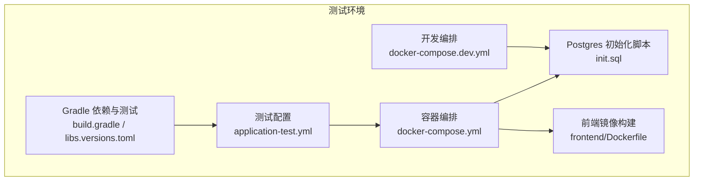
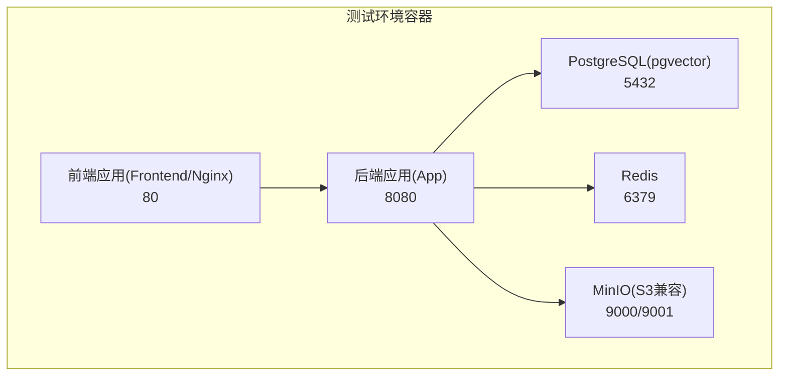
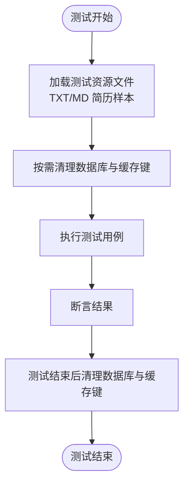
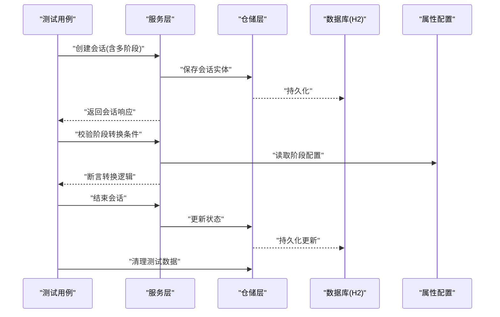
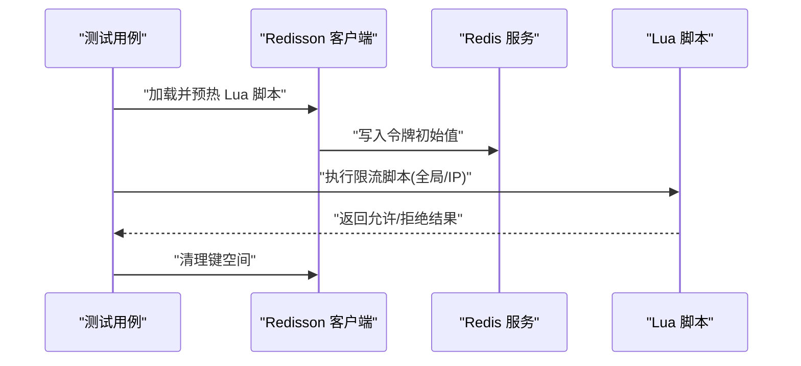
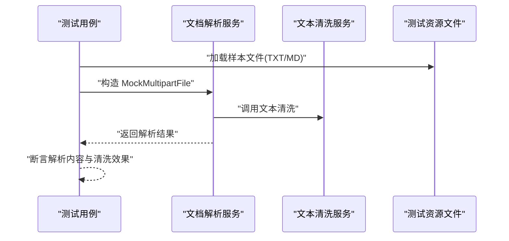
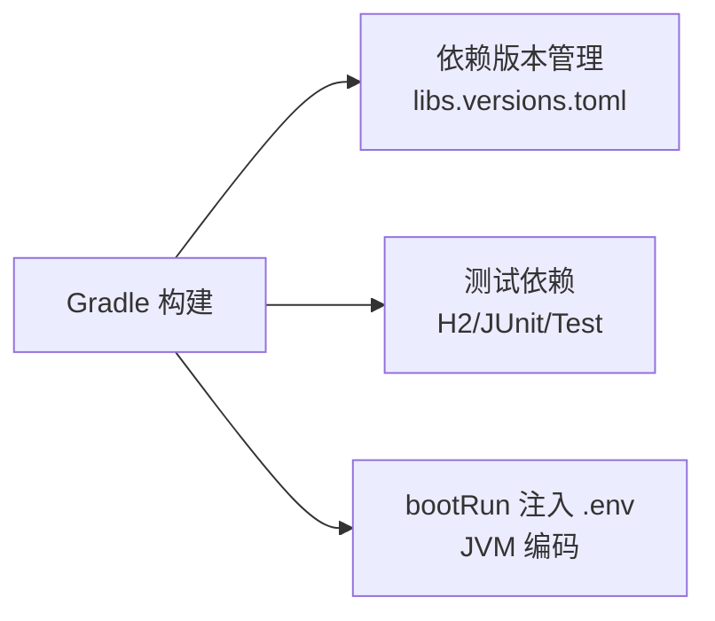

# 测试环境管理

<cite>
**本文引用的文件**   
- [application-test.yml](file://app/src/test/resources/application-test.yml)
- [docker-compose.yml](file://docker-compose.yml)
- [docker-compose.dev.yml](file://docker-compose.dev.yml)
- [init.sql](file://docker/postgres/init.sql)
- [build.gradle](file://app/build.gradle)
- [RateLimitIntegrationTest.java](file://app/src/test/java/interview/guide/common/aspect/RateLimitIntegrationTest.java)
- [VoiceInterviewIntegrationTest.java](file://app/src/test/java/interview/guide/modules/voiceinterview/integration/VoiceInterviewIntegrationTest.java)
- [DocumentParseIntegrationTest.java](file://app/src/test/java/interview/guide/infrastructure/file/DocumentParseIntegrationTest.java)
- [sample-resume.txt](file://app/src/test/resources/test-files/sample-resume.txt)
- [sample-resume.md](file://app/src/test/resources/test-files/sample-resume.md)
- [Dockerfile（前端）](file://frontend/Dockerfile)
- [libs.versions.toml](file://gradle/libs.versions.toml)
</cite>

## 目录
1. [引言](#引言)
2. [项目结构](#项目结构)
3. [核心组件](#核心组件)
4. [架构总览](#架构总览)
5. [详细组件分析](#详细组件分析)
6. [依赖分析](#依赖分析)
7. [性能考虑](#性能考虑)
8. [故障排查指南](#故障排查指南)
9. [结论](#结论)
10. [附录](#附录)

## 引言
本文件面向面试指南平台的测试环境管理，系统阐述测试环境的架构设计与实施策略，覆盖开发测试环境、集成测试环境、生产预发布环境的配置与用途；深入说明基于 Docker 的容器化测试环境搭建（compose 配置、服务依赖与网络）、数据库测试实践（H2 内存库与 Postgres 初始化脚本）、测试数据管理（生成、清理、隔离）以及测试环境的监控与维护、安全管理与最佳实践。

## 项目结构
测试环境相关的关键位置与职责如下：
- 测试配置文件：位于后端测试资源目录，用于定义测试 profile 的数据源、JPA 行为、Redisson、AI 与对象存储等配置。
- 容器编排：使用 docker-compose 管理数据库、缓存、对象存储与后端/前端应用服务，支持开发与集成场景。
- 前端镜像：使用多阶段 Dockerfile 构建静态站点并通过 Nginx 托管。
- Gradle 构建：定义测试依赖、JVM 编码与 bootRun 注入 .env 环境变量的能力。
- 测试用例：覆盖限流、语音面试、文档解析等模块的集成测试，体现测试数据与生命周期管理。

**图表来源**
- [application-test.yml:1-165](file://app/src/test/resources/application-test.yml#L1-L165)
- [docker-compose.yml:1-197](file://docker-compose.yml#L1-L197)
- [docker-compose.dev.yml:1-64](file://docker-compose.dev.yml#L1-L64)
- [init.sql:1-2](file://docker/postgres/init.sql#L1-L2)
- [Dockerfile（前端）:1-44](file://frontend/Dockerfile#L1-L44)
- [build.gradle:1-136](file://app/build.gradle#L1-L136)
- [libs.versions.toml:1-30](file://gradle/libs.versions.toml#L1-L30)

**章节来源**
- [application-test.yml:1-165](file://app/src/test/resources/application-test.yml#L1-L165)
- [docker-compose.yml:1-197](file://docker-compose.yml#L1-L197)
- [docker-compose.dev.yml:1-64](file://docker-compose.dev.yml#L1-L64)
- [init.sql:1-2](file://docker/postgres/init.sql#L1-L2)
- [Dockerfile（前端）:1-44](file://frontend/Dockerfile#L1-L44)
- [build.gradle:1-136](file://app/build.gradle#L1-L136)
- [libs.versions.toml:1-30](file://gradle/libs.versions.toml#L1-L30)

## 核心组件
- 测试配置与数据源
  - 使用内存数据库与 H2，启用自动建表/删表，关闭 SQL 输出，设置方言与格式化，确保测试快速、隔离且可重复。
  - 配置 Redisson 连接地址，便于限流等基于 Redis 的功能测试。
  - 配置 AI 提供商（DashScope/OpenAI 兼容模式）与模型参数、重试策略、向量存储参数等。
  - 配置对象存储（MinIO/S3 兼容）端点、凭证、桶名与区域，满足简历上传与知识库文件存储的测试需求。
  - CORS 允许本地前端域名，语音面试相关参数、音频编解码参数、速率限制等。
- 容器化基础设施
  - PostgreSQL（带 pgvector 扩展）：持久化卷、初始化脚本、健康检查、对外暴露端口。
  - Redis：持久化卷、健康检查。
  - MinIO：对象存储服务与控制台、健康检查、对外暴露 API 与控制台端口。
  - 初始化容器（MinIO）：使用 mc 客户端自动创建桶并设置匿名读权限。
  - 后端应用：按依赖顺序启动（先基础设施，再应用），注入环境变量（数据库、Redis、存储、AI）。
  - 前端应用：基于 Nginx 托管静态资源，反向代理 API。
- 前端镜像构建
  - 多阶段构建：Node 构建 + Nginx 运行，复制构建产物与 Nginx 配置，暴露 80 端口。
- Gradle 测试与依赖
  - 测试依赖：Spring Boot Starter Test、JUnit 5、H2（测试运行时）。
  - bootRun 注入 .env 环境变量，统一 JVM 编码，便于本地调试与测试。
  - 版本管理：集中定义 Spring Boot、Spring AI、Redisson、Tika、iText 等依赖版本。

**章节来源**
- [application-test.yml:1-165](file://app/src/test/resources/application-test.yml#L1-L165)
- [docker-compose.yml:1-197](file://docker-compose.yml#L1-L197)
- [docker-compose.dev.yml:1-64](file://docker-compose.dev.yml#L1-L64)
- [init.sql:1-2](file://docker/postgres/init.sql#L1-L2)
- [Dockerfile（前端）:1-44](file://frontend/Dockerfile#L1-L44)
- [build.gradle:1-136](file://app/build.gradle#L1-L136)
- [libs.versions.toml:1-30](file://gradle/libs.versions.toml#L1-L30)

## 架构总览
下图展示测试环境的容器化架构与服务交互关系，强调后端对数据库、缓存与对象存储的依赖，以及前端与后端的协作。

**图表来源**
- [docker-compose.yml:13-171](file://docker-compose.yml#L13-L171)

## 详细组件分析

### 测试配置与数据源（application-test.yml）
- 数据源与 JPA
  - 内存数据库（H2）：jdbc:h2:mem:testdb，DB_CLOSE_DELAY=-1；Hibernate DDL 策略为创建/删除，SQL 输出关闭，方言与格式化开启，确保测试隔离与可重复。
- Redisson
  - 通过 YAML 嵌套配置单节点地址与数据库索引，便于限流 Lua 脚本与键空间清理。
- AI 与向量存储
  - OpenAI 兼容模式（DashScope），设置基础 URL、API Key、模型与温度；向量存储使用 pgvector，配置索引类型、距离度量、维度等。
- 应用与存储
  - MinIO/S3 兼容端点、凭证、桶名、区域；CORS 允许本地前端域名；语音面试参数、音频编解码参数、速率限制等。
- 面试与简历
  - 面试跟进次数、评估批大小；简历上传目录与允许类型。

**章节来源**
- [application-test.yml:1-165](file://app/src/test/resources/application-test.yml#L1-L165)

### 容器编排（docker-compose.yml）
- PostgreSQL
  - 使用 pgvector 镜像，设置用户、密码、数据库名；挂载数据卷与初始化脚本；健康检查使用 pg_isready；对外暴露 5432。
- Redis
  - 单节点镜像，挂载数据卷；健康检查 ping；对外暴露 6379。
- MinIO
  - 服务端命令设置控制台端口；环境变量设置管理员账号；健康检查 live 接口；对外暴露 9000/9001。
- 初始化容器（MinIO）
  - 通过 mc alias、mb、anonymous 命令自动创建桶并设为公共读。
- 后端应用
  - 依赖健康检查顺序：先基础设施，再初始化任务；注入数据库、Redis、存储、AI 等环境变量；对外暴露 8080。
- 前端应用
  - 依赖后端；对外暴露 80。

**章节来源**
- [docker-compose.yml:1-197](file://docker-compose.yml#L1-L197)

### 开发编排（docker-compose.dev.yml）
- PostgreSQL 与 Redis：与生产编排类似，但使用本地卷与默认凭据。
- RustFS（可选对象存储替代）：提供本地文件系统对象存储服务，支持控制台与访问密钥配置；健康检查基于 TCP 端口探测。
- 首次启动后，可在浏览器访问控制台并手动创建桶。

**章节来源**
- [docker-compose.dev.yml:1-64](file://docker-compose.dev.yml#L1-L64)

### Postgres 初始化脚本（init.sql）
- 初始化向量扩展（vector），为 pgvector 能力提供支撑。

**章节来源**
- [init.sql:1-2](file://docker/postgres/init.sql#L1-L2)

### 前端镜像构建（Dockerfile）
- 多阶段构建：Node 构建产物 + Nginx 运行时；复制构建产物与 Nginx 配置；暴露 80 端口；前台运行 Nginx。

**章节来源**
- [Dockerfile（前端）:1-44](file://frontend/Dockerfile#L1-L44)

### Gradle 测试与依赖（build.gradle 与 libs.versions.toml）
- 依赖
  - 测试运行时 H2；测试依赖 Spring Boot Starter Test、JUnit 5。
  - 版本集中管理：Spring Boot、Spring AI、Redisson、Tika、iText、Lombok、MapStruct、SpringDoc 等。
- bootRun
  - 注入 .env 环境变量，设置 JVM 编码，便于本地调试与测试。

**章节来源**
- [build.gradle:1-136](file://app/build.gradle#L1-L136)
- [libs.versions.toml:1-30](file://gradle/libs.versions.toml#L1-L30)

### 测试数据与生命周期管理
- 测试数据生成
  - 文档解析测试使用测试资源文件（TXT/MD 简历样本），覆盖中英混合、多语言、特殊字符、噪声内容等场景。
- 数据库与缓存清理
  - 集成测试在 @BeforeEach/@AfterEach 中清理数据库与缓存键前缀，确保测试隔离。
- 数据隔离
  - 测试 profile 使用内存数据库与独立 Redis 数据库，避免与开发/生产数据冲突。

**图表来源**
- [DocumentParseIntegrationTest.java:1-404](file://app/src/test/java/interview/guide/infrastructure/file/DocumentParseIntegrationTest.java#L1-L404)
- [RateLimitIntegrationTest.java:1-159](file://app/src/test/java/interview/guide/common/aspect/RateLimitIntegrationTest.java#L1-L159)
- [VoiceInterviewIntegrationTest.java:1-321](file://app/src/test/java/interview/guide/modules/voiceinterview/integration/VoiceInterviewIntegrationTest.java#L1-L321)
- [sample-resume.txt:1-76](file://app/src/test/resources/test-files/sample-resume.txt#L1-L76)
- [sample-resume.md:1-187](file://app/src/test/resources/test-files/sample-resume.md#L1-L187)

**章节来源**
- [DocumentParseIntegrationTest.java:1-404](file://app/src/test/java/interview/guide/infrastructure/file/DocumentParseIntegrationTest.java#L1-L404)
- [RateLimitIntegrationTest.java:1-159](file://app/src/test/java/interview/guide/common/aspect/RateLimitIntegrationTest.java#L1-L159)
- [VoiceInterviewIntegrationTest.java:1-321](file://app/src/test/java/interview/guide/modules/voiceinterview/integration/VoiceInterviewIntegrationTest.java#L1-L321)
- [sample-resume.txt:1-76](file://app/src/test/resources/test-files/sample-resume.txt#L1-L76)
- [sample-resume.md:1-187](file://app/src/test/resources/test-files/sample-resume.md#L1-L187)

### 关键测试流程（序列图）

#### 语音面试集成测试流程

**图表来源**
- [VoiceInterviewIntegrationTest.java:1-321](file://app/src/test/java/interview/guide/modules/voiceinterview/integration/VoiceInterviewIntegrationTest.java#L1-L321)

#### 限流功能集成测试流程

**图表来源**
- [RateLimitIntegrationTest.java:1-159](file://app/src/test/java/interview/guide/common/aspect/RateLimitIntegrationTest.java#L1-L159)

#### 文档解析服务集成测试流程

**图表来源**
- [DocumentParseIntegrationTest.java:1-404](file://app/src/test/java/interview/guide/infrastructure/file/DocumentParseIntegrationTest.java#L1-L404)

## 依赖分析
- 测试依赖
  - H2（测试运行时）：用于内存数据库测试。
  - Spring Boot Starter Test、JUnit 5：测试框架。
- 版本管理
  - Spring Boot、Spring AI、Redisson、Tika、iText、Lombok、MapStruct、SpringDoc 等版本集中定义，确保依赖一致性。
- 构建与运行
  - Gradle 在 bootRun 阶段注入 .env 环境变量，统一 JVM 编码，便于本地与 CI 一致。

**图表来源**
- [build.gradle:1-136](file://app/build.gradle#L1-L136)
- [libs.versions.toml:1-30](file://gradle/libs.versions.toml#L1-L30)

**章节来源**
- [build.gradle:1-136](file://app/build.gradle#L1-L136)
- [libs.versions.toml:1-30](file://gradle/libs.versions.toml#L1-L30)

## 性能考虑
- 测试数据库与缓存
  - 使用内存数据库与独立 Redis 数据库，避免磁盘 IO 与跨进程竞争，提升测试执行速度。
- 健康检查与启动顺序
  - compose 中按健康检查与完成条件排序依赖，确保后端在基础设施就绪后再启动，减少失败重试。
- 构建与部署
  - 前端多阶段构建减少镜像体积；Nginx 托管静态资源，降低后端压力。
- 日志与可观测性
  - 建议在测试环境中输出结构化日志，结合容器日志聚合与指标采集，定位性能瓶颈。

## 故障排查指南
- 容器健康与连通性
  - 数据库/缓存/对象存储健康检查失败：检查容器日志、端口占用与网络策略；确认初始化脚本与环境变量。
- 后端启动失败
  - 检查数据库连接参数、Redis 地址、存储端点与凭证；确认依赖服务已健康。
- 测试失败
  - 限流测试：确认 Redis 服务可达、Lua 脚本已预热、键空间清理；核对令牌初始值与维度键。
  - 语音面试测试：确认数据库清理与阶段配置；核对会话状态与阶段转换逻辑。
  - 文档解析测试：确认测试资源文件存在、文本清洗规则与期望断言。
- 日志与诊断
  - 查看容器日志；在本地/CI 环境中复现最小化步骤；必要时开启更详细的日志级别。

**章节来源**
- [docker-compose.yml:1-197](file://docker-compose.yml#L1-L197)
- [RateLimitIntegrationTest.java:1-159](file://app/src/test/java/interview/guide/common/aspect/RateLimitIntegrationTest.java#L1-L159)
- [VoiceInterviewIntegrationTest.java:1-321](file://app/src/test/java/interview/guide/modules/voiceinterview/integration/VoiceInterviewIntegrationTest.java#L1-L321)
- [DocumentParseIntegrationTest.java:1-404](file://app/src/test/java/interview/guide/infrastructure/file/DocumentParseIntegrationTest.java#L1-L404)

## 结论
本测试环境以“隔离、可控、可重复”为核心目标，通过内存数据库与独立缓存、容器化基础设施与健康检查、集中化的测试配置与依赖管理，形成从开发到集成的完整测试闭环。配合严格的测试数据生命周期管理与可观测性实践，能够稳定支撑平台的功能演进与质量保障。

## 附录

### 环境配置示例与建议
- 开发环境配置
  - 使用 docker-compose.dev.yml 启动 PostgreSQL、Redis 与 RustFS；通过 .env 注入 AI 与应用参数；前端通过 Nginx 暴露 80 端口。
- 测试环境配置
  - 使用 application-test.yml 指定内存数据库、Redisson 地址、MinIO 端点与桶名；Gradle bootRun 注入 .env。
- CI/CD 环境配置
  - 在流水线中使用 docker-compose.yml 启动基础设施与应用；将 .env 注入到构建与测试阶段；使用 H2 与独立 Redis 进行单元/集成测试。

### 监控与维护
- 日志收集
  - 使用容器日志驱动（如 Docker/Compose 默认日志），在 CI 中归档测试报告与日志。
- 性能监控
  - 在后端应用中集成指标采集（如 Micrometer），在 CI 中记录测试耗时与失败率。
- 故障排查
  - 以最小化步骤复现问题；核对依赖服务健康状态与环境变量；检查测试数据清理是否彻底。

### 安全管理
- 敏感数据处理
  - 测试配置中使用占位 API Key；在 CI 中通过受控密钥注入；避免将真实凭证提交到仓库。
- 访问控制
  - 对象存储桶设置为公共读仅限测试场景；生产环境严格私有化。
- 安全审计
  - 记录测试环境变更与访问日志；定期轮换测试密钥与凭据。

### 最佳实践
- 环境一致性
  - 使用 compose 与版本化依赖，确保本地与 CI 环境一致。
- 资源管理
  - 使用命名卷持久化关键数据；合理设置健康检查与重启策略。
- 成本优化
  - 在测试环境使用轻量级镜像与最小化服务；按需启停基础设施；清理无用镜像与卷。