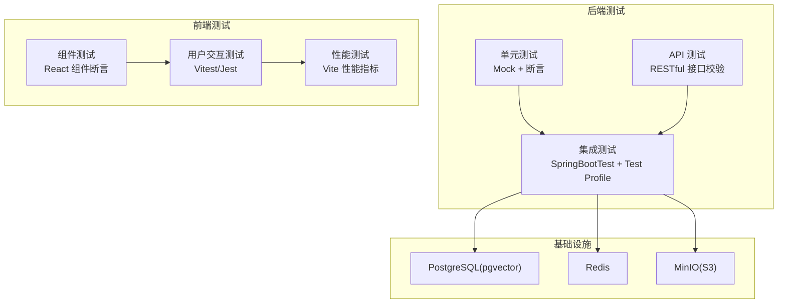
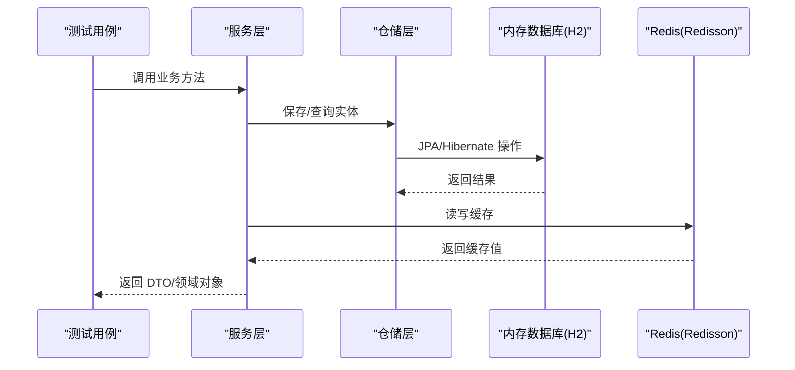
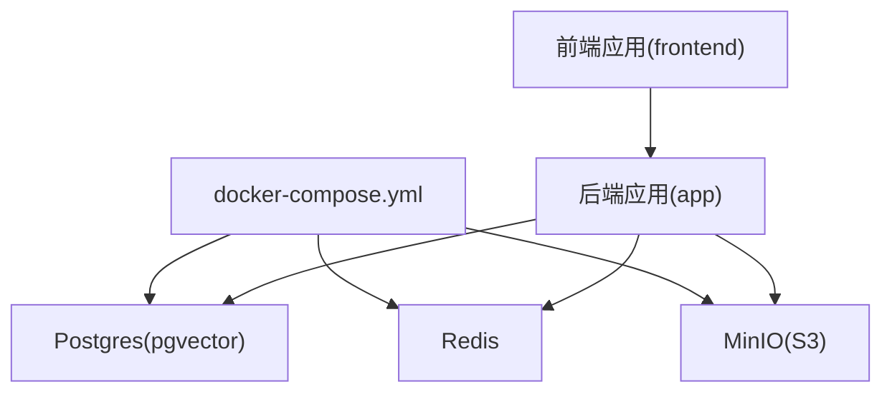
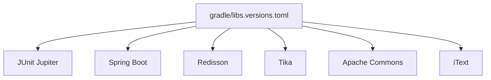

# 测试策略

<cite>
**本文引用的文件**
- [AppTest.java](file://app/src/test/java/interview/guide/AppTest.java)
- [application-test.yml](file://app/src/test/resources/application-test.yml)
- [LlmProviderRegistryTest.java](file://app/src/test/java/interview/guide/common/ai/LlmProviderRegistryTest.java)
- [VoiceInterviewServiceTest.java](file://app/src/test/java/interview/guide/modules/voiceinterview/service/VoiceInterviewServiceTest.java)
- [KnowledgeBaseVectorServiceTest.java](file://app/src/test/java/interview/guide/modules/knowledgebase/service/KnowledgeBaseVectorServiceTest.java)
- [VoiceInterviewIntegrationTest.java](file://app/src/test/java/interview/guide/modules/voiceinterview/integration/VoiceInterviewIntegrationTest.java)
- [DocumentParseIntegrationTest.java](file://app/src/test/java/interview/guide/infrastructure/file/DocumentParseIntegrationTest.java)
- [RateLimitIntegrationTest.java](file://app/src/test/java/interview/guide/common/aspect/RateLimitIntegrationTest.java)
- [app/build.gradle](file://app/build.gradle)
- [gradle/libs.versions.toml](file://gradle/libs.versions.toml)
- [docker-compose.yml](file://docker-compose.yml)
- [vite.config.ts](file://frontend/vite.config.ts)
- [tsconfig.json](file://frontend/tsconfig.json)
</cite>

## 目录
1. [简介](#简介)
2. [项目结构](#项目结构)
3. [核心组件](#核心组件)
4. [架构总览](#架构总览)
5. [详细组件分析](#详细组件分析)
6. [依赖分析](#依赖分析)
7. [性能考虑](#性能考虑)
8. [故障排查指南](#故障排查指南)
9. [结论](#结论)
10. [附录](#附录)

## 简介
本测试策略文档面向“面试指南平台”，旨在建立覆盖单元测试、集成测试、API测试与前端测试的完整质量保障体系。文档结合现有测试实现，给出测试框架选型、Mock策略、断言规范、数据库与外部服务测试、端到端测试、测试数据管理、持续集成实践、测试环境搭建与最佳实践，并提供常见问题的解决方案。

## 项目结构
后端采用 Spring Boot 4 + Gradle 构建，测试集中在 app/src/test 下；前端采用 Vite + React，测试配置位于 frontend 目录。测试配置文件 application-test.yml 提供内存数据库、缓存与 AI 服务的测试占位配置；docker-compose.yml 提供 Postgres、Redis、MinIO 等基础设施服务，支撑集成测试与端到端测试。



图示来源
- [docker-compose.yml:1-199](file://docker-compose.yml#L1-L199)
- [application-test.yml:1-165](file://app/src/test/resources/application-test.yml#L1-L165)

章节来源
- [docker-compose.yml:1-199](file://docker-compose.yml#L1-L199)
- [application-test.yml:1-165](file://app/src/test/resources/application-test.yml#L1-L165)

## 核心组件
- 测试框架与运行
  - 后端：JUnit 5 + Spring Boot Test，Gradle tasks 使用 JUnit Platform 运行测试。
  - 前端：Vite 配置包含 React 插件与 WASM 支持，tsconfig 严格模式开启。
- Mock 与断言
  - 单元测试广泛使用 Mockito 注解驱动的 Mock 与断言，结合 @Nested 组织复杂场景。
- 测试配置
  - application-test.yml 使用内存数据库与测试占位配置，确保测试隔离与可重复性。
- 基础设施
  - docker-compose 提供 Postgres、Redis、MinIO，支持集成测试与端到端测试。

章节来源
- [app/build.gradle:83-102](file://app/build.gradle#L83-L102)
- [gradle/libs.versions.toml:1-30](file://gradle/libs.versions.toml#L1-L30)
- [vite.config.ts:1-42](file://frontend/vite.config.ts#L1-L42)
- [tsconfig.json:1-22](file://frontend/tsconfig.json#L1-L22)

## 架构总览
测试架构围绕“隔离的内存数据库 + 外部服务占位 + Mock”展开，通过 Profile 与容器编排实现环境一致性与可复现性。

```mermaid
graph TB
A["Gradle 任务"] --> B["JUnit 5 平台"]
B --> C["Spring Boot Test<br/>@SpringBootTest(@ActiveProfiles(\"test\"))"]
C --> D["内存数据库(H2)<br/>JPA/Hibernate"]
C --> E["Redis(Redisson)<br/>缓存/限流脚本"]
C --> F["AI 服务占位配置<br/>DashScope 兼容模式"]
C --> G["MinIO(S3) 占位<br/>对象存储"]
```

图示来源
- [application-test.yml:4-90](file://app/src/test/resources/application-test.yml#L4-L90)
- [docker-compose.yml:13-171](file://docker-compose.yml#L13-L171)

## 详细组件分析

### 单元测试策略
- 测试框架与注解
  - 使用 JUnit 5 + Mockito 扩展，@ExtendWith(MockitoExtension.class)、@InjectMocks、@Mock。
  - 使用 @Nested 组织复杂业务场景，提升可读性与维护性。
- Mock 策略
  - 对 Repository、Client、Properties、Redisson 等进行 Mock，隔离外部依赖。
  - 使用 lenient() 处理可选依赖，避免过度 stubbing。
- 断言规范
  - 使用 assertNotNull/assertEquals/assertThrows/assertDoesNotThrow 等基础断言。
  - 使用 verify(times/never) 验证交互次数与调用链。
  - 使用 ArgumentCaptor 捕获参数并断言关键字段。
- 示例覆盖
  - LLM Provider Registry：验证 ChatClient 获取、缓存与未知提供方异常。
  - 语音面试服务：会话生命周期、阶段转换、消息持久化、Redis 缓存、边界条件。
  - 知识库向量服务：向量化存储分批、metadata 设置、相似度搜索过滤、删除静默处理。

**更新** 语音面试测试文件已大幅简化，移除了对 Dashscope LLM、Qwen ASR、Qwen TTS 等外部语音服务的直接测试，专注于核心业务逻辑与配置验证。

章节来源
- [LlmProviderRegistryTest.java:1-121](file://app/src/test/java/interview/guide/common/ai/LlmProviderRegistryTest.java#L1-L121)
- [VoiceInterviewServiceTest.java:1-858](file://app/src/test/java/interview/guide/modules/voiceinterview/service/VoiceInterviewServiceTest.java#L1-L858)
- [KnowledgeBaseVectorServiceTest.java:1-593](file://app/src/test/java/interview/guide/modules/knowledgebase/service/KnowledgeBaseVectorServiceTest.java#L1-L593)

### 集成测试策略
- 测试目标
  - 验证真实配置、数据库持久化、服务组合与端到端流程。
- 关键测试
  - 语音面试集成测试：完整流程、阶段转换、持久化、配置校验、错误处理。
  - 文档解析集成测试：多格式解析、文本清理、多语言、大文件性能、边界条件。
  - 限流集成测试：Redis Lua 脚本、多规则、独立维度计数（需 Redis）。
- 配置与隔离
  - @ActiveProfiles("test") + application-test.yml 内存数据库与缓存配置。
  - @BeforeEach/@AfterEach 清理数据库，确保测试隔离。



图示来源
- [VoiceInterviewIntegrationTest.java:1-321](file://app/src/test/java/interview/guide/modules/voiceinterview/integration/VoiceInterviewIntegrationTest.java#L1-L321)
- [DocumentParseIntegrationTest.java:1-404](file://app/src/test/java/interview/guide/infrastructure/file/DocumentParseIntegrationTest.java#L1-L404)

章节来源
- [VoiceInterviewIntegrationTest.java:1-321](file://app/src/test/java/interview/guide/modules/voiceinterview/integration/VoiceInterviewIntegrationTest.java#L1-L321)
- [DocumentParseIntegrationTest.java:1-404](file://app/src/test/java/interview/guide/infrastructure/file/DocumentParseIntegrationTest.java#L1-L404)
- [RateLimitIntegrationTest.java:1-159](file://app/src/test/java/interview/guide/common/aspect/RateLimitIntegrationTest.java#L1-L159)

### API 测试策略
- 测试范围
  - 基于 Spring MVC 的 RESTful API，覆盖请求参数、响应格式、状态码与异常处理。
- 实施要点
  - 使用 @SpringBootTest + @ActiveProfiles("test") 启动完整上下文。
  - 通过仓储层断言数据库写入与更新，验证持久化一致性。
  - 对配置类进行断言，确保参数边界与默认值合理。
- 示例场景
  - 语音面试：创建会话、阶段转换条件、结束会话、多阶段初始化、错误处理、配置校验。

章节来源
- [VoiceInterviewIntegrationTest.java:54-196](file://app/src/test/java/interview/guide/modules/voiceinterview/integration/VoiceInterviewIntegrationTest.java#L54-L196)

### 前端测试策略
- 测试配置
  - Vite 配置包含 React、WASM、顶层 await 插件；tsconfig 严格模式开启。
  - 代理将 /api 转发至后端 8080 端口，便于端到端联调。
- 测试层次
  - 组件测试：对 React 组件进行渲染、交互与状态断言。
  - 用户交互测试：模拟用户点击、输入、路由跳转等行为。
  - 性能测试：关注包体积拆分、懒加载与首屏性能指标。
- 建议
  - 使用 Vitest/Jest 进行单元与集成测试；使用 Playwright/Cypress 进行端到端测试。
  - 通过 Vite 代理与后端测试配合，验证 API 交互与数据流。

章节来源
- [vite.config.ts:1-42](file://frontend/vite.config.ts#L1-L42)
- [tsconfig.json:1-22](file://frontend/tsconfig.json#L1-L22)

### 测试数据管理
- 测试数据准备
  - application-test.yml 使用内存数据库与测试占位配置，确保测试隔离。
  - 集成测试使用 @BeforeEach 清理数据库，避免跨用例污染。
- 数据清理
  - @AfterEach 删除全部会话，确保后续用例从干净状态开始。
- 测试隔离
  - Profile 隔离 + 容器编排，避免与开发/生产环境冲突。
  - Redis Lua 脚本测试需单独启动 Redis，集成测试中通过 @Disabled 标记。

章节来源
- [application-test.yml:1-165](file://app/src/test/resources/application-test.yml#L1-L165)
- [VoiceInterviewIntegrationTest.java:44-48](file://app/src/test/java/interview/guide/modules/voiceinterview/integration/VoiceInterviewIntegrationTest.java#L44-L48)

### 持续集成中的测试实践
- 自动化测试
  - Gradle 任务使用 JUnit Platform 运行测试，确保 CI 环境一致。
- 覆盖率与报告
  - 建议引入 Jacoco/SpotBugs/Checkstyle 等插件，结合 CI 平台生成覆盖率与静态分析报告。
- 质量度量
  - 单元测试：高 Mock 覆盖关键分支与边界条件。
  - 集成测试：验证配置、持久化与服务组合。
  - 前端测试：组件覆盖率、交互覆盖率与性能阈值。

章节来源
- [app/build.gradle:100-102](file://app/build.gradle#L100-L102)
- [gradle/libs.versions.toml:1-30](file://gradle/libs.versions.toml#L1-L30)

### 测试环境搭建与管理
- 基础设施
  - docker-compose 提供 Postgres(pgvector)、Redis、MinIO，支持健康检查与数据持久化。
- 环境变量
  - 通过环境变量注入数据库、缓存与 AI 服务配置，便于本地与 CI 复现。
- 服务依赖
  - 后端容器依赖数据库、缓存与对象存储健康，MinIO 初始化容器负责桶创建与权限设置。



图示来源
- [docker-compose.yml:1-199](file://docker-compose.yml#L1-L199)

章节来源
- [docker-compose.yml:1-199](file://docker-compose.yml#L1-L199)

## 依赖分析
- 测试依赖
  - JUnit Jupiter、Mockito、Spring Boot Test、H2 内存数据库。
- 外部服务
  - Redisson、DashScope 兼容模式、MinIO(S3)、Postgres(pgvector)。
- 版本管理
  - 通过 libs.versions.toml 统一管理依赖版本，确保前后端与测试依赖一致性。



图示来源
- [gradle/libs.versions.toml:1-30](file://gradle/libs.versions.toml#L1-L30)

章节来源
- [gradle/libs.versions.toml:1-30](file://gradle/libs.versions.toml#L1-L30)
- [app/build.gradle:23-87](file://app/build.gradle#L23-L87)

## 性能考虑
- 单元测试
  - 使用 Mock 减少 IO 与网络开销，优先断言关键分支与边界条件。
- 集成测试
  - 使用内存数据库与占位服务，避免真实外部依赖带来的性能波动。
- 前端测试
  - 通过 Vite 的包拆分与懒加载优化首屏性能，结合测试验证关键交互路径。

## 故障排查指南
- 限流集成测试失败
  - 现状：测试类被 @Disabled，需 Redis 服务运行。
  - 建议：启动 Redis 容器或本地实例，取消 @Disabled 后运行。
- Redis Lua 脚本异常
  - 现状：需预加载脚本 SHA，确保键空间清理与脚本一致性。
  - 建议：在 setUp 中加载脚本，在 tearDown 中清理键空间。
- 文档解析异常
  - 现状：多语言与特殊字符场景较多，需关注 Tika 处理差异。
  - 建议：增加日志输出与断言点，定位具体段落与标签。
- 前端代理与跨域
  - 现状：Vite 代理指向后端 8080，需确保后端已启动。
  - 建议：检查 vite.config.ts 代理配置与后端端口一致性。

章节来源
- [RateLimitIntegrationTest.java:36-37](file://app/src/test/java/interview/guide/common/aspect/RateLimitIntegrationTest.java#L36-L37)
- [DocumentParseIntegrationTest.java:1-404](file://app/src/test/java/interview/guide/infrastructure/file/DocumentParseIntegrationTest.java#L1-L404)
- [vite.config.ts:27-32](file://frontend/vite.config.ts#L27-L32)

## 结论
本测试策略以“单元测试为基础、集成测试为骨干、API 与前端测试为补充”的金字塔结构，结合内存数据库、占位服务与容器编排，形成可重复、可扩展的质量保障体系。随着语音面试测试的现代化重构，测试重点更加聚焦于核心业务逻辑与配置验证，同时保持了对关键外部服务的兼容性测试。建议在 CI 中引入覆盖率与静态分析工具，持续优化测试矩阵与测试数据管理，确保平台稳定性与交付质量。

## 附录
- 快速参考
  - 单元测试：Mock + 断言 + @Nested 组织场景。
  - 集成测试：@SpringBootTest + @ActiveProfiles("test") + application-test.yml。
  - 基础设施：docker-compose 提供 Postgres、Redis、MinIO。
  - 前端：Vite + React + 代理 /api 至后端 8080。