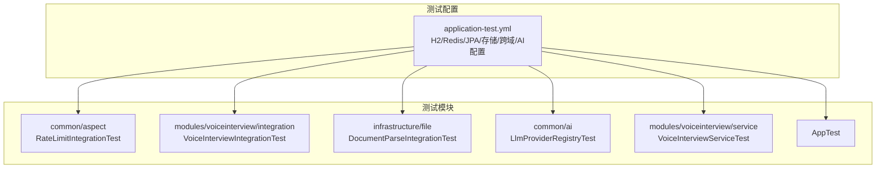
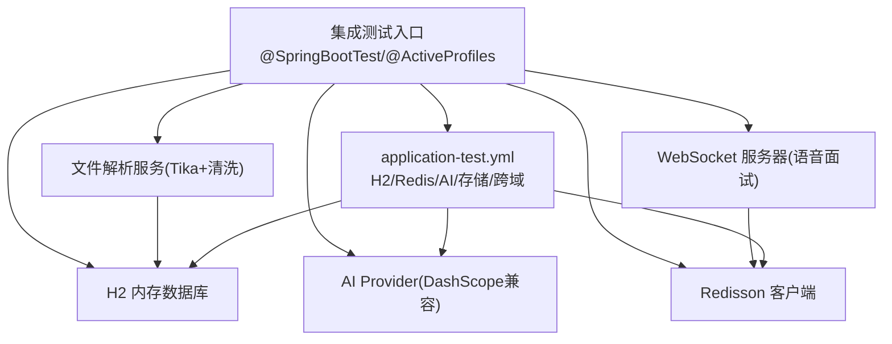
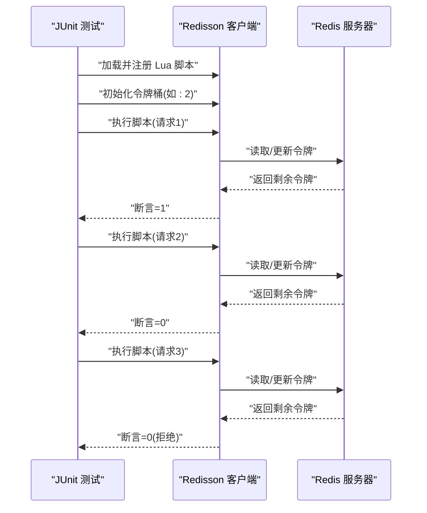
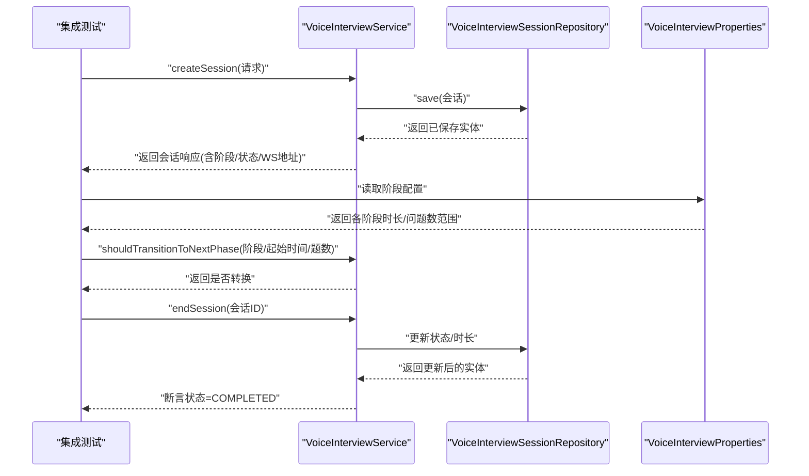
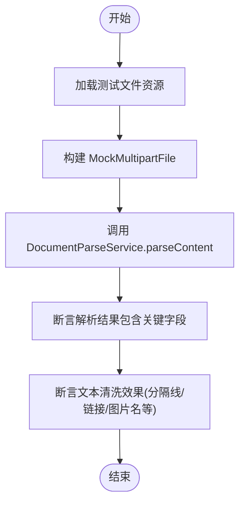
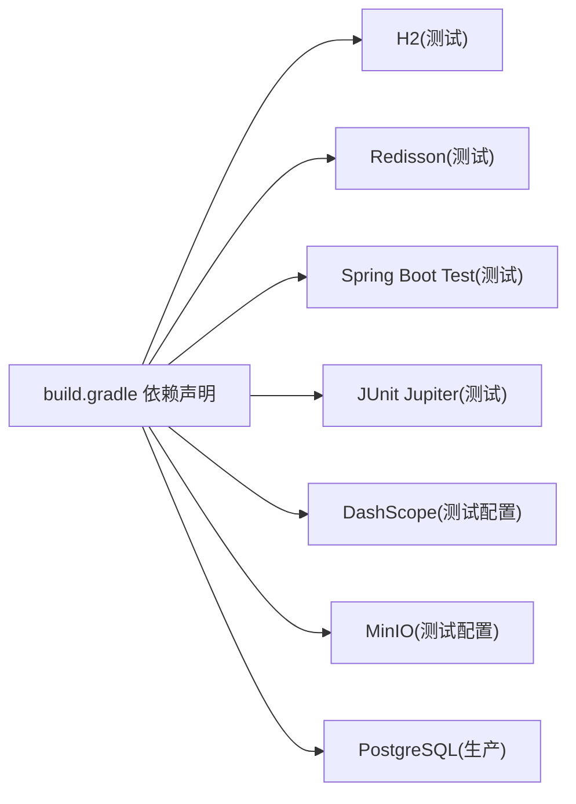

# 集成测试

<cite>
**本文引用的文件**
- [application-test.yml](file://app/src/test/resources/application-test.yml)
- [RateLimitIntegrationTest.java](file://app/src/test/java/interview/guide/common/aspect/RateLimitIntegrationTest.java)
- [VoiceInterviewIntegrationTest.java](file://app/src/test/java/interview/guide/modules/voiceinterview/integration/VoiceInterviewIntegrationTest.java)
- [DocumentParseIntegrationTest.java](file://app/src/test/java/interview/guide/infrastructure/file/DocumentParseIntegrationTest.java)
- [AppTest.java](file://app/src/test/java/interview/guide/AppTest.java)
- [LlmProviderRegistryTest.java](file://app/src/test/java/interview/guide/common/ai/LlmProviderRegistryTest.java)
- [VoiceInterviewServiceTest.java](file://app/src/test/java/interview/guide/modules/voiceinterview/service/VoiceInterviewServiceTest.java)
- [build.gradle](file://app/build.gradle)
</cite>

## 目录
1. [引言](#引言)
2. [项目结构](#项目结构)
3. [核心组件](#核心组件)
4. [架构总览](#架构总览)
5. [详细组件分析](#详细组件分析)
6. [依赖分析](#依赖分析)
7. [性能考量](#性能考量)
8. [故障排查指南](#故障排查指南)
9. [结论](#结论)
10. [附录](#附录)

## 引言
本文件面向面试指南平台的集成测试实践，系统阐述集成测试的概念与重要性，涵盖组件间交互、数据库与外部服务集成测试的层次划分；详解基于 Spring Boot Test 的集成测试实现，包括 @SpringBootTest、@ActiveProfiles 等注解的使用；总结数据库集成测试策略（H2 内存数据库、测试数据初始化）与外部服务集成测试方法（Mock 外部 API、使用 WireMock、测试网络连通性）；给出文件上传、AI 模型调用、WebSocket 通信等具体集成测试示例；说明测试环境配置（application-test.yml）、测试隔离与并发测试策略，以确保测试结果的可靠性与稳定性。

## 项目结构
本项目采用 Spring Boot 4 + Gradle 构建，测试位于 app/src/test 下，按模块组织。测试配置集中在 application-test.yml，使用 H2 内存数据库与 Redisson 连接本地 Redis，用于模拟真实运行时环境。

图表来源
- [application-test.yml:1-165](file://app/src/test/resources/application-test.yml#L1-L165)
- [RateLimitIntegrationTest.java:1-159](file://app/src/test/java/interview/guide/common/aspect/RateLimitIntegrationTest.java#L1-L159)
- [VoiceInterviewIntegrationTest.java:1-321](file://app/src/test/java/interview/guide/modules/voiceinterview/integration/VoiceInterviewIntegrationTest.java#L1-L321)
- [DocumentParseIntegrationTest.java:1-404](file://app/src/test/java/interview/guide/infrastructure/file/DocumentParseIntegrationTest.java#L1-L404)
- [LlmProviderRegistryTest.java:1-121](file://app/src/test/java/interview/guide/common/ai/LlmProviderRegistryTest.java#L1-L121)
- [VoiceInterviewServiceTest.java:1-800](file://app/src/test/java/interview/guide/modules/voiceinterview/service/VoiceInterviewServiceTest.java#L1-L800)
- [AppTest.java:1-18](file://app/src/test/java/interview/guide/AppTest.java#L1-L18)

章节来源
- [application-test.yml:1-165](file://app/src/test/resources/application-test.yml#L1-L165)
- [build.gradle:1-136](file://app/build.gradle#L1-L136)

## 核心组件
- 测试配置中心：application-test.yml 提供 H2 内存数据库、Redisson、AI Provider、存储桶、跨域、语音面试配置等，确保测试在隔离环境中运行。
- 限流集成测试：基于 Redisson 与 Lua 脚本，验证令牌桶限流在多规则、多维度下的行为。
- 语音面试集成测试：覆盖会话创建、阶段转换、数据库持久化、配置校验与错误处理。
- 文档解析集成测试：使用真实服务与文件输入，验证多格式简历解析与文本清洗效果。
- AI Provider 注册表测试：验证 ChatClient 获取、缓存与默认 Provider 行为。
- 语音面试服务单元测试：覆盖会话生命周期、消息持久化、Redis 缓存、阶段转换判断等。
- 应用上下文测试：验证主应用上下文加载。

章节来源
- [application-test.yml:1-165](file://app/src/test/resources/application-test.yml#L1-L165)
- [RateLimitIntegrationTest.java:1-159](file://app/src/test/java/interview/guide/common/aspect/RateLimitIntegrationTest.java#L1-L159)
- [VoiceInterviewIntegrationTest.java:1-321](file://app/src/test/java/interview/guide/modules/voiceinterview/integration/VoiceInterviewIntegrationTest.java#L1-L321)
- [DocumentParseIntegrationTest.java:1-404](file://app/src/test/java/interview/guide/infrastructure/file/DocumentParseIntegrationTest.java#L1-L404)
- [LlmProviderRegistryTest.java:1-121](file://app/src/test/java/interview/guide/common/ai/LlmProviderRegistryTest.java#L1-L121)
- [VoiceInterviewServiceTest.java:1-800](file://app/src/test/java/interview/guide/modules/voiceinterview/service/VoiceInterviewServiceTest.java#L1-L800)
- [AppTest.java:1-18](file://app/src/test/java/interview/guide/AppTest.java#L1-L18)

## 架构总览
下图展示测试环境与关键组件的交互：测试通过 @SpringBootTest 启动应用上下文，加载 application-test.yml；数据库层使用 H2 内存库；缓存层使用 Redisson 连接本地 Redis；AI Provider 通过 DashScope 兼容模式访问；文件解析依赖 Apache Tika 与文本清洗服务；WebSocket 由语音面试模块提供。

图表来源
- [application-test.yml:1-165](file://app/src/test/resources/application-test.yml#L1-L165)
- [VoiceInterviewIntegrationTest.java:30-32](file://app/src/test/java/interview/guide/modules/voiceinterview/integration/VoiceInterviewIntegrationTest.java#L30-L32)
- [build.gradle:33-49](file://app/build.gradle#L33-L49)

## 详细组件分析

### 限流功能集成测试（Redis + Lua）
- 测试目标：验证限流脚本在令牌充足与耗尽时的行为；多规则短路；不同维度独立计数。
- 关键点：使用 Redisson 连接本地 Redis，预加载 Lua 脚本，构造多组测试场景，断言返回值。
- 隔离与清理：测试前清空匹配键，结束后关闭客户端并清理键空间。

图表来源
- [RateLimitIntegrationTest.java:65-80](file://app/src/test/java/interview/guide/common/aspect/RateLimitIntegrationTest.java#L65-L80)
- [RateLimitIntegrationTest.java:122-149](file://app/src/test/java/interview/guide/common/aspect/RateLimitIntegrationTest.java#L122-L149)

章节来源
- [RateLimitIntegrationTest.java:1-159](file://app/src/test/java/interview/guide/common/aspect/RateLimitIntegrationTest.java#L1-L159)

### 语音面试集成测试（REST + 数据库 + 配置）
- 测试目标：端到端验证会话创建、阶段转换、数据库持久化、配置校验与错误处理。
- 关键点：@SpringBootTest + @ActiveProfiles("test") 启动测试上下文；使用 @Autowired 注入服务与仓储；断言会话状态、阶段与持久化一致性；验证配置参数范围与完整性。
- 隔离与清理：每个测试前后清理数据库，保证测试互不干扰。

图表来源
- [VoiceInterviewIntegrationTest.java:54-99](file://app/src/test/java/interview/guide/modules/voiceinterview/integration/VoiceInterviewIntegrationTest.java#L54-L99)
- [VoiceInterviewIntegrationTest.java:252-297](file://app/src/test/java/interview/guide/modules/voiceinterview/integration/VoiceInterviewIntegrationTest.java#L252-L297)
- [VoiceInterviewIntegrationTest.java:315-319](file://app/src/test/java/interview/guide/modules/voiceinterview/integration/VoiceInterviewIntegrationTest.java#L315-L319)

章节来源
- [VoiceInterviewIntegrationTest.java:1-321](file://app/src/test/java/interview/guide/modules/voiceinterview/integration/VoiceInterviewIntegrationTest.java#L1-L321)

### 文档解析服务集成测试（文件上传 + Tika + 清洗）
- 测试目标：验证对 TXT、Markdown 等格式简历的解析与清洗效果；多语言混合、大文件、边界条件与噪音文档处理。
- 关键点：使用 MockMultipartFile 构造上传文件；调用 DocumentParseService.parseContent；断言提取的关键信息与清洗结果。
- 隔离与数据：测试资源位于 test-resources/test-files，测试中读取资源文件进行解析。

图表来源
- [DocumentParseIntegrationTest.java:35-80](file://app/src/test/java/interview/guide/infrastructure/file/DocumentParseIntegrationTest.java#L35-L80)
- [DocumentParseIntegrationTest.java:188-253](file://app/src/test/java/interview/guide/infrastructure/file/DocumentParseIntegrationTest.java#L188-L253)

章节来源
- [DocumentParseIntegrationTest.java:1-404](file://app/src/test/java/interview/guide/infrastructure/file/DocumentParseIntegrationTest.java#L1-L404)

### AI Provider 注册表测试（Mock）
- 测试目标：验证根据 ProviderId 获取 ChatClient、默认 Provider 获取、以及缓存行为；未知 Provider 抛出异常。
- 关键点：使用 Mockito 注入 Mock 的 LlmProviderProperties 与 ToolCallingManager/ObservationRegistry；断言 ChatClient 实例一致性与异常路径。

章节来源
- [LlmProviderRegistryTest.java:1-121](file://app/src/test/java/interview/guide/common/ai/LlmProviderRegistryTest.java#L1-L121)

### 语音面试服务单元测试（Mock）
- 测试目标：覆盖会话创建/结束/恢复、阶段转换、消息持久化、Redis 缓存命中/未命中、阶段转换判断等。
- 关键点：@ExtendWith(MockitoExtension) + @InjectMocks；使用 @Mock 注入仓储与属性；使用 @Spy 或 @Captor 验证调用与参数；lenient 设置避免 stubbing 问题。
- 与集成测试差异：该测试为单元测试，使用 Mock 替代真实依赖，验证服务内部逻辑。

章节来源
- [VoiceInterviewServiceTest.java:1-800](file://app/src/test/java/interview/guide/modules/voiceinterview/service/VoiceInterviewServiceTest.java#L1-L800)

### 应用上下文测试
- 测试目标：验证应用主类存在，Spring 上下文可加载。
- 关键点：最基础的测试，确保项目结构与依赖正确。

章节来源
- [AppTest.java:1-18](file://app/src/test/java/interview/guide/AppTest.java#L1-L18)

## 依赖分析
- 测试运行时依赖：H2 内存数据库（测试运行时）、Redisson（测试运行时）、Spring Boot Starter Test（测试框架）、Junit Jupiter（测试引擎）。
- 外部服务依赖：DashScope 兼容模式（AI Provider）、MinIO（对象存储）、PostgreSQL（生产运行时）。
- 语音面试 WebSocket：使用 WebSocket 配置与处理器，测试中通过服务层验证会话与阶段流转。

图表来源
- [build.gradle:33-87](file://app/build.gradle#L33-L87)

章节来源
- [build.gradle:1-136](file://app/build.gradle#L1-L136)

## 性能考量
- 测试数据库选择：H2 内存库具备快速启动与销毁能力，适合集成测试；对于高并发场景，建议结合测试隔离与并发控制策略。
- 缓存与脚本：Redisson Lua 脚本在单次评估中完成原子性判断，减少往返开销；注意脚本 SHA 预加载与键空间清理。
- 文件解析：大文件解析测试关注内存占用与解析时延，建议在 CI 中限制超时与堆大小。
- 并发测试：多个测试并行时，确保数据库与 Redis 键空间隔离，避免共享状态污染。

## 故障排查指南
- Redis 未启动：限流集成测试需本地 Redis 服务，确认容器或进程已启动并监听默认端口。
- H2 Schema 不一致：若出现表结构异常，检查 application-test.yml 中 JPA DDL 策略与实体映射。
- AI Provider 未配置：DashScope 兼容模式 URL 与 API Key 在测试配置中提供，确认未被覆盖或遗漏。
- WebSocket 地址缺失：语音面试集成测试断言响应包含 WebSocket 地址，若失败检查 WebSocket 配置与路由。
- 资源文件缺失：文档解析测试依赖 test-files 下的样本文件，确认资源路径与打包可见性。

章节来源
- [RateLimitIntegrationTest.java:25-35](file://app/src/test/java/interview/guide/common/aspect/RateLimitIntegrationTest.java#L25-L35)
- [application-test.yml:27-62](file://app/src/test/resources/application-test.yml#L27-L62)
- [VoiceInterviewIntegrationTest.java:54-73](file://app/src/test/java/interview/guide/modules/voiceinterview/integration/VoiceInterviewIntegrationTest.java#L54-L73)

## 结论
本项目的集成测试通过 @SpringBootTest 与 application-test.yml 构建了接近生产的测试环境，覆盖数据库、缓存、AI Provider、文件解析与 WebSocket 等关键链路。结合单元测试与集成测试的互补，既能验证组件内部逻辑，也能验证跨组件协作与外部依赖行为。建议持续完善外部服务 Mock 与网络连通性测试，并加强并发与隔离策略，以进一步提升测试稳定性与可维护性。

## 附录

### 测试环境配置要点
- application-test.yml
  - 数据源：H2 内存数据库，DDL 自动建表/删表，SQL 关闭打印。
  - Redisson：连接本地 Redis，单节点配置。
  - AI Provider：DashScope 兼容模式，提供 base-url、api-key、模型与温度等选项。
  - 存储：MinIO 对象存储，bucket、endpoint、access/secret key。
  - 跨域：允许本地前端域名。
  - 语音面试：阶段时长/问题数范围、ASR/TTS WebSocket 地址与参数、速率限制与音频编解码配置。

章节来源
- [application-test.yml:1-165](file://app/src/test/resources/application-test.yml#L1-L165)

### 外部服务集成测试方法
- Mock 外部 API：对依赖外部服务的模块，优先使用 Mock 或 Fake 实现，隔离网络波动。
- 使用 WireMock：在需要真实 HTTP 行为时，通过 WireMock 启动静态响应与动态行为，配合 @AutoConfigureTestDatabase 等注解控制数据库。
- 测试网络连接：针对 WebSocket、HTTP(S)、DNS 解析等，编写连通性测试，确保代理与防火墙策略不影响测试。

### 测试隔离与并发
- 隔离策略：每个测试清理数据库与 Redis 键空间；使用 @Transactional + @Rollback 或删除全部数据的方式，避免状态泄漏。
- 并发控制：在 CI 中限制并发度，或为不同测试套件分配独立的数据库实例与 Redis 数据库编号，确保无冲突。