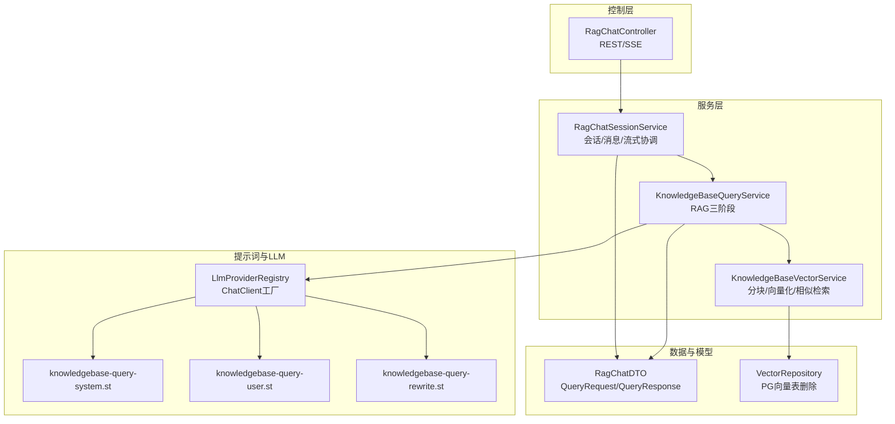
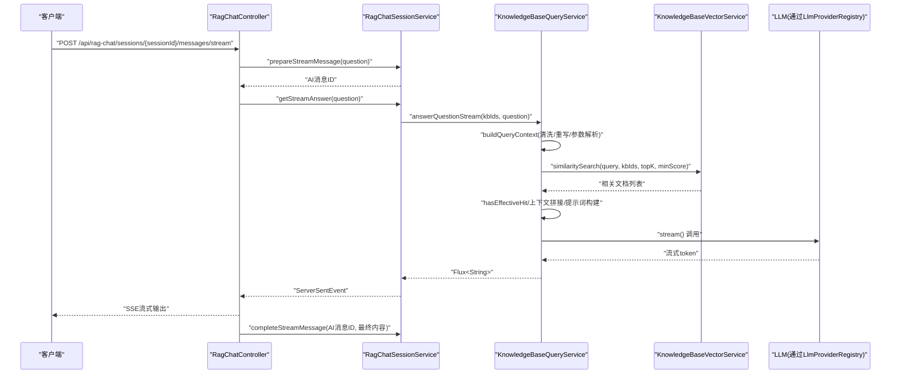
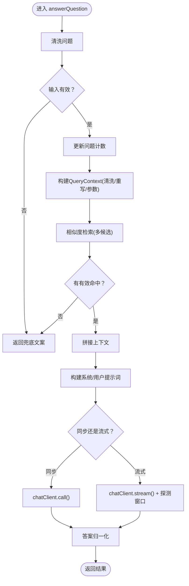
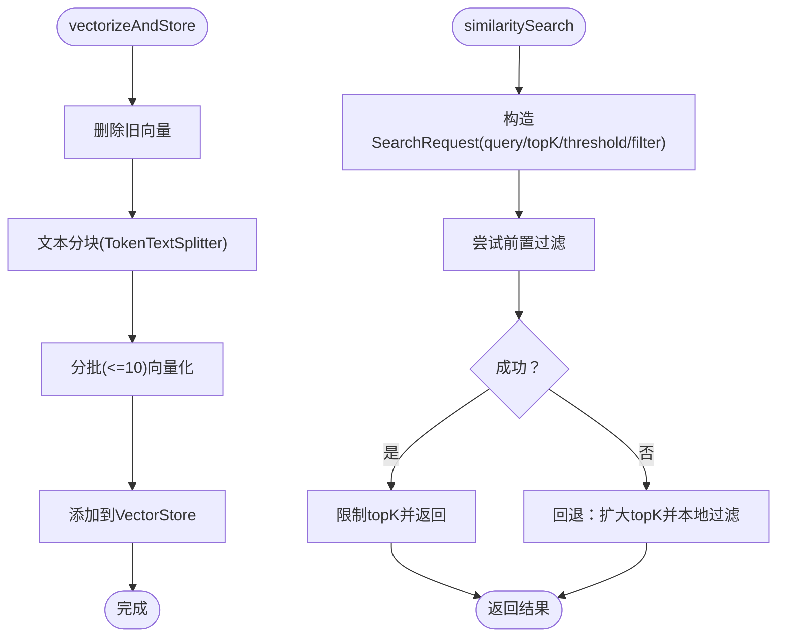
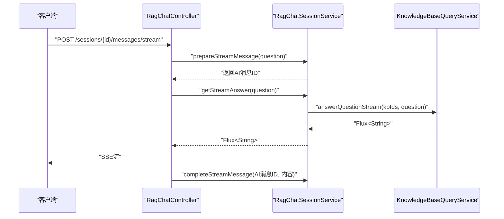
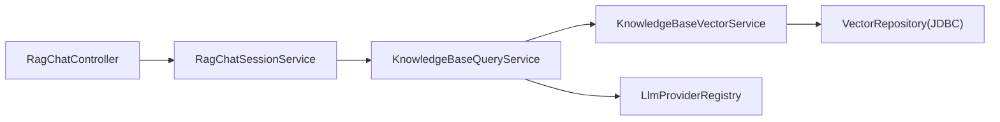

# RAG问答系统

<cite>
**本文档引用的文件**
- [KnowledgeBaseQueryService.java](file://app/src/main/java/interview/guide/modules/knowledgebase/service/KnowledgeBaseQueryService.java)
- [KnowledgeBaseQueryProperties.java](file://app/src/main/java/interview/guide/modules/knowledgebase/service/KnowledgeBaseQueryProperties.java)
- [KnowledgeBaseVectorService.java](file://app/src/main/java/interview/guide/modules/knowledgebase/service/KnowledgeBaseVectorService.java)
- [VectorRepository.java](file://app/src/main/java/interview/guide/modules/knowledgebase/repository/VectorRepository.java)
- [QueryRequest.java](file://app/src/main/java/interview/guide/modules/knowledgebase/model/QueryRequest.java)
- [QueryResponse.java](file://app/src/main/java/interview/guide/modules/knowledgebase/model/QueryResponse.java)
- [RagChatController.java](file://app/src/main/java/interview/guide/modules/knowledgebase/RagChatController.java)
- [RagChatSessionService.java](file://app/src/main/java/interview/guide/modules/knowledgebase/service/RagChatSessionService.java)
- [RagChatDTO.java](file://app/src/main/java/interview/guide/modules/knowledgebase/model/RagChatDTO.java)
- [LlmProviderRegistry.java](file://app/src/main/java/interview/guide/common/ai/LlmProviderRegistry.java)
- [knowledgebase-query-rewrite.st](file://app/src/main/resources/prompts/knowledgebase-query-rewrite.st)
- [knowledgebase-query-user.st](file://app/src/main/resources/prompts/knowledgebase-query-user.st)
</cite>

## 目录
1. [简介](#简介)
2. [项目结构](#项目结构)
3. [核心组件](#核心组件)
4. [架构总览](#架构总览)
5. [详细组件分析](#详细组件分析)
6. [依赖分析](#依赖分析)
7. [性能考虑](#性能考虑)
8. [故障排查指南](#故障排查指南)
9. [结论](#结论)
10. [附录](#附录)

## 简介
本文件面向RAG（检索增强生成）问答系统，围绕“检索-重写-生成”三阶段展开，系统性阐述相似度检索、查询重写、上下文构建与提示词工程、流式生成与SSE、以及质量评估与优化策略。文档同时给出查询请求与响应的数据模型设计、接口规范、错误处理与结果格式化要点，并总结性能优化与稳定性保障实践。

## 项目结构
RAG问答系统位于后端模块的“知识库”子域，核心由以下层次构成：
- 控制层：RAG聊天控制器负责会话生命周期与流式SSE输出
- 服务层：RAG会话服务协调持久化与调用查询服务；查询服务实现RAG三阶段逻辑；向量服务负责分块、向量化与相似度检索
- 数据模型：查询请求/响应与RAG聊天相关DTO
- 提示词模板：系统提示、用户提示、查询重写提示
- LLM注册与适配：统一的LLM提供商注册器，支持多供应商与默认客户端

图表来源
- [RagChatController.java:1-138](file://app/src/main/java/interview/guide/modules/knowledgebase/RagChatController.java#L1-L138)
- [RagChatSessionService.java:1-243](file://app/src/main/java/interview/guide/modules/knowledgebase/service/RagChatSessionService.java#L1-L243)
- [KnowledgeBaseQueryService.java:1-461](file://app/src/main/java/interview/guide/modules/knowledgebase/service/KnowledgeBaseQueryService.java#L1-L461)
- [KnowledgeBaseVectorService.java:1-203](file://app/src/main/java/interview/guide/modules/knowledgebase/service/KnowledgeBaseVectorService.java#L1-L203)
- [VectorRepository.java:1-66](file://app/src/main/java/interview/guide/modules/knowledgebase/repository/VectorRepository.java#L1-L66)
- [RagChatDTO.java:1-96](file://app/src/main/java/interview/guide/modules/knowledgebase/model/RagChatDTO.java#L1-L96)
- [LlmProviderRegistry.java:1-230](file://app/src/main/java/interview/guide/common/ai/LlmProviderRegistry.java#L1-L230)

章节来源
- [RagChatController.java:1-138](file://app/src/main/java/interview/guide/modules/knowledgebase/RagChatController.java#L1-L138)
- [RagChatSessionService.java:1-243](file://app/src/main/java/interview/guide/modules/knowledgebase/service/RagChatSessionService.java#L1-L243)
- [KnowledgeBaseQueryService.java:1-461](file://app/src/main/java/interview/guide/modules/knowledgebase/service/KnowledgeBaseQueryService.java#L1-L461)
- [KnowledgeBaseVectorService.java:1-203](file://app/src/main/java/interview/guide/modules/knowledgebase/service/KnowledgeBaseVectorService.java#L1-L203)
- [VectorRepository.java:1-66](file://app/src/main/java/interview/guide/modules/knowledgebase/repository/VectorRepository.java#L1-L66)
- [RagChatDTO.java:1-96](file://app/src/main/java/interview/guide/modules/knowledgebase/model/RagChatDTO.java#L1-L96)
- [LlmProviderRegistry.java:1-230](file://app/src/main/java/interview/guide/common/ai/LlmProviderRegistry.java#L1-L230)

## 核心组件
- 查询服务（RAG三阶段）：负责问题清洗、查询重写、动态参数检索、上下文拼接、提示词构建、LLM调用与流式输出、命中确认与无结果兜底
- 向量服务：负责文本分块、批量向量化、相似度检索、过滤表达式构造与回退策略
- 会话服务与控制器：负责RAG聊天会话的创建、列表、详情、消息持久化与流式SSE输出
- 提示词模板：系统提示、用户提示、查询重写提示
- LLM注册器：按配置创建ChatClient，支持默认客户端与工具回调

章节来源
- [KnowledgeBaseQueryService.java:1-461](file://app/src/main/java/interview/guide/modules/knowledgebase/service/KnowledgeBaseQueryService.java#L1-L461)
- [KnowledgeBaseVectorService.java:1-203](file://app/src/main/java/interview/guide/modules/knowledgebase/service/KnowledgeBaseVectorService.java#L1-L203)
- [RagChatSessionService.java:1-243](file://app/src/main/java/interview/guide/modules/knowledgebase/service/RagChatSessionService.java#L1-L243)
- [RagChatController.java:1-138](file://app/src/main/java/interview/guide/modules/knowledgebase/RagChatController.java#L1-L138)
- [knowledgebase-query-rewrite.st:1-11](file://app/src/main/resources/prompts/knowledgebase-query-rewrite.st#L1-L11)
- [knowledgebase-query-user.st:1-23](file://app/src/main/resources/prompts/knowledgebase-query-user.st#L1-L23)
- [LlmProviderRegistry.java:1-230](file://app/src/main/java/interview/guide/common/ai/LlmProviderRegistry.java#L1-L230)

## 架构总览
RAG问答系统采用“控制器-服务-向量存储-LLM”的分层架构。查询服务串联检索、重写与生成；向量服务封装分块与相似检索；会话服务负责消息持久化与SSE流式输出；提示词模板与LLM注册器提供生成侧的可配置能力。

图表来源
- [RagChatController.java:102-136](file://app/src/main/java/interview/guide/modules/knowledgebase/RagChatController.java#L102-L136)
- [RagChatSessionService.java:109-169](file://app/src/main/java/interview/guide/modules/knowledgebase/service/RagChatSessionService.java#L109-L169)
- [KnowledgeBaseQueryService.java:197-245](file://app/src/main/java/interview/guide/modules/knowledgebase/service/KnowledgeBaseQueryService.java#L197-L245)
- [KnowledgeBaseVectorService.java:91-125](file://app/src/main/java/interview/guide/modules/knowledgebase/service/KnowledgeBaseVectorService.java#L91-L125)
- [LlmProviderRegistry.java:65-89](file://app/src/main/java/interview/guide/common/ai/LlmProviderRegistry.java#L65-L89)

## 详细组件分析

### 查询服务（RAG三阶段）
- 问题清洗与重写
  - 清洗：去除空白字符，避免无效输入
  - 重写：启用开关，使用专用提示模板对问题进行改写，提升检索效果
- 动态参数检索
  - 根据问题长度与紧凑度动态选择topK与最小相似度阈值
  - 多候选查询（原问题、重写后问题）依次尝试，命中即返回
- 命中确认与无结果兜底
  - 对短token类问题进行二次字面匹配确认，避免将弱相关片段交给模型
  - 无有效命中时返回统一兜底文案
- 上下文构建与提示词工程
  - 将检索到的文档按固定分隔符拼接为上下文
  - 系统提示与用户提示模板分别负责角色设定与约束
- LLM调用与流式输出
  - 同步与流式两种路径，均通过ChatClient调用
  - 流式输出采用“探测窗口+归一化”策略，快速识别“无信息”模板并提前终止
- 错误处理
  - 统一业务异常包装，记录日志并向上游反馈

图表来源
- [KnowledgeBaseQueryService.java:111-155](file://app/src/main/java/interview/guide/modules/knowledgebase/service/KnowledgeBaseQueryService.java#L111-L155)
- [KnowledgeBaseQueryService.java:247-281](file://app/src/main/java/interview/guide/modules/knowledgebase/service/KnowledgeBaseQueryService.java#L247-L281)
- [KnowledgeBaseQueryService.java:323-344](file://app/src/main/java/interview/guide/modules/knowledgebase/service/KnowledgeBaseQueryService.java#L323-L344)
- [KnowledgeBaseQueryService.java:395-453](file://app/src/main/java/interview/guide/modules/knowledgebase/service/KnowledgeBaseQueryService.java#L395-L453)

章节来源
- [KnowledgeBaseQueryService.java:1-461](file://app/src/main/java/interview/guide/modules/knowledgebase/service/KnowledgeBaseQueryService.java#L1-L461)
- [knowledgebase-query-rewrite.st:1-11](file://app/src/main/resources/prompts/knowledgebase-query-rewrite.st#L1-L11)
- [knowledgebase-query-user.st:1-23](file://app/src/main/resources/prompts/knowledgebase-query-user.st#L1-L23)

### 向量服务（相似度检索与分块）
- 文本分块
  - 使用TokenTextSplitter按标点边界切分，避免跨token截断
- 向量化与存储
  - 分批处理（阿里云DashScope批量上限），逐批add到VectorStore
  - 删除旧向量时统一清理metadata中的kb_id字段
- 相似度检索
  - 支持按知识库ID过滤（kb_id in [ids]）
  - 支持相似度阈值与topK限制
  - 前置过滤失败时回退到本地过滤，保证稳定性
- 删除策略
  - 原子事务删除，失败抛出业务异常

图表来源
- [KnowledgeBaseVectorService.java:45-81](file://app/src/main/java/interview/guide/modules/knowledgebase/service/KnowledgeBaseVectorService.java#L45-L81)
- [KnowledgeBaseVectorService.java:91-125](file://app/src/main/java/interview/guide/modules/knowledgebase/service/KnowledgeBaseVectorService.java#L91-L125)
- [KnowledgeBaseVectorService.java:127-159](file://app/src/main/java/interview/guide/modules/knowledgebase/service/KnowledgeBaseVectorService.java#L127-L159)
- [VectorRepository.java:31-64](file://app/src/main/java/interview/guide/modules/knowledgebase/repository/VectorRepository.java#L31-L64)

章节来源
- [KnowledgeBaseVectorService.java:1-203](file://app/src/main/java/interview/guide/modules/knowledgebase/service/KnowledgeBaseVectorService.java#L1-L203)
- [VectorRepository.java:1-66](file://app/src/main/java/interview/guide/modules/knowledgebase/repository/VectorRepository.java#L1-L66)

### 会话与聊天（SSE流式）
- 控制器
  - 创建/列出/获取会话详情
  - 流式发送消息：先保存用户消息与占位AI消息，再返回SSE流，完成后更新AI消息内容
- 会话服务
  - 会话CRUD、知识库绑定、消息持久化
  - 流式准备与完成：原子事务内保存消息并维护消息序号
  - 调用查询服务进行流式回答

图表来源
- [RagChatController.java:102-136](file://app/src/main/java/interview/guide/modules/knowledgebase/RagChatController.java#L102-L136)
- [RagChatSessionService.java:109-169](file://app/src/main/java/interview/guide/modules/knowledgebase/service/RagChatSessionService.java#L109-L169)
- [KnowledgeBaseQueryService.java:197-245](file://app/src/main/java/interview/guide/modules/knowledgebase/service/KnowledgeBaseQueryService.java#L197-L245)

章节来源
- [RagChatController.java:1-138](file://app/src/main/java/interview/guide/modules/knowledgebase/RagChatController.java#L1-L138)
- [RagChatSessionService.java:1-243](file://app/src/main/java/interview/guide/modules/knowledgebase/service/RagChatSessionService.java#L1-L243)

### 数据模型与接口规范
- 查询请求/响应
  - 查询请求：支持多知识库ID与问题文本，提供单ID兼容构造
  - 查询响应：包含答案、主知识库ID与知识库名称串
- RAG聊天DTO
  - 会话创建/更新/知识库更新请求
  - 会话列表项、详情与消息结构
- 参数校验与错误处理
  - 使用Jakarta Validation注解进行必填校验
  - 业务异常统一包装，错误码与消息规范化

章节来源
- [QueryRequest.java:1-26](file://app/src/main/java/interview/guide/modules/knowledgebase/model/QueryRequest.java#L1-L26)
- [QueryResponse.java:1-12](file://app/src/main/java/interview/guide/modules/knowledgebase/model/QueryResponse.java#L1-L12)
- [RagChatDTO.java:1-96](file://app/src/main/java/interview/guide/modules/knowledgebase/model/RagChatDTO.java#L1-L96)

### 提示词工程与LLM适配
- 提示词模板
  - 查询重写：指导模型将用户问题改写为更适合检索的单句查询
  - 用户提示：限定回答准确性、完整性、结构化与格式规范
- LLM注册器
  - 按提供商ID创建ChatClient，支持默认客户端与工具回调
  - 统一超时配置与重试策略，兼容本地与云端模型

章节来源
- [knowledgebase-query-rewrite.st:1-11](file://app/src/main/resources/prompts/knowledgebase-query-rewrite.st#L1-L11)
- [knowledgebase-query-user.st:1-23](file://app/src/main/resources/prompts/knowledgebase-query-user.st#L1-L23)
- [LlmProviderRegistry.java:65-89](file://app/src/main/java/interview/guide/common/ai/LlmProviderRegistry.java#L65-L89)

## 依赖分析
- 组件耦合
  - 控制器依赖会话服务；会话服务依赖查询服务与持久化仓库
  - 查询服务依赖向量服务与LLM注册器
  - 向量服务依赖VectorStore与JDBC模板删除
- 外部依赖
  - Spring AI ChatClient、VectorStore、PromptTemplate
  - PostgreSQL向量存储（PgVector）与JDBC
- 循环依赖
  - 未发现循环依赖，职责清晰分层

图表来源
- [RagChatController.java:1-138](file://app/src/main/java/interview/guide/modules/knowledgebase/RagChatController.java#L1-L138)
- [RagChatSessionService.java:1-243](file://app/src/main/java/interview/guide/modules/knowledgebase/service/RagChatSessionService.java#L1-L243)
- [KnowledgeBaseQueryService.java:1-461](file://app/src/main/java/interview/guide/modules/knowledgebase/service/KnowledgeBaseQueryService.java#L1-L461)
- [KnowledgeBaseVectorService.java:1-203](file://app/src/main/java/interview/guide/modules/knowledgebase/service/KnowledgeBaseVectorService.java#L1-L203)
- [VectorRepository.java:1-66](file://app/src/main/java/interview/guide/modules/knowledgebase/repository/VectorRepository.java#L1-L66)
- [LlmProviderRegistry.java:1-230](file://app/src/main/java/interview/guide/common/ai/LlmProviderRegistry.java#L1-L230)

章节来源
- [RagChatController.java:1-138](file://app/src/main/java/interview/guide/modules/knowledgebase/RagChatController.java#L1-L138)
- [RagChatSessionService.java:1-243](file://app/src/main/java/interview/guide/modules/knowledgebase/service/RagChatSessionService.java#L1-L243)
- [KnowledgeBaseQueryService.java:1-461](file://app/src/main/java/interview/guide/modules/knowledgebase/service/KnowledgeBaseQueryService.java#L1-L461)
- [KnowledgeBaseVectorService.java:1-203](file://app/src/main/java/interview/guide/modules/knowledgebase/service/KnowledgeBaseVectorService.java#L1-L203)
- [VectorRepository.java:1-66](file://app/src/main/java/interview/guide/modules/knowledgebase/repository/VectorRepository.java#L1-L66)
- [LlmProviderRegistry.java:1-230](file://app/src/main/java/interview/guide/common/ai/LlmProviderRegistry.java#L1-L230)

## 性能考虑
- 检索参数自适应
  - 短问题：高topK与较低阈值，提升召回
  - 中等问题：平衡召回与相关性
  - 长问题：降低topK与提高阈值，减少噪声
- 文本分块与批处理
  - TokenTextSplitter按标点切分，避免跨token截断
  - 向量化分批（≤10）以满足外部API限制
- 流式输出优化
  - 探测窗口（前若干字符）快速判断“无信息”，避免长尾输出
  - 无信息模板命中后立即终止，节省资源
- 并发与事务
  - 会话消息保存与流式完成在事务内保证一致性
  - SSE流式输出基于Reactor，非阻塞处理

章节来源
- [KnowledgeBaseQueryProperties.java:1-33](file://app/src/main/java/interview/guide/modules/knowledgebase/service/KnowledgeBaseQueryProperties.java#L1-L33)
- [KnowledgeBaseQueryService.java:283-292](file://app/src/main/java/interview/guide/modules/knowledgebase/service/KnowledgeBaseQueryService.java#L283-L292)
- [KnowledgeBaseVectorService.java:37-39](file://app/src/main/java/interview/guide/modules/knowledgebase/service/KnowledgeBaseVectorService.java#L37-L39)
- [KnowledgeBaseVectorService.java:67-73](file://app/src/main/java/interview/guide/modules/knowledgebase/service/KnowledgeBaseVectorService.java#L67-L73)
- [KnowledgeBaseQueryService.java:400-453](file://app/src/main/java/interview/guide/modules/knowledgebase/service/KnowledgeBaseQueryService.java#L400-L453)
- [RagChatSessionService.java:109-169](file://app/src/main/java/interview/guide/modules/knowledgebase/service/RagChatSessionService.java#L109-L169)

## 故障排查指南
- 常见错误与定位
  - 知识库不存在：会话创建/更新时校验失败
  - 会话/消息不存在：读取详情或完成流式时抛出
  - 向量搜索失败：前置过滤异常时触发回退路径
  - LLM调用失败：流式输出捕获异常并返回兜底提示
- 日志与可观测性
  - 关键路径均记录INFO/WARN/ERROR级别日志
  - SSE流式过程包含线程信息与完成事件
- 建议排查步骤
  - 检查知识库ID有效性与向量化状态
  - 校验提示词模板是否正确加载
  - 观察流式探测窗口是否提前终止
  - 核对LLM提供商配置与网络连通性

章节来源
- [RagChatSessionService.java:48-54](file://app/src/main/java/interview/guide/modules/knowledgebase/service/RagChatSessionService.java#L48-L54)
- [RagChatSessionService.java:147-157](file://app/src/main/java/interview/guide/modules/knowledgebase/service/RagChatSessionService.java#L147-L157)
- [KnowledgeBaseVectorService.java:121-124](file://app/src/main/java/interview/guide/modules/knowledgebase/service/KnowledgeBaseVectorService.java#L121-L124)
- [KnowledgeBaseQueryService.java:241-244](file://app/src/main/java/interview/guide/modules/knowledgebase/service/KnowledgeBaseQueryService.java#L241-L244)
- [RagChatController.java:123-135](file://app/src/main/java/interview/guide/modules/knowledgebase/RagChatController.java#L123-L135)

## 结论
本系统以“查询重写+相似度检索+提示词工程+流式生成”为核心，结合自适应检索参数、探测窗口优化与事务一致性保障，实现了稳定高效的RAG问答能力。通过清晰的分层与可配置的提示词模板、LLM注册器，系统具备良好的扩展性与可维护性。建议在生产环境中持续关注检索阈值与topK的调优、向量索引与过滤性能，以及多轮对话上下文长度与成本控制。

## 附录
- 查询请求/响应数据模型
  - 查询请求：包含知识库ID列表与问题文本
  - 查询响应：包含答案、主知识库ID与知识库名称串
- RAG聊天数据模型
  - 会话创建/更新/知识库更新请求
  - 会话列表项、详情与消息结构
- 提示词模板
  - 查询重写模板：指导模型将问题改写为更适合检索的单句
  - 用户提示模板：限定回答准确性、完整性、结构化与格式规范

章节来源
- [QueryRequest.java:1-26](file://app/src/main/java/interview/guide/modules/knowledgebase/model/QueryRequest.java#L1-L26)
- [QueryResponse.java:1-12](file://app/src/main/java/interview/guide/modules/knowledgebase/model/QueryResponse.java#L1-L12)
- [RagChatDTO.java:1-96](file://app/src/main/java/interview/guide/modules/knowledgebase/model/RagChatDTO.java#L1-L96)
- [knowledgebase-query-rewrite.st:1-11](file://app/src/main/resources/prompts/knowledgebase-query-rewrite.st#L1-L11)
- [knowledgebase-query-user.st:1-23](file://app/src/main/resources/prompts/knowledgebase-query-user.st#L1-L23)