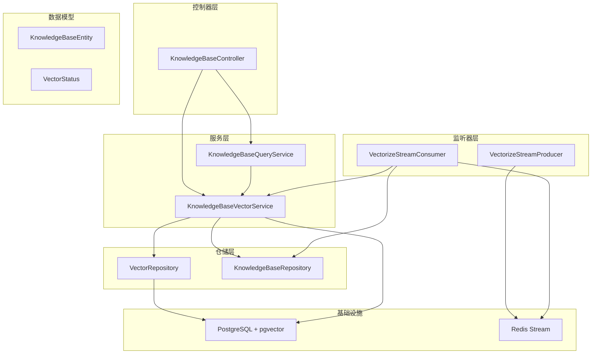
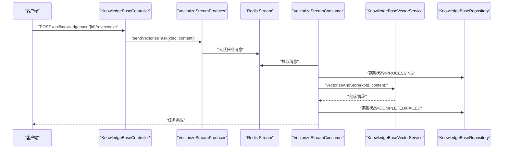
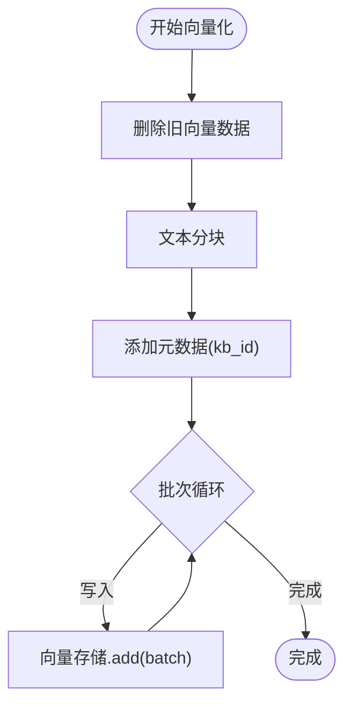
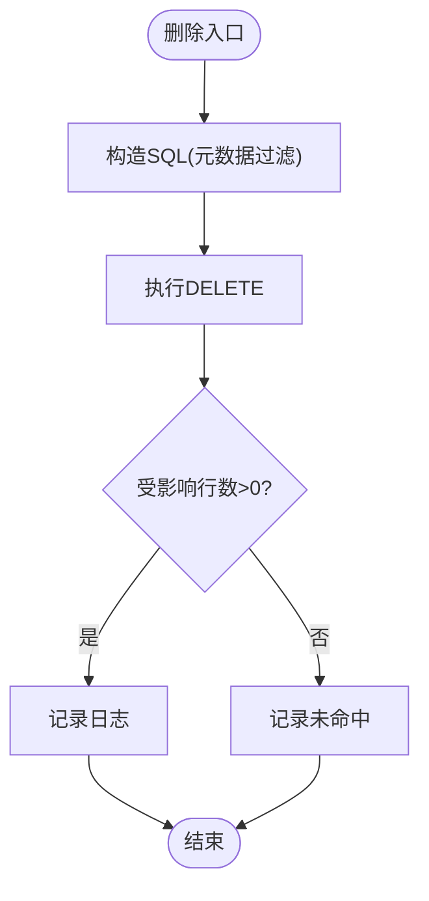
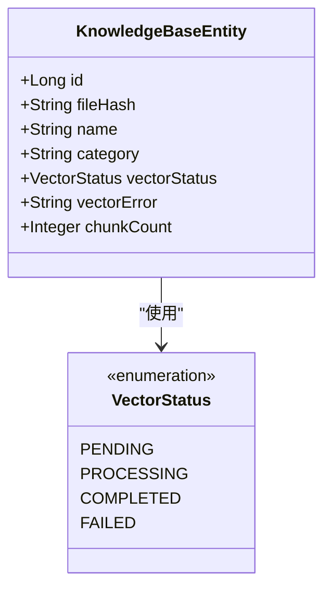
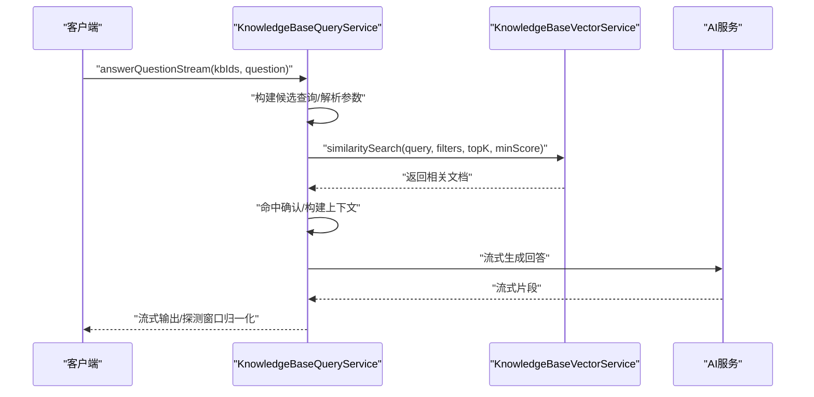
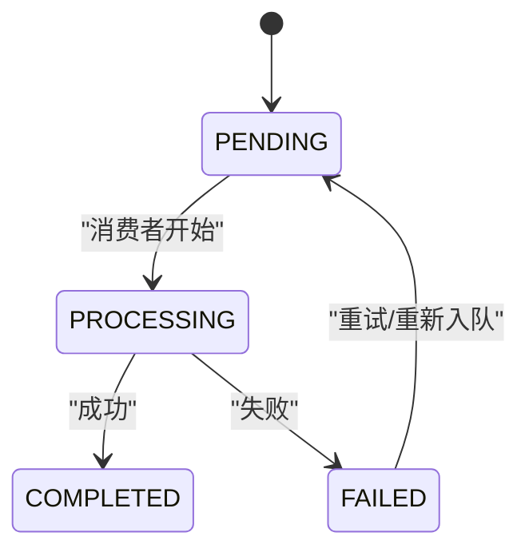
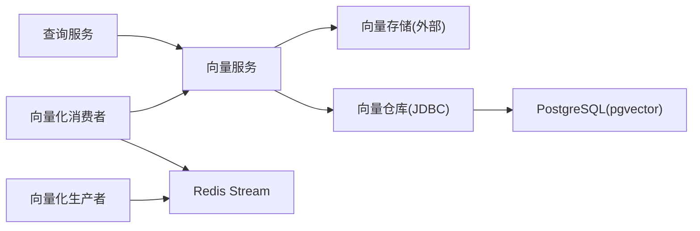

# 向量索引管理

<cite>
**本文引用的文件**
- [KnowledgeBaseVectorService.java](file://app/src/main/java/interview/guide/modules/knowledgebase/service/KnowledgeBaseVectorService.java)
- [VectorRepository.java](file://app/src/main/java/interview/guide/modules/knowledgebase/repository/VectorRepository.java)
- [VectorStatus.java](file://app/src/main/java/interview/guide/modules/knowledgebase/model/VectorStatus.java)
- [KnowledgeBaseEntity.java](file://app/src/main/java/interview/guide/modules/knowledgebase/model/KnowledgeBaseEntity.java)
- [KnowledgeBaseQueryService.java](file://app/src/main/java/interview/guide/modules/knowledgebase/service/KnowledgeBaseQueryService.java)
- [VectorizeStreamConsumer.java](file://app/src/main/java/interview/guide/modules/knowledgebase/listener/VectorizeStreamConsumer.java)
- [VectorizeStreamProducer.java](file://app/src/main/java/interview/guide/modules/knowledgebase/listener/VectorizeStreamProducer.java)
- [KnowledgeBaseController.java](file://app/src/main/java/interview/guide/modules/knowledgebase/KnowledgeBaseController.java)
- [init.sql](file://docker/postgres/init.sql)
- [application.yml](file://app/src/main/resources/application.yml)
- [2026-05-12-rag-search-optimization.md](file://docs/superpowers/plans/2026-05-12-rag-search-optimization.md)
- [KnowledgeBaseVectorServiceTest.java](file://app/src/test/java/interview/guide/modules/knowledgebase/service/KnowledgeBaseVectorServiceTest.java)
</cite>

## 目录
1. [简介](#简介)
2. [项目结构](#项目结构)
3. [核心组件](#核心组件)
4. [架构概览](#架构概览)
5. [详细组件分析](#详细组件分析)
6. [依赖分析](#依赖分析)
7. [性能考虑](#性能考虑)
8. [故障排查指南](#故障排查指南)
9. [结论](#结论)
10. [附录](#附录)

## 简介
本文件面向向量索引管理功能，系统性阐述基于 pgvector 的向量数据库集成与配置、向量嵌入生成流程、索引生命周期管理、状态监控机制、搜索优化策略、存储与检索机制以及维护与故障恢复方案。目标读者包括后端工程师、数据工程师与运维人员。

## 项目结构
向量索引相关代码集中在知识库模块，围绕以下层次组织：
- 控制器层：对外暴露知识库与向量化管理接口
- 服务层：负责向量化、查询、混合检索与重排序
- 仓储层：封装向量存储与知识库实体的持久化
- 监听器层：基于 Redis Stream 的异步向量化任务编排
- 数据模型：知识库实体与向量化状态枚举
- 数据库初始化：PostgreSQL 扩展启用脚本

图表来源
- [KnowledgeBaseController.java:196-210](file://app/src/main/java/interview/guide/modules/knowledgebase/KnowledgeBaseController.java#L196-L210)
- [KnowledgeBaseVectorService.java:45-81](file://app/src/main/java/interview/guide/modules/knowledgebase/service/KnowledgeBaseVectorService.java#L45-L81)
- [KnowledgeBaseQueryService.java:111-155](file://app/src/main/java/interview/guide/modules/knowledgebase/service/KnowledgeBaseQueryService.java#L111-L155)
- [VectorRepository.java:31-64](file://app/src/main/java/interview/guide/modules/knowledgebase/repository/VectorRepository.java#L31-L64)
- [VectorizeStreamConsumer.java:21-97](file://app/src/main/java/interview/guide/modules/knowledgebase/listener/VectorizeStreamConsumer.java#L21-L97)
- [VectorizeStreamProducer.java:19-81](file://app/src/main/java/interview/guide/modules/knowledgebase/listener/VectorizeStreamProducer.java#L19-L81)

章节来源
- [KnowledgeBaseController.java:196-210](file://app/src/main/java/interview/guide/modules/knowledgebase/KnowledgeBaseController.java#L196-L210)
- [KnowledgeBaseVectorService.java:45-81](file://app/src/main/java/interview/guide/modules/knowledgebase/service/KnowledgeBaseVectorService.java#L45-L81)
- [KnowledgeBaseQueryService.java:111-155](file://app/src/main/java/interview/guide/modules/knowledgebase/service/KnowledgeBaseQueryService.java#L111-L155)
- [VectorRepository.java:31-64](file://app/src/main/java/interview/guide/modules/knowledgebase/repository/VectorRepository.java#L31-L64)
- [VectorizeStreamConsumer.java:21-97](file://app/src/main/java/interview/guide/modules/knowledgebase/listener/VectorizeStreamConsumer.java#L21-L97)
- [VectorizeStreamProducer.java:19-81](file://app/src/main/java/interview/guide/modules/knowledgebase/listener/VectorizeStreamProducer.java#L19-L81)

## 核心组件
- 向量服务：负责文本分块、批量向量化、写入向量存储、相似度检索与过滤
- 向量仓库：基于 SQL 的向量数据删除（按知识库维度）
- 知识库实体：承载向量化状态、错误信息、分块数量等元数据
- 查询服务：构建检索上下文、动态参数化检索、流式输出与命中确认
- 异步监听器：生产/消费 Redis Stream 任务，驱动向量化生命周期
- 控制器：提供列表、查询、重新向量化等管理接口

章节来源
- [KnowledgeBaseVectorService.java:25-81](file://app/src/main/java/interview/guide/modules/knowledgebase/service/KnowledgeBaseVectorService.java#L25-L81)
- [VectorRepository.java:18-64](file://app/src/main/java/interview/guide/modules/knowledgebase/repository/VectorRepository.java#L18-L64)
- [KnowledgeBaseEntity.java:15-75](file://app/src/main/java/interview/guide/modules/knowledgebase/model/KnowledgeBaseEntity.java#L15-L75)
- [KnowledgeBaseQueryService.java:35-91](file://app/src/main/java/interview/guide/modules/knowledgebase/service/KnowledgeBaseQueryService.java#L35-L91)
- [VectorizeStreamConsumer.java:21-97](file://app/src/main/java/interview/guide/modules/knowledgebase/listener/VectorizeStreamConsumer.java#L21-L97)
- [VectorizeStreamProducer.java:19-81](file://app/src/main/java/interview/guide/modules/knowledgebase/listener/VectorizeStreamProducer.java#L19-L81)

## 架构概览
整体采用“异步任务 + 向量检索”的架构：
- 上传完成后，生产者将向量化任务推送到 Redis Stream
- 消费者从 Stream 拉取任务，更新状态为“处理中”，执行向量化，完成后置为“完成”
- 查询阶段，服务层根据查询上下文与动态参数执行相似度检索，并支持过滤与回退策略

图表来源
- [KnowledgeBaseController.java:202-208](file://app/src/main/java/interview/guide/modules/knowledgebase/KnowledgeBaseController.java#L202-L208)
- [VectorizeStreamProducer.java:36-38](file://app/src/main/java/interview/guide/modules/knowledgebase/listener/VectorizeStreamProducer.java#L36-L38)
- [VectorizeStreamConsumer.java:80-97](file://app/src/main/java/interview/guide/modules/knowledgebase/listener/VectorizeStreamConsumer.java#L80-L97)
- [KnowledgeBaseVectorService.java:45-81](file://app/src/main/java/interview/guide/modules/knowledgebase/service/KnowledgeBaseVectorService.java#L45-L81)

## 详细组件分析

### 向量服务（向量化与检索）
- 文本分块：使用基于 token 的分块器，默认约 800 tokens/块，无重叠
- 批量写入：受第三方 API 批量限制约束，按最大批次大小分批写入
- 元数据设计：统一将知识库 ID 写入元数据，便于后续过滤
- 相似度检索：支持 topK、最小相似度阈值与多知识库过滤表达式
- 回退策略：当前置过滤失败时，扩大召回并本地过滤，保证稳定性

图表来源
- [KnowledgeBaseVectorService.java:45-81](file://app/src/main/java/interview/guide/modules/knowledgebase/service/KnowledgeBaseVectorService.java#L45-L81)

章节来源
- [KnowledgeBaseVectorService.java:25-81](file://app/src/main/java/interview/guide/modules/knowledgebase/service/KnowledgeBaseVectorService.java#L25-L81)
- [KnowledgeBaseVectorService.java:91-125](file://app/src/main/java/interview/guide/modules/knowledgebase/service/KnowledgeBaseVectorService.java#L91-L125)
- [KnowledgeBaseVectorService.java:127-159](file://app/src/main/java/interview/guide/modules/knowledgebase/service/KnowledgeBaseVectorService.java#L127-L159)

### 向量仓库（删除与过滤）
- 使用 SQL 直接删除向量记录，利用向量存储表的元数据字段进行过滤
- 兼容两种 kb_id 存储方式（字符串与长整型），避免历史数据不一致

图表来源
- [VectorRepository.java:31-64](file://app/src/main/java/interview/guide/modules/knowledgebase/repository/VectorRepository.java#L31-L64)

章节来源
- [VectorRepository.java:18-64](file://app/src/main/java/interview/guide/modules/knowledgebase/repository/VectorRepository.java#L18-L64)

### 知识库实体与状态
- 状态枚举：PENDING、PROCESSING、COMPLETED、FAILED
- 元数据字段：向量化状态、错误信息、分块数量等
- 与向量服务配合，通过监听器更新状态

图表来源
- [KnowledgeBaseEntity.java:15-75](file://app/src/main/java/interview/guide/modules/knowledgebase/model/KnowledgeBaseEntity.java#L15-L75)
- [VectorStatus.java:6-11](file://app/src/main/java/interview/guide/modules/knowledgebase/model/VectorStatus.java#L6-L11)

章节来源
- [KnowledgeBaseEntity.java:15-75](file://app/src/main/java/interview/guide/modules/knowledgebase/model/KnowledgeBaseEntity.java#L15-L75)
- [VectorStatus.java:6-11](file://app/src/main/java/interview/guide/modules/knowledgebase/model/VectorStatus.java#L6-L11)

### 查询服务（检索与流式输出）
- 动态参数化：根据查询长度选择 topK 与最小相似度
- 候选查询：支持查询改写与规范化后的候选集合
- 命中确认：对短 token 查询进行字面匹配确认，避免弱相关误导
- 流式输出：探测窗口归一化，快速识别“无结果”模板并提前终止

图表来源
- [KnowledgeBaseQueryService.java:197-245](file://app/src/main/java/interview/guide/modules/knowledgebase/service/KnowledgeBaseQueryService.java#L197-L245)
- [KnowledgeBaseQueryService.java:264-281](file://app/src/main/java/interview/guide/modules/knowledgebase/service/KnowledgeBaseQueryService.java#L264-L281)
- [KnowledgeBaseQueryService.java:400-453](file://app/src/main/java/interview/guide/modules/knowledgebase/service/KnowledgeBaseQueryService.java#L400-L453)

章节来源
- [KnowledgeBaseQueryService.java:35-91](file://app/src/main/java/interview/guide/modules/knowledgebase/service/KnowledgeBaseQueryService.java#L35-L91)
- [KnowledgeBaseQueryService.java:197-245](file://app/src/main/java/interview/guide/modules/knowledgebase/service/KnowledgeBaseQueryService.java#L197-L245)
- [KnowledgeBaseQueryService.java:264-281](file://app/src/main/java/interview/guide/modules/knowledgebase/service/KnowledgeBaseQueryService.java#L264-L281)
- [KnowledgeBaseQueryService.java:400-453](file://app/src/main/java/interview/guide/modules/knowledgebase/service/KnowledgeBaseQueryService.java#L400-L453)

### 异步向量化（Redis Stream）
- 生产者：发送 kbId 与内容到 Stream，失败时更新状态为 FAILED
- 消费者：标记 PROCESSING，执行向量化，完成后更新为 COMPLETED；失败更新为 FAILED；支持重试入队

图表来源
- [VectorizeStreamConsumer.java:80-97](file://app/src/main/java/interview/guide/modules/knowledgebase/listener/VectorizeStreamConsumer.java#L80-L97)
- [VectorizeStreamProducer.java:72-80](file://app/src/main/java/interview/guide/modules/knowledgebase/listener/VectorizeStreamProducer.java#L72-L80)

章节来源
- [VectorizeStreamConsumer.java:21-139](file://app/src/main/java/interview/guide/modules/knowledgebase/listener/VectorizeStreamConsumer.java#L21-L139)
- [VectorizeStreamProducer.java:19-81](file://app/src/main/java/interview/guide/modules/knowledgebase/listener/VectorizeStreamProducer.java#L19-L81)

### 控制器与接口
- 列表接口：支持按向量化状态过滤与排序
- 重新向量化：手动触发重试，结合限流保护

章节来源
- [KnowledgeBaseController.java:47-62](file://app/src/main/java/interview/guide/modules/knowledgebase/KnowledgeBaseController.java#L47-L62)
- [KnowledgeBaseController.java:202-208](file://app/src/main/java/interview/guide/modules/knowledgebase/KnowledgeBaseController.java#L202-L208)

## 依赖分析
- 数据库层：PostgreSQL + pgvector 扩展，向量存储表默认命名为 vector_store，元数据以 JSONB 字段存储
- 搜索请求：通过向量服务构建 SearchRequest，支持相似度阈值与过滤表达式
- 事务与异常：向量服务与仓库均采用事务控制，异常统一转换为业务异常

图表来源
- [KnowledgeBaseVectorService.java:31-36](file://app/src/main/java/interview/guide/modules/knowledgebase/service/KnowledgeBaseVectorService.java#L31-L36)
- [VectorRepository.java:20-21](file://app/src/main/java/interview/guide/modules/knowledgebase/repository/VectorRepository.java#L20-L21)
- [init.sql:1-1](file://docker/postgres/init.sql#L1-L1)

章节来源
- [KnowledgeBaseVectorService.java:31-36](file://app/src/main/java/interview/guide/modules/knowledgebase/service/KnowledgeBaseVectorService.java#L31-L36)
- [VectorRepository.java:20-21](file://app/src/main/java/interview/guide/modules/knowledgebase/repository/VectorRepository.java#L20-L21)
- [init.sql:1-1](file://docker/postgres/init.sql#L1-L1)

## 性能考虑
- 分块与批处理：合理设置分块大小与批处理上限，平衡吞吐与延迟
- 过滤与阈值：利用相似度阈值与过滤表达式缩小召回范围
- 回退策略：前置过滤失败时扩大召回并本地过滤，避免过度退化
- 流式输出：探测窗口归一化减少长无信息输出带来的带宽浪费
- 搜索融合与重排序：混合检索与交叉编码重排序提升准确性，但需控制候选规模与调用成本

章节来源
- [KnowledgeBaseVectorService.java:91-125](file://app/src/main/java/interview/guide/modules/knowledgebase/service/KnowledgeBaseVectorService.java#L91-L125)
- [KnowledgeBaseQueryService.java:264-281](file://app/src/main/java/interview/guide/modules/knowledgebase/service/KnowledgeBaseQueryService.java#L264-L281)
- [2026-05-12-rag-search-optimization.md:266-405](file://docs/superpowers/plans/2026-05-12-rag-search-optimization.md#L266-L405)
- [2026-05-12-rag-search-optimization.md:494-638](file://docs/superpowers/plans/2026-05-12-rag-search-optimization.md#L494-L638)

## 故障排查指南
- 向量化失败：检查异常是否被包装为业务异常，查看知识库实体的错误字段
- 删除向量失败：确认 SQL 是否正确匹配元数据键，关注事务回滚与日志
- 搜索无结果：确认查询长度与参数配置、候选查询是否为空、是否触发命中确认
- 流式输出异常：关注探测窗口逻辑与错误恢复分支
- 重新向量化：通过控制器接口触发，结合限流策略避免抖动

章节来源
- [KnowledgeBaseVectorService.java:76-81](file://app/src/main/java/interview/guide/modules/knowledgebase/service/KnowledgeBaseVectorService.java#L76-L81)
- [VectorRepository.java:59-63](file://app/src/main/java/interview/guide/modules/knowledgebase/repository/VectorRepository.java#L59-L63)
- [KnowledgeBaseQueryService.java:241-244](file://app/src/main/java/interview/guide/modules/knowledgebase/service/KnowledgeBaseQueryService.java#L241-L244)
- [KnowledgeBaseController.java:202-208](file://app/src/main/java/interview/guide/modules/knowledgebase/KnowledgeBaseController.java#L202-L208)

## 结论
本系统通过 Redis Stream 实现向量化的异步编排，结合 pgvector 的高效相似度检索与灵活过滤，形成完整的向量索引管理闭环。查询服务在准确性与性能间取得平衡，提供流式输出与命中确认等优化手段。建议持续优化分块策略、批处理上限与候选规模，以进一步提升吞吐与质量。

## 附录

### 数据库与环境配置要点
- 启用 pgvector 扩展
- Spring AI 配置（兼容 OpenAI 接口风格）
- Redisson 连接配置

章节来源
- [init.sql:1-1](file://docker/postgres/init.sql#L1-L1)
- [application.yml:63-100](file://app/src/main/resources/application.yml#L63-L100)

### 测试要点（来自单元测试）
- 批次大小限制与元数据一致性校验
- 删除旧数据优先于新增，顺序严格
- 失败场景与异常消息校验
- 搜索过滤与回退策略行为验证

章节来源
- [KnowledgeBaseVectorServiceTest.java:187-241](file://app/src/test/java/interview/guide/modules/knowledgebase/service/KnowledgeBaseVectorServiceTest.java#L187-L241)
- [KnowledgeBaseVectorServiceTest.java:315-332](file://app/src/test/java/interview/guide/modules/knowledgebase/service/KnowledgeBaseVectorServiceTest.java#L315-L332)
- [KnowledgeBaseVectorServiceTest.java:503-508](file://app/src/test/java/interview/guide/modules/knowledgebase/service/KnowledgeBaseVectorServiceTest.java#L503-L508)