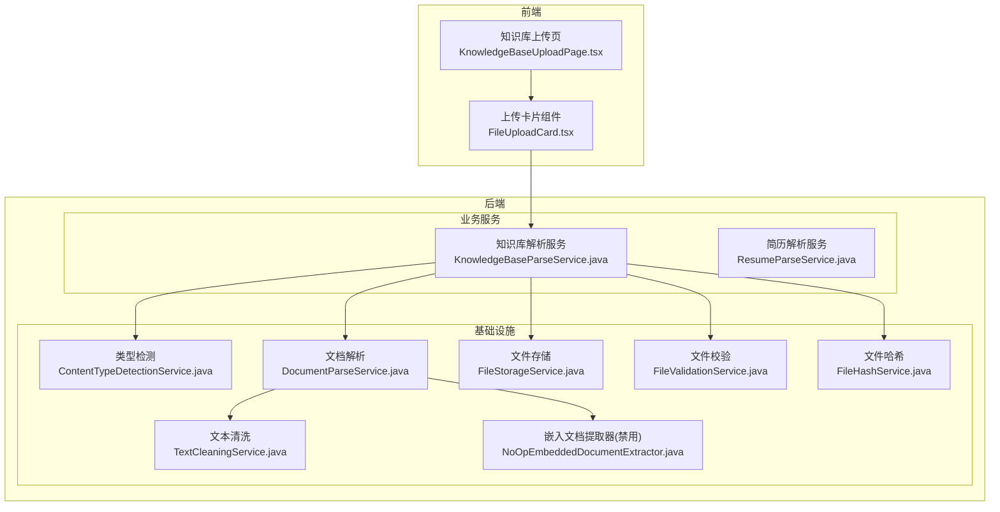
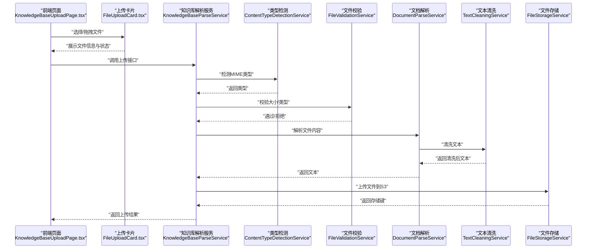
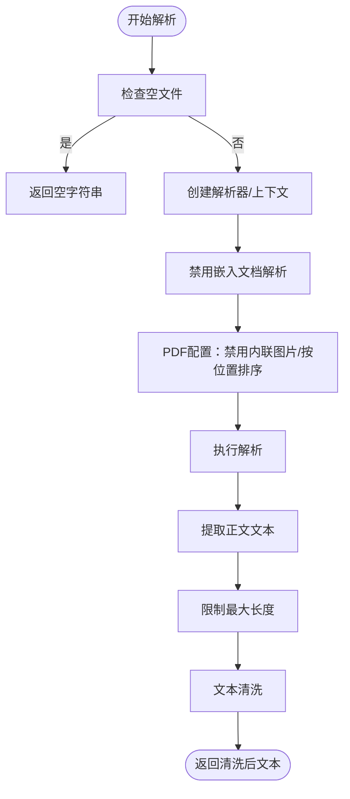
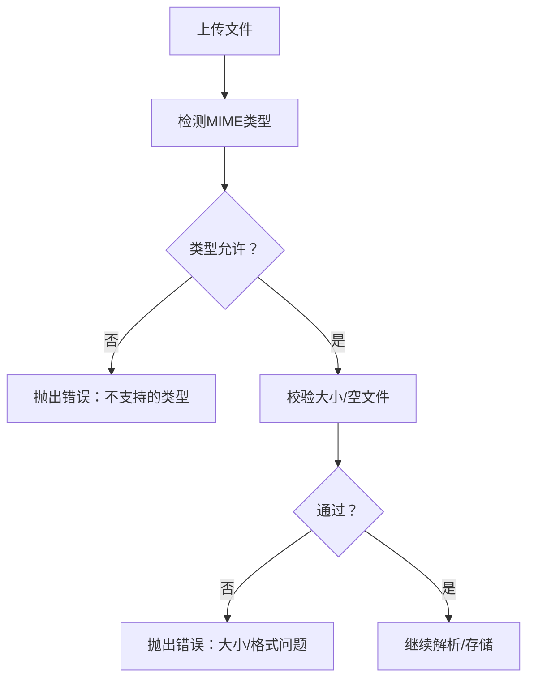
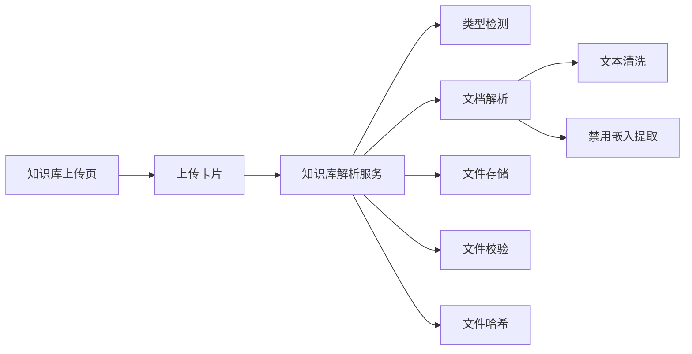

# 文档上传与解析

<cite>
**本文引用的文件**   
- [DocumentParseService.java](file://app/src/main/java/interview/guide/infrastructure/file/DocumentParseService.java)
- [FileValidationService.java](file://app/src/main/java/interview/guide/infrastructure/file/FileValidationService.java)
- [FileStorageService.java](file://app/src/main/java/interview/guide/infrastructure/file/FileStorageService.java)
- [ContentTypeDetectionService.java](file://app/src/main/java/interview/guide/infrastructure/file/ContentTypeDetectionService.java)
- [TextCleaningService.java](file://app/src/main/java/interview/guide/infrastructure/file/TextCleaningService.java)
- [NoOpEmbeddedDocumentExtractor.java](file://app/src/main/java/interview/guide/infrastructure/file/NoOpEmbeddedDocumentExtractor.java)
- [KnowledgeBaseParseService.java](file://app/src/main/java/interview/guide/modules/knowledgebase/service/KnowledgeBaseParseService.java)
- [ResumeParseService.java](file://app/src/main/java/interview/guide/modules/resume/service/ResumeParseService.java)
- [KnowledgeBaseUploadPage.tsx](file://frontend/src/pages/KnowledgeBaseUploadPage.tsx)
- [FileUploadCard.tsx](file://frontend/src/components/FileUploadCard.tsx)
- [DocumentParseServiceTest.java](file://app/src/test/java/interview/guide/infrastructure/file/DocumentParseServiceTest.java)
- [FileHashService.java](file://app/src/main/java/interview/guide/infrastructure/file/FileHashService.java)
</cite>

## 目录
1. [引言](#引言)
2. [项目结构](#项目结构)
3. [核心组件](#核心组件)
4. [架构总览](#架构总览)
5. [详细组件分析](#详细组件分析)
6. [依赖分析](#依赖分析)
7. [性能考虑](#性能考虑)
8. [故障排查指南](#故障排查指南)
9. [结论](#结论)
10. [附录](#附录)

## 引言
本技术文档围绕“文档上传与解析”功能展开，聚焦多格式文档支持（PDF、Word、Excel、PPT等）、内容提取算法（文本识别、表格解析、图像OCR现状与限制）、分块处理策略（段落分割、语义分块、长度控制）、元数据提取与存储、前端上传体验（文件选择、进度显示、错误处理）、文件验证与安全检查（类型/大小限制、恶意内容检测），以及解析性能优化与并发能力。文档以仓库现有实现为基础，结合测试与前端组件，给出可操作的架构图、流程图与最佳实践建议。

## 项目结构
后端采用分层架构：
- 基础设施层：文件解析、存储、类型检测、校验、清洗、哈希等通用能力
- 业务服务层：知识库与简历模块的解析服务，委托基础设施能力
- 前端层：上传页面与通用上传卡片组件，负责用户交互与上传触发

图表来源
- [KnowledgeBaseUploadPage.tsx:1-48](file://frontend/src/pages/KnowledgeBaseUploadPage.tsx#L1-L48)
- [FileUploadCard.tsx:1-292](file://frontend/src/components/FileUploadCard.tsx#L1-L292)
- [KnowledgeBaseParseService.java:1-66](file://app/src/main/java/interview/guide/modules/knowledgebase/service/KnowledgeBaseParseService.java#L1-L66)
- [ResumeParseService.java:1-66](file://app/src/main/java/interview/guide/modules/resume/service/ResumeParseService.java#L1-L66)
- [ContentTypeDetectionService.java:1-110](file://app/src/main/java/interview/guide/infrastructure/file/ContentTypeDetectionService.java#L1-L110)
- [DocumentParseService.java:1-164](file://app/src/main/java/interview/guide/infrastructure/file/DocumentParseService.java#L1-L164)
- [TextCleaningService.java:1-162](file://app/src/main/java/interview/guide/infrastructure/file/TextCleaningService.java#L1-L162)
- [FileStorageService.java:1-280](file://app/src/main/java/interview/guide/infrastructure/file/FileStorageService.java#L1-L280)
- [FileValidationService.java:1-129](file://app/src/main/java/interview/guide/infrastructure/file/FileValidationService.java#L1-L129)
- [FileHashService.java:1-89](file://app/src/main/java/interview/guide/infrastructure/file/FileHashService.java#L1-L89)
- [NoOpEmbeddedDocumentExtractor.java:1-52](file://app/src/main/java/interview/guide/infrastructure/file/NoOpEmbeddedDocumentExtractor.java#L1-L52)

章节来源
- [KnowledgeBaseUploadPage.tsx:1-48](file://frontend/src/pages/KnowledgeBaseUploadPage.tsx#L1-L48)
- [FileUploadCard.tsx:1-292](file://frontend/src/components/FileUploadCard.tsx#L1-L292)
- [KnowledgeBaseParseService.java:1-66](file://app/src/main/java/interview/guide/modules/knowledgebase/service/KnowledgeBaseParseService.java#L1-L66)
- [ResumeParseService.java:1-66](file://app/src/main/java/interview/guide/modules/resume/service/ResumeParseService.java#L1-L66)
- [DocumentParseService.java:1-164](file://app/src/main/java/interview/guide/infrastructure/file/DocumentParseService.java#L1-L164)

## 核心组件
- 文档解析服务：基于 Apache Tika 自动检测解析器，提取正文文本，限制最大长度，禁用嵌入文档解析，PDF 使用排序文本配置
- 类型检测服务：基于 Apache Tika 的内容感知 MIME 类型检测，支持 PDF、Word、纯文本、Markdown 判定
- 文件存储服务：封装 S3 客户端，提供上传、下载、删除、存在性检查、桶存在性保障、文件名清洗与安全键生成
- 文件校验服务：提供文件大小与类型校验，支持 MIME 列表匹配与扩展名兜底
- 文本清洗服务：预编译正则，去除控制字符、图片文件名/URL、文件协议路径、分隔线，规范化换行与空行
- 嵌入文档提取器（禁用）：空实现，避免解析嵌入资源（图片、附件）带来的副作用
- 哈希服务：提供文件内容 SHA-256 哈希，支持字节数组与流式计算，用于去重
- 知识库/简历解析服务：业务层委托，统一封装解析、类型检测、存储与下载解析流程

章节来源
- [DocumentParseService.java:1-164](file://app/src/main/java/interview/guide/infrastructure/file/DocumentParseService.java#L1-L164)
- [ContentTypeDetectionService.java:1-110](file://app/src/main/java/interview/guide/infrastructure/file/ContentTypeDetectionService.java#L1-L110)
- [FileStorageService.java:1-280](file://app/src/main/java/interview/guide/infrastructure/file/FileStorageService.java#L1-L280)
- [FileValidationService.java:1-129](file://app/src/main/java/interview/guide/infrastructure/file/FileValidationService.java#L1-L129)
- [TextCleaningService.java:1-162](file://app/src/main/java/interview/guide/infrastructure/file/TextCleaningService.java#L1-L162)
- [NoOpEmbeddedDocumentExtractor.java:1-52](file://app/src/main/java/interview/guide/infrastructure/file/NoOpEmbeddedDocumentExtractor.java#L1-L52)
- [FileHashService.java:1-89](file://app/src/main/java/interview/guide/infrastructure/file/FileHashService.java#L1-L89)
- [KnowledgeBaseParseService.java:1-66](file://app/src/main/java/interview/guide/modules/knowledgebase/service/KnowledgeBaseParseService.java#L1-L66)
- [ResumeParseService.java:1-66](file://app/src/main/java/interview/guide/modules/resume/service/ResumeParseService.java#L1-L66)

## 架构总览
整体流程：前端上传触发业务服务，业务服务进行类型检测与文件校验，随后调用解析服务提取文本，文本经清洗后进入后续处理；同时文件通过存储服务持久化至 S3。

图表来源
- [KnowledgeBaseUploadPage.tsx:1-48](file://frontend/src/pages/KnowledgeBaseUploadPage.tsx#L1-L48)
- [FileUploadCard.tsx:1-292](file://frontend/src/components/FileUploadCard.tsx#L1-L292)
- [KnowledgeBaseParseService.java:1-66](file://app/src/main/java/interview/guide/modules/knowledgebase/service/KnowledgeBaseParseService.java#L1-L66)
- [ContentTypeDetectionService.java:1-110](file://app/src/main/java/interview/guide/infrastructure/file/ContentTypeDetectionService.java#L1-L110)
- [FileValidationService.java:1-129](file://app/src/main/java/interview/guide/infrastructure/file/FileValidationService.java#L1-L129)
- [DocumentParseService.java:1-164](file://app/src/main/java/interview/guide/infrastructure/file/DocumentParseService.java#L1-L164)
- [TextCleaningService.java:1-162](file://app/src/main/java/interview/guide/infrastructure/file/TextCleaningService.java#L1-L162)
- [FileStorageService.java:1-280](file://app/src/main/java/interview/guide/infrastructure/file/FileStorageService.java#L1-L280)

## 详细组件分析

### 文档解析服务（Apache Tika）
- 多格式支持：通过自动检测解析器支持 PDF、DOC/DOCX、TXT、MD 等
- 正文提取：使用正文处理器限制最大长度，避免超大文档内存压力
- 嵌入资源禁用：通过自定义提取器禁用嵌入文档解析，避免图片/附件路径干扰
- PDF 专项配置：关闭内联图片提取，启用按坐标排序文本，提升多栏布局顺序正确性
- 下载解析：支持从存储服务下载字节后解析，便于异步或延迟处理

图表来源
- [DocumentParseService.java:108-139](file://app/src/main/java/interview/guide/infrastructure/file/DocumentParseService.java#L108-L139)
- [NoOpEmbeddedDocumentExtractor.java:1-52](file://app/src/main/java/interview/guide/infrastructure/file/NoOpEmbeddedDocumentExtractor.java#L1-L52)

章节来源
- [DocumentParseService.java:1-164](file://app/src/main/java/interview/guide/infrastructure/file/DocumentParseService.java#L1-L164)
- [NoOpEmbeddedDocumentExtractor.java:1-52](file://app/src/main/java/interview/guide/infrastructure/file/NoOpEmbeddedDocumentExtractor.java#L1-L52)

### 类型检测与文件校验
- 类型检测：基于内容的 MIME 类型检测，支持 PDF、Word、纯文本、Markdown 判定
- 文件校验：统一校验空文件、大小上限、类型白名单（支持部分匹配），扩展名作为兜底
- 知识库支持类型：PDF、MS Word、WordprocessingML、纯文本、Markdown、RTF

图表来源
- [ContentTypeDetectionService.java:1-110](file://app/src/main/java/interview/guide/infrastructure/file/ContentTypeDetectionService.java#L1-L110)
- [FileValidationService.java:1-129](file://app/src/main/java/interview/guide/infrastructure/file/FileValidationService.java#L1-L129)

章节来源
- [ContentTypeDetectionService.java:1-110](file://app/src/main/java/interview/guide/infrastructure/file/ContentTypeDetectionService.java#L1-L110)
- [FileValidationService.java:1-129](file://app/src/main/java/interview/guide/infrastructure/file/FileValidationService.java#L1-L129)

### 文本清洗与内容质量保障
- 去噪：控制字符、图片文件名行、图片 URL、文件协议路径、分隔线
- 规范化：统一换行符、去除行尾空白、压缩连续空行
- 适配 RAG：作为 AI 分析前的“保险层”，提升下游质量

章节来源
- [TextCleaningService.java:1-162](file://app/src/main/java/interview/guide/infrastructure/file/TextCleaningService.java#L1-L162)

### 文件存储与安全键生成
- 上传/下载/删除：封装 S3 客户端，提供统一接口
- 存在性检查与桶保障：自动检查/创建存储桶
- 文件名清洗：汉字转拼音（大驼峰），保留安全字符，其余替换为下划线
- 键命名：按日期分桶 + UUID 前缀 + 清洗后的原始文件名

章节来源
- [FileStorageService.java:1-280](file://app/src/main/java/interview/guide/infrastructure/file/FileStorageService.java#L1-L280)

### 哈希与去重
- 提供 SHA-256 哈希计算，支持字节数组与流式计算，用于文件去重与完整性校验

章节来源
- [FileHashService.java:1-89](file://app/src/main/java/interview/guide/infrastructure/file/FileHashService.java#L1-L89)

### 前端上传体验
- 页面组件：知识库上传页承载上传流程与结果回调
- 通用卡片：支持拖拽/点击选择、文件展示、名称输入、错误提示、上传按钮与禁用态
- 交互细节：禁用态防止重复提交，加载态显示处理中，错误态统一提示

章节来源
- [KnowledgeBaseUploadPage.tsx:1-48](file://frontend/src/pages/KnowledgeBaseUploadPage.tsx#L1-L48)
- [FileUploadCard.tsx:1-292](file://frontend/src/components/FileUploadCard.tsx#L1-L292)

## 依赖分析
- 业务服务依赖基础设施：解析服务、类型检测、存储、校验、清洗、哈希
- 解析服务内部依赖：Tika 解析器、正文处理器、PDF 配置、自定义提取器
- 前端依赖：页面与组件通过 API 调用业务服务，组件负责状态与交互

图表来源
- [KnowledgeBaseUploadPage.tsx:1-48](file://frontend/src/pages/KnowledgeBaseUploadPage.tsx#L1-L48)
- [FileUploadCard.tsx:1-292](file://frontend/src/components/FileUploadCard.tsx#L1-L292)
- [KnowledgeBaseParseService.java:1-66](file://app/src/main/java/interview/guide/modules/knowledgebase/service/KnowledgeBaseParseService.java#L1-L66)
- [DocumentParseService.java:1-164](file://app/src/main/java/interview/guide/infrastructure/file/DocumentParseService.java#L1-L164)
- [TextCleaningService.java:1-162](file://app/src/main/java/interview/guide/infrastructure/file/TextCleaningService.java#L1-L162)
- [NoOpEmbeddedDocumentExtractor.java:1-52](file://app/src/main/java/interview/guide/infrastructure/file/NoOpEmbeddedDocumentExtractor.java#L1-L52)
- [FileStorageService.java:1-280](file://app/src/main/java/interview/guide/infrastructure/file/FileStorageService.java#L1-L280)
- [FileValidationService.java:1-129](file://app/src/main/java/interview/guide/infrastructure/file/FileValidationService.java#L1-L129)
- [FileHashService.java:1-89](file://app/src/main/java/interview/guide/infrastructure/file/FileHashService.java#L1-L89)

## 性能考虑
- 解析性能
  - 限制最大文本长度，避免超大文档导致内存与处理时间飙升
  - 禁用嵌入文档解析，减少无关内容解析开销
  - PDF 使用按位置排序文本，改善多栏布局顺序，间接提升后续处理效率
- 存储性能
  - S3 上传使用输入流直传，避免额外内存拷贝
  - 文件名清洗与安全键生成，降低存储路径冲突与无效重试
- 前端体验
  - 上传按钮禁用态与加载态，避免重复提交
  - 错误提示即时反馈，减少无效重试
- 并发与扩展
  - 当前解析与存储为同步流程；若需高并发，可在业务层引入异步任务与队列，分离上传与解析阶段
  - 哈希服务支持流式计算，适合大文件去重与校验

章节来源
- [DocumentParseService.java:31-37](file://app/src/main/java/interview/guide/infrastructure/file/DocumentParseService.java#L31-L37)
- [DocumentParseService.java:127-132](file://app/src/main/java/interview/guide/infrastructure/file/DocumentParseService.java#L127-L132)
- [FileStorageService.java:89-111](file://app/src/main/java/interview/guide/infrastructure/file/FileStorageService.java#L89-L111)
- [FileHashService.java:63-76](file://app/src/main/java/interview/guide/infrastructure/file/FileHashService.java#L63-L76)

## 故障排查指南
- 解析失败
  - 检查文件是否为空或大小异常
  - 查看异常是否由 IO/Tika/SAX 异常引发，定位具体文件与内容
  - 关注禁用嵌入解析与 PDF 配置是否影响特定文档
- 类型检测失败
  - 若头部类型不可信，确认内容检测是否可用
  - 检查扩展名兜底逻辑是否生效
- 存储失败
  - 检查桶是否存在、权限与网络
  - 下载失败时核对存储键与文件存在性
- 前端上传异常
  - 确认文件类型与大小限制
  - 检查上传按钮禁用态与错误提示

章节来源
- [DocumentParseService.java:55-63](file://app/src/main/java/interview/guide/infrastructure/file/DocumentParseService.java#L55-L63)
- [DocumentParseServiceTest.java:177-192](file://app/src/test/java/interview/guide/infrastructure/file/DocumentParseServiceTest.java#L177-L192)
- [FileStorageService.java:69-84](file://app/src/main/java/interview/guide/infrastructure/file/FileStorageService.java#L69-L84)
- [FileValidationService.java:27-36](file://app/src/main/java/interview/guide/infrastructure/file/FileValidationService.java#L27-L36)

## 结论
该实现以 Apache Tika 为核心，构建了稳定、可扩展的多格式文档解析体系：类型检测精准、解析流程可控、文本清洗可靠、存储安全高效。前端上传组件提供了良好的用户体验。当前未实现表格解析与图像 OCR，但通过禁用嵌入解析与 PDF 排序配置，已有效规避常见噪声。未来可在业务层引入异步与队列机制，进一步提升并发与吞吐能力。

## 附录

### 多格式支持与解析流程要点
- PDF：禁用内联图片提取，按位置排序文本
- Word：DOC/DOCX 由 Tika 自动识别
- 文本/Markdown：直接提取正文，配合清洗服务
- Excel/PPT：当前未在知识库支持类型中出现，建议在业务层补充类型白名单与解析策略

章节来源
- [DocumentParseService.java:127-132](file://app/src/main/java/interview/guide/infrastructure/file/DocumentParseService.java#L127-L132)
- [ContentTypeDetectionService.java:76-82](file://app/src/main/java/interview/guide/infrastructure/file/ContentTypeDetectionService.java#L76-L82)
- [FileValidationService.java:112-126](file://app/src/main/java/interview/guide/infrastructure/file/FileValidationService.java#L112-L126)

### 文档分块处理策略（建议）
- 段落分割：基于换行与空行，保留最多两个连续换行
- 语义分块：按标题层级与结构标记进行分块（需在上层逻辑实现）
- 长度控制：结合清洗后长度与最大文本限制，必要时进行滚动窗口分块

章节来源
- [TextCleaningService.java:94-104](file://app/src/main/java/interview/guide/infrastructure/file/TextCleaningService.java#L94-L104)

### 元数据提取与存储（建议）
- 文件名、大小、创建时间：存储服务返回键与 S3 元数据查询
- 分类标签：可在业务实体中扩展字段，前端上传时收集
- 哈希：用于去重与完整性校验

章节来源
- [FileStorageService.java:135-146](file://app/src/main/java/interview/guide/infrastructure/file/FileStorageService.java#L135-L146)
- [FileHashService.java:31-55](file://app/src/main/java/interview/guide/infrastructure/file/FileHashService.java#L31-L55)

### 安全检查与验证规则
- 类型限制：基于 MIME 列表与扩展名兜底
- 大小限制：统一校验，避免超大文件占用资源
- 恶意内容检测：当前未实现专门的恶意内容扫描，建议在网关或前置层增加内容安全策略

章节来源
- [FileValidationService.java:45-77](file://app/src/main/java/interview/guide/infrastructure/file/FileValidationService.java#L45-L77)
- [FileValidationService.java:112-126](file://app/src/main/java/interview/guide/infrastructure/file/FileValidationService.java#L112-L126)