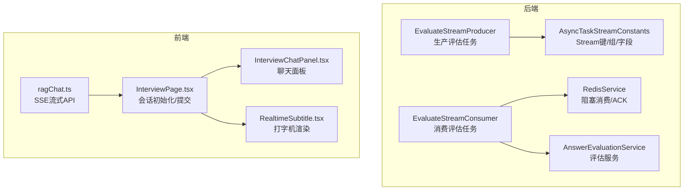
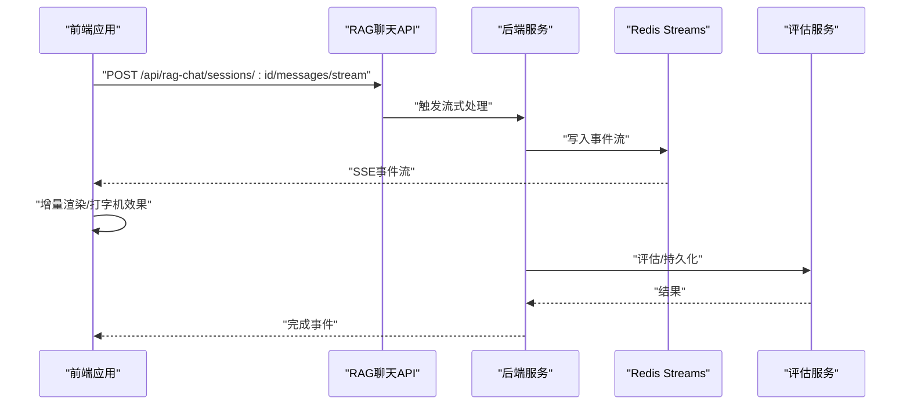
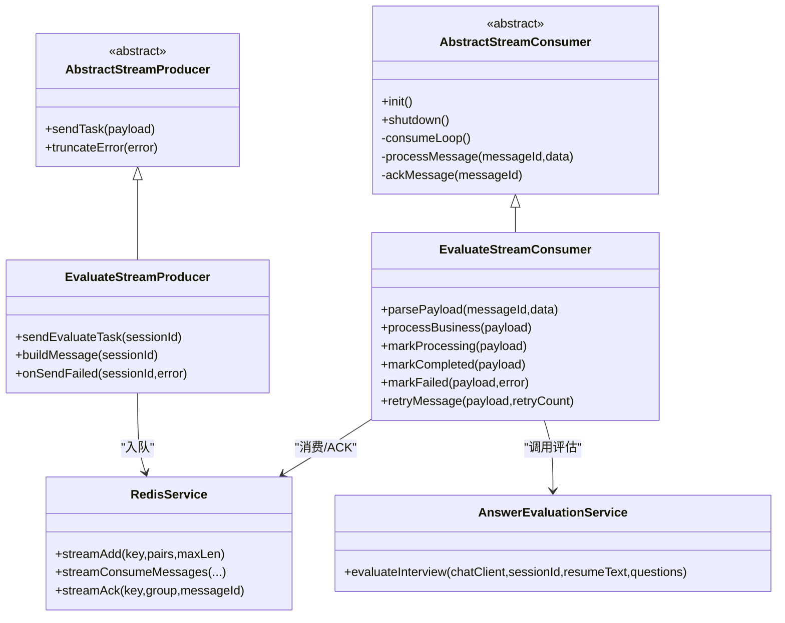
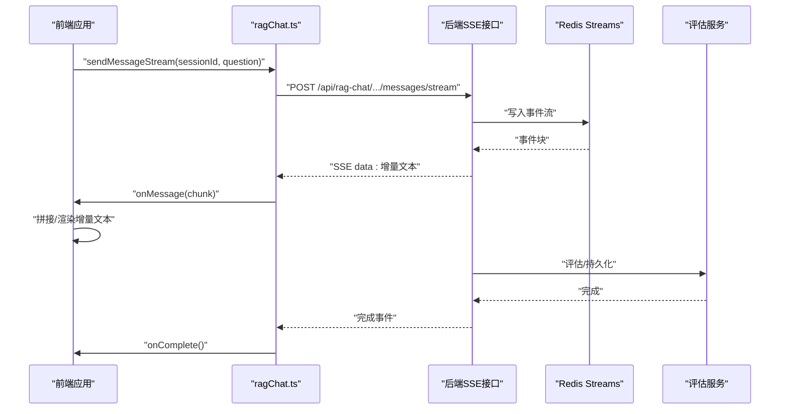
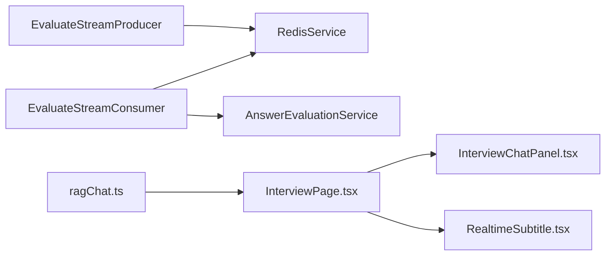

# 流式响应交互

<cite>
**本文引用的文件**   
- [AbstractStreamConsumer.java](file://app/src/main/java/interview/guide/common/async/AbstractStreamConsumer.java)
- [AbstractStreamProducer.java](file://app/src/main/java/interview/guide/common/async/AbstractStreamProducer.java)
- [AsyncTaskStreamConstants.java](file://app/src/main/java/interview/guide/common/constant/AsyncTaskStreamConstants.java)
- [EvaluateStreamConsumer.java](file://app/src/main/java/interview/guide/modules/interview/listener/EvaluateStreamConsumer.java)
- [EvaluateStreamProducer.java](file://app/src/main/java/interview/guide/modules/interview/listener/EvaluateStreamProducer.java)
- [AnswerEvaluationService.java](file://app/src/main/java/interview/guide/modules/interview/service/AnswerEvaluationService.java)
- [RedisService.java](file://app/src/main/java/interview/guide/infrastructure/redis/RedisService.java)
- [InterviewChatPanel.tsx](file://frontend/src/components/InterviewChatPanel.tsx)
- [InterviewPage.tsx](file://frontend/src/pages/InterviewPage.tsx)
- [RealtimeSubtitle.tsx](file://frontend/src/components/RealtimeSubtitle.tsx)
- [ragChat.ts](file://frontend/src/api/ragChat.ts)
- [DashscopeLlmService.java](file://app/src/main/java/interview/guide/modules/voiceinterview/service/DashscopeLlmService.java)
- [QwenTtsService.java](file://app/src/main/java/interview/guide/modules/voiceinterview/service/QwenTtsService.java)
- [README.md（SSE 示例）](file://sse-demo/README.md)
</cite>

## 目录
1. [引言](#引言)
2. [项目结构](#项目结构)
3. [核心组件](#核心组件)
4. [架构总览](#架构总览)
5. [详细组件分析](#详细组件分析)
6. [依赖分析](#依赖分析)
7. [性能考虑](#性能考虑)
8. [故障排查指南](#故障排查指南)
9. [结论](#结论)
10. [附录](#附录)

## 引言
本文件围绕“流式响应交互”能力，系统性梳理后端基于 Redis Streams 的异步事件生产/消费架构与前端基于 SSE 的实时渲染与交互体验。重点覆盖以下主题：
- SSE 技术实现：连接建立、事件推送、断线重连、心跳机制
- 流式数据传输协议：事件格式、编码方式、缓冲策略、背压处理
- 打字机式响应效果：前端实时渲染、滚动控制、光标管理、用户体验优化
- 后端流式处理架构：事件生产者/消费者模式、异步处理、错误恢复
- 性能优化策略：内存管理、网络传输、并发控制、资源清理
- 状态管理与错误处理：连接状态监控、异常捕获、重试策略、降级方案
- 调试工具与监控指标：可操作的可观测性建议

## 项目结构
本仓库在后端通过 Redis Streams 实现异步任务编排，在前端通过 SSE 实现流式数据接收与渲染。关键位置如下：
- 后端异步任务框架：抽象生产者/消费者模板与通用常量
- 面试评估任务：生产者负责入队，消费者负责消费与评估
- Redis 服务：提供阻塞式消费、ACK、重试等基础设施
- 前端 RAG 聊天：SSE 流式接收与增量渲染
- 前端面试聊天：打字机式渲染与滚动控制
- SSE 示例工程：概念验证与参考实现

图表来源
- [EvaluateStreamProducer.java:19-78](file://app/src/main/java/interview/guide/modules/interview/listener/EvaluateStreamProducer.java#L19-L78)
- [EvaluateStreamConsumer.java:30-185](file://app/src/main/java/interview/guide/modules/interview/listener/EvaluateStreamConsumer.java#L30-L185)
- [RedisService.java:212-232](file://app/src/main/java/interview/guide/infrastructure/redis/RedisService.java#L212-L232)
- [AsyncTaskStreamConstants.java:1-135](file://app/src/main/java/interview/guide/common/constant/AsyncTaskStreamConstants.java#L1-L135)
- [AnswerEvaluationService.java:25-99](file://app/src/main/java/interview/guide/modules/interview/service/AnswerEvaluationService.java#L25-L99)
- [InterviewPage.tsx:35-292](file://frontend/src/pages/InterviewPage.tsx#L35-L292)
- [InterviewChatPanel.tsx:31-151](file://frontend/src/components/InterviewChatPanel.tsx#L31-L151)
- [RealtimeSubtitle.tsx:18-151](file://frontend/src/components/RealtimeSubtitle.tsx#L18-L151)
- [ragChat.ts:108-218](file://frontend/src/api/ragChat.ts#L108-L218)

章节来源
- [EvaluateStreamProducer.java:19-78](file://app/src/main/java/interview/guide/modules/interview/listener/EvaluateStreamProducer.java#L19-L78)
- [EvaluateStreamConsumer.java:30-185](file://app/src/main/java/interview/guide/modules/interview/listener/EvaluateStreamConsumer.java#L30-L185)
- [RedisService.java:212-232](file://app/src/main/java/interview/guide/infrastructure/redis/RedisService.java#L212-L232)
- [AsyncTaskStreamConstants.java:1-135](file://app/src/main/java/interview/guide/common/constant/AsyncTaskStreamConstants.java#L1-L135)
- [InterviewPage.tsx:35-292](file://frontend/src/pages/InterviewPage.tsx#L35-L292)
- [InterviewChatPanel.tsx:31-151](file://frontend/src/components/InterviewChatPanel.tsx#L31-L151)
- [RealtimeSubtitle.tsx:18-151](file://frontend/src/components/RealtimeSubtitle.tsx#L18-L151)
- [ragChat.ts:108-218](file://frontend/src/api/ragChat.ts#L108-L218)

## 核心组件
- 抽象生产者/消费者模板：统一消息发送骨架、失败处理、重试与 ACK；消费者侧提供阻塞式消费循环与生命周期管理。
- 通用常量：定义 Redis Stream 键、消费者组、字段名、批大小、轮询间隔、最大长度等。
- 面试评估任务：生产者将会话 ID 入队，消费者拉取消息、标记处理、调用评估服务、保存报告、ACK。
- Redis 服务：提供阻塞式消费、ACK、重试入队等能力。
- 前端 RAG 聊天：通过 fetch + ReadableStream 订阅 SSE，解析 data 块，增量渲染。
- 前端面试聊天：打字机式渲染、平滑滚动、高亮当前消息、光标闪烁。

章节来源
- [AbstractStreamConsumer.java:24-176](file://app/src/main/java/interview/guide/common/async/AbstractStreamConsumer.java#L24-L176)
- [AbstractStreamProducer.java:14-55](file://app/src/main/java/interview/guide/common/async/AbstractStreamProducer.java#L14-L55)
- [AsyncTaskStreamConstants.java:7-135](file://app/src/main/java/interview/guide/common/constant/AsyncTaskStreamConstants.java#L7-L135)
- [EvaluateStreamConsumer.java:30-185](file://app/src/main/java/interview/guide/modules/interview/listener/EvaluateStreamConsumer.java#L30-L185)
- [EvaluateStreamProducer.java:19-78](file://app/src/main/java/interview/guide/modules/interview/listener/EvaluateStreamProducer.java#L19-L78)
- [RedisService.java:212-232](file://app/src/main/java/interview/guide/infrastructure/redis/RedisService.java#L212-L232)
- [ragChat.ts:108-218](file://frontend/src/api/ragChat.ts#L108-L218)
- [InterviewChatPanel.tsx:31-151](file://frontend/src/components/InterviewChatPanel.tsx#L31-L151)
- [RealtimeSubtitle.tsx:18-151](file://frontend/src/components/RealtimeSubtitle.tsx#L18-L151)

## 架构总览
后端采用“生产者-消费者”模式，通过 Redis Streams 解耦任务产生与处理，支持重试、ACK、限长裁剪。前端通过 SSE 接收增量数据，实现打字机式渲染与实时反馈。

图表来源
- [ragChat.ts:108-218](file://frontend/src/api/ragChat.ts#L108-L218)
- [EvaluateStreamConsumer.java:104-134](file://app/src/main/java/interview/guide/modules/interview/listener/EvaluateStreamConsumer.java#L104-L134)
- [AnswerEvaluationService.java:45-75](file://app/src/main/java/interview/guide/modules/interview/service/AnswerEvaluationService.java#L45-L75)

## 详细组件分析

### 后端：Redis Streams 异步任务（面试评估）
- 生产者职责：构建消息负载（包含会话ID与重试计数），入队至指定 Stream 键，失败时回调落库状态。
- 消费者职责：阻塞拉取消息，解析负载，标记处理，执行业务（调用评估服务），保存报告，ACK；异常时根据重试阈值决定重试入队或标记失败。
- 常量配置：批大小、轮询间隔、最大长度、消费者组与键名等集中管理，便于运维与调优。

图表来源
- [AbstractStreamProducer.java:14-55](file://app/src/main/java/interview/guide/common/async/AbstractStreamProducer.java#L14-L55)
- [AbstractStreamConsumer.java:24-176](file://app/src/main/java/interview/guide/common/async/AbstractStreamConsumer.java#L24-L176)
- [EvaluateStreamProducer.java:19-78](file://app/src/main/java/interview/guide/modules/interview/listener/EvaluateStreamProducer.java#L19-L78)
- [EvaluateStreamConsumer.java:30-185](file://app/src/main/java/interview/guide/modules/interview/listener/EvaluateStreamConsumer.java#L30-L185)
- [RedisService.java:212-232](file://app/src/main/java/interview/guide/infrastructure/redis/RedisService.java#L212-L232)
- [AnswerEvaluationService.java:25-99](file://app/src/main/java/interview/guide/modules/interview/service/AnswerEvaluationService.java#L25-L99)

章节来源
- [EvaluateStreamProducer.java:19-78](file://app/src/main/java/interview/guide/modules/interview/listener/EvaluateStreamProducer.java#L19-L78)
- [EvaluateStreamConsumer.java:30-185](file://app/src/main/java/interview/guide/modules/interview/listener/EvaluateStreamConsumer.java#L30-L185)
- [AbstractStreamConsumer.java:24-176](file://app/src/main/java/interview/guide/common/async/AbstractStreamConsumer.java#L24-L176)
- [AbstractStreamProducer.java:14-55](file://app/src/main/java/interview/guide/common/async/AbstractStreamProducer.java#L14-L55)
- [AsyncTaskStreamConstants.java:7-135](file://app/src/main/java/interview/guide/common/constant/AsyncTaskStreamConstants.java#L7-L135)
- [RedisService.java:212-232](file://app/src/main/java/interview/guide/infrastructure/redis/RedisService.java#L212-L232)

### 前端：SSE 流式响应与打字机渲染
- SSE 客户端：通过 fetch 获取 ReadableStream，逐块解码，解析 data 行，还原转义字符，增量回调 onMessage，完成时回调 onComplete。
- 打字机效果：对当前 AI 文本进行逐字符渲染，配合滚动到底部与高亮，增强实时感。
- 聊天面板：结合 Virtuoso 实现虚拟滚动，平滑跟随输出，保证长对话性能。

图表来源
- [ragChat.ts:108-218](file://frontend/src/api/ragChat.ts#L108-L218)
- [EvaluateStreamConsumer.java:104-134](file://app/src/main/java/interview/guide/modules/interview/listener/EvaluateStreamConsumer.java#L104-L134)
- [AnswerEvaluationService.java:45-75](file://app/src/main/java/interview/guide/modules/interview/service/AnswerEvaluationService.java#L45-L75)

章节来源
- [ragChat.ts:108-218](file://frontend/src/api/ragChat.ts#L108-L218)
- [InterviewChatPanel.tsx:31-151](file://frontend/src/components/InterviewChatPanel.tsx#L31-L151)
- [RealtimeSubtitle.tsx:18-151](file://frontend/src/components/RealtimeSubtitle.tsx#L18-L151)

### SSE 协议与事件格式
- 事件格式：SSE 事件由多行组成，以 data: 开头承载数据块，以 \n\n 分隔事件；客户端需正确解析与合并。
- 编码方式：前端使用 TextDecoder 流式解码，避免一次性缓冲大块数据。
- 缓冲策略：后端设置合适的超时与批大小，前端按块消费，避免内存峰值。
- 背压处理：后端通过批大小与阻塞等待控制速率；前端通过增量渲染降低 DOM 压力。

章节来源
- [README.md（SSE 示例）:70-98](file://sse-demo/README.md#L70-L98)
- [ragChat.ts:146-212](file://frontend/src/api/ragChat.ts#L146-L212)

### 断线重连与心跳机制
- 断线重连：前端在 SSE 连接错误时应具备重试与回退策略，避免无限重试导致资源浪费。
- 心跳机制：SSE 支持 ping/heartbeat 事件，前端可据此判断连接健康与延迟。
- Nginx 配置：示例工程强调禁用代理缓冲以确保实时性。

章节来源
- [README.md（SSE 示例）:86-98](file://sse-demo/README.md#L86-L98)

## 依赖分析
- 后端：消费者依赖 RedisService 进行阻塞消费与 ACK；依赖评估服务执行业务；生产者依赖 RedisService 入队。
- 前端：RAG 聊天 API 依赖 fetch + ReadableStream；聊天面板依赖 Virtuoso 与动画库；打字机组件依赖动画与滚动控制。

图表来源
- [EvaluateStreamConsumer.java:30-185](file://app/src/main/java/interview/guide/modules/interview/listener/EvaluateStreamConsumer.java#L30-L185)
- [EvaluateStreamProducer.java:19-78](file://app/src/main/java/interview/guide/modules/interview/listener/EvaluateStreamProducer.java#L19-L78)
- [RedisService.java:212-232](file://app/src/main/java/interview/guide/infrastructure/redis/RedisService.java#L212-L232)
- [AnswerEvaluationService.java:25-99](file://app/src/main/java/interview/guide/modules/interview/service/AnswerEvaluationService.java#L25-L99)
- [InterviewPage.tsx:35-292](file://frontend/src/pages/InterviewPage.tsx#L35-L292)
- [InterviewChatPanel.tsx:31-151](file://frontend/src/components/InterviewChatPanel.tsx#L31-L151)
- [RealtimeSubtitle.tsx:18-151](file://frontend/src/components/RealtimeSubtitle.tsx#L18-L151)
- [ragChat.ts:108-218](file://frontend/src/api/ragChat.ts#L108-L218)

章节来源
- [EvaluateStreamConsumer.java:30-185](file://app/src/main/java/interview/guide/modules/interview/listener/EvaluateStreamConsumer.java#L30-L185)
- [EvaluateStreamProducer.java:19-78](file://app/src/main/java/interview/guide/modules/interview/listener/EvaluateStreamProducer.java#L19-L78)
- [RedisService.java:212-232](file://app/src/main/java/interview/guide/infrastructure/redis/RedisService.java#L212-L232)
- [InterviewPage.tsx:35-292](file://frontend/src/pages/InterviewPage.tsx#L35-L292)
- [InterviewChatPanel.tsx:31-151](file://frontend/src/components/InterviewChatPanel.tsx#L31-L151)
- [RealtimeSubtitle.tsx:18-151](file://frontend/src/components/RealtimeSubtitle.tsx#L18-L151)
- [ragChat.ts:108-218](file://frontend/src/api/ragChat.ts#L108-L218)

## 性能考虑
- 内存管理：前端按块解码与增量渲染，避免一次性拼接大字符串；后端批处理与限长裁剪，防止消息无限增长。
- 网络传输：禁用代理缓冲（如 Nginx），减少延迟与放大效应；合理设置 SSE 超时与心跳。
- 并发控制：后端消费者线程池固定为 1，避免过度并发；前端虚拟滚动与节流/防抖提升渲染性能。
- 资源清理：消费者生命周期内及时 ACK；异常路径中重试入队与失败标记，避免悬挂消息。

章节来源
- [AsyncTaskStreamConstants.java:27-46](file://app/src/main/java/interview/guide/common/constant/AsyncTaskStreamConstants.java#L27-L46)
- [AbstractStreamConsumer.java:46-62](file://app/src/main/java/interview/guide/common/async/AbstractStreamConsumer.java#L46-L62)
- [README.md（SSE 示例）:86-98](file://sse-demo/README.md#L86-L98)
- [InterviewChatPanel.tsx:80-98](file://frontend/src/components/InterviewChatPanel.tsx#L80-L98)

## 故障排查指南
- 连接状态监控：前端监听 SSE 的 onerror 与 close，记录错误信息并触发重试；后端日志记录消费者启动/关闭与异常。
- 异常捕获：消费者在处理异常时记录错误并根据重试阈值决定重试或失败标记；生产者发送失败时落库状态。
- 重试策略：最大重试次数与重试入队；超过阈值则标记失败并截断错误信息。
- 降级方案：当评估服务不可用时，前端显示占位与提示；后端将失败状态写入会话以便用户感知。

章节来源
- [AbstractStreamConsumer.java:85-123](file://app/src/main/java/interview/guide/common/async/AbstractStreamConsumer.java#L85-L123)
- [AbstractStreamProducer.java:22-36](file://app/src/main/java/interview/guide/common/async/AbstractStreamProducer.java#L22-L36)
- [EvaluateStreamProducer.java:61-76](file://app/src/main/java/interview/guide/modules/interview/listener/EvaluateStreamProducer.java#L61-L76)
- [EvaluateStreamConsumer.java:147-166](file://app/src/main/java/interview/guide/modules/interview/listener/EvaluateStreamConsumer.java#L147-L166)

## 结论
本项目通过 Redis Streams 实现可靠的异步任务编排，结合前端 SSE 流式渲染，提供了低延迟、可扩展的流式响应交互体验。通过统一的生产者/消费者模板、明确的事件格式与缓冲策略、以及完善的错误处理与重试机制，系统在复杂场景下仍能保持稳定与高性能。

## 附录
- SSE 示例工程：包含后端 Spring Boot 与前端 React 的完整示例，涵盖心跳、进度事件与自定义事件等场景，可作为概念验证与最佳实践参考。
- 语音面试相关服务：提供基于 WebSocket 的实时 TTS 与 LLM 对话能力，可与流式响应交互结合，形成更丰富的实时交互形态。

章节来源
- [README.md（SSE 示例）:1-103](file://sse-demo/README.md#L1-L103)
- [DashscopeLlmService.java:35-61](file://app/src/main/java/interview/guide/modules/voiceinterview/service/DashscopeLlmService.java#L35-L61)
- [QwenTtsService.java:20-63](file://app/src/main/java/interview/guide/modules/voiceinterview/service/QwenTtsService.java#L20-L63)