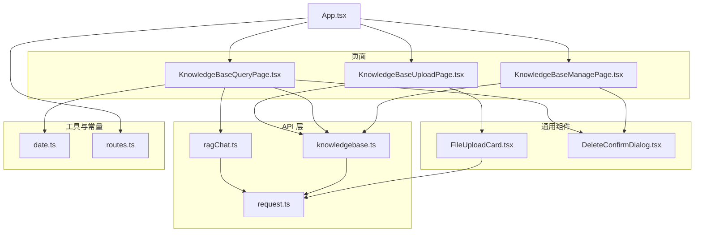
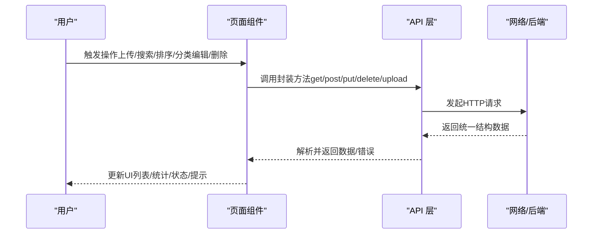
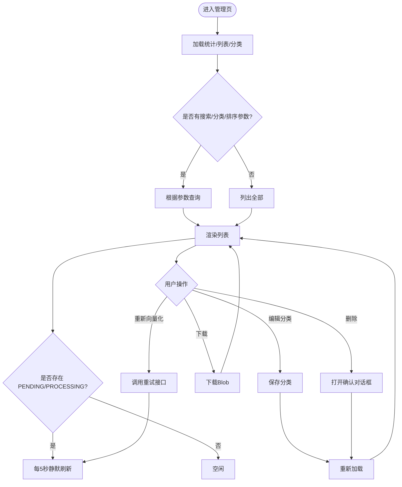
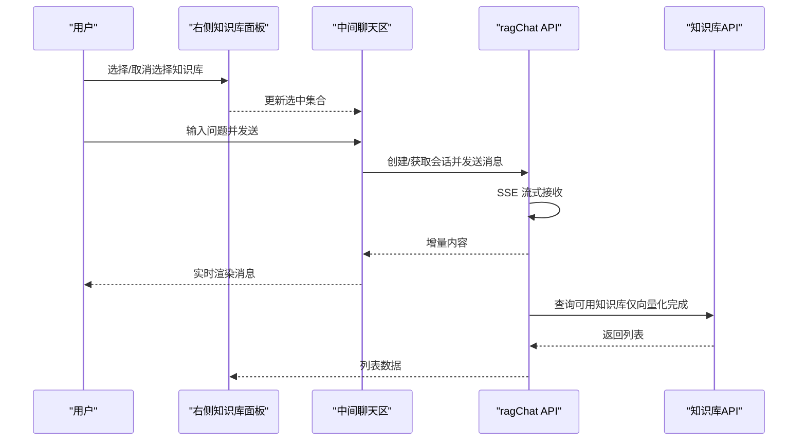
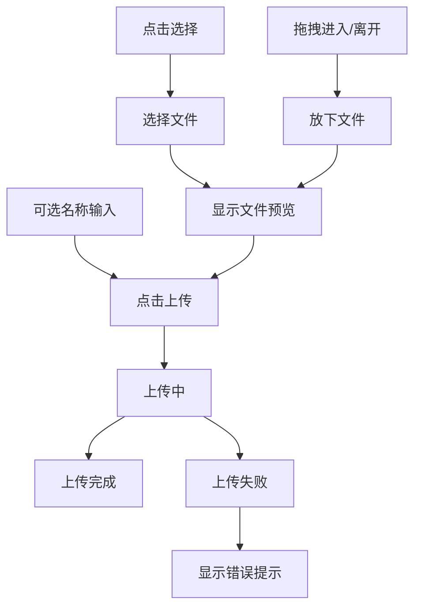
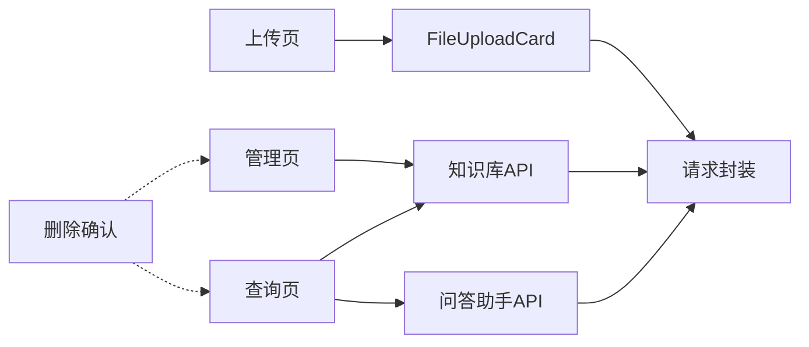

# 知识库界面管理

<cite>
**本文引用的文件**
- [KnowledgeBaseManagePage.tsx](file://frontend/src/pages/KnowledgeBaseManagePage.tsx)
- [KnowledgeBaseQueryPage.tsx](file://frontend/src/pages/KnowledgeBaseQueryPage.tsx)
- [KnowledgeBaseUploadPage.tsx](file://frontend/src/pages/KnowledgeBaseUploadPage.tsx)
- [FileUploadCard.tsx](file://frontend/src/components/FileUploadCard.tsx)
- [knowledgebase.ts](file://frontend/src/api/knowledgebase.ts)
- [request.ts](file://frontend/src/api/request.ts)
- [ragChat.ts](file://frontend/src/api/ragChat.ts)
- [DeleteConfirmDialog.tsx](file://frontend/src/components/DeleteConfirmDialog.tsx)
- [date.ts](file://frontend/src/utils/date.ts)
- [routes.ts](file://frontend/src/constants/routes.ts)
- [App.tsx](file://frontend/src/App.tsx)
</cite>

## 目录
1. [简介](#简介)
2. [项目结构](#项目结构)
3. [核心组件](#核心组件)
4. [架构总览](#架构总览)
5. [详细组件分析](#详细组件分析)
6. [依赖关系分析](#依赖关系分析)
7. [性能考量](#性能考量)
8. [故障排查指南](#故障排查指南)
9. [结论](#结论)
10. [附录](#附录)

## 简介
本文件面向前端开发者，系统化梳理知识库界面管理功能的前端实现，覆盖以下方面：
- 知识库管理页面的组件架构与交互设计
- 知识库查询页面的交互流程与体验优化
- 文件上传组件的拖拽、进度、错误提示与类型校验
- 知识库状态管理与可视化（向量化状态、分类标签、统计信息）
- 前端API封装（请求/响应/错误/加载状态）
- 响应式与移动端适配、可访问性与国际化建议

## 项目结构
知识库相关前端位于 frontend/src，主要涉及三类文件：
- 页面组件：知识库管理、知识库查询、知识库上传
- 通用组件：文件上传卡片、删除确认对话框
- API 层：知识库与问答助手的请求封装
- 工具与常量：日期格式化、路由常量
- 应用入口与路由：App.tsx 中的路由与页面包装器

图表来源
- [KnowledgeBaseManagePage.tsx:115-604](file://frontend/src/pages/KnowledgeBaseManagePage.tsx#L115-L604)
- [KnowledgeBaseQueryPage.tsx:31-843](file://frontend/src/pages/KnowledgeBaseQueryPage.tsx#L31-L843)
- [KnowledgeBaseUploadPage.tsx:11-48](file://frontend/src/pages/KnowledgeBaseUploadPage.tsx#L11-L48)
- [FileUploadCard.tsx:38-292](file://frontend/src/components/FileUploadCard.tsx#L38-L292)
- [knowledgebase.ts:62-281](file://frontend/src/api/knowledgebase.ts#L62-L281)
- [request.ts:77-128](file://frontend/src/api/request.ts#L77-L128)
- [ragChat.ts:53-218](file://frontend/src/api/ragChat.ts#L53-L218)
- [DeleteConfirmDialog.tsx:25-60](file://frontend/src/components/DeleteConfirmDialog.tsx#L25-L60)
- [date.ts:11-60](file://frontend/src/utils/date.ts#L11-L60)
- [routes.ts:1-6](file://frontend/src/constants/routes.ts#L1-L6)
- [App.tsx:206-371](file://frontend/src/App.tsx#L206-L371)

章节来源
- [App.tsx:206-371](file://frontend/src/App.tsx#L206-L371)
- [routes.ts:1-6](file://frontend/src/constants/routes.ts#L1-L6)

## 核心组件
- 知识库管理页面：提供统计卡片、搜索/排序/分类筛选、列表项（含分类编辑、状态指示、操作按钮）、轮询刷新、删除确认等能力。
- 知识库查询页面：左侧会话历史、中间聊天区域、右侧知识库选择面板；支持多知识库选择、流式回答、会话管理。
- 文件上传页面：基于 FileUploadCard 的上传表单，支持拖拽、文件选择、名称输入、错误提示与上传流程。
- 通用组件：FileUploadCard（拖拽/选择/预览/上传）、DeleteConfirmDialog（通用删除确认）。
- API 封装：统一请求封装、知识库与问答助手 API、流式 SSE 处理。

章节来源
- [KnowledgeBaseManagePage.tsx:115-604](file://frontend/src/pages/KnowledgeBaseManagePage.tsx#L115-L604)
- [KnowledgeBaseQueryPage.tsx:31-843](file://frontend/src/pages/KnowledgeBaseQueryPage.tsx#L31-L843)
- [KnowledgeBaseUploadPage.tsx:11-48](file://frontend/src/pages/KnowledgeBaseUploadPage.tsx#L11-L48)
- [FileUploadCard.tsx:38-292](file://frontend/src/components/FileUploadCard.tsx#L38-L292)
- [DeleteConfirmDialog.tsx:25-60](file://frontend/src/components/DeleteConfirmDialog.tsx#L25-L60)
- [knowledgebase.ts:62-281](file://frontend/src/api/knowledgebase.ts#L62-L281)
- [request.ts:77-128](file://frontend/src/api/request.ts#L77-L128)
- [ragChat.ts:53-218](file://frontend/src/api/ragChat.ts#L53-L218)

## 架构总览
前端采用“页面组件 + 通用组件 + API 层”的分层设计：
- 页面组件负责业务编排与状态管理
- 通用组件复用 UI 与交互逻辑
- API 层统一处理请求、响应与错误
- 路由层负责页面导航与包装器

图表来源
- [request.ts:77-128](file://frontend/src/api/request.ts#L77-L128)
- [knowledgebase.ts:62-281](file://frontend/src/api/knowledgebase.ts#L62-L281)
- [ragChat.ts:53-218](file://frontend/src/api/ragChat.ts#L53-L218)

## 详细组件分析

### 知识库管理页面（列表与状态管理）
- 功能要点
  - 统计卡片：总数、总提问次数、总访问次数
  - 搜索/排序/分类筛选：三者互斥触发，避免重复请求
  - 列表项：名称/原文件名、分类（可内联编辑）、大小、向量化状态（图标+文本）、提问次数、上传时间
  - 操作按钮：下载、重新向量化（仅失败态）、删除
  - 轮询：当存在 PENDING/PROCESSING 时，每 5 秒静默刷新
  - 删除确认：统一 DeleteConfirmDialog
- 状态与数据流
  - stats、knowledgeBases、categories、loading、searchKeyword、sortBy、selectedCategory、editingCategoryId、revectorizing、deleting
  - loadData/loadDataSilent 区分是否显示加载态
- 交互细节
  - 分类编辑：进入编辑态后自动聚焦输入框，支持 Enter 保存、Esc 取消
  - 下载：调用知识库 API 下载 Blob 并触发浏览器下载
  - 重新向量化：仅在 FAILED 状态显示按钮，支持禁用与旋转动画
- 性能与体验
  - 列表项逐条入场动画
  - framer-motion 的过渡与骨架屏思路
  - 无数据时的引导按钮

图表来源
- [KnowledgeBaseManagePage.tsx:135-195](file://frontend/src/pages/KnowledgeBaseManagePage.tsx#L135-L195)
- [KnowledgeBaseManagePage.tsx:210-240](file://frontend/src/pages/KnowledgeBaseManagePage.tsx#L210-L240)
- [KnowledgeBaseManagePage.tsx:242-281](file://frontend/src/pages/KnowledgeBaseManagePage.tsx#L242-L281)
- [knowledgebase.ts:62-181](file://frontend/src/api/knowledgebase.ts#L62-L181)

章节来源
- [KnowledgeBaseManagePage.tsx:115-604](file://frontend/src/pages/KnowledgeBaseManagePage.tsx#L115-L604)
- [knowledgebase.ts:62-181](file://frontend/src/api/knowledgebase.ts#L62-L181)
- [DeleteConfirmDialog.tsx:25-60](file://frontend/src/components/DeleteConfirmDialog.tsx#L25-L60)

### 知识库查询页面（问答助手）
- 功能要点
  - 左侧：会话历史列表（支持置顶、编辑标题、删除、新建）
  - 中间：消息列表（用户/助手消息，Markdown 渲染，代码块高亮）
  - 右侧：知识库选择面板（分类分组、展开/折叠、多选）
  - 流式回答：SSE 接收增量内容，使用 requestAnimationFrame 控制渲染节流
  - 会话管理：创建/加载/更新标题/切换置顶/删除
- 数据与状态
  - knowledgeBases、selectedKbIds、sessions、currentSessionId、messages、loading、loadingList、loadingSessions
  - groupedKnowledgeBases：按分类分组并排序，未分类放末尾
- 交互细节
  - 搜索：支持关键词搜索，清空关键词回到全部列表
  - 排序：时间/大小/访问/提问
  - 多知识库选择：勾选后会话标题动态变化
  - Markdown：remarkGfm 插件，代码块通过 CodeBlock 组件渲染
- 性能与体验
  - Virtuoso 虚拟滚动，提升长消息列表性能
  - useTransition + requestAnimationFrame 节流渲染，避免频繁重绘
  - 右侧面板可展开/收起，移动端友好

图表来源
- [KnowledgeBaseQueryPage.tsx:31-843](file://frontend/src/pages/KnowledgeBaseQueryPage.tsx#L31-L843)
- [ragChat.ts:53-218](file://frontend/src/api/ragChat.ts#L53-L218)
- [knowledgebase.ts:88-101](file://frontend/src/api/knowledgebase.ts#L88-L101)

章节来源
- [KnowledgeBaseQueryPage.tsx:31-843](file://frontend/src/pages/KnowledgeBaseQueryPage.tsx#L31-L843)
- [ragChat.ts:53-218](file://frontend/src/api/ragChat.ts#L53-L218)
- [knowledgebase.ts:88-101](file://frontend/src/api/knowledgebase.ts#L88-L101)

### 文件上传组件（拖拽/进度/错误）
- 功能要点
  - 拖拽区域：支持拖拽进入/离开/放下，视觉反馈（渐变边框、图标动画）
  - 文件选择：点击或拖拽选择文件，显示文件名与大小
  - 名称输入：可选，支持留空使用文件名
  - 上传按钮：禁用状态、加载动画、错误提示
  - 错误处理：统一错误提示，网络/后端错误分别处理
- 交互细节
  - DragEvent 防止默认行为，保持拖拽状态
  - onFileSelect 回调用于外部联动（如预览）
  - onUpload 回调传递文件与可选名称
- 性能与体验
  - 动画与过渡增强交互反馈
  - 上传超时延长至 5 分钟，适配大文件

图表来源
- [FileUploadCard.tsx:38-292](file://frontend/src/components/FileUploadCard.tsx#L38-L292)
- [request.ts:98-115](file://frontend/src/api/request.ts#L98-L115)

章节来源
- [FileUploadCard.tsx:38-292](file://frontend/src/components/FileUploadCard.tsx#L38-L292)
- [request.ts:98-115](file://frontend/src/api/request.ts#L98-L115)

### 知识库状态管理与可视化
- 向量化状态
  - 状态枚举：PENDING、PROCESSING、COMPLETED、FAILED
  - 图标与文本：不同状态对应不同颜色与图标
  - 轮询刷新：当存在 PENDING/PROCESSING 时自动刷新
- 分类标签管理
  - 内联编辑：鼠标悬停显示编辑按钮，Enter 保存，Esc 取消
  - 分类建议：下拉 datalist 提示
- 统计信息展示
  - 总数、总提问次数、总访问次数、各状态数量

章节来源
- [KnowledgeBaseManagePage.tsx:52-82](file://frontend/src/pages/KnowledgeBaseManagePage.tsx#L52-L82)
- [KnowledgeBaseManagePage.tsx:182-195](file://frontend/src/pages/KnowledgeBaseManagePage.tsx#L182-L195)
- [knowledgebase.ts:6-32](file://frontend/src/api/knowledgebase.ts#L6-L32)

### 前端API封装（请求/响应/错误/加载）
- 统一响应结构
  - 后端约定：HTTP 200 + Result(code/message/data)
  - 成功：返回 data；失败：抛出 message
- 请求方法
  - get/post/put/patch/delete/upload
  - upload 超时 5 分钟，适配大文件
- 错误处理
  - 网络错误：区分上传与普通请求，给出明确提示
  - 无响应：上传失败时提示超时/中断
- 流式接口
  - 知识库查询与问答助手均使用 fetch + SSE，自定义解析与错误处理

章节来源
- [request.ts:77-128](file://frontend/src/api/request.ts#L77-L128)
- [knowledgebase.ts:187-281](file://frontend/src/api/knowledgebase.ts#L187-L281)
- [ragChat.ts:108-218](file://frontend/src/api/ragChat.ts#L108-L218)

### 响应式设计与移动端适配
- 布局调整
  - 管理页：表格列在窄屏下可横向滚动或折叠列
  - 查询页：右侧面板可展开/收起，适合窄屏
  - 聊天区：Virtuoso 虚拟滚动，保证长列表性能
- 触摸交互
  - 按钮与输入框尺寸适中，支持触控反馈
  - 拖拽上传区域视觉反馈明显
- 性能优化
  - useTransition + requestAnimationFrame 控制渲染节流
  - 动画使用 framer-motion，避免阻塞主线程

章节来源
- [KnowledgeBaseQueryPage.tsx:388-774](file://frontend/src/pages/KnowledgeBaseQueryPage.tsx#L388-L774)
- [KnowledgeBaseManagePage.tsx:289-590](file://frontend/src/pages/KnowledgeBaseManagePage.tsx#L289-L590)

### 可访问性与国际化支持
- 可访问性
  - 按钮与输入框具备键盘可达性与焦点可见性
  - 图标使用语义化 SVG，配合 title 或 aria-label
  - 错误提示具备对比度与可读性
- 国际化
  - 日期格式化使用 zh-CN locale
  - 文本内容以中文为主，可扩展为 i18n 字典

章节来源
- [date.ts:11-60](file://frontend/src/utils/date.ts#L11-L60)

## 依赖关系分析
- 页面到 API
  - 管理页：知识库 API（统计/列表/搜索/分类/删除/下载/重试）
  - 查询页：知识库 API（列表/搜索）、问答助手 API（会话/消息/SSE）
- 通用组件
  - FileUploadCard：依赖 request.ts 进行上传
  - DeleteConfirmDialog：通用删除确认，复用性强
- 路由与包装器
  - App.tsx 中的包装器负责导航与页面间状态传递

图表来源
- [KnowledgeBaseManagePage.tsx:115-604](file://frontend/src/pages/KnowledgeBaseManagePage.tsx#L115-L604)
- [KnowledgeBaseQueryPage.tsx:31-843](file://frontend/src/pages/KnowledgeBaseQueryPage.tsx#L31-L843)
- [KnowledgeBaseUploadPage.tsx:11-48](file://frontend/src/pages/KnowledgeBaseUploadPage.tsx#L11-L48)
- [FileUploadCard.tsx:38-292](file://frontend/src/components/FileUploadCard.tsx#L38-L292)
- [knowledgebase.ts:62-281](file://frontend/src/api/knowledgebase.ts#L62-L281)
- [ragChat.ts:53-218](file://frontend/src/api/ragChat.ts#L53-L218)
- [request.ts:77-128](file://frontend/src/api/request.ts#L77-L128)
- [DeleteConfirmDialog.tsx:25-60](file://frontend/src/components/DeleteConfirmDialog.tsx#L25-L60)

章节来源
- [App.tsx:206-371](file://frontend/src/App.tsx#L206-L371)

## 性能考量
- 列表渲染
  - 管理页：逐条入场动画，注意大数据量时的帧率
  - 查询页：Virtuoso 虚拟滚动，长消息列表性能稳定
- 渲染节流
  - 流式回答使用 requestAnimationFrame + useTransition，避免高频重渲染
- 请求优化
  - 统一超时策略，上传超时延长
  - 轮询策略：仅在必要时启动，避免无意义请求
- 资源加载
  - 懒加载页面组件，减少首屏负担

## 故障排查指南
- 上传失败
  - 网络超时/中断：检查网络与后端日志；前端已提示“可能是网络超时或连接中断”
  - 文件过大：确认大小限制与 Nginx 超时配置
- 下载失败
  - Blob 下载异常：检查后端响应头与 CORS 设置
- 向量化状态不更新
  - 确认轮询是否启动（存在 PENDING/PROCESSING）
  - 手动刷新或等待轮询
- 流式回答卡顿
  - 检查 SSE 连接与后端流式输出
  - 减少一次性渲染的数据量，利用虚拟滚动
- 删除确认
  - 确认 DeleteConfirmDialog 的 open/item/loading 参数正确传入

章节来源
- [request.ts:44-75](file://frontend/src/api/request.ts#L44-L75)
- [knowledgebase.ts:81-86](file://frontend/src/api/knowledgebase.ts#L81-L86)
- [KnowledgeBaseManagePage.tsx:182-195](file://frontend/src/pages/KnowledgeBaseManagePage.tsx#L182-L195)
- [KnowledgeBaseQueryPage.tsx:257-337](file://frontend/src/pages/KnowledgeBaseQueryPage.tsx#L257-L337)

## 结论
知识库界面管理功能在前端侧实现了清晰的分层架构与良好的用户体验：
- 页面组件职责明确，状态管理与交互逻辑清晰
- 通用组件复用度高，降低重复开发成本
- API 封装统一，错误与加载处理一致
- 查询页面支持多知识库与流式回答，体验流畅
- 响应式与性能优化兼顾，适合多终端使用

## 附录
- 路由与页面包装器
  - 管理页：/knowledgebase
  - 上传页：/knowledgebase/upload
  - 查询页：/knowledgebase/chat
- 常用工具
  - 日期格式化：zh-CN locale
  - 路由常量：ROUTES.knowledgebaseUpload

章节来源
- [App.tsx:206-371](file://frontend/src/App.tsx#L206-L371)
- [routes.ts:1-6](file://frontend/src/constants/routes.ts#L1-L6)
- [date.ts:11-60](file://frontend/src/utils/date.ts#L11-L60)