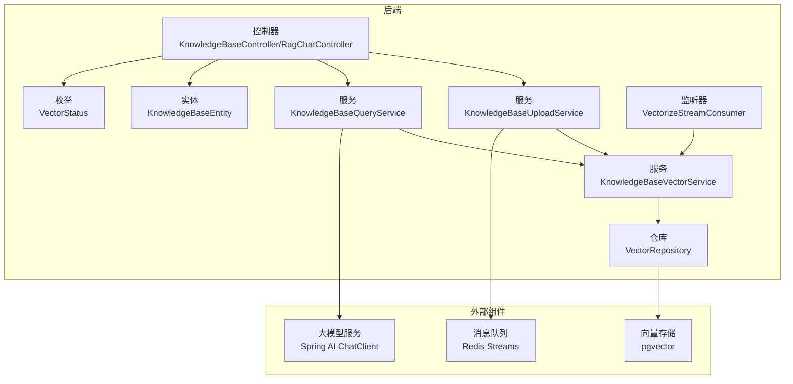
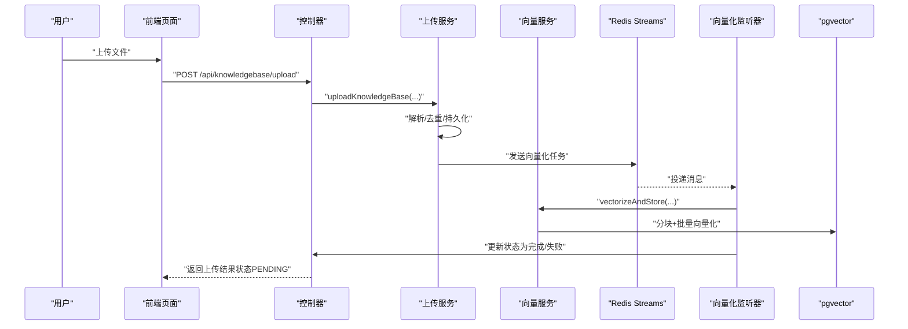
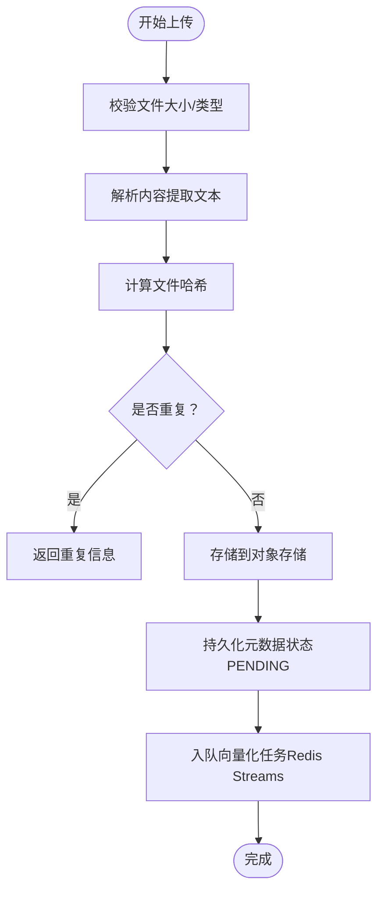
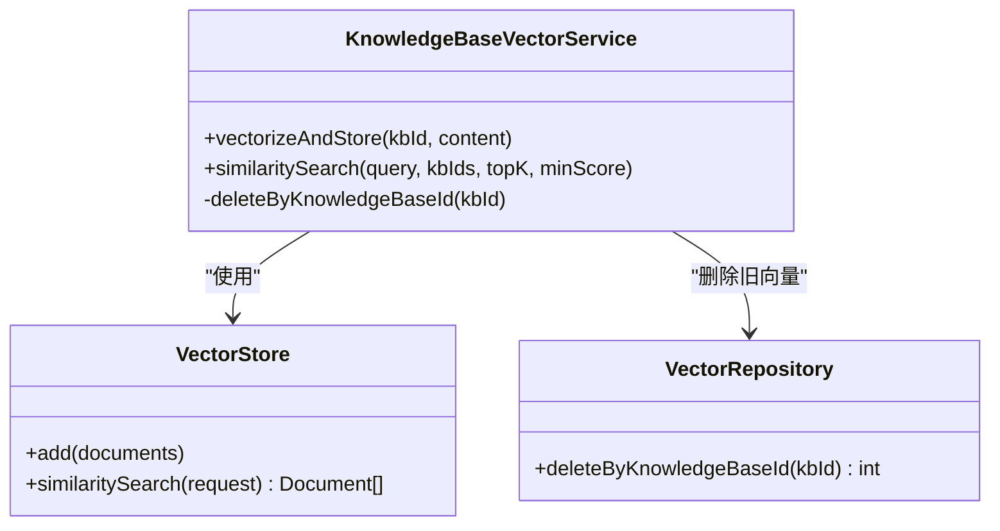
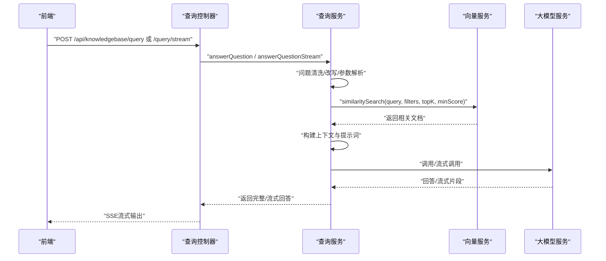
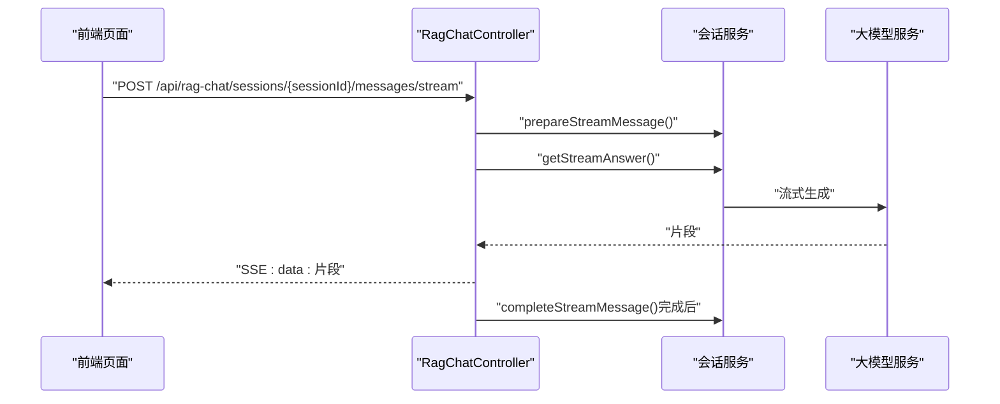
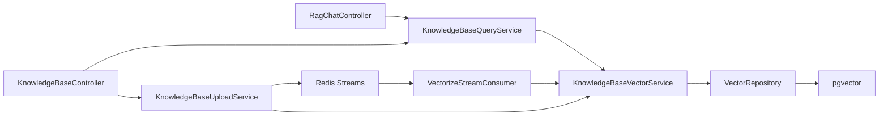

# 知识库管理模块

<cite>
**本文档引用的文件**
- [KnowledgeBaseController.java](file://app/src/main/java/interview/guide/modules/knowledgebase/KnowledgeBaseController.java)
- [RagChatController.java](file://app/src/main/java/interview/guide/modules/knowledgebase/RagChatController.java)
- [KnowledgeBaseEntity.java](file://app/src/main/java/interview/guide/modules/knowledgebase/model/KnowledgeBaseEntity.java)
- [KnowledgeBaseStatsDTO.java](file://app/src/main/java/interview/guide/modules/knowledgebase/model/KnowledgeBaseStatsDTO.java)
- [VectorStatus.java](file://app/src/main/java/interview/guide/modules/knowledgebase/model/VectorStatus.java)
- [KnowledgeBaseUploadService.java](file://app/src/main/java/interview/guide/modules/knowledgebase/service/KnowledgeBaseUploadService.java)
- [KnowledgeBaseQueryService.java](file://app/src/main/java/interview/guide/modules/knowledgebase/service/KnowledgeBaseQueryService.java)
- [KnowledgeBaseVectorService.java](file://app/src/main/java/interview/guide/modules/knowledgebase/service/KnowledgeBaseVectorService.java)
- [VectorizeStreamConsumer.java](file://app/src/main/java/interview/guide/modules/knowledgebase/listener/VectorizeStreamConsumer.java)
- [VectorRepository.java](file://app/src/main/java/interview/guide/modules/knowledgebase/repository/VectorRepository.java)
- [knowledgebase-query-rewrite.st](file://app/src/main/resources/prompts/knowledgebase-query-rewrite.st)
- [knowledgebase-query-user.st](file://app/src/main/resources/prompts/knowledgebase-query-user.st)
- [KnowledgeBaseManagePage.tsx](file://frontend/src/pages/KnowledgeBaseManagePage.tsx)
- [KnowledgeBaseQueryPage.tsx](file://frontend/src/pages/KnowledgeBaseQueryPage.tsx)
</cite>

## 目录
1. [简介](#简介)
2. [项目结构](#项目结构)
3. [核心组件](#核心组件)
4. [架构总览](#架构总览)
5. [详细组件分析](#详细组件分析)
6. [依赖关系分析](#依赖关系分析)
7. [性能考量](#性能考量)
8. [故障排查指南](#故障排查指南)
9. [结论](#结论)
10. [附录](#附录)

## 简介
本模块提供完整的知识库管理与RAG问答能力，覆盖文档上传与解析、向量索引管理、相似度检索、上下文构建与答案生成、以及基于Server-Sent Events（SSE）的流式响应体验。同时提供知识库统计、前端管理与查询页面，支持多知识库组合检索与会话式问答。

## 项目结构
- 后端采用Spring Boot + Spring AI + pgvector（通过Spring AI VectorStore集成），使用Redis Streams异步编排向量化任务。
- 前端使用React + TypeScript，提供知识库管理、查询与RAG会话交互界面。

图表来源
- [KnowledgeBaseController.java:1-211](file://app/src/main/java/interview/guide/modules/knowledgebase/KnowledgeBaseController.java#L1-L211)
- [RagChatController.java:1-138](file://app/src/main/java/interview/guide/modules/knowledgebase/RagChatController.java#L1-L138)
- [KnowledgeBaseUploadService.java:1-145](file://app/src/main/java/interview/guide/modules/knowledgebase/service/KnowledgeBaseUploadService.java#L1-L145)
- [KnowledgeBaseQueryService.java:1-461](file://app/src/main/java/interview/guide/modules/knowledgebase/service/KnowledgeBaseQueryService.java#L1-L461)
- [KnowledgeBaseVectorService.java:1-203](file://app/src/main/java/interview/guide/modules/knowledgebase/service/KnowledgeBaseVectorService.java#L1-L203)
- [VectorRepository.java:1-66](file://app/src/main/java/interview/guide/modules/knowledgebase/repository/VectorRepository.java#L1-L66)
- [VectorizeStreamConsumer.java:1-140](file://app/src/main/java/interview/guide/modules/knowledgebase/listener/VectorizeStreamConsumer.java#L1-L140)
- [KnowledgeBaseEntity.java:1-223](file://app/src/main/java/interview/guide/modules/knowledgebase/model/KnowledgeBaseEntity.java#L1-L223)
- [VectorStatus.java:1-12](file://app/src/main/java/interview/guide/modules/knowledgebase/model/VectorStatus.java#L1-L12)

章节来源
- [KnowledgeBaseController.java:1-211](file://app/src/main/java/interview/guide/modules/knowledgebase/KnowledgeBaseController.java#L1-L211)
- [RagChatController.java:1-138](file://app/src/main/java/interview/guide/modules/knowledgebase/RagChatController.java#L1-L138)

## 核心组件
- 控制器层：提供知识库管理、上传下载、查询统计、RAG会话等REST接口。
- 服务层：
  - 上传服务：校验、去重、解析、持久化、触发向量化任务。
  - 查询服务：查询改写、相似度检索、上下文构建、LLM调用、流式输出。
  - 向量服务：文本分块、批量向量化、相似度搜索、过滤与回退。
- 监听器：消费Redis Streams中的向量化任务，驱动异步处理与状态更新。
- 仓库层：直接SQL删除指定知识库的向量数据（pgvector表）。
- 模型与枚举：知识库实体、统计DTO、向量化状态。
- 前端页面：知识库管理与查询页面，支持SSE流式渲染。

章节来源
- [KnowledgeBaseUploadService.java:1-145](file://app/src/main/java/interview/guide/modules/knowledgebase/service/KnowledgeBaseUploadService.java#L1-L145)
- [KnowledgeBaseQueryService.java:1-461](file://app/src/main/java/interview/guide/modules/knowledgebase/service/KnowledgeBaseQueryService.java#L1-L461)
- [KnowledgeBaseVectorService.java:1-203](file://app/src/main/java/interview/guide/modules/knowledgebase/service/KnowledgeBaseVectorService.java#L1-L203)
- [VectorizeStreamConsumer.java:1-140](file://app/src/main/java/interview/guide/modules/knowledgebase/listener/VectorizeStreamConsumer.java#L1-L140)
- [VectorRepository.java:1-66](file://app/src/main/java/interview/guide/modules/knowledgebase/repository/VectorRepository.java#L1-L66)
- [KnowledgeBaseEntity.java:1-223](file://app/src/main/java/interview/guide/modules/knowledgebase/model/KnowledgeBaseEntity.java#L1-L223)
- [KnowledgeBaseStatsDTO.java:1-14](file://app/src/main/java/interview/guide/modules/knowledgebase/model/KnowledgeBaseStatsDTO.java#L1-L14)
- [VectorStatus.java:1-12](file://app/src/main/java/interview/guide/modules/knowledgebase/model/VectorStatus.java#L1-L12)

## 架构总览
整体采用“上传即异步向量化”的设计：上传完成后将任务推送到Redis Streams，消费者异步执行向量化并更新状态；查询时基于pgvector进行相似度检索，并结合提示词模板与LLM生成最终答案。前端通过SSE实现流式打字机效果。

图表来源
- [KnowledgeBaseUploadService.java:48-102](file://app/src/main/java/interview/guide/modules/knowledgebase/service/KnowledgeBaseUploadService.java#L48-L102)
- [VectorizeStreamConsumer.java:80-97](file://app/src/main/java/interview/guide/modules/knowledgebase/listener/VectorizeStreamConsumer.java#L80-L97)
- [KnowledgeBaseVectorService.java:45-81](file://app/src/main/java/interview/guide/modules/knowledgebase/service/KnowledgeBaseVectorService.java#L45-L81)

## 详细组件分析

### 文档上传与解析流程
- 文件验证：大小、类型校验，支持常见文档格式。
- 内容解析：提取文本内容，用于后续向量化。
- 去重：基于文件哈希判断是否重复。
- 存储：上传至对象存储，记录存储Key与URL。
- 元数据持久化：入库并标记向量化状态为待处理。
- 异步向量化：推送任务到Redis Streams，监听器消费并执行向量化，更新状态。

图表来源
- [KnowledgeBaseUploadService.java:48-102](file://app/src/main/java/interview/guide/modules/knowledgebase/service/KnowledgeBaseUploadService.java#L48-L102)

章节来源
- [KnowledgeBaseUploadService.java:1-145](file://app/src/main/java/interview/guide/modules/knowledgebase/service/KnowledgeBaseUploadService.java#L1-L145)

### 向量索引管理（pgvector）
- 文本分块：使用基于Token的分块器，统一metadata字段类型，便于过滤。
- 批量向量化：按批次上限分批提交，适配第三方Embedding服务的批量限制。
- 存储与过滤：向量存入pgvector，检索时支持按知识库ID过滤表达式。
- 删除策略：按知识库ID删除对应向量，兼容不同存储格式的元数据键。

图表来源
- [KnowledgeBaseVectorService.java:25-203](file://app/src/main/java/interview/guide/modules/knowledgebase/service/KnowledgeBaseVectorService.java#L25-L203)
- [VectorRepository.java:18-66](file://app/src/main/java/interview/guide/modules/knowledgebase/repository/VectorRepository.java#L18-L66)

章节来源
- [KnowledgeBaseVectorService.java:1-203](file://app/src/main/java/interview/guide/modules/knowledgebase/service/KnowledgeBaseVectorService.java#L1-L203)
- [VectorRepository.java:1-66](file://app/src/main/java/interview/guide/modules/knowledgebase/repository/VectorRepository.java#L1-L66)

### RAG问答系统（检索增强生成）
- 查询改写：启用时对用户问题进行改写，提升检索质量。
- 检索策略：根据问题长度动态调整TopK与最小相似度阈值；短词场景增加命中确认，避免弱相关片段误导。
- 上下文构建：合并检索到的文档片段，注入提示词模板。
- 流式输出：探测窗口机制，快速识别“无结果”模板并提前终止，其余场景实时透传。
- 错误处理：捕获异常并返回友好提示，保证用户体验。

图表来源
- [KnowledgeBaseQueryService.java:197-245](file://app/src/main/java/interview/guide/modules/knowledgebase/service/KnowledgeBaseQueryService.java#L197-L245)
- [KnowledgeBaseQueryService.java:264-281](file://app/src/main/java/interview/guide/modules/knowledgebase/service/KnowledgeBaseQueryService.java#L264-L281)
- [KnowledgeBaseQueryService.java:400-453](file://app/src/main/java/interview/guide/modules/knowledgebase/service/KnowledgeBaseQueryService.java#L400-L453)

章节来源
- [KnowledgeBaseQueryService.java:1-461](file://app/src/main/java/interview/guide/modules/knowledgebase/service/KnowledgeBaseQueryService.java#L1-L461)
- [knowledgebase-query-rewrite.st:1-11](file://app/src/main/resources/prompts/knowledgebase-query-rewrite.st#L1-L11)
- [knowledgebase-query-user.st:1-23](file://app/src/main/resources/prompts/knowledgebase-query-user.st#L1-L23)

### 流式响应（SSE）与前端交互
- 后端：控制器返回Flux<String>，前端逐片接收并拼接，实现打字机式效果。
- 前端：使用requestAnimationFrame与useTransition优化渲染，避免频繁重绘；对换行符进行转义，保证SSE格式稳定。
- 会话式问答：RagChatController支持创建/维护会话，消息流式更新，完成后回填完整内容。

图表来源
- [RagChatController.java:102-136](file://app/src/main/java/interview/guide/modules/knowledgebase/RagChatController.java#L102-L136)
- [KnowledgeBaseQueryPage.tsx:307-337](file://frontend/src/pages/KnowledgeBaseQueryPage.tsx#L307-L337)

章节来源
- [RagChatController.java:1-138](file://app/src/main/java/interview/guide/modules/knowledgebase/RagChatController.java#L1-L138)
- [KnowledgeBaseQueryPage.tsx:1-843](file://frontend/src/pages/KnowledgeBaseQueryPage.tsx#L1-L843)

### 知识库统计信息
- 统计项：知识库总数、总提问次数、总访问次数、已完成向量化数量、处理中数量。
- 数据来源：服务层聚合统计，控制器提供REST接口返回DTO。

章节来源
- [KnowledgeBaseStatsDTO.java:1-14](file://app/src/main/java/interview/guide/modules/knowledgebase/model/KnowledgeBaseStatsDTO.java#L1-L14)
- [KnowledgeBaseController.java:191-194](file://app/src/main/java/interview/guide/modules/knowledgebase/KnowledgeBaseController.java#L191-L194)

### 管理界面（前端）
- 知识库管理页：支持搜索、分类筛选、排序、状态轮询、重新向量化、下载、删除等。
- 查询页：选择知识库、创建/加载会话、流式问答、Markdown渲染、代码块高亮。
- 状态可视化：使用图标与颜色区分向量化状态，提供即时反馈。

章节来源
- [KnowledgeBaseManagePage.tsx:1-604](file://frontend/src/pages/KnowledgeBaseManagePage.tsx#L1-L604)
- [KnowledgeBaseQueryPage.tsx:1-843](file://frontend/src/pages/KnowledgeBaseQueryPage.tsx#L1-L843)

## 依赖关系分析
- 控制器依赖服务；服务依赖仓库与外部组件（向量存储、Redis、LLM）。
- 向量服务与仓库协作：删除旧向量、批量添加新向量。
- 监听器消费任务并驱动向量服务，最终更新实体状态。

图表来源
- [KnowledgeBaseController.java:39-42](file://app/src/main/java/interview/guide/modules/knowledgebase/KnowledgeBaseController.java#L39-L42)
- [RagChatController.java:26](file://app/src/main/java/interview/guide/modules/knowledgebase/RagChatController.java#L26)
- [KnowledgeBaseUploadService.java:30-36](file://app/src/main/java/interview/guide/modules/knowledgebase/service/KnowledgeBaseUploadService.java#L30-L36)
- [KnowledgeBaseQueryService.java:46-49](file://app/src/main/java/interview/guide/modules/knowledgebase/service/KnowledgeBaseQueryService.java#L46-L49)
- [VectorizeStreamConsumer.java:23-33](file://app/src/main/java/interview/guide/modules/knowledgebase/listener/VectorizeStreamConsumer.java#L23-L33)

章节来源
- [KnowledgeBaseController.java:1-211](file://app/src/main/java/interview/guide/modules/knowledgebase/KnowledgeBaseController.java#L1-L211)
- [RagChatController.java:1-138](file://app/src/main/java/interview/guide/modules/knowledgebase/RagChatController.java#L1-L138)

## 性能考量
- 向量化批处理：按批次上限分发，降低API调用频率与网络开销。
- 检索参数自适应：根据问题长度动态调整TopK与阈值，兼顾召回与性能。
- 流式输出探测：快速识别“无结果”模板，减少无效传输。
- 前端渲染优化：使用requestAnimationFrame与useTransition，避免主线程阻塞。
- 状态轮询：对处理中/待处理状态进行定时刷新，避免长轮询压力。

## 故障排查指南
- 向量化失败：检查监听器日志与状态更新，必要时触发“重新向量化”。
- 检索无结果：确认问题长度与阈值设置，尝试开启查询改写；检查知识库是否完成向量化。
- 流式中断：关注SSE事件格式与转义处理，确保前后端一致；查看控制器错误回调。
- 存储删除异常：核对pgvector表结构与元数据键，确认删除SQL执行结果。

章节来源
- [VectorizeStreamConsumer.java:95-121](file://app/src/main/java/interview/guide/modules/knowledgebase/listener/VectorizeStreamConsumer.java#L95-L121)
- [KnowledgeBaseQueryService.java:236-244](file://app/src/main/java/interview/guide/modules/knowledgebase/service/KnowledgeBaseQueryService.java#L236-L244)
- [VectorRepository.java:31-64](file://app/src/main/java/interview/guide/modules/knowledgebase/repository/VectorRepository.java#L31-L64)

## 结论
本模块通过“异步向量化 + pgvector相似度检索 + LLM生成”的完整链路，提供了稳定、可扩展的知识库管理与RAG问答能力。前端SSE流式渲染带来良好的交互体验，配合统计与状态可视化，便于运维与用户掌握知识库生命周期。

## 附录

### API概览（后端）
- 知识库管理
  - GET /api/knowledgebase/list：分页列出，支持按向量化状态与排序筛选
  - GET /api/knowledgebase/{id}：获取详情
  - DELETE /api/knowledgebase/{id}：删除
  - POST /api/knowledgebase/upload：上传文件
  - GET /api/knowledgebase/{id}/download：下载文件
  - GET /api/knowledgebase/search：关键词搜索
  - GET /api/knowledgebase/stats：统计信息
  - POST /api/knowledgebase/{id}/revectorize：重新向量化
- RAG问答
  - POST /api/knowledgebase/query：非流式问答
  - POST /api/knowledgebase/query/stream：流式问答（SSE）
  - GET /api/knowledgebase/categories：分类列表
  - GET /api/knowledgebase/category/{category}：按分类列表
  - GET /api/knowledgebase/uncategorized：未分类列表
  - PUT /api/knowledgebase/{id}/category：更新分类

章节来源
- [KnowledgeBaseController.java:47-210](file://app/src/main/java/interview/guide/modules/knowledgebase/KnowledgeBaseController.java#L47-L210)

### 前端页面要点
- 管理页：支持搜索、排序、分类筛选、状态轮询、重新向量化、下载与删除。
- 查询页：选择知识库、创建/加载会话、流式问答、Markdown渲染、代码块高亮。

章节来源
- [KnowledgeBaseManagePage.tsx:115-604](file://frontend/src/pages/KnowledgeBaseManagePage.tsx#L115-L604)
- [KnowledgeBaseQueryPage.tsx:31-843](file://frontend/src/pages/KnowledgeBaseQueryPage.tsx#L31-L843)