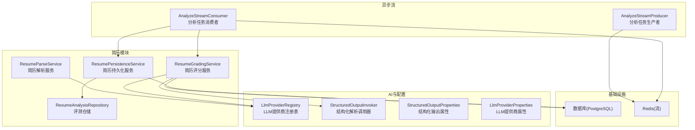
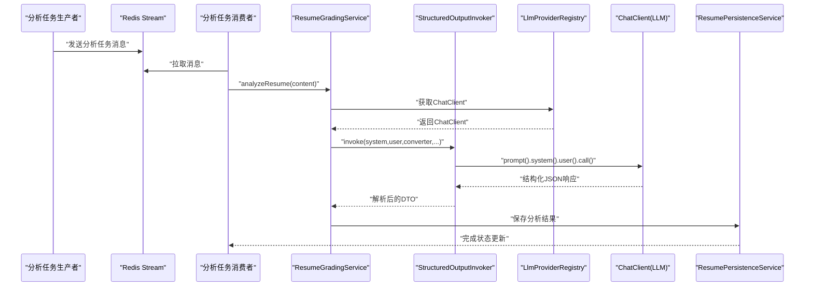
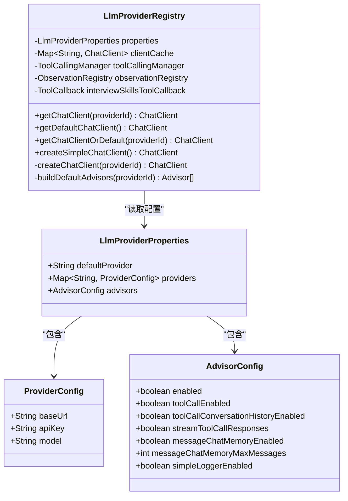
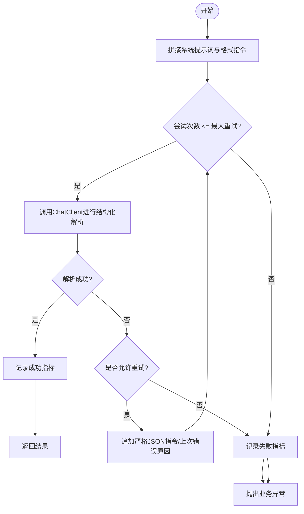
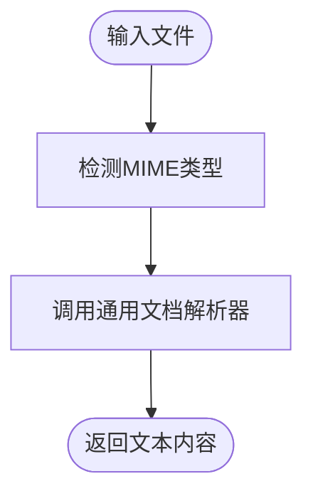
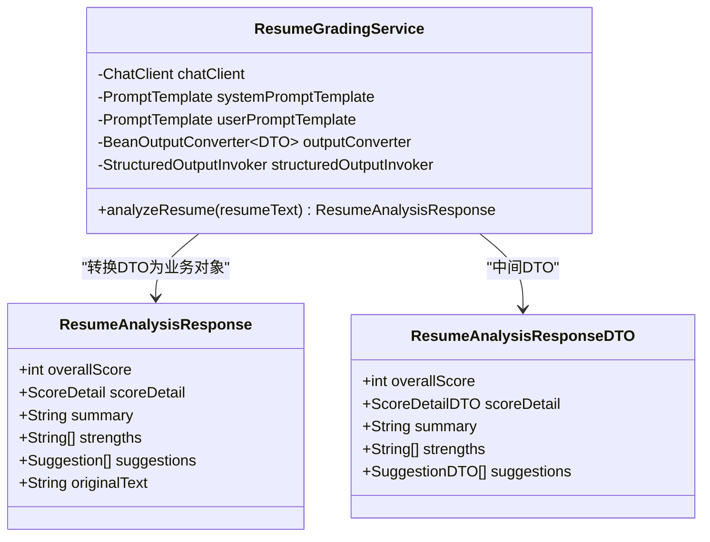
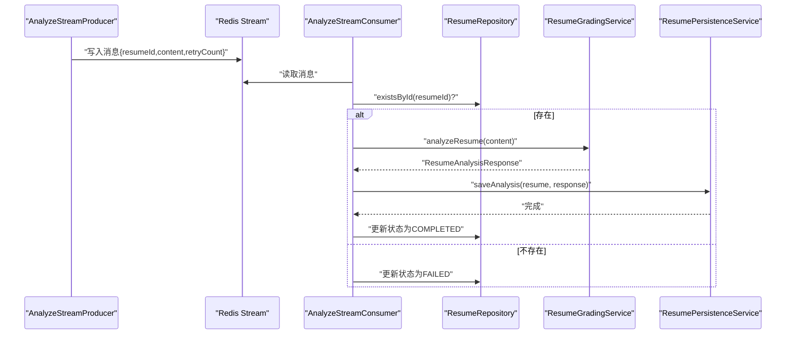
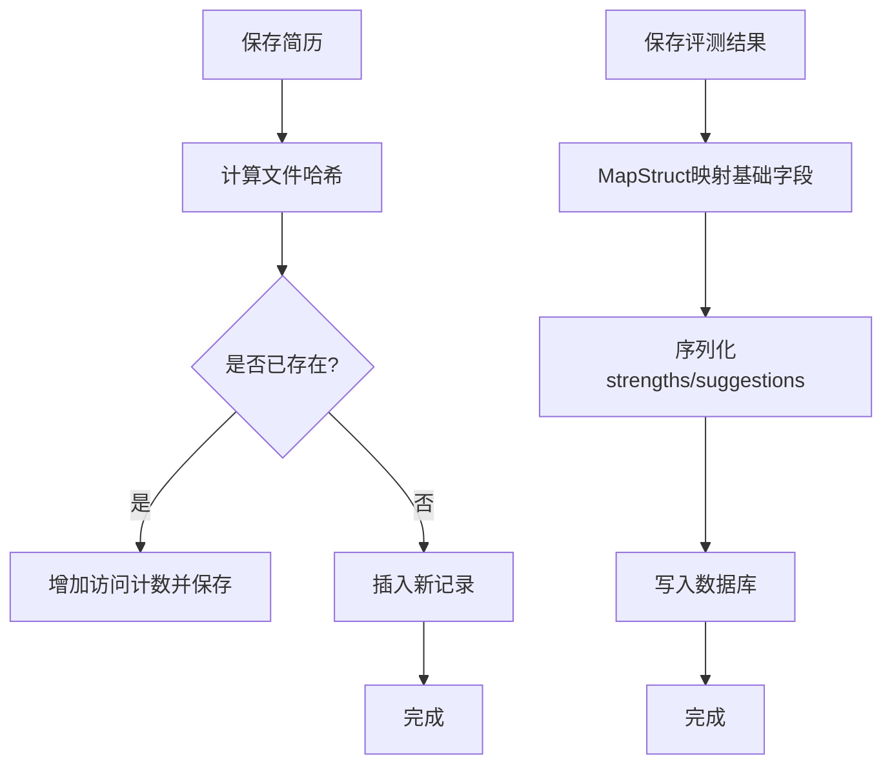
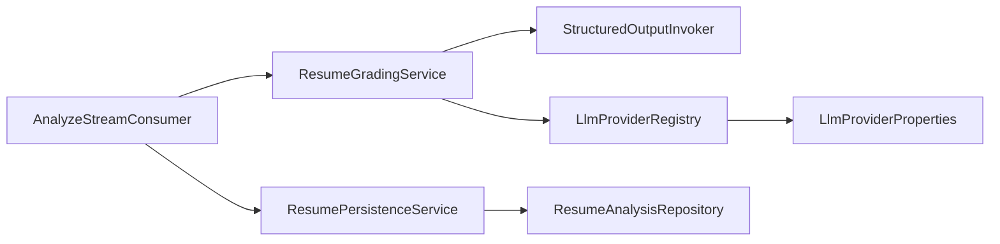

# AI简历分析引擎

<cite>
**本文引用的文件**
- [LlmProviderRegistry.java](file://app/src/main/java/interview/guide/common/ai/LlmProviderRegistry.java)
- [StructuredOutputInvoker.java](file://app/src/main/java/interview/guide/common/ai/StructuredOutputInvoker.java)
- [StructuredOutputProperties.java](file://app/src/main/java/interview/guide/common/ai/StructuredOutputProperties.java)
- [LlmProviderProperties.java](file://app/src/main/java/interview/guide/common/config/LlmProviderProperties.java)
- [ResumeParseService.java](file://app/src/main/java/interview/guide/modules/resume/service/ResumeParseService.java)
- [ResumeGradingService.java](file://app/src/main/java/interview/guide/modules/resume/service/ResumeGradingService.java)
- [ResumeAnalysisProperties.java](file://app/src/main/java/interview/guide/modules/resume/service/ResumeAnalysisProperties.java)
- [ResumeAnalysisResponse.java](file://app/src/main/java/interview/guide/modules/interview/model/ResumeAnalysisResponse.java)
- [AnalyzeStreamConsumer.java](file://app/src/main/java/interview/guide/modules/resume/listener/AnalyzeStreamConsumer.java)
- [AnalyzeStreamProducer.java](file://app/src/main/java/interview/guide/modules/resume/listener/AnalyzeStreamProducer.java)
- [ResumePersistenceService.java](file://app/src/main/java/interview/guide/modules/resume/service/ResumePersistenceService.java)
- [ResumeAnalysisRepository.java](file://app/src/main/java/interview/guide/modules/resume/repository/ResumeAnalysisRepository.java)
- [application.yml](file://app/src/main/resources/application.yml)
- [LlmProviderRegistryTest.java](file://app/src/test/java/interview/guide/common/ai/LlmProviderRegistryTest.java)
</cite>

## 目录
1. [简介](#简介)
2. [项目结构](#项目结构)
3. [核心组件](#核心组件)
4. [架构总览](#架构总览)
5. [详细组件分析](#详细组件分析)
6. [依赖分析](#依赖分析)
7. [性能考虑](#性能考虑)
8. [故障排查指南](#故障排查指南)
9. [结论](#结论)
10. [附录](#附录)

## 简介
本技术文档面向“AI简历分析引擎”，系统性阐述简历解析、信息抽取、AI评分、结构化解析调用、LLM提供商注册表、异步流式处理、持久化与错误恢复等核心技术。文档以代码为依据，结合架构图与流程图，帮助开发者与产品人员快速理解并高效扩展该引擎。

## 项目结构
本项目采用模块化分层组织，简历分析相关逻辑集中在 resume 模块，AI调用与配置位于 common 子包，异步流处理位于 listener 子包，持久化位于 repository 与 service 子包。

图表来源
- [ResumeParseService.java:15-66](file://app/src/main/java/interview/guide/modules/resume/service/ResumeParseService.java#L15-L66)
- [ResumeGradingService.java:27-177](file://app/src/main/java/interview/guide/modules/resume/service/ResumeGradingService.java#L27-L177)
- [ResumePersistenceService.java:28-208](file://app/src/main/java/interview/guide/modules/resume/service/ResumePersistenceService.java#L28-L208)
- [LlmProviderRegistry.java:35-230](file://app/src/main/java/interview/guide/common/ai/LlmProviderRegistry.java#L35-L230)
- [StructuredOutputInvoker.java:19-172](file://app/src/main/java/interview/guide/common/ai/StructuredOutputInvoker.java#L19-L172)
- [AnalyzeStreamConsumer.java:22-158](file://app/src/main/java/interview/guide/modules/resume/listener/AnalyzeStreamConsumer.java#L22-L158)
- [AnalyzeStreamProducer.java:17-82](file://app/src/main/java/interview/guide/modules/resume/listener/AnalyzeStreamProducer.java#L17-L82)

章节来源
- [application.yml:126-181](file://app/src/main/resources/application.yml#L126-L181)

## 核心组件
- LLM提供商注册表：按提供商ID动态构建 ChatClient，支持缓存、默认客户端、工具回调与顾问（Advisor）链。
- 结构化解析调用器：封装结构化输出调用、重试策略、指标采集与错误包装。
- 简历解析服务：委托通用文档解析器提取文本，支持多种文件类型。
- 简历评分服务：加载系统/用户提示词模板，调用LLM进行评分与建议生成，结构化解析结果。
- 异步流处理器：通过 Redis Stream 接收/消费分析任务，保证幂等与重试。
- 持久化服务：简历与评测结果的保存、查询、删除，含JSON字段序列化与反序列化。

章节来源
- [LlmProviderRegistry.java:65-190](file://app/src/main/java/interview/guide/common/ai/LlmProviderRegistry.java#L65-L190)
- [StructuredOutputInvoker.java:59-103](file://app/src/main/java/interview/guide/common/ai/StructuredOutputInvoker.java#L59-L103)
- [ResumeParseService.java:30-64](file://app/src/main/java/interview/guide/modules/resume/service/ResumeParseService.java#L30-L64)
- [ResumeGradingService.java:86-130](file://app/src/main/java/interview/guide/modules/resume/service/ResumeGradingService.java#L86-L130)
- [AnalyzeStreamConsumer.java:91-105](file://app/src/main/java/interview/guide/modules/resume/listener/AnalyzeStreamConsumer.java#L91-L105)
- [ResumePersistenceService.java:95-115](file://app/src/main/java/interview/guide/modules/resume/service/ResumePersistenceService.java#L95-L115)

## 架构总览
系统围绕“异步流 + LLM + 结构化解析 + 持久化”的闭环展开。生产者将简历内容推送到 Redis Stream；消费者拉取消息并调用 LLM 进行评分；评分结果经结构化解析器确保输出格式稳定；最终写入数据库并更新状态。

图表来源
- [AnalyzeStreamProducer.java:36-38](file://app/src/main/java/interview/guide/modules/resume/listener/AnalyzeStreamProducer.java#L36-L38)
- [AnalyzeStreamConsumer.java:91-105](file://app/src/main/java/interview/guide/modules/resume/listener/AnalyzeStreamConsumer.java#L91-L105)
- [ResumeGradingService.java:102-114](file://app/src/main/java/interview/guide/modules/resume/service/ResumeGradingService.java#L102-L114)
- [StructuredOutputInvoker.java:77-84](file://app/src/main/java/interview/guide/common/ai/StructuredOutputInvoker.java#L77-L84)
- [LlmProviderRegistry.java:134-190](file://app/src/main/java/interview/guide/common/ai/LlmProviderRegistry.java#L134-L190)

## 详细组件分析

### LLM提供商注册表（多提供商支持与顾问链）
- 功能要点
  - 按 providerId 缓存 ChatClient，避免重复创建。
  - 默认/回退策略：支持默认提供商与空值回退。
  - 工具回调与顾问链：根据配置启用 ToolCallAdvisor、MessageChatMemoryAdvisor、SimpleLoggerAdvisor。
  - 简单文本生成客户端：无需工具回调的轻量 ChatClient。
- 设计模式
  - 工厂 + 缓存：clientCache ConcurrentHashMap。
  - Builder 模式：ChatClient.builder(...)。
- 可观测性
  - 可选 ObservationRegistry 注入，便于链路追踪。
- 测试覆盖
  - 单元测试验证缓存命中、未知提供商抛错、默认客户端可用。

图表来源
- [LlmProviderRegistry.java:35-230](file://app/src/main/java/interview/guide/common/ai/LlmProviderRegistry.java#L35-L230)
- [LlmProviderProperties.java:11-40](file://app/src/main/java/interview/guide/common/config/LlmProviderProperties.java#L11-L40)

章节来源
- [LlmProviderRegistry.java:65-190](file://app/src/main/java/interview/guide/common/ai/LlmProviderRegistry.java#L65-L190)
- [LlmProviderProperties.java:11-40](file://app/src/main/java/interview/guide/common/config/LlmProviderProperties.java#L11-L40)
- [LlmProviderRegistryTest.java:43-120](file://app/src/test/java/interview/guide/common/ai/LlmProviderRegistryTest.java#L43-L120)

### 结构化解析调用器（提示词格式化、重试与指标）
- 功能要点
  - 在系统提示词末尾注入 BeanOutputConverter 的格式约束，确保模型输出可被严格解析。
  - 可配置重试次数、是否在重试时注入上次错误、是否追加严格JSON指令、是否上报指标。
  - 记录 invocations、attempts、latency 指标，标签化 context。
- 错误处理
  - 达到最大重试仍失败时，包装为 BusinessException 并携带 ErrorCode。
- 最佳实践
  - 为不同业务场景设置独立 context 标签，便于定位与限流。
  - 严格 JSON 指令与修复提示词配合，显著降低解析失败率。

图表来源
- [StructuredOutputInvoker.java:59-103](file://app/src/main/java/interview/guide/common/ai/StructuredOutputInvoker.java#L59-L103)
- [StructuredOutputInvoker.java:105-123](file://app/src/main/java/interview/guide/common/ai/StructuredOutputInvoker.java#L105-L123)
- [StructuredOutputProperties.java:9-19](file://app/src/main/java/interview/guide/common/ai/StructuredOutputProperties.java#L9-L19)

章节来源
- [StructuredOutputInvoker.java:59-103](file://app/src/main/java/interview/guide/common/ai/StructuredOutputInvoker.java#L59-L103)
- [StructuredOutputProperties.java:9-19](file://app/src/main/java/interview/guide/common/ai/StructuredOutputProperties.java#L9-L19)

### 简历解析服务（内容提取与类型检测）
- 功能要点
  - 委托通用文档解析器提取文本，支持 PDF、DOCX、DOC、TXT、MD 等。
  - 提供字节数组与存储键两种解析入口。
  - MIME 类型检测辅助后续处理。
- 数据流
  - 输入：MultipartFile 或 byte[] + fileName。
  - 输出：纯文本内容。

图表来源
- [ResumeParseService.java:30-64](file://app/src/main/java/interview/guide/modules/resume/service/ResumeParseService.java#L30-L64)

章节来源
- [ResumeParseService.java:15-66](file://app/src/main/java/interview/guide/modules/resume/service/ResumeParseService.java#L15-L66)

### 简历评分服务（评分算法、字段映射与结果解释）
- 功能要点
  - 加载系统/用户提示词模板，渲染变量（如 resumeText）。
  - 将输出格式约束注入系统提示词，交由结构化解析器确保稳定性。
  - DTO 层定义总体分与各维度评分、摘要、优势、建议等字段。
  - 业务对象与DTO之间进行字段映射与转换。
- 评分维度
  - 内容完整性、结构清晰度、技能匹配度、表达专业性、项目经验。
- 错误兜底
  - 解析失败时返回包含错误信息与建议的默认响应。

图表来源
- [ResumeGradingService.java:27-177](file://app/src/main/java/interview/guide/modules/resume/service/ResumeGradingService.java#L27-L177)
- [ResumeAnalysisResponse.java:8-49](file://app/src/main/java/interview/guide/modules/interview/model/ResumeAnalysisResponse.java#L8-L49)

章节来源
- [ResumeGradingService.java:86-130](file://app/src/main/java/interview/guide/modules/resume/service/ResumeGradingService.java#L86-L130)
- [ResumeAnalysisResponse.java:8-49](file://app/src/main/java/interview/guide/modules/interview/model/ResumeAnalysisResponse.java#L8-L49)

### 异步流处理器（生产者/消费者、重试与状态管理）
- 生产者
  - 将简历ID与内容封装为消息，写入 Redis Stream。
  - 发送失败时更新状态并截断错误信息。
- 消费者
  - 幂等消费：解析payload、校验简历是否存在、执行评分、持久化、更新状态。
  - 重试：失败时重新入队，记录重试次数。
  - 完成/失败：分别标记状态并落库。

图表来源
- [AnalyzeStreamProducer.java:36-38](file://app/src/main/java/interview/guide/modules/resume/listener/AnalyzeStreamProducer.java#L36-L38)
- [AnalyzeStreamConsumer.java:91-105](file://app/src/main/java/interview/guide/modules/resume/listener/AnalyzeStreamConsumer.java#L91-L105)

章节来源
- [AnalyzeStreamProducer.java:17-82](file://app/src/main/java/interview/guide/modules/resume/listener/AnalyzeStreamProducer.java#L17-L82)
- [AnalyzeStreamConsumer.java:22-158](file://app/src/main/java/interview/guide/modules/resume/listener/AnalyzeStreamConsumer.java#L22-L158)

### 持久化服务（简历与评测结果）
- 功能要点
  - 基于文件内容哈希去重，访问计数自增。
  - 评测结果 JSON 字段序列化/反序列化，使用 MapStruct 映射基础字段。
  - 支持查询最新评测、历史记录、删除简历及关联数据。
- 事务与异常
  - 保存/删除均在事务中执行，失败统一包装为业务异常。

图表来源
- [ResumePersistenceService.java:45-90](file://app/src/main/java/interview/guide/modules/resume/service/ResumePersistenceService.java#L45-L90)
- [ResumePersistenceService.java:95-115](file://app/src/main/java/interview/guide/modules/resume/service/ResumePersistenceService.java#L95-L115)

章节来源
- [ResumePersistenceService.java:28-208](file://app/src/main/java/interview/guide/modules/resume/service/ResumePersistenceService.java#L28-L208)
- [ResumeAnalysisRepository.java:14-31](file://app/src/main/java/interview/guide/modules/resume/repository/ResumeAnalysisRepository.java#L14-L31)

## 依赖分析
- 组件耦合
  - ResumeGradingService 依赖 ChatClient.Builder、StructuredOutputInvoker、提示词模板与属性。
  - LlmProviderRegistry 依赖 LlmProviderProperties 与可选的工具回调与观测注册表。
  - AnalyzeStreamConsumer 依赖 Redis、ResumeGradingService、ResumePersistenceService、ResumeRepository。
- 外部依赖
  - Spring AI ChatClient、OpenAI兼容API、Redisson Stream、PostgreSQL/JPA。
- 配置依赖
  - application.yml 中 app.ai.* 与 spring.ai.* 提供提供商、模型、温度、重试策略等。

图表来源
- [ResumeGradingService.java:62-78](file://app/src/main/java/interview/guide/modules/resume/service/ResumeGradingService.java#L62-L78)
- [LlmProviderRegistry.java:46-55](file://app/src/main/java/interview/guide/common/ai/LlmProviderRegistry.java#L46-L55)
- [AnalyzeStreamConsumer.java:26-40](file://app/src/main/java/interview/guide/modules/resume/listener/AnalyzeStreamConsumer.java#L26-L40)
- [ResumePersistenceService.java:33-37](file://app/src/main/java/interview/guide/modules/resume/service/ResumePersistenceService.java#L33-L37)

章节来源
- [application.yml:99-160](file://app/src/main/resources/application.yml#L99-L160)

## 性能考虑
- 虚拟线程与I/O并发
  - application.yml 启用虚拟线程，提升I/O密集型场景并发能力。
- LLM调用优化
  - 通过结构化解析器减少模型输出失败重试成本。
  - 适配本地模型（长读超时）与云端模型（短连接超时）。
- 缓存与复用
  - ChatClient 按提供商ID缓存，避免重复初始化。
- 指标与可观测性
  - 结构化解析调用器上报 invocations/attempts/latency，便于容量规划与告警。

章节来源
- [application.yml:42-47](file://app/src/main/resources/application.yml#L42-L47)
- [LlmProviderRegistry.java:144-149](file://app/src/main/java/interview/guide/common/ai/LlmProviderRegistry.java#L144-L149)
- [StructuredOutputInvoker.java:133-151](file://app/src/main/java/interview/guide/common/ai/StructuredOutputInvoker.java#L133-L151)

## 故障排查指南
- LLM提供商不可用
  - 现象：Unknown LLM provider 或 ChatClient 初始化失败。
  - 排查：确认 app.ai.providers.* 配置、API Key、Base URL、模型名称。
- 结构化解析失败
  - 现象：BeanOutputConverter 解析异常。
  - 排查：启用修复提示词与严格JSON指令；查看指标 attempts/status；检查提示词格式约束。
- 异步流消费异常
  - 现象：任务卡住或重复执行。
  - 排查：检查 Redis Stream 消费组、消息重试次数、消费者幂等逻辑。
- 持久化异常
  - 现象：保存失败或JSON反序列化异常。
  - 排查：核对 MapStruct 映射、JSON序列化/反序列化、事务边界。

章节来源
- [LlmProviderRegistry.java:134-140](file://app/src/main/java/interview/guide/common/ai/LlmProviderRegistry.java#L134-L140)
- [StructuredOutputInvoker.java:85-96](file://app/src/main/java/interview/guide/common/ai/StructuredOutputInvoker.java#L85-L96)
- [AnalyzeStreamConsumer.java:118-139](file://app/src/main/java/interview/guide/modules/resume/listener/AnalyzeStreamConsumer.java#L118-L139)
- [ResumePersistenceService.java:111-115](file://app/src/main/java/interview/guide/modules/resume/service/ResumePersistenceService.java#L111-L115)

## 结论
本引擎以“异步流 + 结构化解析 + 多提供商LLM”为核心，实现了高可靠、可扩展、可观测的AI简历分析能力。通过严格的提示词格式约束与重试策略，显著提升了结构化输出的稳定性；通过注册表与顾问链，灵活适配不同LLM提供商；通过Redis Stream与JPA，保障了任务处理与数据持久化的可靠性。

## 附录
- 配置项速览（摘自 application.yml）
  - app.ai.default-provider、app.ai.providers.*、app.ai.advisors.*
  - app.ai.structured-*（重试次数、错误注入、指标开关等）
  - spring.ai.openai.*（模型、温度、重试策略）
  - app.resume.allowed-types（文件类型白名单）

章节来源
- [application.yml:126-160](file://app/src/main/resources/application.yml#L126-L160)
- [application.yml:99-116](file://app/src/main/resources/application.yml#L99-L116)