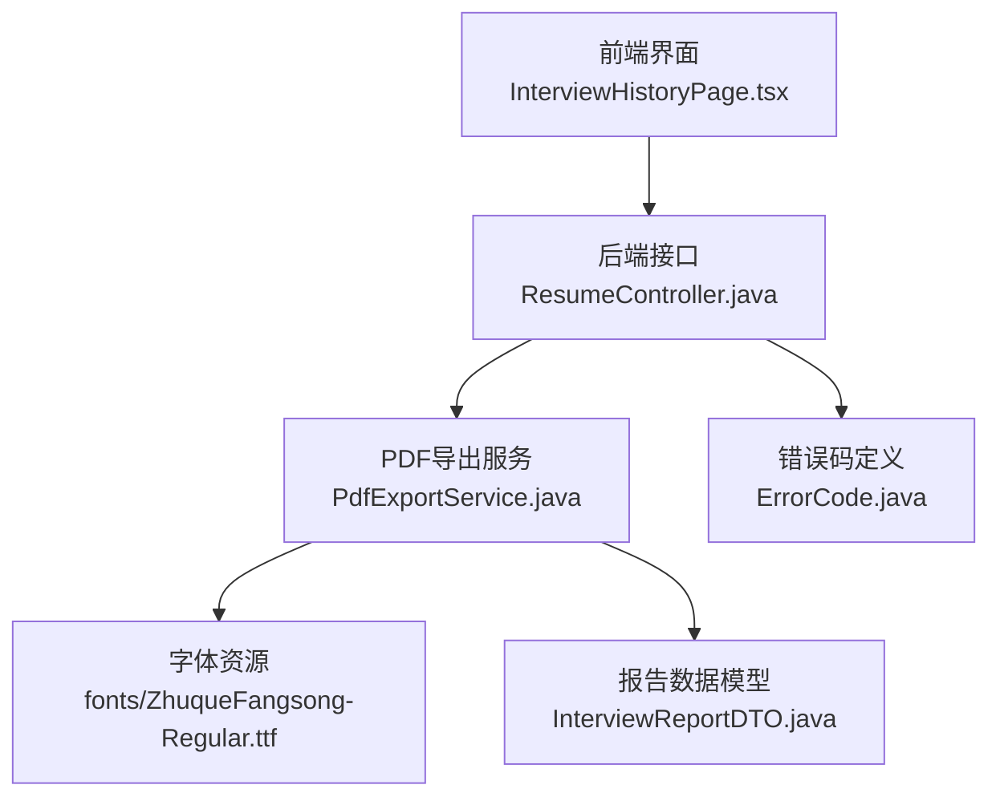
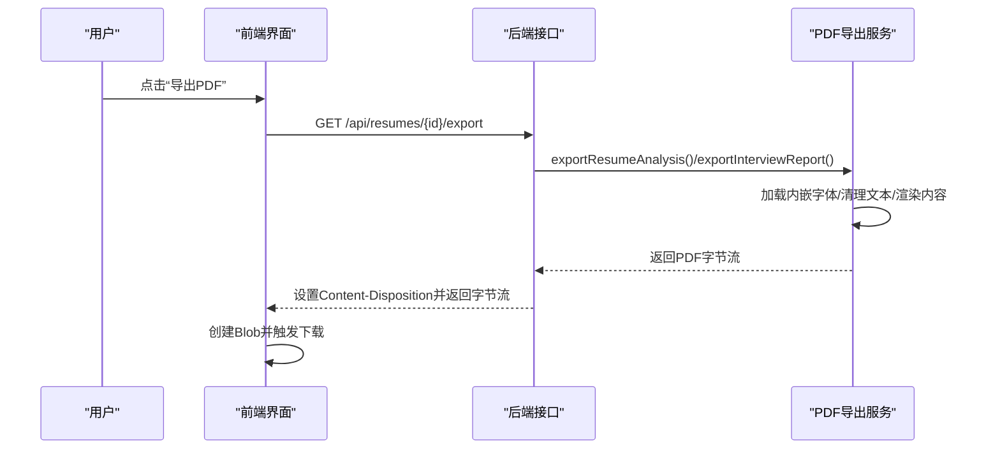
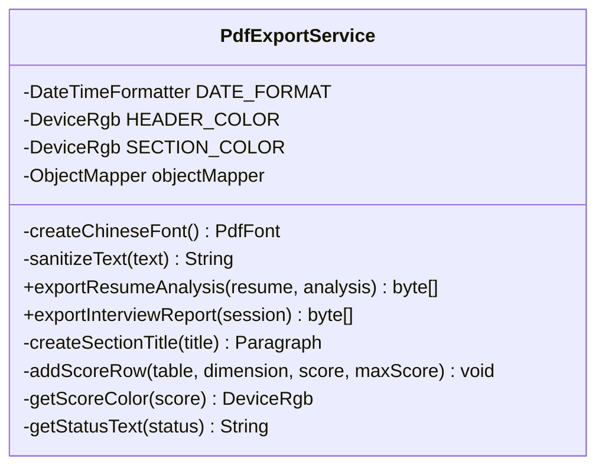
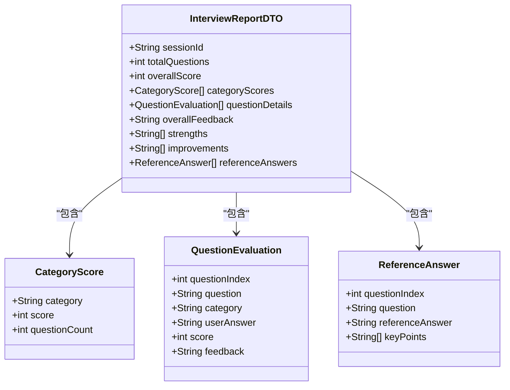
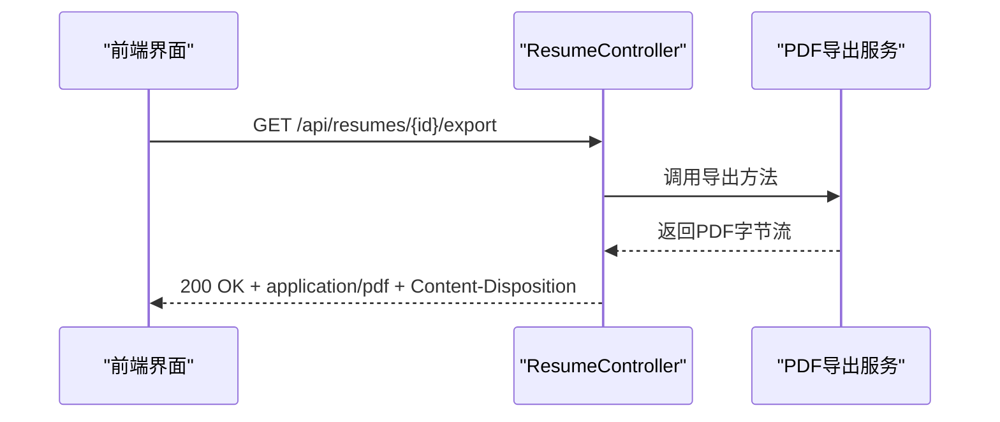
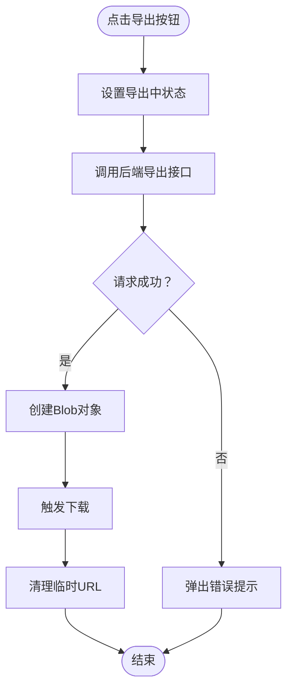
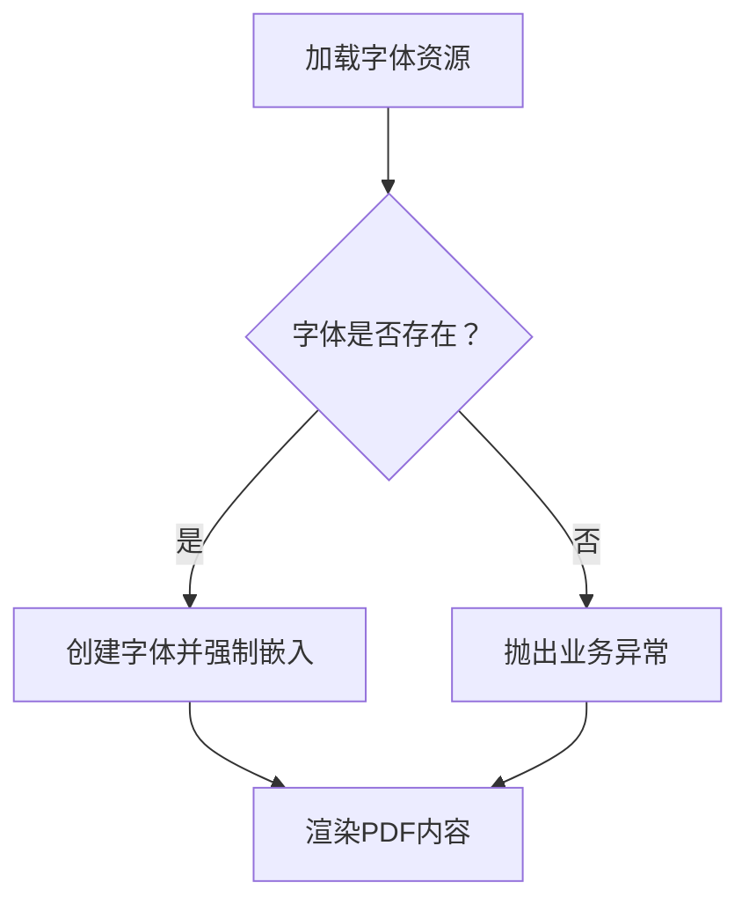
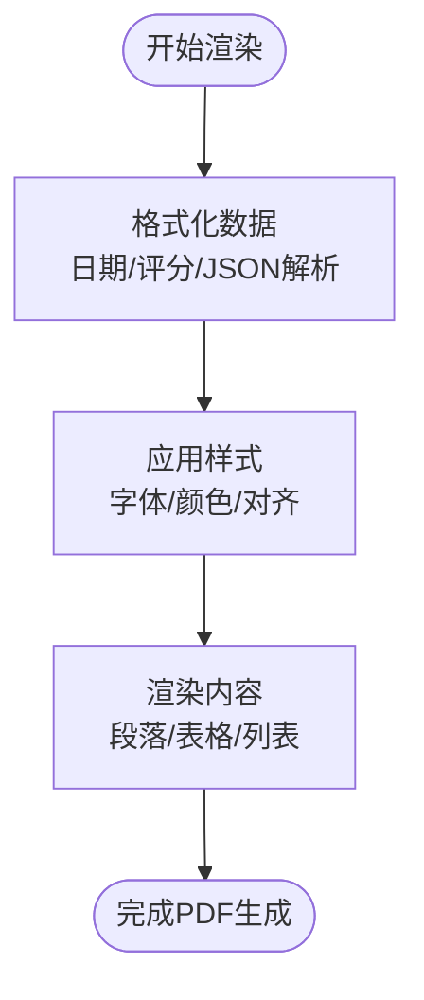
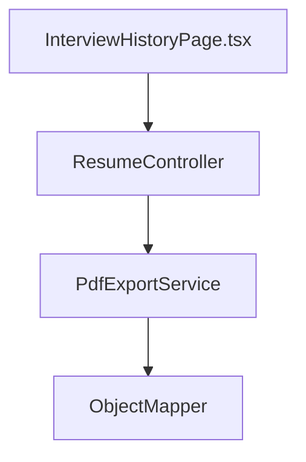

# PDF导出功能

<cite>
**本文档引用的文件**
- [PdfExportService.java](file://app/src/main/java/interview/guide/infrastructure/export/PdfExportService.java)
- [ResumeController.java](file://app/src/main/java/interview/guide/modules/resume/ResumeController.java)
- [InterviewHistoryPage.tsx](file://frontend/src/pages/InterviewHistoryPage.tsx)
- [ErrorCode.java](file://app/src/main/java/interview/guide/common/exception/ErrorCode.java)
- [InterviewReportDTO.java](file://app/src/main/java/interview/guide/modules/interview/model/InterviewReportDTO.java)
- [DocumentParseService.java](file://app/src/main/java/interview/guide/infrastructure/file/DocumentParseService.java)
- [ZhuqueFangsong-Regular.ttf](file://app/src/main/resources/fonts/ZhuqueFangsong-Regular.ttf)
</cite>

## 目录
1. [简介](#简介)
2. [项目结构](#项目结构)
3. [核心组件](#核心组件)
4. [架构概览](#架构概览)
5. [详细组件分析](#详细组件分析)
6. [依赖分析](#依赖分析)
7. [性能考虑](#性能考虑)
8. [故障排除指南](#故障排除指南)
9. [结论](#结论)
10. [附录](#附录)

## 简介
本文件全面阐述了系统中的PDF导出功能，涵盖后端PDF生成服务、前端导出触发流程、模板与内容渲染、字体管理、报告生成算法、性能优化策略、多语言支持方案、质量控制机制以及测试与质量保证方案。目标是帮助开发者与运维人员深入理解PDF导出的实现原理与最佳实践。

## 项目结构
PDF导出功能由后端服务与前端界面协同完成：
- 后端通过PDF导出服务生成PDF字节流，并通过REST接口返回给前端
- 前端负责触发导出请求、展示进度与下载处理
- 字体资源内置于后端资源目录，确保跨平台一致的中文字体渲染

图表来源
- [InterviewHistoryPage.tsx:333-351](file://frontend/src/pages/InterviewHistoryPage.tsx#L333-L351)
- [ResumeController.java:74-91](file://app/src/main/java/interview/guide/modules/resume/ResumeController.java#L74-L91)
- [PdfExportService.java:47-71](file://app/src/main/java/interview/guide/infrastructure/export/PdfExportService.java#L47-L71)
- [InterviewReportDTO.java:8-18](file://app/src/main/java/interview/guide/modules/interview/model/InterviewReportDTO.java#L8-L18)
- [ErrorCode.java:46-48](file://app/src/main/java/interview/guide/common/exception/ErrorCode.java#L46-L48)

章节来源
- [InterviewHistoryPage.tsx:333-351](file://frontend/src/pages/InterviewHistoryPage.tsx#L333-L351)
- [ResumeController.java:74-91](file://app/src/main/java/interview/guide/modules/resume/ResumeController.java#L74-L91)
- [PdfExportService.java:47-71](file://app/src/main/java/interview/guide/infrastructure/export/PdfExportService.java#L47-L71)
- [InterviewReportDTO.java:8-18](file://app/src/main/java/interview/guide/modules/interview/model/InterviewReportDTO.java#L8-L18)
- [ErrorCode.java:46-48](file://app/src/main/java/interview/guide/common/exception/ErrorCode.java#L46-L48)

## 核心组件
- PDF导出服务：负责简历分析报告与面试报告的PDF生成，包括模板设计、内容渲染、布局计算、分页处理、字体管理与错误处理
- 报告数据模型：统一面试报告的数据结构，便于服务层渲染
- REST接口：提供PDF导出的HTTP端点，负责响应头设置与错误处理
- 前端导出触发：负责用户交互、进度提示与下载处理
- 字体资源：内嵌中文字体，确保跨平台一致性与字符渲染正确性

章节来源
- [PdfExportService.java:47-71](file://app/src/main/java/interview/guide/infrastructure/export/PdfExportService.java#L47-L71)
- [InterviewReportDTO.java:8-18](file://app/src/main/java/interview/guide/modules/interview/model/InterviewReportDTO.java#L8-L18)
- [ResumeController.java:74-91](file://app/src/main/java/interview/guide/modules/resume/ResumeController.java#L74-L91)
- [InterviewHistoryPage.tsx:333-351](file://frontend/src/pages/InterviewHistoryPage.tsx#L333-L351)
- [ZhuqueFangsong-Regular.ttf](file://app/src/main/resources/fonts/ZhuqueFangsong-Regular.ttf)

## 架构概览
PDF导出的整体流程如下：
- 前端点击导出按钮，发起HTTP请求
- 后端控制器接收请求，调用PDF导出服务
- 服务根据报告数据构建PDF文档，使用内嵌中文字体渲染
- 服务将PDF字节流写入响应，前端以Blob形式下载

图表来源
- [InterviewHistoryPage.tsx:333-351](file://frontend/src/pages/InterviewHistoryPage.tsx#L333-L351)
- [ResumeController.java:74-91](file://app/src/main/java/interview/guide/modules/resume/ResumeController.java#L74-L91)
- [PdfExportService.java:85-165](file://app/src/main/java/interview/guide/infrastructure/export/PdfExportService.java#L85-L165)

## 详细组件分析

### PDF导出服务（PdfExportService）
职责与能力：
- 字体管理：加载内嵌中文字体，强制嵌入以保证跨平台一致性；对异常进行业务异常封装
- 文本清理：移除可能导致字体问题的特殊字符，提升渲染稳定性
- 报告渲染：简历分析报告与面试报告的模板化渲染，包括标题、基本信息、评分、摘要、优势、建议、问答详情等
- 布局与样式：使用段落、表格、颜色与字号控制布局与可读性
- 错误处理：捕获字体加载与渲染异常，转换为统一的业务错误码

关键实现要点：
- 字体加载与嵌入：通过类加载器读取字体资源，使用特定编码与嵌入策略创建字体实例
- 文本清洗：在渲染前清理潜在问题字符，避免渲染异常
- 报告结构：简历分析报告包含基本信息、总分、维度评分、摘要、优势亮点、改进建议；面试报告包含会话信息、总分、总体评价、优势、建议、问答详情
- 颜色与样式：标题与章节使用预设颜色，评分采用分级颜色（绿/黄/红），表格用于维度评分展示

图表来源
- [PdfExportService.java:41-313](file://app/src/main/java/interview/guide/infrastructure/export/PdfExportService.java#L41-L313)

章节来源
- [PdfExportService.java:47-71](file://app/src/main/java/interview/guide/infrastructure/export/PdfExportService.java#L47-L71)
- [PdfExportService.java:85-165](file://app/src/main/java/interview/guide/infrastructure/export/PdfExportService.java#L85-L165)
- [PdfExportService.java:170-283](file://app/src/main/java/interview/guide/infrastructure/export/PdfExportService.java#L170-L283)
- [PdfExportService.java:285-313](file://app/src/main/java/interview/guide/infrastructure/export/PdfExportService.java#L285-L313)

### 报告数据模型（InterviewReportDTO）
作用：
- 统一面试报告的数据结构，便于服务层渲染与前端展示
- 包含总分、类别得分、问题详情、总体评价、优势、改进建议、参考答案等字段

图表来源
- [InterviewReportDTO.java:8-49](file://app/src/main/java/interview/guide/modules/interview/model/InterviewReportDTO.java#L8-L49)

章节来源
- [InterviewReportDTO.java:8-49](file://app/src/main/java/interview/guide/modules/interview/model/InterviewReportDTO.java#L8-L49)

### REST接口（ResumeController）
职责：
- 提供PDF导出的HTTP端点，设置正确的Content-Disposition与Content-Type
- 将异常转换为标准HTTP响应，便于前端处理

图表来源
- [ResumeController.java:74-91](file://app/src/main/java/interview/guide/modules/resume/ResumeController.java#L74-L91)

章节来源
- [ResumeController.java:74-91](file://app/src/main/java/interview/guide/modules/resume/ResumeController.java#L74-L91)

### 前端导出触发（InterviewHistoryPage.tsx）
职责：
- 用户点击导出按钮时，调用后端接口获取PDF Blob
- 创建临时链接并触发浏览器下载
- 在导出过程中显示加载状态，失败时弹出提示

图表来源
- [InterviewHistoryPage.tsx:333-351](file://frontend/src/pages/InterviewHistoryPage.tsx#L333-L351)

章节来源
- [InterviewHistoryPage.tsx:333-351](file://frontend/src/pages/InterviewHistoryPage.tsx#L333-L351)

### 字体管理机制
- 内嵌字体：通过类加载器从资源目录加载中文字体，确保跨平台一致性
- 字体嵌入策略：强制嵌入以避免字体缺失导致的渲染问题
- 字符编码：使用支持中文的编码策略，确保字符集覆盖
- 字体回退策略：当前实现为单一字体，若字体缺失则抛出业务异常

图表来源
- [PdfExportService.java:50-71](file://app/src/main/java/interview/guide/infrastructure/export/PdfExportService.java#L50-L71)
- [ZhuqueFangsong-Regular.ttf](file://app/src/main/resources/fonts/ZhuqueFangsong-Regular.ttf)

章节来源
- [PdfExportService.java:50-71](file://app/src/main/java/interview/guide/infrastructure/export/PdfExportService.java#L50-L71)
- [ZhuqueFangsong-Regular.ttf](file://app/src/main/resources/fonts/ZhuqueFangsong-Regular.ttf)

### 报告生成算法逻辑
- 数据格式化：日期格式化、评分分级、JSON解析（面试报告的优势与建议）
- 样式应用：标题、章节、评分颜色、表格宽度与对齐
- 图片处理：当前PDF导出不涉及图片渲染
- 表格渲染：使用iTextPDF Table组件，按百分比分配列宽，展示维度评分

图表来源
- [PdfExportService.java:120-132](file://app/src/main/java/interview/guide/infrastructure/export/PdfExportService.java#L120-L132)
- [PdfExportService.java:220-234](file://app/src/main/java/interview/guide/infrastructure/export/PdfExportService.java#L220-L234)

章节来源
- [PdfExportService.java:120-132](file://app/src/main/java/interview/guide/infrastructure/export/PdfExportService.java#L120-L132)
- [PdfExportService.java:220-234](file://app/src/main/java/interview/guide/infrastructure/export/PdfExportService.java#L220-L234)

### 多语言支持方案
- 当前实现：主要针对中文场景，使用中文字体与中文日期格式
- 建议扩展：引入多语言资源与区域设置，动态切换字体与日期格式；对文本进行国际化标记与翻译

章节来源
- [PdfExportService.java:41-43](file://app/src/main/java/interview/guide/infrastructure/export/PdfExportService.java#L41-L43)

### 导出质量控制机制
- 分辨率与压缩：当前未见专门的图像压缩或DPI设置逻辑
- 文件大小优化：通过文本清理与禁用图片提取降低体积（参考文档解析服务）
- 格式兼容性：使用标准PDF库生成，确保跨平台兼容

章节来源
- [DocumentParseService.java:127-132](file://app/src/main/java/interview/guide/infrastructure/file/DocumentParseService.java#L127-L132)

### 前端导出触发用户体验
- 按钮交互：导出按钮禁用状态与加载动画
- 进度显示：导出中状态提示
- 下载处理：Blob下载与临时URL清理
- 错误提示：导出失败时的用户提示

章节来源
- [InterviewHistoryPage.tsx:333-351](file://frontend/src/pages/InterviewHistoryPage.tsx#L333-L351)

## 依赖分析
- PdfExportService依赖ObjectMapper进行JSON解析
- ResumeController依赖历史服务（此处为示例）与PDF导出服务
- 前端通过API模块调用后端接口

图表来源
- [PdfExportService.java](file://app/src/main/java/interview/guide/infrastructure/export/PdfExportService.java#L45)
- [ResumeController.java:74-91](file://app/src/main/java/interview/guide/modules/resume/ResumeController.java#L74-L91)
- [InterviewHistoryPage.tsx:333-351](file://frontend/src/pages/InterviewHistoryPage.tsx#L333-L351)

章节来源
- [PdfExportService.java](file://app/src/main/java/interview/guide/infrastructure/export/PdfExportService.java#L45)
- [ResumeController.java:74-91](file://app/src/main/java/interview/guide/modules/resume/ResumeController.java#L74-L91)
- [InterviewHistoryPage.tsx:333-351](file://frontend/src/pages/InterviewHistoryPage.tsx#L333-L351)

## 性能考虑
- 内存管理：使用ByteArrayOutputStream生成PDF，避免大对象长时间驻留；及时关闭Document释放资源
- 并发控制：当前未见显式的并发导出限制；可在控制器或服务层增加限流策略
- 缓存机制：可对常用报告模板或字体进行缓存，减少重复加载开销
- 错误处理：统一的业务异常与错误码，便于快速定位与恢复

章节来源
- [PdfExportService.java:85-165](file://app/src/main/java/interview/guide/infrastructure/export/PdfExportService.java#L85-L165)
- [PdfExportService.java:170-283](file://app/src/main/java/interview/guide/infrastructure/export/PdfExportService.java#L170-L283)
- [ErrorCode.java:46-48](file://app/src/main/java/interview/guide/common/exception/ErrorCode.java#L46-L48)

## 故障排除指南
- 字体缺失：检查字体资源是否打包到最终产物；确认类路径与文件名一致
- 导出失败：查看后端日志与业务异常；前端弹窗提示错误信息
- JSON解析异常：检查面试报告数据结构与序列化格式

章节来源
- [PdfExportService.java:62-70](file://app/src/main/java/interview/guide/infrastructure/export/PdfExportService.java#L62-L70)
- [PdfExportService.java:231-233](file://app/src/main/java/interview/guide/infrastructure/export/PdfExportService.java#L231-L233)
- [PdfExportService.java:249-251](file://app/src/main/java/interview/guide/infrastructure/export/PdfExportService.java#L249-L251)
- [ErrorCode.java:46-48](file://app/src/main/java/interview/guide/common/exception/ErrorCode.java#L46-L48)

## 结论
PDF导出功能通过内嵌中文字体与模板化渲染实现了稳定可靠的中文报告输出。当前版本聚焦于简历分析与面试报告两大场景，具备清晰的错误处理与前端交互体验。后续可在多语言支持、并发控制、缓存与压缩等方面进一步优化，以满足更广泛的业务需求。

## 附录
- 测试策略与质量保证
  - 单元测试：针对PDF导出服务的关键方法（字体加载、文本清理、报告渲染）编写单元测试
  - 集成测试：验证前端导出流程与后端接口的端到端连通性
  - 性能测试：模拟高并发导出场景，评估内存占用与响应时间
  - 质量回归：在每次变更后运行回归测试，确保导出功能稳定性

章节来源
- [PdfExportService.java:85-165](file://app/src/main/java/interview/guide/infrastructure/export/PdfExportService.java#L85-L165)
- [PdfExportService.java:170-283](file://app/src/main/java/interview/guide/infrastructure/export/PdfExportService.java#L170-L283)
- [InterviewHistoryPage.tsx:333-351](file://frontend/src/pages/InterviewHistoryPage.tsx#L333-L351)