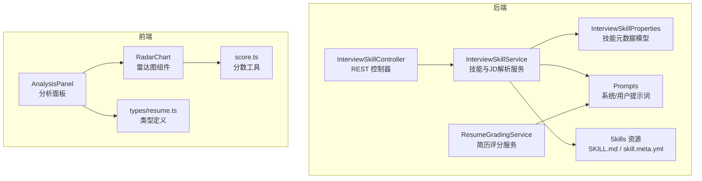
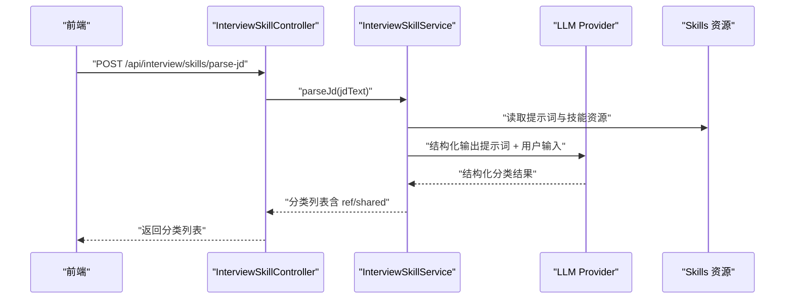
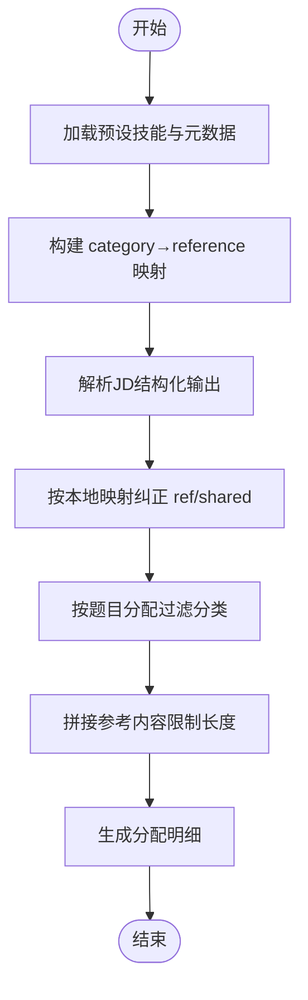
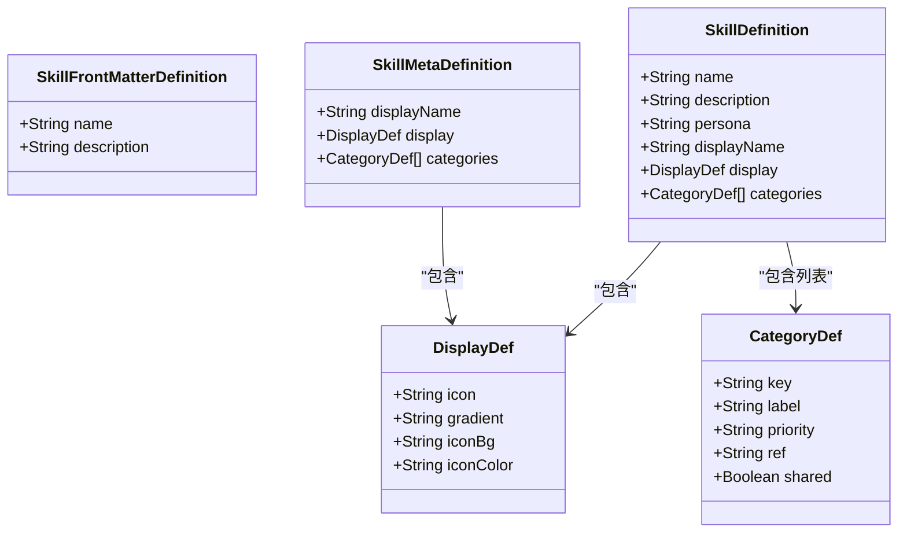
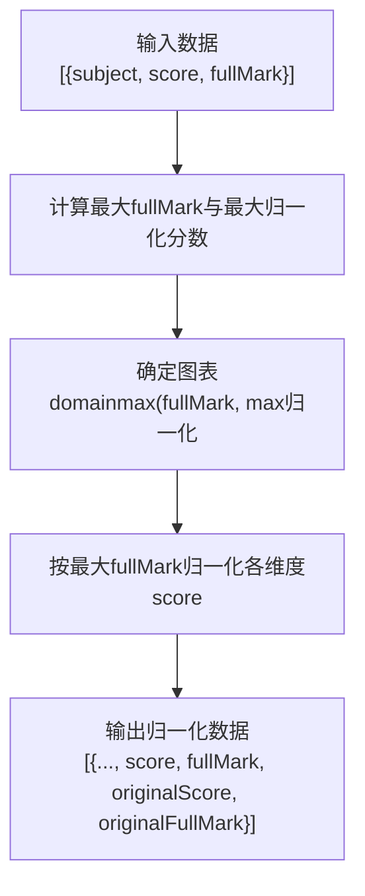
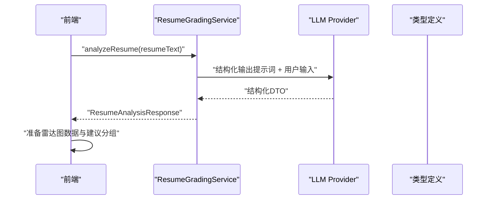
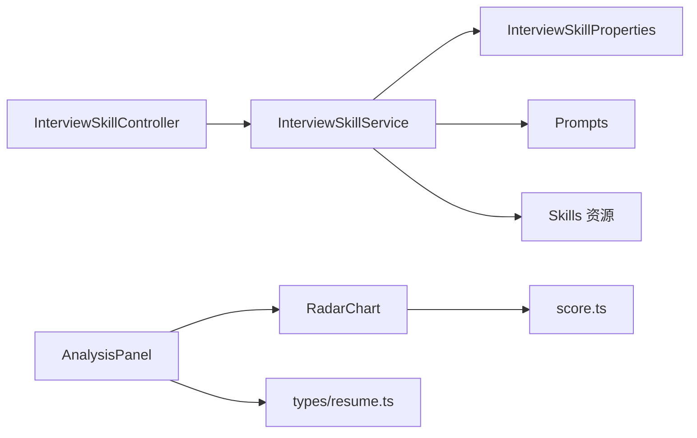

# 技能识别系统

<cite>
**本文引用的文件**
- [InterviewSkillService.java](file://app/src/main/java/interview/guide/modules/interview/skill/InterviewSkillService.java)
- [InterviewSkillController.java](file://app/src/main/java/interview/guide/modules/interview/skill/InterviewSkillController.java)
- [InterviewSkillProperties.java](file://app/src/main/java/interview/guide/modules/interview/skill/InterviewSkillProperties.java)
- [RadarChart.tsx](file://frontend/src/components/RadarChart.tsx)
- [AnalysisPanel.tsx](file://frontend/src/components/AnalysisPanel.tsx)
- [score.ts](file://frontend/src/utils/score.ts)
- [ResumeGradingService.java](file://app/src/main/java/interview/guide/modules/resume/service/ResumeGradingService.java)
- [ResumeAnalysisResponse.java](file://app/src/main/java/interview/guide/modules/interview/model/ResumeAnalysisResponse.java)
- [resume.ts](file://frontend/src/types/resume.ts)
- [SKILL.md（Java 后端）](file://app/src/main/resources/skills/java-backend/SKILL.md)
- [SKILL.md（前端）](file://app/src/main/resources/skills/frontend/SKILL.md)
- [SKILL.md（系统设计）](file://app/src/main/resources/skills/system-design/SKILL.md)
- [skill.meta.yml（Java 后端）](file://app/src/main/resources/skills/java-backend/skill.meta.yml)
- [jd-parse-system.st](file://app/src/main/resources/prompts/jd-parse-system.st)
- [interview-question-resume-user.st](file://app/src/main/resources/prompts/interview-question-resume-user.st)
</cite>

## 目录
1. [简介](#简介)
2. [项目结构](#项目结构)
3. [核心组件](#核心组件)
4. [架构总览](#架构总览)
5. [详细组件分析](#详细组件分析)
6. [依赖分析](#依赖分析)
7. [性能考虑](#性能考虑)
8. [故障排查指南](#故障排查指南)
9. [结论](#结论)
10. [附录](#附录)

## 简介
本技术文档面向“技能识别系统”，系统通过自然语言处理与结构化提示词，实现以下能力：
- 职位描述（JD）解析，提取面试考察方向并匹配参考知识库文件
- 预设技能主题与分类体系的加载与管理
- 基于参考知识库的题目分配与参考基线构建
- 简历评分与多维度雷达图展示（表达专业性、技能匹配度、内容完整性、结构清晰度、项目经验）

系统采用前后端分离架构：后端基于 Spring Boot 与 Spring AI，前端基于 React + TypeScript，使用 recharts 进行可视化。

## 项目结构
- 后端模块
  - 技能识别与JD解析：InterviewSkillController / InterviewSkillService / InterviewSkillProperties
  - 简历评分：ResumeGradingService / ResumeAnalysisResponse
  - 资源与提示词：skills/* 与 prompts/*
- 前端模块
  - 雷达图组件：RadarChart.tsx
  - 分析面板与进度条：AnalysisPanel.tsx、ScoreProgressBar（由样式库提供）
  - 分数工具：score.ts
  - 类型定义：types/resume.ts

**图表来源**
- [InterviewSkillController.java:16-44](file://app/src/main/java/interview/guide/modules/interview/skill/InterviewSkillController.java#L16-L44)
- [InterviewSkillService.java:34-105](file://app/src/main/java/interview/guide/modules/interview/skill/InterviewSkillService.java#L34-L105)
- [InterviewSkillProperties.java:10-74](file://app/src/main/java/interview/guide/modules/interview/skill/InterviewSkillProperties.java#L10-L74)
- [ResumeGradingService.java:27-78](file://app/src/main/java/interview/guide/modules/resume/service/ResumeGradingService.java#L27-L78)
- [AnalysisPanel.tsx:1-463](file://frontend/src/components/AnalysisPanel.tsx#L1-L463)
- [RadarChart.tsx:1-103](file://frontend/src/components/RadarChart.tsx#L1-L103)
- [score.ts:1-109](file://frontend/src/utils/score.ts#L1-L109)
- [resume.ts:1-46](file://frontend/src/types/resume.ts#L1-L46)

**章节来源**
- [InterviewSkillController.java:16-44](file://app/src/main/java/interview/guide/modules/interview/skill/InterviewSkillController.java#L16-L44)
- [InterviewSkillService.java:34-105](file://app/src/main/java/interview/guide/modules/interview/skill/InterviewSkillService.java#L34-L105)
- [InterviewSkillProperties.java:10-74](file://app/src/main/java/interview/guide/modules/interview/skill/InterviewSkillProperties.java#L10-L74)
- [ResumeGradingService.java:27-78](file://app/src/main/java/interview/guide/modules/resume/service/ResumeGradingService.java#L27-L78)
- [AnalysisPanel.tsx:1-463](file://frontend/src/components/AnalysisPanel.tsx#L1-L463)
- [RadarChart.tsx:1-103](file://frontend/src/components/RadarChart.tsx#L1-L103)
- [score.ts:1-109](file://frontend/src/utils/score.ts#L1-L109)
- [resume.ts:1-46](file://frontend/src/types/resume.ts#L1-L46)

## 核心组件
- 技能识别与JD解析服务
  - 预设技能加载：扫描 classpath:skills/*/SKILL.md，解析 front matter 与 skill.meta.yml，构建预设注册表
  - 参考索引：建立 category key → reference 文件映射，支持 shared/local 两种来源
  - JD 解析：基于结构化提示词调用 LLM，输出分类列表（含 ref/shared 纠正）
  - 参考基线构建：按分配规则拼接参考内容，限制最大字符数
  - 题目分配：ALWAYS_ONE/CORE/NORMAL 三阶段分配策略，确保覆盖率与公平性
- 简历评分服务
  - 通过结构化输出提示词，生成多维度评分与建议
  - 返回类型定义包含总分、各维度分值、摘要、优势与建议
- 前端展示
  - 雷达图组件：统一归一化到最大满分，支持深浅色主题
  - 分析面板：整合雷达图与进度条，按优先级展示建议

**章节来源**
- [InterviewSkillService.java:79-105](file://app/src/main/java/interview/guide/modules/interview/skill/InterviewSkillService.java#L79-L105)
- [InterviewSkillService.java:166-198](file://app/src/main/java/interview/guide/modules/interview/skill/InterviewSkillService.java#L166-L198)
- [InterviewSkillService.java:310-385](file://app/src/main/java/interview/guide/modules/interview/skill/InterviewSkillService.java#L310-L385)
- [InterviewSkillService.java:234-297](file://app/src/main/java/interview/guide/modules/interview/skill/InterviewSkillService.java#L234-L297)
- [ResumeGradingService.java:86-130](file://app/src/main/java/interview/guide/modules/resume/service/ResumeGradingService.java#L86-L130)
- [ResumeAnalysisResponse.java:8-49](file://app/src/main/java/interview/guide/modules/interview/model/ResumeAnalysisResponse.java#L8-L49)
- [RadarChart.tsx:26-103](file://frontend/src/components/RadarChart.tsx#L26-L103)
- [AnalysisPanel.tsx:31-74](file://frontend/src/components/AnalysisPanel.tsx#L31-L74)

## 架构总览
系统采用“提示词驱动 + 结构化输出 + 资源化参考”的架构：
- 控制层负责请求接入与限流
- 服务层负责技能元数据加载、JD解析、参考拼装与题目分配
- 前端负责数据可视化与交互
- LLM 通过结构化输出约束，稳定产出结构化结果

**图表来源**
- [InterviewSkillController.java:36-42](file://app/src/main/java/interview/guide/modules/interview/skill/InterviewSkillController.java#L36-L42)
- [InterviewSkillService.java:166-198](file://app/src/main/java/interview/guide/modules/interview/skill/InterviewSkillService.java#L166-L198)
- [jd-parse-system.st:1-20](file://app/src/main/resources/prompts/jd-parse-system.st#L1-L20)

**章节来源**
- [InterviewSkillController.java:16-44](file://app/src/main/java/interview/guide/modules/interview/skill/InterviewSkillController.java#L16-L44)
- [InterviewSkillService.java:166-198](file://app/src/main/java/interview/guide/modules/interview/skill/InterviewSkillService.java#L166-L198)
- [jd-parse-system.st:1-20](file://app/src/main/resources/prompts/jd-parse-system.st#L1-L20)

## 详细组件分析

### 技能识别与JD解析服务（InterviewSkillService）
- 预设技能加载
  - 扫描 classpath:skills/*/SKILL.md，提取 name/description/front matter，合并 skill.meta.yml 的 display/categories
  - 构建 presetRegistry 与 categoryRefIndex，用于后续参考匹配与纠正
- JD 解析
  - 将“参考文件清单”注入系统提示词，约束 LLM 输出 JSON 并包含 ref/shared 字段
  - 对 LLM 输出的分类进行 ref/shared 纠正，确保与本地映射一致
- 参考基线构建
  - 按分类过滤（题目分配决定保留哪些分类），拼接对应 reference 内容
  - 单文件与整体内容长度上限控制，防止上下文溢出
- 题目分配
  - 三阶段分配：ALWAYS_ONE 保底、CORE 优先全覆盖、剩余轮转分配
  - 输出分配明细（label/数量/priority）

**图表来源**
- [InterviewSkillService.java:79-105](file://app/src/main/java/interview/guide/modules/interview/skill/InterviewSkillService.java#L79-L105)
- [InterviewSkillService.java:166-198](file://app/src/main/java/interview/guide/modules/interview/skill/InterviewSkillService.java#L166-L198)
- [InterviewSkillService.java:310-385](file://app/src/main/java/interview/guide/modules/interview/skill/InterviewSkillService.java#L310-L385)
- [InterviewSkillService.java:234-297](file://app/src/main/java/interview/guide/modules/interview/skill/InterviewSkillService.java#L234-L297)

**章节来源**
- [InterviewSkillService.java:79-105](file://app/src/main/java/interview/guide/modules/interview/skill/InterviewSkillService.java#L79-L105)
- [InterviewSkillService.java:166-198](file://app/src/main/java/interview/guide/modules/interview/skill/InterviewSkillService.java#L166-L198)
- [InterviewSkillService.java:310-385](file://app/src/main/java/interview/guide/modules/interview/skill/InterviewSkillService.java#L310-L385)
- [InterviewSkillService.java:234-297](file://app/src/main/java/interview/guide/modules/interview/skill/InterviewSkillService.java#L234-L297)

### 技能分类体系与元数据模型（InterviewSkillProperties）
- SkillFrontMatterDefinition：标准 front matter 字段（name/description）
- SkillMetaDefinition：项目自定义字段（displayName/display/categories）
- SkillDefinition：运行时聚合结构（标准 + 自定义）
- CategoryDef：分类定义（key/label/priority/ref/shared）

**图表来源**
- [InterviewSkillProperties.java:18-74](file://app/src/main/java/interview/guide/modules/interview/skill/InterviewSkillProperties.java#L18-L74)

**章节来源**
- [InterviewSkillProperties.java:10-74](file://app/src/main/java/interview/guide/modules/interview/skill/InterviewSkillProperties.java#L10-L74)

### 前端技能雷达图（RadarChart.tsx）
- 数据归一化：将各维度按各自满分归一化至最大满分，确保不同量纲可比
- 主题适配：根据深色/浅色模式动态设置网格、刻度与提示框颜色
- 交互设计：Tooltip 展示原始分数/满分与百分比，便于对比

**图表来源**
- [RadarChart.tsx:26-49](file://frontend/src/components/RadarChart.tsx#L26-L49)

**章节来源**
- [RadarChart.tsx:1-103](file://frontend/src/components/RadarChart.tsx#L1-L103)
- [score.ts:23-30](file://frontend/src/utils/score.ts#L23-L30)

### 简历评分与多维度展示（ResumeGradingService + AnalysisPanel）
- 简历评分服务
  - 通过系统/用户提示词模板与结构化输出转换器，稳定产出多维度评分与建议
  - 错误兜底：当 AI 调用失败时返回固定结构的错误响应
- 前端分析面板
  - 雷达图数据准备：将各维度满分为不同值（表达专业性、技能匹配、内容完整性、结构清晰度、项目经验）
  - 建议按优先级分组展示，支持导出与重新分析

**图表来源**
- [ResumeGradingService.java:86-130](file://app/src/main/java/interview/guide/modules/resume/service/ResumeGradingService.java#L86-L130)
- [ResumeAnalysisResponse.java:8-49](file://app/src/main/java/interview/guide/modules/interview/model/ResumeAnalysisResponse.java#L8-L49)
- [AnalysisPanel.tsx:31-74](file://frontend/src/components/AnalysisPanel.tsx#L31-L74)

**章节来源**
- [ResumeGradingService.java:86-130](file://app/src/main/java/interview/guide/modules/resume/service/ResumeGradingService.java#L86-L130)
- [ResumeAnalysisResponse.java:8-49](file://app/src/main/java/interview/guide/modules/interview/model/ResumeAnalysisResponse.java#L8-L49)
- [AnalysisPanel.tsx:31-74](file://frontend/src/components/AnalysisPanel.tsx#L31-L74)
- [resume.ts:26-39](file://frontend/src/types/resume.ts#L26-L39)

### 技能主题与参考资源示例
- Java 后端、前端、系统设计等主题通过 SKILL.md 定义 persona 与资源引用
- skill.meta.yml 定义显示属性与分类（key/label/priority/ref/shared）

**章节来源**
- [SKILL.md（Java 后端）:1-22](file://app/src/main/resources/skills/java-backend/SKILL.md#L1-L22)
- [SKILL.md（前端）:1-21](file://app/src/main/resources/skills/frontend/SKILL.md#L1-L21)
- [SKILL.md（系统设计）:1-21](file://app/src/main/resources/skills/system-design/SKILL.md#L1-L21)
- [skill.meta.yml（Java 后端）:1-36](file://app/src/main/resources/skills/java-backend/skill.meta.yml#L1-L36)

## 依赖分析
- 控制层依赖服务层，服务层依赖资源加载与 LLM 提供者
- 前端依赖分数工具与类型定义，雷达图组件依赖 recharts
- 服务层内部模块内聚，对外暴露稳定的 DTO 接口

**图表来源**
- [InterviewSkillController.java:20-24](file://app/src/main/java/interview/guide/modules/interview/skill/InterviewSkillController.java#L20-L24)
- [InterviewSkillService.java:49-77](file://app/src/main/java/interview/guide/modules/interview/skill/InterviewSkillService.java#L49-L77)
- [InterviewSkillProperties.java:10-74](file://app/src/main/java/interview/guide/modules/interview/skill/InterviewSkillProperties.java#L10-L74)
- [AnalysisPanel.tsx:1-463](file://frontend/src/components/AnalysisPanel.tsx#L1-L463)
- [RadarChart.tsx:1-103](file://frontend/src/components/RadarChart.tsx#L1-L103)
- [score.ts:1-109](file://frontend/src/utils/score.ts#L1-L109)
- [resume.ts:1-46](file://frontend/src/types/resume.ts#L1-L46)

**章节来源**
- [InterviewSkillController.java:16-44](file://app/src/main/java/interview/guide/modules/interview/skill/InterviewSkillController.java#L16-L44)
- [InterviewSkillService.java:34-105](file://app/src/main/java/interview/guide/modules/interview/skill/InterviewSkillService.java#L34-L105)
- [AnalysisPanel.tsx:1-463](file://frontend/src/components/AnalysisPanel.tsx#L1-L463)
- [RadarChart.tsx:1-103](file://frontend/src/components/RadarChart.tsx#L1-L103)
- [score.ts:1-109](file://frontend/src/utils/score.ts#L1-L109)
- [resume.ts:1-46](file://frontend/src/types/resume.ts#L1-L46)

## 性能考虑
- 参考内容截断：单文件与整体内容长度上限，避免上下文溢出与延迟增加
- 缓存策略：参考内容按路径缓存，减少重复 IO
- 分配策略：三阶段分配兼顾覆盖率与公平性，减少无效请求
- 前端渲染：雷达图归一化与响应式容器，降低重绘开销

[本节为通用指导，无需特定文件引用]

## 故障排查指南
- JD 解析失败
  - 检查 JD 文本长度是否满足最小阈值
  - 查看系统提示词是否正确注入参考文件清单
  - 关注 LLM 结构化输出格式约束
- 参考内容缺失
  - 确认 categoryRefIndex 是否包含对应 key
  - 检查 reference 文件路径是否安全（不允许 .. / 开头）
- 简历分析失败
  - 观察错误响应中的摘要字段，确认是否包含网络握手或 I/O 错误关键字
  - 重试或检查 AI 服务可用性

**章节来源**
- [InterviewSkillService.java:166-198](file://app/src/main/java/interview/guide/modules/interview/skill/InterviewSkillService.java#L166-L198)
- [InterviewSkillService.java:463-531](file://app/src/main/java/interview/guide/modules/interview/skill/InterviewSkillService.java#L463-L531)
- [AnalysisPanel.tsx:126-138](file://frontend/src/components/AnalysisPanel.tsx#L126-L138)
- [ResumeGradingService.java:115-118](file://app/src/main/java/interview/guide/modules/resume/service/ResumeGradingService.java#L115-L118)

## 结论
本系统通过“结构化提示词 + 参考资源 + 三阶段分配”的组合，实现了从 JD 到面试方向、从简历到多维度评分的闭环。前端以雷达图与进度条直观呈现结果，辅以深浅色主题与交互反馈，提升了用户体验。后续可在提示词迭代、参考资源扩展与评分阈值调优方面持续优化。

[本节为总结性内容，无需特定文件引用]

## 附录

### 技能识别算法要点
- 关键词匹配策略
  - 通过系统提示词中的“参考匹配”约束，引导 LLM 将分类与 reference 文件关联
- 语义相似度计算
  - 本系统未直接实现显式的语义相似度计算，而是依赖 LLM 在结构化输出约束下的匹配能力
- 技能分类体系
  - 采用 key/label/priority/ref/shared 的四元组定义，支持 CORE/NORMAL/ALWAYS_ONE 三种优先级
- 权重分配机制
  - 三阶段分配：先保底、再全覆盖、最后轮转，确保重要类目优先

**章节来源**
- [InterviewSkillService.java:234-297](file://app/src/main/java/interview/guide/modules/interview/skill/InterviewSkillService.java#L234-L297)
- [InterviewSkillProperties.java:66-72](file://app/src/main/java/interview/guide/modules/interview/skill/InterviewSkillProperties.java#L66-L72)
- [jd-parse-system.st:8-14](file://app/src/main/resources/prompts/jd-parse-system.st#L8-L14)

### 技能雷达图前端实现要点
- 数据可视化
  - 归一化到统一满分，确保不同维度可比较
- 图表渲染
  - 使用 recharts 的 RadarChart/PolarGrid/PolarAngleAxis/PolarRadiusAxis
- 交互设计
  - Tooltip 展示原始分数与百分比
- 响应式布局
  - ResponsiveContainer 适配容器尺寸变化

**章节来源**
- [RadarChart.tsx:26-103](file://frontend/src/components/RadarChart.tsx#L26-L103)
- [score.ts:23-30](file://frontend/src/utils/score.ts#L23-L30)

### 技能评分计算与展示
- 基础分数计算
  - 各维度独立打分（表达专业性、技能匹配度、内容完整性、结构清晰度、项目经验）
- 经验权重调整
  - 项目经验维度赋予更高满分，体现其在评估中的权重
- 技能匹配度评估
  - 由 ResumeGradingService 基于提示词与结构化输出生成
- 综合评分生成
  - 前端汇总为总分与雷达图，支持导出与重新分析

**章节来源**
- [AnalysisPanel.tsx:31-74](file://frontend/src/components/AnalysisPanel.tsx#L31-L74)
- [ResumeAnalysisResponse.java:31-37](file://app/src/main/java/interview/guide/modules/interview/model/ResumeAnalysisResponse.java#L31-L37)
- [ResumeGradingService.java:86-130](file://app/src/main/java/interview/guide/modules/resume/service/ResumeGradingService.java#L86-L130)

### 技能分类体系设计
- 技术技能：如 Java、MySQL、Redis、Spring
- 软技能：表达专业性
- 项目经验：项目经历（ALWAYS_ONE）
- 证书资质：当前未在技能分类中体现，可在 skill.meta.yml 扩展

**章节来源**
- [skill.meta.yml（Java 后端）:7-36](file://app/src/main/resources/skills/java-backend/skill.meta.yml#L7-L36)
- [SKILL.md（Java 后端）:15-22](file://app/src/main/resources/skills/java-backend/SKILL.md#L15-L22)

### 技能标签自动生成机制
- NLP 处理：通过结构化提示词约束 LLM 输出，形成标准化的分类标签
- 实体识别：由 LLM 基于 JD 上下文识别技术栈与方向
- 关系抽取：系统提示词明确 ref/shared 字段，抽取分类与参考文件的关系
- 标签标准化：key 使用英文大写下划线格式，priority 限定为 CORE/NORMAL

**章节来源**
- [jd-parse-system.st:5-19](file://app/src/main/resources/prompts/jd-parse-system.st#L5-L19)
- [InterviewSkillService.java:166-198](file://app/src/main/java/interview/guide/modules/interview/skill/InterviewSkillService.java#L166-L198)

### 准确性优化策略
- 训练数据管理
  - 丰富 skills/* 下的参考文件与 SKILL.md 描述，提升 LLM 匹配精度
- 模型更新机制
  - 通过升级提示词与结构化输出约束，保持输出稳定性
- 人工校正流程
  - 对 JD 解析结果进行 ref/shared 纠正，确保与本地映射一致
- 质量评估指标
  - 通过“参考文件命中率”“分类数量合理性”“分配覆盖率”等指标评估

**章节来源**
- [InterviewSkillService.java:140-164](file://app/src/main/java/interview/guide/modules/interview/skill/InterviewSkillService.java#L140-L164)
- [InterviewSkillService.java:189-191](file://app/src/main/java/interview/guide/modules/interview/skill/InterviewSkillService.java#L189-L191)

### 前端技能展示组件与用户体验优化
- 组件实现
  - AnalysisPanel：整合雷达图、进度条与建议分组
  - RadarChart：统一归一化与主题适配
  - ScoreProgressBar：按维度展示进度条
- 用户体验优化
  - 深浅色主题自动检测与适配
  - 动画与交互反馈（按钮悬停/点击、加载状态）
  - 导出与重新分析功能，提升可操作性

**章节来源**
- [AnalysisPanel.tsx:1-463](file://frontend/src/components/AnalysisPanel.tsx#L1-L463)
- [RadarChart.tsx:1-103](file://frontend/src/components/RadarChart.tsx#L1-L103)
- [score.ts:35-96](file://frontend/src/utils/score.ts#L35-L96)