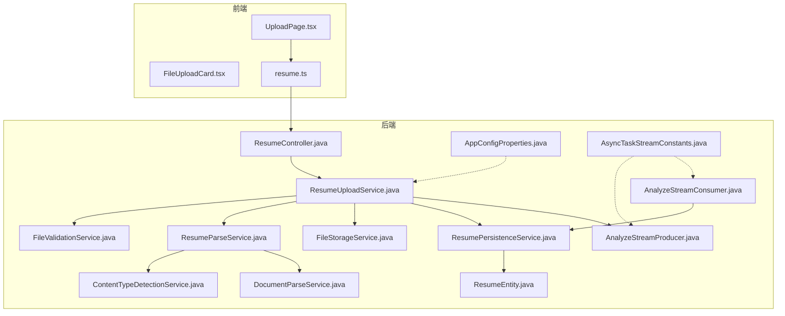
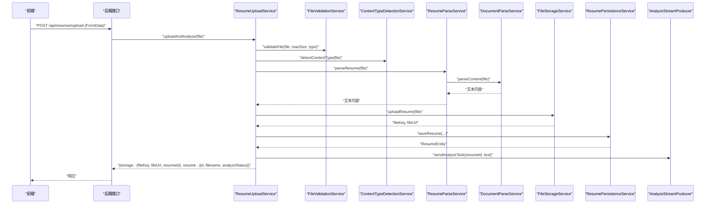
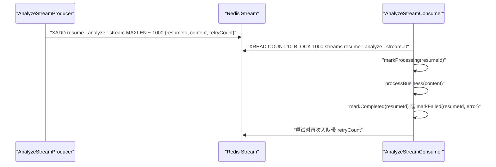
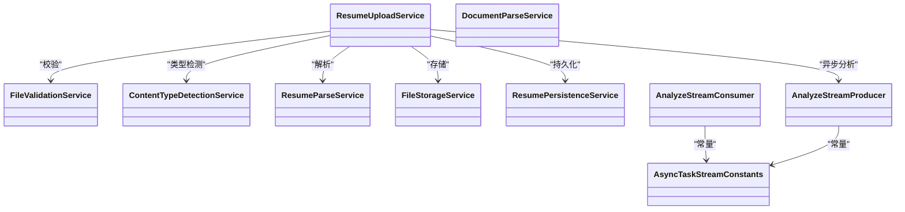

# 简历上传与处理

<cite>
**本文引用的文件**
- [ResumeUploadService.java](file://app/src/main/java/interview/guide/modules/resume/service/ResumeUploadService.java)
- [ResumeParseService.java](file://app/src/main/java/interview/guide/modules/resume/service/ResumeParseService.java)
- [ResumePersistenceService.java](file://app/src/main/java/interview/guide/modules/resume/service/ResumePersistenceService.java)
- [ResumeEntity.java](file://app/src/main/java/interview/guide/modules/resume/model/ResumeEntity.java)
- [ResumeDetailDTO.java](file://app/src/main/java/interview/guide/modules/resume/model/ResumeDetailDTO.java)
- [FileStorageService.java](file://app/src/main/java/interview/guide/infrastructure/file/FileStorageService.java)
- [FileValidationService.java](file://app/src/main/java/interview/guide/infrastructure/file/FileValidationService.java)
- [ContentTypeDetectionService.java](file://app/src/main/java/interview/guide/infrastructure/file/ContentTypeDetectionService.java)
- [DocumentParseService.java](file://app/src/main/java/interview/guide/infrastructure/file/DocumentParseService.java)
- [AnalyzeStreamProducer.java](file://app/src/main/java/interview/guide/modules/resume/listener/AnalyzeStreamProducer.java)
- [AnalyzeStreamConsumer.java](file://app/src/main/java/interview/guide/modules/resume/listener/AnalyzeStreamConsumer.java)
- [AppConfigProperties.java](file://app/src/main/java/interview/guide/common/config/AppConfigProperties.java)
- [AsyncTaskStreamConstants.java](file://app/src/main/java/interview/guide/common/constant/AsyncTaskStreamConstants.java)
- [UploadPage.tsx](file://frontend/src/pages/UploadPage.tsx)
- [FileUploadCard.tsx](file://frontend/src/components/FileUploadCard.tsx)
- [resume.ts](file://frontend/src/api/resume.ts)
</cite>

## 目录
1. [简介](#简介)
2. [项目结构](#项目结构)
3. [核心组件](#核心组件)
4. [架构总览](#架构总览)
5. [详细组件分析](#详细组件分析)
6. [依赖关系分析](#依赖关系分析)
7. [性能考量](#性能考量)
8. [故障排查指南](#故障排查指南)
9. [结论](#结论)
10. [附录](#附录)

## 简介
本文件面向“简历上传与处理”功能，系统性阐述从文件上传、格式与大小校验、内容类型检测、文件解析、存储、异步分析到前端交互的完整实现。重点覆盖以下方面：
- MultipartFile 参数处理与上传流程
- 内容类型检测服务（支持格式、MIME 识别、兼容性处理）
- 文件验证服务（完整性、大小限制、类型白名单）
- 文档解析服务（PDF、DOC/DOCX、TXT、MD 等）
- 文件存储服务（S3 兼容、命名策略、版本与访问控制）
- 异步处理（Redis Stream、进度跟踪、错误恢复、超时）
- 前端上传组件与用户体验优化

## 项目结构
简历模块位于后端 Java 工程的 modules/resume 子目录，基础设施位于 infrastructure/file；前端位于 frontend/src，包含上传页面、上传卡片组件与 API 请求封装。

图表来源
- [ResumeUploadService.java:47-110](file://app/src/main/java/interview/guide/modules/resume/service/ResumeUploadService.java#L47-L110)
- [ResumeParseService.java:30-64](file://app/src/main/java/interview/guide/modules/resume/service/ResumeParseService.java#L30-L64)
- [ResumePersistenceService.java:67-90](file://app/src/main/java/interview/guide/modules/resume/service/ResumePersistenceService.java#L67-L90)
- [FileStorageService.java:38-111](file://app/src/main/java/interview/guide/infrastructure/file/FileStorageService.java#L38-L111)
- [FileValidationService.java:27-36](file://app/src/main/java/interview/guide/infrastructure/file/FileValidationService.java#L27-L36)
- [ContentTypeDetectionService.java:32-39](file://app/src/main/java/interview/guide/infrastructure/file/ContentTypeDetectionService.java#L32-L39)
- [DocumentParseService.java:45-64](file://app/src/main/java/interview/guide/infrastructure/file/DocumentParseService.java#L45-L64)
- [AnalyzeStreamProducer.java:36-57](file://app/src/main/java/interview/guide/modules/resume/listener/AnalyzeStreamProducer.java#L36-L57)
- [AnalyzeStreamConsumer.java:91-105](file://app/src/main/java/interview/guide/modules/resume/listener/AnalyzeStreamConsumer.java#L91-L105)
- [AppConfigProperties.java:12-32](file://app/src/main/java/interview/guide/common/config/AppConfigProperties.java#L12-L32)
- [AsyncTaskStreamConstants.java:74-89](file://app/src/main/java/interview/guide/common/constant/AsyncTaskStreamConstants.java#L74-L89)

章节来源
- [ResumeUploadService.java:47-110](file://app/src/main/java/interview/guide/modules/resume/service/ResumeUploadService.java#L47-L110)
- [FileStorageService.java:38-111](file://app/src/main/java/interview/guide/infrastructure/file/FileStorageService.java#L38-L111)
- [FileValidationService.java:27-36](file://app/src/main/java/interview/guide/infrastructure/file/FileValidationService.java#L27-L36)
- [ContentTypeDetectionService.java:32-39](file://app/src/main/java/interview/guide/infrastructure/file/ContentTypeDetectionService.java#L32-L39)
- [DocumentParseService.java:45-64](file://app/src/main/java/interview/guide/infrastructure/file/DocumentParseService.java#L45-L64)
- [AnalyzeStreamProducer.java:36-57](file://app/src/main/java/interview/guide/modules/resume/listener/AnalyzeStreamProducer.java#L36-L57)
- [AnalyzeStreamConsumer.java:91-105](file://app/src/main/java/interview/guide/modules/resume/listener/AnalyzeStreamConsumer.java#L91-L105)
- [AppConfigProperties.java:12-32](file://app/src/main/java/interview/guide/common/config/AppConfigProperties.java#L12-L32)
- [AsyncTaskStreamConstants.java:74-89](file://app/src/main/java/interview/guide/common/constant/AsyncTaskStreamConstants.java#L74-L89)

## 核心组件
- 简历上传服务：负责文件校验、类型检测、解析、存储、去重、入库与异步分析任务派发。
- 简历解析服务：委托通用文档解析服务，提供 MultipartFile 与字节数组两种解析入口，并支持从存储下载后解析。
- 文件验证服务：校验文件是否为空、大小是否超限、类型是否在白名单内。
- 内容类型检测服务：基于 Apache Tika 的 MIME 类型检测，支持 PDF、DOC/DOCX、TXT、MD 等格式识别。
- 文档解析服务：使用 Tika 自动检测解析器与正文处理器，禁用嵌入文档抽取，优化 PDF 文本排序与图片提取配置。
- 文件存储服务：S3 兼容客户端封装，提供上传、下载、删除、存在性检查、URL 生成与桶存在性保障。
- 异步分析：基于 Redis Stream 的生产者/消费者模型，支持重试、状态标记与错误回退。
- 前端上传组件：拖拽/选择文件、格式与大小提示、上传状态反馈与错误提示。

章节来源
- [ResumeUploadService.java:47-110](file://app/src/main/java/interview/guide/modules/resume/service/ResumeUploadService.java#L47-L110)
- [ResumeParseService.java:30-64](file://app/src/main/java/interview/guide/modules/resume/service/ResumeParseService.java#L30-L64)
- [FileValidationService.java:27-36](file://app/src/main/java/interview/guide/infrastructure/file/FileValidationService.java#L27-L36)
- [ContentTypeDetectionService.java:32-39](file://app/src/main/java/interview/guide/infrastructure/file/ContentTypeDetectionService.java#L32-L39)
- [DocumentParseService.java:108-139](file://app/src/main/java/interview/guide/infrastructure/file/DocumentParseService.java#L108-L139)
- [FileStorageService.java:38-111](file://app/src/main/java/interview/guide/infrastructure/file/FileStorageService.java#L38-L111)
- [AnalyzeStreamProducer.java:36-57](file://app/src/main/java/interview/guide/modules/resume/listener/AnalyzeStreamProducer.java#L36-L57)
- [AnalyzeStreamConsumer.java:91-105](file://app/src/main/java/interview/guide/modules/resume/listener/AnalyzeStreamConsumer.java#L91-L105)

## 架构总览
简历上传处理采用“同步校验 + 异步分析”的解耦架构：上传阶段仅做必要校验与入库，真正的 AI 分析在后台异步完成，前端通过轮询或状态查询获取结果。

图表来源
- [ResumeUploadService.java:47-110](file://app/src/main/java/interview/guide/modules/resume/service/ResumeUploadService.java#L47-L110)
- [FileValidationService.java:27-36](file://app/src/main/java/interview/guide/infrastructure/file/FileValidationService.java#L27-L36)
- [ContentTypeDetectionService.java:32-39](file://app/src/main/java/interview/guide/infrastructure/file/ContentTypeDetectionService.java#L32-L39)
- [ResumeParseService.java:30-33](file://app/src/main/java/interview/guide/modules/resume/service/ResumeParseService.java#L30-L33)
- [DocumentParseService.java:45-64](file://app/src/main/java/interview/guide/infrastructure/file/DocumentParseService.java#L45-L64)
- [FileStorageService.java:38-111](file://app/src/main/java/interview/guide/infrastructure/file/FileStorageService.java#L38-L111)
- [ResumePersistenceService.java:67-90](file://app/src/main/java/interview/guide/modules/resume/service/ResumePersistenceService.java#L67-L90)
- [AnalyzeStreamProducer.java:36-57](file://app/src/main/java/interview/guide/modules/resume/listener/AnalyzeStreamProducer.java#L36-L57)

## 详细组件分析

### 组件一：简历上传服务（ResumeUploadService）
职责与流程
- 校验文件：空文件、大小上限（10MB）
- 类型检测：调用解析服务获取 MIME 类型，再由验证服务按白名单校验
- 去重：基于文件内容哈希计算，命中则复用历史分析结果
- 解析：调用解析服务提取文本
- 存储：上传至 S3 兼容存储，生成 fileKey 与 URL
- 入库：持久化简历元数据与解析文本，状态初始化为 PENDING
- 异步：向 Redis Stream 发送分析任务

关键要点
- 大小限制与重复检测优先于解析与存储，降低资源消耗
- 解析失败时抛出业务异常，避免脏数据入库
- 异步分析失败时通过生产者回调更新状态，便于前端感知

章节来源
- [ResumeUploadService.java:39-110](file://app/src/main/java/interview/guide/modules/resume/service/ResumeUploadService.java#L39-L110)
- [AppConfigProperties.java:26-32](file://app/src/main/java/interview/guide/common/config/AppConfigProperties.java#L26-L32)

### 组件二：文件验证服务（FileValidationService）
能力与规则
- 基础校验：空文件与大小上限
- 类型校验：支持 MIME 白名单匹配（包含“pdf”“msword”“wordprocessingml”“text/plain”“text/markdown”等关键词）
- 扩展名兜底：当 MIME 不匹配时，按扩展名判断（.md/.markdown/.mdown）

章节来源
- [FileValidationService.java:27-36](file://app/src/main/java/interview/guide/infrastructure/file/FileValidationService.java#L27-L36)
- [FileValidationService.java:45-50](file://app/src/main/java/interview/guide/infrastructure/file/FileValidationService.java#L45-L50)
- [FileValidationService.java:112-126](file://app/src/main/java/interview/guide/infrastructure/file/FileValidationService.java#L112-L126)

### 组件三：内容类型检测服务（ContentTypeDetectionService）
实现机制
- 基于 Apache Tika 的 InputStream/byte[]/文件名检测
- 对 PDF、DOC/DOCX、TXT、Markdown 提供便捷判断方法
- 当检测失败时回退到文件头的 Content-Type

章节来源
- [ContentTypeDetectionService.java:32-39](file://app/src/main/java/interview/guide/infrastructure/file/ContentTypeDetectionService.java#L32-L39)
- [ContentTypeDetectionService.java:71-108](file://app/src/main/java/interview/guide/infrastructure/file/ContentTypeDetectionService.java#L71-L108)

### 组件四：文档解析服务（DocumentParseService）
核心算法与优化
- 自动检测解析器 + 正文处理器：仅提取正文，限制最大文本长度（5MB）
- 禁用嵌入文档抽取：避免提取图片引用与临时路径
- PDF 专用配置：关闭内联图片提取，启用按坐标排序文本
- 字节流/输入流/字节数组三种入口，统一清洗输出

章节来源
- [DocumentParseService.java:108-139](file://app/src/main/java/interview/guide/infrastructure/file/DocumentParseService.java#L108-L139)
- [DocumentParseService.java:45-64](file://app/src/main/java/interview/guide/infrastructure/file/DocumentParseService.java#L45-L64)
- [DocumentParseService.java:73-91](file://app/src/main/java/interview/guide/infrastructure/file/DocumentParseService.java#L73-L91)

### 组件五：文件存储服务（FileStorageService）
架构设计
- S3 兼容客户端封装：上传/下载/删除/存在性检查/桶存在性保障
- 文件命名策略：按日期分片 + UUID 前缀 + 安全文件名（中文转拼音、特殊字符清理）
- URL 生成：基于 endpoint/bucket/key 拼接
- 错误处理：对 IO 与 S3 异常进行业务异常包装

章节来源
- [FileStorageService.java:89-111](file://app/src/main/java/interview/guide/infrastructure/file/FileStorageService.java#L89-L111)
- [FileStorageService.java:206-212](file://app/src/main/java/interview/guide/infrastructure/file/FileStorageService.java#L206-L212)
- [FileStorageService.java:177-179](file://app/src/main/java/interview/guide/infrastructure/file/FileStorageService.java#L177-L179)

### 组件六：异步分析（Redis Stream）
实现细节
- 生产者：构建消息字段（简历 ID、内容、重试计数），失败时更新状态为 FAILED
- 消费者：分组消费、标记 PROCESSING/COMPLETED/FAILED，支持重试入队与最大重试次数
- 常量：统一的 Stream Key、分组名、消费者前缀、批次大小、轮询间隔、最大长度

图表来源
- [AnalyzeStreamProducer.java:36-57](file://app/src/main/java/interview/guide/modules/resume/listener/AnalyzeStreamProducer.java#L36-L57)
- [AnalyzeStreamConsumer.java:91-105](file://app/src/main/java/interview/guide/modules/resume/listener/AnalyzeStreamConsumer.java#L91-L105)
- [AsyncTaskStreamConstants.java:74-89](file://app/src/main/java/interview/guide/common/constant/AsyncTaskStreamConstants.java#L74-L89)

章节来源
- [AnalyzeStreamProducer.java:36-57](file://app/src/main/java/interview/guide/modules/resume/listener/AnalyzeStreamProducer.java#L36-L57)
- [AnalyzeStreamConsumer.java:118-139](file://app/src/main/java/interview/guide/modules/resume/listener/AnalyzeStreamConsumer.java#L118-L139)
- [AsyncTaskStreamConstants.java:29-45](file://app/src/main/java/interview/guide/common/constant/AsyncTaskStreamConstants.java#L29-L45)

### 组件七：前端上传组件与体验优化
前端实现
- UploadPage：封装上传调用，接收后跳转简历库（分析异步进行）
- FileUploadCard：拖拽/选择、文件预览、格式与大小提示、上传按钮状态与错误提示
- API 封装：使用 FormData 上传文件

用户体验优化
- 上传前本地提示支持格式与大小
- 上传中禁用按钮并展示加载态
- 错误统一提示，失败可重试
- 与后端异步状态配合，避免阻塞等待

章节来源
- [UploadPage.tsx:14-32](file://frontend/src/pages/UploadPage.tsx#L14-L32)
- [FileUploadCard.tsx:59-85](file://frontend/src/components/FileUploadCard.tsx#L59-L85)
- [FileUploadCard.tsx:206-287](file://frontend/src/components/FileUploadCard.tsx#L206-L287)
- [resume.ts:8-12](file://frontend/src/api/resume.ts#L8-L12)

## 依赖关系分析
组件耦合与协作
- ResumeUploadService 依赖 FileValidationService、ContentTypeDetectionService、DocumentParseService、FileStorageService、ResumePersistenceService、AnalyzeStreamProducer
- ResumeParseService 作为门面，委托 DocumentParseService 与 ContentTypeDetectionService
- Redis Stream 生产者/消费者通过公共常量对接，保证一致性
- 前端通过 API 层与后端解耦

图表来源
- [ResumeUploadService.java:31-37](file://app/src/main/java/interview/guide/modules/resume/service/ResumeUploadService.java#L31-L37)
- [ResumeParseService.java:20-22](file://app/src/main/java/interview/guide/modules/resume/service/ResumeParseService.java#L20-L22)
- [AnalyzeStreamProducer.java:25-28](file://app/src/main/java/interview/guide/modules/resume/listener/AnalyzeStreamProducer.java#L25-L28)
- [AnalyzeStreamConsumer.java:30-40](file://app/src/main/java/interview/guide/modules/resume/listener/AnalyzeStreamConsumer.java#L30-L40)
- [AsyncTaskStreamConstants.java:74-89](file://app/src/main/java/interview/guide/common/constant/AsyncTaskStreamConstants.java#L74-L89)

章节来源
- [ResumeUploadService.java:31-37](file://app/src/main/java/interview/guide/modules/resume/service/ResumeUploadService.java#L31-L37)
- [ResumeParseService.java:20-22](file://app/src/main/java/interview/guide/modules/resume/service/ResumeParseService.java#L20-L22)
- [AnalyzeStreamProducer.java:25-28](file://app/src/main/java/interview/guide/modules/resume/listener/AnalyzeStreamProducer.java#L25-L28)
- [AnalyzeStreamConsumer.java:30-40](file://app/src/main/java/interview/guide/modules/resume/listener/AnalyzeStreamConsumer.java#L30-L40)

## 性能考量
- 解析性能
  - 限制最大文本长度（5MB），避免超大文档导致内存压力
  - 禁用嵌入文档抽取，减少无关内容解析开销
  - PDF 启用按坐标排序文本，提升多栏布局的解析顺序质量
- 存储性能
  - S3 客户端直接以 InputStream 上传，避免中间缓冲
  - 文件名安全清洗与拼音转换，减少存储异常
- 异步处理
  - Redis Stream 批量拉取与轮询间隔可控，平衡吞吐与延迟
  - 最大长度裁剪防止消息无限增长
- 前端体验
  - 上传中禁用按钮与加载动画，避免重复提交
  - 错误提示明确，减少无效重试

## 故障排查指南
常见问题与定位
- 文件上传失败
  - 检查文件是否为空、是否超过 10MB 限制
  - 核对类型白名单与实际 MIME 类型
- 解析失败
  - 查看解析异常日志，确认是否为 PDF 扫描版或加密
  - 确认 Tika 依赖可用且未触发异常
- 存储失败
  - 检查 S3 端点、桶名、凭证配置
  - 确认桶存在性与权限
- 异步分析未完成
  - 检查 Redis Stream 消费组是否正常、消费者线程是否存活
  - 关注重试次数与最大重试阈值
- 前端无响应
  - 检查网络请求与跨域配置
  - 确认上传按钮禁用状态与错误提示

章节来源
- [FileValidationService.java:27-36](file://app/src/main/java/interview/guide/infrastructure/file/FileValidationService.java#L27-L36)
- [DocumentParseService.java:55-63](file://app/src/main/java/interview/guide/infrastructure/file/DocumentParseService.java#L55-L63)
- [FileStorageService.java:104-110](file://app/src/main/java/interview/guide/infrastructure/file/FileStorageService.java#L104-L110)
- [AnalyzeStreamConsumer.java:118-139](file://app/src/main/java/interview/guide/modules/resume/listener/AnalyzeStreamConsumer.java#L118-L139)
- [UploadPage.tsx:18-31](file://frontend/src/pages/UploadPage.tsx#L18-L31)

## 结论
该简历上传与处理功能通过严格的文件校验、精准的内容类型检测、高效的文档解析与可靠的 S3 存储，结合 Redis Stream 的异步分析，实现了高可用、高性能的端到端流程。前端组件提供良好的用户引导与反馈，整体具备良好的可维护性与扩展性。

## 附录
- 数据模型（简化）
  - 简历实体包含文件哈希、原始名、大小、类型、存储键/URL、解析文本、分析状态与错误信息等字段
  - 简历详情 DTO 提供对外展示所需字段集合

章节来源
- [ResumeEntity.java:18-66](file://app/src/main/java/interview/guide/modules/resume/model/ResumeEntity.java#L18-L66)
- [ResumeDetailDTO.java:11-24](file://app/src/main/java/interview/guide/modules/resume/model/ResumeDetailDTO.java#L11-L24)