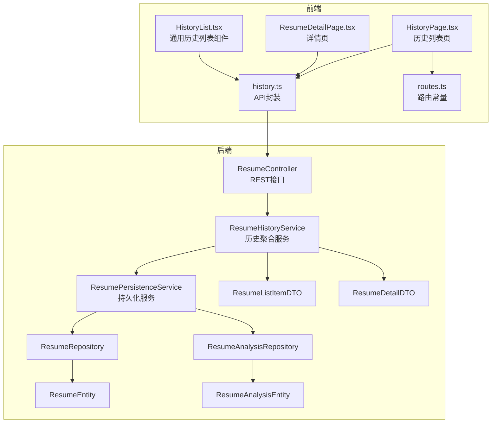
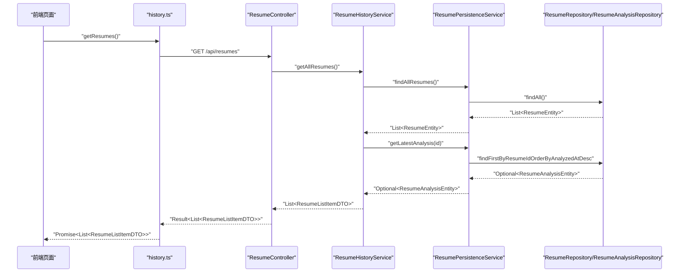
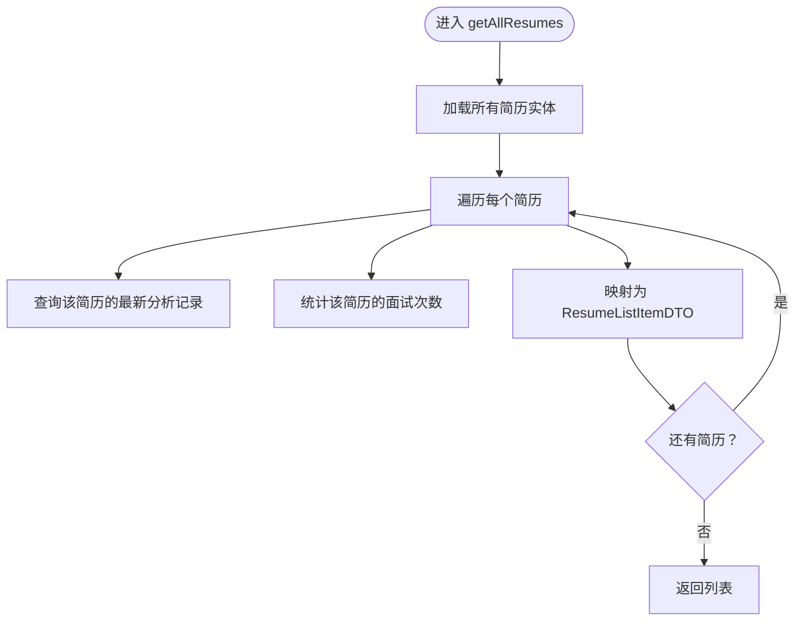
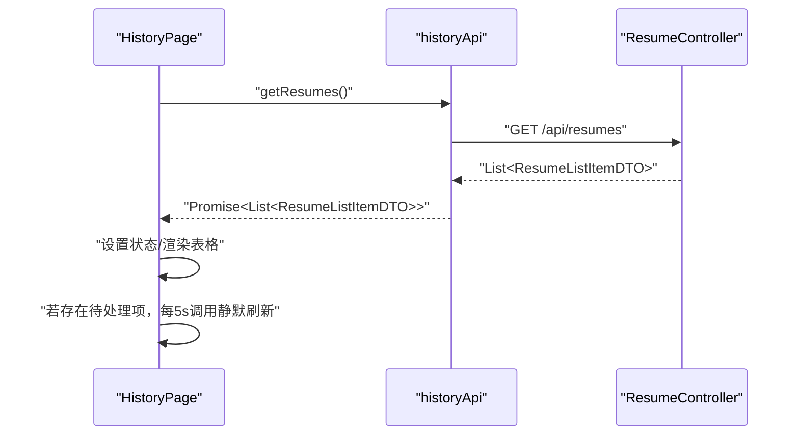
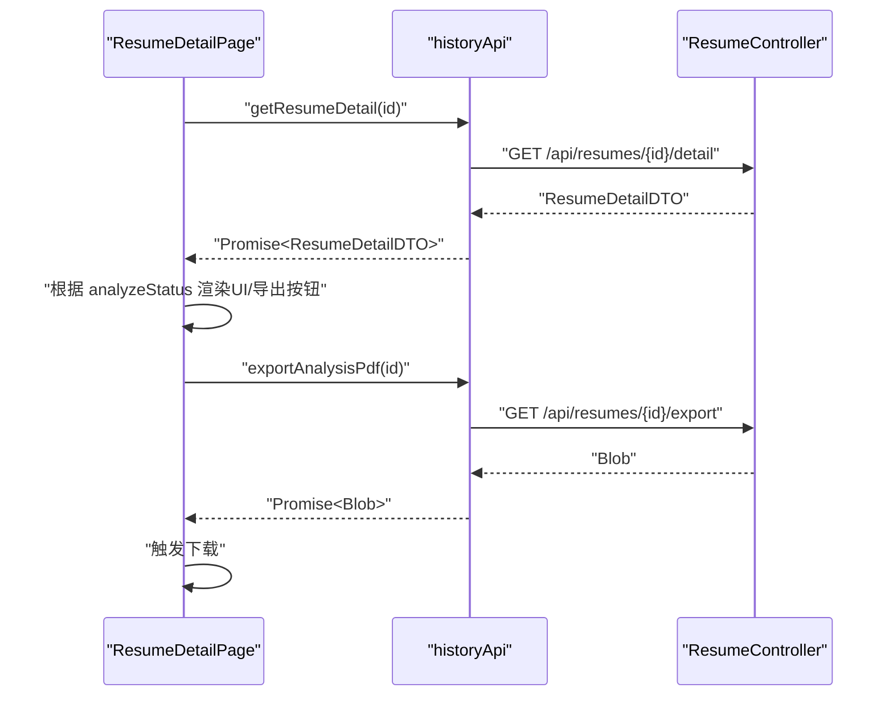
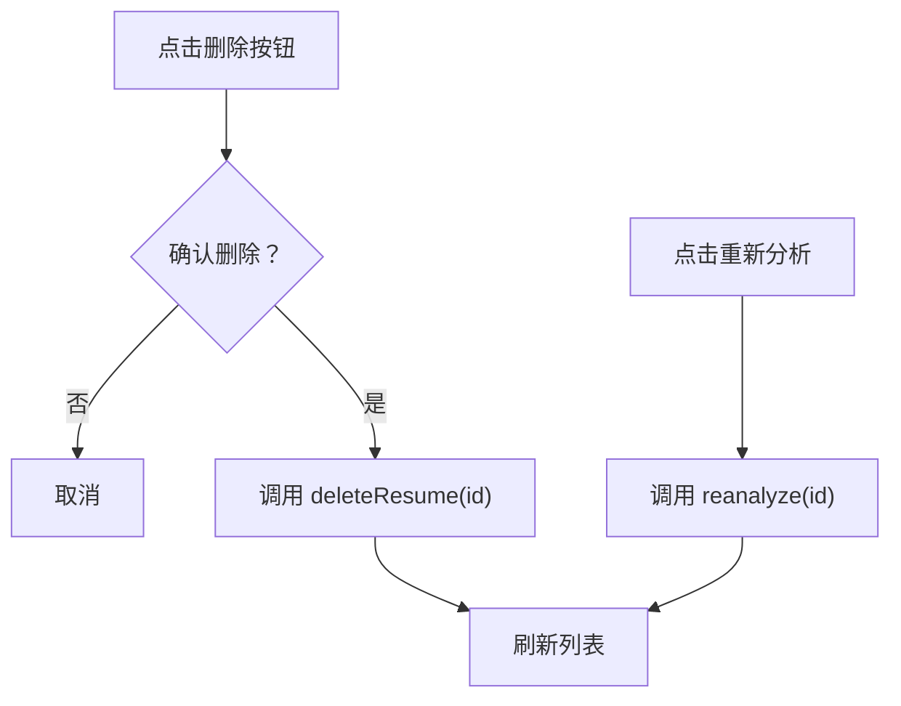
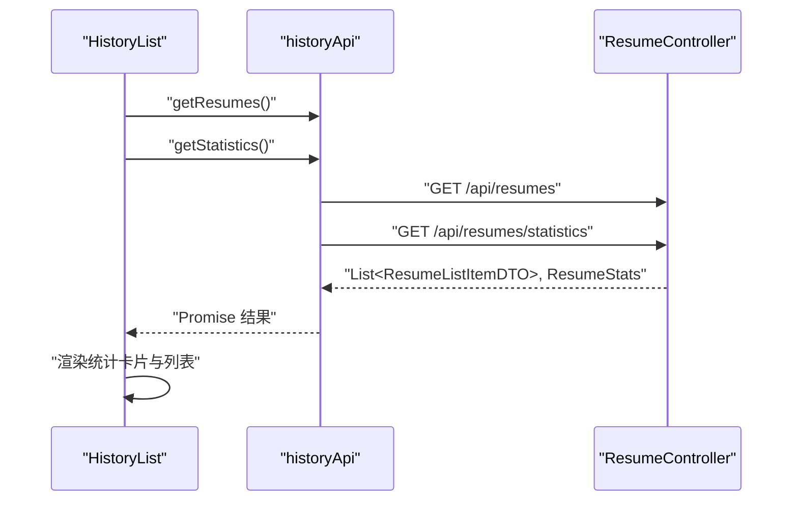
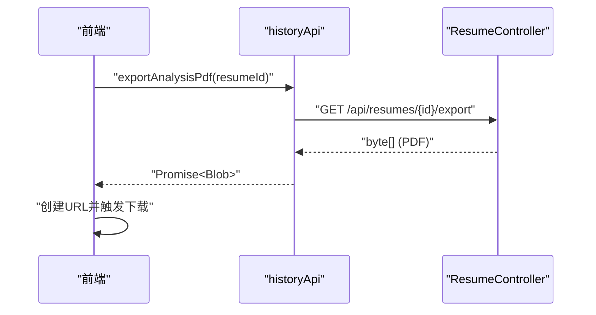
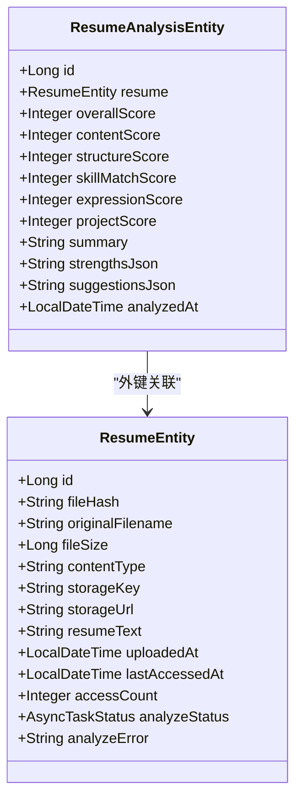
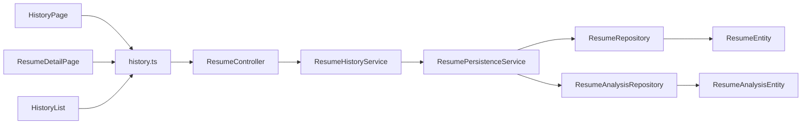

# 简历历史管理

<cite>
**本文引用的文件**
- [app/src/main/java/interview/guide/modules/resume/service/ResumeHistoryService.java](file://app/src/main/java/interview/guide/modules/resume/service/ResumeHistoryService.java)
- [app/src/main/java/interview/guide/modules/resume/service/ResumePersistenceService.java](file://app/src/main/java/interview/guide/modules/resume/service/ResumePersistenceService.java)
- [app/src/main/java/interview/guide/modules/resume/repository/ResumeRepository.java](file://app/src/main/java/interview/guide/modules/resume/repository/ResumeRepository.java)
- [app/src/main/java/interview/guide/modules/resume/repository/ResumeAnalysisRepository.java](file://app/src/main/java/interview/guide/modules/resume/repository/ResumeAnalysisRepository.java)
- [app/src/main/java/interview/guide/modules/resume/model/ResumeEntity.java](file://app/src/main/java/interview/guide/modules/resume/model/ResumeEntity.java)
- [app/src/main/java/interview/guide/modules/resume/model/ResumeAnalysisEntity.java](file://app/src/main/java/interview/guide/modules/resume/model/ResumeAnalysisEntity.java)
- [app/src/main/java/interview/guide/modules/resume/model/ResumeListItemDTO.java](file://app/src/main/java/interview/guide/modules/resume/model/ResumeListItemDTO.java)
- [app/src/main/java/interview/guide/modules/resume/model/ResumeDetailDTO.java](file://app/src/main/java/interview/guide/modules/resume/model/ResumeDetailDTO.java)
- [app/src/main/java/interview/guide/modules/resume/ResumeController.java](file://app/src/main/java/interview/guide/modules/resume/ResumeController.java)
- [frontend/src/api/history.ts](file://frontend/src/api/history.ts)
- [frontend/src/pages/HistoryPage.tsx](file://frontend/src/pages/HistoryPage.tsx)
- [frontend/src/pages/ResumeDetailPage.tsx](file://frontend/src/pages/ResumeDetailPage.tsx)
- [frontend/src/components/HistoryList.tsx](file://frontend/src/components/HistoryList.tsx)
- [frontend/src/constants/routes.ts](file://frontend/src/constants/routes.ts)
</cite>

## 目录
1. [简介](#简介)
2. [项目结构](#项目结构)
3. [核心组件](#核心组件)
4. [架构总览](#架构总览)
5. [详细组件分析](#详细组件分析)
6. [依赖分析](#依赖分析)
7. [性能考量](#性能考量)
8. [故障排查指南](#故障排查指南)
9. [结论](#结论)
10. [附录](#附录)

## 简介
本文件围绕“简历历史管理”功能，系统化梳理后端服务、数据库模型、前端页面与API之间的协作机制。重点覆盖以下方面：
- 历史记录查询：数据库查询优化、分页处理、排序规则、过滤条件
- 前端展示：数据绑定、加载状态、错误处理、轮询与交互
- 历史详情页：数据渲染、样式适配、交互逻辑、响应式设计
- 批量操作：选择机制、批量删除、状态更新、操作确认
- 数据统计与分析：历史趋势、使用频率、成功率统计、性能指标
- 数据导出：PDF导出、筛选条件、批量导出
- 生命周期管理：自动清理策略、存储优化、备份恢复
- 前端路由与状态管理：路由设计、状态流转、动画与交互

## 项目结构
简历历史管理功能横跨后端Spring Boot模块与前端React应用，核心文件分布如下：
- 后端模块（resume）：控制器、服务、持久层、实体与DTO
- 前端模块（frontend）：API封装、历史列表页、详情页、通用组件

**图表来源**
- [app/src/main/java/interview/guide/modules/resume/ResumeController.java:1-132](file://app/src/main/java/interview/guide/modules/resume/ResumeController.java#L1-L132)
- [app/src/main/java/interview/guide/modules/resume/service/ResumeHistoryService.java:1-184](file://app/src/main/java/interview/guide/modules/resume/service/ResumeHistoryService.java#L1-L184)
- [app/src/main/java/interview/guide/modules/resume/service/ResumePersistenceService.java:1-208](file://app/src/main/java/interview/guide/modules/resume/service/ResumePersistenceService.java#L1-L208)
- [app/src/main/java/interview/guide/modules/resume/repository/ResumeRepository.java:1-25](file://app/src/main/java/interview/guide/modules/resume/repository/ResumeRepository.java#L1-L25)
- [app/src/main/java/interview/guide/modules/resume/repository/ResumeAnalysisRepository.java:1-31](file://app/src/main/java/interview/guide/modules/resume/repository/ResumeAnalysisRepository.java#L1-L31)
- [app/src/main/java/interview/guide/modules/resume/model/ResumeEntity.java:1-184](file://app/src/main/java/interview/guide/modules/resume/model/ResumeEntity.java#L1-L184)
- [app/src/main/java/interview/guide/modules/resume/model/ResumeAnalysisEntity.java:1-152](file://app/src/main/java/interview/guide/modules/resume/model/ResumeAnalysisEntity.java#L1-L152)
- [app/src/main/java/interview/guide/modules/resume/model/ResumeListItemDTO.java:1-23](file://app/src/main/java/interview/guide/modules/resume/model/ResumeListItemDTO.java#L1-L23)
- [app/src/main/java/interview/guide/modules/resume/model/ResumeDetailDTO.java:1-43](file://app/src/main/java/interview/guide/modules/resume/model/ResumeDetailDTO.java#L1-L43)
- [frontend/src/api/history.ts:1-162](file://frontend/src/api/history.ts#L1-L162)
- [frontend/src/pages/HistoryPage.tsx:1-338](file://frontend/src/pages/HistoryPage.tsx#L1-L338)
- [frontend/src/pages/ResumeDetailPage.tsx:1-361](file://frontend/src/pages/ResumeDetailPage.tsx#L1-L361)
- [frontend/src/components/HistoryList.tsx:1-452](file://frontend/src/components/HistoryList.tsx#L1-L452)
- [frontend/src/constants/routes.ts:1-6](file://frontend/src/constants/routes.ts#L1-L6)

**章节来源**
- [app/src/main/java/interview/guide/modules/resume/ResumeController.java:1-132](file://app/src/main/java/interview/guide/modules/resume/ResumeController.java#L1-L132)
- [frontend/src/api/history.ts:1-162](file://frontend/src/api/history.ts#L1-L162)

## 核心组件
- 后端控制器：提供简历列表、详情、导出、删除、重新分析等REST接口
- 历史服务：聚合简历列表与详情，提取分析历史与面试历史，负责PDF导出
- 持久化服务：简历与分析记录的保存、查询、删除，含去重与事务控制
- 仓库层：JPA仓库，提供按简历ID查询分析记录、按时间倒序等查询
- 实体与DTO：简历与分析记录的数据库映射，以及前后端传输对象
- 前端API：统一封装HTTP请求，支持Blob下载、并发加载统计
- 前端页面：历史列表、详情页、通用历史列表组件，支持轮询、搜索、删除确认、导出

**章节来源**
- [app/src/main/java/interview/guide/modules/resume/service/ResumeHistoryService.java:1-184](file://app/src/main/java/interview/guide/modules/resume/service/ResumeHistoryService.java#L1-L184)
- [app/src/main/java/interview/guide/modules/resume/service/ResumePersistenceService.java:1-208](file://app/src/main/java/interview/guide/modules/resume/service/ResumePersistenceService.java#L1-L208)
- [app/src/main/java/interview/guide/modules/resume/repository/ResumeAnalysisRepository.java:1-31](file://app/src/main/java/interview/guide/modules/resume/repository/ResumeAnalysisRepository.java#L1-L31)
- [app/src/main/java/interview/guide/modules/resume/model/ResumeEntity.java:1-184](file://app/src/main/java/interview/guide/modules/resume/model/ResumeEntity.java#L1-L184)
- [app/src/main/java/interview/guide/modules/resume/model/ResumeAnalysisEntity.java:1-152](file://app/src/main/java/interview/guide/modules/resume/model/ResumeAnalysisEntity.java#L1-L152)
- [frontend/src/api/history.ts:1-162](file://frontend/src/api/history.ts#L1-L162)
- [frontend/src/pages/HistoryPage.tsx:1-338](file://frontend/src/pages/HistoryPage.tsx#L1-L338)
- [frontend/src/pages/ResumeDetailPage.tsx:1-361](file://frontend/src/pages/ResumeDetailPage.tsx#L1-L361)
- [frontend/src/components/HistoryList.tsx:1-452](file://frontend/src/components/HistoryList.tsx#L1-L452)

## 架构总览
简历历史管理采用经典的三层架构：前端通过API封装调用后端REST接口；后端控制器协调服务层，服务层通过仓库层访问数据库；实体与DTO承担数据传输与映射职责。

**图表来源**
- [frontend/src/api/history.ts:94-96](file://frontend/src/api/history.ts#L94-L96)
- [app/src/main/java/interview/guide/modules/resume/ResumeController.java:59-63](file://app/src/main/java/interview/guide/modules/resume/ResumeController.java#L59-L63)
- [app/src/main/java/interview/guide/modules/resume/service/ResumeHistoryService.java:43-74](file://app/src/main/java/interview/guide/modules/resume/service/ResumeHistoryService.java#L43-L74)
- [app/src/main/java/interview/guide/modules/resume/service/ResumePersistenceService.java:134-136](file://app/src/main/java/interview/guide/modules/resume/service/ResumePersistenceService.java#L134-L136)
- [app/src/main/java/interview/guide/modules/resume/repository/ResumeAnalysisRepository.java:22-24](file://app/src/main/java/interview/guide/modules/resume/repository/ResumeAnalysisRepository.java#L22-L24)

## 详细组件分析

### 历史记录查询与展示（后端）
- 查询入口：控制器提供“获取所有简历列表”的接口，服务层聚合简历与分析记录，返回轻量DTO
- 排序规则：分析记录按“评测时间倒序”，确保最新分析优先
- 过滤条件：前端提供关键词过滤（按文件名），后端未实现服务端分页
- 去重策略：基于文件哈希（SHA-256）进行重复检测，避免重复存储

**图表来源**
- [app/src/main/java/interview/guide/modules/resume/service/ResumeHistoryService.java:43-74](file://app/src/main/java/interview/guide/modules/resume/service/ResumeHistoryService.java#L43-L74)
- [app/src/main/java/interview/guide/modules/resume/service/ResumePersistenceService.java:119-136](file://app/src/main/java/interview/guide/modules/resume/service/ResumePersistenceService.java#L119-L136)
- [app/src/main/java/interview/guide/modules/resume/repository/ResumeAnalysisRepository.java:22-24](file://app/src/main/java/interview/guide/modules/resume/repository/ResumeAnalysisRepository.java#L22-L24)

**章节来源**
- [app/src/main/java/interview/guide/modules/resume/ResumeController.java:59-63](file://app/src/main/java/interview/guide/modules/resume/ResumeController.java#L59-L63)
- [app/src/main/java/interview/guide/modules/resume/service/ResumeHistoryService.java:43-74](file://app/src/main/java/interview/guide/modules/resume/service/ResumeHistoryService.java#L43-L74)
- [app/src/main/java/interview/guide/modules/resume/service/ResumePersistenceService.java:45-62](file://app/src/main/java/interview/guide/modules/resume/service/ResumePersistenceService.java#L45-L62)

### 前端历史列表展示
- 数据绑定：使用并发请求同时加载简历列表与统计信息，提升首屏速度
- 轮询机制：当存在“待处理/分析中/未定义且无分数”的条目时，每5秒静默刷新
- 搜索过滤：本地过滤（不区分大小写），实时反馈
- 加载与空状态：骨架屏与空态组件，改善弱网体验
- 删除确认：二次确认对话框，明确删除范围（分析记录、面试记录）

**图表来源**
- [frontend/src/pages/HistoryPage.tsx:125-176](file://frontend/src/pages/HistoryPage.tsx#L125-L176)
- [frontend/src/api/history.ts:94-96](file://frontend/src/api/history.ts#L94-L96)
- [app/src/main/java/interview/guide/modules/resume/ResumeController.java:59-63](file://app/src/main/java/interview/guide/modules/resume/ResumeController.java#L59-L63)

**章节来源**
- [frontend/src/pages/HistoryPage.tsx:1-338](file://frontend/src/pages/HistoryPage.tsx#L1-L338)
- [frontend/src/components/HistoryList.tsx:116-176](file://frontend/src/components/HistoryList.tsx#L116-L176)
- [frontend/src/api/history.ts:1-162](file://frontend/src/api/history.ts#L1-L162)

### 历史详情页面
- 标签页切换：简历分析与面试记录双标签，支持数量徽标
- 详情渲染：根据分析状态决定UI呈现（评分进度条、失败提示、重新分析按钮）
- 导出功能：支持导出简历分析PDF，下载Blob并触发浏览器下载
- 自动轮询：当分析状态为“待处理/分析中/未定义且无结果”时，每5秒刷新
- 面试详情联动：支持从路由状态自动打开某次面试详情

**图表来源**
- [frontend/src/pages/ResumeDetailPage.tsx:42-129](file://frontend/src/pages/ResumeDetailPage.tsx#L42-L129)
- [frontend/src/api/history.ts:101-121](file://frontend/src/api/history.ts#L101-L121)
- [app/src/main/java/interview/guide/modules/resume/ResumeController.java:68-91](file://app/src/main/java/interview/guide/modules/resume/ResumeController.java#L68-L91)

**章节来源**
- [frontend/src/pages/ResumeDetailPage.tsx:1-361](file://frontend/src/pages/ResumeDetailPage.tsx#L1-L361)
- [frontend/src/api/history.ts:69-82](file://frontend/src/api/history.ts#L69-L82)

### 批量操作与交互
- 单选删除：点击删除按钮弹出确认对话框，确认后调用后端删除接口并刷新
- 重新分析：针对“失败”状态的简历提供重新分析按钮，调用后端重新触发分析任务
- 操作状态：删除与重新分析过程中禁用按钮并显示加载动画，防止重复提交

**图表来源**
- [frontend/src/components/HistoryList.tsx:205-223](file://frontend/src/components/HistoryList.tsx#L205-L223)
- [frontend/src/pages/HistoryPage.tsx:80-99](file://frontend/src/pages/HistoryPage.tsx#L80-L99)
- [frontend/src/api/history.ts:137-139](file://frontend/src/api/history.ts#L137-L139)
- [frontend/src/api/history.ts:158-160](file://frontend/src/api/history.ts#L158-L160)

**章节来源**
- [frontend/src/components/HistoryList.tsx:191-223](file://frontend/src/components/HistoryList.tsx#L191-L223)
- [frontend/src/pages/HistoryPage.tsx:80-99](file://frontend/src/pages/HistoryPage.tsx#L80-L99)
- [frontend/src/api/history.ts:137-160](file://frontend/src/api/history.ts#L137-L160)

### 数据统计与分析
- 统计卡片：简历总数、面试总数、总访问次数，前端并发加载
- 展示位置：历史列表页顶部以卡片形式展示
- 数据来源：后端提供统计接口，前端在加载时并行请求

**图表来源**
- [frontend/src/components/HistoryList.tsx:126-154](file://frontend/src/components/HistoryList.tsx#L126-L154)
- [frontend/src/api/history.ts:151-153](file://frontend/src/api/history.ts#L151-L153)
- [app/src/main/java/interview/guide/modules/resume/ResumeController.java:59-63](file://app/src/main/java/interview/guide/modules/resume/ResumeController.java#L59-L63)

**章节来源**
- [frontend/src/components/HistoryList.tsx:85-114](file://frontend/src/components/HistoryList.tsx#L85-L114)
- [frontend/src/api/history.ts:20-24](file://frontend/src/api/history.ts#L20-L24)

### 数据导出（PDF）
- 简历分析报告：后端将简历与最新分析结果转为PDF字节流，前端以Blob方式下载
- 面试报告：同样支持按会话ID导出面试PDF
- 错误处理：导出失败时前端弹窗提示

**图表来源**
- [frontend/src/pages/ResumeDetailPage.tsx:112-129](file://frontend/src/pages/ResumeDetailPage.tsx#L112-L129)
- [frontend/src/api/history.ts:115-121](file://frontend/src/api/history.ts#L115-L121)
- [app/src/main/java/interview/guide/modules/resume/ResumeController.java:77-91](file://app/src/main/java/interview/guide/modules/resume/ResumeController.java#L77-L91)

**章节来源**
- [frontend/src/pages/ResumeDetailPage.tsx:112-148](file://frontend/src/pages/ResumeDetailPage.tsx#L112-L148)
- [frontend/src/api/history.ts:115-132](file://frontend/src/api/history.ts#L115-L132)

### 生命周期管理
- 存储优化：简历实体包含文件哈希索引，用于去重；分析记录按时间倒序存储，便于快速获取最新结果
- 删除策略：删除简历时级联删除其分析记录；面试会话在服务层删除（由其他模块实现）
- 访问统计：每次命中重复简历会增加访问计数与最后访问时间
- 备份恢复：建议结合数据库备份策略与对象存储（RustFS）快照进行定期备份

**图表来源**
- [app/src/main/java/interview/guide/modules/resume/model/ResumeEntity.java:1-184](file://app/src/main/java/interview/guide/modules/resume/model/ResumeEntity.java#L1-L184)
- [app/src/main/java/interview/guide/modules/resume/model/ResumeAnalysisEntity.java:1-152](file://app/src/main/java/interview/guide/modules/resume/model/ResumeAnalysisEntity.java#L1-L152)
- [app/src/main/java/interview/guide/modules/resume/repository/ResumeAnalysisRepository.java:19-29](file://app/src/main/java/interview/guide/modules/resume/repository/ResumeAnalysisRepository.java#L19-L29)

**章节来源**
- [app/src/main/java/interview/guide/modules/resume/model/ResumeEntity.java:13-15](file://app/src/main/java/interview/guide/modules/resume/model/ResumeEntity.java#L13-L15)
- [app/src/main/java/interview/guide/modules/resume/service/ResumePersistenceService.java:187-206](file://app/src/main/java/interview/guide/modules/resume/service/ResumePersistenceService.java#L187-L206)

### 前端路由与状态管理
- 路由常量：统一管理上传页等路由路径
- 页面跳转：历史页提供“上传简历”“模拟面试”等导航
- 状态流转：详情页通过标签页切换与面包屑导航实现视图切换；面试详情通过路由状态自动打开

**章节来源**
- [frontend/src/constants/routes.ts:1-6](file://frontend/src/constants/routes.ts#L1-L6)
- [frontend/src/pages/HistoryPage.tsx:121-135](file://frontend/src/pages/HistoryPage.tsx#L121-L135)
- [frontend/src/pages/ResumeDetailPage.tsx:90-110](file://frontend/src/pages/ResumeDetailPage.tsx#L90-L110)

## 依赖分析
- 控制器依赖服务层，服务层依赖持久化服务与仓库层
- 前端API封装统一调用后端REST接口，页面组件负责状态与交互
- 数据库层面简历与分析记录存在一对多关系，分析记录按时间倒序查询

**图表来源**
- [app/src/main/java/interview/guide/modules/resume/ResumeController.java:1-132](file://app/src/main/java/interview/guide/modules/resume/ResumeController.java#L1-L132)
- [app/src/main/java/interview/guide/modules/resume/service/ResumeHistoryService.java:1-184](file://app/src/main/java/interview/guide/modules/resume/service/ResumeHistoryService.java#L1-L184)
- [app/src/main/java/interview/guide/modules/resume/service/ResumePersistenceService.java:1-208](file://app/src/main/java/interview/guide/modules/resume/service/ResumePersistenceService.java#L1-L208)
- [frontend/src/api/history.ts:1-162](file://frontend/src/api/history.ts#L1-L162)

**章节来源**
- [app/src/main/java/interview/guide/modules/resume/ResumeController.java:1-132](file://app/src/main/java/interview/guide/modules/resume/ResumeController.java#L1-L132)
- [frontend/src/api/history.ts:1-162](file://frontend/src/api/history.ts#L1-L162)

## 性能考量
- 查询优化
  - 索引：简历表对文件哈希建立唯一索引，加速去重与重复检测
  - 排序：分析记录按评测时间倒序，减少额外排序开销
- 并发与轮询
  - 前端并发加载列表与统计，缩短首屏时间
  - 对“待处理/分析中”条目采用定时轮询，避免长连接
- 前端渲染
  - 使用骨架屏与空态组件，降低感知延迟
  - 评分进度条动画仅在必要时触发动画，避免频繁重排
- 导出与下载
  - PDF导出以Blob形式直接下载，避免中间层复制

[本节为通用性能建议，无需特定文件引用]

## 故障排查指南
- 导出失败
  - 现象：导出PDF时报错或下载为空
  - 排查：检查后端日志与异常栈；确认简历与分析记录存在；确认存储URL可用
- 分析状态异常
  - 现象：状态长时间停留在“待处理/分析中”
  - 排查：检查异步任务调度与队列；确认轮询是否正常触发
- 删除失败
  - 现象：删除按钮无响应或报错
  - 排查：确认后端删除接口返回；检查前端确认对话框逻辑
- 重复上传
  - 现象：重复文件未命中去重
  - 排查：确认文件哈希计算正确；检查数据库索引是否生效

**章节来源**
- [app/src/main/java/interview/guide/modules/resume/service/ResumeHistoryService.java:155-176](file://app/src/main/java/interview/guide/modules/resume/service/ResumeHistoryService.java#L155-L176)
- [app/src/main/java/interview/guide/modules/resume/service/ResumePersistenceService.java:45-62](file://app/src/main/java/interview/guide/modules/resume/service/ResumePersistenceService.java#L45-L62)
- [frontend/src/pages/ResumeDetailPage.tsx:112-129](file://frontend/src/pages/ResumeDetailPage.tsx#L112-L129)

## 结论
简历历史管理功能通过清晰的分层设计与前后端协同，实现了从历史查询、详情渲染到导出与删除的完整闭环。后端以实体与DTO分离、仓库层查询优化为基础，前端以并发加载、轮询与交互优化为核心，整体具备良好的可维护性与扩展性。后续可在服务端引入分页与高级过滤、增强导出能力（如Excel）、完善生命周期策略与监控告警等方面持续演进。

[本节为总结性内容，无需特定文件引用]

## 附录
- API一览
  - GET /api/resumes：获取简历列表
  - GET /api/resumes/{id}/detail：获取简历详情
  - GET /api/resumes/{id}/export：导出简历分析PDF
  - DELETE /api/resumes/{id}：删除简历
  - POST /api/resumes/{id}/reanalyze：重新分析
  - GET /api/resumes/statistics：获取统计信息

**章节来源**
- [frontend/src/api/history.ts:94-160](file://frontend/src/api/history.ts#L94-L160)
- [app/src/main/java/interview/guide/modules/resume/ResumeController.java:59-129](file://app/src/main/java/interview/guide/modules/resume/ResumeController.java#L59-L129)