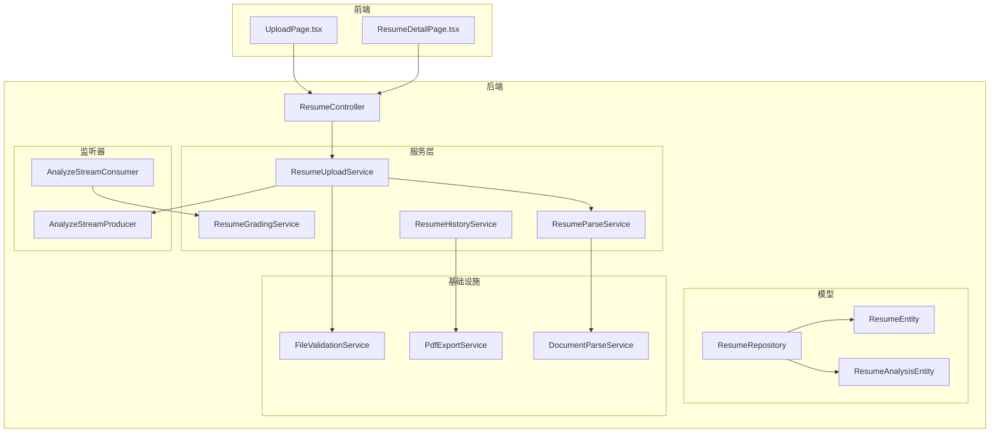
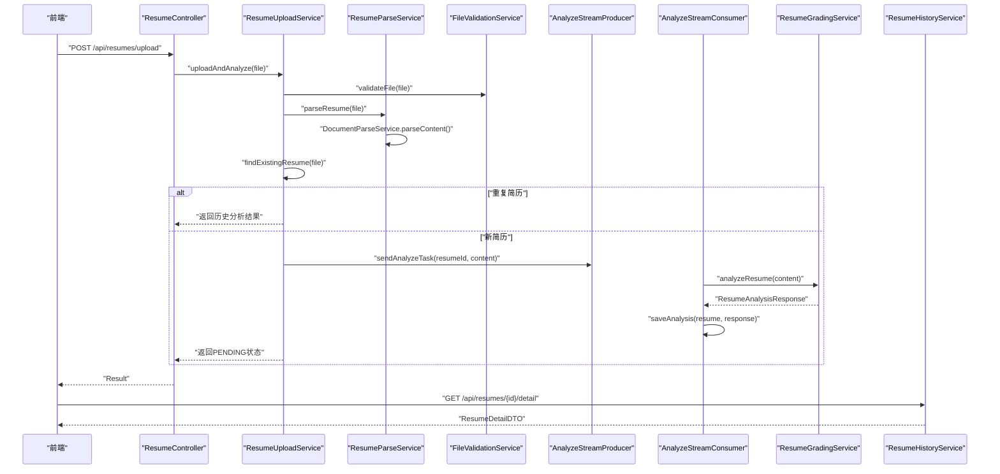
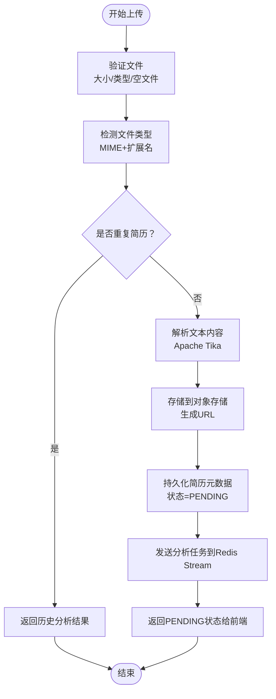
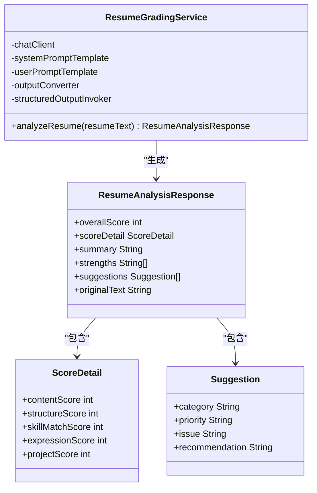
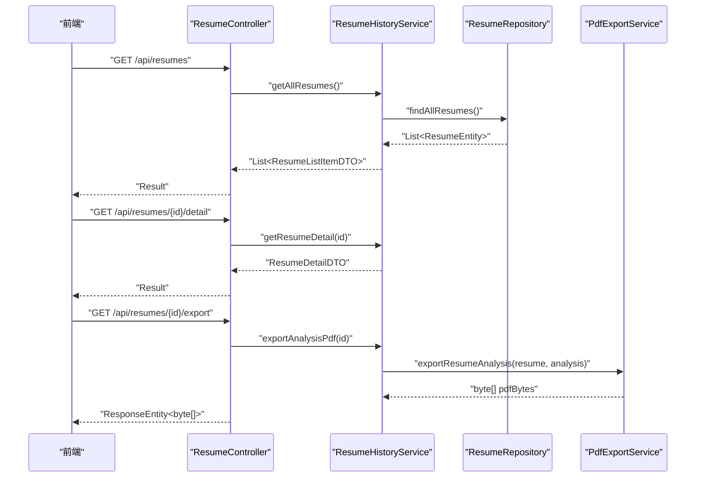
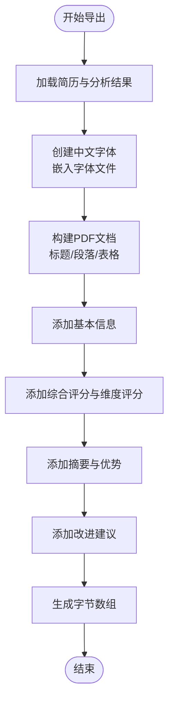
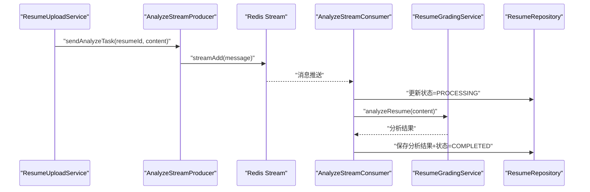
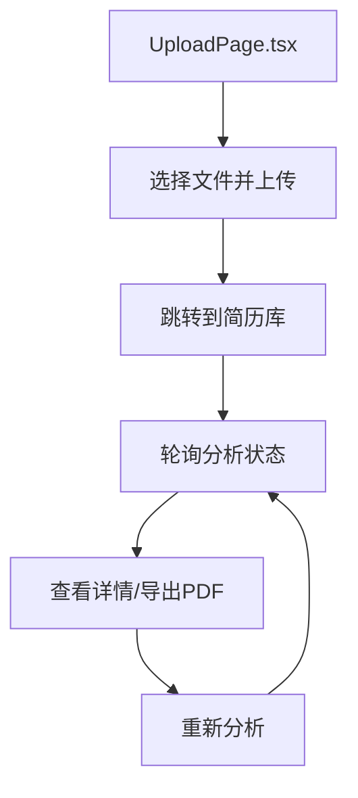
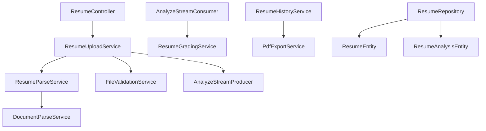

# 简历管理模块

<cite>
**本文档引用的文件**
- [ResumeController.java](file://app/src/main/java/interview/guide/modules/resume/ResumeController.java)
- [ResumeUploadService.java](file://app/src/main/java/interview/guide/modules/resume/service/ResumeUploadService.java)
- [ResumeParseService.java](file://app/src/main/java/interview/guide/modules/resume/service/ResumeParseService.java)
- [ResumeGradingService.java](file://app/src/main/java/interview/guide/modules/resume/service/ResumeGradingService.java)
- [ResumeHistoryService.java](file://app/src/main/java/interview/guide/modules/resume/service/ResumeHistoryService.java)
- [AnalyzeStreamConsumer.java](file://app/src/main/java/interview/guide/modules/resume/listener/AnalyzeStreamConsumer.java)
- [AnalyzeStreamProducer.java](file://app/src/main/java/interview/guide/modules/resume/listener/AnalyzeStreamProducer.java)
- [ResumeEntity.java](file://app/src/main/java/interview/guide/modules/resume/model/ResumeEntity.java)
- [ResumeAnalysisEntity.java](file://app/src/main/java/interview/guide/modules/resume/model/ResumeAnalysisEntity.java)
- [ResumeRepository.java](file://app/src/main/java/interview/guide/modules/resume/repository/ResumeRepository.java)
- [FileValidationService.java](file://app/src/main/java/interview/guide/infrastructure/file/FileValidationService.java)
- [DocumentParseService.java](file://app/src/main/java/interview/guide/infrastructure/file/DocumentParseService.java)
- [PdfExportService.java](file://app/src/main/java/interview/guide/infrastructure/export/PdfExportService.java)
- [UploadPage.tsx](file://frontend/src/pages/UploadPage.tsx)
- [ResumeDetailPage.tsx](file://frontend/src/pages/ResumeDetailPage.tsx)
</cite>

## 目录
1. [简介](#简介)
2. [项目结构](#项目结构)
3. [核心组件](#核心组件)
4. [架构概览](#架构概览)
5. [详细组件分析](#详细组件分析)
6. [依赖分析](#依赖分析)
7. [性能考虑](#性能考虑)
8. [故障排除指南](#故障排除指南)
9. [结论](#结论)
10. [附录](#附录)

## 简介
本文件全面阐述简历管理模块的功能设计与实现细节，涵盖简历上传处理流程、AI解析算法、技能识别系统、评分评估机制、历史记录管理、PDF导出功能、异步处理机制以及前端界面体验优化策略。该模块采用异步流水线架构，结合Redis Stream实现高并发的简历分析任务调度，并通过统一的PDF导出服务生成专业的分析报告。

## 项目结构
简历管理模块位于后端应用的模块化目录下，采用分层架构组织代码：
- 控制器层：负责HTTP接口暴露与参数校验
- 服务层：封装业务逻辑，协调各子服务
- 监听器层：基于Redis Stream的异步消费者/生产者
- 模型层：JPA实体与DTO映射
- 基础设施层：文件解析、存储、导出等通用能力

**图表来源**
- [ResumeController.java:1-132](file://app/src/main/java/interview/guide/modules/resume/ResumeController.java#L1-L132)
- [ResumeUploadService.java:1-201](file://app/src/main/java/interview/guide/modules/resume/service/ResumeUploadService.java#L1-L201)
- [ResumeParseService.java:1-66](file://app/src/main/java/interview/guide/modules/resume/service/ResumeParseService.java#L1-L66)
- [ResumeGradingService.java:1-177](file://app/src/main/java/interview/guide/modules/resume/service/ResumeGradingService.java#L1-L177)
- [ResumeHistoryService.java:1-184](file://app/src/main/java/interview/guide/modules/resume/service/ResumeHistoryService.java#L1-L184)
- [AnalyzeStreamConsumer.java:1-158](file://app/src/main/java/interview/guide/modules/resume/listener/AnalyzeStreamConsumer.java#L1-L158)
- [AnalyzeStreamProducer.java:1-82](file://app/src/main/java/interview/guide/modules/resume/listener/AnalyzeStreamProducer.java#L1-L82)
- [ResumeEntity.java:1-184](file://app/src/main/java/interview/guide/modules/resume/model/ResumeEntity.java#L1-L184)
- [ResumeAnalysisEntity.java:1-152](file://app/src/main/java/interview/guide/modules/resume/model/ResumeAnalysisEntity.java#L1-L152)
- [ResumeRepository.java:1-25](file://app/src/main/java/interview/guide/modules/resume/repository/ResumeRepository.java#L1-L25)
- [FileValidationService.java:1-129](file://app/src/main/java/interview/guide/infrastructure/file/FileValidationService.java#L1-L129)
- [DocumentParseService.java:1-164](file://app/src/main/java/interview/guide/infrastructure/file/DocumentParseService.java#L1-L164)
- [PdfExportService.java:1-314](file://app/src/main/java/interview/guide/infrastructure/export/PdfExportService.java#L1-L314)

**章节来源**
- [ResumeController.java:1-132](file://app/src/main/java/interview/guide/modules/resume/ResumeController.java#L1-L132)
- [ResumeUploadService.java:1-201](file://app/src/main/java/interview/guide/modules/resume/service/ResumeUploadService.java#L1-L201)

## 核心组件
- 简历控制器：提供上传、分析、导出、删除、重新分析等REST接口
- 上传服务：负责文件验证、内容解析、存储、去重、异步任务派发
- 解析服务：委托通用文档解析器提取文本内容
- 评分服务：基于提示词模板与结构化输出调用LLM进行评分与建议
- 历史服务：管理简历列表、详情、分析历史与PDF导出
- 流消费者/生产者：基于Redis Stream实现异步分析任务的可靠投递与重试
- 数据模型：简历实体与分析结果实体，支持评分维度与JSON字段存储
- 基础设施：文件验证、文档解析、PDF导出等通用能力

**章节来源**
- [ResumeController.java:34-118](file://app/src/main/java/interview/guide/modules/resume/ResumeController.java#L34-L118)
- [ResumeUploadService.java:47-110](file://app/src/main/java/interview/guide/modules/resume/service/ResumeUploadService.java#L47-L110)
- [ResumeGradingService.java:86-130](file://app/src/main/java/interview/guide/modules/resume/service/ResumeGradingService.java#L86-L130)
- [ResumeHistoryService.java:43-114](file://app/src/main/java/interview/guide/modules/resume/service/ResumeHistoryService.java#L43-L114)

## 架构概览
简历管理模块采用异步流水线架构，核心流程如下：
1. 前端上传简历文件
2. 后端进行文件验证与内容解析
3. 去重检查，若重复则返回历史分析结果
4. 上传至对象存储并持久化简历元数据
5. 将分析任务发送至Redis Stream
6. 异步消费者拉取任务，调用LLM进行评分与建议生成
7. 结果持久化并更新分析状态
8. 前端轮询状态或直接查看详情与导出PDF

**图表来源**
- [ResumeController.java:44-54](file://app/src/main/java/interview/guide/modules/resume/ResumeController.java#L44-L54)
- [ResumeUploadService.java:47-110](file://app/src/main/java/interview/guide/modules/resume/service/ResumeUploadService.java#L47-L110)
- [AnalyzeStreamProducer.java:36-38](file://app/src/main/java/interview/guide/modules/resume/listener/AnalyzeStreamProducer.java#L36-L38)
- [AnalyzeStreamConsumer.java:98-105](file://app/src/main/java/interview/guide/modules/resume/listener/AnalyzeStreamConsumer.java#L98-L105)
- [ResumeHistoryService.java:79-114](file://app/src/main/java/interview/guide/modules/resume/service/ResumeHistoryService.java#L79-L114)

## 详细组件分析

### 简历上传处理流程
- 文件验证：检查文件是否为空、大小限制、类型白名单
- 类型检测：基于MIME类型与扩展名进行双重校验
- 去重策略：基于文件内容哈希值（SHA-256）进行唯一性检查
- 内容解析：使用Apache Tika提取纯文本，清洗噪声字符
- 存储策略：上传至对象存储并生成访问URL
- 数据持久化：保存简历元数据，初始状态为PENDING
- 异步派发：向Redis Stream发送分析任务

**图表来源**
- [ResumeUploadService.java:47-110](file://app/src/main/java/interview/guide/modules/resume/service/ResumeUploadService.java#L47-L110)
- [FileValidationService.java:27-50](file://app/src/main/java/interview/guide/infrastructure/file/FileValidationService.java#L27-L50)
- [DocumentParseService.java:45-64](file://app/src/main/java/interview/guide/infrastructure/file/DocumentParseService.java#L45-L64)
- [AnalyzeStreamProducer.java:36-38](file://app/src/main/java/interview/guide/modules/resume/listener/AnalyzeStreamProducer.java#L36-L38)

**章节来源**
- [ResumeUploadService.java:47-110](file://app/src/main/java/interview/guide/modules/resume/service/ResumeUploadService.java#L47-L110)
- [FileValidationService.java:27-50](file://app/src/main/java/interview/guide/infrastructure/file/FileValidationService.java#L27-L50)
- [DocumentParseService.java:45-64](file://app/src/main/java/interview/guide/infrastructure/file/DocumentParseService.java#L45-L64)

### AI解析算法与评分机制
- 提示词模板：系统提示词与用户提示词分别加载，用户提示词注入简历文本
- 结构化输出：通过BeanOutputConverter约束LLM输出格式，确保字段完整性
- 评分维度：总分与五个维度评分（项目经验、技能匹配度、内容完整性、结构清晰度、表达专业性）
- 建议生成：按类别与优先级输出具体改进建议
- 错误处理：捕获AI调用异常并降级为错误响应

**图表来源**
- [ResumeGradingService.java:86-130](file://app/src/main/java/interview/guide/modules/resume/service/ResumeGradingService.java#L86-L130)
- [ResumeGradingService.java:135-156](file://app/src/main/java/interview/guide/modules/resume/service/ResumeGradingService.java#L135-L156)

**章节来源**
- [ResumeGradingService.java:86-130](file://app/src/main/java/interview/guide/modules/resume/service/ResumeGradingService.java#L86-L130)

### 技能识别系统实现
- 关键词匹配：由AI解析服务在简历文本中抽取技能关键词
- 语义分析：通过LLM对技能与岗位要求进行语义层面的匹配与评分
- 技能分类：基于预定义技能清单与领域知识库进行分类归档
- 输出结构：以结构化数据形式返回技能列表、匹配度与建议

说明：技能识别的具体实现细节在本模块中主要体现为AI解析服务对技能相关文本的抽取与评分，实际技能分类与匹配规则由上层知识库与技能清单支撑。

**章节来源**
- [ResumeGradingService.java:86-130](file://app/src/main/java/interview/guide/modules/resume/service/ResumeGradingService.java#L86-L130)

### 简历评分与评估机制
- 权重配置：总分为100分，五个维度按不同权重分配（项目经验20%、技能匹配度20%、内容完整性15%、结构清晰度15%、表达专业性10%）
- 评分算法：基于LLM对简历质量的综合评估，输出单项与总分
- 结果展示：前端以可视化方式呈现总分与各维度得分，支持颜色分级与趋势对比

**章节来源**
- [ResumeAnalysisEntity.java:24-32](file://app/src/main/java/interview/guide/modules/resume/model/ResumeAnalysisEntity.java#L24-L32)

### 简历历史记录管理
- 历史查询：提供简历列表与详情接口，支持分页与筛选
- 数据统计：统计最近分析分数、面试次数、访问次数等指标
- 批量操作：支持删除、重新分析、导出PDF等操作
- 历史详情：包含分析历史与面试历史的完整记录

**图表来源**
- [ResumeController.java:59-91](file://app/src/main/java/interview/guide/modules/resume/ResumeController.java#L59-L91)
- [ResumeHistoryService.java:43-114](file://app/src/main/java/interview/guide/modules/resume/service/ResumeHistoryService.java#L43-L114)
- [PdfExportService.java:85-165](file://app/src/main/java/interview/guide/infrastructure/export/PdfExportService.java#L85-L165)

**章节来源**
- [ResumeHistoryService.java:43-114](file://app/src/main/java/interview/guide/modules/resume/service/ResumeHistoryService.java#L43-L114)

### PDF导出功能
- 报告生成：根据简历分析结果生成结构化的PDF报告
- 格式定制：标题、段落、表格样式统一，支持中文字体嵌入
- 字体处理：内嵌中文字体文件，确保跨平台一致性；对异常字符进行清理
- 内容组织：基本信息、综合评分、维度评分、摘要、优势亮点、改进建议等模块化展示

**图表来源**
- [PdfExportService.java:85-165](file://app/src/main/java/interview/guide/infrastructure/export/PdfExportService.java#L85-L165)

**章节来源**
- [PdfExportService.java:85-165](file://app/src/main/java/interview/guide/infrastructure/export/PdfExportService.java#L85-L165)

### 异步处理机制（Redis Stream）
- 生产者：将简历ID与文本内容封装为消息，写入Redis Stream
- 消费者：从Stream消费消息，更新状态为PROCESSING，调用AI服务，保存结果并标记COMPLETED或FAILED
- 重试机制：支持消息重试入队，记录重试次数与错误信息
- 进度跟踪：通过分析状态字段与错误信息反馈给前端轮询

**图表来源**
- [AnalyzeStreamProducer.java:36-38](file://app/src/main/java/interview/guide/modules/resume/listener/AnalyzeStreamProducer.java#L36-L38)
- [AnalyzeStreamConsumer.java:98-105](file://app/src/main/java/interview/guide/modules/resume/listener/AnalyzeStreamConsumer.java#L98-L105)

**章节来源**
- [AnalyzeStreamProducer.java:36-38](file://app/src/main/java/interview/guide/modules/resume/listener/AnalyzeStreamProducer.java#L36-L38)
- [AnalyzeStreamConsumer.java:98-105](file://app/src/main/java/interview/guide/modules/resume/listener/AnalyzeStreamConsumer.java#L98-L105)

### 前端简历管理界面
- 上传页面：支持拖拽上传、格式提示、大小限制与错误提示
- 详情页面：双标签页（简历分析/面试记录）、轮询分析状态、一键导出PDF、重新分析、开始模拟面试
- 用户体验：动画过渡、状态指示、错误处理与加载骨架屏

**图表来源**
- [UploadPage.tsx:14-32](file://frontend/src/pages/UploadPage.tsx#L14-L32)
- [ResumeDetailPage.tsx:58-74](file://frontend/src/pages/ResumeDetailPage.tsx#L58-L74)

**章节来源**
- [UploadPage.tsx:14-32](file://frontend/src/pages/UploadPage.tsx#L14-L32)
- [ResumeDetailPage.tsx:58-74](file://frontend/src/pages/ResumeDetailPage.tsx#L58-L74)

## 依赖分析
- 组件耦合：控制器依赖服务层；服务层依赖基础设施与监听器；监听器依赖AI与存储；模型层通过JPA连接数据库
- 外部依赖：Redis Stream用于异步任务队列；Apache Tika用于文档解析；iText5用于PDF生成；Spring AI用于LLM调用
- 循环依赖：模块内部无循环依赖，职责边界清晰

**图表来源**
- [ResumeController.java:34-36](file://app/src/main/java/interview/guide/modules/resume/ResumeController.java#L34-L36)
- [ResumeUploadService.java:31-37](file://app/src/main/java/interview/guide/modules/resume/service/ResumeUploadService.java#L31-L37)
- [AnalyzeStreamConsumer.java:26-39](file://app/src/main/java/interview/guide/modules/resume/listener/AnalyzeStreamConsumer.java#L26-L39)

**章节来源**
- [ResumeController.java:34-36](file://app/src/main/java/interview/guide/modules/resume/ResumeController.java#L34-L36)
- [ResumeUploadService.java:31-37](file://app/src/main/java/interview/guide/modules/resume/service/ResumeUploadService.java#L31-L37)

## 性能考虑
- 异步化：通过Redis Stream解耦上传与分析，提升吞吐量与响应速度
- 缓存与去重：基于文件哈希的重复检测减少无效分析
- 文本解析优化：限制最大文本长度、禁用嵌入文档解析、PDF按坐标排序提升准确性
- 并发控制：控制器层设置全局与IP限流，防止滥用
- 前端轮询：合理设置轮询间隔，避免频繁请求

## 故障排除指南
- 文件解析失败：检查文件格式是否受支持、是否为扫描版PDF、网络存储访问权限
- AI分析失败：确认提示词模板加载成功、结构化输出格式正确、LLM服务可用
- PDF导出失败：检查字体文件是否存在、内存与磁盘空间、异常字符清理
- 重试入队失败：查看Redis连接状态与Stream配置，确保消息格式正确

**章节来源**
- [DocumentParseService.java:108-139](file://app/src/main/java/interview/guide/infrastructure/file/DocumentParseService.java#L108-L139)
- [PdfExportService.java:65-71](file://app/src/main/java/interview/guide/infrastructure/export/PdfExportService.java#L65-L71)
- [AnalyzeStreamConsumer.java:135-138](file://app/src/main/java/interview/guide/modules/resume/listener/AnalyzeStreamConsumer.java#L135-L138)

## 结论
简历管理模块通过标准化的上传流程、可靠的异步分析机制与专业的PDF导出能力，实现了从文件上传到结果呈现的全链路自动化。模块设计注重可扩展性与可维护性，为后续集成更复杂的技能识别与面试评估提供了坚实基础。

## 附录
- 接口规范与错误码：参见控制器层的返回结构与异常处理
- 配置项：Redis Stream键名、提示词路径、文件类型白名单、限流参数等
- 前端交互：轮询策略、导出按钮状态、错误提示文案