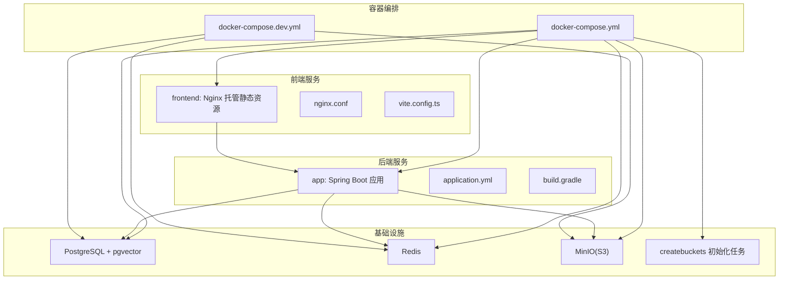
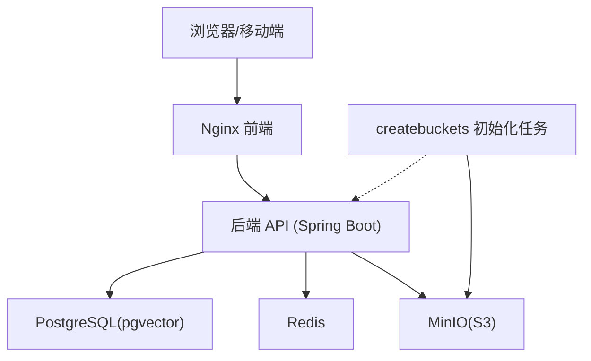
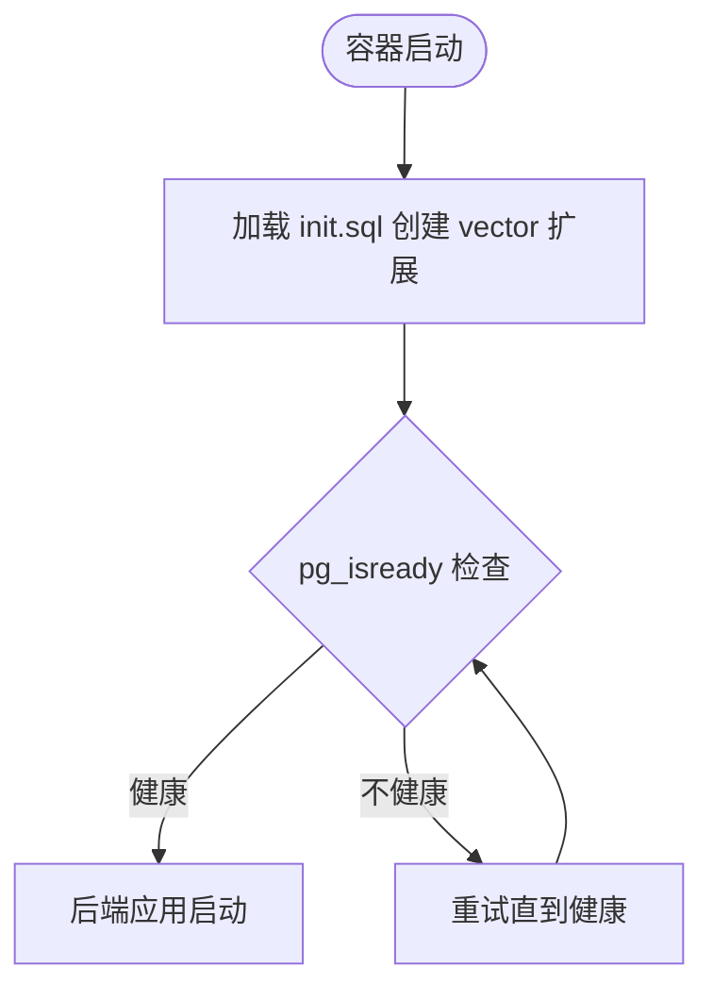
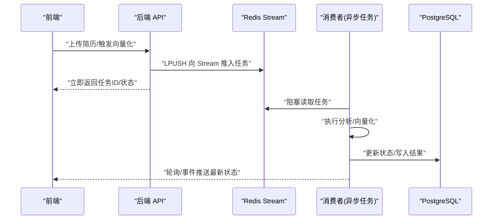
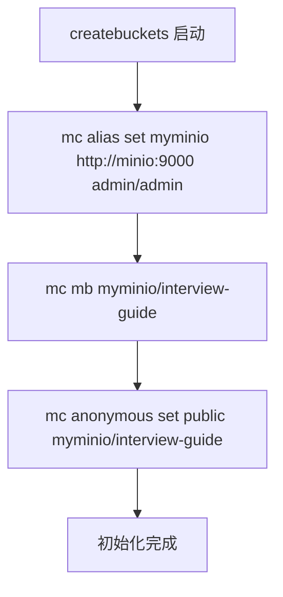
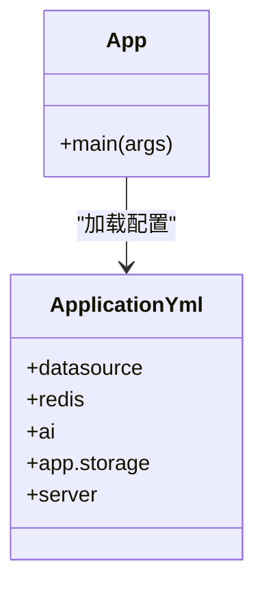
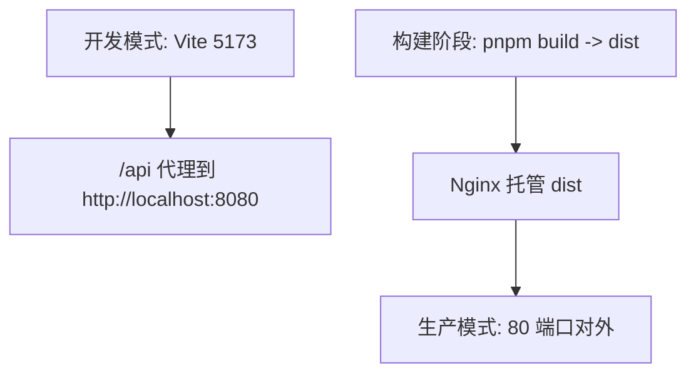
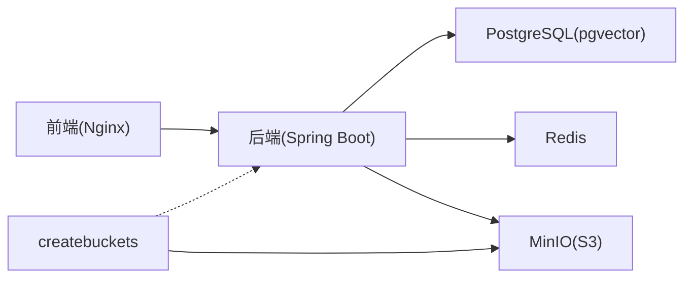

# 基础设施设计

<cite>
**本文引用的文件**
- [docker-compose.yml](file://docker-compose.yml)
- [docker-compose.dev.yml](file://docker-compose.dev.yml)
- [app/Dockerfile](file://app/Dockerfile)
- [frontend/Dockerfile](file://frontend/Dockerfile)
- [frontend/nginx.conf](file://frontend/nginx.conf)
- [app/build.gradle](file://app/build.gradle)
- [app/src/main/resources/application.yml](file://app/src/main/resources/application.yml)
- [app/src/test/resources/application-test.yml](file://app/src/test/resources/application-test.yml)
- [frontend/vite.config.ts](file://frontend/vite.config.ts)
- [frontend/package.json](file://frontend/package.json)
- [.env](file://.env)
- [docker/postgres/init.sql](file://docker/postgres/init.sql)
- [README.md](file://README.md)
- [SETUP_API_KEYS.md](file://SETUP_API_KEYS.md)
- [app/src/main/java/interview/guide/App.java](file://app/src/main/java/interview/guide/App.java)
</cite>

## 目录
1. [引言](#引言)
2. [项目结构](#项目结构)
3. [核心组件](#核心组件)
4. [架构总览](#架构总览)
5. [详细组件分析](#详细组件分析)
6. [依赖分析](#依赖分析)
7. [性能考量](#性能考量)
8. [故障排查指南](#故障排查指南)
9. [结论](#结论)
10. [附录](#附录)

## 引言
本文件面向面试指南平台的基础设施设计，聚焦容器化部署、服务编排、环境配置与运维实践。文档围绕 PostgreSQL（含向量扩展 pgvector）、Redis、MinIO（S3 兼容）对象存储、后端 Spring Boot 应用以及前端 Nginx 托管应用展开，系统阐述各组件职责、相互关系、数据流与控制流，并给出开发/测试/生产三类环境的部署配置与最佳实践，同时覆盖监控、日志、备份与扩展性、高可用性设计建议。

## 项目结构
项目采用多模块布局：后端 app、前端 frontend、Docker 编排与数据库初始化脚本位于根目录。Docker Compose 将数据库、缓存、对象存储、后端应用与前端 Nginx 串联为完整运行时。

图表来源
- [docker-compose.yml:1-197](file://docker-compose.yml#L1-L197)
- [docker-compose.dev.yml:1-64](file://docker-compose.dev.yml#L1-L64)
- [app/src/main/resources/application.yml:1-282](file://app/src/main/resources/application.yml#L1-L282)
- [frontend/nginx.conf:1-32](file://frontend/nginx.conf#L1-L32)

章节来源
- [docker-compose.yml:1-197](file://docker-compose.yml#L1-L197)
- [docker-compose.dev.yml:1-64](file://docker-compose.dev.yml#L1-L64)
- [README.md:338-414](file://README.md#L338-L414)

## 核心组件
- PostgreSQL（pgvector）：关系型数据与向量数据存储，支撑简历、会话、知识库向量检索。
- Redis：缓存与基于 Stream 的异步任务队列，承载简历分析、知识库向量化等后台任务。
- MinIO：S3 兼容对象存储，存放简历、头像、知识库文档等非结构化数据。
- 后端应用（Spring Boot）：提供 REST API、WebSocket、异步消费、RAG、语音面试等能力。
- 前端应用（Nginx 托管）：React/Vite 构建产物，通过 Nginx 提供静态资源与 API 反向代理。
- 初始化任务（MinIO mc）：自动创建 Bucket 并设置匿名读权限，实现基础设施即代码。

章节来源
- [docker-compose.yml:13-197](file://docker-compose.yml#L13-L197)
- [docker/postgres/init.sql:1-2](file://docker/postgres/init.sql#L1-L2)
- [app/src/main/resources/application.yml:182-189](file://app/src/main/resources/application.yml#L182-L189)
- [frontend/nginx.conf:1-32](file://frontend/nginx.conf#L1-L32)

## 架构总览
系统采用“容器化 + 服务编排”的一体化部署方案。后端应用通过环境变量与配置文件对接数据库、缓存与对象存储；前端通过 Nginx 反向代理访问后端 API；MinIO 初始化任务在首次启动时自动完成 Bucket 创建与权限设置。

图表来源
- [docker-compose.yml:102-116](file://docker-compose.yml#L102-L116)
- [app/src/main/resources/application.yml:48-98](file://app/src/main/resources/application.yml#L48-L98)
- [frontend/nginx.conf:19-30](file://frontend/nginx.conf#L19-L30)

## 详细组件分析

### 数据库服务（PostgreSQL + pgvector）
- 作用：持久化业务数据与向量数据，支持 RAG 检索增强。
- 配置要点：
  - 使用 pgvector/pgvector:pg16 镜像启用向量扩展。
  - 通过 init.sql 创建 vector 扩展。
  - 健康检查使用 pg_isready，确保后端应用启动前数据库可用。
- 连接与驱动：JDBC URL、用户名、密码通过环境变量注入；HikariCP 连接池针对虚拟线程优化。
- JPA/Hibernate：DDL 策略为 update，避免生产环境误删数据；批量插入/更新顺序优化。

图表来源
- [docker/postgres/init.sql:1-2](file://docker/postgres/init.sql#L1-L2)
- [docker-compose.yml:31-35](file://docker-compose.yml#L31-L35)

章节来源
- [docker-compose.yml:13-36](file://docker-compose.yml#L13-L36)
- [docker/postgres/init.sql:1-2](file://docker/postgres/init.sql#L1-L2)
- [app/src/main/resources/application.yml:48-78](file://app/src/main/resources/application.yml#L48-L78)

### 缓存与消息队列（Redis）
- 作用：会话缓存、限流、基于 Redis Stream 的异步任务队列（简历分析、知识库向量化）。
- 配置要点：
  - Redisson 客户端通过 application.yml 的 redisson 配置连接。
  - 健康检查使用 redis-cli ping。
  - Stream 作为轻量消息队列，替代 Kafka/RabbitMQ，降低运维复杂度。

图表来源
- [docker-compose.yml:47-58](file://docker-compose.yml#L47-L58)
- [app/src/main/resources/application.yml:86-98](file://app/src/main/resources/application.yml#L86-L98)

章节来源
- [docker-compose.yml:47-58](file://docker-compose.yml#L47-L58)
- [app/src/main/resources/application.yml:86-98](file://app/src/main/resources/application.yml#L86-L98)

### 对象存储（MinIO，S3 兼容）
- 作用：存储非结构化数据（简历、头像、知识库文档）。
- 配置要点：
  - MinIO 服务暴露 9000（API）与 9001（控制台）端口。
  - 初始化任务使用 mc 客户端创建 Bucket 并设置匿名读权限。
  - 后端通过 S3 SDK 连接，endpoint、accessKey、secretKey、bucket、region 通过环境变量注入。

图表来源
- [docker-compose.yml:102-116](file://docker-compose.yml#L102-L116)

章节来源
- [docker-compose.yml:72-89](file://docker-compose.yml#L72-L89)
- [docker-compose.yml:102-116](file://docker-compose.yml#L102-L116)
- [app/src/main/resources/application.yml:182-189](file://app/src/main/resources/application.yml#L182-L189)

### 后端应用（Spring Boot）
- 作用：提供 REST API、WebSocket、RAG、语音面试、异步任务调度等。
- 部署方式：
  - Dockerfile 基于 Gradle 构建，使用 Java 21。
  - 通过 docker-compose.yml 的 build 指定 Dockerfile 路径。
- 配置体系：
  - application.yml：数据库、缓存、AI Provider（DashScope）、RAG、语音面试、CORS、S3 存储等。
  - application-test.yml：测试环境使用内存数据库与本地 Redis。
  - .env：提供 AI API Key、模型选择等环境变量。
- 启动入口：App.java 为主启动类，启用调度。

图表来源
- [app/src/main/java/interview/guide/App.java:1-19](file://app/src/main/java/interview/guide/App.java#L1-L19)
- [app/src/main/resources/application.yml:1-282](file://app/src/main/resources/application.yml#L1-L282)

章节来源
- [app/Dockerfile](file://app/Dockerfile)
- [app/build.gradle:1-136](file://app/build.gradle#L1-L136)
- [app/src/main/resources/application.yml:1-282](file://app/src/main/resources/application.yml#L1-L282)
- [app/src/test/resources/application-test.yml:1-165](file://app/src/test/resources/application-test.yml#L1-L165)
- [.env:1-12](file://.env#L1-L12)
- [docker-compose.yml:125-171](file://docker-compose.yml#L125-L171)

### 前端应用（Nginx 托管）
- 作用：提供用户界面与 API 反向代理。
- 构建流程：
  - 多阶段 Dockerfile：第一阶段使用 Node.js 构建，第二阶段使用 Nginx 托管静态资源。
  - Nginx 配置启用 gzip、单页应用路由回退至 index.html、API 代理到后端。
- 本地开发：Vite 开发服务器，代理 /api 到后端 8080。

图表来源
- [frontend/vite.config.ts:24-37](file://frontend/vite.config.ts#L24-L37)
- [frontend/nginx.conf:1-32](file://frontend/nginx.conf#L1-L32)
- [frontend/Dockerfile:1-44](file://frontend/Dockerfile#L1-L44)

章节来源
- [frontend/Dockerfile:1-44](file://frontend/Dockerfile#L1-L44)
- [frontend/nginx.conf:1-32](file://frontend/nginx.conf#L1-L32)
- [frontend/vite.config.ts:1-42](file://frontend/vite.config.ts#L1-L42)
- [frontend/package.json:1-47](file://frontend/package.json#L1-L47)

## 依赖分析
- 组件耦合：
  - 后端对数据库、缓存、对象存储存在强依赖，docker-compose 使用 depends_on 与健康检查保证启动顺序。
  - 前端对后端 API 的依赖通过 Nginx 反向代理解耦。
- 外部依赖：
  - Spring AI 与 DashScope SDK 用于 LLM、ASR、TTS。
  - AWS S3 SDK 适配 MinIO。
  - Redisson 用于 Redis 客户端与 Stream。
- 循环依赖：无明显循环，服务间通过配置与环境变量解耦。

图表来源
- [docker-compose.yml:125-185](file://docker-compose.yml#L125-L185)
- [app/src/main/resources/application.yml:48-189](file://app/src/main/resources/application.yml#L48-L189)

章节来源
- [docker-compose.yml:125-185](file://docker-compose.yml#L125-L185)
- [app/src/main/resources/application.yml:48-189](file://app/src/main/resources/application.yml#L48-L189)

## 性能考量
- 数据库性能：
  - HikariCP 连接池参数针对虚拟线程场景优化，最大池大小与空闲连接数合理配置。
  - Hibernate 批量插入/更新顺序优化，减少事务开销。
- 缓存与队列：
  - Redis Stream 作为轻量消息队列，避免引入 Kafka/RabbitMQ，降低运维成本。
  - 会话缓存与限流结合，提升并发处理能力。
- 前端性能：
  - Vite 分包策略与 Nginx gzip 压缩，缩短首屏加载时间。
- I/O 密集优化：
  - 启用虚拟线程与 SSE 长连接，提升并发与实时性。

章节来源
- [app/src/main/resources/application.yml:42-78](file://app/src/main/resources/application.yml#L42-L78)
- [docker-compose.yml:47-58](file://docker-compose.yml#L47-L58)
- [frontend/nginx.conf:8-10](file://frontend/nginx.conf#L8-L10)
- [frontend/vite.config.ts:13-23](file://frontend/vite.config.ts#L13-L23)

## 故障排查指南
- 数据库表创建失败/数据丢失：
  - 检查 JPA 的 ddl-auto 配置，开发环境使用 update，生产环境使用 validate 或 none。
- 知识库向量化失败：
  - 确认 initialize-schema 设置为 true（开发）或手动创建向量表（生产）。
- 简历分析失败：
  - 核对 AI API Key 配置与 DashScope 服务状态。
- 简历分析长时间“分析中”：
  - 检查 Redis 连接、Stream 消费者是否正常运行，查看后端日志。
- PDF 导出中文乱码/字体缺失：
  - 确认内置中文字体存在与 iText 依赖正确。
- MinIO 初始化失败：
  - 确认 createbuckets 依赖 minio 健康，且 mc 命令执行成功。

章节来源
- [README.md:424-494](file://README.md#L424-L494)
- [app/src/main/resources/application.yml:116-124](file://app/src/main/resources/application.yml#L116-L124)

## 结论
本基础设施以 Docker 为核心，结合 Docker Compose 实现数据库、缓存、对象存储与应用的一键编排，配合 Nginx 前端托管与初始化任务，形成可复用、可扩展、可维护的部署方案。通过合理的配置与环境隔离，满足开发、测试与生产的差异化需求；借助 Redis Stream 与虚拟线程等技术手段，兼顾性能与可运维性。

## 附录

### 环境配置与最佳实践
- 开发环境（本地/CI）：
  - 使用 docker-compose.dev.yml 启动 PostgreSQL、Redis、RustFS（S3 兼容）。
  - 前端通过 Vite 代理到后端 8080，便于联调。
  - 后端使用 application-test.yml 的内存数据库与本地 Redis。
- 测试环境：
  - 与生产相似的依赖服务，但数据卷与端口可独立隔离。
- 生产环境：
  - 使用 docker-compose.yml 编排，MinIO 与数据库使用持久卷。
  - 通过环境变量注入敏感配置，避免硬编码。
  - 建议启用日志聚合与监控告警，定期备份数据库与对象存储。

章节来源
- [docker-compose.dev.yml:1-64](file://docker-compose.dev.yml#L1-L64)
- [frontend/vite.config.ts:24-37](file://frontend/vite.config.ts#L24-L37)
- [app/src/test/resources/application-test.yml:1-165](file://app/src/test/resources/application-test.yml#L1-L165)
- [docker-compose.yml:1-197](file://docker-compose.yml#L1-L197)

### 监控、日志与备份
- 日志：
  - 后端日志编码统一为 UTF-8，建议集中收集（如 ELK/Fluentd）并按服务拆分。
- 监控：
  - 指标埋点：Micrometer（语音面试模块已标注）。
  - 健康检查：数据库、缓存、对象存储均配置健康探针。
- 备份：
  - PostgreSQL：使用 pg_dump 定期导出；结合 Docker 卷快照。
  - MinIO：定期导出 Bucket 数据，或使用对象存储自带备份策略。

章节来源
- [app/src/main/resources/application.yml:4-7](file://app/src/main/resources/application.yml#L4-L7)
- [docker-compose.yml:31-35](file://docker-compose.yml#L31-L35)
- [docker-compose.yml:54-58](file://docker-compose.yml#L54-L58)
- [docker-compose.yml:85-89](file://docker-compose.yml#L85-L89)

### 扩展性与高可用设计
- 水平扩展：
  - 后端应用可多实例部署，共享数据库与缓存；对象存储使用 S3 兼容接口，便于迁移云厂商。
- 高可用：
  - 数据库与对象存储建议使用集群/副本；缓存可考虑 Redis Sentinel/Cluster。
- 网络与安全：
  - 前端与后端之间通过反向代理与 CORS 白名单控制；对象存储匿名读权限应谨慎使用，建议在生产环境限制来源或使用签名 URL。

章节来源
- [frontend/nginx.conf:19-30](file://frontend/nginx.conf#L19-L30)
- [app/src/main/resources/application.yml:190-193](file://app/src/main/resources/application.yml#L190-L193)
- [docker-compose.yml:72-89](file://docker-compose.yml#L72-L89)