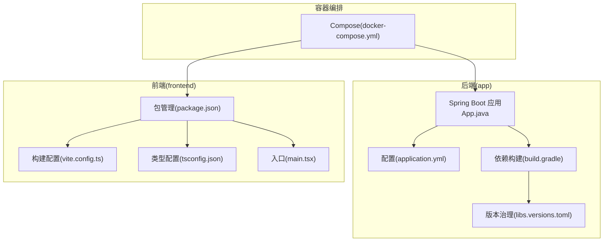
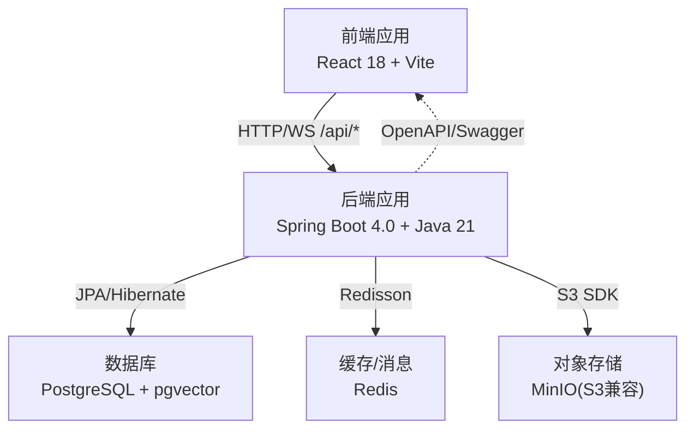
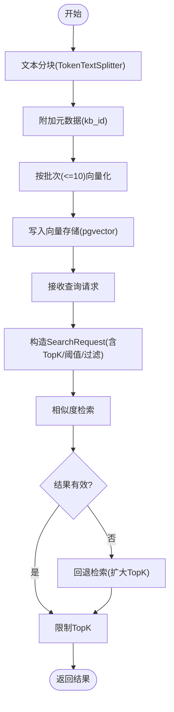
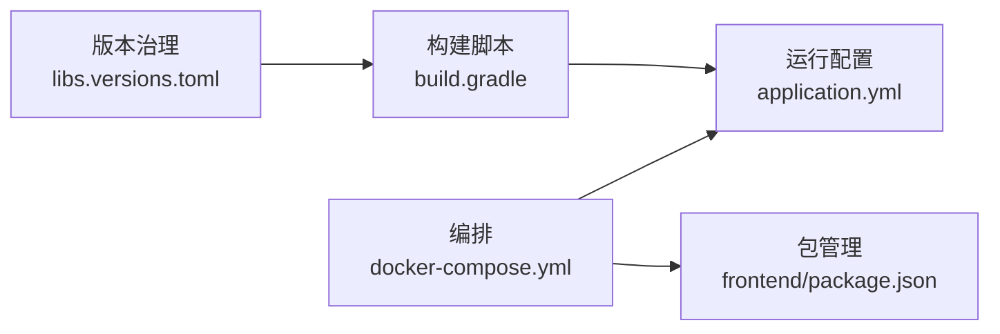

# 技术栈选型

<cite>
**本文引用的文件**
- [gradle/libs.versions.toml](file://gradle/libs.versions.toml)
- [app/build.gradle](file://app/build.gradle)
- [app/src/main/resources/application.yml](file://app/src/main/resources/application.yml)
- [app/src/main/java/interview/guide/App.java](file://app/src/main/java/interview/guide/App.java)
- [app/src/main/java/interview/guide/common/ai/AgentUtilsConfiguration.java](file://app/src/main/java/interview/guide/common/ai/AgentUtilsConfiguration.java)
- [app/src/main/java/interview/guide/common/config/LlmProviderProperties.java](file://app/src/main/java/interview/guide/common/config/LlmProviderProperties.java)
- [app/src/main/java/interview/guide/modules/knowledgebase/service/KnowledgeBaseVectorService.java](file://app/src/main/java/interview/guide/modules/knowledgebase/service/KnowledgeBaseVectorService.java)
- [app/src/main/java/interview/guide/common/config/CorsConfig.java](file://app/src/main/java/interview/guide/common/config/CorsConfig.java)
- [docker-compose.yml](file://docker-compose.yml)
- [frontend/package.json](file://frontend/package.json)
- [frontend/vite.config.ts](file://frontend/vite.config.ts)
- [frontend/tsconfig.json](file://frontend/tsconfig.json)
- [frontend/src/main.tsx](file://frontend/src/main.tsx)
</cite>

## 目录
1. [引言](#引言)
2. [项目结构](#项目结构)
3. [核心组件](#核心组件)
4. [架构总览](#架构总览)
5. [详细组件分析](#详细组件分析)
6. [依赖关系分析](#依赖关系分析)
7. [性能考量](#性能考量)
8. [故障排查指南](#故障排查指南)
9. [结论](#结论)
10. [附录](#附录)

## 引言
本技术栈选型文档面向面试指南平台，系统阐述后端与前端的技术选型、架构设计、关键实现与演进趋势，并提供学习路径与前置知识要求。平台采用 Spring Boot 4.0 + Java 21 + Spring AI 2.0 + PostgreSQL + pgvector + Redis 的后端技术栈，以及 React 18 + TypeScript + Vite + Tailwind CSS 的前端技术栈。选型兼顾现代化语言特性、AI原生能力、可扩展性与工程化效率。

## 项目结构
项目采用多模块布局：后端位于 app/，前端位于 frontend/，容器编排使用 docker-compose.yml，统一通过 Gradle 版本治理与依赖管理。

图示来源
- [app/src/main/java/interview/guide/App.java:1-19](file://app/src/main/java/interview/guide/App.java#L1-L19)
- [app/src/main/resources/application.yml:1-282](file://app/src/main/resources/application.yml#L1-L282)
- [app/build.gradle:1-136](file://app/build.gradle#L1-L136)
- [gradle/libs.versions.toml:1-30](file://gradle/libs.versions.toml#L1-L30)
- [frontend/package.json:1-47](file://frontend/package.json#L1-L47)
- [frontend/vite.config.ts:1-42](file://frontend/vite.config.ts#L1-L42)
- [frontend/tsconfig.json:1-22](file://frontend/tsconfig.json#L1-L22)
- [frontend/src/main.tsx:1-21](file://frontend/src/main.tsx#L1-L21)
- [docker-compose.yml:1-197](file://docker-compose.yml#L1-L197)

章节来源
- [app/src/main/java/interview/guide/App.java:1-19](file://app/src/main/java/interview/guide/App.java#L1-L19)
- [app/src/main/resources/application.yml:1-282](file://app/src/main/resources/application.yml#L1-L282)
- [app/build.gradle:1-136](file://app/build.gradle#L1-L136)
- [gradle/libs.versions.toml:1-30](file://gradle/libs.versions.toml#L1-L30)
- [frontend/package.json:1-47](file://frontend/package.json#L1-L47)
- [frontend/vite.config.ts:1-42](file://frontend/vite.config.ts#L1-L42)
- [frontend/tsconfig.json:1-22](file://frontend/tsconfig.json#L1-L22)
- [frontend/src/main.tsx:1-21](file://frontend/src/main.tsx#L1-L21)
- [docker-compose.yml:1-197](file://docker-compose.yml#L1-L197)

## 核心组件
- 后端核心
  - Spring Boot 4.0：模块化启动器、自动配置、虚拟线程支持、WebMVC/WebSocket/JPA/Validation 等起步依赖。
  - Java 21：工具链语言级别、虚拟线程、UTF-8 编码统一、Jakarta 注解迁移。
  - Spring AI 2.0：OpenAI 兼容模式对接 DashScope，向量存储集成 pgvector，Agent 工具体系。
  - 数据库与向量：PostgreSQL + pgvector，支持 HNSW 索引与余弦距离，适配文本嵌入维度。
  - 缓存与流处理：Redisson + Redis Stream，支撑会话缓存与异步任务。
  - 存储：AWS S3 兼容对象存储（MinIO），S3 SDK 集成。
  - 文档解析：Apache Tika，支持 PDF/DOCX/TXT。
  - 接口文档：SpringDoc OpenAPI。
  - 评测与导出：iText 8 PDF 导出。
- 前端核心
  - React 18 + TypeScript：严格类型、并发渲染、Hooks 生态。
  - Vite：快速冷启、按需优化、插件生态（WASM、Top-Level Await）。
  - UI 与交互：Tailwind CSS、Framer Motion、Lucide React、Recharts、React Markdown。
  - 路由与网络：React Router、Axios。
  - 构建与分包：Rollup manualChunks 拆分 vendor 包，提升缓存命中。

章节来源
- [app/build.gradle:23-87](file://app/build.gradle#L23-L87)
- [app/src/main/resources/application.yml:42-124](file://app/src/main/resources/application.yml#L42-L124)
- [gradle/libs.versions.toml:3-15](file://gradle/libs.versions.toml#L3-L15)
- [frontend/package.json:11-28](file://frontend/package.json#L11-L28)
- [frontend/vite.config.ts:13-23](file://frontend/vite.config.ts#L13-L23)

## 架构总览
平台采用前后端分离与容器化部署，后端提供 REST/WS 接口，前端通过反向代理访问后端 API。数据库、缓存与对象存储通过 Compose 统一编排。

图示来源
- [docker-compose.yml:13-171](file://docker-compose.yml#L13-L171)
- [app/src/main/resources/application.yml:48-189](file://app/src/main/resources/application.yml#L48-L189)
- [frontend/vite.config.ts:27-32](file://frontend/vite.config.ts#L27-L32)

章节来源
- [docker-compose.yml:1-197](file://docker-compose.yml#L1-L197)
- [app/src/main/resources/application.yml:1-282](file://app/src/main/resources/application.yml#L1-L282)
- [frontend/vite.config.ts:1-42](file://frontend/vite.config.ts#L1-L42)

## 详细组件分析

### 后端技术栈与选型理由
- Spring Boot 4.0
  - 优势：模块化起步依赖、更清晰的依赖边界；与 Java 21 虚拟线程深度契合，I/O 密集场景并发能力显著提升；WebSocket/JPA/Validation 等起步依赖覆盖面试平台核心能力。
  - 版本与兼容：起步依赖版本在 Gradle 插件中统一管理，配合依赖管理插件实现版本对齐。
- Java 21
  - 优势：虚拟线程、UTF-8 编码默认、Jakarta 注解替代 javax 注解，降低迁移成本。
  - 配置：工具链语言级别 21，全局 UTF-8 编码，避免控制台与日志乱码。
- Spring AI 2.0
  - 优势：OpenAI 兼容模式对接 DashScope，统一提示词与结构化输出；pgvector 向量存储开箱即用；Agent 工具体系复用技能资源。
  - 配置：AI 基础配置、向量存储索引类型/距离/维度、RAG 重写与检索策略、结构化输出重试策略等。
- PostgreSQL + pgvector
  - 优势：向量检索原生支持，HNSW + 余弦距离，适配文本嵌入维度；Schema 初始化策略可按环境切换。
  - 配置：索引类型、距离类型、维度、初始化开关、删除策略等。
- Redisson + Redis
  - 优势：Redis Stream 作为轻量消息队列与缓存，替代 Kafka/RabbitMQ 的运维成本；连接池与订阅池参数可调优。
  - 配置：单节点地址、密码、数据库、连接池大小等。
- 对象存储与文档解析
  - 优势：S3 SDK 兼容 MinIO，统一对象存储抽象；Tika 支持多格式文档解析。
  - 配置：Endpoint、AccessKey、SecretKey、Bucket、Region。
- 接口文档与跨域
  - 优势：SpringDoc OpenAPI 自动生成接口文档；CORS 过滤器按路径精确配置。
  - 配置：Swagger 路径、包扫描、CORS 允许源与方法。

章节来源
- [app/build.gradle:23-87](file://app/build.gradle#L23-L87)
- [gradle/libs.versions.toml:3-15](file://gradle/libs.versions.toml#L3-L15)
- [app/src/main/resources/application.yml:42-189](file://app/src/main/resources/application.yml#L42-L189)
- [app/src/main/java/interview/guide/common/ai/AgentUtilsConfiguration.java:1-70](file://app/src/main/java/interview/guide/common/ai/AgentUtilsConfiguration.java#L1-L70)
- [app/src/main/java/interview/guide/common/config/LlmProviderProperties.java:1-40](file://app/src/main/java/interview/guide/common/config/LlmProviderProperties.java#L1-L40)
- [app/src/main/java/interview/guide/common/config/CorsConfig.java:1-44](file://app/src/main/java/interview/guide/common/config/CorsConfig.java#L1-L44)

### 向量检索与 RAG 实现要点
- 文档分块与向量化
  - 使用 TokenTextSplitter 进行分块，结合知识库 ID 元数据，批量调用向量存储接口，受 API 批量上限约束。
- 相似度检索与过滤
  - 支持按知识库 ID 过滤、相似度阈值与 TopK 限制；失败时回退至本地过滤，保证稳定性。
- 删除与维护
  - 提供按知识库 ID 删除向量数据的能力，避免陈旧数据影响检索质量。

图示来源
- [app/src/main/java/interview/guide/modules/knowledgebase/service/KnowledgeBaseVectorService.java:45-125](file://app/src/main/java/interview/guide/modules/knowledgebase/service/KnowledgeBaseVectorService.java#L45-L125)

章节来源
- [app/src/main/java/interview/guide/modules/knowledgebase/service/KnowledgeBaseVectorService.java:1-203](file://app/src/main/java/interview/guide/modules/knowledgebase/service/KnowledgeBaseVectorService.java#L1-L203)

### 前端技术栈与选型理由
- React 18 + TypeScript
  - 优势：类型安全、并发渲染、生态成熟；与 Vite 高效开发体验。
- Vite
  - 优势：快速冷启动、按需优化、插件生态；配置分包拆分 vendor，提升缓存命中率。
- UI 与交互
  - Tailwind CSS：原子化样式、暗色主题；Framer Motion、Lucide React、Recharts 提升交互与可视化。
- 路由与网络
  - React Router 管理页面路由；Axios 发起 HTTP 请求；Markdown 渲染与语法高亮。
- 构建与运行
  - TS 配置严格模式、bundler 解析；Vite dev 代理后端 8080 端口；生产构建产物静态化。

章节来源
- [frontend/package.json:11-28](file://frontend/package.json#L11-L28)
- [frontend/vite.config.ts:1-42](file://frontend/vite.config.ts#L1-L42)
- [frontend/tsconfig.json:1-22](file://frontend/tsconfig.json#L1-L22)
- [frontend/src/main.tsx:1-21](file://frontend/src/main.tsx#L1-L21)

### 与替代方案的权衡
- 后端
  - Spring Boot 3.x vs 4.0：4.0 更强的模块化与虚拟线程支持，升级需关注起步依赖与第三方库兼容性。
  - JPA/Hibernate vs MyBatis：本项目以 JPA 为主，简化 ORM 映射；复杂 SQL 场景可混合使用。
  - PostgreSQL vs MySQL：pgvector 原生支持与 HNSW/余弦距离更适合向量检索。
  - Redis vs RabbitMQ/Kafka：Redis Stream 成本低、易运维，适合中小规模异步任务；高吞吐场景可评估 Kafka。
- 前端
  - Vue vs React：React 生态更丰富，Hooks 与并发渲染契合面试平台交互需求。
  - Webpack vs Vite：Vite 冷启更快、开发体验更好；本项目已采用。
  - Tailwind CSS vs Ant Design：Tailwind 原子化样式更灵活，Ant Design 组件更全但体积较大。

章节来源
- [app/build.gradle:23-87](file://app/build.gradle#L23-L87)
- [app/src/main/resources/application.yml:48-124](file://app/src/main/resources/application.yml#L48-L124)
- [frontend/package.json:11-28](file://frontend/package.json#L11-L28)
- [frontend/vite.config.ts:1-42](file://frontend/vite.config.ts#L1-L42)

### 版本兼容性与演进趋势
- Spring Boot 4.0 + Java 21：虚拟线程与 UTF-8 编码默认，建议保持 JDK 21+。
- Spring AI 2.0：OpenAI 兼容模式对接 DashScope，向量存储 pgvector 版本与嵌入维度需匹配。
- 前端：React 18 + TypeScript ~5.6，Vite ~5.4，Tailwind CSS ~4.1；保持依赖同步更新。
- 容器与编排：Compose 中 PostgreSQL 使用 pgvector 镜像，Redis 7，MinIO 兼容 S3。

章节来源
- [gradle/libs.versions.toml:3-15](file://gradle/libs.versions.toml#L3-L15)
- [app/build.gradle:89-93](file://app/build.gradle#L89-L93)
- [docker-compose.yml:13-171](file://docker-compose.yml#L13-L171)
- [frontend/package.json:40-41](file://frontend/package.json#L40-L41)

### 学习路径与前置知识
- 后端
  - Java 21 语言特性与虚拟线程、Spring Boot 4.0 模块化、Spring AI 2.0 与向量存储、pgvector、Redisson、S3 SDK、Apache Tika。
  - 建议路径：Java 并发 → Spring 生态 → AI 集成 → 向量检索 → 缓存与消息 → 对象存储 → 接口文档。
- 前端
  - React 18 + TypeScript、Vite、Tailwind CSS、UI 组件库、路由与网络、构建优化。
  - 建议路径：TypeScript 基础 → React Hooks → Vite 与插件 → UI 原子化样式 → 构建与性能优化。

章节来源
- [app/build.gradle:89-93](file://app/build.gradle#L89-L93)
- [app/src/main/resources/application.yml:42-124](file://app/src/main/resources/application.yml#L42-L124)
- [frontend/package.json:11-28](file://frontend/package.json#L11-L28)
- [frontend/vite.config.ts:1-42](file://frontend/vite.config.ts#L1-L42)
- [frontend/tsconfig.json:1-22](file://frontend/tsconfig.json#L1-L22)

## 依赖关系分析
后端依赖通过 Gradle 版本治理与 Spring Boot 插件统一管理；前端依赖通过 package.json 管理；容器编排统一暴露服务端口并挂载持久化卷。

图示来源
- [gradle/libs.versions.toml:1-30](file://gradle/libs.versions.toml#L1-L30)
- [app/build.gradle:1-136](file://app/build.gradle#L1-L136)
- [app/src/main/resources/application.yml:1-282](file://app/src/main/resources/application.yml#L1-L282)
- [docker-compose.yml:1-197](file://docker-compose.yml#L1-L197)
- [frontend/package.json:1-47](file://frontend/package.json#L1-L47)

章节来源
- [gradle/libs.versions.toml:1-30](file://gradle/libs.versions.toml#L1-L30)
- [app/build.gradle:1-136](file://app/build.gradle#L1-L136)
- [app/src/main/resources/application.yml:1-282](file://app/src/main/resources/application.yml#L1-L282)
- [docker-compose.yml:1-197](file://docker-compose.yml#L1-L197)
- [frontend/package.json:1-47](file://frontend/package.json#L1-L47)

## 性能考量
- 后端
  - 虚拟线程：启用虚拟线程，Tomcat 线程池与 HikariCP 连接池参数需与 I/O 密集场景匹配。
  - 向量检索：HNSW + 余弦距离，合理设置 TopK 与相似度阈值，避免过度召回。
  - 批量处理：向量化分批（≤10），减少单次调用失败影响。
- 前端
  - Vite 分包策略：将 React 生态与 UI 组件库拆分为独立 chunk，提升缓存命中。
  - 代理与预览：开发时代理后端，避免跨域与热更新问题。

章节来源
- [app/src/main/resources/application.yml:42-124](file://app/src/main/resources/application.yml#L42-L124)
- [app/src/main/java/interview/guide/modules/knowledgebase/service/KnowledgeBaseVectorService.java:29-30](file://app/src/main/java/interview/guide/modules/knowledgebase/service/KnowledgeBaseVectorService.java#L29-L30)
- [frontend/vite.config.ts:13-23](file://frontend/vite.config.ts#L13-L23)

## 故障排查指南
- 启动与连接
  - 数据库未就绪：Compose 中 postgres 健康检查失败，确认环境变量与初始化脚本。
  - Redis 未就绪：检查 Redis 健康检查与连接参数。
  - MinIO 未就绪：确认 mc 初始化容器完成与存储桶创建。
- 向量检索
  - 检索失败回退：当过滤表达式或向量存储异常时，系统会回退到本地过滤，检查日志定位问题。
  - 元数据不一致：确保 kb_id 为字符串类型，避免类型转换异常。
- 跨域与代理
  - CORS：确认 allowedOrigins 与 /api/** 路径注册。
  - 前端代理：确认 Vite 代理目标与端口，避免 404 或跨域。
- 编码与日志
  - 后端：统一 UTF-8 编码，避免控制台与日志乱码。
  - 前端：初始化深色模式避免闪烁，确认本地存储键值。

章节来源
- [docker-compose.yml:31-58](file://docker-compose.yml#L31-L58)
- [app/src/main/java/interview/guide/modules/knowledgebase/service/KnowledgeBaseVectorService.java:121-125](file://app/src/main/java/interview/guide/modules/knowledgebase/service/KnowledgeBaseVectorService.java#L121-L125)
- [app/src/main/java/interview/guide/common/config/CorsConfig.java:24-42](file://app/src/main/java/interview/guide/common/config/CorsConfig.java#L24-L42)
- [frontend/vite.config.ts:27-32](file://frontend/vite.config.ts#L27-L32)
- [app/build.gradle:106-113](file://app/build.gradle#L106-L113)
- [frontend/src/main.tsx:6-14](file://frontend/src/main.tsx#L6-L14)

## 结论
本技术栈围绕“现代化语言 + AI 原生 + 工程化效率”展开：后端以 Spring Boot 4.0 + Java 21 为基础，借助 Spring AI 2.0 与 pgvector 构建 RAG 能力，Redisson 提供缓存与消息；前端以 React 18 + TypeScript + Vite 为核心，Tailwind CSS 提升样式效率。整体选型兼顾性能、可维护性与团队学习曲线，适合持续演进与规模化交付。

## 附录
- 关键配置要点
  - 后端：虚拟线程、Tomcat 线程池、HikariCP、pgvector 索引/距离/维度、RAG 参数、CORS。
  - 前端：Vite 分包、代理、TS 严格模式、UI 组件库版本。
- 建议
  - 生产环境关闭 pgvector 初始化开关，改为手动迁移。
  - 持续监控向量检索延迟与批处理成功率，优化分块与 TopK。
  - 前端构建产物 CDN 化，结合浏览器缓存策略提升首屏性能。