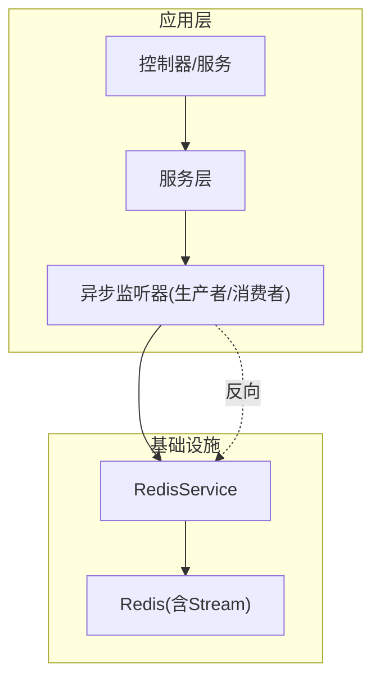
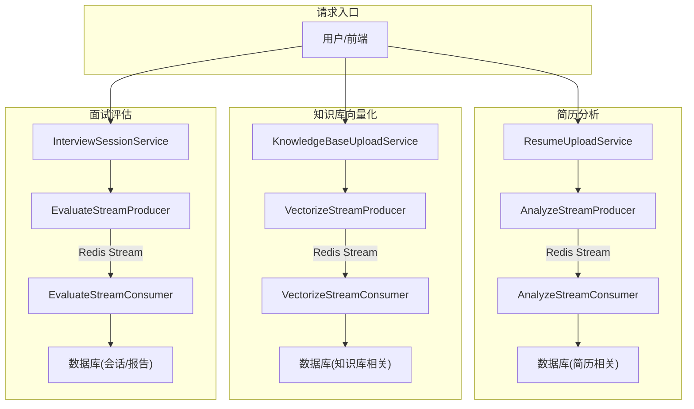
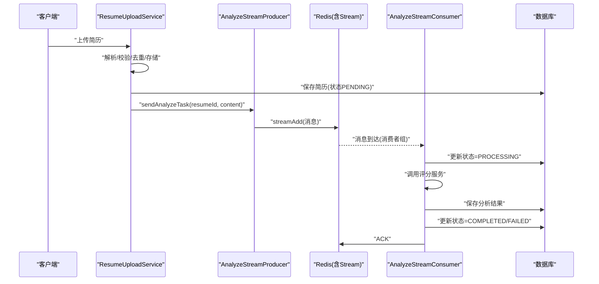
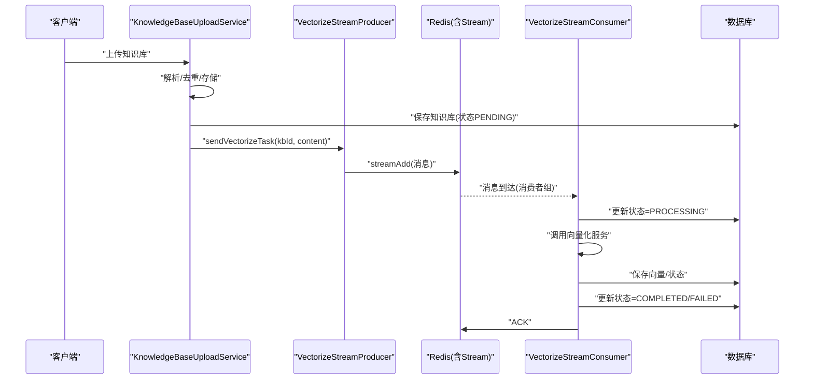
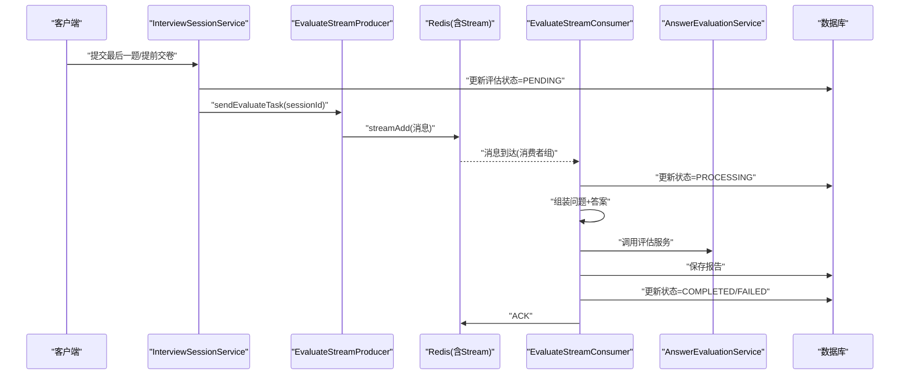
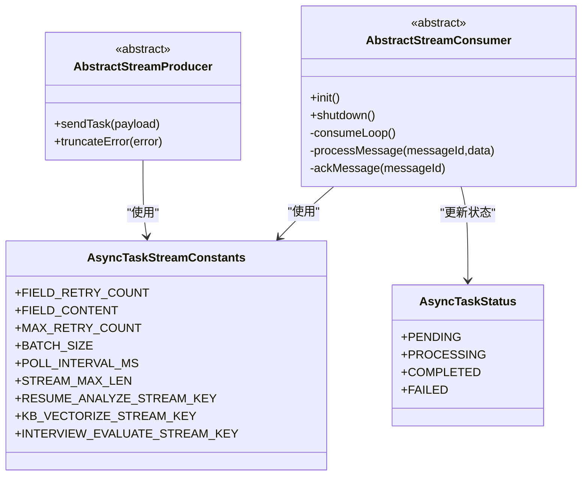
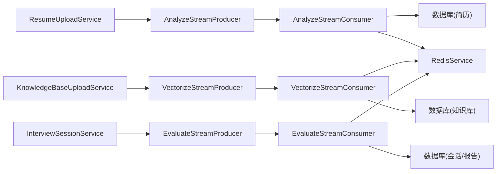

# 数据流架构

<cite>
**本文引用的文件**
- [AbstractStreamConsumer.java](file://app/src/main/java/interview/guide/common/async/AbstractStreamConsumer.java)
- [AbstractStreamProducer.java](file://app/src/main/java/interview/guide/common/async/AbstractStreamProducer.java)
- [AsyncTaskStreamConstants.java](file://app/src/main/java/interview/guide/common/constant/AsyncTaskStreamConstants.java)
- [AsyncTaskStatus.java](file://app/src/main/java/interview/guide/common/model/AsyncTaskStatus.java)
- [AnalyzeStreamConsumer.java](file://app/src/main/java/interview/guide/modules/resume/listener/AnalyzeStreamConsumer.java)
- [AnalyzeStreamProducer.java](file://app/src/main/java/interview/guide/modules/resume/listener/AnalyzeStreamProducer.java)
- [ResumeUploadService.java](file://app/src/main/java/interview/guide/modules/resume/service/ResumeUploadService.java)
- [VectorizeStreamConsumer.java](file://app/src/main/java/interview/guide/modules/knowledgebase/listener/VectorizeStreamConsumer.java)
- [VectorizeStreamProducer.java](file://app/src/main/java/interview/guide/modules/knowledgebase/listener/VectorizeStreamProducer.java)
- [KnowledgeBaseUploadService.java](file://app/src/main/java/interview/guide/modules/knowledgebase/service/KnowledgeBaseUploadService.java)
- [EvaluateStreamConsumer.java](file://app/src/main/java/interview/guide/modules/interview/listener/EvaluateStreamConsumer.java)
- [EvaluateStreamProducer.java](file://app/src/main/java/interview/guide/modules/interview/listener/EvaluateStreamProducer.java)
- [InterviewSessionService.java](file://app/src/main/java/interview/guide/modules/interview/service/InterviewSessionService.java)
- [AnswerEvaluationService.java](file://app/src/main/java/interview/guide/modules/interview/service/AnswerEvaluationService.java)
- [RedisService.java](file://app/src/main/java/interview/guide/infrastructure/redis/RedisService.java)
</cite>

## 目录
1. [简介](#简介)
2. [项目结构](#项目结构)
3. [核心组件](#核心组件)
4. [架构总览](#架构总览)
5. [详细组件分析](#详细组件分析)
6. [依赖分析](#依赖分析)
7. [性能考量](#性能考量)
8. [故障排查指南](#故障排查指南)
9. [结论](#结论)
10. [附录](#附录)

## 简介
本文件面向面试指南平台的数据流与异步处理架构，聚焦以下目标：
- 描述从用户请求到最终响应的完整数据流路径
- 详解基于 Redis Stream 的异步处理流水线：简历分析、知识库向量化、面试评估
- 说明数据状态管理、错误处理与重试策略
- 提供数据流图与时序图，帮助理解复杂异步逻辑

## 项目结构
系统采用“控制器-服务-监听器-Redis Stream”的分层设计：
- 控制器负责接收请求并触发业务流程
- 服务层编排业务逻辑，将长耗时任务异步投递至 Redis Stream
- 监听器（消费者/生产者）分别负责消息的发送与消费
- RedisService 封装 Redis 操作，支撑缓存、分布式锁与 Stream

图表来源
- [RedisService.java:202-327](file://app/src/main/java/interview/guide/infrastructure/redis/RedisService.java#L202-L327)
- [AnalyzeStreamProducer.java:19-82](file://app/src/main/java/interview/guide/modules/resume/listener/AnalyzeStreamProducer.java#L19-L82)
- [VectorizeStreamProducer.java:19-82](file://app/src/main/java/interview/guide/modules/knowledgebase/listener/VectorizeStreamProducer.java#L19-L82)
- [EvaluateStreamProducer.java:19-78](file://app/src/main/java/interview/guide/modules/interview/listener/EvaluateStreamProducer.java#L19-L78)

章节来源
- [RedisService.java:202-327](file://app/src/main/java/interview/guide/infrastructure/redis/RedisService.java#L202-L327)
- [AsyncTaskStreamConstants.java:1-135](file://app/src/main/java/interview/guide/common/constant/AsyncTaskStreamConstants.java#L1-L135)

## 核心组件
- Redis Stream 常量与字段定义：统一管理不同异步任务的 Stream Key、消费者组、字段名与重试策略
- 异步模板基类：抽象出“创建消费者组、批量拉取、ACK、重试、失败标记”等通用逻辑
- 三大异步任务监听器：
  - 简历分析：解析后异步评分并持久化
  - 知识库向量化：解析后异步向量化并落库
  - 面试评估：提交答案后异步生成报告
- 服务编排：在业务关键点将任务投递到对应 Stream，并维护状态

章节来源
- [AsyncTaskStreamConstants.java:1-135](file://app/src/main/java/interview/guide/common/constant/AsyncTaskStreamConstants.java#L1-L135)
- [AbstractStreamConsumer.java:1-176](file://app/src/main/java/interview/guide/common/async/AbstractStreamConsumer.java#L1-L176)
- [AbstractStreamProducer.java:1-55](file://app/src/main/java/interview/guide/common/async/AbstractStreamProducer.java#L1-L55)
- [AsyncTaskStatus.java:1-13](file://app/src/main/java/interview/guide/common/model/AsyncTaskStatus.java#L1-L13)

## 架构总览
下图展示三类异步任务的总体数据流：请求进入服务层，写入数据库并投递到 Redis Stream；后台消费者从 Stream 拉取消息，执行业务处理，更新状态并持久化。

图表来源
- [ResumeUploadService.java:47-110](file://app/src/main/java/interview/guide/modules/resume/service/ResumeUploadService.java#L47-L110)
- [AnalyzeStreamProducer.java:36-38](file://app/src/main/java/interview/guide/modules/resume/listener/AnalyzeStreamProducer.java#L36-L38)
- [AnalyzeStreamConsumer.java:91-105](file://app/src/main/java/interview/guide/modules/resume/listener/AnalyzeStreamConsumer.java#L91-L105)
- [KnowledgeBaseUploadService.java:48-102](file://app/src/main/java/interview/guide/modules/knowledgebase/service/KnowledgeBaseUploadService.java#L48-L102)
- [VectorizeStreamProducer.java:36-38](file://app/src/main/java/interview/guide/modules/knowledgebase/listener/VectorizeStreamProducer.java#L36-L38)
- [VectorizeStreamConsumer.java:85-87](file://app/src/main/java/interview/guide/modules/knowledgebase/listener/VectorizeStreamConsumer.java#L85-L87)
- [InterviewSessionService.java:338-343](file://app/src/main/java/interview/guide/modules/interview/service/InterviewSessionService.java#L338-L343)
- [EvaluateStreamProducer.java:33-35](file://app/src/main/java/interview/guide/modules/interview/listener/EvaluateStreamProducer.java#L33-L35)
- [EvaluateStreamConsumer.java:129-134](file://app/src/main/java/interview/guide/modules/interview/listener/EvaluateStreamConsumer.java#L129-L134)

## 详细组件分析

### 简历分析异步流程
- 请求路径：用户上传简历 → 服务层解析/校验/去重/存储 → 写入数据库（状态 PENDING）→ 投递分析任务到 Redis Stream
- 消费路径：消费者从 Stream 拉取消息 → 标记 PROCESSING → 调用评分服务 → 保存分析结果 → 标记 COMPLETED 或 FAILED → ACK
- 重试与失败：最大重试次数由常量控制；超过阈值后标记 FAILED 并记录错误；重试时将消息再次入队

图表来源
- [ResumeUploadService.java:89-90](file://app/src/main/java/interview/guide/modules/resume/service/ResumeUploadService.java#L89-L90)
- [AnalyzeStreamProducer.java:51-57](file://app/src/main/java/interview/guide/modules/resume/listener/AnalyzeStreamProducer.java#L51-L57)
- [AnalyzeStreamConsumer.java:108-110](file://app/src/main/java/interview/guide/modules/resume/listener/AnalyzeStreamConsumer.java#L108-L110)
- [AsyncTaskStreamConstants.java:28-46](file://app/src/main/java/interview/guide/common/constant/AsyncTaskStreamConstants.java#L28-L46)

章节来源
- [ResumeUploadService.java:47-110](file://app/src/main/java/interview/guide/modules/resume/service/ResumeUploadService.java#L47-L110)
- [AnalyzeStreamProducer.java:19-82](file://app/src/main/java/interview/guide/modules/resume/listener/AnalyzeStreamProducer.java#L19-L82)
- [AnalyzeStreamConsumer.java:24-158](file://app/src/main/java/interview/guide/modules/resume/listener/AnalyzeStreamConsumer.java#L24-L158)
- [AsyncTaskStatus.java:7-12](file://app/src/main/java/interview/guide/common/model/AsyncTaskStatus.java#L7-L12)

### 知识库向量化异步流程
- 请求路径：用户上传知识库 → 服务层解析/去重/存储 → 写入数据库（状态 PENDING）→ 投递向量化任务到 Redis Stream
- 消费路径：消费者从 Stream 拉取消息 → 标记 PROCESSING → 调用向量化服务 → 落库 → 标记 COMPLETED 或 FAILED → ACK
- 重试与失败：同上，达到最大重试后标记 FAILED

图表来源
- [KnowledgeBaseUploadService.java:78-82](file://app/src/main/java/interview/guide/modules/knowledgebase/service/KnowledgeBaseUploadService.java#L78-L82)
- [VectorizeStreamProducer.java:51-57](file://app/src/main/java/interview/guide/modules/knowledgebase/listener/VectorizeStreamProducer.java#L51-L57)
- [VectorizeStreamConsumer.java:85-92](file://app/src/main/java/interview/guide/modules/knowledgebase/listener/VectorizeStreamConsumer.java#L85-L92)
- [AsyncTaskStreamConstants.java:28-46](file://app/src/main/java/interview/guide/common/constant/AsyncTaskStreamConstants.java#L28-L46)

章节来源
- [KnowledgeBaseUploadService.java:48-102](file://app/src/main/java/interview/guide/modules/knowledgebase/service/KnowledgeBaseUploadService.java#L48-L102)
- [VectorizeStreamProducer.java:19-82](file://app/src/main/java/interview/guide/modules/knowledgebase/listener/VectorizeStreamProducer.java#L19-L82)
- [VectorizeStreamConsumer.java:21-140](file://app/src/main/java/interview/guide/modules/knowledgebase/listener/VectorizeStreamConsumer.java#L21-L140)
- [AsyncTaskStatus.java:7-12](file://app/src/main/java/interview/guide/common/model/AsyncTaskStatus.java#L7-L12)

### 面试评估异步流程
- 触发时机：最后一题提交或提前交卷时，服务层将评估状态置为 PENDING 并投递评估任务
- 消费路径：消费者从 Stream 拉取消息 → 标记 PROCESSING → 组装问题与答案 → 调用统一评估服务 → 保存报告 → 标记 COMPLETED 或 FAILED → ACK
- 重试与失败：同上，达到最大重试后标记 FAILED

图表来源
- [InterviewSessionService.java:338-343](file://app/src/main/java/interview/guide/modules/interview/service/InterviewSessionService.java#L338-L343)
- [EvaluateStreamProducer.java:48-53](file://app/src/main/java/interview/guide/modules/interview/listener/EvaluateStreamProducer.java#L48-L53)
- [EvaluateStreamConsumer.java:129-134](file://app/src/main/java/interview/guide/modules/interview/listener/EvaluateStreamConsumer.java#L129-L134)
- [AnswerEvaluationService.java:45-75](file://app/src/main/java/interview/guide/modules/interview/service/AnswerEvaluationService.java#L45-L75)

章节来源
- [InterviewSessionService.java:294-357](file://app/src/main/java/interview/guide/modules/interview/service/InterviewSessionService.java#L294-L357)
- [EvaluateStreamProducer.java:19-78](file://app/src/main/java/interview/guide/modules/interview/listener/EvaluateStreamProducer.java#L19-L78)
- [EvaluateStreamConsumer.java:32-185](file://app/src/main/java/interview/guide/modules/interview/listener/EvaluateStreamConsumer.java#L32-L185)
- [AnswerEvaluationService.java:26-99](file://app/src/main/java/interview/guide/modules/interview/service/AnswerEvaluationService.java#L26-L99)

### 异步处理模板与状态管理
- 模板职责：统一创建消费者组、阻塞拉取消息、ACK、重试上限、失败标记、错误截断
- 状态枚举：PENDING → PROCESSING → COMPLETED/FAILED
- 字段约定：统一的 Stream Key、消费者组、字段名（如 retryCount、content、resumeId、kbId、sessionId）

图表来源
- [AbstractStreamProducer.java:14-55](file://app/src/main/java/interview/guide/common/async/AbstractStreamProducer.java#L14-L55)
- [AbstractStreamConsumer.java:24-176](file://app/src/main/java/interview/guide/common/async/AbstractStreamConsumer.java#L24-L176)
- [AsyncTaskStatus.java:7-12](file://app/src/main/java/interview/guide/common/model/AsyncTaskStatus.java#L7-L12)
- [AsyncTaskStreamConstants.java:13-135](file://app/src/main/java/interview/guide/common/constant/AsyncTaskStreamConstants.java#L13-L135)

章节来源
- [AbstractStreamProducer.java:1-55](file://app/src/main/java/interview/guide/common/async/AbstractStreamProducer.java#L1-L55)
- [AbstractStreamConsumer.java:1-176](file://app/src/main/java/interview/guide/common/async/AbstractStreamConsumer.java#L1-L176)
- [AsyncTaskStatus.java:1-13](file://app/src/main/java/interview/guide/common/model/AsyncTaskStatus.java#L1-L13)
- [AsyncTaskStreamConstants.java:1-135](file://app/src/main/java/interview/guide/common/constant/AsyncTaskStreamConstants.java#L1-L135)

## 依赖分析
- 低耦合高内聚：各异步任务监听器彼此独立，通过 Redis Stream 解耦
- 依赖方向：
  - 服务层依赖对应的 Stream Producer
  - 消费者依赖 RedisService 与领域服务（评分/向量化/评估）
  - RedisService 作为唯一 Redis 访问入口
- 关键依赖链：
  - ResumeUploadService → AnalyzeStreamProducer → AnalyzeStreamConsumer → 评分/持久化
  - KnowledgeBaseUploadService → VectorizeStreamProducer → VectorizeStreamConsumer → 向量化/持久化
  - InterviewSessionService → EvaluateStreamProducer → EvaluateStreamConsumer → 评估/持久化

图表来源
- [ResumeUploadService.java:36-37](file://app/src/main/java/interview/guide/modules/resume/service/ResumeUploadService.java#L36-L37)
- [AnalyzeStreamProducer.java:25-28](file://app/src/main/java/interview/guide/modules/resume/listener/AnalyzeStreamProducer.java#L25-L28)
- [AnalyzeStreamConsumer.java:30-40](file://app/src/main/java/interview/guide/modules/resume/listener/AnalyzeStreamConsumer.java#L30-L40)
- [KnowledgeBaseUploadService.java:36-37](file://app/src/main/java/interview/guide/modules/knowledgebase/service/KnowledgeBaseUploadService.java#L36-L37)
- [VectorizeStreamProducer.java:25-28](file://app/src/main/java/interview/guide/modules/knowledgebase/listener/VectorizeStreamProducer.java#L25-L28)
- [VectorizeStreamConsumer.java:26-34](file://app/src/main/java/interview/guide/modules/knowledgebase/listener/VectorizeStreamConsumer.java#L26-L34)
- [InterviewSessionService.java:47-48](file://app/src/main/java/interview/guide/modules/interview/service/InterviewSessionService.java#L47-L48)
- [EvaluateStreamProducer.java:23-26](file://app/src/main/java/interview/guide/modules/interview/listener/EvaluateStreamProducer.java#L23-L26)
- [EvaluateStreamConsumer.java:40-54](file://app/src/main/java/interview/guide/modules/interview/listener/EvaluateStreamConsumer.java#L40-L54)
- [RedisService.java:202-327](file://app/src/main/java/interview/guide/infrastructure/redis/RedisService.java#L202-L327)

章节来源
- [ResumeUploadService.java:36-37](file://app/src/main/java/interview/guide/modules/resume/service/ResumeUploadService.java#L36-L37)
- [KnowledgeBaseUploadService.java:36-37](file://app/src/main/java/interview/guide/modules/knowledgebase/service/KnowledgeBaseUploadService.java#L36-L37)
- [InterviewSessionService.java:47-48](file://app/src/main/java/interview/guide/modules/interview/service/InterviewSessionService.java#L47-L48)

## 性能考量
- Redis Stream 阻塞读取：消费者使用阻塞读取减少空轮询开销，提升吞吐
- 批量拉取与长度限制：批量大小与最大长度限制避免内存膨胀
- 单线程消费者：每个消费者组内单线程顺序处理，保证幂等与一致性
- 缓存与数据库双写：会话状态优先缓存，降低数据库压力；异步任务完成后回写状态

章节来源
- [RedisService.java:224-259](file://app/src/main/java/interview/guide/infrastructure/redis/RedisService.java#L224-L259)
- [AsyncTaskStreamConstants.java:35-46](file://app/src/main/java/interview/guide/common/constant/AsyncTaskStreamConstants.java#L35-L46)
- [AbstractStreamConsumer.java:74-93](file://app/src/main/java/interview/guide/common/async/AbstractStreamConsumer.java#L74-L93)

## 故障排查指南
- 消费者未启动/未创建消费者组
  - 现象：消息不被消费
  - 排查：确认消费者初始化日志、消费者组是否创建成功
- 消息 ACK 失败
  - 现象：消息重复消费或堆积
  - 排查：查看 ACK 日志与异常；确认消费者线程未被中断
- 重试耗尽仍失败
  - 现象：状态变为 FAILED
  - 排查：查看错误截断后的错误摘要；必要时手动重试
- 业务处理异常
  - 现象：评估/评分/向量化失败
  - 排查：检查对应服务的日志与异常；确认输入参数与外部依赖可用

章节来源
- [AbstractStreamConsumer.java:40-44](file://app/src/main/java/interview/guide/common/async/AbstractStreamConsumer.java#L40-L44)
- [AbstractStreamConsumer.java:140-146](file://app/src/main/java/interview/guide/common/async/AbstractStreamConsumer.java#L140-L146)
- [AnalyzeStreamConsumer.java:112-122](file://app/src/main/java/interview/guide/modules/resume/listener/AnalyzeStreamConsumer.java#L112-L122)
- [VectorizeStreamConsumer.java:94-100](file://app/src/main/java/interview/guide/modules/knowledgebase/listener/VectorizeStreamConsumer.java#L94-L100)
- [EvaluateStreamConsumer.java:146-150](file://app/src/main/java/interview/guide/modules/interview/listener/EvaluateStreamConsumer.java#L146-L150)

## 结论
本架构以 Redis Stream 为核心，将简历分析、知识库向量化与面试评估三大长耗时任务解耦为异步流程，结合统一的状态管理与重试策略，实现了高吞吐、可扩展、可观测的数据流体系。通过模板化的生产者/消费者与严格的字段/常量约定，降低了跨模块耦合，提升了可维护性。

## 附录
- 关键常量与字段
  - 重试次数字段：retryCount
  - 内容字段：content
  - 简历ID字段：resumeId
  - 知识库ID字段：kbId
  - 会话ID字段：sessionId
- 任务流键
  - 简历分析：knowledgebase:vectorize:stream
  - 知识库向量化：resume:analyze:stream
  - 面试评估：interview:evaluate:stream

章节来源
- [AsyncTaskStreamConstants.java:13-135](file://app/src/main/java/interview/guide/common/constant/AsyncTaskStreamConstants.java#L13-L135)