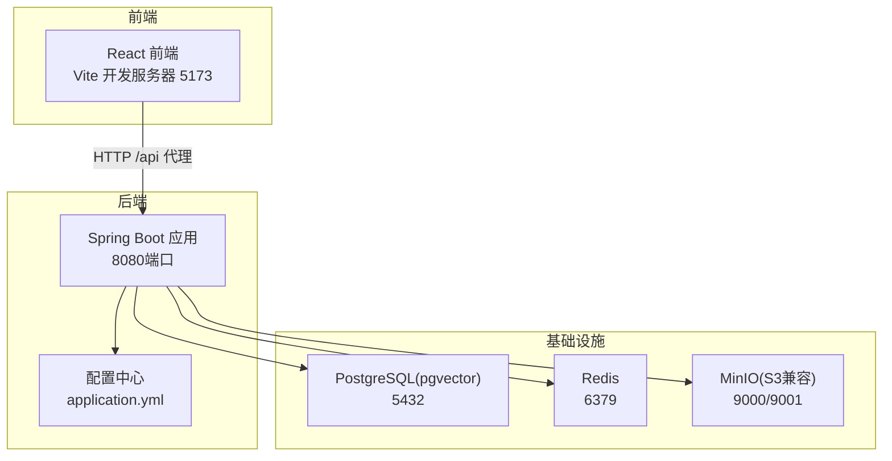
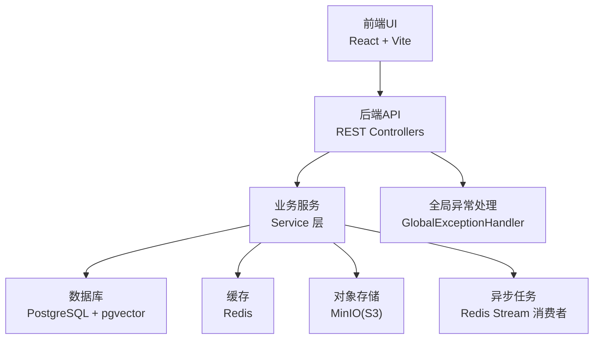
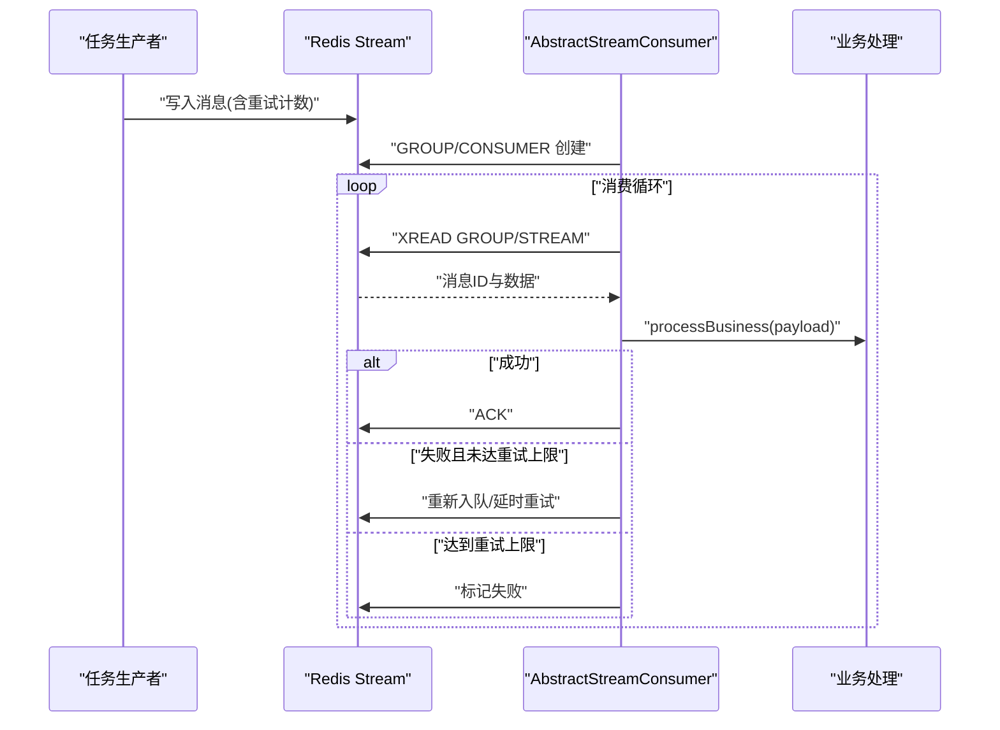
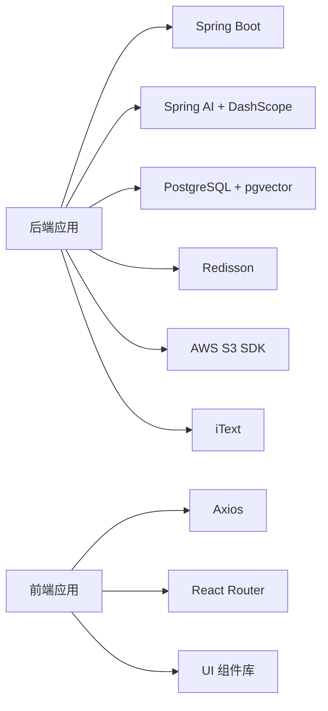

# 整体架构设计

<cite>
**本文引用的文件**   
- [App.java](file://app/src/main/java/interview/guide/App.java)
- [application.yml](file://app/src/main/resources/application.yml)
- [build.gradle](file://app/build.gradle)
- [CorsConfig.java](file://app/src/main/java/interview/guide/common/config/CorsConfig.java)
- [JacksonConfig.java](file://app/src/main/java/interview/guide/common/config/JacksonConfig.java)
- [AbstractStreamConsumer.java](file://app/src/main/java/interview/guide/common/async/AbstractStreamConsumer.java)
- [InterviewController.java](file://app/src/main/java/interview/guide/modules/interview/InterviewController.java)
- [KnowledgeBaseController.java](file://app/src/main/java/interview/guide/modules/knowledgebase/KnowledgeBaseController.java)
- [ResumeController.java](file://app/src/main/java/interview/guide/modules/resume/ResumeController.java)
- [VoiceInterviewController.java](file://app/src/main/java/interview/guide/modules/voiceinterview/controller/VoiceInterviewController.java)
- [GlobalExceptionHandler.java](file://app/src/main/java/interview/guide/common/exception/GlobalExceptionHandler.java)
- [docker-compose.yml](file://docker-compose.yml)
- [main.tsx](file://frontend/src/main.tsx)
- [vite.config.ts](file://frontend/vite.config.ts)
- [package.json](file://frontend/package.json)
</cite>

## 目录
1. [引言](#引言)
2. [项目结构](#项目结构)
3. [核心组件](#核心组件)
4. [架构总览](#架构总览)
5. [详细组件分析](#详细组件分析)
6. [依赖分析](#依赖分析)
7. [性能考虑](#性能考虑)
8. [故障排查指南](#故障排查指南)
9. [结论](#结论)
10. [附录](#附录)

## 引言
本架构设计文档面向面试指南平台，系统采用前后端分离架构，后端基于 Spring Boot 4.0 + Java 21，前端基于 React + Vite，配合 PostgreSQL + Redis + MinIO 的基础设施栈，实现简历分析、模拟面试、RAG 知识库、语音实时面试等核心能力。系统强调模块化与异步处理，通过 Redis Stream 实现后台任务解耦，通过 Spring AI 与 DashScope 提供 LLM 能力，并通过 Docker Compose 实现一键部署。

## 项目结构
- 后端应用位于 app/，采用 Gradle 构建，主入口为 App.java，配置集中于 application.yml。
- 前端应用位于 frontend/，采用 Vite + React，开发服务器端口 5173，默认通过代理转发 /api 到后端 8080。
- 基础设施编排位于 docker-compose.yml，包含 PostgreSQL（pgvector）、Redis、MinIO、后端应用与前端 Nginx 服务。

图表来源
- [docker-compose.yml:1-197](file://docker-compose.yml#L1-L197)
- [vite.config.ts:24-37](file://frontend/vite.config.ts#L24-L37)
- [application.yml:9-24](file://app/src/main/resources/application.yml#L9-L24)

章节来源
- [docker-compose.yml:1-197](file://docker-compose.yml#L1-L197)
- [vite.config.ts:1-42](file://frontend/vite.config.ts#L1-L42)
- [application.yml:1-282](file://app/src/main/resources/application.yml#L1-L282)

## 核心组件
- Spring Boot 后端应用：负责 REST API、业务服务、异步任务、全局异常处理、CORS 配置、Jackson 配置等。
- React 前端应用：负责用户界面、路由、API 调用、主题与媒体播放器等。
- 数据库层：PostgreSQL + pgvector，用于结构化数据与向量检索。
- 缓存层：Redis，用于会话缓存与 Redis Stream 异步任务。
- 存储层：MinIO（S3 兼容），用于简历与知识库文档的存储。
- 异步处理：基于 Redis Stream 的消费者模板，统一处理 ACK、重试与生命周期管理。

章节来源
- [App.java:1-19](file://app/src/main/java/interview/guide/App.java#L1-L19)
- [CorsConfig.java:1-44](file://app/src/main/java/interview/guide/common/config/CorsConfig.java#L1-L44)
- [JacksonConfig.java:1-19](file://app/src/main/java/interview/guide/common/config/JacksonConfig.java#L1-L19)
- [AbstractStreamConsumer.java:1-176](file://app/src/main/java/interview/guide/common/async/AbstractStreamConsumer.java#L1-L176)
- [docker-compose.yml:1-197](file://docker-compose.yml#L1-L197)

## 架构总览
系统采用前后端分离与微服务模块化设计：
- 前端通过 /api 代理访问后端 REST 接口，支持多模块（面试、简历、知识库、语音面试）。
- 后端按功能模块拆分，每个模块包含 Controller、Service、Repository、Model、Listener 等层次，便于独立演进。
- 异步处理通过 Redis Stream 解耦，消费者模板抽象了消费循环、ACK、重试与生命周期管理。
- 全局异常处理统一返回业务错误码，保证前端可预期的错误语义。

图表来源
- [InterviewController.java:1-176](file://app/src/main/java/interview/guide/modules/interview/InterviewController.java#L1-L176)
- [KnowledgeBaseController.java:1-211](file://app/src/main/java/interview/guide/modules/knowledgebase/KnowledgeBaseController.java#L1-L211)
- [ResumeController.java:1-132](file://app/src/main/java/interview/guide/modules/resume/ResumeController.java#L1-L132)
- [VoiceInterviewController.java:1-201](file://app/src/main/java/interview/guide/modules/voiceinterview/controller/VoiceInterviewController.java#L1-L201)
- [GlobalExceptionHandler.java:1-161](file://app/src/main/java/interview/guide/common/exception/GlobalExceptionHandler.java#L1-L161)
- [AbstractStreamConsumer.java:1-176](file://app/src/main/java/interview/guide/common/async/AbstractStreamConsumer.java#L1-L176)

## 详细组件分析

### 后端应用与配置
- 主入口：启用调度与 Spring Boot 启动，扫描模块包路径。
- 服务器与线程：启用虚拟线程，Tomcat 线程池参数优化，UTF-8 编码。
- 数据源与 JPA：HikariCP 连接池、Hibernate 批量优化、Open-in-View 关闭。
- Redisson：单机配置，连接池大小与空闲策略。
- Spring AI：DashScope OpenAI 兼容模式，嵌入模型 text-embedding-v3，pgvector 向量存储。
- 应用自定义配置：AI Provider、RAG 参数、面试与简历参数、存储端点、CORS、语音面试参数等。
- 全局异常处理：统一返回 Result，区分业务错误码与 HTTP 200。

章节来源
- [App.java:1-19](file://app/src/main/java/interview/guide/App.java#L1-L19)
- [application.yml:9-282](file://app/src/main/resources/application.yml#L9-L282)
- [GlobalExceptionHandler.java:1-161](file://app/src/main/java/interview/guide/common/exception/GlobalExceptionHandler.java#L1-L161)

### 前端应用与代理
- 入口初始化深色模式，避免闪烁。
- Vite 开发服务器：host 0.0.0.0，端口 5173，/api 代理至后端 8080。
- 依赖：React、路由、UI 组件库、Markdown 渲染、ONNX Web 推理等。

章节来源
- [main.tsx:1-21](file://frontend/src/main.tsx#L1-L21)
- [vite.config.ts:1-42](file://frontend/vite.config.ts#L1-L42)
- [package.json:1-47](file://frontend/package.json#L1-L47)

### 微服务模块化设计
- 模块划分：interview、knowledgebase、resume、voiceinterview 等，每个模块有清晰的 Controller、Service、Repository、Model、Listener。
- 控制器职责：
  - 模拟面试：会话创建、问题获取、答案提交、报告生成、PDF 导出、删除会话。
  - 知识库：上传、下载、查询、分类管理、统计、向量化重试、SSE 流式回答。
  - 简历：上传分析、历史列表、详情、PDF 导出、删除、重分析。
  - 语音面试：会话生命周期、暂停/恢复、消息历史、异步评估触发与轮询。
- 全局注解：@Tag 标注模块，@RateLimit 限流，统一 Result 包装。

章节来源
- [InterviewController.java:1-176](file://app/src/main/java/interview/guide/modules/interview/InterviewController.java#L1-L176)
- [KnowledgeBaseController.java:1-211](file://app/src/main/java/interview/guide/modules/knowledgebase/KnowledgeBaseController.java#L1-L211)
- [ResumeController.java:1-132](file://app/src/main/java/interview/guide/modules/resume/ResumeController.java#L1-L132)
- [VoiceInterviewController.java:1-201](file://app/src/main/java/interview/guide/modules/voiceinterview/controller/VoiceInterviewController.java#L1-L201)

### 异步处理架构
- Redis Stream 消费者模板：统一创建消费者组、消费循环、ACK、重试上限、失败标记、生命周期管理。
- 适用场景：简历分析、知识库向量化、语音面试评估等后台任务。
- 消费批大小与轮询间隔由常量控制，保证吞吐与延迟平衡。

图表来源
- [AbstractStreamConsumer.java:74-123](file://app/src/main/java/interview/guide/common/async/AbstractStreamConsumer.java#L74-L123)

章节来源
- [AbstractStreamConsumer.java:1-176](file://app/src/main/java/interview/guide/common/async/AbstractStreamConsumer.java#L1-L176)

### CORS 与序列化配置
- CORS：基于配置属性动态注册允许的源、方法、头与凭证，限定 /api/** 路径。
- Jackson：提供 ObjectMapper Bean，统一 JSON 序列化。

章节来源
- [CorsConfig.java:1-44](file://app/src/main/java/interview/guide/common/config/CorsConfig.java#L1-L44)
- [JacksonConfig.java:1-19](file://app/src/main/java/interview/guide/common/config/JacksonConfig.java#L1-L19)

### 基础设施与部署
- docker-compose：PostgreSQL（pgvector）、Redis、MinIO（含初始化容器创建 Bucket）、后端应用、前端 Nginx。
- 环境变量：数据库、Redis、存储端点、AI 密钥、面试参数等通过 compose 注入。
- 健康检查：数据库、Redis、MinIO 健康探测，后端等待基础设施健康后再启动。

章节来源
- [docker-compose.yml:1-197](file://docker-compose.yml#L1-L197)

## 依赖分析
- 技术栈依赖：Spring Boot 4.0、Spring AI、PostgreSQL + pgvector、Redisson、iText、AWS S3 SDK、DashScope SDK、MapStruct、Lombok、Tika、ONNX Runtime Web 等。
- 前端依赖：React 生态、路由、UI 组件库、语法高亮、图表库、Markdown 渲染等。
- 构建工具：Gradle 插件、Java Toolchain 21、UTF-8 编码、测试框架。

图表来源
- [build.gradle:23-87](file://app/build.gradle#L23-L87)
- [package.json:11-28](file://frontend/package.json#L11-L28)

章节来源
- [build.gradle:1-136](file://app/build.gradle#L1-L136)
- [package.json:1-47](file://frontend/package.json#L1-L47)

## 性能考虑
- 虚拟线程：启用虚拟线程以提升 I/O 密集型并发，适合 AI 调用与 SSE 场景。
- 连接池与批量：HikariCP 连接池与 Hibernate 批量优化，降低数据库压力。
- 缓存与流式：Redis 缓存热点数据，SSE 流式返回知识库问答，提升用户体验。
- 前端打包：Vite 分包策略，拆分 React 与 UI 依赖，减少首屏体积。
- 存储与向量：S3 兼容对象存储，pgvector 向量索引，支持大规模知识库检索。

## 故障排查指南
- 全局异常处理：统一返回 Result，业务错误码覆盖 AI 超时、配额、参数校验、资源未找到、方法不支持等。
- 常见问题定位：
  - AI 服务异常：检查 DashScope API Key、网络连通性、超时与限流。
  - 文件上传失败：检查 MaxUploadSize、存储桶权限与 MinIO 健康状态。
  - Redis Stream 任务堆积：检查消费者线程运行状态与重试上限。
  - CORS 跨域：确认 allowedOrigins 与 /api/** 路径匹配。
- 日志与编码：后端日志 UTF-8 输出，前端代理忽略第三方 sourcemap 警告。

章节来源
- [GlobalExceptionHandler.java:1-161](file://app/src/main/java/interview/guide/common/exception/GlobalExceptionHandler.java#L1-L161)
- [application.yml:4-24](file://app/src/main/resources/application.yml#L4-L24)
- [vite.config.ts:34-36](file://frontend/vite.config.ts#L34-L36)

## 结论
面试指南平台采用前后端分离与模块化微服务设计，结合 Redis Stream 异步处理、pgvector 向量检索与 S3 兼容存储，形成高可用、可扩展的面试辅助系统。通过统一的异常处理与配置中心，系统具备良好的可观测性与可维护性。建议在生产环境中进一步完善监控、日志聚合与灰度发布流程。

## 附录
- 系统边界图：前端 UI 与后端 API 边界清晰，后端内部按模块解耦，基础设施通过 Docker Compose 统一编排。
- 组件关系图：后端模块间低耦合，通过统一的配置与异常处理层，前端通过 /api 代理访问后端能力。