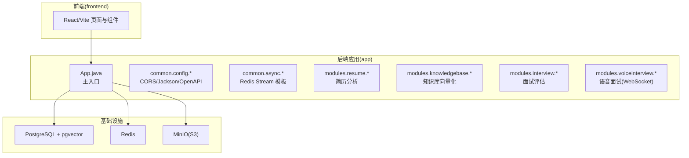
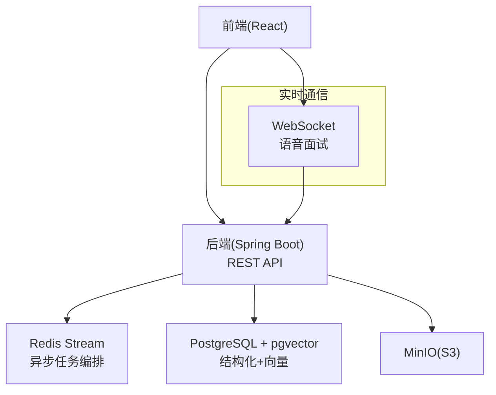
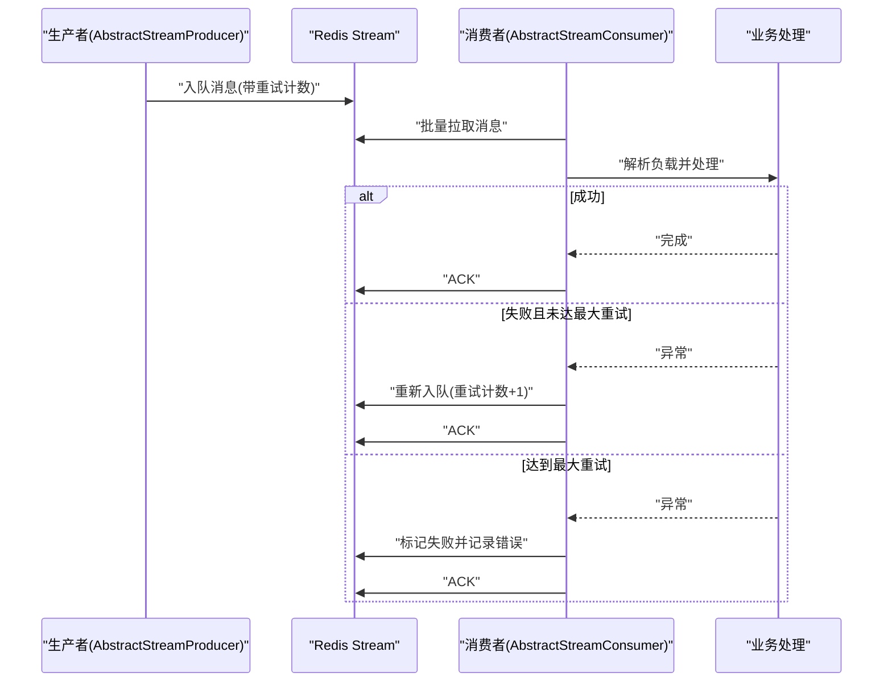
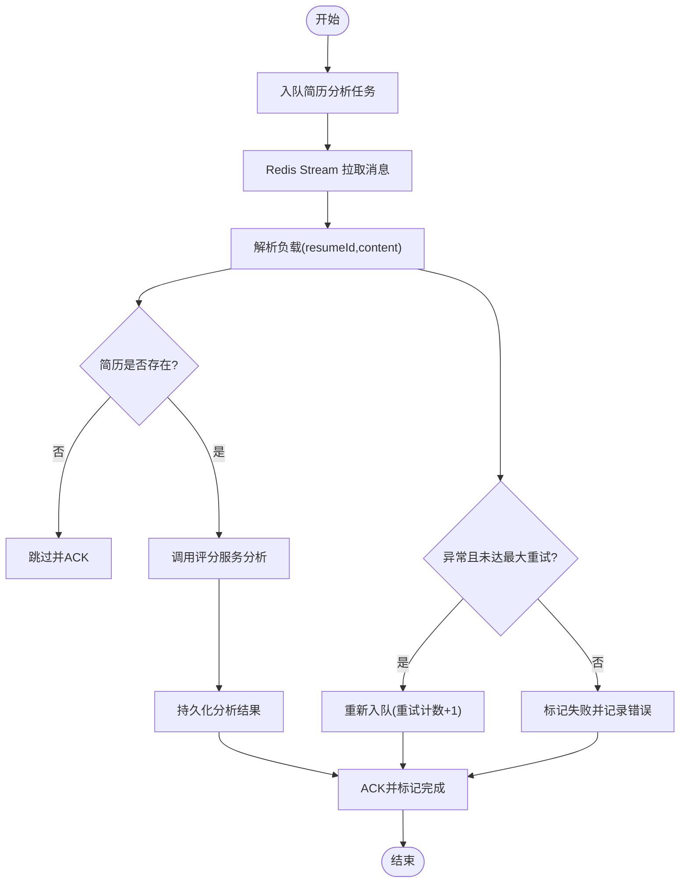
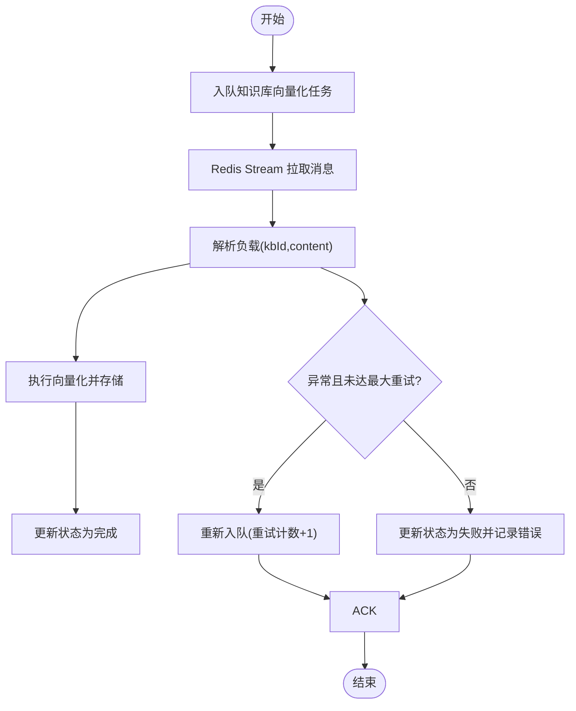
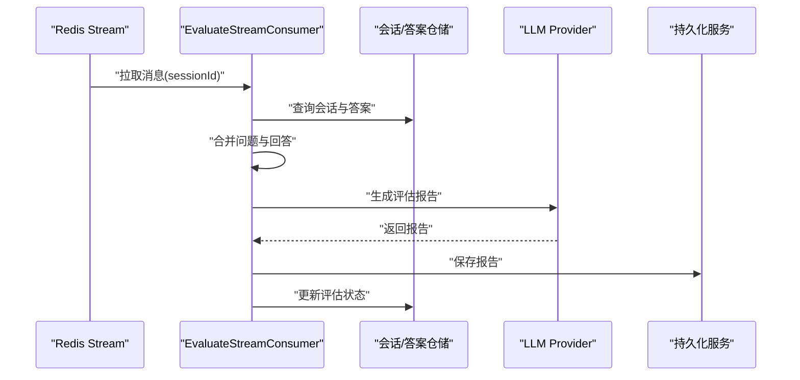
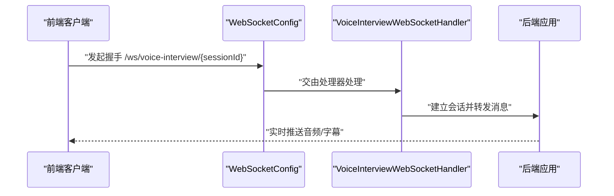
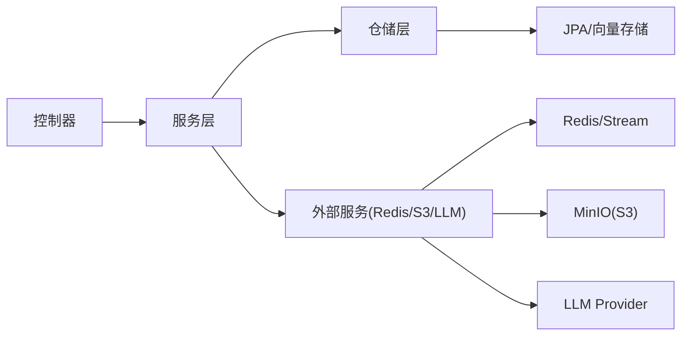
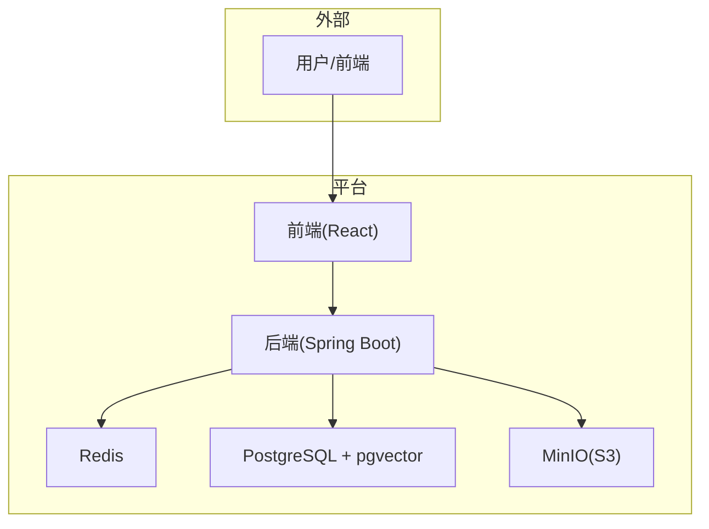

# 系统架构

<cite>
**本文引用的文件**
- [App.java](file://app/src/main/java/interview/guide/App.java)
- [build.gradle](file://app/build.gradle)
- [libs.versions.toml](file://gradle/libs.versions.toml)
- [package.json](file://frontend/package.json)
- [docker-compose.yml](file://docker-compose.yml)
- [logback-spring.xml](file://app/src/main/resources/logback-spring.xml)
- [CorsConfig.java](file://app/src/main/java/interview/guide/common/config/CorsConfig.java)
- [JacksonConfig.java](file://app/src/main/java/interview/guide/common/config/JacksonConfig.java)
- [OpenApiConfig.java](file://app/src/main/java/interview/guide/common/config/OpenApiConfig.java)
- [AbstractStreamConsumer.java](file://app/src/main/java/interview/guide/common/async/AbstractStreamConsumer.java)
- [AbstractStreamProducer.java](file://app/src/main/java/interview/guide/common/async/AbstractStreamProducer.java)
- [AnalyzeStreamConsumer.java](file://app/src/main/java/interview/guide/modules/resume/listener/AnalyzeStreamConsumer.java)
- [VectorizeStreamConsumer.java](file://app/src/main/java/interview/guide/modules/knowledgebase/listener/VectorizeStreamConsumer.java)
- [EvaluateStreamConsumer.java](file://app/src/main/java/interview/guide/modules/interview/listener/EvaluateStreamConsumer.java)
- [WebSocketConfig.java](file://app/src/main/java/interview/guide/modules/voiceinterview/config/WebSocketConfig.java)
</cite>

## 目录
1. [引言](#引言)
2. [项目结构](#项目结构)
3. [核心组件](#核心组件)
4. [架构总览](#架构总览)
5. [详细组件分析](#详细组件分析)
6. [依赖关系分析](#依赖关系分析)
7. [性能考量](#性能考量)
8. [故障排查指南](#故障排查指南)
9. [结论](#结论)
10. [附录](#附录)

## 引言
本系统是一个“面试指南”平台，采用前后端分离与微服务模块化设计，结合异步处理架构，支持简历分析、知识库向量化检索、模拟面试与语音面试等核心能力。后端基于 Spring Boot 4.0 与 Spring AI 2.0，使用 pgvector 向量数据库与 Redis Stream 实现异步任务编排；前端采用 React 技术栈，提供现代化交互体验。系统通过 Docker Compose 实现容器化与服务编排，并内置健康检查与初始化任务，确保基础设施即代码。

## 项目结构
系统采用多模块分层组织：
- 后端应用模块：位于 app/，包含通用配置、基础设施、模块化业务（简历、知识库、面试、语音面试等）、异步流处理监听器等。
- 前端模块：位于 frontend/，基于 React/Vite 构建，提供页面与交互。
- 运维与编排：位于根目录，包含 Gradle 版本管理、Docker Compose 编排与初始化脚本。

图表来源
- [App.java:11-17](file://app/src/main/java/interview/guide/App.java#L11-L17)
- [build.gradle:24-87](file://app/build.gradle#L24-L87)
- [docker-compose.yml:13-186](file://docker-compose.yml#L13-L186)

章节来源
- [App.java:11-17](file://app/src/main/java/interview/guide/App.java#L11-L17)
- [build.gradle:24-87](file://app/build.gradle#L24-L87)
- [docker-compose.yml:13-186](file://docker-compose.yml#L13-L186)

## 核心组件
- 应用入口与调度
  - 主入口启用调度能力，支撑定时任务与异步处理生命周期管理。
- 通用配置
  - CORS、Jackson、OpenAPI 等基础配置，保证跨域、序列化与接口文档一致性。
- 异步流处理
  - Redis Stream 模板抽象，统一消费循环、ACK、重试与生命周期管理，子类聚焦业务处理。
- 微服务模块
  - 简历分析、知识库向量化、面试评估、语音面试等模块化实现，职责清晰、边界明确。
- 实时通信
  - WebSocket 配置，支持语音面试的实时音频与字幕传输。
- 容器化与编排
  - Docker Compose 管理数据库、缓存、对象存储与应用服务，含健康检查与初始化任务。

章节来源
- [App.java:11-17](file://app/src/main/java/interview/guide/App.java#L11-L17)
- [CorsConfig.java:24-42](file://app/src/main/java/interview/guide/common/config/CorsConfig.java#L24-L42)
- [JacksonConfig.java:14-17](file://app/src/main/java/interview/guide/common/config/JacksonConfig.java#L14-L17)
- [OpenApiConfig.java:11-18](file://app/src/main/java/interview/guide/common/config/OpenApiConfig.java#L11-L18)
- [AbstractStreamConsumer.java:24-175](file://app/src/main/java/interview/guide/common/async/AbstractStreamConsumer.java#L24-L175)
- [AbstractStreamProducer.java:14-54](file://app/src/main/java/interview/guide/common/async/AbstractStreamProducer.java#L14-L54)
- [WebSocketConfig.java:18-23](file://app/src/main/java/interview/guide/modules/voiceinterview/config/WebSocketConfig.java#L18-L23)

## 架构总览
系统采用“前后端分离 + 微服务模块化 + 异步处理”的混合架构：
- 前端通过 HTTP API 与后端交互，部分场景使用 WebSocket 实现实时通信。
- 后端以模块为单位提供 REST 接口，内部通过 Redis Stream 异步编排长耗时任务。
- 数据层采用 PostgreSQL + pgvector，结合 Redis 缓存与 MinIO 对象存储，满足结构化数据、向量检索与非结构化文件存储需求。
- 运维层面通过 Docker Compose 实现服务编排、健康检查与初始化任务，确保环境一致性与可复现性。

图表来源
- [docker-compose.yml:13-186](file://docker-compose.yml#L13-L186)
- [WebSocketConfig.java:18-23](file://app/src/main/java/interview/guide/modules/voiceinterview/config/WebSocketConfig.java#L18-L23)

## 详细组件分析

### 异步处理架构（Redis Stream）
系统通过 Redis Stream 实现异步任务编排，统一模板负责：
- 消费组创建与消费者命名
- 批量拉取与消息 ACK
- 业务处理、重试与失败标记
- 生命周期管理（启动/销毁）

图表来源
- [AbstractStreamConsumer.java:74-123](file://app/src/main/java/interview/guide/common/async/AbstractStreamConsumer.java#L74-L123)
- [AbstractStreamProducer.java:22-36](file://app/src/main/java/interview/guide/common/async/AbstractStreamProducer.java#L22-L36)

章节来源
- [AbstractStreamConsumer.java:24-175](file://app/src/main/java/interview/guide/common/async/AbstractStreamConsumer.java#L24-L175)
- [AbstractStreamProducer.java:14-54](file://app/src/main/java/interview/guide/common/async/AbstractStreamProducer.java#L14-L54)

### 简历分析异步流水线
简历分析任务通过 Redis Stream 异步执行，典型流程：
- 入队简历内容与 ID
- 消费者解析负载并调用评分服务
- 保存分析结果并更新状态
- 失败时按最大重试次数进行重试

图表来源
- [AnalyzeStreamConsumer.java:69-139](file://app/src/main/java/interview/guide/modules/resume/listener/AnalyzeStreamConsumer.java#L69-L139)

章节来源
- [AnalyzeStreamConsumer.java:24-158](file://app/src/main/java/interview/guide/modules/resume/listener/AnalyzeStreamConsumer.java#L24-L158)

### 知识库向量化异步流水线
知识库向量化任务同样基于 Redis Stream：
- 入队知识库 ID 与内容
- 消费者执行向量化并写入 pgvector
- 更新向量状态与错误信息

图表来源
- [VectorizeStreamConsumer.java:64-121](file://app/src/main/java/interview/guide/modules/knowledgebase/listener/VectorizeStreamConsumer.java#L64-L121)

章节来源
- [VectorizeStreamConsumer.java:21-140](file://app/src/main/java/interview/guide/modules/knowledgebase/listener/VectorizeStreamConsumer.java#L21-L140)

### 面试评估异步流水线
面试评估任务从会话中聚合问题与答案，调用 LLM 生成评估报告并持久化：
- 拉取消息并解析会话 ID
- 查询会话与答案，合并问题与回答
- 选择 LLM Provider 并生成报告
- 更新评估状态

图表来源
- [EvaluateStreamConsumer.java:104-134](file://app/src/main/java/interview/guide/modules/interview/listener/EvaluateStreamConsumer.java#L104-L134)

章节来源
- [EvaluateStreamConsumer.java:32-185](file://app/src/main/java/interview/guide/modules/interview/listener/EvaluateStreamConsumer.java#L32-L185)

### 实时通信（WebSocket）
语音面试模块通过 WebSocket 提供实时双向通信：
- 配置处理器与握手拦截器
- 指定路径与允许来源
- 支持音频与字幕的实时传输

图表来源
- [WebSocketConfig.java:18-23](file://app/src/main/java/interview/guide/modules/voiceinterview/config/WebSocketConfig.java#L18-L23)

章节来源
- [WebSocketConfig.java:11-24](file://app/src/main/java/interview/guide/modules/voiceinterview/config/WebSocketConfig.java#L11-L24)

### 技术栈与选型说明
- Spring Boot 4.0
  - 模块化启动器、更好的 Java 21 工具链支持、更佳的依赖管理与运行时性能。
- Spring AI 2.0
  - OpenAI 兼容模式与向量存储适配，简化 LLM 集成与 RAG 流水线。
- PostgreSQL + pgvector
  - 结构化数据与向量相似度检索一体化，降低系统复杂度。
- Redisson 4.0 + Redis Stream
  - 轻量级异步编排替代 Kafka/RabbitMQ，运维成本低、扩展灵活。
- MinIO(S3) 兼容对象存储
  - 与 S3 SDK 无缝对接，便于迁移至云厂商对象存储。
- React 前端
  - 组件化与生态丰富，适合快速迭代与规模化交付。
- Docker Compose
  - 声明式编排、健康检查与初始化任务，保障环境一致性。

章节来源
- [build.gradle:24-87](file://app/build.gradle#L24-L87)
- [libs.versions.toml:3-29](file://gradle/libs.versions.toml#L3-L29)
- [package.json:11-44](file://frontend/package.json#L11-L44)
- [docker-compose.yml:13-186](file://docker-compose.yml#L13-L186)

## 依赖关系分析
后端模块间依赖清晰，遵循“控制器 → 服务 → 仓储 → 基础设施”的分层：
- 控制器依赖服务层接口
- 服务层依赖仓储与工具服务
- 仓储依赖数据源（JPA/向量存储）
- 基础设施依赖外部系统（Redis、S3、LLM Provider）

图表来源
- [AnalyzeStreamConsumer.java:26-40](file://app/src/main/java/interview/guide/modules/resume/listener/AnalyzeStreamConsumer.java#L26-L40)
- [VectorizeStreamConsumer.java:23-34](file://app/src/main/java/interview/guide/modules/knowledgebase/listener/VectorizeStreamConsumer.java#L23-L34)
- [EvaluateStreamConsumer.java:34-54](file://app/src/main/java/interview/guide/modules/interview/listener/EvaluateStreamConsumer.java#L34-L54)

章节来源
- [AnalyzeStreamConsumer.java:24-158](file://app/src/main/java/interview/guide/modules/resume/listener/AnalyzeStreamConsumer.java#L24-L158)
- [VectorizeStreamConsumer.java:21-140](file://app/src/main/java/interview/guide/modules/knowledgebase/listener/VectorizeStreamConsumer.java#L21-L140)
- [EvaluateStreamConsumer.java:32-185](file://app/src/main/java/interview/guide/modules/interview/listener/EvaluateStreamConsumer.java#L32-L185)

## 性能考量
- 异步解耦
  - 通过 Redis Stream 将长耗时任务与请求线程解耦，提升吞吐与响应时间稳定性。
- 批量与限流
  - 模板中设置批量大小与轮询间隔，避免过度占用 CPU；可结合速率限制注解与脚本实现精细化限流。
- 缓存与索引
  - Redis 缓存热点数据，pgvector 向量索引加速检索，减少数据库压力。
- 日志与编码
  - 显式设置日志字符集，避免终端与文件编码不一致导致的性能与可读性问题。

章节来源
- [AbstractStreamConsumer.java:74-93](file://app/src/main/java/interview/guide/common/async/AbstractStreamConsumer.java#L74-L93)
- [logback-spring.xml:7-8](file://app/src/main/resources/logback-spring.xml#L7-L8)

## 故障排查指南
- Redis Stream 消费异常
  - 检查消费者组是否创建成功、消息 ACK 是否正常、重试计数是否达到上限。
  - 关注消费者线程是否被中断、异常日志与错误截断长度。
- LLM Provider 选择
  - 确认注册表中 Provider 名称与配置一致，必要时回退到默认客户端。
- CORS 与编码
  - 核对 CORS 配置与允许来源，确保接口文档与前端域名一致。
  - 检查日志字符集配置，避免控制台乱码影响诊断。
- 容器健康与初始化
  - 关注数据库、缓存、对象存储的健康检查与初始化任务完成状态，确保后端启动顺序正确。

章节来源
- [AbstractStreamConsumer.java:90-122](file://app/src/main/java/interview/guide/common/async/AbstractStreamConsumer.java#L90-L122)
- [EvaluateStreamConsumer.java:127-133](file://app/src/main/java/interview/guide/modules/interview/listener/EvaluateStreamConsumer.java#L127-L133)
- [CorsConfig.java:24-42](file://app/src/main/java/interview/guide/common/config/CorsConfig.java#L24-L42)
- [logback-spring.xml:7-8](file://app/src/main/resources/logback-spring.xml#L7-L8)
- [docker-compose.yml:31-58](file://docker-compose.yml#L31-L58)

## 结论
本系统通过前后端分离、微服务模块化与异步处理架构，构建了高可用、可扩展的面试指南平台。Spring Boot 4.0 与 Spring AI 2.0 的引入提升了开发效率与 AI 集成能力，pgvector 与 Redis Stream 的组合兼顾了检索性能与任务编排灵活性。Docker Compose 的编排与健康检查保障了部署的一致性与可观测性。未来可在网关限流、指标埋点与告警策略方面进一步完善。

## 附录
- 系统边界图（概念示意）
