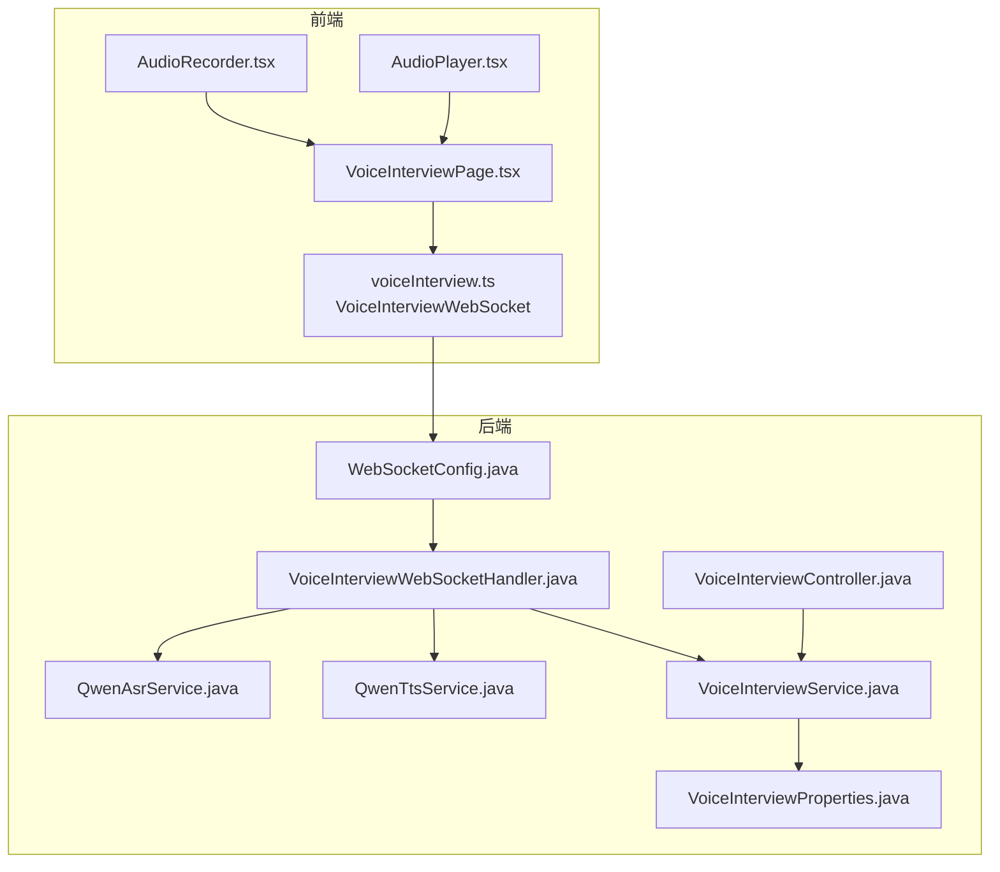
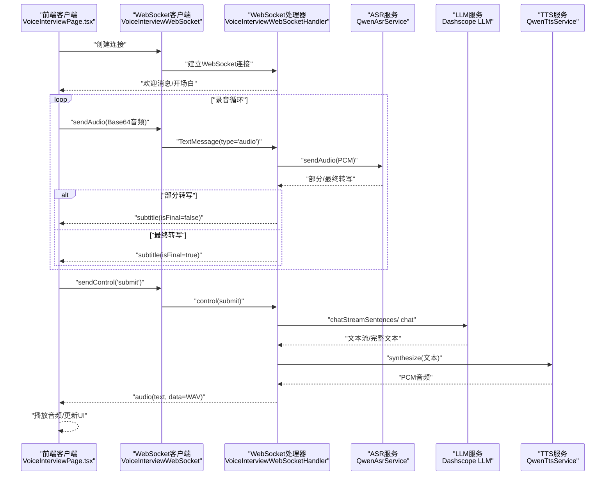
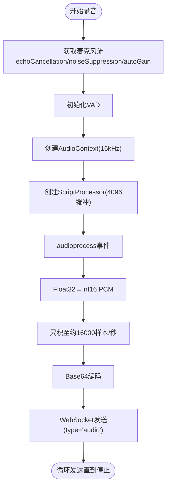
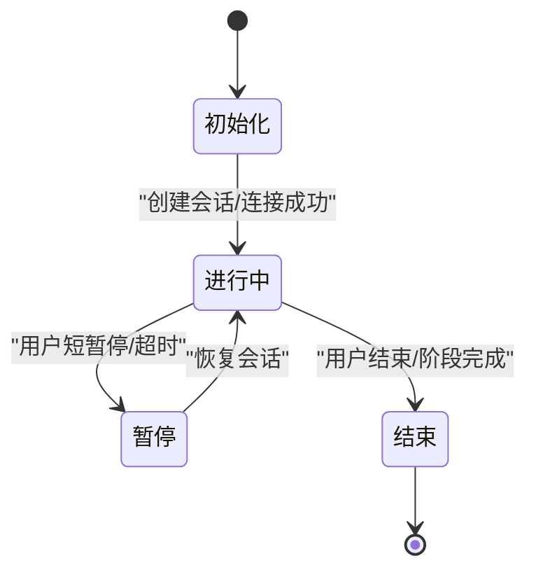
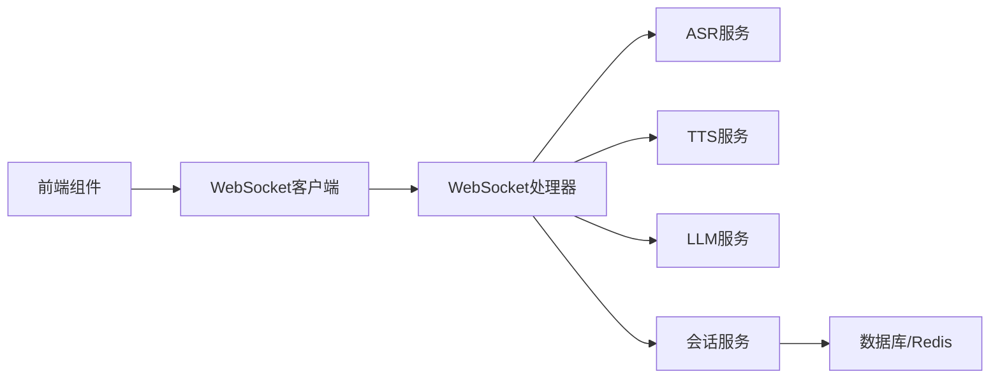

# WebSocket实时通信

<cite>
**本文档引用的文件**
- [WebSocketConfig.java](file://app/src/main/java/interview/guide/modules/voiceinterview/config/WebSocketConfig.java)
- [VoiceInterviewWebSocketHandler.java](file://app/src/main/java/interview/guide/modules/voiceinterview/handler/VoiceInterviewWebSocketHandler.java)
- [WebSocketControlMessage.java](file://app/src/main/java/interview/guide/modules/voiceinterview/dto/WebSocketControlMessage.java)
- [WebSocketSubtitleMessage.java](file://app/src/main/java/interview/guide/modules/voiceinterview/dto/WebSocketSubtitleMessage.java)
- [VoiceInterviewController.java](file://app/src/main/java/interview/guide/modules/voiceinterview/controller/VoiceInterviewController.java)
- [VoiceInterviewService.java](file://app/src/main/java/interview/guide/modules/voiceinterview/service/VoiceInterviewService.java)
- [QwenAsrService.java](file://app/src/main/java/interview/guide/modules/voiceinterview/service/QwenAsrService.java)
- [QwenTtsService.java](file://app/src/main/java/interview/guide/modules/voiceinterview/service/QwenTtsService.java)
- [VoiceInterviewProperties.java](file://app/src/main/java/interview/guide/modules/voiceinterview/config/VoiceInterviewProperties.java)
- [VoiceInterviewPage.tsx](file://frontend/src/pages/VoiceInterviewPage.tsx)
- [voiceInterview.ts](file://frontend/src/api/voiceInterview.ts)
- [AudioRecorder.tsx](file://frontend/src/components/AudioRecorder.tsx)
- [AudioPlayer.tsx](file://frontend/src/components/AudioPlayer.tsx)
</cite>

## 目录
1. [引言](#引言)
2. [项目结构](#项目结构)
3. [核心组件](#核心组件)
4. [架构总览](#架构总览)
5. [详细组件分析](#详细组件分析)
6. [依赖分析](#依赖分析)
7. [性能考虑](#性能考虑)
8. [故障排查指南](#故障排查指南)
9. [结论](#结论)
10. [附录](#附录)

## 引言
本文件面向需要实现或维护WebSocket实时通信系统的工程师与产品人员，系统性阐述该语音面试场景下的WebSocket实时通信架构与实现细节。内容涵盖握手协议、连接参数配置、心跳与保活、消息格式设计、实时音频流传输机制、会话状态管理、前后端实现要点，以及性能优化策略。

## 项目结构
系统采用Spring Boot后端 + React前端的双端架构，WebSocket服务位于后端，前端通过浏览器原生WebSocket与后端交互。核心模块包括：
- 后端WebSocket配置与处理器
- 语音识别（ASR）、语音合成（TTS）、大模型（LLM）服务集成
- 会话生命周期管理与REST接口
- 前端录音、播放、WebSocket客户端封装

图表来源
- [WebSocketConfig.java:1-25](file://app/src/main/java/interview/guide/modules/voiceinterview/config/WebSocketConfig.java#L1-L25)
- [VoiceInterviewWebSocketHandler.java:1-1153](file://app/src/main/java/interview/guide/modules/voiceinterview/handler/VoiceInterviewWebSocketHandler.java#L1-L1153)
- [VoiceInterviewController.java:1-201](file://app/src/main/java/interview/guide/modules/voiceinterview/controller/VoiceInterviewController.java#L1-L201)
- [VoiceInterviewService.java:1-582](file://app/src/main/java/interview/guide/modules/voiceinterview/service/VoiceInterviewService.java#L1-L582)
- [QwenAsrService.java:1-625](file://app/src/main/java/interview/guide/modules/voiceinterview/service/QwenAsrService.java#L1-L625)
- [QwenTtsService.java:1-397](file://app/src/main/java/interview/guide/modules/voiceinterview/service/QwenTtsService.java#L1-L397)
- [VoiceInterviewProperties.java:1-160](file://app/src/main/java/interview/guide/modules/voiceinterview/config/VoiceInterviewProperties.java#L1-L160)
- [voiceInterview.ts:1-383](file://frontend/src/api/voiceInterview.ts#L1-L383)
- [VoiceInterviewPage.tsx:1-734](file://frontend/src/pages/VoiceInterviewPage.tsx#L1-L734)
- [AudioRecorder.tsx:1-257](file://frontend/src/components/AudioRecorder.tsx#L1-L257)
- [AudioPlayer.tsx:1-125](file://frontend/src/components/AudioPlayer.tsx#L1-L125)

章节来源
- [WebSocketConfig.java:1-25](file://app/src/main/java/interview/guide/modules/voiceinterview/config/WebSocketConfig.java#L1-L25)
- [VoiceInterviewWebSocketHandler.java:1-1153](file://app/src/main/java/interview/guide/modules/voiceinterview/handler/VoiceInterviewWebSocketHandler.java#L1-L1153)
- [VoiceInterviewController.java:1-201](file://app/src/main/java/interview/guide/modules/voiceinterview/controller/VoiceInterviewController.java#L1-L201)
- [VoiceInterviewService.java:1-582](file://app/src/main/java/interview/guide/modules/voiceinterview/service/VoiceInterviewService.java#L1-L582)
- [QwenAsrService.java:1-625](file://app/src/main/java/interview/guide/modules/voiceinterview/service/QwenAsrService.java#L1-L625)
- [QwenTtsService.java:1-397](file://app/src/main/java/interview/guide/modules/voiceinterview/service/QwenTtsService.java#L1-L397)
- [VoiceInterviewProperties.java:1-160](file://app/src/main/java/interview/guide/modules/voiceinterview/config/VoiceInterviewProperties.java#L1-L160)
- [voiceInterview.ts:1-383](file://frontend/src/api/voiceInterview.ts#L1-L383)
- [VoiceInterviewPage.tsx:1-734](file://frontend/src/pages/VoiceInterviewPage.tsx#L1-L734)
- [AudioRecorder.tsx:1-257](file://frontend/src/components/AudioRecorder.tsx#L1-L257)
- [AudioPlayer.tsx:1-125](file://frontend/src/components/AudioPlayer.tsx#L1-L125)

## 核心组件
- WebSocket配置与路由：定义WebSocket端点、跨域与拦截器。
- WebSocket处理器：负责连接生命周期、消息解析与分发、会话状态管理、与ASR/TTS/LLM服务编排。
- 控制消息与字幕消息：标准化的消息格式，支撑前端UI与交互。
- 语音服务：ASR（实时转写）、TTS（实时语音合成）、LLM（对话生成）。
- 会话服务：会话创建、暂停/恢复、结束、阶段切换、历史持久化。
- 前端WebSocket客户端：连接、消息收发、错误处理、重连策略、音频分片播放。
- 录音与播放组件：前端音频采集、VAD、PCM打包、Base64传输、分片播放。

章节来源
- [WebSocketConfig.java:18-23](file://app/src/main/java/interview/guide/modules/voiceinterview/config/WebSocketConfig.java#L18-L23)
- [VoiceInterviewWebSocketHandler.java:139-169](file://app/src/main/java/interview/guide/modules/voiceinterview/handler/VoiceInterviewWebSocketHandler.java#L139-L169)
- [WebSocketControlMessage.java:1-19](file://app/src/main/java/interview/guide/modules/voiceinterview/dto/WebSocketControlMessage.java#L1-L19)
- [WebSocketSubtitleMessage.java:1-17](file://app/src/main/java/interview/guide/modules/voiceinterview/dto/WebSocketSubtitleMessage.java#L1-L17)
- [QwenAsrService.java:130-186](file://app/src/main/java/interview/guide/modules/voiceinterview/service/QwenAsrService.java#L130-L186)
- [QwenTtsService.java:107-222](file://app/src/main/java/interview/guide/modules/voiceinterview/service/QwenTtsService.java#L107-L222)
- [VoiceInterviewService.java:63-93](file://app/src/main/java/interview/guide/modules/voiceinterview/service/VoiceInterviewService.java#L63-L93)
- [voiceInterview.ts:222-365](file://frontend/src/api/voiceInterview.ts#L222-L365)
- [AudioRecorder.tsx:69-178](file://frontend/src/components/AudioRecorder.tsx#L69-L178)
- [AudioPlayer.tsx:14-44](file://frontend/src/components/AudioPlayer.tsx#L14-L44)

## 架构总览
系统采用“前端WebSocket客户端 + 后端WebSocket处理器 + 云端语音服务”的三层架构。前端通过浏览器WebSocket直连后端，后端在处理器内完成ASR/TTS/LLM流水线编排，并通过WebSocket向前端推送文本与音频。

图表来源
- [VoiceInterviewPage.tsx:462-468](file://frontend/src/pages/VoiceInterviewPage.tsx#L462-L468)
- [voiceInterview.ts:308-338](file://frontend/src/api/voiceInterview.ts#L308-L338)
- [VoiceInterviewWebSocketHandler.java:299-345](file://app/src/main/java/interview/guide/modules/voiceinterview/handler/VoiceInterviewWebSocketHandler.java#L299-L345)
- [QwenAsrService.java:302-322](file://app/src/main/java/interview/guide/modules/voiceinterview/service/QwenAsrService.java#L302-L322)
- [VoiceInterviewWebSocketHandler.java:556-748](file://app/src/main/java/interview/guide/modules/voiceinterview/handler/VoiceInterviewWebSocketHandler.java#L556-L748)
- [QwenTtsService.java:107-222](file://app/src/main/java/interview/guide/modules/voiceinterview/service/QwenTtsService.java#L107-L222)

## 详细组件分析

### WebSocket连接与握手
- 路由与拦截器：注册WebSocket端点，使用HTTP会话拦截器确保会话一致性，允许跨域（开发环境）。
- 连接建立：处理器在连接建立后提升消息大小限制，装饰并发安全的会话对象，初始化会话状态与活动时间戳。
- 错误处理：连接异常与传输错误记录日志，必要时向前端发送错误消息。

章节来源
- [WebSocketConfig.java:18-23](file://app/src/main/java/interview/guide/modules/voiceinterview/config/WebSocketConfig.java#L18-L23)
- [VoiceInterviewWebSocketHandler.java:139-169](file://app/src/main/java/interview/guide/modules/voiceinterview/handler/VoiceInterviewWebSocketHandler.java#L139-L169)
- [VoiceInterviewWebSocketHandler.java:382-385](file://app/src/main/java/interview/guide/modules/voiceinterview/handler/VoiceInterviewWebSocketHandler.java#L382-L385)

### 消息格式设计
- 控制消息：type="control"，action可为"submit"/"end_interview"/"start_phase"，携带阶段信息。
- 字幕消息：type="subtitle"，text为转写文本，isFinal指示是否为最终片段。
- 音频消息：type="audio"，data为Base64音频，text为对应文本（当为AI语音响应时）。
- 文本消息：type="text"，content为纯文本（当TTS失败时）。
- 音频分片消息：type="audio_chunk"，data为Base64 WAV，index与isLast标识分片序号与是否最后一片。

章节来源
- [WebSocketControlMessage.java:14-18](file://app/src/main/java/interview/guide/modules/voiceinterview/dto/WebSocketControlMessage.java#L14-L18)
- [WebSocketSubtitleMessage.java:12-16](file://app/src/main/java/interview/guide/modules/voiceinterview/dto/WebSocketSubtitleMessage.java#L12-L16)
- [voiceInterview.ts:87-122](file://frontend/src/api/voiceInterview.ts#L87-L122)

### 实时音频流传输机制
- 前端采集：使用Web Audio API与ScriptProcessor，将Float32音频转为Int16 PCM，按约1秒的样本量切片，Base64编码后通过WebSocket发送。
- 云端接收：处理器解码Base64为PCM，调用ASR服务进行实时转写；同时在AI说话期间设置冷却期，避免回声触发识别。
- 分片推送：当启用分块音频时，每句TTS完成后立即推送audio_chunk，前端使用AudioContext队列播放，确保低延迟。

图表来源
- [AudioRecorder.tsx:69-178](file://frontend/src/components/AudioRecorder.tsx#L69-L178)
- [VoiceInterviewWebSocketHandler.java:427-482](file://app/src/main/java/interview/guide/modules/voiceinterview/handler/VoiceInterviewWebSocketHandler.java#L427-L482)
- [VoiceInterviewWebSocketHandler.java:644-696](file://app/src/main/java/interview/guide/modules/voiceinterview/handler/VoiceInterviewWebSocketHandler.java#L644-L696)

章节来源
- [AudioRecorder.tsx:69-178](file://frontend/src/components/AudioRecorder.tsx#L69-L178)
- [VoiceInterviewWebSocketHandler.java:427-482](file://app/src/main/java/interview/guide/modules/voiceinterview/handler/VoiceInterviewWebSocketHandler.java#L427-L482)
- [VoiceInterviewWebSocketHandler.java:644-696](file://app/src/main/java/interview/guide/modules/voiceinterview/handler/VoiceInterviewWebSocketHandler.java#L644-L696)

### 会话状态管理
- 生命周期：创建会话（REST）→连接建立（WebSocket）→录音与转写→提交回答→AI生成与TTS→音频播放→结束或暂停/恢复。
- 暂停与超时：记录最后活动时间，超过阈值触发暂停；支持短暂停（5分钟）与长暂停（结束）。
- 重连机制：前端WebSocket在非正常关闭时按次数与延迟重连；后端ASR连接断开时自动重启并重试发送。
- 历史与阶段：会话实体包含阶段、状态、时长等字段；阶段切换依据配置的时间与问题数规则。

图表来源
- [VoiceInterviewService.java:101-124](file://app/src/main/java/interview/guide/modules/voiceinterview/service/VoiceInterviewService.java#L101-L124)
- [VoiceInterviewService.java:277-297](file://app/src/main/java/interview/guide/modules/voiceinterview/service/VoiceInterviewService.java#L277-L297)
- [VoiceInterviewService.java:306-329](file://app/src/main/java/interview/guide/modules/voiceinterview/service/VoiceInterviewService.java#L306-L329)
- [VoiceInterviewWebSocketHandler.java:360-380](file://app/src/main/java/interview/guide/modules/voiceinterview/handler/VoiceInterviewWebSocketHandler.java#L360-L380)

章节来源
- [VoiceInterviewService.java:101-124](file://app/src/main/java/interview/guide/modules/voiceinterview/service/VoiceInterviewService.java#L101-L124)
- [VoiceInterviewService.java:277-297](file://app/src/main/java/interview/guide/modules/voiceinterview/service/VoiceInterviewService.java#L277-L297)
- [VoiceInterviewService.java:306-329](file://app/src/main/java/interview/guide/modules/voiceinterview/service/VoiceInterviewService.java#L306-L329)
- [VoiceInterviewWebSocketHandler.java:360-380](file://app/src/main/java/interview/guide/modules/voiceinterview/handler/VoiceInterviewWebSocketHandler.java#L360-L380)

### 前端WebSocket客户端实现
- 连接与事件：封装WebSocket实例，处理onopen/onmessage/onclose/onerror，解析消息类型并分发到UI回调。
- 发送方法：sendAudio发送录音Base64；sendControl发送控制消息（如submit）。
- 重连策略：非正常关闭时按次数与指数退避重连，避免风暴。
- 音频播放：支持完整音频与分片音频两种模式；分片模式使用AudioContext队列播放，确保连续性。

章节来源
- [voiceInterview.ts:222-365](file://frontend/src/api/voiceInterview.ts#L222-L365)
- [VoiceInterviewPage.tsx:357-366](file://frontend/src/pages/VoiceInterviewPage.tsx#L357-L366)
- [VoiceInterviewPage.tsx:352-354](file://frontend/src/pages/VoiceInterviewPage.tsx#L352-L354)

### 音频录制与播放的实时处理
- 录制：VAD检测说话开始/结束；音频流经AudioContext与ScriptProcessor，按1秒切片，PCM→Base64，循环发送。
- 播放：完整音频模式使用隐藏audio元素自动播放；分片模式使用AudioContext队列逐片解码播放，配合节流与清空逻辑避免积压。

章节来源
- [AudioRecorder.tsx:69-178](file://frontend/src/components/AudioRecorder.tsx#L69-L178)
- [VoiceInterviewPage.tsx:106-187](file://frontend/src/pages/VoiceInterviewPage.tsx#L106-L187)
- [AudioPlayer.tsx:14-44](file://frontend/src/components/AudioPlayer.tsx#L14-L44)

## 依赖分析
- 后端依赖：Spring WebSocket、Jackson、Micrometer（指标）、阿里云DashScope SDK。
- 前端依赖：React Hooks、Lucide图标、framer-motion动画、Web Audio API、VAD库（通过script加载）。
- 组件耦合：处理器与ASR/TTS/LLM服务松耦合，通过接口抽象；前端通过统一消息协议与后端交互。

图表来源
- [VoiceInterviewWebSocketHandler.java:58-64](file://app/src/main/java/interview/guide/modules/voiceinterview/handler/VoiceInterviewWebSocketHandler.java#L58-L64)
- [QwenAsrService.java:48-84](file://app/src/main/java/interview/guide/modules/voiceinterview/service/QwenAsrService.java#L48-L84)
- [QwenTtsService.java:43-76](file://app/src/main/java/interview/guide/modules/voiceinterview/service/QwenTtsService.java#L43-L76)
- [VoiceInterviewService.java:41-50](file://app/src/main/java/interview/guide/modules/voiceinterview/service/VoiceInterviewService.java#L41-L50)

章节来源
- [VoiceInterviewWebSocketHandler.java:58-64](file://app/src/main/java/interview/guide/modules/voiceinterview/handler/VoiceInterviewWebSocketHandler.java#L58-L64)
- [QwenAsrService.java:48-84](file://app/src/main/java/interview/guide/modules/voiceinterview/service/QwenAsrService.java#L48-L84)
- [QwenTtsService.java:43-76](file://app/src/main/java/interview/guide/modules/voiceinterview/service/QwenTtsService.java#L43-L76)
- [VoiceInterviewService.java:41-50](file://app/src/main/java/interview/guide/modules/voiceinterview/service/VoiceInterviewService.java#L41-L50)

## 性能考虑
- 带宽与延迟
  - 分片推送：启用分块音频可显著降低端到端延迟，适合实时性强的场景。
  - 文本流式：LLM开启流式输出，边生成边下发文本，减少首字延迟。
- 缓冲与背压
  - 后端对WebSocket发送设置时间限制与缓冲上限，避免内存压力。
  - 前端分片播放队列与清空检查，防止积压导致卡顿。
- 并发与限流
  - 单会话并发TTS上限，避免上游服务限流。
  - 速率限制配置项预留，便于扩展。
- 音频质量与格式
  - ASR/TTS采样率与格式配置集中管理，确保前后端一致。
- 重连与健壮性
  - 前端指数退避重连；后端ASR连接断线自动重启与重试。

章节来源
- [VoiceInterviewProperties.java:34-51](file://app/src/main/java/interview/guide/modules/voiceinterview/config/VoiceInterviewProperties.java#L34-L51)
- [VoiceInterviewWebSocketHandler.java:85-86](file://app/src/main/java/interview/guide/modules/voiceinterview/handler/VoiceInterviewWebSocketHandler.java#L85-L86)
- [voiceInterview.ts:226-228](file://frontend/src/api/voiceInterview.ts#L226-L228)
- [QwenAsrService.java:152-186](file://app/src/main/java/interview/guide/modules/voiceinterview/service/QwenAsrService.java#L152-L186)

## 故障排查指南
- 连接失败
  - 检查WebSocket端点路径与跨域配置；确认后端日志无初始化异常。
- ASR/TTS失败
  - 查看错误消息中的具体错误类型（如认证、超时、通道不活跃），按提示修正密钥或网络。
- 音频无声或卡顿
  - 前端确认麦克风权限与VAD加载；检查分片播放队列是否清空；后端检查发送缓冲与时间限制。
- 会话状态异常
  - 检查暂停/恢复逻辑与阶段切换规则；确认数据库/Redis缓存一致性。

章节来源
- [VoiceInterviewWebSocketHandler.java:382-385](file://app/src/main/java/interview/guide/modules/voiceinterview/handler/VoiceInterviewWebSocketHandler.java#L382-L385)
- [QwenAsrService.java:449-460](file://app/src/main/java/interview/guide/modules/voiceinterview/service/QwenAsrService.java#L449-L460)
- [VoiceInterviewWebSocketHandler.java:750-771](file://app/src/main/java/interview/guide/modules/voiceinterview/handler/VoiceInterviewWebSocketHandler.java#L750-L771)
- [VoiceInterviewService.java:277-297](file://app/src/main/java/interview/guide/modules/voiceinterview/service/VoiceInterviewService.java#L277-L297)

## 结论
该系统通过清晰的消息协议、严格的会话状态管理与前后端协同的音频处理链路，实现了低延迟、高可靠的WebSocket实时语音面试体验。建议在生产环境中完善CORS与鉴权、细化速率限制策略，并持续监控关键指标以保障稳定性与用户体验。

## 附录
- 配置项概览
  - 会话阶段时长与问题数规则
  - LLM流式输出与分块音频开关
  - ASR/TTS采样率与格式
  - 并发TTS上限与流式推送节流

章节来源
- [VoiceInterviewProperties.java:53-76](file://app/src/main/java/interview/guide/modules/voiceinterview/config/VoiceInterviewProperties.java#L53-L76)
- [VoiceInterviewProperties.java:117-148](file://app/src/main/java/interview/guide/modules/voiceinterview/config/VoiceInterviewProperties.java#L117-L148)