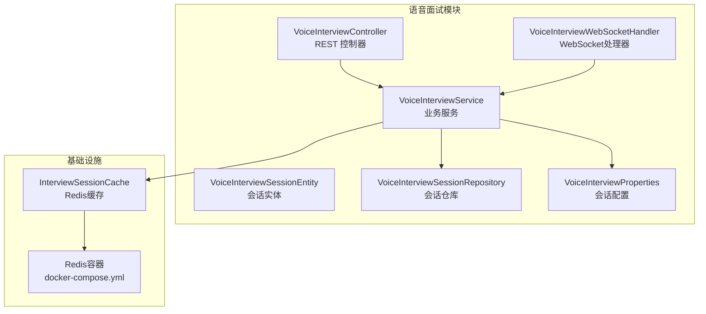
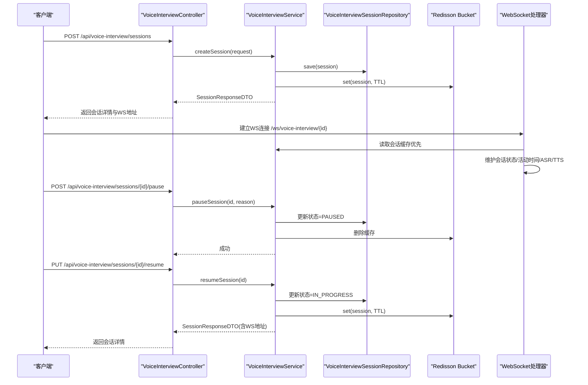
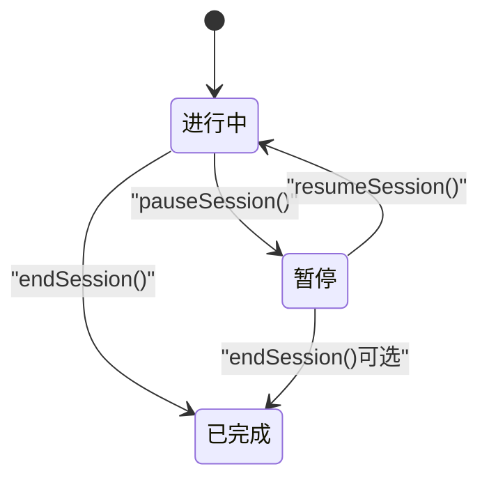
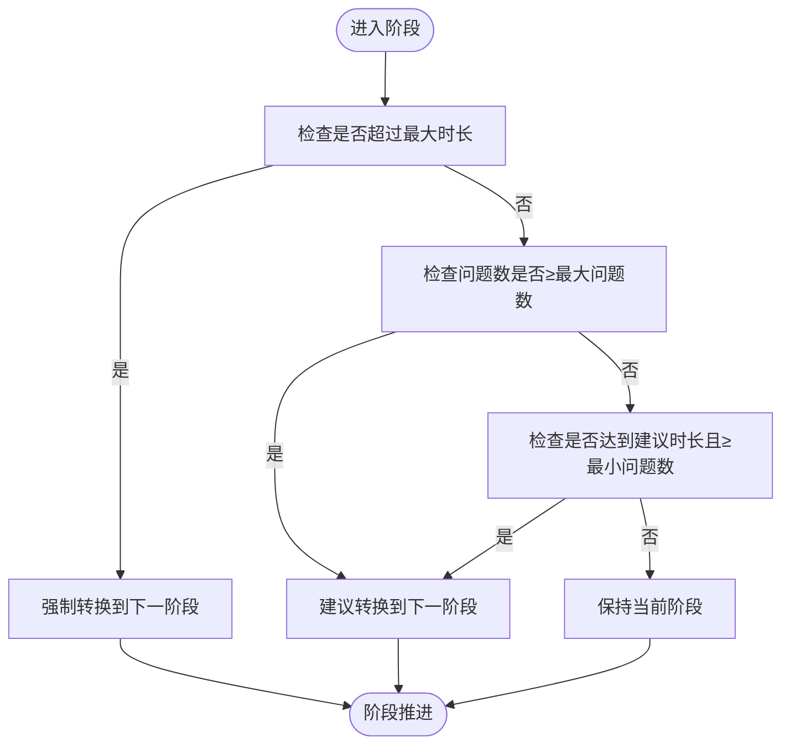
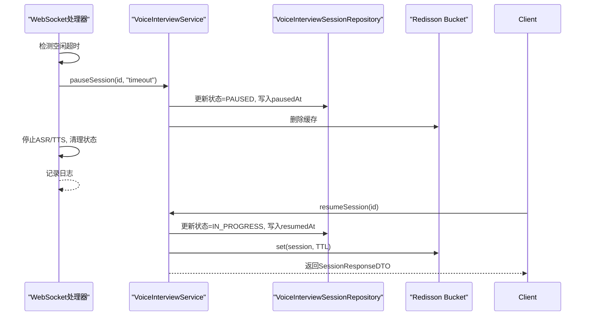
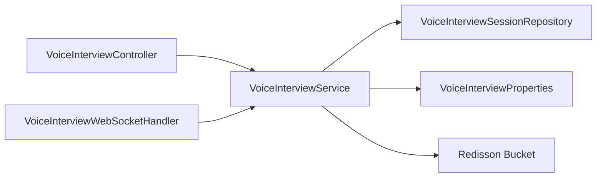

# 会话管理与控制

<cite>
**本文引用的文件**
- [VoiceInterviewService.java](file://app/src/main/java/interview/guide/modules/voiceinterview/service/VoiceInterviewService.java)
- [VoiceInterviewSessionEntity.java](file://app/src/main/java/interview/guide/modules/voiceinterview/model/VoiceInterviewSessionEntity.java)
- [VoiceInterviewSessionStatus.java](file://app/src/main/java/interview/guide/modules/voiceinterview/model/VoiceInterviewSessionStatus.java)
- [VoiceInterviewSessionRepository.java](file://app/src/main/java/interview/guide/modules/voiceinterview/repository/VoiceInterviewSessionRepository.java)
- [VoiceInterviewProperties.java](file://app/src/main/java/interview/guide/modules/voiceinterview/config/VoiceInterviewProperties.java)
- [VoiceInterviewController.java](file://app/src/main/java/interview/guide/modules/voiceinterview/controller/VoiceInterviewController.java)
- [VoiceInterviewWebSocketHandler.java](file://app/src/main/java/interview/guide/modules/voiceinterview/handler/VoiceInterviewWebSocketHandler.java)
- [InterviewSessionCache.java](file://app/src/main/java/interview/guide/infrastructure/redis/InterviewSessionCache.java)
- [docker-compose.yml](file://docker-compose.yml)
- [VoiceInterviewServiceTest.java](file://app/src/test/java/interview/guide/modules/voiceinterview/service/VoiceInterviewServiceTest.java)
- [VoiceInterviewServicePauseTest.java](file://app/src/test/java/interview/guide/modules/voiceinterview/service/VoiceInterviewServicePauseTest.java)
- [VoiceInterviewIntegrationTest.java](file://app/src/test/java/interview/guide/modules/voiceinterview/integration/VoiceInterviewIntegrationTest.java)
</cite>

## 目录
1. [简介](#简介)
2. [项目结构](#项目结构)
3. [核心组件](#核心组件)
4. [架构总览](#架构总览)
5. [详细组件分析](#详细组件分析)
6. [依赖分析](#依赖分析)
7. [性能考虑](#性能考虑)
8. [故障排查指南](#故障排查指南)
9. [结论](#结论)
10. [附录](#附录)

## 简介
本文件面向“会话管理与控制”主题，围绕语音面试会话的生命周期、状态模型、暂停与恢复机制、阶段转换、超时处理、数据持久化、监控统计与异常处理等方面，提供系统化、可操作的技术文档。文档以代码为依据，辅以可视化图示，帮助开发者与产品人员快速理解并扩展该能力。

## 项目结构
与会话管理直接相关的后端模块位于 app/src/main/java/interview/guide/modules/voiceinterview 下，包含服务、模型、仓库、配置、控制器与WebSocket处理器；缓存与会话相关的能力位于 app/src/main/java/interview/guide/infrastructure/redis 下；测试覆盖了创建、结束、暂停/恢复、阶段转换、持久化等关键路径。

图表来源
- [VoiceInterviewController.java:35-201](file://app/src/main/java/interview/guide/modules/voiceinterview/controller/VoiceInterviewController.java#L35-L201)
- [VoiceInterviewService.java:41-582](file://app/src/main/java/interview/guide/modules/voiceinterview/service/VoiceInterviewService.java#L41-L582)
- [VoiceInterviewSessionEntity.java:13-122](file://app/src/main/java/interview/guide/modules/voiceinterview/model/VoiceInterviewSessionEntity.java#L13-L122)
- [VoiceInterviewSessionRepository.java:13-46](file://app/src/main/java/interview/guide/modules/voiceinterview/repository/VoiceInterviewSessionRepository.java#L13-L46)
- [VoiceInterviewProperties.java:14-160](file://app/src/main/java/interview/guide/modules/voiceinterview/config/VoiceInterviewProperties.java#L14-L160)
- [VoiceInterviewWebSocketHandler.java:933-962](file://app/src/main/java/interview/guide/modules/voiceinterview/handler/VoiceInterviewWebSocketHandler.java#L933-L962)
- [InterviewSessionCache.java:24-244](file://app/src/main/java/interview/guide/infrastructure/redis/InterviewSessionCache.java#L24-L244)
- [docker-compose.yml:37-58](file://docker-compose.yml#L37-L58)

章节来源
- [VoiceInterviewController.java:35-201](file://app/src/main/java/interview/guide/modules/voiceinterview/controller/VoiceInterviewController.java#L35-L201)
- [VoiceInterviewService.java:41-582](file://app/src/main/java/interview/guide/modules/voiceinterview/service/VoiceInterviewService.java#L41-L582)
- [VoiceInterviewSessionEntity.java:13-122](file://app/src/main/java/interview/guide/modules/voiceinterview/model/VoiceInterviewSessionEntity.java#L13-L122)
- [VoiceInterviewSessionRepository.java:13-46](file://app/src/main/java/interview/guide/modules/voiceinterview/repository/VoiceInterviewSessionRepository.java#L13-L46)
- [VoiceInterviewProperties.java:14-160](file://app/src/main/java/interview/guide/modules/voiceinterview/config/VoiceInterviewProperties.java#L14-L160)
- [VoiceInterviewWebSocketHandler.java:933-962](file://app/src/main/java/interview/guide/modules/voiceinterview/handler/VoiceInterviewWebSocketHandler.java#L933-L962)
- [InterviewSessionCache.java:24-244](file://app/src/main/java/interview/guide/infrastructure/redis/InterviewSessionCache.java#L24-L244)
- [docker-compose.yml:37-58](file://docker-compose.yml#L37-L58)

## 核心组件
- 会话实体与状态
  - 会话实体包含角色类型、技能ID、难度、启用阶段开关、计划时长、实际时长、起止时间、暂停/恢复时间戳、评估状态与错误信息等字段，并定义阶段枚举与状态枚举。
- 业务服务
  - 提供会话创建、结束、阶段切换、消息持久化、暂停/恢复、评估状态更新、Redis缓存读写等能力。
- 控制器
  - 对外暴露REST接口，统一返回封装结果。
- WebSocket处理器
  - 维护会话状态、活动时间、ASR/TTS连接、超时暂停与清理。
- Redis缓存
  - 面试会话缓存（非语音面试）与语音面试会话缓存（Redisson Bucket），用于热点读取与状态同步。
- 配置
  - 会话阶段时长/问题数阈值、音频/ASR/TTS参数、限流策略等。

章节来源
- [VoiceInterviewSessionEntity.java:13-122](file://app/src/main/java/interview/guide/modules/voiceinterview/model/VoiceInterviewSessionEntity.java#L13-L122)
- [VoiceInterviewSessionStatus.java:7-27](file://app/src/main/java/interview/guide/modules/voiceinterview/model/VoiceInterviewSessionStatus.java#L7-L27)
- [VoiceInterviewService.java:63-124](file://app/src/main/java/interview/guide/modules/voiceinterview/service/VoiceInterviewService.java#L63-L124)
- [VoiceInterviewController.java:46-103](file://app/src/main/java/interview/guide/modules/voiceinterview/controller/VoiceInterviewController.java#L46-L103)
- [VoiceInterviewWebSocketHandler.java:933-962](file://app/src/main/java/interview/guide/modules/voiceinterview/handler/VoiceInterviewWebSocketHandler.java#L933-L962)
- [InterviewSessionCache.java:24-244](file://app/src/main/java/interview/guide/infrastructure/redis/InterviewSessionCache.java#L24-L244)
- [VoiceInterviewProperties.java:14-160](file://app/src/main/java/interview/guide/modules/voiceinterview/config/VoiceInterviewProperties.java#L14-L160)

## 架构总览
语音面试会话管理采用“控制器-服务-仓库-缓存/外部组件”的分层架构。服务层负责业务规则与状态转换，仓库负责持久化，缓存用于加速读取与跨进程状态同步，WebSocket处理器负责实时交互与超时控制。

图表来源
- [VoiceInterviewController.java:46-103](file://app/src/main/java/interview/guide/modules/voiceinterview/controller/VoiceInterviewController.java#L46-L103)
- [VoiceInterviewService.java:63-124](file://app/src/main/java/interview/guide/modules/voiceinterview/service/VoiceInterviewService.java#L63-L124)
- [VoiceInterviewWebSocketHandler.java:933-962](file://app/src/main/java/interview/guide/modules/voiceinterview/handler/VoiceInterviewWebSocketHandler.java#L933-L962)

## 详细组件分析

### 会话生命周期管理
- 创建
  - 服务根据请求构建会话实体，设置初始阶段（由启用开关决定），保存至数据库并写入Redis缓存，返回包含WebSocket地址的响应。
- 结束
  - 计算实际时长，标记阶段为完成，状态置为完成，写入结束时间与评估状态为待处理，并触发异步评估任务。
- 暂停/恢复
  - 暂停：仅在进行中状态允许，更新状态为暂停并记录暂停时间；缓存失效。
  - 恢复：仅在暂停状态允许，更新状态为进行中并记录恢复时间；重新写入缓存。
- 阶段转换
  - 由配置的阶段时长/问题数阈值与启用开关共同决定；提供“下一阶段”推导与“是否建议转换”的判断逻辑。

图表来源
- [VoiceInterviewSessionStatus.java:7-27](file://app/src/main/java/interview/guide/modules/voiceinterview/model/VoiceInterviewSessionStatus.java#L7-L27)
- [VoiceInterviewService.java:277-329](file://app/src/main/java/interview/guide/modules/voiceinterview/service/VoiceInterviewService.java#L277-L329)
- [VoiceInterviewService.java:101-124](file://app/src/main/java/interview/guide/modules/voiceinterview/service/VoiceInterviewService.java#L101-L124)

章节来源
- [VoiceInterviewService.java:63-124](file://app/src/main/java/interview/guide/modules/voiceinterview/service/VoiceInterviewService.java#L63-L124)
- [VoiceInterviewService.java:277-329](file://app/src/main/java/interview/guide/modules/voiceinterview/service/VoiceInterviewService.java#L277-L329)
- [VoiceInterviewService.java:393-428](file://app/src/main/java/interview/guide/modules/voiceinterview/service/VoiceInterviewService.java#L393-L428)
- [VoiceInterviewService.java:437-455](file://app/src/main/java/interview/guide/modules/voiceinterview/service/VoiceInterviewService.java#L437-L455)

### 会话状态模型与转换规则
- 状态枚举
  - 进行中、暂停、完成、失败。
- 阶段枚举
  - 引言、技术、项目、HR、完成。
- 转换规则
  - 由启用开关决定下一阶段；当无更多启用阶段时，进入完成。
  - 建议转换的条件：达到最大时长、达到最大问题数、达到建议时长且满足最小问题数。
  - 强制转换：达到最大时长时强制推进。

图表来源
- [VoiceInterviewService.java:393-428](file://app/src/main/java/interview/guide/modules/voiceinterview/service/VoiceInterviewService.java#L393-L428)
- [VoiceInterviewProperties.java:54-76](file://app/src/main/java/interview/guide/modules/voiceinterview/config/VoiceInterviewProperties.java#L54-L76)

章节来源
- [VoiceInterviewSessionStatus.java:7-27](file://app/src/main/java/interview/guide/modules/voiceinterview/model/VoiceInterviewSessionStatus.java#L7-L27)
- [VoiceInterviewSessionEntity.java:118-121](file://app/src/main/java/interview/guide/modules/voiceinterview/model/VoiceInterviewSessionEntity.java#L118-L121)
- [VoiceInterviewService.java:437-455](file://app/src/main/java/interview/guide/modules/voiceinterview/service/VoiceInterviewService.java#L437-L455)
- [VoiceInterviewService.java:393-428](file://app/src/main/java/interview/guide/modules/voiceinterview/service/VoiceInterviewService.java#L393-L428)

### 暂停与恢复机制
- 触发条件
  - 用户主动暂停或空闲超时触发。
- 状态保存
  - 暂停时写入暂停时间戳，状态置为暂停；缓存失效。
  - 恢复时写入恢复时间戳，状态置为进行中；重新写入缓存。
- 数据一致性
  - 暂停/恢复均通过事务更新数据库与缓存，确保状态一致。
- 资源清理
  - WebSocket处理器在超时暂停时停止ASR会话并清理会话状态与活动时间，避免资源泄漏。

图表来源
- [VoiceInterviewService.java:277-329](file://app/src/main/java/interview/guide/modules/voiceinterview/service/VoiceInterviewService.java#L277-L329)
- [VoiceInterviewWebSocketHandler.java:933-962](file://app/src/main/java/interview/guide/modules/voiceinterview/handler/VoiceInterviewWebSocketHandler.java#L933-L962)

章节来源
- [VoiceInterviewService.java:277-329](file://app/src/main/java/interview/guide/modules/voiceinterview/service/VoiceInterviewService.java#L277-L329)
- [VoiceInterviewWebSocketHandler.java:933-962](file://app/src/main/java/interview/guide/modules/voiceinterview/handler/VoiceInterviewWebSocketHandler.java#L933-L962)

### 手动提交与自动提交
- 自动提交
  - 结束会话时自动触发异步评估任务，服务层将评估状态置为待处理并通过消息队列发送任务。
- 手动提交
  - 控制器提供显式触发评估的接口，前端轮询评估状态，服务层根据当前状态决定是否重新触发或返回现有状态。
- 状态更新
  - 评估状态通过共享方法更新，支持PENDING/PROCESSING/COMPLETED/FAILED。

章节来源
- [VoiceInterviewService.java:101-124](file://app/src/main/java/interview/guide/modules/voiceinterview/service/VoiceInterviewService.java#L101-L124)
- [VoiceInterviewService.java:517-529](file://app/src/main/java/interview/guide/modules/voiceinterview/service/VoiceInterviewService.java#L517-L529)
- [VoiceInterviewController.java:167-199](file://app/src/main/java/interview/guide/modules/voiceinterview/controller/VoiceInterviewController.java#L167-L199)

### 会话超时处理机制
- 空闲超时检测
  - WebSocket处理器维护每个会话的最后活动时间，超时后自动暂停并清理资源。
- 超时自动结束
  - 若需要，可在暂停后进一步结束会话，计算实际时长并标记完成。
- 超时通知
  - 日志记录超时暂停事件，便于监控与排障。

章节来源
- [VoiceInterviewWebSocketHandler.java:933-962](file://app/src/main/java/interview/guide/modules/voiceinterview/handler/VoiceInterviewWebSocketHandler.java#L933-L962)

### 会话数据持久化策略
- 数据库设计
  - 会话实体包含主键、用户ID、角色类型、技能ID、难度、启用阶段开关、计划/实际时长、起止时间、暂停/恢复时间、评估状态与错误信息等字段。
  - 仓库提供按用户、状态、更新时间等维度的查询接口。
- 缓存策略
  - 语音面试会话使用Redisson Bucket缓存，键带前缀，TTL小时级；缓存命中优先于数据库。
  - 面试会话缓存（非语音）使用自定义序列化对象，支持问题列表、进度索引与状态变更。
- 备份与恢复
  - 数据库层面具备事务与索引；缓存作为热数据加速，重启后可从数据库重建。

章节来源
- [VoiceInterviewSessionEntity.java:13-122](file://app/src/main/java/interview/guide/modules/voiceinterview/model/VoiceInterviewSessionEntity.java#L13-L122)
- [VoiceInterviewSessionRepository.java:13-46](file://app/src/main/java/interview/guide/modules/voiceinterview/repository/VoiceInterviewSessionRepository.java#L13-L46)
- [VoiceInterviewService.java:543-558](file://app/src/main/java/interview/guide/modules/voiceinterview/service/VoiceInterviewService.java#L543-L558)
- [InterviewSessionCache.java:89-105](file://app/src/main/java/interview/guide/infrastructure/redis/InterviewSessionCache.java#L89-L105)
- [InterviewSessionCache.java:123-136](file://app/src/main/java/interview/guide/infrastructure/redis/InterviewSessionCache.java#L123-L136)

### 会话监控与统计
- 会话列表与元数据
  - 支持按用户与状态筛选，返回会话ID、角色类型、状态、当前阶段、创建/更新时间、消息数、评估状态与错误等。
- 评估状态轮询
  - 控制器提供评估状态查询接口，前端轮询直至完成。
- 统计指标
  - 可基于会话实体中的时长、状态、评估结果等字段进行统计分析（例如平均时长、完成率、失败率等）。

章节来源
- [VoiceInterviewController.java:108-127](file://app/src/main/java/interview/guide/modules/voiceinterview/controller/VoiceInterviewController.java#L108-L127)
- [VoiceInterviewController.java:137-157](file://app/src/main/java/interview/guide/modules/voiceinterview/controller/VoiceInterviewController.java#L137-L157)
- [VoiceInterviewService.java:339-365](file://app/src/main/java/interview/guide/modules/voiceinterview/service/VoiceInterviewService.java#L339-L365)

### 异常处理与错误恢复
- 业务异常
  - 非法状态（如非进行中暂停、非暂停恢复）抛出业务异常并拒绝操作。
- 输入校验
  - 控制器对请求体进行校验，非法ID格式在服务层捕获并记录日志。
- 错误恢复
  - 评估状态更新失败时记录错误日志；前端可通过轮询发现并重试触发评估。
- 资源清理
  - WebSocket处理器在异常或超时场景清理ASR/TTS连接与会话状态，避免资源泄漏。

章节来源
- [VoiceInterviewService.java:284-288](file://app/src/main/java/interview/guide/modules/voiceinterview/service/VoiceInterviewService.java#L284-L288)
- [VoiceInterviewService.java:313-317](file://app/src/main/java/interview/guide/modules/voiceinterview/service/VoiceInterviewService.java#L313-L317)
- [VoiceInterviewWebSocketHandler.java:933-962](file://app/src/main/java/interview/guide/modules/voiceinterview/handler/VoiceInterviewWebSocketHandler.java#L933-L962)

## 依赖分析
- 控制器依赖服务，服务依赖仓库、配置与缓存；WebSocket处理器与服务协作维护会话状态。
- Redis作为缓存与消息通道，支撑高并发下的会话读取与异步评估。

图表来源
- [VoiceInterviewController.java:41-43](file://app/src/main/java/interview/guide/modules/voiceinterview/controller/VoiceInterviewController.java#L41-L43)
- [VoiceInterviewService.java:46-50](file://app/src/main/java/interview/guide/modules/voiceinterview/service/VoiceInterviewService.java#L46-L50)
- [VoiceInterviewWebSocketHandler.java:933-962](file://app/src/main/java/interview/guide/modules/voiceinterview/handler/VoiceInterviewWebSocketHandler.java#L933-L962)

章节来源
- [VoiceInterviewController.java:41-43](file://app/src/main/java/interview/guide/modules/voiceinterview/controller/VoiceInterviewController.java#L41-L43)
- [VoiceInterviewService.java:46-50](file://app/src/main/java/interview/guide/modules/voiceinterview/service/VoiceInterviewService.java#L46-L50)
- [VoiceInterviewWebSocketHandler.java:933-962](file://app/src/main/java/interview/guide/modules/voiceinterview/handler/VoiceInterviewWebSocketHandler.java#L933-L962)

## 性能考虑
- 缓存命中优先：会话读取优先从Redis缓存获取，显著降低数据库压力。
- 批量与异步：评估通过消息队列异步执行，避免阻塞主线程。
- 连接与资源管理：WebSocket处理器在超时或异常时及时关闭ASR/TTS连接，防止资源泄漏。
- 索引与查询：会话实体与仓库接口针对常用查询（用户、状态、时间）进行了索引与排序优化。

章节来源
- [VoiceInterviewService.java:144-161](file://app/src/main/java/interview/guide/modules/voiceinterview/service/VoiceInterviewService.java#L144-L161)
- [VoiceInterviewWebSocketHandler.java:933-962](file://app/src/main/java/interview/guide/modules/voiceinterview/handler/VoiceInterviewWebSocketHandler.java#L933-L962)
- [VoiceInterviewSessionEntity.java:15-19](file://app/src/main/java/interview/guide/modules/voiceinterview/model/VoiceInterviewSessionEntity.java#L15-L19)
- [VoiceInterviewSessionRepository.java:22-44](file://app/src/main/java/interview/guide/modules/voiceinterview/repository/VoiceInterviewSessionRepository.java#L22-L44)

## 故障排查指南
- 无法暂停/恢复
  - 检查当前状态是否为进行中（暂停）或暂停（恢复）；确认缓存是否被正确失效/重建。
- 会话不存在
  - 校验会话ID格式与有效性；查看日志中解析失败提示。
- 评估未完成
  - 前端轮询评估状态；若长时间为PENDING/PROCESSING，检查消息队列与评估服务健康状况。
- 超时未触发
  - 检查WebSocket处理器的空闲检测逻辑与活动时间更新；确认Redis可用性。

章节来源
- [VoiceInterviewServicePauseTest.java:78-93](file://app/src/test/java/interview/guide/modules/voiceinterview/service/VoiceInterviewServicePauseTest.java#L78-L93)
- [VoiceInterviewServicePauseTest.java:121-136](file://app/src/test/java/interview/guide/modules/voiceinterview/service/VoiceInterviewServicePauseTest.java#L121-L136)
- [VoiceInterviewServiceTest.java:240-261](file://app/src/test/java/interview/guide/modules/voiceinterview/service/VoiceInterviewServiceTest.java#L240-L261)
- [VoiceInterviewWebSocketHandler.java:933-962](file://app/src/main/java/interview/guide/modules/voiceinterview/handler/VoiceInterviewWebSocketHandler.java#L933-L962)

## 结论
该会话管理系统以清晰的状态模型与严格的转换规则为基础，结合Redis缓存与WebSocket处理器，实现了高可用、可观测的语音面试会话生命周期管理。通过自动与手动提交相结合的评估机制、完善的异常处理与资源清理策略，系统在保证用户体验的同时兼顾了稳定性与可扩展性。

## 附录
- 测试覆盖要点
  - 会话创建、结束、暂停/恢复、阶段转换判断、消息持久化、缓存读写等关键路径均有单元与集成测试保障。
- Redis部署
  - 通过docker-compose启动Redis容器，提供缓存与消息通道能力。

章节来源
- [VoiceInterviewServiceTest.java:94-196](file://app/src/test/java/interview/guide/modules/voiceinterview/service/VoiceInterviewServiceTest.java#L94-L196)
- [VoiceInterviewServiceTest.java:264-349](file://app/src/test/java/interview/guide/modules/voiceinterview/service/VoiceInterviewServiceTest.java#L264-L349)
- [VoiceInterviewServiceTest.java:351-462](file://app/src/test/java/interview/guide/modules/voiceinterview/service/VoiceInterviewServiceTest.java#L351-L462)
- [VoiceInterviewIntegrationTest.java:134-156](file://app/src/test/java/interview/guide/modules/voiceinterview/integration/VoiceInterviewIntegrationTest.java#L134-L156)
- [docker-compose.yml:47-58](file://docker-compose.yml#L47-L58)