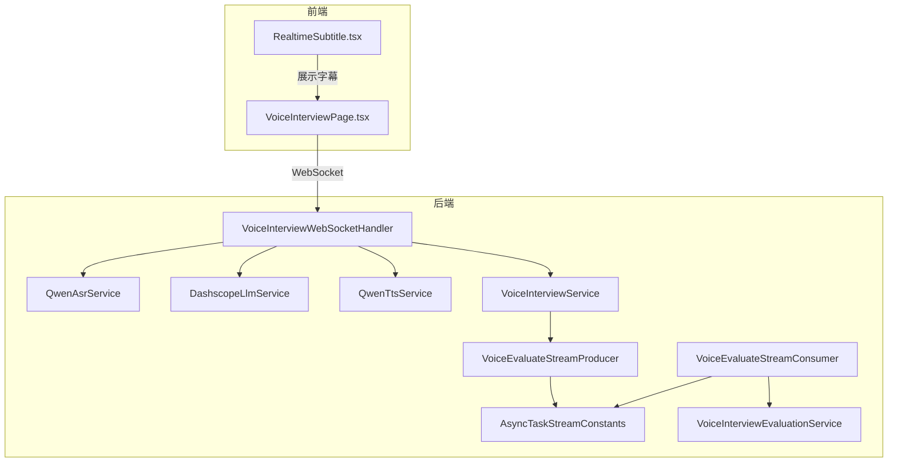
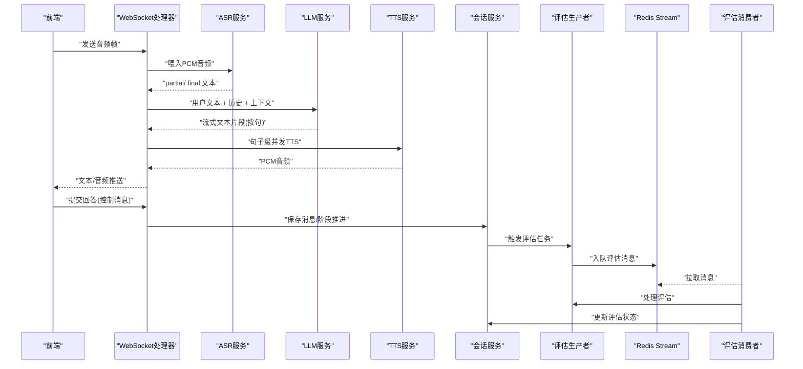
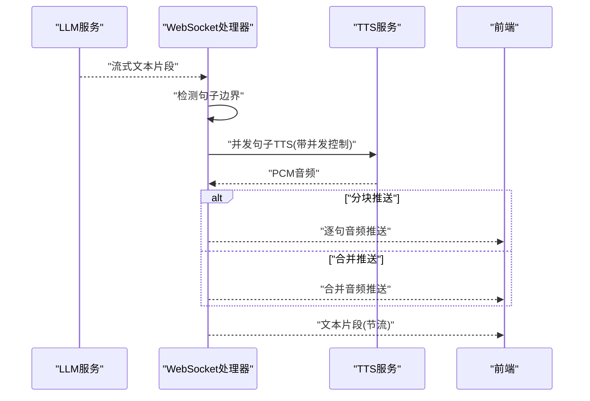
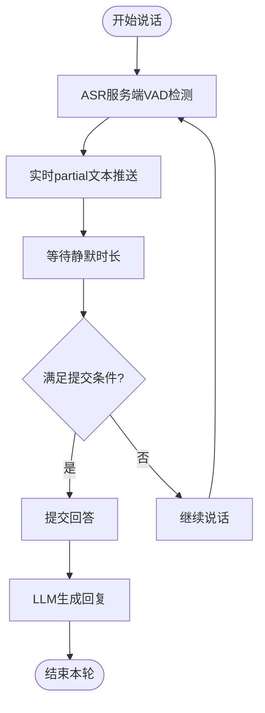
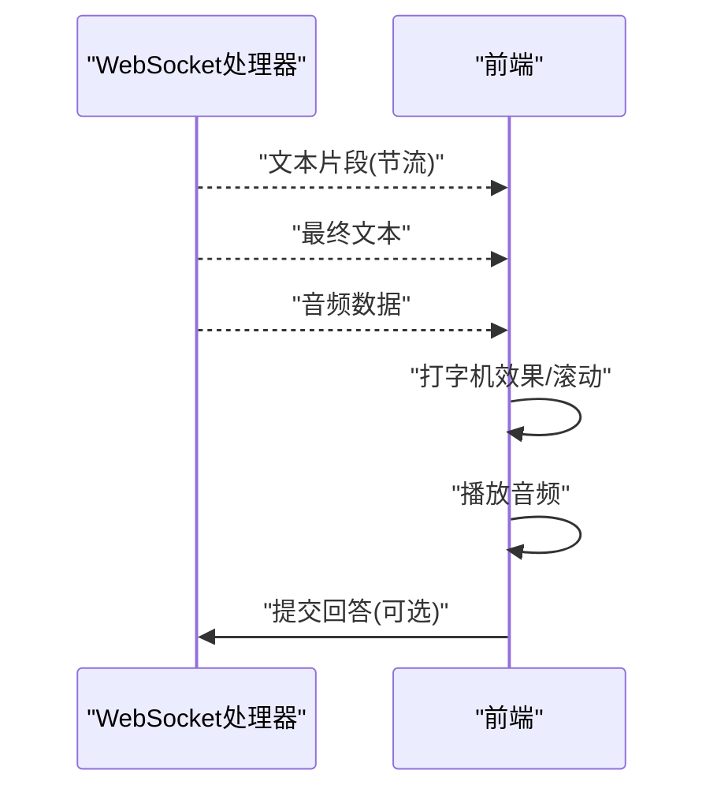
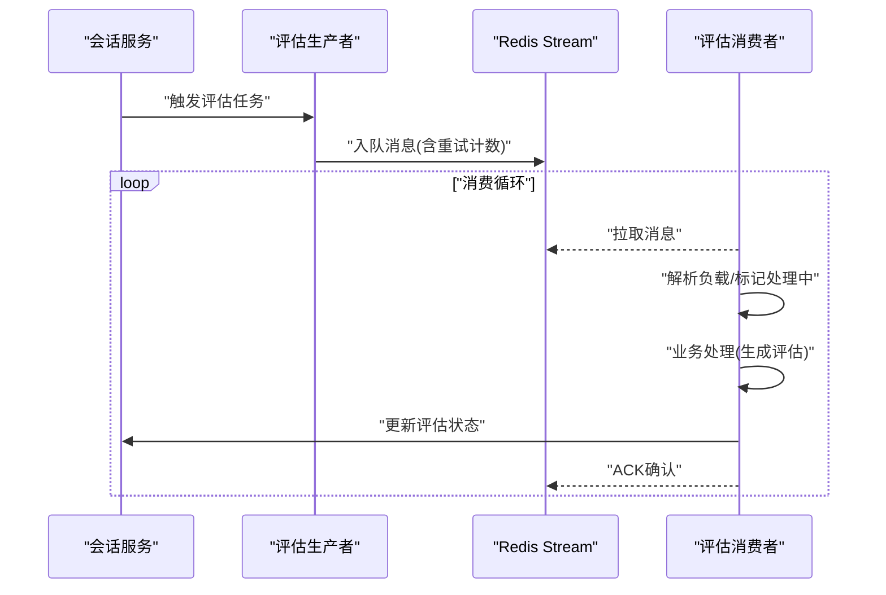
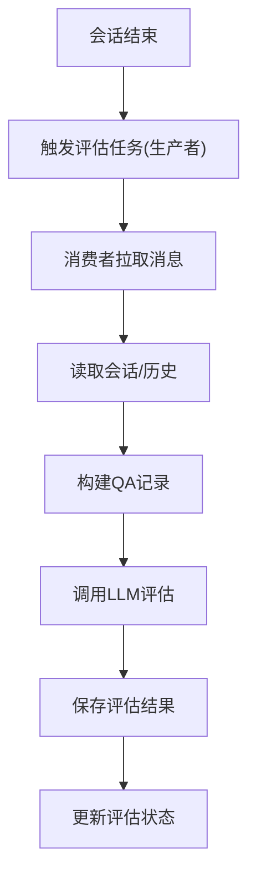
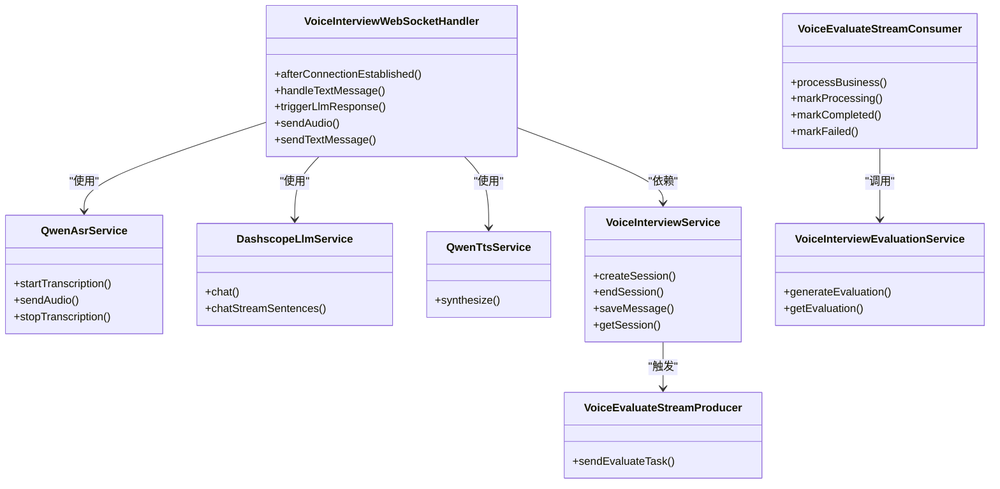
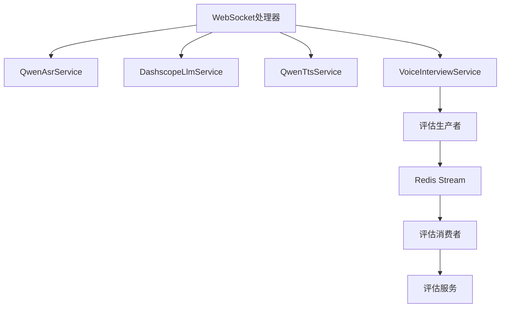

# 流式对话处理

<cite>
**本文引用的文件**
- [VoiceInterviewWebSocketHandler.java](file://app/src/main/java/interview/guide/modules/voiceinterview/handler/VoiceInterviewWebSocketHandler.java)
- [DashscopeLlmService.java](file://app/src/main/java/interview/guide/modules/voiceinterview/service/DashscopeLlmService.java)
- [QwenAsrService.java](file://app/src/main/java/interview/guide/modules/voiceinterview/service/QwenAsrService.java)
- [QwenTtsService.java](file://app/src/main/java/interview/guide/modules/voiceinterview/service/QwenTtsService.java)
- [VoiceInterviewService.java](file://app/src/main/java/interview/guide/modules/voiceinterview/service/VoiceInterviewService.java)
- [VoiceInterviewEvaluationService.java](file://app/src/main/java/interview/guide/modules/voiceinterview/service/VoiceInterviewEvaluationService.java)
- [VoiceEvaluateStreamConsumer.java](file://app/src/main/java/interview/guide/modules/voiceinterview/listener/VoiceEvaluateStreamConsumer.java)
- [VoiceEvaluateStreamProducer.java](file://app/src/main/java/interview/guide/modules/voiceinterview/listener/VoiceEvaluateStreamProducer.java)
- [AbstractStreamConsumer.java](file://app/src/main/java/interview/guide/common/async/AbstractStreamConsumer.java)
- [AbstractStreamProducer.java](file://app/src/main/java/interview/guide/common/async/AbstractStreamProducer.java)
- [AsyncTaskStreamConstants.java](file://app/src/main/java/interview/guide/common/constant/AsyncTaskStreamConstants.java)
- [VoiceInterviewProperties.java](file://app/src/main/java/interview/guide/modules/voiceinterview/config/VoiceInterviewProperties.java)
- [VoiceInterviewSessionEntity.java](file://app/src/main/java/interview/guide/modules/voiceinterview/model/VoiceInterviewSessionEntity.java)
- [application.yml](file://app/src/main/resources/application.yml)
- [RealtimeSubtitle.tsx](file://frontend/src/components/RealtimeSubtitle.tsx)
- [VoiceInterviewPage.tsx](file://frontend/src/pages/VoiceInterviewPage.tsx)
</cite>

## 目录
1. [简介](#简介)
2. [项目结构](#项目结构)
3. [核心组件](#核心组件)
4. [架构总览](#架构总览)
5. [详细组件分析](#详细组件分析)
6. [依赖分析](#依赖分析)
7. [性能考虑](#性能考虑)
8. [故障排查指南](#故障排查指南)
9. [结论](#结论)
10. [附录](#附录)

## 简介
本技术文档围绕“流式对话处理系统”的核心能力展开，聚焦以下关键技术点：
- 句子级并发TTS：在LLM流式输出过程中，按句子边界并发触发TTS，实现“边生成边合成”，显著降低首句等待时延。
- 自动断句与智能提交：利用服务端VAD与句子边界检测，结合可配置的静默时长与字符阈值，实现自然断句与提交时机控制。
- 实时字幕生成：前端对流式文本进行节流与句子片段推送，配合打字机效果与滚动行为，提供流畅的实时字幕体验。
- Redis Stream异步评估：通过Stream消息队列与消费者组实现异步评估任务的可靠投递、重试与状态跟踪。
- 评估任务异步执行：从会话结束到评估生成、入库、状态更新的完整链路，具备幂等与可观测性。
- 性能优化与错误处理：包括批量处理、内存管理、并发控制、重试与降级策略、监控与日志。

## 项目结构
系统采用后端Spring Boot + 前端React的双端架构，语音面试模块位于后端app模块，前端位于frontend模块。核心交互路径为：前端麦克风采集音频 → WebSocket → 后端ASR → LLM → TTS → 前端实时字幕与音频播放。

**图表来源**
- [VoiceInterviewWebSocketHandler.java:1-1153](file://app/src/main/java/interview/guide/modules/voiceinterview/handler/VoiceInterviewWebSocketHandler.java#L1-L1153)
- [QwenAsrService.java:1-625](file://app/src/main/java/interview/guide/modules/voiceinterview/service/QwenAsrService.java#L1-L625)
- [DashscopeLlmService.java:1-246](file://app/src/main/java/interview/guide/modules/voiceinterview/service/DashscopeLlmService.java#L1-L246)
- [QwenTtsService.java:1-397](file://app/src/main/java/interview/guide/modules/voiceinterview/service/QwenTtsService.java#L1-L397)
- [VoiceInterviewService.java:1-582](file://app/src/main/java/interview/guide/modules/voiceinterview/service/VoiceInterviewService.java#L1-L582)
- [VoiceInterviewEvaluationService.java:1-241](file://app/src/main/java/interview/guide/modules/voiceinterview/service/VoiceInterviewEvaluationService.java#L1-L241)
- [VoiceEvaluateStreamProducer.java:1-62](file://app/src/main/java/interview/guide/modules/voiceinterview/listener/VoiceEvaluateStreamProducer.java#L1-L62)
- [VoiceEvaluateStreamConsumer.java:1-121](file://app/src/main/java/interview/guide/modules/voiceinterview/listener/VoiceEvaluateStreamConsumer.java#L1-L121)
- [AsyncTaskStreamConstants.java:1-135](file://app/src/main/java/interview/guide/common/constant/AsyncTaskStreamConstants.java#L1-L135)
- [RealtimeSubtitle.tsx:1-151](file://frontend/src/components/RealtimeSubtitle.tsx#L1-L151)
- [VoiceInterviewPage.tsx:1-734](file://frontend/src/pages/VoiceInterviewPage.tsx#L1-L734)

**章节来源**
- [application.yml:1-282](file://app/src/main/resources/application.yml#L1-L282)

## 核心组件
- WebSocket处理器：负责音频接收、ASR回调、LLM/TTS流水线、文本与音频推送、状态管理与错误处理。
- ASR服务：基于DashScope qwen3-asr-flash-realtime，支持服务端VAD与断句，回调提供实时partial与最终final文本。
- LLM服务：封装Spring AI，支持流式输出与句子级回调，结合prompt上下文与简历信息生成面试官回复。
- TTS服务：基于DashScope qwen-tts-realtime，WebSocket实时合成PCM，支持commit模式与同步合成接口。
- 会话服务：管理会话生命周期、阶段切换、消息持久化、Redis缓存与评估状态更新。
- 评估服务：基于统一评估框架，聚合对话记录生成评估报告并入库。
- Redis Stream：异步评估任务的生产者/消费者模板，支持消费者组、重试与ACK。
- 前端组件：实时字幕展示、音频播放、打字机效果与滚动控制。

**章节来源**
- [VoiceInterviewWebSocketHandler.java:1-1153](file://app/src/main/java/interview/guide/modules/voiceinterview/handler/VoiceInterviewWebSocketHandler.java#L1-L1153)
- [QwenAsrService.java:1-625](file://app/src/main/java/interview/guide/modules/voiceinterview/service/QwenAsrService.java#L1-L625)
- [DashscopeLlmService.java:1-246](file://app/src/main/java/interview/guide/modules/voiceinterview/service/DashscopeLlmService.java#L1-L246)
- [QwenTtsService.java:1-397](file://app/src/main/java/interview/guide/modules/voiceinterview/service/QwenTtsService.java#L1-L397)
- [VoiceInterviewService.java:1-582](file://app/src/main/java/interview/guide/modules/voiceinterview/service/VoiceInterviewService.java#L1-L582)
- [VoiceInterviewEvaluationService.java:1-241](file://app/src/main/java/interview/guide/modules/voiceinterview/service/VoiceInterviewEvaluationService.java#L1-L241)
- [VoiceEvaluateStreamProducer.java:1-62](file://app/src/main/java/interview/guide/modules/voiceinterview/listener/VoiceEvaluateStreamProducer.java#L1-L62)
- [VoiceEvaluateStreamConsumer.java:1-121](file://app/src/main/java/interview/guide/modules/voiceinterview/listener/VoiceEvaluateStreamConsumer.java#L1-L121)
- [AsyncTaskStreamConstants.java:1-135](file://app/src/main/java/interview/guide/common/constant/AsyncTaskStreamConstants.java#L1-L135)
- [RealtimeSubtitle.tsx:1-151](file://frontend/src/components/RealtimeSubtitle.tsx#L1-L151)
- [VoiceInterviewPage.tsx:1-734](file://frontend/src/pages/VoiceInterviewPage.tsx#L1-L734)

## 架构总览
系统采用“前端音频采集 + WebSocket双向流 + 后端实时AI处理 + 异步评估”的整体架构。前端负责UI与音频播放，后端负责ASR/LLM/TTS与会话管理，Redis Stream承载异步评估任务。

**图表来源**
- [VoiceInterviewWebSocketHandler.java:396-748](file://app/src/main/java/interview/guide/modules/voiceinterview/handler/VoiceInterviewWebSocketHandler.java#L396-L748)
- [DashscopeLlmService.java:67-153](file://app/src/main/java/interview/guide/modules/voiceinterview/service/DashscopeLlmService.java#L67-L153)
- [QwenTtsService.java:107-222](file://app/src/main/java/interview/guide/modules/voiceinterview/service/QwenTtsService.java#L107-L222)
- [VoiceInterviewService.java:101-124](file://app/src/main/java/interview/guide/modules/voiceinterview/service/VoiceInterviewService.java#L101-L124)
- [VoiceEvaluateStreamProducer.java:29-61](file://app/src/main/java/interview/guide/modules/voiceinterview/listener/VoiceEvaluateStreamProducer.java#L29-L61)
- [VoiceEvaluateStreamConsumer.java:82-97](file://app/src/main/java/interview/guide/modules/voiceinterview/listener/VoiceEvaluateStreamConsumer.java#L82-L97)
- [AsyncTaskStreamConstants.java:115-134](file://app/src/main/java/interview/guide/common/constant/AsyncTaskStreamConstants.java#L115-L134)

## 详细组件分析

### 句子级并发TTS与音频拼接
- 流式LLM输出：LLM服务在流式回调中检测句子边界（基于标点符号），逐句回调onSentence，同时节流推送文本片段。
- 并行TTS：WebSocket处理器在收到句子边界时，使用信号量控制并发TTS数量，每个句子独立触发TTS，完成后按序收集PCM。
- 音频拼接：若启用分块推送，则每句TTS完成后立即推送WAV音频；否则合并所有PCM后一次性推送。
- 时延优化：通过“文本先行、音频随后”的策略，前端可即时看到文本，TTS在后台并发合成，显著降低首句等待。

**图表来源**
- [DashscopeLlmService.java:67-153](file://app/src/main/java/interview/guide/modules/voiceinterview/service/DashscopeLlmService.java#L67-L153)
- [VoiceInterviewWebSocketHandler.java:587-748](file://app/src/main/java/interview/guide/modules/voiceinterview/handler/VoiceInterviewWebSocketHandler.java#L587-L748)
- [QwenTtsService.java:107-222](file://app/src/main/java/interview/guide/modules/voiceinterview/service/QwenTtsService.java#L107-L222)

**章节来源**
- [DashscopeLlmService.java:67-153](file://app/src/main/java/interview/guide/modules/voiceinterview/service/DashscopeLlmService.java#L67-L153)
- [VoiceInterviewWebSocketHandler.java:587-748](file://app/src/main/java/interview/guide/modules/voiceinterview/handler/VoiceInterviewWebSocketHandler.java#L587-L748)
- [VoiceInterviewProperties.java:45-51](file://app/src/main/java/interview/guide/modules/voiceinterview/config/VoiceInterviewProperties.java#L45-L51)

### 自动断句与智能提交
- 服务端VAD：ASR服务启用server_vad，静默时长达到配置阈值（默认2000ms）即判定一句话结束，回调final文本。
- 句子边界检测：LLM服务在流式回调中识别终止标点，确保句子完整性。
- 提交时机控制：前端在用户停止说话后，等待可配置的静默时长与最小字符数，再触发提交；若超过最长等待时间则强制提交。
- 回声抑制：AI正在说话或冷却期内丢弃麦克风输入，避免扬声器尾音被麦克风拾取引发回声。

**图表来源**
- [QwenAsrService.java:126-186](file://app/src/main/java/interview/guide/modules/voiceinterview/service/QwenAsrService.java#L126-L186)
- [DashscopeLlmService.java:24-242](file://app/src/main/java/interview/guide/modules/voiceinterview/service/DashscopeLlmService.java#L24-L242)
- [VoiceInterviewPage.tsx:298-355](file://frontend/src/pages/VoiceInterviewPage.tsx#L298-L355)
- [VoiceInterviewProperties.java:258-267](file://app/src/main/java/interview/guide/modules/voiceinterview/config/VoiceInterviewProperties.java#L258-L267)

**章节来源**
- [QwenAsrService.java:126-186](file://app/src/main/java/interview/guide/modules/voiceinterview/service/QwenAsrService.java#L126-L186)
- [VoiceInterviewPage.tsx:298-355](file://frontend/src/pages/VoiceInterviewPage.tsx#L298-L355)
- [VoiceInterviewProperties.java:258-267](file://app/src/main/java/interview/guide/modules/voiceinterview/config/VoiceInterviewProperties.java#L258-L267)

### 实时字幕生成
- 文本节流：前端按最小推送间隔与最小字符增量推送，避免频繁渲染。
- 句子片段：当LLM输出句子边界时，前端以打字机效果展示，末尾显示闪烁光标。
- 历史记录：对话历史按角色气泡展示，当前AI/用户文本高亮显示。
- 播放同步：音频播放结束后，前端提交当前AI文本并清空状态。

**图表来源**
- [VoiceInterviewPage.tsx:298-355](file://frontend/src/pages/VoiceInterviewPage.tsx#L298-L355)
- [RealtimeSubtitle.tsx:34-58](file://frontend/src/components/RealtimeSubtitle.tsx#L34-L58)

**章节来源**
- [VoiceInterviewPage.tsx:298-355](file://frontend/src/pages/VoiceInterviewPage.tsx#L298-L355)
- [RealtimeSubtitle.tsx:34-58](file://frontend/src/components/RealtimeSubtitle.tsx#L34-L58)

### Redis Stream异步评估架构
- 消息键与消费者组：定义了语音面试评估的Stream Key、消费者组名与消费者前缀。
- 生产者：会话结束时，生产者将会话ID入队，携带重试计数字段。
- 消费者：模板基类提供统一的消费者生命周期、ACK、重试与失败处理；具体消费者实现业务处理与状态更新。
- 重试策略：最多重试固定次数，超过阈值后标记失败并更新会话状态。

**图表来源**
- [VoiceInterviewService.java:120-124](file://app/src/main/java/interview/guide/modules/voiceinterview/service/VoiceInterviewService.java#L120-L124)
- [VoiceEvaluateStreamProducer.java:29-61](file://app/src/main/java/interview/guide/modules/voiceinterview/listener/VoiceEvaluateStreamProducer.java#L29-L61)
- [VoiceEvaluateStreamConsumer.java:82-97](file://app/src/main/java/interview/guide/modules/voiceinterview/listener/VoiceEvaluateStreamConsumer.java#L82-L97)
- [AbstractStreamConsumer.java:74-123](file://app/src/main/java/interview/guide/common/async/AbstractStreamConsumer.java#L74-L123)
- [AsyncTaskStreamConstants.java:115-134](file://app/src/main/java/interview/guide/common/constant/AsyncTaskStreamConstants.java#L115-L134)

**章节来源**
- [VoiceInterviewService.java:120-124](file://app/src/main/java/interview/guide/modules/voiceinterview/service/VoiceInterviewService.java#L120-L124)
- [VoiceEvaluateStreamProducer.java:29-61](file://app/src/main/java/interview/guide/modules/voiceinterview/listener/VoiceEvaluateStreamProducer.java#L29-L61)
- [VoiceEvaluateStreamConsumer.java:82-97](file://app/src/main/java/interview/guide/modules/voiceinterview/listener/VoiceEvaluateStreamConsumer.java#L82-L97)
- [AbstractStreamConsumer.java:74-123](file://app/src/main/java/interview/guide/common/async/AbstractStreamConsumer.java#L74-L123)
- [AsyncTaskStreamConstants.java:115-134](file://app/src/main/java/interview/guide/common/constant/AsyncTaskStreamConstants.java#L115-L134)

### 评估任务异步执行流程
- 数据准备：评估服务读取会话与消息历史，构建QA记录。
- LLM评估：调用统一评估框架，生成评分、反馈与参考答案。
- 结果入库：将评估报告序列化存储至实体并持久化。
- 状态更新：通过会话服务更新评估状态与错误信息。

**图表来源**
- [VoiceInterviewEvaluationService.java:52-85](file://app/src/main/java/interview/guide/modules/voiceinterview/service/VoiceInterviewEvaluationService.java#L52-L85)
- [VoiceInterviewEvaluationService.java:125-175](file://app/src/main/java/interview/guide/modules/voiceinterview/service/VoiceInterviewEvaluationService.java#L125-L175)
- [VoiceInterviewService.java:517-529](file://app/src/main/java/interview/guide/modules/voiceinterview/service/VoiceInterviewService.java#L517-L529)

**章节来源**
- [VoiceInterviewEvaluationService.java:52-85](file://app/src/main/java/interview/guide/modules/voiceinterview/service/VoiceInterviewEvaluationService.java#L52-L85)
- [VoiceInterviewEvaluationService.java:125-175](file://app/src/main/java/interview/guide/modules/voiceinterview/service/VoiceInterviewEvaluationService.java#L125-L175)
- [VoiceInterviewService.java:517-529](file://app/src/main/java/interview/guide/modules/voiceinterview/service/VoiceInterviewService.java#L517-L529)

### 类关系与职责

**图表来源**
- [VoiceInterviewWebSocketHandler.java:1-1153](file://app/src/main/java/interview/guide/modules/voiceinterview/handler/VoiceInterviewWebSocketHandler.java#L1-L1153)
- [QwenAsrService.java:1-625](file://app/src/main/java/interview/guide/modules/voiceinterview/service/QwenAsrService.java#L1-L625)
- [DashscopeLlmService.java:1-246](file://app/src/main/java/interview/guide/modules/voiceinterview/service/DashscopeLlmService.java#L1-L246)
- [QwenTtsService.java:1-397](file://app/src/main/java/interview/guide/modules/voiceinterview/service/QwenTtsService.java#L1-L397)
- [VoiceInterviewService.java:1-582](file://app/src/main/java/interview/guide/modules/voiceinterview/service/VoiceInterviewService.java#L1-L582)
- [VoiceInterviewEvaluationService.java:1-241](file://app/src/main/java/interview/guide/modules/voiceinterview/service/VoiceInterviewEvaluationService.java#L1-L241)
- [VoiceEvaluateStreamProducer.java:1-62](file://app/src/main/java/interview/guide/modules/voiceinterview/listener/VoiceEvaluateStreamProducer.java#L1-L62)
- [VoiceEvaluateStreamConsumer.java:1-121](file://app/src/main/java/interview/guide/modules/voiceinterview/listener/VoiceEvaluateStreamConsumer.java#L1-L121)

**章节来源**
- [VoiceInterviewWebSocketHandler.java:1-1153](file://app/src/main/java/interview/guide/modules/voiceinterview/handler/VoiceInterviewWebSocketHandler.java#L1-L1153)
- [VoiceInterviewService.java:1-582](file://app/src/main/java/interview/guide/modules/voiceinterview/service/VoiceInterviewService.java#L1-L582)

## 依赖分析
- 组件耦合：WebSocket处理器与ASR/LLM/TTS服务松耦合，通过接口与回调交互；评估链路通过Redis Stream解耦。
- 外部依赖：DashScope ASR/LLM/TTS、Spring AI、Redisson、PostgreSQL。
- 潜在风险：ASR/TTS网络抖动、LLM超时、Redis连接异常、音频合成失败等。

**图表来源**
- [VoiceInterviewWebSocketHandler.java:1-1153](file://app/src/main/java/interview/guide/modules/voiceinterview/handler/VoiceInterviewWebSocketHandler.java#L1-L1153)
- [VoiceInterviewService.java:1-582](file://app/src/main/java/interview/guide/modules/voiceinterview/service/VoiceInterviewService.java#L1-L582)
- [VoiceEvaluateStreamProducer.java:1-62](file://app/src/main/java/interview/guide/modules/voiceinterview/listener/VoiceEvaluateStreamProducer.java#L1-L62)
- [VoiceEvaluateStreamConsumer.java:1-121](file://app/src/main/java/interview/guide/modules/voiceinterview/listener/VoiceEvaluateStreamConsumer.java#L1-L121)
- [AsyncTaskStreamConstants.java:115-134](file://app/src/main/java/interview/guide/common/constant/AsyncTaskStreamConstants.java#L115-L134)

**章节来源**
- [application.yml:86-124](file://app/src/main/resources/application.yml#L86-L124)

## 性能考虑
- 虚拟线程：启用虚拟线程以提升I/O密集型并发（WebSocket、ASR/LLM/TTS、Redis）。
- 线程池与信号量：LLM/TTS/TTS Future收集均在虚拟线程执行，避免阻塞调度线程；TTS并发通过信号量限制。
- 文本节流：前端按最小推送间隔与字符增量推送，降低渲染压力。
- 音频分块：分块推送减少首包等待，合并推送降低消息数量但增加等待时延。
- 缓存与限流：会话实体缓存于Redis，语音面试速率限制在配置中可调。
- 数据库优化：Hibernate批处理与连接池参数优化，避免Open-in-View导致的连接占用。

**章节来源**
- [application.yml:42-47](file://app/src/main/resources/application.yml#L42-L47)
- [VoiceInterviewWebSocketHandler.java:74-103](file://app/src/main/java/interview/guide/modules/voiceinterview/handler/VoiceInterviewWebSocketHandler.java#L74-L103)
- [DashscopeLlmService.java:82-83](file://app/src/main/java/interview/guide/modules/voiceinterview/service/DashscopeLlmService.java#L82-L83)
- [VoiceInterviewProperties.java:45-51](file://app/src/main/java/interview/guide/modules/voiceinterview/config/VoiceInterviewProperties.java#L45-L51)
- [application.yml:54-78](file://app/src/main/resources/application.yml#L54-L78)

## 故障排查指南
- ASR断线重连：当出现“无活动会话”或“append失败”时，自动重启ASR并重试发送音频。
- 错误映射：将网络/认证/配额/超时等异常映射为用户可理解的提示。
- 评估失败：生产者/消费者均记录错误并更新会话状态；超过最大重试次数后标记失败。
- 日志与指标：处理器记录ASR/VAD统计、LLM首Token时延、TTS时延、回合时延与错误计数；前端记录音频播放与提交状态。
- 常见问题定位：
  - 网络异常：检查DashScope服务可用性与API Key配置。
  - 服务不可用：查看LLM服务超时与重试策略。
  - 数据丢失：确认Redis Stream消费者组ACK与消息持久化配置。

**章节来源**
- [VoiceInterviewWebSocketHandler.java:387-425](file://app/src/main/java/interview/guide/modules/voiceinterview/handler/VoiceInterviewWebSocketHandler.java#L387-L425)
- [DashscopeLlmService.java:178-194](file://app/src/main/java/interview/guide/modules/voiceinterview/service/DashscopeLlmService.java#L178-L194)
- [VoiceEvaluateStreamConsumer.java:114-119](file://app/src/main/java/interview/guide/modules/voiceinterview/listener/VoiceEvaluateStreamConsumer.java#L114-L119)
- [AsyncTaskStreamConstants.java:28-40](file://app/src/main/java/interview/guide/common/constant/AsyncTaskStreamConstants.java#L28-L40)

## 结论
该系统通过“句子级并发TTS + 服务端VAD + 流式文本节流 + Redis Stream异步评估”的组合，实现了低时延、高并发、可扩展的流式对话处理能力。前端提供流畅的实时字幕与音频播放体验，后端通过模板化的异步任务框架保障可靠性与可观测性。建议在生产环境中进一步完善监控告警、限流与熔断策略，并针对不同场景调整VAD静默阈值与TTS并发参数以获得最佳体验。

## 附录
- 配置要点：ASR/TTS参数、速率限制、音频规格、流式文本推送间隔与最小增量字符数、最大并发TTS数、分块/合并音频开关等。
- 前端交互：麦克风权限、音频播放授权、提交按钮可用性、错误提示与自动暂停/结束逻辑。

**章节来源**
- [application.yml:194-282](file://app/src/main/resources/application.yml#L194-L282)
- [VoiceInterviewProperties.java:28-52](file://app/src/main/java/interview/guide/modules/voiceinterview/config/VoiceInterviewProperties.java#L28-L52)
- [VoiceInterviewPage.tsx:529-531](file://frontend/src/pages/VoiceInterviewPage.tsx#L529-L531)