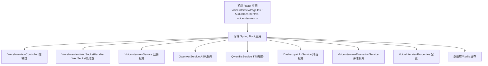
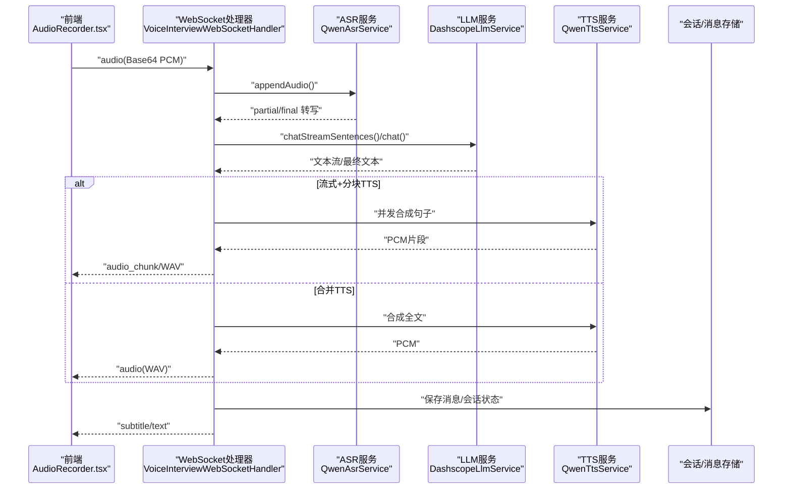
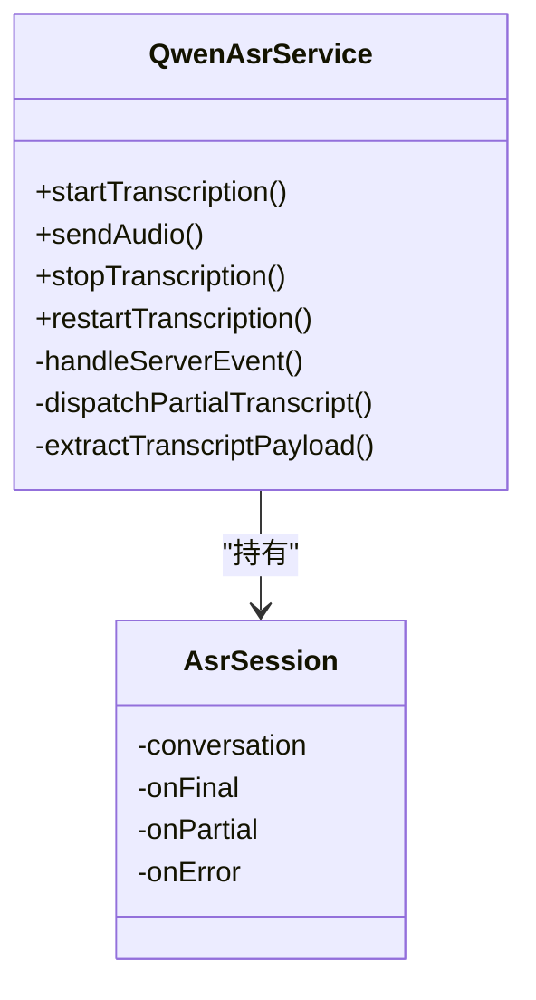
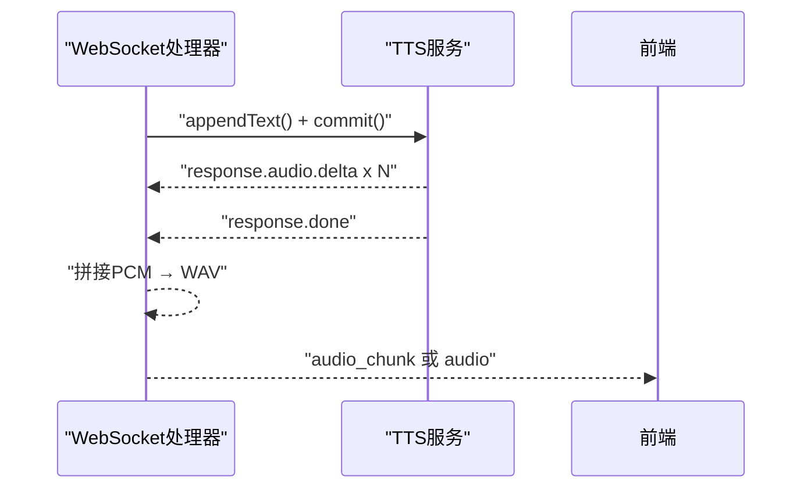
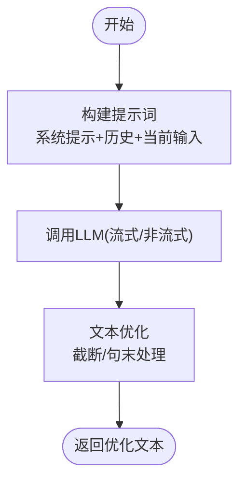
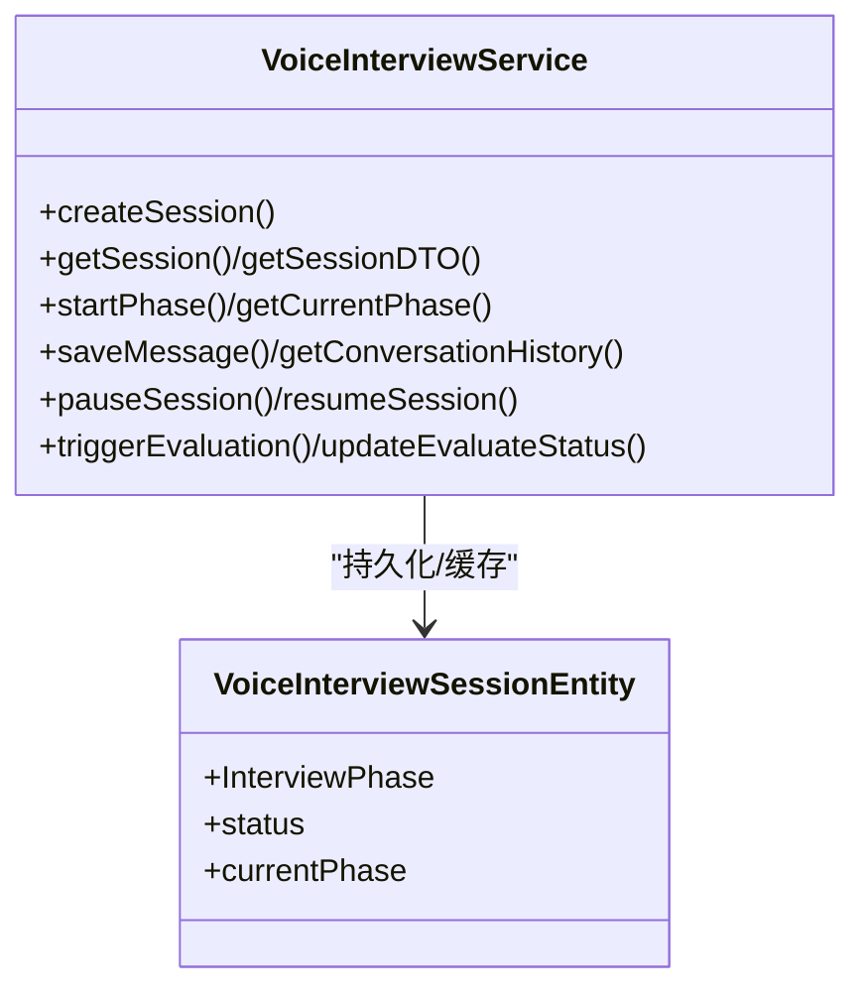
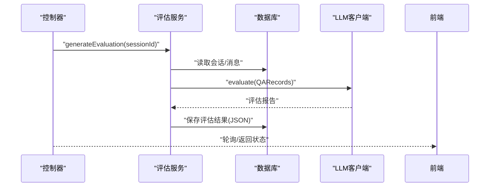
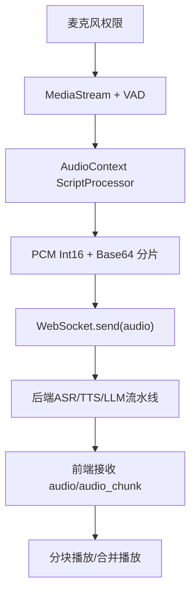
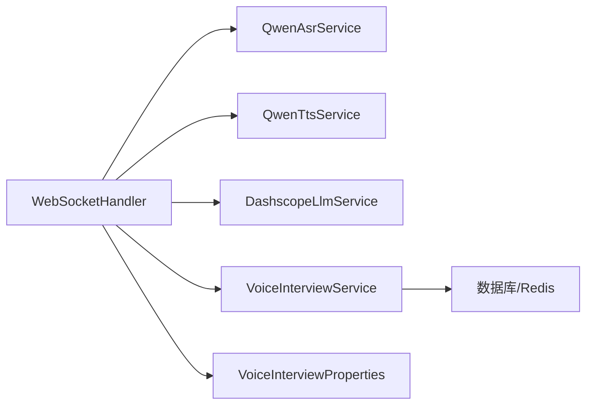

# 语音识别与合成

<cite>
**本文引用的文件**
- [QwenAsrService.java](file://app/src/main/java/interview/guide/modules/voiceinterview/service/QwenAsrService.java)
- [QwenTtsService.java](file://app/src/main/java/interview/guide/modules/voiceinterview/service/QwenTtsService.java)
- [VoiceInterviewWebSocketHandler.java](file://app/src/main/java/interview/guide/modules/voiceinterview/handler/VoiceInterviewWebSocketHandler.java)
- [VoiceInterviewService.java](file://app/src/main/java/interview/guide/modules/voiceinterview/service/VoiceInterviewService.java)
- [DashscopeLlmService.java](file://app/src/main/java/interview/guide/modules/voiceinterview/service/DashscopeLlmService.java)
- [VoiceInterviewEvaluationService.java](file://app/src/main/java/interview/guide/modules/voiceinterview/service/VoiceInterviewEvaluationService.java)
- [VoiceInterviewProperties.java](file://app/src/main/java/interview/guide/modules/voiceinterview/config/VoiceInterviewProperties.java)
- [VoiceInterviewController.java](file://app/src/main/java/interview/guide/modules/voiceinterview/controller/VoiceInterviewController.java)
- [VoiceInterviewSessionEntity.java](file://app/src/main/java/interview/guide/modules/voiceinterview/model/VoiceInterviewSessionEntity.java)
- [AudioRecorder.tsx](file://frontend/src/components/AudioRecorder.tsx)
- [VoiceInterviewPage.tsx](file://frontend/src/pages/VoiceInterviewPage.tsx)
- [voiceInterview.ts](file://frontend/src/api/voiceInterview.ts)
- [interview-evaluation-user.st](file://app/src/main/resources/prompts/interview-evaluation-user.st)
- [interview-evaluation-summary-system.st](file://app/src/main/resources/prompts/interview-evaluation-summary-system.st)
</cite>

## 目录
1. [引言](#引言)
2. [项目结构](#项目结构)
3. [核心组件](#核心组件)
4. [架构总览](#架构总览)
5. [详细组件分析](#详细组件分析)
6. [依赖关系分析](#依赖关系分析)
7. [性能考量](#性能考量)
8. [故障排除指南](#故障排除指南)
9. [结论](#结论)
10. [附录](#附录)

## 引言
本文件面向语音识别与合成系统的技术与产品团队，系统性阐述“语音面试”场景下的ASR（自动语音识别）、TTS（文本转语音）、LLM对话生成与语音合成的集成机制，以及语音质量优化、提示词工程、性能监控与故障排除策略。文档以代码为依据，辅以可视化图示，帮助读者快速理解端到端流程与关键实现。

## 项目结构
后端采用Spring Boot微服务结构，前端为React应用，二者通过REST与WebSocket交互。语音面试相关模块位于后端app模块的voiceinterview包下，前端位于frontend目录。

图表来源
- [VoiceInterviewController.java:1-201](file://app/src/main/java/interview/guide/modules/voiceinterview/controller/VoiceInterviewController.java#L1-L201)
- [VoiceInterviewWebSocketHandler.java:1-1153](file://app/src/main/java/interview/guide/modules/voiceinterview/handler/VoiceInterviewWebSocketHandler.java#L1-L1153)
- [VoiceInterviewService.java:1-582](file://app/src/main/java/interview/guide/modules/voiceinterview/service/VoiceInterviewService.java#L1-L582)
- [QwenAsrService.java:1-625](file://app/src/main/java/interview/guide/modules/voiceinterview/service/QwenAsrService.java#L1-L625)
- [QwenTtsService.java:1-397](file://app/src/main/java/interview/guide/modules/voiceinterview/service/QwenTtsService.java#L1-L397)
- [DashscopeLlmService.java:1-246](file://app/src/main/java/interview/guide/modules/voiceinterview/service/DashscopeLlmService.java#L1-L246)
- [VoiceInterviewEvaluationService.java:1-241](file://app/src/main/java/interview/guide/modules/voiceinterview/service/VoiceInterviewEvaluationService.java#L1-L241)
- [VoiceInterviewProperties.java:1-160](file://app/src/main/java/interview/guide/modules/voiceinterview/config/VoiceInterviewProperties.java#L1-L160)

章节来源
- [VoiceInterviewController.java:1-201](file://app/src/main/java/interview/guide/modules/voiceinterview/controller/VoiceInterviewController.java#L1-L201)
- [VoiceInterviewWebSocketHandler.java:1-1153](file://app/src/main/java/interview/guide/modules/voiceinterview/handler/VoiceInterviewWebSocketHandler.java#L1-L1153)

## 核心组件
- ASR（实时语音识别）：基于DashScope qwen3-asr-flash-realtime模型，服务端VAD自动切段，支持部分/最终转写回调。
- LLM（对话生成）：基于Spring AI ChatClient，支持流式输出与句子级TTS并发，具备首字节延迟优化。
- TTS（实时语音合成）：基于DashScope qwen-tts-realtime模型，支持commit模式与PCM输出，可分块或合并推送。
- 会话与消息：统一管理面试会话生命周期、阶段切换、消息持久化与Redis缓存。
- 评估：基于统一评估框架，生成结构化评估报告，支持轮询查询与异步生成。
- 前端：基于WebRTC VAD采集音频，16kHz采样率，PCM转Base64分片发送；支持分块音频播放与回声抑制。

章节来源
- [QwenAsrService.java:1-625](file://app/src/main/java/interview/guide/modules/voiceinterview/service/QwenAsrService.java#L1-L625)
- [DashscopeLlmService.java:1-246](file://app/src/main/java/interview/guide/modules/voiceinterview/service/DashscopeLlmService.java#L1-L246)
- [QwenTtsService.java:1-397](file://app/src/main/java/interview/guide/modules/voiceinterview/service/QwenTtsService.java#L1-L397)
- [VoiceInterviewService.java:1-582](file://app/src/main/java/interview/guide/modules/voiceinterview/service/VoiceInterviewService.java#L1-L582)
- [VoiceInterviewEvaluationService.java:1-241](file://app/src/main/java/interview/guide/modules/voiceinterview/service/VoiceInterviewEvaluationService.java#L1-L241)
- [VoiceInterviewProperties.java:1-160](file://app/src/main/java/interview/guide/modules/voiceinterview/config/VoiceInterviewProperties.java#L1-L160)
- [AudioRecorder.tsx:1-257](file://frontend/src/components/AudioRecorder.tsx#L1-L257)
- [VoiceInterviewPage.tsx:1-734](file://frontend/src/pages/VoiceInterviewPage.tsx#L1-L734)
- [voiceInterview.ts:1-383](file://frontend/src/api/voiceInterview.ts#L1-L383)

## 架构总览
系统采用“前端音频采集 → WebSocket → 后端ASR/TTS/LLM流水线 → 前端实时渲染”的实时双向语音对话架构。关键特性包括：
- 服务端VAD自动切段，减少人工提交成本
- LLM流式输出配合句子级TTS并发，降低首字等待时延
- 分块音频推送与合并推送两种模式，兼顾低延迟与稳定性
- 回声抑制与AI说话冷却期，避免麦克风拾取导致的循环触发

图表来源
- [VoiceInterviewWebSocketHandler.java:396-748](file://app/src/main/java/interview/guide/modules/voiceinterview/handler/VoiceInterviewWebSocketHandler.java#L396-L748)
- [QwenAsrService.java:130-322](file://app/src/main/java/interview/guide/modules/voiceinterview/service/QwenAsrService.java#L130-L322)
- [DashscopeLlmService.java:59-153](file://app/src/main/java/interview/guide/modules/voiceinterview/service/DashscopeLlmService.java#L59-L153)
- [QwenTtsService.java:107-222](file://app/src/main/java/interview/guide/modules/voiceinterview/service/QwenTtsService.java#L107-L222)

## 详细组件分析

### ASR（自动语音识别）
- 模型与协议：qwen3-asr-flash-realtime，WebSocket连接，服务端VAD（server_vad）自动切段。
- 会话管理：线程安全的并发会话映射，支持重启恢复、错误清理与资源销毁。
- 数据通道：PCM 16kHz，Base64编码后发送；支持部分/最终转写回调。
- 错误处理：连接异常、服务端关闭、重连验证，避免重复错误回调。

图表来源
- [QwenAsrService.java:1-625](file://app/src/main/java/interview/guide/modules/voiceinterview/service/QwenAsrService.java#L1-L625)

章节来源
- [QwenAsrService.java:130-322](file://app/src/main/java/interview/guide/modules/voiceinterview/service/QwenAsrService.java#L130-L322)
- [QwenAsrService.java:393-482](file://app/src/main/java/interview/guide/modules/voiceinterview/service/QwenAsrService.java#L393-L482)

### TTS（文本转语音）
- 模型与协议：qwen-tts-realtime，commit模式，PCM 24kHz输出。
- 同步合成：CountDownLatch保护30秒超时，自动关闭连接。
- 事件驱动：响应delta音频块，聚合为完整WAV。
- 配置项：声音、语速、音量、语言类型等可配置。

图表来源
- [QwenTtsService.java:107-222](file://app/src/main/java/interview/guide/modules/voiceinterview/service/QwenTtsService.java#L107-L222)
- [VoiceInterviewWebSocketHandler.java:640-696](file://app/src/main/java/interview/guide/modules/voiceinterview/handler/VoiceInterviewWebSocketHandler.java#L640-L696)

章节来源
- [QwenTtsService.java:107-222](file://app/src/main/java/interview/guide/modules/voiceinterview/service/QwenTtsService.java#L107-L222)
- [VoiceInterviewWebSocketHandler.java:640-696](file://app/src/main/java/interview/guide/modules/voiceinterview/handler/VoiceInterviewWebSocketHandler.java#L640-L696)

### LLM（对话生成与提示词工程）
- 对话生成：支持流式输出与句子级TTS并发；具备首字节延迟优化与文本规范化。
- 提示词：系统提示+历史对话+当前用户输入；支持错误映射为友好提示。
- 语音优化：对输出文本进行截断与句末优化，适配语音播报。

图表来源
- [DashscopeLlmService.java:31-153](file://app/src/main/java/interview/guide/modules/voiceinterview/service/DashscopeLlmService.java#L31-L153)

章节来源
- [DashscopeLlmService.java:31-153](file://app/src/main/java/interview/guide/modules/voiceinterview/service/DashscopeLlmService.java#L31-L153)
- [interview-evaluation-user.st:1-23](file://app/src/main/resources/prompts/interview-evaluation-user.st#L1-L23)
- [interview-evaluation-summary-system.st:1-11](file://app/src/main/resources/prompts/interview-evaluation-summary-system.st#L1-L11)

### 会话与消息管理
- 生命周期：创建、暂停/恢复、结束、阶段切换、历史查询。
- 缓存：Redis缓存会话实体，降低数据库压力。
- 评估：触发异步评估任务，支持轮询查询结果。

图表来源
- [VoiceInterviewService.java:1-582](file://app/src/main/java/interview/guide/modules/voiceinterview/service/VoiceInterviewService.java#L1-L582)
- [VoiceInterviewSessionEntity.java:1-122](file://app/src/main/java/interview/guide/modules/voiceinterview/model/VoiceInterviewSessionEntity.java#L1-L122)

章节来源
- [VoiceInterviewService.java:63-124](file://app/src/main/java/interview/guide/modules/voiceinterview/service/VoiceInterviewService.java#L63-L124)
- [VoiceInterviewService.java:169-194](file://app/src/main/java/interview/guide/modules/voiceinterview/service/VoiceInterviewService.java#L169-L194)
- [VoiceInterviewService.java:215-238](file://app/src/main/java/interview/guide/modules/voiceinterview/service/VoiceInterviewService.java#L215-L238)
- [VoiceInterviewService.java:339-365](file://app/src/main/java/interview/guide/modules/voiceinterview/service/VoiceInterviewService.java#L339-L365)

### 评估服务与报告
- 输入：会话消息列表，构建QA记录。
- 评估：调用统一评估框架，生成整体评分、优势、改进建议与参考答案。
- 存储：JSON序列化存储结构化评估结果。

图表来源
- [VoiceInterviewEvaluationService.java:52-85](file://app/src/main/java/interview/guide/modules/voiceinterview/service/VoiceInterviewEvaluationService.java#L52-L85)
- [VoiceInterviewController.java:137-200](file://app/src/main/java/interview/guide/modules/voiceinterview/controller/VoiceInterviewController.java#L137-L200)

章节来源
- [VoiceInterviewEvaluationService.java:87-93](file://app/src/main/java/interview/guide/modules/voiceinterview/service/VoiceInterviewEvaluationService.java#L87-L93)
- [VoiceInterviewEvaluationService.java:125-151](file://app/src/main/java/interview/guide/modules/voiceinterview/service/VoiceInterviewEvaluationService.java#L125-L151)
- [VoiceInterviewController.java:137-200](file://app/src/main/java/interview/guide/modules/voiceinterview/controller/VoiceInterviewController.java#L137-L200)

### 前端音频采集与播放
- 采集：WebRTC VAD + 16kHz采样率，PCM转Int16再Base64分片发送。
- 显示：实时字幕、AI说话指示、计时器。
- 播放：支持分块音频播放（AudioContext）与合并播放，自动清理与防回声。

图表来源
- [AudioRecorder.tsx:69-178](file://frontend/src/components/AudioRecorder.tsx#L69-L178)
- [VoiceInterviewPage.tsx:136-187](file://frontend/src/pages/VoiceInterviewPage.tsx#L136-L187)
- [voiceInterview.ts:220-365](file://frontend/src/api/voiceInterview.ts#L220-L365)

章节来源
- [AudioRecorder.tsx:69-178](file://frontend/src/components/AudioRecorder.tsx#L69-L178)
- [VoiceInterviewPage.tsx:136-187](file://frontend/src/pages/VoiceInterviewPage.tsx#L136-L187)
- [voiceInterview.ts:220-365](file://frontend/src/api/voiceInterview.ts#L220-L365)

## 依赖关系分析
- 组件耦合：WebSocket处理器聚合ASR/TTS/LLM/会话服务，职责清晰；服务间通过接口解耦。
- 外部依赖：DashScope ASR/TTS WebSocket API、Spring AI ChatClient、MicVAD Web库。
- 并发与隔离：虚拟线程池处理阻塞操作，调度线程专注事件合并与调度。

图表来源
- [VoiceInterviewWebSocketHandler.java:58-64](file://app/src/main/java/interview/guide/modules/voiceinterview/handler/VoiceInterviewWebSocketHandler.java#L58-L64)
- [VoiceInterviewProperties.java:1-160](file://app/src/main/java/interview/guide/modules/voiceinterview/config/VoiceInterviewProperties.java#L1-L160)

章节来源
- [VoiceInterviewWebSocketHandler.java:74-76](file://app/src/main/java/interview/guide/modules/voiceinterview/handler/VoiceInterviewWebSocketHandler.java#L74-L76)
- [VoiceInterviewWebSocketHandler.java:58-64](file://app/src/main/java/interview/guide/modules/voiceinterview/handler/VoiceInterviewWebSocketHandler.java#L58-L64)

## 性能考量
- 识别准确率
  - 服务端VAD切段与server_vad类型有助于减少静音噪声影响，建议结合实际环境调整静默时长阈值。
  - 采样率与格式一致性（16kHz PCM）是保障识别质量的关键。
- 合成延迟
  - 流式文本下发与句子级TTS并发显著降低首字节延迟；可通过配置项调节推送间隔与最小增量字符数。
  - 分块音频推送可进一步缩短首包时延，但需平衡网络抖动与播放稳定性。
- 音频质量
  - 前端开启回声消除、降噪与自动增益；服务端TTS输出PCM，前端统一转WAV，确保播放一致性。
- 资源与稳定性
  - 并发TTS上限与超时保护避免上游连接限制；WebSocket发送缓冲与时间限制防止内存溢出。
- 监控指标
  - 计数器：ASR最终片段到达次数、TTS空音频次数、错误次数
  - 计时器：ASR合并等待时延、LLM首字节延迟、LLM总耗时、TTS总耗时、整轮对话时延
  - 建议在MeterRegistry中注册上述指标，便于观测与告警

章节来源
- [VoiceInterviewProperties.java:29-52](file://app/src/main/java/interview/guide/modules/voiceinterview/config/VoiceInterviewProperties.java#L29-L52)
- [VoiceInterviewWebSocketHandler.java:584-748](file://app/src/main/java/interview/guide/modules/voiceinterview/handler/VoiceInterviewWebSocketHandler.java#L584-L748)
- [QwenTtsService.java:183-222](file://app/src/main/java/interview/guide/modules/voiceinterview/service/QwenTtsService.java#L183-L222)

## 故障排除指南
- ASR连接中断
  - 现象：WebSocket关闭、服务端关闭回调、需要重连
  - 排查：检查API Key、网络连通性；确认重连逻辑与会话清理
  - 参考
    - [QwenAsrService.java:220-232](file://app/src/main/java/interview/guide/modules/voiceinterview/service/QwenAsrService.java#L220-L232)
    - [VoiceInterviewWebSocketHandler.java:411-425](file://app/src/main/java/interview/guide/modules/voiceinterview/handler/VoiceInterviewWebSocketHandler.java#L411-L425)
- TTS合成失败
  - 现象：空音频、超时、错误事件
  - 排查：检查API Key、并发限制、网络状况；确认PCM到WAV转换链路
  - 参考
    - [QwenTtsService.java:183-222](file://app/src/main/java/interview/guide/modules/voiceinterview/service/QwenTtsService.java#L183-L222)
    - [VoiceInterviewWebSocketHandler.java:640-696](file://app/src/main/java/interview/guide/modules/voiceinterview/handler/VoiceInterviewWebSocketHandler.java#L640-L696)
- LLM调用异常
  - 现象：认证失败、超时、频率限制、网络错误
  - 排查：核对Provider配置、限流策略、网络代理；查看错误映射
  - 参考
    - [DashscopeLlmService.java:178-194](file://app/src/main/java/interview/guide/modules/voiceinterview/service/DashscopeLlmService.java#L178-L194)
- 前端音频播放异常
  - 现象：无法自动播放、分块播放卡顿、回声
  - 排查：用户手势授权、AudioContext状态、分块队列与播放源管理
  - 参考
    - [VoiceInterviewPage.tsx:106-187](file://frontend/src/pages/VoiceInterviewPage.tsx#L106-L187)
    - [AudioRecorder.tsx:103-178](file://frontend/src/components/AudioRecorder.tsx#L103-L178)

## 结论
该系统通过“前端VAD采集 + 服务端ASR/TTS/LLM流水线”的实时架构，实现了高质量、低延迟的语音面试体验。关键在于：
- 服务端VAD与句子级并发TTS降低端到端时延
- 前端回声抑制与分块播放提升稳定性
- 统一评估框架与结构化提示词工程支撑面试质量闭环
- 丰富的配置项与监控指标便于持续优化

## 附录
- 配置要点
  - ASR：模型、语言、采样率、VAD类型与静默时长
  - TTS：模型、声音、采样率、语速、音量
  - 会话：阶段时长/问题阈值、并发TTS上限、分块推送开关
- 前端采集参数
  - 采样率16kHz、PCM、回声消除/降噪/自动增益
- 评估提示词
  - 系统提示、用户提示、总结系统提示，确保评估一致性与可解释性

章节来源
- [VoiceInterviewProperties.java:118-160](file://app/src/main/java/interview/guide/modules/voiceinterview/config/VoiceInterviewProperties.java#L118-L160)
- [AudioRecorder.tsx:72-79](file://frontend/src/components/AudioRecorder.tsx#L72-L79)
- [interview-evaluation-user.st:1-23](file://app/src/main/resources/prompts/interview-evaluation-user.st#L1-L23)
- [interview-evaluation-summary-system.st:1-11](file://app/src/main/resources/prompts/interview-evaluation-summary-system.st#L1-L11)