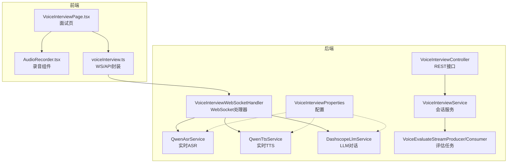
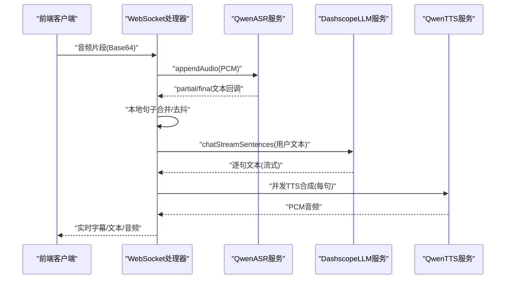
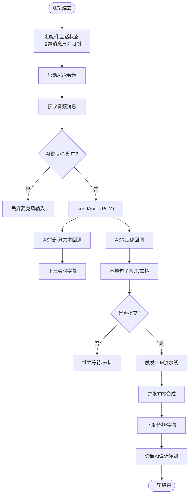
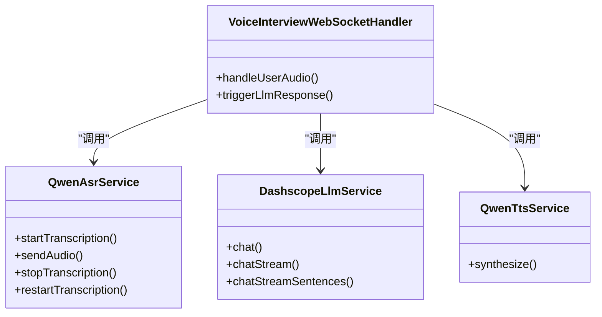
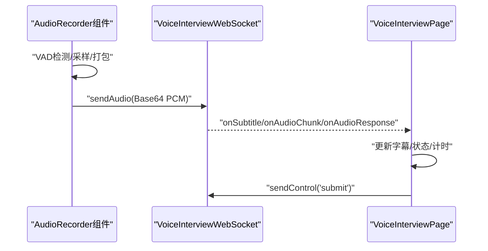
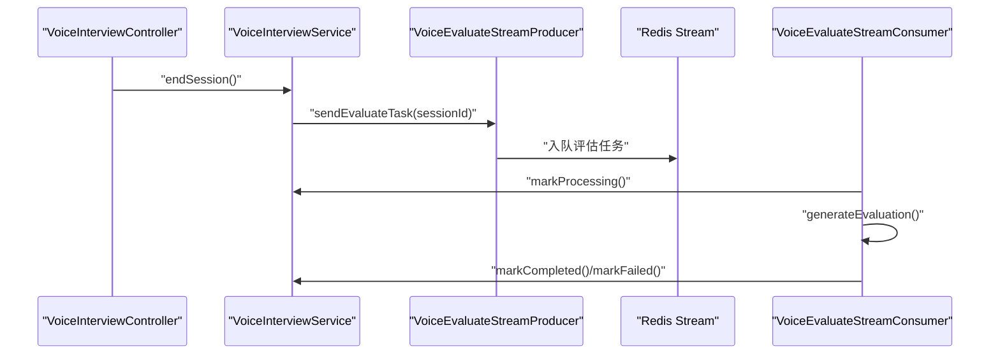
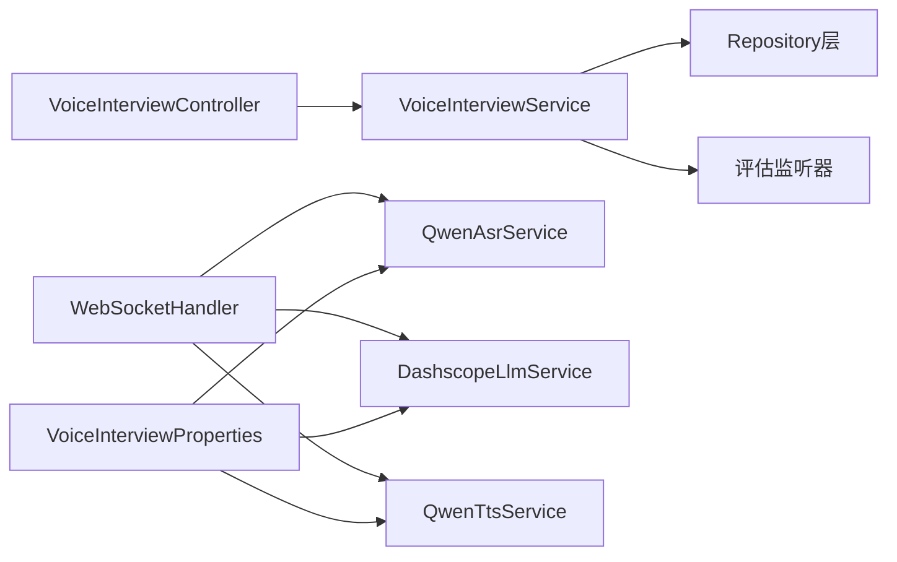

# 语音面试模块

<cite>
**本文档引用的文件**
- [VoiceInterviewController.java](file://app/src/main/java/interview/guide/modules/voiceinterview/controller/VoiceInterviewController.java)
- [VoiceInterviewWebSocketHandler.java](file://app/src/main/java/interview/guide/modules/voiceinterview/handler/VoiceInterviewWebSocketHandler.java)
- [VoiceInterviewService.java](file://app/src/main/java/interview/guide/modules/voiceinterview/service/VoiceInterviewService.java)
- [QwenAsrService.java](file://app/src/main/java/interview/guide/modules/voiceinterview/service/QwenAsrService.java)
- [QwenTtsService.java](file://app/src/main/java/interview/guide/modules/voiceinterview/service/QwenTtsService.java)
- [DashscopeLlmService.java](file://app/src/main/java/interview/guide/modules/voiceinterview/service/DashscopeLlmService.java)
- [VoiceInterviewProperties.java](file://app/src/main/java/interview/guide/modules/voiceinterview/config/VoiceInterviewProperties.java)
- [VoiceInterviewSessionEntity.java](file://app/src/main/java/interview/guide/modules/voiceinterview/model/VoiceInterviewSessionEntity.java)
- [WebSocketControlMessage.java](file://app/src/main/java/interview/guide/modules/voiceinterview/dto/WebSocketControlMessage.java)
- [WebSocketSubtitleMessage.java](file://app/src/main/java/interview/guide/modules/voiceinterview/dto/WebSocketSubtitleMessage.java)
- [VoiceEvaluateStreamConsumer.java](file://app/src/main/java/interview/guide/modules/voiceinterview/listener/VoiceEvaluateStreamConsumer.java)
- [VoiceEvaluateStreamProducer.java](file://app/src/main/java/interview/guide/modules/voiceinterview/listener/VoiceEvaluateStreamProducer.java)
- [application.yml](file://app/src/main/resources/application.yml)
- [VoiceInterviewPage.tsx](file://frontend/src/pages/VoiceInterviewPage.tsx)
- [AudioRecorder.tsx](file://frontend/src/components/AudioRecorder.tsx)
- [voiceInterview.ts](file://frontend/src/api/voiceInterview.ts)
</cite>

## 目录
1. [简介](#简介)
2. [项目结构](#项目结构)
3. [核心组件](#核心组件)
4. [架构总览](#架构总览)
5. [详细组件分析](#详细组件分析)
6. [依赖关系分析](#依赖关系分析)
7. [性能考虑](#性能考虑)
8. [故障排查指南](#故障排查指南)
9. [结论](#结论)
10. [附录](#附录)

## 简介
本技术文档面向语音面试模块，系统性阐述基于 WebSocket 的实时通信架构与实现细节，涵盖连接建立、消息传递、状态管理、实时语音对话链路（ASR→LLM→TTS）、流式对话机制、回声防护与音频质量优化、前端录制与播放体验、会话状态管理（暂停/恢复/超时）、性能监控与指标采集，以及配置项、扩展点与优化建议。文档既适用于后端开发者，也便于前端与测试同学理解整体流程。

## 项目结构
语音面试模块位于后端应用的 voiceinterview 包内，采用分层架构：控制器层暴露 REST 接口，WebSocket 处理器负责实时双向音频流，服务层编排业务逻辑，各子服务封装第三方能力（ASR/TTS/LLM），配置类集中管理参数，监听器通过 Redis Stream 异步触发评估任务。前端通过 WebSocket 与后端交互，实现录音、实时字幕、音频播放与控制。

图表来源
- [VoiceInterviewController.java:35-200](file://app/src/main/java/interview/guide/modules/voiceinterview/controller/VoiceInterviewController.java#L35-L200)
- [VoiceInterviewWebSocketHandler.java:53-1153](file://app/src/main/java/interview/guide/modules/voiceinterview/handler/VoiceInterviewWebSocketHandler.java#L53-L1153)
- [VoiceInterviewService.java:41-582](file://app/src/main/java/interview/guide/modules/voiceinterview/service/VoiceInterviewService.java#L41-L582)
- [QwenAsrService.java:47-625](file://app/src/main/java/interview/guide/modules/voiceinterview/service/QwenAsrService.java#L47-L625)
- [QwenTtsService.java:42-397](file://app/src/main/java/interview/guide/modules/voiceinterview/service/QwenTtsService.java#L42-L397)
- [DashscopeLlmService.java:19-246](file://app/src/main/java/interview/guide/modules/voiceinterview/service/DashscopeLlmService.java#L19-L246)
- [VoiceInterviewProperties.java:14-160](file://app/src/main/java/interview/guide/modules/voiceinterview/config/VoiceInterviewProperties.java#L14-L160)
- [VoiceInterviewPage.tsx:16-734](file://frontend/src/pages/VoiceInterviewPage.tsx#L16-L734)
- [AudioRecorder.tsx:20-257](file://frontend/src/components/AudioRecorder.tsx#L20-L257)
- [voiceInterview.ts:220-383](file://frontend/src/api/voiceInterview.ts#L220-L383)

章节来源
- [VoiceInterviewController.java:25-200](file://app/src/main/java/interview/guide/modules/voiceinterview/controller/VoiceInterviewController.java#L25-L200)
- [VoiceInterviewWebSocketHandler.java:45-1153](file://app/src/main/java/interview/guide/modules/voiceinterview/handler/VoiceInterviewWebSocketHandler.java#L45-L1153)
- [VoiceInterviewService.java:30-582](file://app/src/main/java/interview/guide/modules/voiceinterview/service/VoiceInterviewService.java#L30-L582)
- [VoiceInterviewProperties.java:11-160](file://app/src/main/java/interview/guide/modules/voiceinterview/config/VoiceInterviewProperties.java#L11-L160)
- [VoiceInterviewPage.tsx:16-734](file://frontend/src/pages/VoiceInterviewPage.tsx#L16-L734)
- [AudioRecorder.tsx:20-257](file://frontend/src/components/AudioRecorder.tsx#L20-L257)
- [voiceInterview.ts:220-383](file://frontend/src/api/voiceInterview.ts#L220-L383)

## 核心组件
- 控制器层：提供会话创建、查询、结束、暂停/恢复、历史消息、评估状态查询与触发等 REST 接口。
- WebSocket 处理器：负责连接建立、音频消息接收与转发、ASR 回调处理、LLM/TTS 流水线、实时字幕与音频下发、回声防护与冷却、会话状态管理与超时处理。
- 服务层：编排会话生命周期、阶段切换、消息持久化、Redis 缓存、评估任务入队与状态更新。
- 第三方服务：ASR（DashScope qwen3-asr-flash-realtime）、TTS（DashScope qwen-tts-realtime）、LLM（Spring AI DashScope 兼容模式）。
- 配置中心：集中管理会话阶段时长、并发 TTS、流式文本推送、音频参数、Qwen ASR/TTS 参数等。
- 监听器：基于 Redis Stream 的异步评估任务消费与重试。
- 前端：录音组件（VAD、噪声抑制、采样率适配、PCM 打包）、WebSocket 封装、实时字幕、音频播放（合并/分块）。

章节来源
- [VoiceInterviewController.java:25-200](file://app/src/main/java/interview/guide/modules/voiceinterview/controller/VoiceInterviewController.java#L25-L200)
- [VoiceInterviewWebSocketHandler.java:45-1153](file://app/src/main/java/interview/guide/modules/voiceinterview/handler/VoiceInterviewWebSocketHandler.java#L45-L1153)
- [VoiceInterviewService.java:30-582](file://app/src/main/java/interview/guide/modules/voiceinterview/service/VoiceInterviewService.java#L30-L582)
- [QwenAsrService.java:25-625](file://app/src/main/java/interview/guide/modules/voiceinterview/service/QwenAsrService.java#L25-L625)
- [QwenTtsService.java:20-397](file://app/src/main/java/interview/guide/modules/voiceinterview/service/QwenTtsService.java#L20-L397)
- [DashscopeLlmService.java:19-246](file://app/src/main/java/interview/guide/modules/voiceinterview/service/DashscopeLlmService.java#L19-L246)
- [VoiceInterviewProperties.java:11-160](file://app/src/main/java/interview/guide/modules/voiceinterview/config/VoiceInterviewProperties.java#L11-L160)
- [VoiceInterviewPage.tsx:16-734](file://frontend/src/pages/VoiceInterviewPage.tsx#L16-L734)
- [AudioRecorder.tsx:20-257](file://frontend/src/components/AudioRecorder.tsx#L20-L257)
- [voiceInterview.ts:220-383](file://frontend/src/api/voiceInterview.ts#L220-L383)

## 架构总览
语音面试的整体技术架构围绕“实时双向音频流 + 本地合并 + 云端推理”的模式构建。前端通过 WebSocket 将音频以 PCM 片段发送至后端，后端使用 DashScope ASR 进行实时转写，结合本地 VAD/静音检测进行句子级合并，再调用 LLM 生成回复，同时并发触发 TTS 合成，最终将文本与音频实时推送给前端。

图表来源
- [VoiceInterviewWebSocketHandler.java:396-748](file://app/src/main/java/interview/guide/modules/voiceinterview/handler/VoiceInterviewWebSocketHandler.java#L396-L748)
- [QwenAsrService.java:130-322](file://app/src/main/java/interview/guide/modules/voiceinterview/service/QwenAsrService.java#L130-L322)
- [DashscopeLlmService.java:67-153](file://app/src/main/java/interview/guide/modules/voiceinterview/service/DashscopeLlmService.java#L67-L153)
- [QwenTtsService.java:107-222](file://app/src/main/java/interview/guide/modules/voiceinterview/service/QwenTtsService.java#L107-L222)

## 详细组件分析

### WebSocket 实时通信与状态管理
- 连接建立：后端为每个会话维护 WebSocketSession，并设置较大的文本/二进制消息尺寸限制，启用并发装饰器以保护发送队列与耗时。
- 消息类型：音频消息（type=audio，Base64 PCM）、控制消息（type=control，action=start_phase/submit/end_interview）、字幕消息（type=subtitle，text+isFinal）。
- 会话状态：使用 SessionState 记录 AI 说话状态、合并缓冲、处理锁、冷却时间等，避免回声与并发冲突。
- 超时与暂停：基于最后活动时间检测暂停超时（默认 5 分钟），超过则自动结束会话；支持手动暂停/恢复。
- 重连与健壮性：ASR 连接断开时自动重启；WebSocket 关闭清理资源；异常映射为用户可读提示。

图表来源
- [VoiceInterviewWebSocketHandler.java:139-748](file://app/src/main/java/interview/guide/modules/voiceinterview/handler/VoiceInterviewWebSocketHandler.java#L139-L748)
- [WebSocketControlMessage.java:14-18](file://app/src/main/java/interview/guide/modules/voiceinterview/dto/WebSocketControlMessage.java#L14-L18)
- [WebSocketSubtitleMessage.java:12-16](file://app/src/main/java/interview/guide/modules/voiceinterview/dto/WebSocketSubtitleMessage.java#L12-L16)

章节来源
- [VoiceInterviewWebSocketHandler.java:139-748](file://app/src/main/java/interview/guide/modules/voiceinterview/handler/VoiceInterviewWebSocketHandler.java#L139-L748)
- [WebSocketControlMessage.java:14-18](file://app/src/main/java/interview/guide/modules/voiceinterview/dto/WebSocketControlMessage.java#L14-L18)
- [WebSocketSubtitleMessage.java:12-16](file://app/src/main/java/interview/guide/modules/voiceinterview/dto/WebSocketSubtitleMessage.java#L12-L16)

### 实时语音对话链路（ASR→LLM→TTS）
- ASR：DashScope qwen3-asr-flash-realtime，启用服务端 VAD，支持 partial/final 文本回调，自动按静音切段。
- LLM：Spring AI DashScope 兼容模式，支持流式文本回调，按句子边界触发并发 TTS，同时优化输出文本（去除多余标记、截断到句末）。
- TTS：DashScope qwen-tts-realtime，WebSocket 实时合成，支持分块推送与合并推送两种模式，PCM 输出并转换为 WAV 下发。

图表来源
- [QwenAsrService.java:130-358](file://app/src/main/java/interview/guide/modules/voiceinterview/service/QwenAsrService.java#L130-L358)
- [DashscopeLlmService.java:31-153](file://app/src/main/java/interview/guide/modules/voiceinterview/service/DashscopeLlmService.java#L31-L153)
- [QwenTtsService.java:107-222](file://app/src/main/java/interview/guide/modules/voiceinterview/service/QwenTtsService.java#L107-L222)
- [VoiceInterviewWebSocketHandler.java:427-748](file://app/src/main/java/interview/guide/modules/voiceinterview/handler/VoiceInterviewWebSocketHandler.java#L427-L748)

章节来源
- [QwenAsrService.java:25-625](file://app/src/main/java/interview/guide/modules/voiceinterview/service/QwenAsrService.java#L25-L625)
- [DashscopeLlmService.java:19-246](file://app/src/main/java/interview/guide/modules/voiceinterview/service/DashscopeLlmService.java#L19-L246)
- [QwenTtsService.java:20-397](file://app/src/main/java/interview/guide/modules/voiceinterview/service/QwenTtsService.java#L20-L397)
- [VoiceInterviewWebSocketHandler.java:427-748](file://app/src/main/java/interview/guide/modules/voiceinterview/handler/VoiceInterviewWebSocketHandler.java#L427-L748)

### 流式对话与并发 TTS
- 句子级并发 TTS：LLM 流式输出每出现一个完整句子即触发一次 TTS，使用信号量限制每会话并发数，避免服务端连接压力。
- 分块/合并推送：可配置分块模式，每句完成后立即推送，改善首句延迟；也可合并后一次性推送。
- 实时文本节流：通过最小推送间隔与最小字符增量控制 WebSocket 压力，避免过度刷屏。

章节来源
- [VoiceInterviewWebSocketHandler.java:587-729](file://app/src/main/java/interview/guide/modules/voiceinterview/handler/VoiceInterviewWebSocketHandler.java#L587-L729)
- [DashscopeLlmService.java:67-153](file://app/src/main/java/interview/guide/modules/voiceinterview/service/DashscopeLlmService.java#L67-L153)
- [VoiceInterviewProperties.java:34-51](file://app/src/main/java/interview/guide/modules/voiceinterview/config/VoiceInterviewProperties.java#L34-L51)

### 回声防护与音频质量优化
- 回声防护：AI 正在说话或冷却期内丢弃麦克风输入，防止扬声器尾音被麦克风拾取再次触发识别。
- 音频缓冲与延迟控制：前端按 1 秒采样（16kHz）切片，后端合并去抖（默认 2.5 秒），平衡实时性与准确性。
- 噪声抑制与采样：前端启用回声消除、降噪、自动增益，采样率 16kHz；TTS 输出 24kHz PCM，前端转换为 24kHz 播放。
- 传输优化：WebSocket 文本消息大小限制与发送装饰器，避免内存与拥塞。

章节来源
- [VoiceInterviewWebSocketHandler.java:438-482](file://app/src/main/java/interview/guide/modules/voiceinterview/handler/VoiceInterviewWebSocketHandler.java#L438-L482)
- [AudioRecorder.tsx:70-178](file://frontend/src/components/AudioRecorder.tsx#L70-L178)
- [VoiceInterviewProperties.java:259-267](file://app/src/main/java/interview/guide/modules/voiceinterview/config/VoiceInterviewProperties.java#L259-L267)

### 前端录音与播放体验
- 录音控制：VAD 检测说话开始/结束，前端仅在说话期间发送音频；支持体积可视化反馈。
- 音频可视化：通过 AnalyserNode 实时显示音量波形效果。
- 播放控制：支持合并播放与分块播放（AudioContext 队列），自动清理与防卡顿；播放结束后提交 AI 文本。
- 交互设计：提交按钮仅在可提交状态下可用；连接状态、阶段标签、计时器等 UI 反馈。

图表来源
- [AudioRecorder.tsx:69-178](file://frontend/src/components/AudioRecorder.tsx#L69-L178)
- [voiceInterview.ts:220-383](file://frontend/src/api/voiceInterview.ts#L220-L383)
- [VoiceInterviewPage.tsx:293-355](file://frontend/src/pages/VoiceInterviewPage.tsx#L293-L355)

章节来源
- [AudioRecorder.tsx:20-257](file://frontend/src/components/AudioRecorder.tsx#L20-L257)
- [voiceInterview.ts:220-383](file://frontend/src/api/voiceInterview.ts#L220-L383)
- [VoiceInterviewPage.tsx:16-734](file://frontend/src/pages/VoiceInterviewPage.tsx#L16-L734)

### 会话状态管理（暂停/恢复/超时）
- 暂停：支持短暂停（5 分钟）与长暂停（结束并保存），超时自动结束。
- 恢复：恢复会话时拉取历史消息并重建 WebSocket，保持上下文连续性。
- 阶段切换：根据时长与问题数量启发式判断阶段推进，支持 INTRO/TECH/PROJECT/HR/COMPLETED。

章节来源
- [VoiceInterviewService.java:270-428](file://app/src/main/java/interview/guide/modules/voiceinterview/service/VoiceInterviewService.java#L270-L428)
- [VoiceInterviewController.java:81-103](file://app/src/main/java/interview/guide/modules/voiceinterview/controller/VoiceInterviewController.java#L81-L103)
- [VoiceInterviewPage.tsx:473-505](file://frontend/src/pages/VoiceInterviewPage.tsx#L473-L505)

### 评估与异步处理
- 评估触发：结束会话时将评估任务入队 Redis Stream，消费者组消费并生成评估报告。
- 状态管理：服务层统一更新评估状态（PENDING/PROCESSING/COMPLETED/FAILED），前端轮询查询。

图表来源
- [VoiceInterviewController.java:74-79](file://app/src/main/java/interview/guide/modules/voiceinterview/controller/VoiceInterviewController.java#L74-L79)
- [VoiceInterviewService.java:101-124](file://app/src/main/java/interview/guide/modules/voiceinterview/service/VoiceInterviewService.java#L101-L124)
- [VoiceEvaluateStreamProducer.java:29-49](file://app/src/main/java/interview/guide/modules/voiceinterview/listener/VoiceEvaluateStreamProducer.java#L29-L49)
- [VoiceEvaluateStreamConsumer.java:82-97](file://app/src/main/java/interview/guide/modules/voiceinterview/listener/VoiceEvaluateStreamConsumer.java#L82-L97)

章节来源
- [VoiceInterviewController.java:137-199](file://app/src/main/java/interview/guide/modules/voiceinterview/controller/VoiceInterviewController.java#L137-L199)
- [VoiceInterviewService.java:517-538](file://app/src/main/java/interview/guide/modules/voiceinterview/service/VoiceInterviewService.java#L517-L538)
- [VoiceEvaluateStreamProducer.java:14-62](file://app/src/main/java/interview/guide/modules/voiceinterview/listener/VoiceEvaluateStreamProducer.java#L14-L62)
- [VoiceEvaluateStreamConsumer.java:15-121](file://app/src/main/java/interview/guide/modules/voiceinterview/listener/VoiceEvaluateStreamConsumer.java#L15-L121)

### 性能监控与指标采集
- 指标维度：ASR 定稿段到达计数、句子合并等待时长、LLM/首 Token/回合时长、TTS 合成时长、空音频计数、错误计数。
- 采集方式：Micrometer MeterRegistry 计数器与定时器，按状态标签区分成功/失败。
- 前端体验：实时字幕节流、分块音频播放、播放完成自动提交，减少感知延迟。

章节来源
- [VoiceInterviewWebSocketHandler.java:503-747](file://app/src/main/java/interview/guide/modules/voiceinterview/handler/VoiceInterviewWebSocketHandler.java#L503-L747)
- [DashscopeLlmService.java:196-242](file://app/src/main/java/interview/guide/modules/voiceinterview/service/DashscopeLlmService.java#L196-L242)
- [VoiceInterviewPage.tsx:106-187](file://frontend/src/pages/VoiceInterviewPage.tsx#L106-L187)

## 依赖关系分析
- 组件耦合：WebSocket 处理器聚合 ASR/TTS/LLM 服务，服务层聚合会话与评估，控制器仅编排调用；职责清晰。
- 外部依赖：DashScope ASR/TTS/LLM、Redisson/Redis Stream、PostgreSQL、Spring AI OpenAI 兼容模式。
- 配置驱动：大量行为通过配置类与 YAML 参数控制，便于灰度与调优。

图表来源
- [VoiceInterviewController.java:35-200](file://app/src/main/java/interview/guide/modules/voiceinterview/controller/VoiceInterviewController.java#L35-L200)
- [VoiceInterviewService.java:41-582](file://app/src/main/java/interview/guide/modules/voiceinterview/service/VoiceInterviewService.java#L41-L582)
- [VoiceInterviewWebSocketHandler.java:53-1153](file://app/src/main/java/interview/guide/modules/voiceinterview/handler/VoiceInterviewWebSocketHandler.java#L53-L1153)
- [VoiceInterviewProperties.java:14-160](file://app/src/main/java/interview/guide/modules/voiceinterview/config/VoiceInterviewProperties.java#L14-L160)

章节来源
- [VoiceInterviewController.java:25-200](file://app/src/main/java/interview/guide/modules/voiceinterview/controller/VoiceInterviewController.java#L25-L200)
- [VoiceInterviewService.java:30-582](file://app/src/main/java/interview/guide/modules/voiceinterview/service/VoiceInterviewService.java#L30-L582)
- [VoiceInterviewWebSocketHandler.java:45-1153](file://app/src/main/java/interview/guide/modules/voiceinterview/handler/VoiceInterviewWebSocketHandler.java#L45-L1153)
- [VoiceInterviewProperties.java:11-160](file://app/src/main/java/interview/guide/modules/voiceinterview/config/VoiceInterviewProperties.java#L11-L160)

## 性能考虑
- 并发与线程：使用虚拟线程执行阻塞 I/O（ASR/LLM/TTS），避免占满调度线程；ASR/VAD 线程池固定大小，避免资源争用。
- 缓冲与去抖：前端 1 秒切片，后端 2.5 秒去抖，兼顾实时性与稳定性。
- 并发 TTS：信号量限制每会话并发数，避免服务端连接上限；分块推送降低首句延迟。
- 网络与带宽：WebSocket 文本消息大小限制与发送装饰器，避免拥塞；前端 AudioContext 分块播放，降低卡顿。
- 数据库与缓存：Redis 缓存会话实体，JPA 批量写入，减少 IO 压力。

## 故障排查指南
- ASR 连接中断：WebSocket 层捕获异常后自动重启并重试，若仍失败则上报错误；检查 API Key 与网络。
- TTS 合成失败：捕获空音频与异常，记录指标并回退文本提示；检查 API Key 与服务可用性。
- WebSocket 断开：前端自动重连有限次数；检查网络与服务端日志。
- 会话状态异常：确认暂停/恢复/结束状态流转；必要时手动清理缓存与会话。
- 前端播放异常：检查浏览器自动播放策略与用户交互；AudioContext 状态与队列清空。

章节来源
- [VoiceInterviewWebSocketHandler.java:387-425](file://app/src/main/java/interview/guide/modules/voiceinterview/handler/VoiceInterviewWebSocketHandler.java#L387-L425)
- [QwenTtsService.java:184-221](file://app/src/main/java/interview/guide/modules/voiceinterview/service/QwenTtsService.java#L184-L221)
- [voiceInterview.ts:287-302](file://frontend/src/api/voiceInterview.ts#L287-L302)
- [VoiceInterviewService.java:270-329](file://app/src/main/java/interview/guide/modules/voiceinterview/service/VoiceInterviewService.java#L270-L329)

## 结论
该语音面试模块通过 WebSocket 实现实时双向音频流，结合本地去抖与句子级并发 TTS，实现了低延迟、高体验的语音对话。后端以服务化与配置化为核心，前端提供完善的录音、字幕与播放体验。评估采用异步 Redis Stream，保障了系统的可扩展性与可靠性。通过合理的回声防护、音频质量优化与性能指标采集，系统在真实场景中具备良好的稳定性与可运维性。

## 附录

### 配置项与扩展点
- 会话阶段配置：各阶段最小/建议/最大时长与问题数，支持动态调整。
- 流式与并发：是否启用 LLM 流式文本、最小推送间隔、最小字符增量、每会话并发 TTS 数、是否启用分块音频。
- 音频参数：采样率、位宽、通道、切片时长、最大字符数截断。
- Qwen ASR/TTS：模型、API Key、语言、音色、语速、音量等。
- 评估与限流：评估任务重试、每会话/每 IP/全局并发限制。

章节来源
- [VoiceInterviewProperties.java:17-160](file://app/src/main/java/interview/guide/modules/voiceinterview/config/VoiceInterviewProperties.java#L17-L160)
- [application.yml:194-282](file://app/src/main/resources/application.yml#L194-L282)

### 优化建议
- 网络与带宽：在弱网环境下适当增大去抖时长与分块大小，减少重传。
- 评估批处理：评估任务可批量消费与合并写入，降低数据库压力。
- 指标细化：增加 ASR/TTS 成功率、首包延迟、丢包率等指标，辅助容量规划。
- 前端体验：进一步优化分块播放队列与播放器状态机，减少卡顿与延迟。