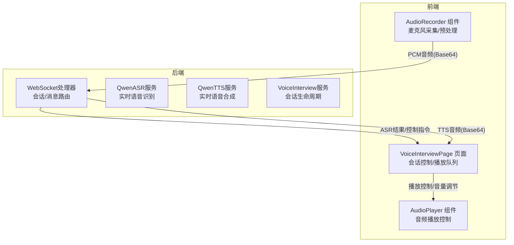
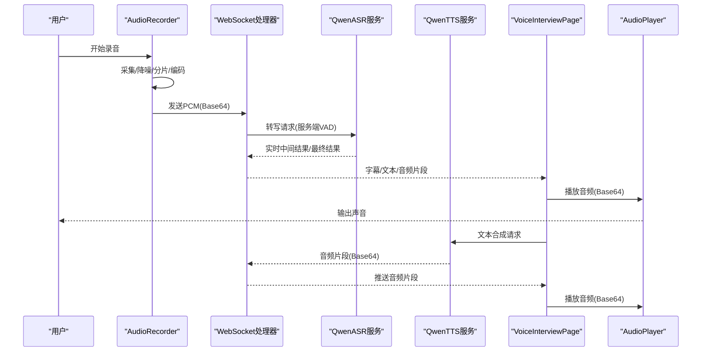
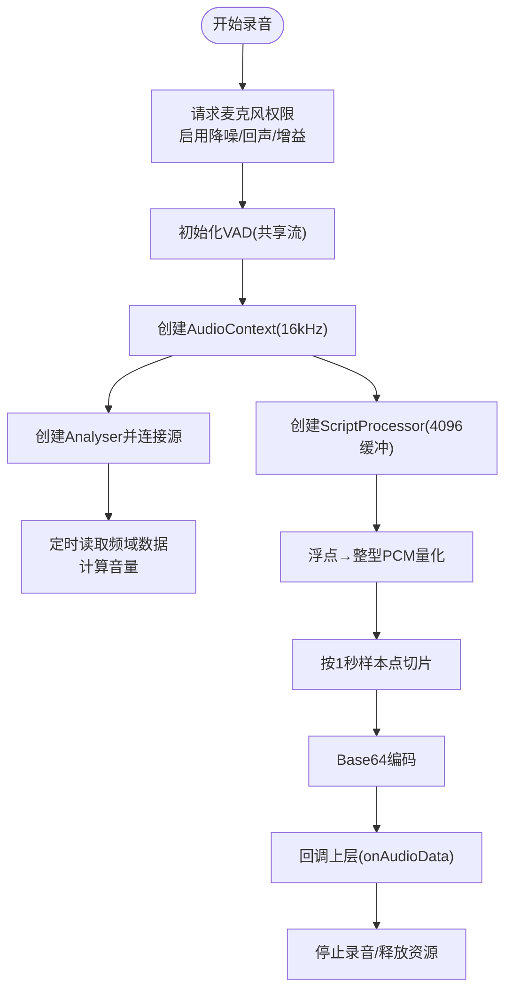
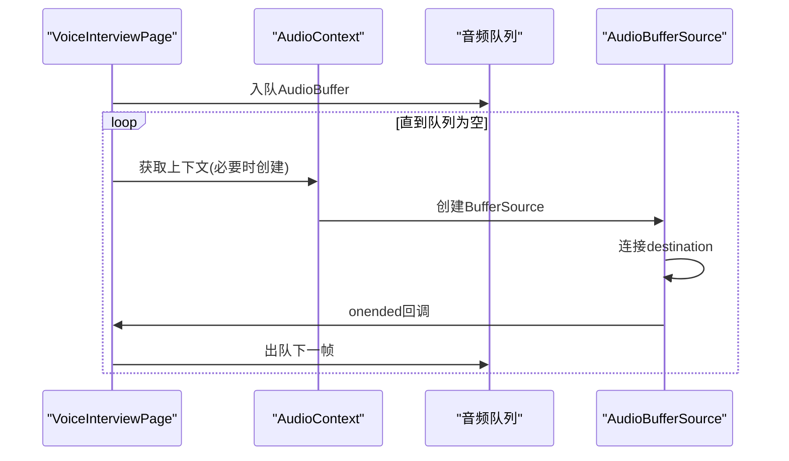
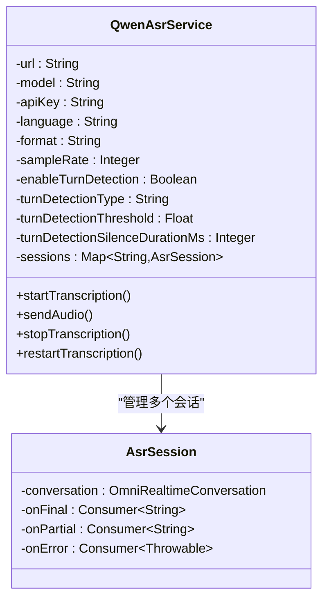
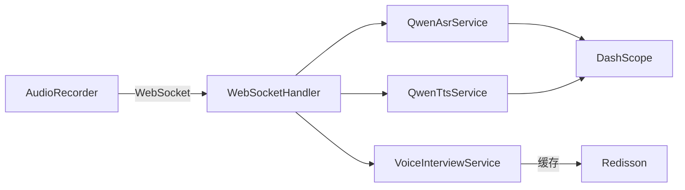

# 音频处理与质量优化

<cite>
**本文档引用的文件**
- [AudioRecorder.tsx](file://frontend/src/components/AudioRecorder.tsx)
- [AudioPlayer.tsx](file://frontend/src/components/AudioPlayer.tsx)
- [VoiceInterviewPage.tsx](file://frontend/src/pages/VoiceInterviewPage.tsx)
- [VoiceInterviewProperties.java](file://app/src/main/java/interview/guide/modules/voiceinterview/config/VoiceInterviewProperties.java)
- [QwenAsrService.java](file://app/src/main/java/interview/guide/modules/voiceinterview/service/QwenAsrService.java)
- [QwenTtsService.java](file://app/src/main/java/interview/guide/modules/voiceinterview/service/QwenTtsService.java)
- [VoiceInterviewService.java](file://app/src/main/java/interview/guide/modules/voiceinterview/service/VoiceInterviewService.java)
- [VoiceInterviewWebSocketHandler.java](file://app/src/main/java/interview/guide/modules/voiceinterview/handler/VoiceInterviewWebSocketHandler.java)
- [application-test.yml](file://app/src/test/resources/application-test.yml)
</cite>

## 目录
1. [简介](#简介)
2. [项目结构](#项目结构)
3. [核心组件](#核心组件)
4. [架构总览](#架构总览)
5. [详细组件分析](#详细组件分析)
6. [依赖关系分析](#依赖关系分析)
7. [性能考虑](#性能考虑)
8. [故障排除指南](#故障排除指南)
9. [结论](#结论)
10. [附录](#附录)

## 简介
本技术文档围绕面试系统中的音频处理与质量优化展开，覆盖从麦克风权限管理、采样率与格式配置、实时ASR/TTS到播放控制、缓冲与延迟优化、可视化呈现以及跨平台兼容性的完整链路。文档同时给出性能监控指标建议与常见问题排查方法，帮助开发者快速理解并优化音频体验。

## 项目结构
音频相关能力主要分布在前端React组件与后端Spring服务之间，通过WebSocket进行交互，并借助第三方云服务（DashScope）实现ASR/TTS实时处理。整体采用前后端分离架构，前端负责采集、可视化与播放，后端负责会话管理、流式处理与质量控制。

图表来源
- [AudioRecorder.tsx:69-178](file://frontend/src/components/AudioRecorder.tsx#L69-L178)
- [VoiceInterviewPage.tsx:106-187](file://frontend/src/pages/VoiceInterviewPage.tsx#L106-L187)
- [VoiceInterviewWebSocketHandler.java:477-791](file://app/src/main/java/interview/guide/modules/voiceinterview/handler/VoiceInterviewWebSocketHandler.java#L477-L791)
- [QwenAsrService.java:130-322](file://app/src/main/java/interview/guide/modules/voiceinterview/service/QwenAsrService.java#L130-L322)
- [QwenTtsService.java:107-222](file://app/src/main/java/interview/guide/modules/voiceinterview/service/QwenTtsService.java#L107-L222)
- [VoiceInterviewService.java:63-93](file://app/src/main/java/interview/guide/modules/voiceinterview/service/VoiceInterviewService.java#L63-L93)

章节来源
- [AudioRecorder.tsx:1-257](file://frontend/src/components/AudioRecorder.tsx#L1-L257)
- [AudioPlayer.tsx:1-125](file://frontend/src/components/AudioPlayer.tsx#L1-L125)
- [VoiceInterviewPage.tsx:1-734](file://frontend/src/pages/VoiceInterviewPage.tsx#L1-L734)
- [VoiceInterviewProperties.java:1-160](file://app/src/main/java/interview/guide/modules/voiceinterview/config/VoiceInterviewProperties.java#L1-L160)
- [QwenAsrService.java:1-625](file://app/src/main/java/interview/guide/modules/voiceinterview/service/QwenAsrService.java#L1-L625)
- [QwenTtsService.java:1-397](file://app/src/main/java/interview/guide/modules/voiceinterview/service/QwenTtsService.java#L1-L397)
- [VoiceInterviewService.java:1-582](file://app/src/main/java/interview/guide/modules/voiceinterview/service/VoiceInterviewService.java#L1-L582)
- [VoiceInterviewWebSocketHandler.java:477-791](file://app/src/main/java/interview/guide/modules/voiceinterview/handler/VoiceInterviewWebSocketHandler.java#L477-L791)
- [application-test.yml:95-164](file://app/src/test/resources/application-test.yml#L95-L164)

## 核心组件
- 前端采集与可视化
  - 麦克风权限与参数：采样率16kHz、开启回声消除、降噪、自动增益
  - 实时音量监测：使用AnalyserNode计算频域能量
  - 音频分片：ScriptProcessor按1秒样本点切片，转Base64传输
  - VAD集成：共享MediaStream，减少资源占用
- 前端播放与缓冲
  - AudioContext按24kHz采样率创建缓冲区
  - 音频分块队列+顺序播放，确保连续播放
  - 自动播放兼容性处理与错误提示
- 后端ASR/TTS与会话
  - ASR：DashScope qwen3-asr-flash-realtime，服务端VAD，自动断句
  - TTS：DashScope qwen3-tts-flash-realtime，PCM 24kHz输出
  - 会话：生命周期管理、阶段切换、消息持久化、Redis缓存
- 配置中心
  - 统一管理采样率、比特率、通道数、编解码器、模型参数等

章节来源
- [AudioRecorder.tsx:72-101](file://frontend/src/components/AudioRecorder.tsx#L72-L101)
- [VoiceInterviewPage.tsx:106-187](file://frontend/src/pages/VoiceInterviewPage.tsx#L106-L187)
- [QwenAsrService.java:130-322](file://app/src/main/java/interview/guide/modules/voiceinterview/service/QwenAsrService.java#L130-L322)
- [QwenTtsService.java:107-222](file://app/src/main/java/interview/guide/modules/voiceinterview/service/QwenTtsService.java#L107-L222)
- [VoiceInterviewProperties.java:108-148](file://app/src/main/java/interview/guide/modules/voiceinterview/config/VoiceInterviewProperties.java#L108-L148)

## 架构总览
音频处理链路由前端采集、后端实时处理与前端播放三部分组成，通过WebSocket保持低延迟双向通信。

图表来源
- [AudioRecorder.tsx:123-151](file://frontend/src/components/AudioRecorder.tsx#L123-L151)
- [VoiceInterviewWebSocketHandler.java:487-507](file://app/src/main/java/interview/guide/modules/voiceinterview/handler/VoiceInterviewWebSocketHandler.java#L487-L507)
- [QwenAsrService.java:302-322](file://app/src/main/java/interview/guide/modules/voiceinterview/service/QwenAsrService.java#L302-L322)
- [QwenTtsService.java:177-179](file://app/src/main/java/interview/guide/modules/voiceinterview/service/QwenTtsService.java#L177-L179)
- [VoiceInterviewPage.tsx:136-187](file://frontend/src/pages/VoiceInterviewPage.tsx#L136-L187)
- [AudioPlayer.tsx:20-31](file://frontend/src/components/AudioPlayer.tsx#L20-L31)

## 详细组件分析

### 前端音频采集组件（AudioRecorder）
- 权限与参数
  - 使用navigator.mediaDevices.getUserMedia请求麦克风，启用echoCancellation、noiseSuppression、autoGainControl
  - 设置采样率为16kHz，满足ASR模型要求
- 实时音量监测
  - 通过AnalyserNode与ScriptProcessor配合，定时读取频域数据，计算平均能量作为音量指示
- 音频分片与编码
  - 将Float32输入量化为Int16 PCM，按1秒样本点切片，转为Base64字符串
  - 通过回调将音频数据传递给上层组件
- VAD与资源管理
  - 使用共享MediaStream初始化VAD实例，避免重复创建
  - 组件卸载时释放AudioContext、停止媒体轨道、清理定时器

图表来源
- [AudioRecorder.tsx:69-178](file://frontend/src/components/AudioRecorder.tsx#L69-L178)

章节来源
- [AudioRecorder.tsx:69-178](file://frontend/src/components/AudioRecorder.tsx#L69-L178)

### 前端音频播放组件（AudioPlayer）
- 播放控制
  - 支持播放/暂停、静音切换、音量滑杆调节
  - 自动播放策略：收到新音频数据后尝试播放，若失败则提示用户交互
- 文本展示
  - 可选显示对应文本内容，便于对齐

章节来源
- [AudioPlayer.tsx:1-125](file://frontend/src/components/AudioPlayer.tsx#L1-L125)

### 前端实时播放与缓冲（VoiceInterviewPage）
- 分块播放
  - 使用AudioContext创建24kHz采样率的AudioBuffer
  - 将音频片段入队，串行播放，确保连续性
- 播放完成与收尾
  - 监听播放结束事件，清理状态、提交AI文本、重置标志位
  - 提供最大清空等待时间，避免卡死

图表来源
- [VoiceInterviewPage.tsx:106-187](file://frontend/src/pages/VoiceInterviewPage.tsx#L106-L187)

章节来源
- [VoiceInterviewPage.tsx:106-187](file://frontend/src/pages/VoiceInterviewPage.tsx#L106-L187)

### 后端ASR服务（QwenAsrService）
- 会话管理
  - 多会话并发管理，线程安全；支持重启恢复
- 服务端VAD
  - 自动断句，合并中间结果，最终文本触发LLM
- 错误处理
  - WebSocket关闭/异常时清理会话，避免内存泄漏

图表来源
- [QwenAsrService.java:72-98](file://app/src/main/java/interview/guide/modules/voiceinterview/service/QwenAsrService.java#L72-L98)
- [QwenAsrService.java:557-581](file://app/src/main/java/interview/guide/modules/voiceinterview/service/QwenAsrService.java#L557-L581)

章节来源
- [QwenAsrService.java:1-625](file://app/src/main/java/interview/guide/modules/voiceinterview/service/QwenAsrService.java#L1-L625)

### 后端TTS服务（QwenTtsService）
- 实时合成
  - WebSocket连接，支持中文语音、语速、音量配置
  - 收集response.audio.delta片段，拼接为完整PCM
- 超时保护
  - 同步等待最多30秒，避免阻塞

章节来源
- [QwenTtsService.java:107-222](file://app/src/main/java/interview/guide/modules/voiceinterview/service/QwenTtsService.java#L107-L222)

### 会话与业务逻辑（VoiceInterviewService）
- 生命周期
  - 创建/结束/暂停/恢复会话，阶段推进，消息持久化
- 缓存与一致性
  - Redis缓存会话元数据，提升查询性能
- 阶段规则
  - 基于时长与问题数量的智能过渡策略

章节来源
- [VoiceInterviewService.java:63-93](file://app/src/main/java/interview/guide/modules/voiceinterview/service/VoiceInterviewService.java#L63-L93)
- [VoiceInterviewService.java:393-428](file://app/src/main/java/interview/guide/modules/voiceinterview/service/VoiceInterviewService.java#L393-L428)

### WebSocket处理器（VoiceInterviewWebSocketHandler）
- 控制消息
  - submit/end_interview/start_phase等控制指令
- STT/TTS集成
  - 接收ASR中间/最终结果，转发字幕与音频
  - 触发LLM响应与TTS合成
- 错误映射
  - 对阿里云特定错误进行友好提示

章节来源
- [VoiceInterviewWebSocketHandler.java:487-507](file://app/src/main/java/interview/guide/modules/voiceinterview/handler/VoiceInterviewWebSocketHandler.java#L487-L507)
- [VoiceInterviewWebSocketHandler.java:773-791](file://app/src/main/java/interview/guide/modules/voiceinterview/handler/VoiceInterviewWebSocketHandler.java#L773-L791)

### 配置中心（VoiceInterviewProperties）
- 音频参数
  - 编解码器、采样率、比特率、通道数、分片时长
- 模型参数
  - ASR/TTS模型、语言、采样率、VAD阈值、说话人速率等
- 速率限制与流式策略
  - 并发限制、流式文本推送间隔与增量字符数

章节来源
- [VoiceInterviewProperties.java:108-148](file://app/src/main/java/interview/guide/modules/voiceinterview/config/VoiceInterviewProperties.java#L108-L148)
- [application-test.yml:95-164](file://app/src/test/resources/application-test.yml#L95-L164)

## 依赖关系分析
- 前端依赖
  - Web Audio API：采集、分析、播放
  - VAD库：基于OnnxRuntime的Web版本，需通过CDN加载
  - WebSocket客户端：与后端建立实时连接
- 后端依赖
  - DashScope SDK：ASR/TTS实时接口
  - Redisson：会话缓存
  - Spring WebSocket：会话管理与消息路由

图表来源
- [AudioRecorder.tsx:87-101](file://frontend/src/components/AudioRecorder.tsx#L87-L101)
- [VoiceInterviewWebSocketHandler.java:477-791](file://app/src/main/java/interview/guide/modules/voiceinterview/handler/VoiceInterviewWebSocketHandler.java#L477-L791)
- [QwenAsrService.java:130-322](file://app/src/main/java/interview/guide/modules/voiceinterview/service/QwenAsrService.java#L130-L322)
- [QwenTtsService.java:107-222](file://app/src/main/java/interview/guide/modules/voiceinterview/service/QwenTtsService.java#L107-L222)
- [VoiceInterviewService.java:543-558](file://app/src/main/java/interview/guide/modules/voiceinterview/service/VoiceInterviewService.java#L543-L558)

## 性能考虑
- 采样率与带宽
  - 前端16kHz、后端ASR模型匹配，兼顾清晰度与带宽
  - TTS输出24kHz，前端按24kHz播放，避免重采样
- 分片与时延
  - 1秒分片平衡实时性与CPU占用
  - WebSocket长连接减少握手开销
- 缓冲与播放
  - 队列化播放避免撕裂，最大清空等待避免卡顿
- 并发与资源
  - 会话级锁避免并发start/stop冲突
  - 虚拟线程池隔离阻塞操作，保障调度线程可用

章节来源
- [VoiceInterviewProperties.java:108-115](file://app/src/main/java/interview/guide/modules/voiceinterview/config/VoiceInterviewProperties.java#L108-L115)
- [VoiceInterviewPage.tsx:106-187](file://frontend/src/pages/VoiceInterviewPage.tsx#L106-L187)
- [QwenAsrService.java:93-98](file://app/src/main/java/interview/guide/modules/voiceinterview/service/QwenAsrService.java#L93-L98)

## 故障排除指南
- 麦克风权限
  - 现象：无法访问麦克风
  - 处理：确认HTTPS环境、检查浏览器权限设置、刷新页面重试
- 自动播放失败
  - 现象：音频无法自动播放
  - 处理：提示用户点击页面任意位置以激活音频；检查音量与静音状态
- WebSocket断连
  - 现象：连接断开/错误
  - 处理：检查网络、查看错误码；后端会清理会话并提示重试
- ASR/TTS异常
  - 现象：识别/合成失败
  - 处理：检查API Key、网络连通性；关注服务端错误映射提示
- VAD未加载
  - 现象：VAD库未找到
  - 处理：确认CDN资源可访问、刷新页面重试

章节来源
- [AudioRecorder.tsx:174-177](file://frontend/src/components/AudioRecorder.tsx#L174-L177)
- [VoiceInterviewPage.tsx:240-252](file://frontend/src/pages/VoiceInterviewPage.tsx#L240-L252)
- [VoiceInterviewWebSocketHandler.java:756-771](file://app/src/main/java/interview/guide/modules/voiceinterview/handler/VoiceInterviewWebSocketHandler.java#L756-L771)

## 结论
该系统通过前后端协同，实现了从采集、实时识别/合成到播放的完整音频链路。前端注重用户体验（权限、可视化、自动播放），后端强调稳定性（会话管理、错误映射、资源回收）。通过合理的采样率、分片策略与播放缓冲，系统在移动端与桌面端均具备良好的实时性与兼容性。

## 附录
- 音频格式与兼容性
  - 录制：PCM 16kHz 单声道（Web Audio）
  - 播放：WAV/MP3（前端组件支持），TTS输出PCM 24kHz
  - 移动端：确保HTTPS与最新浏览器版本；VAD库通过CDN加载
- 性能监控指标建议
  - 录制质量：采样率一致性、丢包率、VAD触发准确率
  - 播放延迟：首包到达时间、平均/尾部延迟、播放抖动
  - 清晰度评估：信噪比、响度一致性、失真度
  - 会话健康：WebSocket断连次数、ASR/TTS成功率、平均响应时间