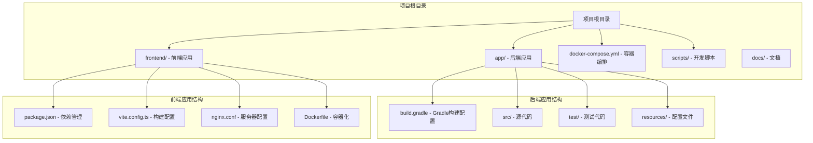
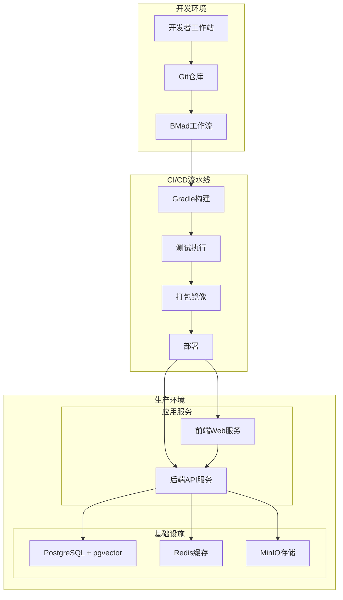
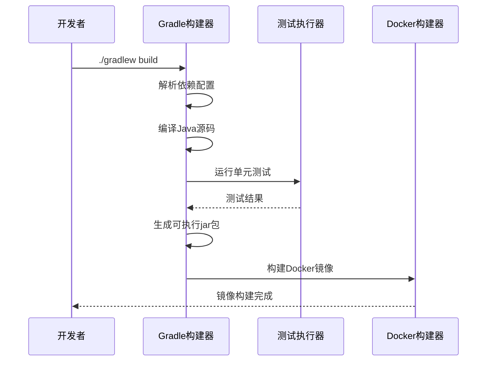
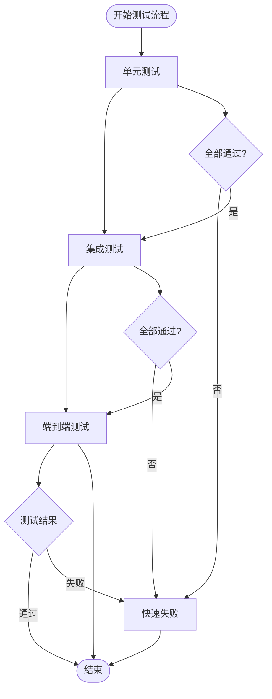
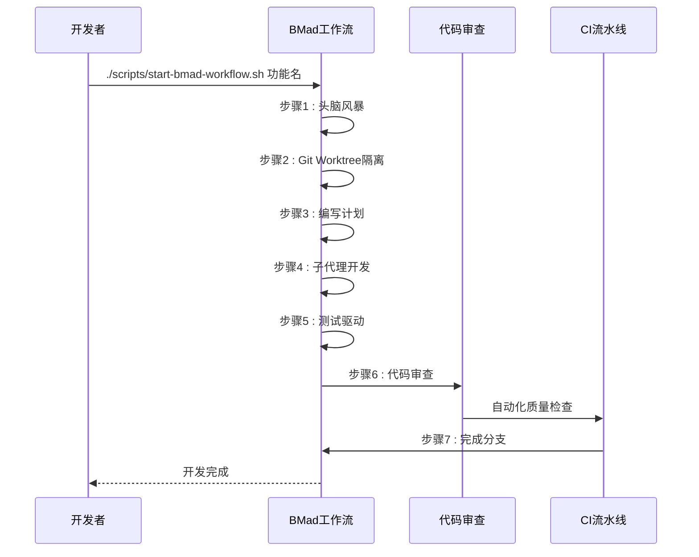
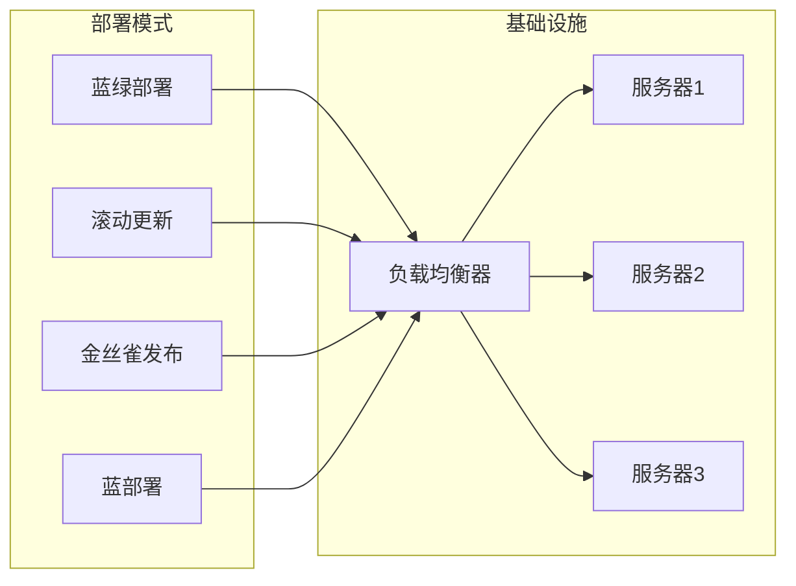
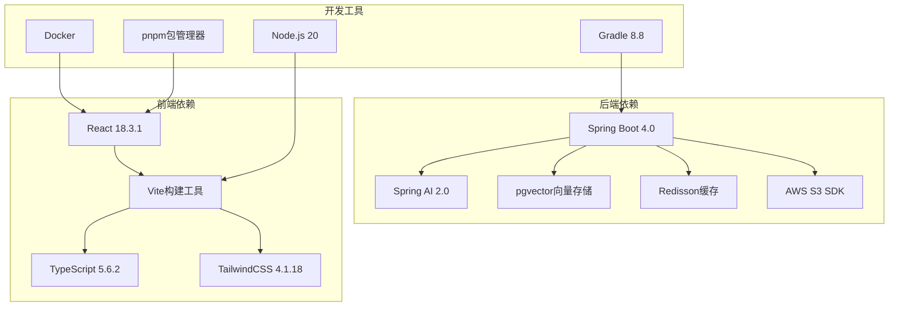

# CI/CD流水线配置

<cite>
**本文档引用的文件**
- [app/build.gradle](file://app/build.gradle)
- [settings.gradle](file://settings.gradle)
- [gradle/libs.versions.toml](file://gradle/libs.versions.toml)
- [frontend/package.json](file://frontend/package.json)
- [frontend/vite.config.ts](file://frontend/vite.config.ts)
- [frontend/nginx.conf](file://frontend/nginx.conf)
- [docker-compose.yml](file://docker-compose.yml)
- [frontend/Dockerfile](file://frontend/Dockerfile)
- [app/Dockerfile](file://app/Dockerfile)
- [scripts/start-bmad-workflow.sh](file://scripts/start-bmad-workflow.sh)
- [scripts/start-code-review.sh](file://scripts/start-code-review.sh)
- [app/src/test/resources/application-test.yml](file://app/src/test/resources/application-test.yml)
- [gradlew.bat](file://gradlew.bat)
</cite>

## 目录
1. [简介](#简介)
2. [项目结构](#项目结构)
3. [核心组件](#核心组件)
4. [架构概览](#架构概览)
5. [详细组件分析](#详细组件分析)
6. [依赖关系分析](#依赖关系分析)
7. [性能考虑](#性能考虑)
8. [故障排除指南](#故障排除指南)
9. [结论](#结论)
10. [附录](#附录)

## 简介

面试指南平台是一个基于Spring Boot 4.0 + Java 21 + Spring AI 2.0的现代化AI面试辅助系统。本项目采用微服务架构，包含后端Spring Boot应用、前端React应用以及完整的容器化部署方案。

该项目的核心特色包括：
- **AI集成**：支持多种大语言模型提供商（阿里云DashScope、LM Studio等）
- **RAG检索增强**：基于pgvector的向量数据库支持
- **多模态交互**：语音面试、实时字幕、音频录制等功能
- **容器化部署**：完整的Docker Compose部署方案
- **自动化开发**：基于BMad工作流的7步标准化开发流程

## 项目结构

项目采用多模块架构设计，主要包含以下核心组件：

**图表来源**
- [settings.gradle:1-24](file://settings.gradle#L1-L24)
- [app/build.gradle:1-136](file://app/build.gradle#L1-L136)
- [frontend/package.json:1-47](file://frontend/package.json#L1-L47)

**章节来源**
- [settings.gradle:1-24](file://settings.gradle#L1-L24)
- [app/build.gradle:1-136](file://app/build.gradle#L1-L136)
- [frontend/package.json:1-47](file://frontend/package.json#L1-L47)

## 核心组件

### 后端构建系统

后端采用Gradle构建系统，支持多模块项目管理。核心配置包括：

**依赖管理策略**：
- 使用libs.versions.toml统一管理版本号
- 采用BOM（Bill of Materials）确保Spring AI相关组件版本一致性
- 支持阿里云镜像源加速依赖下载

**Java配置**：
- 目标Java版本：21
- 全局UTF-8编码设置
- JUnit 5测试框架集成

**核心依赖**：
- Spring Boot Starter Web MVC
- Spring AI 2.0 + OpenAI兼容模式
- PostgreSQL + pgvector向量存储
- Redisson分布式缓存
- iText PDF导出
- AWS S3 SDK

**章节来源**
- [app/build.gradle:23-87](file://app/build.gradle#L23-L87)
- [gradle/libs.versions.toml:1-30](file://gradle/libs.versions.toml#L1-L30)
- [settings.gradle:8-24](file://settings.gradle#L8-L24)

### 前端构建系统

前端采用Vite + React + TypeScript技术栈，配置了现代化的构建优化：

**构建优化**：
- 代码分割：将React生态、UI组件库、语法高亮等分别打包
- WASM支持：优化机器学习推理性能
- 顶层await：简化异步代码处理

**开发体验**：
- 热重载开发服务器
- 代理配置到后端API
- SourceMap优化

**章节来源**
- [frontend/package.json:6-44](file://frontend/package.json#L6-L44)
- [frontend/vite.config.ts:1-42](file://frontend/vite.config.ts#L1-L42)

### 容器化部署

项目提供了完整的容器化解决方案：

**后端容器配置**：
- 基于Alpine Linux的轻量级镜像
- 多阶段构建优化镜像大小
- 环境变量配置支持

**前端容器配置**：
- Nginx作为静态文件服务器
- 反向代理API请求
- Gzip压缩优化

**服务编排**：
- PostgreSQL + pgvector向量数据库
- Redis分布式缓存
- MinIO对象存储
- 初始化容器自动创建存储桶

**章节来源**
- [app/Dockerfile:1-44](file://app/Dockerfile#L1-L44)
- [frontend/Dockerfile:1-44](file://frontend/Dockerfile#L1-L44)
- [docker-compose.yml:1-197](file://docker-compose.yml#L1-L197)

## 架构概览

面试指南平台采用现代化的微服务架构，支持完整的CI/CD流水线：

**图表来源**
- [scripts/start-bmad-workflow.sh:1-253](file://scripts/start-bmad-workflow.sh#L1-L253)
- [docker-compose.yml:125-186](file://docker-compose.yml#L125-L186)

## 详细组件分析

### Gradle构建流程

后端应用的构建流程经过精心设计，支持高效的增量构建和测试执行：

**图表来源**
- [app/build.gradle:100-102](file://app/build.gradle#L100-L102)
- [gradlew.bat:1-93](file://gradlew.bat#L1-L93)

**构建配置特点**：
- **依赖解析**：使用阿里云镜像源加速下载
- **编译优化**：UTF-8编码设置，Java 21工具链
- **测试集成**：JUnit 5平台，测试任务配置
- **环境注入**：支持.env文件环境变量注入

**章节来源**
- [app/build.gradle:15-21](file://app/build.gradle#L15-L21)
- [app/build.gradle:96-102](file://app/build.gradle#L96-L102)
- [app/build.gradle:106-135](file://app/build.gradle#L106-L135)

### 测试集成策略

项目实现了多层次的测试策略，确保代码质量和系统稳定性：

**图表来源**
- [app/src/test/resources/application-test.yml:1-165](file://app/src/test/resources/application-test.yml#L1-L165)

**测试配置分析**：
- **H2内存数据库**：用于快速单元测试执行
- **Redis配置**：本地Redis连接设置
- **AI服务模拟**：DashScope API密钥和模型配置
- **存储配置**：MinIO本地存储模拟
- **CORS配置**：前端开发环境跨域支持

**章节来源**
- [app/src/test/resources/application-test.yml:4-94](file://app/src/test/resources/application-test.yml#L4-L94)

### BMad工作流配置

项目集成了完整的BMad（7步标准化开发流程），提供自动化代码审查和质量门禁：

**图表来源**
- [scripts/start-bmad-workflow.sh:54-235](file://scripts/start-bmad-workflow.sh#L54-L235)

**工作流特点**：
- **7步标准化流程**：从头脑风暴到完成分支
- **Git Worktree隔离**：确保开发环境独立性
- **AI辅助开发**：子代理驱动的智能开发
- **三层代码审查**：盲审猎人、边界案例猎人、验收审计员
- **质量门禁**：自动化测试和代码质量检查

**章节来源**
- [scripts/start-bmad-workflow.sh:18-28](file://scripts/start-bmad-workflow.sh#L18-L28)
- [scripts/start-bmad-workflow.sh:182-235](file://scripts/start-bmad-workflow.sh#L182-L235)

### 部署策略实现

项目支持多种部署模式，可根据环境需求选择合适的部署策略：

**部署配置分析**：
- **Docker Compose编排**：支持多服务协调部署
- **健康检查**：数据库、缓存、存储服务的健康状态监控
- **环境变量**：支持动态配置管理
- **数据持久化**：使用Docker卷确保数据安全

**章节来源**
- [docker-compose.yml:13-35](file://docker-compose.yml#L13-L35)
- [docker-compose.yml:140-170](file://docker-compose.yml#L140-L170)

## 依赖关系分析

项目的依赖关系复杂但清晰，体现了现代化的软件工程实践：

**图表来源**
- [app/build.gradle:24-81](file://app/build.gradle#L24-L81)
- [frontend/package.json:11-44](file://frontend/package.json#L11-L44)

**依赖管理策略**：
- **版本统一**：通过libs.versions.toml集中管理
- **BOM使用**：Spring AI相关组件版本对齐
- **镜像加速**：阿里云Maven镜像源
- **开发工具链**：统一的开发环境配置

**章节来源**
- [gradle/libs.versions.toml:3-29](file://gradle/libs.versions.toml#L3-L29)
- [app/build.gradle:15-21](file://app/build.gradle#L15-L21)

## 性能考虑

### 构建性能优化

项目在多个层面进行了性能优化：

**Gradle构建优化**：
- 使用工具链解析器自动下载JDK
- 依赖缓存和增量编译
- 并行构建支持

**前端构建优化**：
- 代码分割减少初始加载时间
- WASM模块优化机器学习推理
- Gzip压缩减少传输体积

**容器化优化**：
- 多阶段构建减小镜像大小
- Alpine Linux基础镜像
- 缓存层优化

### 运行时性能

**数据库性能**：
- pgvector向量索引优化查询
- 连接池配置
- 查询优化策略

**缓存策略**：
- Redis分布式缓存
- 缓存失效策略
- 缓存预热机制

## 故障排除指南

### 常见构建问题

**Gradle构建失败**：
- 检查网络连接和镜像源配置
- 确认Java 21环境设置
- 清理Gradle缓存后重试

**依赖下载超时**：
- 切换到阿里云镜像源
- 检查防火墙设置
- 增加网络超时配置

### 测试执行问题

**H2数据库连接失败**：
- 检查测试配置文件
- 确认内存数据库状态
- 验证DDL自动创建设置

**Redis连接问题**：
- 检查Redis服务状态
- 验证连接配置
- 确认防火墙设置

### 部署问题

**容器启动失败**：
- 检查服务依赖关系
- 验证环境变量配置
- 查看容器日志

**端口冲突**：
- 检查端口占用情况
- 修改端口配置
- 清理僵尸容器

**章节来源**
- [app/build.gradle:106-135](file://app/build.gradle#L106-L135)
- [app/src/test/resources/application-test.yml:6-25](file://app/src/test/resources/application-test.yml#L6-L25)
- [docker-compose.yml:130-170](file://docker-compose.yml#L130-L170)

## 结论

面试指南平台的CI/CD流水线配置展现了现代软件工程的最佳实践。通过集成BMad工作流、自动化测试、容器化部署和多层质量保证，项目建立了高效、可靠的开发和交付体系。

**关键优势**：
- **自动化程度高**：从代码提交到部署的全流程自动化
- **质量保证严格**：多层测试和代码审查确保代码质量
- **部署灵活**：支持多种部署模式适应不同环境需求
- **开发效率高**：标准化的工作流程和工具链提升开发体验

**未来改进方向**：
- 集成更多的自动化安全扫描
- 实施更精细的监控和告警机制
- 优化构建和部署性能
- 扩展测试覆盖范围

## 附录

### 最佳实践清单

**开发阶段**：
- 遵循BMad 7步工作流程
- 实施测试驱动开发
- 定期进行代码审查

**构建阶段**：
- 使用版本化的依赖管理
- 实施增量构建策略
- 优化构建缓存

**测试阶段**：
- 维护测试覆盖率
- 实施自动化测试
- 定期更新测试数据

**部署阶段**：
- 实施蓝绿部署策略
- 建立监控和告警
- 制定回滚预案

### 常见陷阱避免

**版本管理陷阱**：
- 避免版本不一致导致的兼容性问题
- 定期更新依赖版本
- 使用BOM确保组件版本对齐

**性能陷阱**：
- 避免不必要的依赖引入
- 优化构建和部署流程
- 实施合理的缓存策略

**安全陷阱**：
- 定期更新安全补丁
- 实施最小权限原则
- 建立安全扫描机制