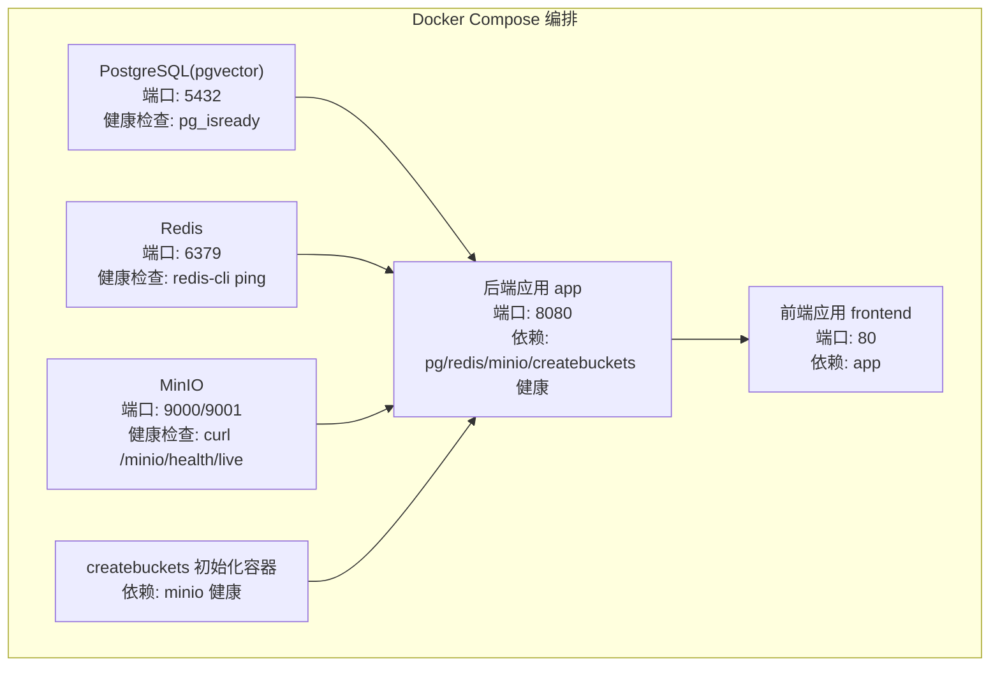
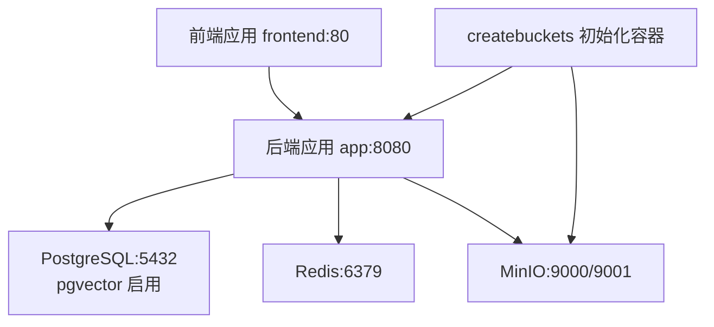
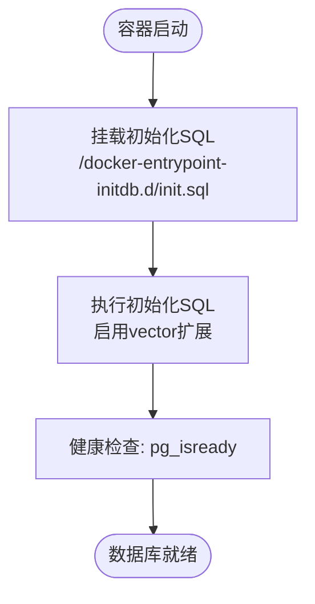
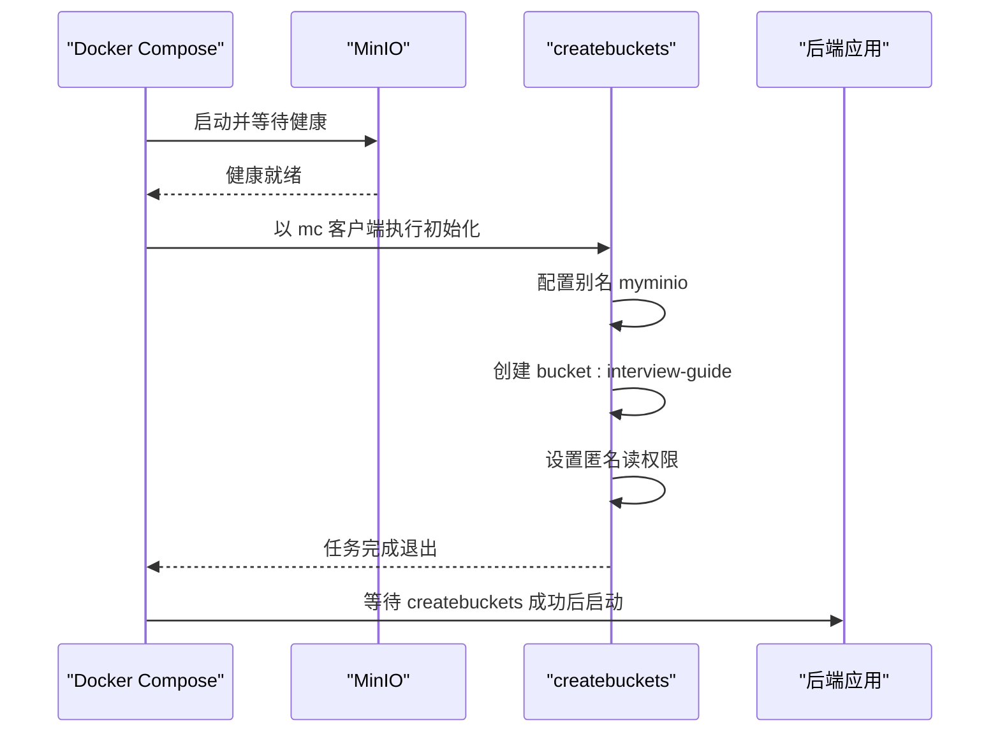
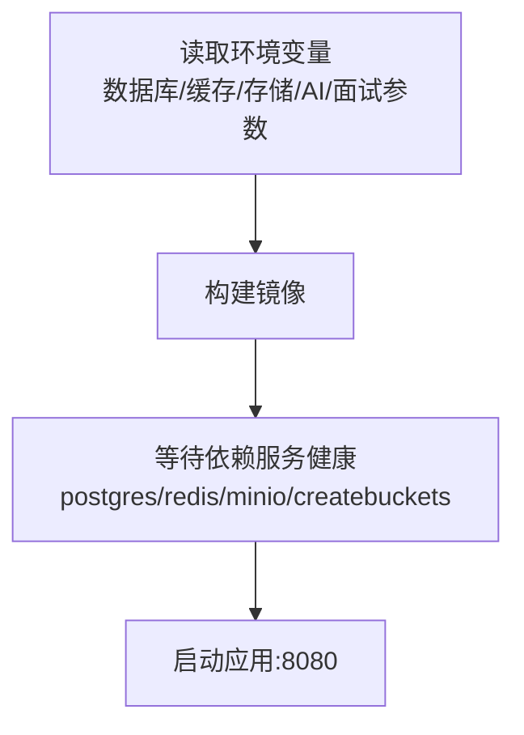
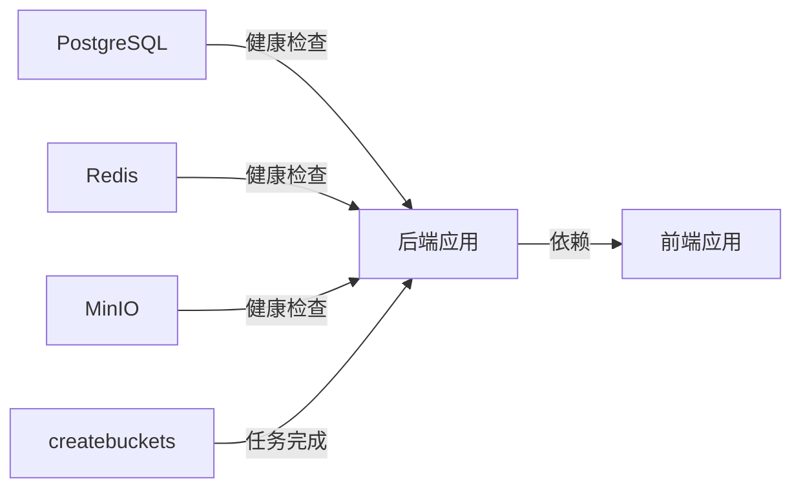

# Docker容器化部署

<cite>
**本文引用的文件**
- [docker-compose.yml](file://docker-compose.yml)
- [docker-compose.dev.yml](file://docker-compose.dev.yml)
- [init.sql](file://docker/postgres/init.sql)
- [Dockerfile（前端）](file://frontend/Dockerfile)
- [README.md](file://README.md)
- [application.yml（后端）](file://app/src/main/resources/application.yml)
</cite>

## 目录
1. [简介](#简介)
2. [项目结构](#项目结构)
3. [核心组件](#核心组件)
4. [架构总览](#架构总览)
5. [详细组件分析](#详细组件分析)
6. [依赖关系分析](#依赖关系分析)
7. [性能考量](#性能考量)
8. [故障排查指南](#故障排查指南)
9. [结论](#结论)
10. [附录](#附录)

## 简介
本文件面向面试指南平台的Docker容器化部署，系统性阐述基于Docker Compose的服务编排实现，涵盖PostgreSQL数据库（pgvector插件）、Redis缓存与消息队列、MinIO对象存储、后端应用与前端应用的配置细节。重点解释初始化容器模式（createbuckets）的实现原理与优势，并提供完整的部署命令、步骤说明、健康检查机制、数据卷挂载与网络配置，以及故障排查与常见问题解决方案。

## 项目结构
- 顶层通过 docker-compose.yml 编排六个服务：PostgreSQL（pgvector）、Redis、MinIO、初始化容器 createbuckets、后端应用 app、前端应用 frontend。
- docker-compose.dev.yml 提供本地开发依赖服务（PostgreSQL、Redis、RustFS），便于快速启动基础设施。
- 前端使用多阶段构建Dockerfile，第一阶段构建静态资源，第二阶段使用Nginx提供服务。
- PostgreSQL通过初始化SQL启用向量扩展，确保RAG检索能力。
- README提供环境变量、部署命令与常用运维命令。

图表来源
- [docker-compose.yml:13-197](file://docker-compose.yml#L13-L197)

章节来源
- [docker-compose.yml:1-197](file://docker-compose.yml#L1-L197)
- [docker-compose.dev.yml:1-64](file://docker-compose.dev.yml#L1-L64)
- [README.md:338-414](file://README.md#L338-L414)

## 核心组件
- PostgreSQL（pgvector）：提供关系型数据与向量检索能力，启用向量扩展以支撑RAG知识库。
- Redis：提供缓存与基于Stream的异步消息队列，支撑简历分析、知识库向量化等异步任务。
- MinIO：提供S3兼容的对象存储，用于简历、头像、知识库文档等非结构化数据存储。
- 初始化容器 createbuckets：基于mc客户端自动创建bucket并设置匿名读权限，实现基础设施即代码。
- 后端应用 app：Spring Boot应用，负责REST API、业务逻辑与异步任务消费。
- 前端应用 frontend：基于Nginx托管的静态站点，提供用户界面与API反向代理。

章节来源
- [docker-compose.yml:13-197](file://docker-compose.yml#L13-L197)
- [init.sql:1-2](file://docker/postgres/init.sql#L1-L2)
- [Dockerfile（前端）:1-44](file://frontend/Dockerfile#L1-L44)

## 架构总览
下图展示容器间依赖与数据流向：后端应用依赖数据库、缓存与对象存储；初始化容器在后端启动前完成MinIO存储桶创建；前端通过反向代理访问后端API。

图表来源
- [docker-compose.yml:13-197](file://docker-compose.yml#L13-L197)

章节来源
- [docker-compose.yml:13-197](file://docker-compose.yml#L13-L197)

## 详细组件分析

### PostgreSQL（pgvector）服务
- 镜像与端口：使用pgvector/pgvector:pg16，暴露5432端口。
- 环境变量：设置数据库用户、密码与默认库名。
- 数据卷：挂载postgres_data，实现数据持久化。
- 初始化脚本：挂载docker/postgres/init.sql，启用vector扩展。
- 健康检查：使用pg_isready检测数据库就绪状态，间隔与重试次数合理设置。

图表来源
- [docker-compose.yml:13-36](file://docker-compose.yml#L13-L36)
- [init.sql:1-2](file://docker/postgres/init.sql#L1-L2)

章节来源
- [docker-compose.yml:13-36](file://docker-compose.yml#L13-L36)
- [init.sql:1-2](file://docker/postgres/init.sql#L1-L2)

### Redis服务
- 镜像与端口：使用redis:7，暴露6379端口。
- 数据卷：挂载redis_data，实现数据持久化。
- 健康检查：使用redis-cli ping，检测服务可用性。

章节来源
- [docker-compose.yml:47-59](file://docker-compose.yml#L47-L59)

### MinIO对象存储服务
- 镜像与命令：使用minio/minio，启动命令指定数据目录与控制台端口。
- 环境变量：设置root用户与密码。
- 端口映射：9000（API）、9001（控制台）。
- 数据卷：挂载minio_data，实现数据持久化。
- 健康检查：对/minio/health/live进行HTTP探测。

章节来源
- [docker-compose.yml:72-90](file://docker-compose.yml#L72-L90)

### 初始化容器（createbuckets）与初始化容器模式
- 触发条件：依赖minio服务健康（service_healthy），并在后端启动前完成任务。
- 任务内容：使用mc客户端配置别名、创建bucket（interview-guide）、设置匿名读权限。
- 优势：将基础设施配置纳入编排，避免手动干预，保证一致性与可重复性。

图表来源
- [docker-compose.yml:102-117](file://docker-compose.yml#L102-L117)

章节来源
- [docker-compose.yml:102-117](file://docker-compose.yml#L102-L117)

### 后端应用服务（Spring Boot）
- 构建方式：基于根目录下的Dockerfile进行构建。
- 依赖关系：严格依赖postgres、redis、minio、createbuckets均处于健康或成功状态。
- 环境变量（关键项）：
  - 数据库：主机、端口、库名、用户、密码。
  - 缓存：主机、端口。
  - 对象存储：endpoint、accessKey、secretKey、bucket、region。
  - AI模型：API Key、模型名称。
  - 面试参数：追问数量、评估批大小。
- 端口映射：8080。

图表来源
- [docker-compose.yml:125-171](file://docker-compose.yml#L125-L171)

章节来源
- [docker-compose.yml:125-171](file://docker-compose.yml#L125-L171)

### 前端应用服务（Nginx）
- 多阶段构建：第一阶段使用node:20-alpine安装依赖并构建；第二阶段使用nginx:alpine托管静态资源。
- 配置：复制自定义nginx.conf至默认配置路径，实现路由转发与API反向代理。
- 端口映射：80。
- 依赖：依赖后端应用启动。

章节来源
- [Dockerfile（前端）:1-44](file://frontend/Dockerfile#L1-L44)
- [docker-compose.yml:179-186](file://docker-compose.yml#L179-L186)

## 依赖关系分析
- 服务依赖：
  - app依赖postgres、redis、minio、createbuckets均健康或成功。
  - frontend依赖app。
- 健康检查：
  - postgres：pg_isready。
  - redis：redis-cli ping。
  - minio：curl探测/minio/health/live。
- 数据卷：
  - postgres_data、redis_data、minio_data用于持久化。

图表来源
- [docker-compose.yml:13-197](file://docker-compose.yml#L13-L197)

章节来源
- [docker-compose.yml:13-197](file://docker-compose.yml#L13-L197)

## 性能考量
- 健康检查间隔与超时应结合容器启动与网络状况调优，避免过短导致误判或过长导致启动延迟。
- MinIO控制台端口仅用于管理，生产环境建议限制访问或通过反向代理暴露。
- 前端Nginx静态托管具备较低资源占用，适合单机部署；如需高并发，可考虑CDN与缓存策略。
- PostgreSQL与Redis的数据卷持久化可减少重启带来的数据丢失风险。

## 故障排查指南
- 数据库未就绪
  - 现象：后端启动报连接失败。
  - 排查：检查postgres健康检查与初始化SQL是否执行；确认环境变量中的用户/密码/库名与compose一致。
  - 参考：健康检查与初始化脚本配置。
- Redis不可达
  - 现象：异步任务队列无法消费或会话缓存失效。
  - 排查：确认redis健康检查；检查网络连通与端口映射。
- MinIO健康检查失败
  - 现象：createbuckets无法执行或后端无法访问对象存储。
  - 排查：确认MinIO控制台端口可达；检查环境变量中的访问凭据与端口映射。
- 初始化容器未创建bucket
  - 现象：后端上传文件报错或无法访问公开资源。
  - 排查：确认createbuckets任务完成；检查mc命令链路与匿名读权限设置。
- 后端日志定位
  - 命令：查看后端日志；检查AI模型API Key、面试参数等环境变量是否正确。
- 常用运维命令
  - 查看服务状态、查看日志、重新构建、停止并移除、清理无用镜像等。

章节来源
- [docker-compose.yml:13-197](file://docker-compose.yml#L13-L197)
- [README.md:424-494](file://README.md#L424-L494)

## 结论
通过Docker Compose编排，面试指南平台实现了数据库、缓存、对象存储、后端与前端的一键部署。初始化容器模式确保了基础设施的自动化配置，提升了部署一致性与可重复性。结合健康检查与数据卷持久化，系统在开发与生产环境中均具备良好的可靠性与可维护性。

## 附录

### 部署步骤与命令
- 前置准备
  - 安装Docker与Docker Compose；申请AI API Key。
- 快速启动
  - 复制并编辑环境变量文件；构建并启动所有服务。
- 仅启动依赖服务
  - 仅启动PostgreSQL、Redis、MinIO与初始化容器，配合本地后端调试。
- 常用运维命令
  - 查看状态、查看日志、重新构建、停止并移除、清理镜像等。

章节来源
- [README.md:344-414](file://README.md#L344-L414)

### 环境变量与配置要点
- 后端关键环境变量（示例路径）
  - 数据库：主机、端口、库名、用户、密码。
  - 缓存：主机、端口。
  - 对象存储：endpoint、accessKey、secretKey、bucket、region。
  - AI模型：API Key、模型名称。
  - 面试参数：追问数量、评估批大小。
- 前端Nginx配置
  - 多阶段构建与自定义nginx.conf用于路由与反向代理。

章节来源
- [docker-compose.yml:140-171](file://docker-compose.yml#L140-L171)
- [Dockerfile（前端）:29-43](file://frontend/Dockerfile#L29-L43)