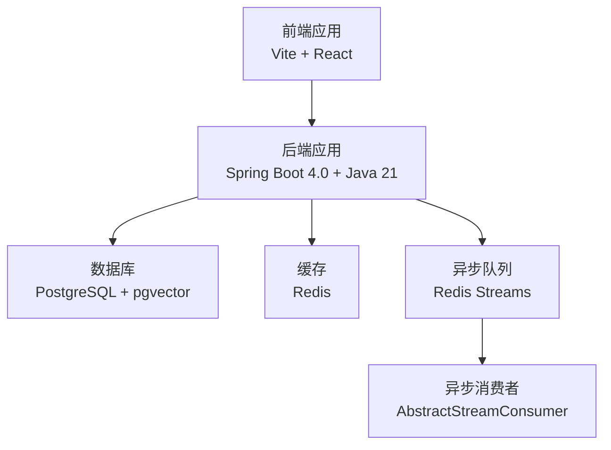
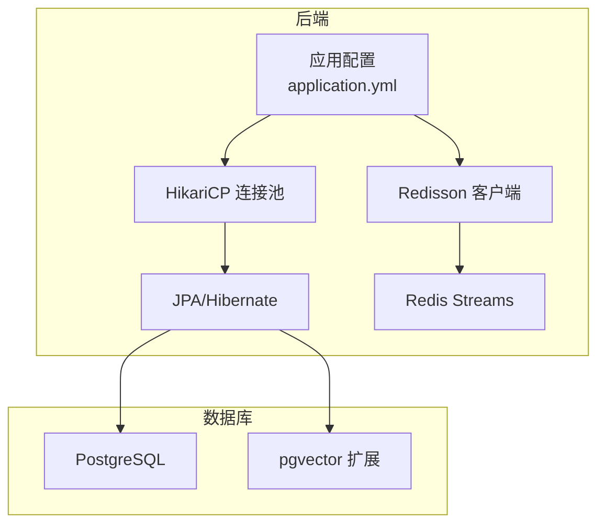
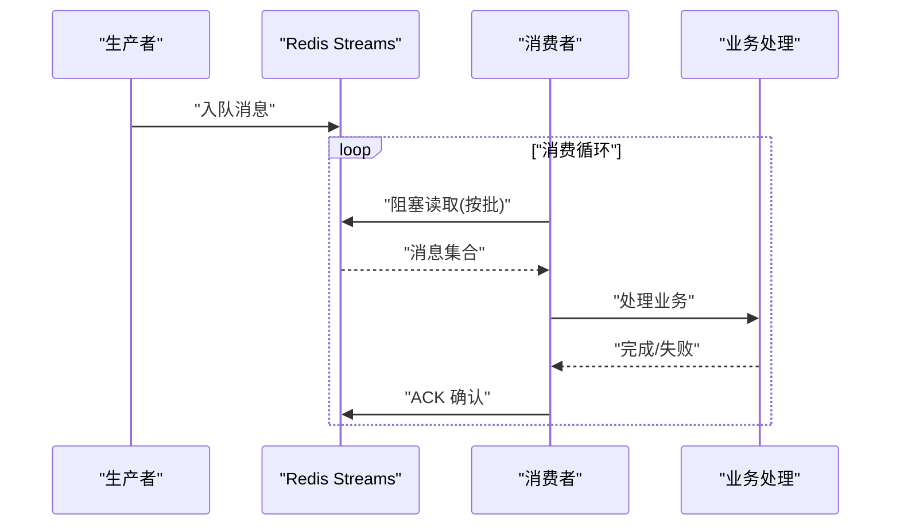
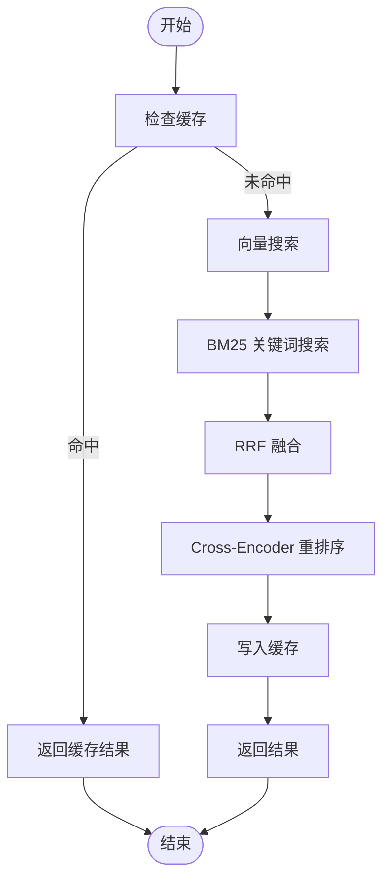
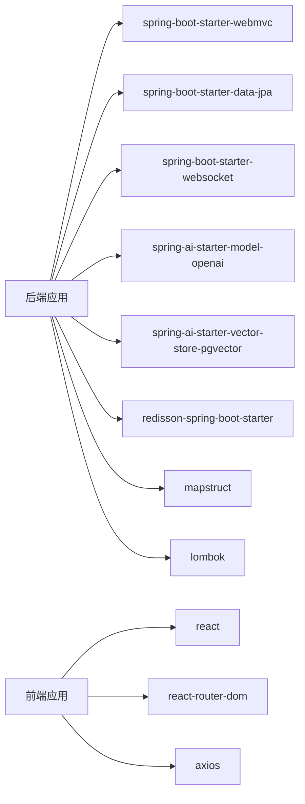

# 性能优化策略

<cite>
**本文引用的文件**
- [application.yml](file://app/src/main/resources/application.yml)
- [init.sql](file://docker/postgres/init.sql)
- [RedisService.java](file://app/src/main/java/interview/guide/infrastructure/redis/RedisService.java)
- [AbstractStreamConsumer.java](file://app/src/main/java/interview/guide/common/async/AbstractStreamConsumer.java)
- [AbstractStreamProducer.java](file://app/src/main/java/interview/guide/common/async/AbstractStreamProducer.java)
- [AsyncTaskStreamConstants.java](file://app/src/main/java/interview/guide/common/constant/AsyncTaskStreamConstants.java)
- [vite.config.ts](file://frontend/vite.config.ts)
- [package.json](file://frontend/package.json)
- [build.gradle](file://app/build.gradle)
- [2026-05-12-rag-search-optimization.md](file://docs/superpowers/plans/2026-05-12-rag-search-optimization.md)
- [RAG_SEARCH_OPTIMIZATION_SUMMARY.md](file://docs/superpowers/plans/RAG_SEARCH_OPTIMIZATION_SUMMARY.md)
</cite>

## 目录
1. [简介](#简介)
2. [项目结构](#项目结构)
3. [核心组件](#核心组件)
4. [架构总览](#架构总览)
5. [详细组件分析](#详细组件分析)
6. [依赖分析](#依赖分析)
7. [性能考量](#性能考量)
8. [故障排查指南](#故障排查指南)
9. [结论](#结论)
10. [附录](#附录)

## 简介
本文件面向面试指南平台的性能优化，围绕以下目标展开：
- JVM 调优：堆内存配置、垃圾回收器选择、性能参数优化
- 数据库性能：查询优化、索引策略、连接池配置、pgvector 向量查询优化
- 缓存策略：Redis 缓存配置、缓存失效策略、缓存穿透防护
- 前端性能：静态资源优化、代码分割与懒加载
- 异步处理：Redis Stream 性能调优与批量策略
- 性能测试与诊断：方法、工具与流程

## 项目结构
系统由后端 Spring Boot 应用、前端 Vite 应用、PostgreSQL + pgvector 向量存储、Redis 缓存与异步队列组成。后端通过 HikariCP 连接池访问数据库，使用 Redisson 操作 Redis，采用虚拟线程提升 I/O 密集型并发能力。

图示来源
- [application.yml:49-124](file://app/src/main/resources/application.yml#L49-L124)
- [RedisService.java:202-327](file://app/src/main/java/interview/guide/infrastructure/redis/RedisService.java#L202-L327)
- [vite.config.ts:1-42](file://frontend/vite.config.ts#L1-L42)

章节来源
- [application.yml:9-282](file://app/src/main/resources/application.yml#L9-L282)
- [build.gradle:1-136](file://app/build.gradle#L1-L136)
- [vite.config.ts:1-42](file://frontend/vite.config.ts#L1-L42)

## 核心组件
- 应用配置与运行参数：服务器线程、Tomcat 参数、虚拟线程、连接池、JPA 批处理、AI 与向量存储配置
- Redisson 缓存与流队列：键值、哈希、分布式锁、Stream 操作
- 异步任务模板：生产者/消费者基类，统一重试、ACK、生命周期管理
- 前端构建与代理：代码分割、插件、开发代理

章节来源
- [application.yml:9-282](file://app/src/main/resources/application.yml#L9-L282)
- [RedisService.java:1-395](file://app/src/main/java/interview/guide/infrastructure/redis/RedisService.java#L1-L395)
- [AbstractStreamConsumer.java:1-176](file://app/src/main/java/interview/guide/common/async/AbstractStreamConsumer.java#L1-L176)
- [AbstractStreamProducer.java:1-55](file://app/src/main/java/interview/guide/common/async/AbstractStreamProducer.java#L1-L55)
- [vite.config.ts:1-42](file://frontend/vite.config.ts#L1-L42)

## 架构总览
后端通过虚拟线程与 HikariCP 连接池提升 I/O 并发与数据库连接效率；Redisson 提供缓存、分布式锁与 Stream 队列；pgvector 用于向量检索；前端通过 Vite 进行代码分割与开发代理。

图示来源
- [application.yml:49-124](file://app/src/main/resources/application.yml#L49-L124)
- [init.sql:1-2](file://docker/postgres/init.sql#L1-L2)
- [RedisService.java:202-327](file://app/src/main/java/interview/guide/infrastructure/redis/RedisService.java#L202-L327)

## 详细组件分析

### JVM 与运行时参数优化
- 虚拟线程启用：在 Java 21+ 环境下启用虚拟线程，显著提升 I/O 密集型并发（如 AI 调用、SSE、WebSocket）
- Tomcat 线程与队列：合理设置最大工作线程、最小空闲线程、等待队列长度与最大连接数，避免线程饥饿与连接积压
- 编码与日志：强制 UTF-8 编码，避免控制台与日志乱码
- Gradle bootRun 注入 JVM 编码参数，确保开发环境一致性

建议
- 生产环境根据 CPU 核心数与负载峰值，动态调整 Tomcat 线程上限与队列长度
- 结合压测观察线程池饱和与队列长度，避免长时间排队导致延迟放大

章节来源
- [application.yml:42-47](file://app/src/main/resources/application.yml#L42-L47)
- [application.yml:9-25](file://app/src/main/resources/application.yml#L9-L25)
- [build.gradle:106-135](file://app/build.gradle#L106-L135)

### 数据库性能优化（PostgreSQL + pgvector）
- 连接池配置：HikariCP 最大池大小、最小空闲、连接超时、空闲与生命周期，适配虚拟线程与 I/O 场景
- Hibernate/JPA 优化：禁用 Open-in-View、批量插入/更新顺序优化、批处理大小
- pgvector 向量检索：HNSW 索引、余弦距离、维度与初始化开关；生产环境建议关闭自动 schema 初始化
- 扩展加载：启动时加载 vector 扩展

建议
- 为高频查询建立复合索引与覆盖索引，避免回表
- 使用 EXPLAIN 分析慢查询，优先优化全表扫描与大结果集
- 合理设置批处理大小，平衡吞吐与内存占用

章节来源
- [application.yml:49-78](file://app/src/main/resources/application.yml#L49-L78)
- [application.yml:116-124](file://app/src/main/resources/application.yml#L116-L124)
- [init.sql:1-2](file://docker/postgres/init.sql#L1-L2)

### 缓存策略设计与实现（Redis）
- Redisson 配置：单机地址、密码、数据库、连接池大小、订阅连接池大小
- 基础缓存：键值设置/获取、TTL、存在性检查、删除
- 懒加载缓存：不存在时通过 loader 加载并缓存，降低后端压力
- 分布式锁：可中断、公平锁、租约时间控制，避免死锁
- Stream 消息队列：阻塞读取、消费者组、ACK、自动裁剪、长度限制

建议
- TTL 设计：热点数据短 TTL，冷数据长 TTL 或无 TTL
- 缓存穿透：对空结果也进行短 TTL 缓存；结合布隆过滤器（可选）
- 缓存雪崩：随机 TTL 偏移；热点键加互斥锁
- Stream 消费：合理设置批大小与轮询间隔，避免频繁唤醒

章节来源
- [application.yml:87-98](file://app/src/main/resources/application.yml#L87-L98)
- [RedisService.java:35-100](file://app/src/main/java/interview/guide/infrastructure/redis/RedisService.java#L35-L100)
- [RedisService.java:146-200](file://app/src/main/java/interview/guide/infrastructure/redis/RedisService.java#L146-L200)
- [RedisService.java:204-327](file://app/src/main/java/interview/guide/infrastructure/redis/RedisService.java#L204-L327)

### 异步处理优化（Redis Streams）
- 模板基类：统一消费者组创建、生命周期管理、ACK、重试与失败标记
- 批量策略：固定批大小、轮询间隔、Stream 最大长度裁剪
- 常量配置：知识库向量化、简历分析、面试评估、语音面试评估等任务的 Stream Key、消费者组与字段

建议
- 根据任务耗时与并发，调整批大小与轮询间隔
- 对失败任务进行指数退避或独立死信队列
- 监控 Stream 长度与 ACK 延迟，避免堆积

图示来源
- [AbstractStreamConsumer.java:74-123](file://app/src/main/java/interview/guide/common/async/AbstractStreamConsumer.java#L74-L123)
- [AbstractStreamProducer.java:22-36](file://app/src/main/java/interview/guide/common/async/AbstractStreamProducer.java#L22-L36)
- [AsyncTaskStreamConstants.java:33-45](file://app/src/main/java/interview/guide/common/constant/AsyncTaskStreamConstants.java#L33-L45)

章节来源
- [AbstractStreamConsumer.java:1-176](file://app/src/main/java/interview/guide/common/async/AbstractStreamConsumer.java#L1-L176)
- [AbstractStreamProducer.java:1-55](file://app/src/main/java/interview/guide/common/async/AbstractStreamProducer.java#L1-L55)
- [AsyncTaskStreamConstants.java:1-135](file://app/src/main/java/interview/guide/common/constant/AsyncTaskStreamConstants.java#L1-L135)

### 前端性能优化（Vite + React）
- 代码分割：按 vendor 与功能模块拆分，减少首屏体积
- 插件：WASM 与顶层 await 优化，按需加载大型依赖
- 开发代理：将 /api 代理至后端，避免跨域与开发调试成本
- 依赖：React 生态与 UI 组件库，注意按需引入与 Tree Shaking

建议
- 静态资源：开启压缩与缓存；CDN 分发
- 图片与媒体：WebP/AVIF、懒加载、尺寸与格式优化
- 路由懒加载：页面级路由按需加载
- 预加载：关键路径资源预加载，非关键资源预取

章节来源
- [vite.config.ts:1-42](file://frontend/vite.config.ts#L1-L42)
- [package.json:1-47](file://frontend/package.json#L1-L47)

### RAG 搜索优化（向量 + 关键词 + 重排序）
- 混合搜索：向量 + BM25 融合（RRF），提升召回与相关性
- 重排序：Cross-Encoder 精排，提高排序质量
- 缓存：Redis 缓存热门查询结果，降低重复请求开销
- 监控：Micrometer 计时器记录各阶段耗时，统计热门查询

建议
- TopK 与最小分数阈值：根据业务调参，平衡召回与质量
- 并发与延迟：压测 P95 延迟，确保用户体验
- 指标看板：结合监控系统可视化搜索性能

图示来源
- [2026-05-12-rag-search-optimization.md:868-914](file://docs/superpowers/plans/2026-05-12-rag-search-optimization.md#L868-L914)
- [RAG_SEARCH_OPTIMIZATION_SUMMARY.md:182-232](file://docs/superpowers/plans/RAG_SEARCH_OPTIMIZATION_SUMMARY.md#L182-L232)

章节来源
- [2026-05-12-rag-search-optimization.md:1-1091](file://docs/superpowers/plans/2026-05-12-rag-search-optimization.md#L1-L1091)
- [RAG_SEARCH_OPTIMIZATION_SUMMARY.md:182-232](file://docs/superpowers/plans/RAG_SEARCH_OPTIMIZATION_SUMMARY.md#L182-L232)

## 依赖分析
- 后端依赖：Spring Web MVC、Validation、Data JPA、WebSocket、Spring AI（OpenAI 兼容与 pgvector）、Redisson、iText、AWS S3 SDK、MapStruct、Lombok、Tika、SpringDoc
- 前端依赖：React、React Router、Axios、Day.js、ONNX Runtime Web、TailwindCSS、Recharts、Framer Motion 等

图示来源
- [build.gradle:23-87](file://app/build.gradle#L23-L87)
- [package.json:11-28](file://frontend/package.json#L11-L28)

章节来源
- [build.gradle:1-136](file://app/build.gradle#L1-L136)
- [package.json:1-47](file://frontend/package.json#L1-L47)

## 性能考量
- JVM 与线程：虚拟线程适用于高并发 I/O；结合压测确定线程上限与队列长度
- 数据库：连接池大小与生命周期、Hibernate 批处理、索引与覆盖索引、EXPLAIN 分析
- 缓存：TTL 策略、穿透与雪崩防护、Stream 长度裁剪与 ACK 延迟监控
- 异步：批大小与轮询间隔、重试策略、死信队列
- 前端：代码分割、懒加载、资源压缩与 CDN、代理与跨域优化
- 搜索：混合检索、RRF 融合、重排序、缓存与监控

## 故障排查指南
- Redis 服务端阻塞读取异常：处理 Redisson 版本的强转异常，静默无消息场景
- Stream 消费异常：检查消费者组创建、ACK 失败、重试次数上限
- 数据库连接超时：检查 HikariCP 连接池参数与最大生命周期
- 前端代理无效：确认 Vite 代理配置与后端端口一致

章节来源
- [RedisService.java:244-248](file://app/src/main/java/interview/guide/infrastructure/redis/RedisService.java#L244-L248)
- [AbstractStreamConsumer.java:85-92](file://app/src/main/java/interview/guide/common/async/AbstractStreamConsumer.java#L85-L92)
- [application.yml:55-61](file://app/src/main/resources/application.yml#L55-L61)
- [vite.config.ts:27-32](file://frontend/vite.config.ts#L27-L32)

## 结论
通过虚拟线程、合理的连接池与批处理、Redis 缓存与 Stream 异步、pgvector 向量检索与混合搜索优化，以及前端代码分割与代理配置，面试指南平台可在高并发与复杂 AI 交互场景下获得稳定且可预期的性能表现。建议持续以监控与压测驱动参数迭代，并结合业务增长趋势动态扩容与优化。

## 附录
- 性能测试方法与工具：JMeter/Locust（后端接口与搜索）、Chrome DevTools（前端）、pgbench（数据库）、Redis Memory Analysis（缓存）
- 诊断流程：采集 GC 日志与线程快照、数据库慢查询日志、Micrometer 指标、Redis Stream 长度与 ACK 延迟