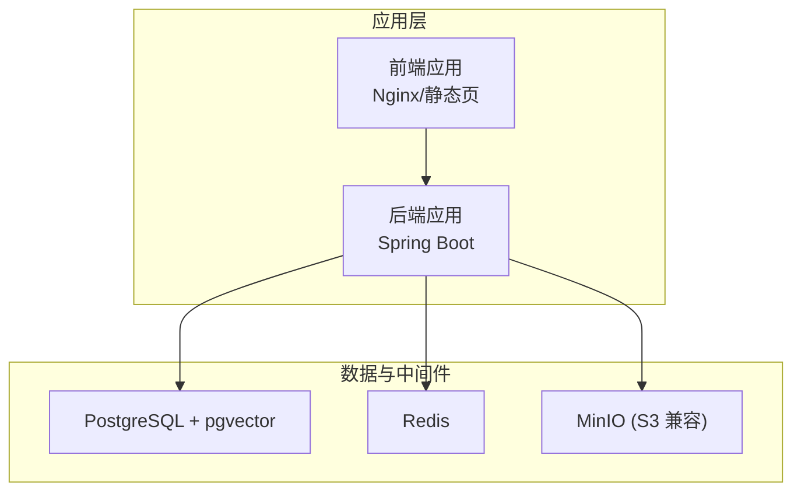
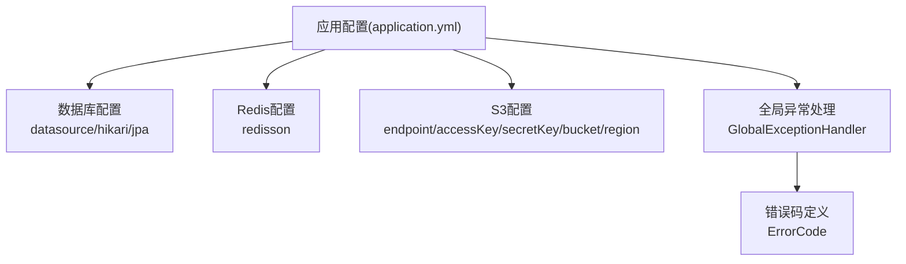
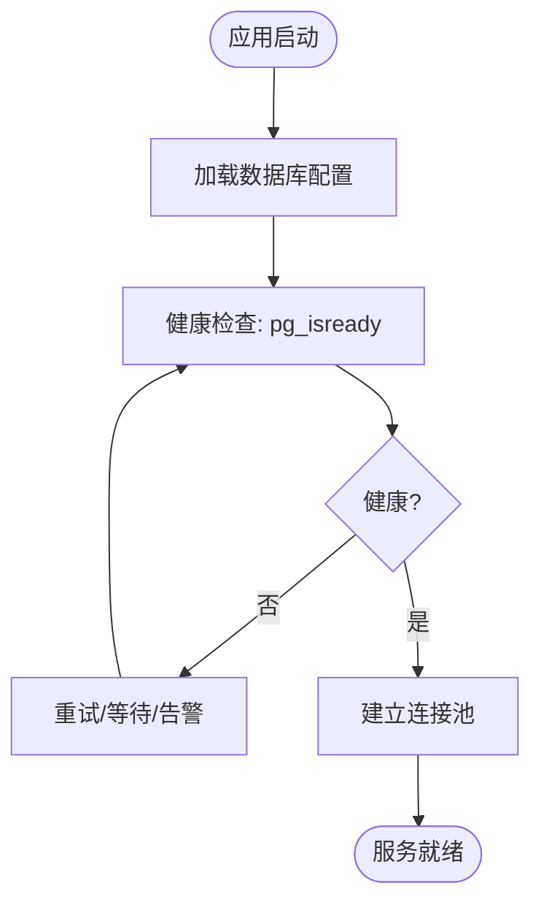
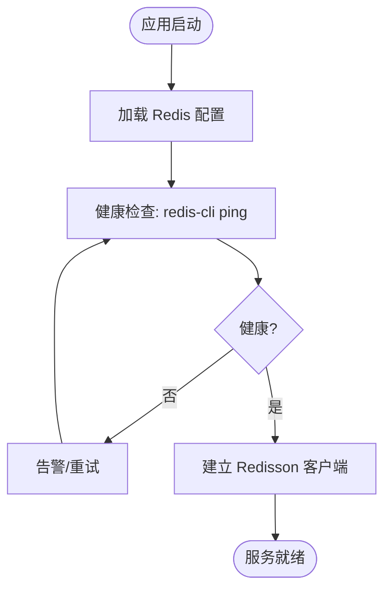
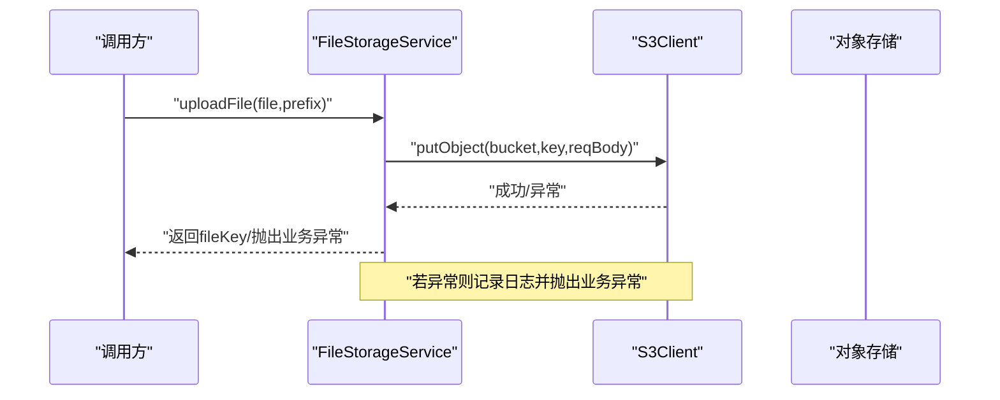
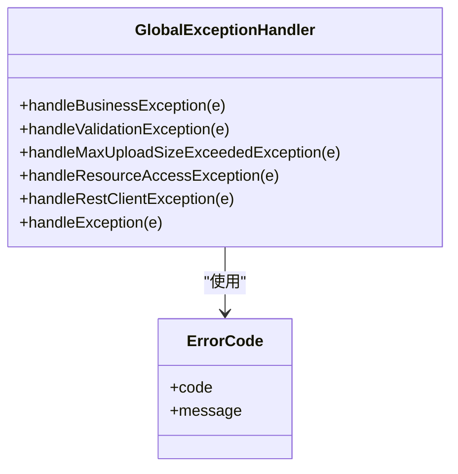
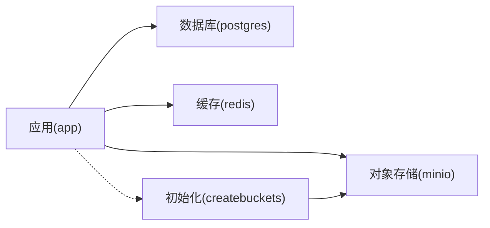

# 故障排查和维护

<cite>
**本文引用的文件**
- [application.yml](file://app/build/resources/main/application.yml)
- [logback-spring.xml](file://app/src/main/resources/logback-spring.xml)
- [S3Config.java](file://app/src/main/java/interview/guide/common/config/S3Config.java)
- [StorageConfigProperties.java](file://app/src/main/java/interview/guide/common/config/StorageConfigProperties.java)
- [FileStorageService.java](file://app/src/main/java/interview/guide/infrastructure/file/FileStorageService.java)
- [GlobalExceptionHandler.java](file://app/src/main/java/interview/guide/common/exception/GlobalExceptionHandler.java)
- [ErrorCode.java](file://app/src/main/java/interview/guide/common/exception/ErrorCode.java)
- [docker-compose.yml](file://docker-compose.yml)
- [docker-compose.dev.yml](file://docker-compose.dev.yml)
- [init.sql](file://docker/postgres/init.sql)
- [App.java](file://app/src/main/java/interview/guide/App.java)
</cite>

## 目录
1. [简介](#简介)
2. [项目结构](#项目结构)
3. [核心组件](#核心组件)
4. [架构总览](#架构总览)
5. [详细组件分析](#详细组件分析)
6. [依赖分析](#依赖分析)
7. [性能考虑](#性能考虑)
8. [故障排查指南](#故障排查指南)
9. [结论](#结论)
10. [附录](#附录)

## 简介
本文件面向面试指南平台的运维与开发团队，提供系统化的故障排查与维护指南。内容覆盖数据库连接问题、Redis连接异常、文件存储访问失败等典型故障的诊断方法；日志分析技巧（日志级别、关键信息提取、定位方法）；性能问题排查流程（慢查询、内存泄漏、并发问题）；系统维护最佳实践（备份、清理、升级）；灾难恢复计划（数据恢复、服务重建、业务连续性）；并提供运维手册模板、应急响应流程与团队协作沟通机制。

## 项目结构
平台采用前后端分离与多服务编排的架构：后端由 Spring Boot 应用提供 API 与业务逻辑；数据库使用 PostgreSQL（带 pgvector 扩展）；缓存与消息队列使用 Redis；对象存储使用 MinIO（兼容 S3）；开发环境亦支持 RustFS 作为对象存储替代。Compose 文件定义了服务间的依赖与健康检查，确保应用在依赖服务就绪后再启动。

图表来源
- [docker-compose.yml:1-197](file://docker-compose.yml#L1-L197)
- [application.yml:48-98](file://app/build/resources/main/application.yml#L48-L98)

章节来源
- [docker-compose.yml:1-197](file://docker-compose.yml#L1-L197)
- [application.yml:1-282](file://app/build/resources/main/application.yml#L1-L282)

## 核心组件
- 配置中心与运行参数
  - 应用配置集中于配置文件，包含数据库、Redis、S3、AI Provider、Tomcat 线程与编码等关键参数。
  - 日志编码统一为 UTF-8，避免终端与文件乱码。
- 异常与错误码体系
  - 全局异常处理器对各类异常进行分类处理，并返回统一的业务错误码，便于前端与监控识别。
- 文件存储服务
  - 基于 S3 客户端封装上传、下载、删除、存在性检查与桶存在性校验，适配 MinIO/RustFS。
- 健康检查与依赖编排
  - Compose 为各服务配置健康检查与启动顺序，确保应用仅在依赖就绪后启动。

章节来源
- [application.yml:4-282](file://app/build/resources/main/application.yml#L4-L282)
- [logback-spring.xml:1-11](file://app/src/main/resources/logback-spring.xml#L1-L11)
- [GlobalExceptionHandler.java:1-161](file://app/src/main/java/interview/guide/common/exception/GlobalExceptionHandler.java#L1-L161)
- [ErrorCode.java:1-81](file://app/src/main/java/interview/guide/common/exception/ErrorCode.java#L1-L81)
- [S3Config.java:1-37](file://app/src/main/java/interview/guide/common/config/S3Config.java#L1-L37)
- [StorageConfigProperties.java:1-21](file://app/src/main/java/interview/guide/common/config/StorageConfigProperties.java#L1-L21)
- [FileStorageService.java:1-280](file://app/src/main/java/interview/guide/infrastructure/file/FileStorageService.java#L1-L280)
- [docker-compose.yml:1-197](file://docker-compose.yml#L1-L197)

## 架构总览
下图展示应用与外部依赖之间的交互关系，以及关键配置项如何影响连接行为。

图表来源
- [application.yml:48-189](file://app/build/resources/main/application.yml#L48-L189)
- [GlobalExceptionHandler.java:23-161](file://app/src/main/java/interview/guide/common/exception/GlobalExceptionHandler.java#L23-L161)
- [ErrorCode.java:11-81](file://app/src/main/java/interview/guide/common/exception/ErrorCode.java#L11-L81)

章节来源
- [application.yml:48-189](file://app/build/resources/main/application.yml#L48-L189)
- [GlobalExceptionHandler.java:23-161](file://app/src/main/java/interview/guide/common/exception/GlobalExceptionHandler.java#L23-L161)
- [ErrorCode.java:11-81](file://app/src/main/java/interview/guide/common/exception/ErrorCode.java#L11-L81)

## 详细组件分析

### 数据库连接组件
- 关键配置
  - 数据源 URL、用户名、密码、驱动类名
  - Hikari 连接池参数（最大池大小、最小空闲、连接超时、空闲超时、最大生命周期、自动提交）
  - JPA/Hibernate 参数（DDL 策略、OpenInView、SQL 输出、批处理大小、插入/更新排序）
- 健康检查
  - Compose 使用 pg_isready 检测数据库可用性
- 常见问题与定位
  - 连接超时：检查连接池超时与最大连接数，确认数据库负载与网络延迟
  - DDL 策略：开发环境 update，生产环境建议改为受控迁移
  - OpenInView：关闭以避免虚拟线程场景下连接被长期占用

图表来源
- [docker-compose.yml:31-35](file://docker-compose.yml#L31-L35)
- [application.yml:48-78](file://app/build/resources/main/application.yml#L48-L78)

章节来源
- [application.yml:48-78](file://app/build/resources/main/application.yml#L48-L78)
- [docker-compose.yml:29-35](file://docker-compose.yml#L29-L35)

### Redis 连接组件
- 关键配置
  - Redisson 单机地址、密码、数据库索引、连接池大小、订阅连接池大小
- 健康检查
  - Compose 使用 redis-cli ping 检测
- 常见问题与定位
  - 连接失败：核对地址、端口、密码与网络连通性
  - 连接池耗尽：增大连接池或优化使用（批量、连接复用）
  - Stream 异步任务堆积：检查消费者处理速度与分区数量

图表来源
- [docker-compose.yml:54-58](file://docker-compose.yml#L54-L58)
- [application.yml:86-98](file://app/build/resources/main/application.yml#L86-L98)

章节来源
- [application.yml:86-98](file://app/build/resources/main/application.yml#L86-L98)
- [docker-compose.yml:54-58](file://docker-compose.yml#L54-L58)

### 文件存储组件（S3/MinIO/RustFS）
- 关键配置
  - endpoint、accessKey、secretKey、bucket、region
  - S3 客户端强制路径风格访问（forcePathStyle），避免虚拟主机风格导致的 DNS 解析问题
- 核心能力
  - 上传/下载/删除/存在性检查/桶存在性校验
  - 文件名清洗（汉字转拼音、安全字符处理）
- 常见问题与定位
  - 上传失败：检查桶存在性、凭证、网络连通性、对象大小限制
  - 下载失败：确认文件键存在、权限、对象存储健康状态
  - 桶不存在：调用 ensureBucketExists 自动创建

图表来源
- [FileStorageService.java:89-111](file://app/src/main/java/interview/guide/infrastructure/file/FileStorageService.java#L89-L111)
- [S3Config.java:22-35](file://app/src/main/java/interview/guide/common/config/S3Config.java#L22-L35)

章节来源
- [application.yml:182-189](file://app/build/resources/main/application.yml#L182-L189)
- [S3Config.java:1-37](file://app/src/main/java/interview/guide/common/config/S3Config.java#L1-L37)
- [StorageConfigProperties.java:1-21](file://app/src/main/java/interview/guide/common/config/StorageConfigProperties.java#L1-L21)
- [FileStorageService.java:1-280](file://app/src/main/java/interview/guide/infrastructure/file/FileStorageService.java#L1-L280)

### 全局异常处理与错误码
- 全局异常处理器
  - 统一封装业务异常、参数校验异常、文件上传超限、AI 服务网络/调用异常、资源未找到、方法不支持、其他未知异常
  - 返回统一的业务错误码与消息，便于前端与监控识别
- 错误码体系
  - 按模块划分（通用、简历、面试、存储、导出、知识库、AI、限流、面试日程、语音面试）
  - AI 服务错误码覆盖超时、不可用、密钥无效、频率超限等

图表来源
- [GlobalExceptionHandler.java:23-161](file://app/src/main/java/interview/guide/common/exception/GlobalExceptionHandler.java#L23-L161)
- [ErrorCode.java:11-81](file://app/src/main/java/interview/guide/common/exception/ErrorCode.java#L11-L81)

章节来源
- [GlobalExceptionHandler.java:23-161](file://app/src/main/java/interview/guide/common/exception/GlobalExceptionHandler.java#L23-L161)
- [ErrorCode.java:11-81](file://app/src/main/java/interview/guide/common/exception/ErrorCode.java#L11-L81)

## 依赖分析
- 服务间依赖
  - 应用服务依赖数据库、Redis、对象存储健康就绪后启动
  - MinIO 初始化任务在对象存储就绪后创建桶并设置权限
- 外部依赖
  - PostgreSQL（pgvector）、Redis、MinIO（S3 兼容）、AWS S3 SDK、Redisson、Spring AI、iText、DashScope SDK

图表来源
- [docker-compose.yml:125-140](file://docker-compose.yml#L125-L140)
- [docker-compose.yml:102-116](file://docker-compose.yml#L102-L116)

章节来源
- [docker-compose.yml:125-140](file://docker-compose.yml#L125-L140)
- [docker-compose.yml:102-116](file://docker-compose.yml#L102-L116)

## 性能考虑
- 并发与线程
  - 启用虚拟线程（Java 21+），提升 I/O 密集型场景并发能力（AI 调用、SSE 长连接）
  - Tomcat 线程池参数（最大工作线程、最小空闲、等待队列、连接超时、最大并发连接）
- 连接池与数据库
  - HikariCP 连接池参数（最大池大小、最小空闲、连接超时、空闲超时、最大生命周期、自动提交）
  - JPA 批处理与 SQL 优化（batch_size、order_inserts/updates、format_sql）
- 缓存与消息
  - Redisson 连接池大小与订阅连接池大小，结合业务流量调整
- 存储与网络
  - S3 客户端路径风格访问，避免 DNS 解析问题
  - 对象存储健康检查与重试策略

章节来源
- [application.yml:42-46](file://app/build/resources/main/application.yml#L42-L46)
- [application.yml:9-24](file://app/build/resources/main/application.yml#L9-L24)
- [application.yml:54-61](file://app/build/resources/main/application.yml#L54-L61)
- [application.yml:63-78](file://app/build/resources/main/application.yml#L63-L78)
- [application.yml:86-98](file://app/build/resources/main/application.yml#L86-L98)
- [application.yml:182-189](file://app/build/resources/main/application.yml#L182-L189)
- [docker-compose.yml:85-89](file://docker-compose.yml#L85-L89)

## 故障排查指南

### 一、数据库连接问题
- 症状
  - 应用启动阶段卡住或报连接超时
  - 运行中出现获取连接超时、连接泄漏
- 诊断步骤
  - 检查数据库健康检查是否通过（Compose 使用 pg_isready）
  - 核对数据库连接参数（主机、端口、数据库名、用户名、密码）
  - 查看连接池参数（最大池大小、最小空闲、连接超时、空闲超时、最大生命周期）
  - 关注 DDL 策略与 OpenInView 设置
- 处理建议
  - 调整连接池参数以匹配业务并发
  - 生产环境将 DDL 策略改为受控迁移
  - 关闭 OpenInView，避免虚拟线程场景下连接被占用

章节来源
- [docker-compose.yml:31-35](file://docker-compose.yml#L31-L35)
- [application.yml:48-78](file://app/build/resources/main/application.yml#L48-L78)
- [application.yml:63-78](file://app/build/resources/main/application.yml#L63-L78)

### 二、Redis 连接异常
- 症状
  - 应用启动时报 Redis 连接失败
  - 运行中出现连接池耗尽、命令超时
- 诊断步骤
  - 检查 Redis 健康检查（redis-cli ping）
  - 核对 Redis 地址、端口、密码、数据库索引
  - 查看连接池大小与订阅连接池大小
- 处理建议
  - 增大连接池或优化使用（批量、连接复用）
  - 检查消费者处理速度，必要时增加分区或并发

章节来源
- [docker-compose.yml:54-58](file://docker-compose.yml#L54-L58)
- [application.yml:86-98](file://app/build/resources/main/application.yml#L86-L98)

### 三、文件存储访问失败
- 症状
  - 上传/下载/删除失败
  - 文件不存在或桶不存在
- 诊断步骤
  - 检查对象存储健康检查（MinIO live 健康端点）
  - 核对 endpoint、accessKey、secretKey、bucket、region
  - 确认 S3 客户端路径风格访问（forcePathStyle）
  - 使用存在性检查与桶存在性校验
- 处理建议
  - 若桶不存在，调用 ensureBucketExists 自动创建
  - 检查网络连通性与凭证权限
  - 避免虚拟主机风格导致的 DNS 解析失败

章节来源
- [docker-compose.yml:85-89](file://docker-compose.yml#L85-L89)
- [application.yml:182-189](file://app/build/resources/main/application.yml#L182-L189)
- [S3Config.java:22-35](file://app/src/main/java/interview/guide/common/config/S3Config.java#L22-L35)
- [FileStorageService.java:184-201](file://app/src/main/java/interview/guide/infrastructure/file/FileStorageService.java#L184-L201)

### 四、日志分析技巧
- 日志级别与编码
  - 统一 UTF-8 编码，避免控制台乱码
  - Spring Boot 默认日志配置，结合业务日志输出
- 关键信息提取
  - 全局异常处理器记录异常类型与错误码，便于快速定位
  - AI 服务异常区分超时、SSL 握手失败、401/429 等
- 问题定位方法
  - 结合错误码与异常堆栈，定位到具体模块与服务
  - 使用健康检查日志判断依赖服务状态

章节来源
- [logback-spring.xml:1-11](file://app/src/main/resources/logback-spring.xml#L1-L11)
- [GlobalExceptionHandler.java:88-128](file://app/src/main/java/interview/guide/common/exception/GlobalExceptionHandler.java#L88-L128)
- [ErrorCode.java:57-76](file://app/src/main/java/interview/guide/common/exception/ErrorCode.java#L57-L76)

### 五、性能问题排查流程
- 慢查询分析
  - 关注数据库连接池与 Hikari 参数，避免连接争用
  - 检查 JPA 批处理与 SQL 优化配置
- 内存泄漏检测
  - 关注虚拟线程与连接占用，避免 OpenInView 导致的连接泄漏
- 并发问题诊断
  - 检查 Redisson 连接池与订阅连接池
  - 关注 AI 服务调用频率与重试策略

章节来源
- [application.yml:54-61](file://app/build/resources/main/application.yml#L54-L61)
- [application.yml:63-78](file://app/build/resources/main/application.yml#L63-L78)
- [application.yml:86-98](file://app/build/resources/main/application.yml#L86-L98)
- [application.yml:109-115](file://app/build/resources/main/application.yml#L109-L115)

### 六、系统维护最佳实践
- 定期备份策略
  - 数据库：使用容器卷持久化数据，结合数据库导出工具进行周期性备份
  - 对象存储：导出桶内对象至安全位置
- 数据清理
  - 清理过期会话与临时文件，释放存储空间
- 系统升级流程
  - 先在测试环境验证，再滚动更新，确保依赖服务健康检查通过

章节来源
- [docker-compose.yml:193-197](file://docker-compose.yml#L193-L197)
- [docker-compose.dev.yml:60-64](file://docker-compose.dev.yml#L60-L64)

### 七、灾难恢复计划
- 数据恢复
  - 从持久化卷与备份中恢复数据库与对象存储数据
- 服务重建
  - 重新启动依赖服务并通过健康检查，再启动应用
- 业务连续性保障
  - 通过健康检查与启动顺序保证服务有序恢复

章节来源
- [docker-compose.yml:130-140](file://docker-compose.yml#L130-L140)
- [docker-compose.yml:102-116](file://docker-compose.yml#L102-L116)

### 八、运维手册模板与应急响应流程
- 运维手册模板
  - 环境清单、依赖版本、健康检查、启动顺序、备份策略、升级流程、故障分级与处置
- 应急响应流程
  - 发现问题 → 快速定位（日志、健康检查、错误码）→ 分级响应（一级/二级/三级）→ 处置与恢复 → 复盘与改进
- 团队协作沟通机制
  - 建立值班制度、故障升级通道、跨团队协作流程

[本节为概念性内容，不直接分析具体文件]

## 结论
通过明确的配置参数、完善的异常与错误码体系、健壮的依赖编排与健康检查，面试指南平台具备良好的可观测性与可维护性。建议在生产环境中严格执行备份与升级流程，持续优化连接池与并发参数，并完善日志与监控体系，以保障系统的稳定性与业务连续性。

## 附录
- 初始化脚本
  - 数据库初始化脚本位于 docker/postgres/init.sql，用于首次启动时创建表结构与基础数据
- 应用入口
  - Spring Boot 应用入口类位于 App.java，负责应用启动与上下文加载

章节来源
- [init.sql](file://docker/postgres/init.sql)
- [App.java](file://app/src/main/java/interview/guide/App.java)