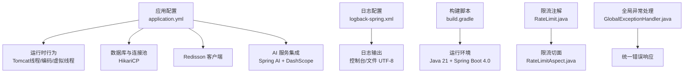
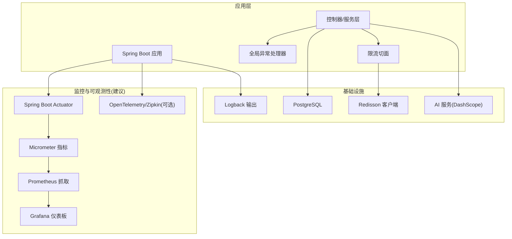
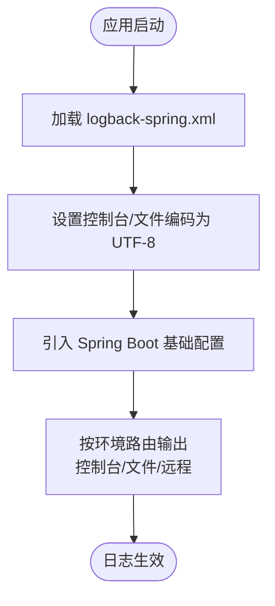
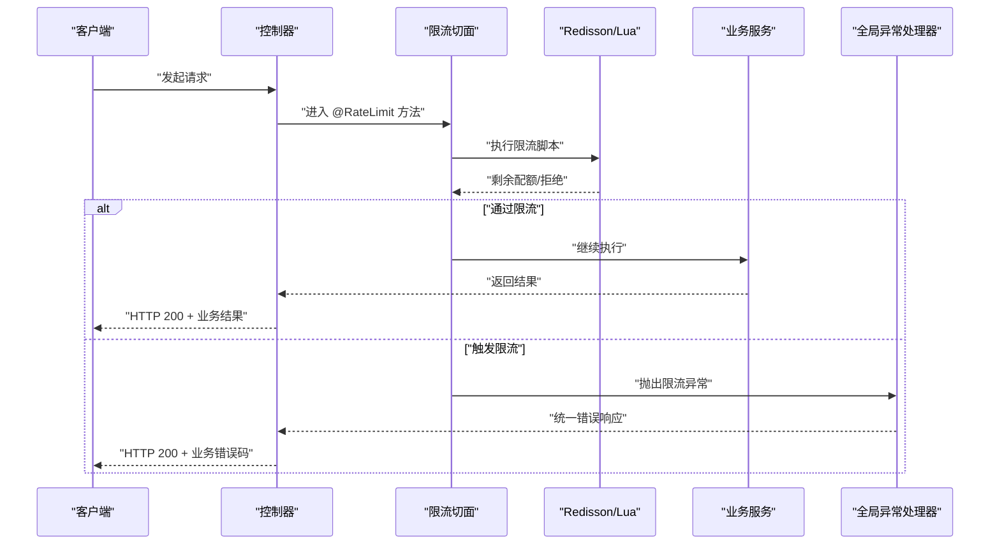
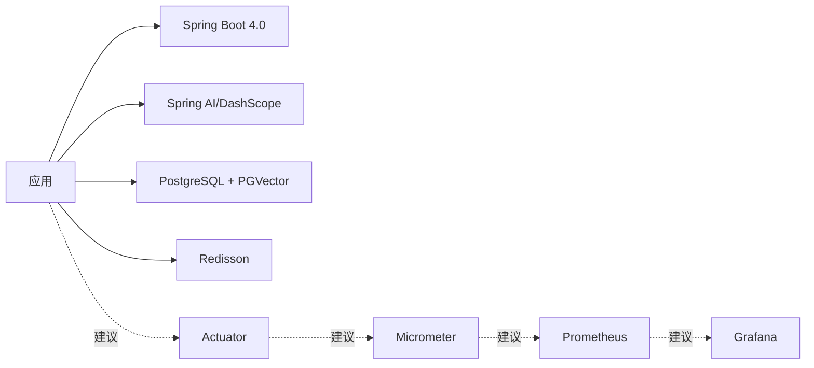

# 监控和日志系统

<cite>
**本文引用的文件**
- [application.yml](file://app/build/resources/main/application.yml)
- [application-test.yml](file://app/src/test/resources/application-test.yml)
- [logback-spring.xml](file://app/src/main/resources/logback-spring.xml)
- [build.gradle](file://app/build.gradle)
- [RateLimit.java](file://app/src/main/java/interview/guide/common/annotation/RateLimit.java)
- [RateLimitAspect.java](file://app/src/main/java/interview/guide/common/aspect/RateLimitAspect.java)
- [GlobalExceptionHandler.java](file://app/src/main/java/interview/guide/common/exception/GlobalExceptionHandler.java)
</cite>

## 目录
1. [简介](#简介)
2. [项目结构](#项目结构)
3. [核心组件](#核心组件)
4. [架构总览](#架构总览)
5. [详细组件分析](#详细组件分析)
6. [依赖关系分析](#依赖关系分析)
7. [性能考量](#性能考量)
8. [故障排查指南](#故障排查指南)
9. [结论](#结论)
10. [附录](#附录)

## 简介
本文件面向面试指南平台，系统性梳理其监控与日志体系现状与改进方向，覆盖以下主题：
- 应用监控：Actuator 配置、健康检查端点与指标采集现状与建议
- 日志系统：Logback 配置、日志格式标准化与多环境管理
- 性能监控：关键指标（响应时间、吞吐量、错误率、资源使用）与采集建议
- 告警配置：阈值设定、规则设计与通知渠道规划
- 分布式追踪：请求链路跟踪与性能瓶颈定位思路
- 监控仪表板：设计要点与关键指标解读方法

说明：当前代码库未集成 Spring Boot Actuator、Micrometer、Prometheus、Grafana、OpenTelemetry 等监控栈组件。本文在“现状”基础上，提供可落地的实施建议与最佳实践。

## 项目结构
与监控和日志相关的核心位置如下：
- 配置文件：application.yml（运行时配置）、application-test.yml（测试配置）
- 日志：logback-spring.xml（日志配置）
- 构建与依赖：build.gradle（运行环境与依赖声明）
- 限流与异常：RateLimit 注解与切面、全局异常处理

**图示来源**
- [application.yml:9-282](file://app/build/resources/main/application.yml#L9-L282)
- [logback-spring.xml:1-11](file://app/src/main/resources/logback-spring.xml#L1-L11)
- [build.gradle:1-136](file://app/build.gradle#L1-L136)
- [RateLimit.java:1-48](file://app/src/main/java/interview/guide/common/annotation/RateLimit.java#L1-L48)
- [RateLimitAspect.java:1-265](file://app/src/main/java/interview/guide/common/aspect/RateLimitAspect.java#L1-L265)
- [GlobalExceptionHandler.java:1-161](file://app/src/main/java/interview/guide/common/exception/GlobalExceptionHandler.java#L1-L161)

**章节来源**
- [application.yml:1-282](file://app/build/resources/main/application.yml#L1-L282)
- [application-test.yml:1-165](file://app/src/test/resources/application-test.yml#L1-L165)
- [logback-spring.xml:1-11](file://app/src/main/resources/logback-spring.xml#L1-L11)
- [build.gradle:1-136](file://app/build.gradle#L1-L136)

## 核心组件
- 日志系统
  - 使用 Logback，显式设置控制台与文件编码为 UTF-8，避免 Windows 终端乱码问题。
  - 引入 Spring Boot 默认基础配置，便于后续扩展输出格式与路由策略。
- 监控与指标
  - 当前未集成 Actuator/Micrometer/Prometheus/Grafana/OpenTelemetry。
  - 可基于现有配置与运行环境，逐步引入指标端点与可视化面板。
- 限流与异常
  - 基于 Redisson 的 Lua 脚本实现高并发限流，支持全局/IP/用户三维度。
  - 全局异常处理器统一返回业务错误码，便于监控侧识别错误类型。

**章节来源**
- [logback-spring.xml:1-11](file://app/src/main/resources/logback-spring.xml#L1-L11)
- [RateLimitAspect.java:1-265](file://app/src/main/java/interview/guide/common/aspect/RateLimitAspect.java#L1-L265)
- [GlobalExceptionHandler.java:1-161](file://app/src/main/java/interview/guide/common/exception/GlobalExceptionHandler.java#L1-L161)

## 架构总览
下图展示监控与日志在系统中的位置与交互：

**图示来源**
- [application.yml:48-124](file://app/build/resources/main/application.yml#L48-L124)
- [build.gradle:23-87](file://app/build.gradle#L23-L87)
- [RateLimitAspect.java:37-41](file://app/src/main/java/interview/guide/common/aspect/RateLimitAspect.java#L37-L41)
- [GlobalExceptionHandler.java:23-161](file://app/src/main/java/interview/guide/common/exception/GlobalExceptionHandler.java#L23-L161)

## 详细组件分析

### 日志系统（Logback）
- 配置要点
  - 控制台与文件编码统一为 UTF-8，解决 Windows 终端中文乱码。
  - 引入 Spring Boot 默认基础配置，便于后续自定义输出格式与级别。
- 多环境管理
  - 开发/测试/生产可通过 Spring Profiles 与外部化配置切换日志级别与输出目标。
  - 建议生产环境启用 JSON 格式日志，便于集中采集与检索。
- 标准化建议
  - 统一日志字段：请求ID、用户ID、模块、方法、耗时、状态码、错误码等。
  - 使用 MDC 注入上下文信息，便于跨模块关联查询。

**图示来源**
- [logback-spring.xml:1-11](file://app/src/main/resources/logback-spring.xml#L1-L11)

**章节来源**
- [logback-spring.xml:1-11](file://app/src/main/resources/logback-spring.xml#L1-L11)

### 限流与异常处理（性能与稳定性）
- 限流实现
  - 基于 Redisson Lua 脚本，原子性更新计数与过期时间，支持多维度限流。
  - 支持降级方法回退，保障在 Redis 故障或脚本失效时仍可降级处理。
- 异常处理
  - 全局异常处理器将底层异常映射为业务错误码，统一返回 HTTP 200 + 业务错误码，利于监控侧统计错误率与类型分布。

**图示来源**
- [RateLimit.java:1-48](file://app/src/main/java/interview/guide/common/annotation/RateLimit.java#L1-L48)
- [RateLimitAspect.java:66-90](file://app/src/main/java/interview/guide/common/aspect/RateLimitAspect.java#L66-L90)
- [GlobalExceptionHandler.java:154-160](file://app/src/main/java/interview/guide/common/exception/GlobalExceptionHandler.java#L154-L160)

**章节来源**
- [RateLimit.java:1-48](file://app/src/main/java/interview/guide/common/annotation/RateLimit.java#L1-L48)
- [RateLimitAspect.java:1-265](file://app/src/main/java/interview/guide/common/aspect/RateLimitAspect.java#L1-L265)
- [GlobalExceptionHandler.java:1-161](file://app/src/main/java/interview/guide/common/exception/GlobalExceptionHandler.java#L1-L161)

### 运行时配置与性能基线
- 服务器与线程
  - Tomcat 线程池参数、连接超时、最大连接数等，结合虚拟线程提升 I/O 并发。
- 数据库与连接池
  - HikariCP 参数针对虚拟线程场景进行优化，避免连接池过大导致 CPU 竞争。
- Redisson
  - 单机配置与连接池大小，满足限流与缓存需求。
- AI 服务
  - OpenAI 兼容模式接入 DashScope，禁用自动重试，异常快速失败，便于监控侧识别。

**章节来源**
- [application.yml:9-282](file://app/build/resources/main/application.yml#L9-L282)

## 依赖关系分析
- 运行环境
  - Java 21 + Spring Boot 4.0，启用虚拟线程，适合高并发 I/O 场景。
- 依赖与集成
  - Spring AI 与 DashScope 集成，PGVector 向量存储，Redisson 限流与缓存。
- 监控栈依赖（建议新增）
  - Spring Boot Actuator、Micrometer、Prometheus、Grafana、OpenTelemetry。

**图示来源**
- [build.gradle:23-87](file://app/build.gradle#L23-L87)
- [application.yml:99-124](file://app/build/resources/main/application.yml#L99-L124)

**章节来源**
- [build.gradle:1-136](file://app/build.gradle#L1-L136)
- [application.yml:99-124](file://app/build/resources/main/application.yml#L99-L124)

## 性能考量
- 关键指标建议
  - 响应时间：P50/P90/P95 延迟，区分接口与服务端点
  - 吞吐量：每秒请求数（QPS），区分成功/失败
  - 错误率：HTTP 5xx、业务错误码分布，AI 服务错误分类
  - 资源使用：CPU、内存、线程池活跃度、数据库连接池利用率、Redis 连接池使用率
- 采集与存储
  - 通过 Micrometer 暴露指标，Prometheus 抓取，Grafana 可视化
  - 采用滚动窗口与直方图统计，支持分位数与错误率计算
- 限流与降级
  - 限流阈值与维度（全局/IP/用户）需结合业务峰值与资源容量评估
  - 降级策略应保证核心路径可用，非关键功能可降级

[本节为通用性能指导，无需特定文件引用]

## 故障排查指南
- 常见问题定位
  - AI 服务异常：区分超时、鉴权失败、频率限制，统一映射为业务错误码
  - 限流触发：检查维度（全局/IP/用户）、配额与周期、降级方法是否生效
  - 日志乱码：确认控制台/文件编码均为 UTF-8
- 建议流程
  - 通过统一错误响应与日志上下文快速定位来源模块
  - 使用限流与异常指标识别热点与异常模式
  - 生产环境启用 JSON 日志，配合集中式日志平台检索

**章节来源**
- [GlobalExceptionHandler.java:88-128](file://app/src/main/java/interview/guide/common/exception/GlobalExceptionHandler.java#L88-L128)
- [RateLimitAspect.java:165-191](file://app/src/main/java/interview/guide/common/aspect/RateLimitAspect.java#L165-L191)
- [logback-spring.xml:1-11](file://app/src/main/resources/logback-spring.xml#L1-L11)

## 结论
- 现状总结
  - 日志系统已具备基础 UTF-8 配置与 Spring Boot 基础输出；监控与指标尚未集成。
  - 限流与异常处理具备基础能力，可作为监控侧观测的重要输入。
- 实施建议
  - 引入 Actuator/Micrometer/Prometheus/Grafana，建立指标体系与仪表板
  - 设计告警规则与通知渠道，覆盖延迟、错误率、资源使用与限流事件
  - 引入分布式追踪（如 OpenTelemetry/Zipkin），实现端到端链路追踪
  - 标准化日志格式与多环境管理，支撑集中式日志采集与检索

[本节为总结性内容，无需特定文件引用]

## 附录

### 建议：监控与日志实施清单
- 监控栈
  - 引入 Actuator 与 Micrometer，暴露 JVM/应用指标
  - 配置 Prometheus 抓取与 Grafana 仪表板
  - 设计关键指标看板：延迟、吞吐、错误率、资源使用
- 告警
  - 延迟：P95 超过阈值持续 N 分钟
  - 错误率：业务错误码占比异常上升
  - 资源：CPU/内存/连接池使用率接近上限
  - 限流：触发次数超过阈值
- 分布式追踪
  - 生成 Trace ID，贯穿请求链路
  - 记录关键步骤耗时，定位瓶颈
- 日志
  - JSON 格式，统一字段
  - 多环境差异化输出与级别
  - 集中式采集与检索

[本节为通用建议，无需特定文件引用]