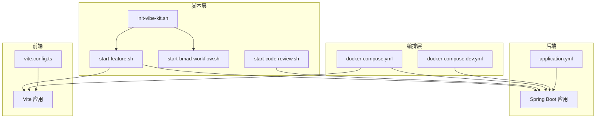
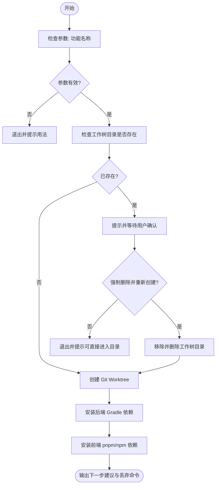
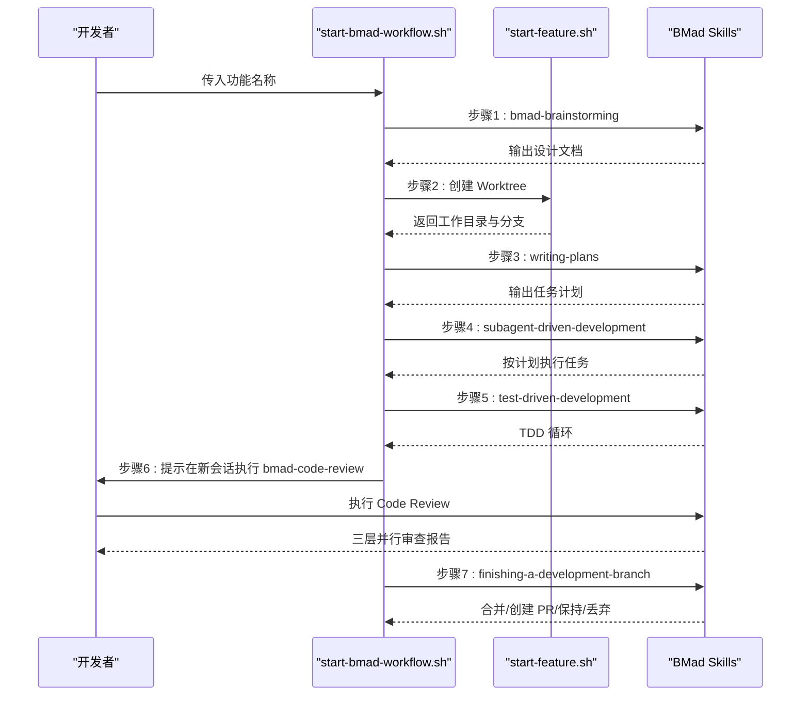
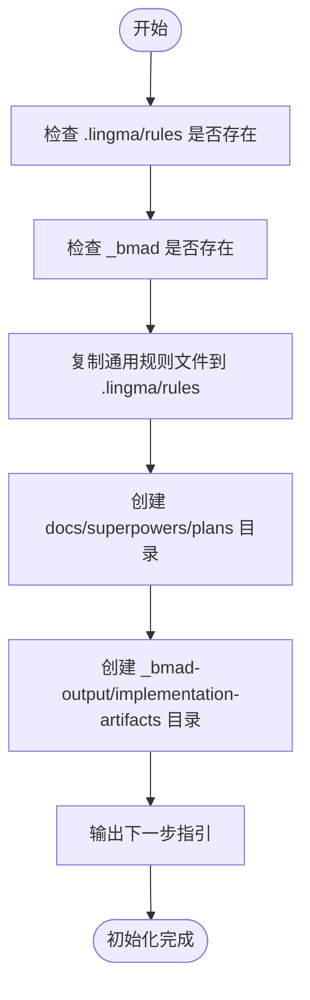
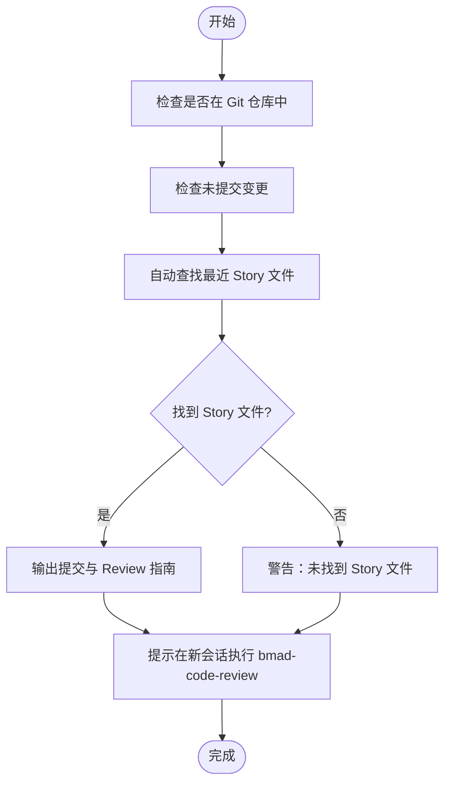
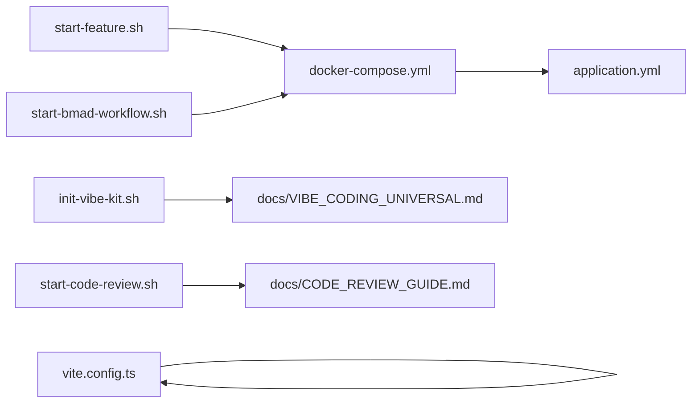

# 运维脚本工具

<cite>
**本文引用的文件**   
- [start-feature.sh](file://scripts/start-feature.sh)
- [start-bmad-workflow.sh](file://scripts/start-bmad-workflow.sh)
- [init-vibe-kit.sh](file://scripts/init-vibe-kit.sh)
- [start-code-review.sh](file://scripts/start-code-review.sh)
- [docker-compose.yml](file://docker-compose.yml)
- [docker-compose.dev.yml](file://docker-compose.dev.yml)
- [README.md](file://README.md)
- [VIBE_CODING_HANDBOOK.md](file://docs/VIBE_CODING_HANDBOOK.md)
- [CODE_REVIEW_GUIDE.md](file://docs/CODE_REVIEW_GUIDE.md)
- [BMAD_SKILL_WORKFLOW.md](file://docs/BMAD_SKILL_WORKFLOW.md)
- [application.yml](file://app/src/main/resources/application.yml)
- [vite.config.ts](file://frontend/vite.config.ts)
- [build.gradle](file://app/build.gradle)
- [package.json](file://frontend/package.json)
</cite>

## 目录
1. [简介](#简介)
2. [项目结构](#项目结构)
3. [核心组件](#核心组件)
4. [架构总览](#架构总览)
5. [详细组件分析](#详细组件分析)
6. [依赖关系分析](#依赖关系分析)
7. [性能考量](#性能考量)
8. [故障排查指南](#故障排查指南)
9. [结论](#结论)
10. [附录](#附录)

## 简介
本文件面向面试指南平台的运维与开发团队，系统化梳理并说明运维脚本工具的职责、使用方法与最佳实践，重点覆盖以下方面：
- 启动脚本：start-feature.sh 如何帮助开发者快速隔离并启动新功能开发环境
- BMad 工作流脚本：start-bmad-workflow.sh 的配置与使用，如何引导 7 步标准化开发流程
- Vibe Kit 初始化脚本：init-vibe-kit.sh 的作用与配置选项
- 运维自动化脚本编写指南：Shell 脚本最佳实践与错误处理机制
- 监控与运维：健康检查、性能监控与备份恢复的实现要点
- 调试与故障排查：脚本调试方法、常见问题定位与修复建议
- 维护与版本管理：脚本维护策略与版本演进建议

## 项目结构
运维脚本集中位于仓库根目录的 scripts/ 目录，配合 Docker Compose 编排与前端/后端配置共同构成可一键启动的开发与生产环境。

```mermaid
graph TB
A["scripts/"] --> A1["start-feature.sh"]
A --> A2["start-bmad-workflow.sh"]
A --> A3["init-vibe-kit.sh"]
A --> A4["start-code-review.sh"]
B["docker-compose.yml"] --> B1["PostgreSQL(pgvector)"]
B --> B2["Redis"]
B --> B3["MinIO(S3)"]
B --> B4["App(Spring Boot)"]
B --> B5["Frontend(Nginx)"]
C["docker-compose.dev.yml"] --> C1["PostgreSQL(pgvector)"]
C --> C2["Redis"]
C --> C3["RustFS(S3)"]
D["app/src/main/resources/application.yml"] --> D1["数据库/缓存/存储配置"]
E["frontend/vite.config.ts"] --> E1["前端代理/构建优化"]
F["app/build.gradle"] --> F1["后端依赖/环境注入"]
G["frontend/package.json"] --> G1["前端依赖/脚本命令"]
```

图表来源
- [docker-compose.yml:1-197](file://docker-compose.yml#L1-L197)
- [docker-compose.dev.yml:1-64](file://docker-compose.dev.yml#L1-L64)
- [application.yml:1-282](file://app/src/main/resources/application.yml#L1-L282)
- [vite.config.ts:1-42](file://frontend/vite.config.ts#L1-L42)
- [build.gradle:1-136](file://app/build.gradle#L1-L136)
- [package.json:1-47](file://frontend/package.json#L1-L47)

章节来源
- [docker-compose.yml:1-197](file://docker-compose.yml#L1-L197)
- [docker-compose.dev.yml:1-64](file://docker-compose.dev.yml#L1-L64)
- [application.yml:1-282](file://app/src/main/resources/application.yml#L1-L282)
- [vite.config.ts:1-42](file://frontend/vite.config.ts#L1-L42)
- [build.gradle:1-136](file://app/build.gradle#L1-L136)
- [package.json:1-47](file://frontend/package.json#L1-L47)

## 核心组件
- 启动脚本：start-feature.sh
  - 作用：为新功能创建 Git Worktree 隔离环境，自动安装后端 Gradle 与前端 pnpm 依赖，输出下一步建议与丢弃命令
  - 关键流程：参数校验 → 工作树存在性检查与交互确认 → 创建/复用工作树 → 安装依赖 → 输出指引
- BMad 工作流脚本：start-bmad-workflow.sh
  - 作用：引导 7 步标准化开发流程，串联头脑风暴、Worktree 隔离、计划编写、子代理开发、TDD、Code Review、完成分支
  - 关键流程：打印流程图 → 步骤 1~7 的交互式引导 → 每步提供 Skill 指令与输出文档位置 → 提示注意事项
- Vibe Kit 初始化脚本：init-vibe-kit.sh
  - 作用：将项目初始化为支持 BMad 7 步工作流的 Vibe Coding 环境，复制通用规则文件，创建文档目录结构
  - 关键流程：检查必要目录 → 复制规则文件 → 创建 docs/superpowers/plans 与 _bmad-output/implementation-artifacts 目录 → 输出下一步指引
- Code Review 启动脚本：start-code-review.sh
  - 作用：在功能开发完成后，准备并提示用户在新会话中执行 Code Review，自动查找最近 Story 文件并输出操作指南
  - 关键流程：Git 仓库校验 → 未提交变更检查 → 自动查找 Story 文件 → 输出提交与 Review 指南 → 说明三层并行审查流程

章节来源
- [start-feature.sh:1-68](file://scripts/start-feature.sh#L1-L68)
- [start-bmad-workflow.sh:1-253](file://scripts/start-bmad-workflow.sh#L1-L253)
- [init-vibe-kit.sh:1-42](file://scripts/init-vibe-kit.sh#L1-L42)
- [start-code-review.sh:1-136](file://scripts/start-code-review.sh#L1-L136)

## 架构总览
下图展示了脚本与系统服务之间的关系，以及脚本在开发与运维中的位置。

图表来源
- [start-feature.sh:1-68](file://scripts/start-feature.sh#L1-L68)
- [start-bmad-workflow.sh:1-253](file://scripts/start-bmad-workflow.sh#L1-L253)
- [init-vibe-kit.sh:1-42](file://scripts/init-vibe-kit.sh#L1-L42)
- [start-code-review.sh:1-136](file://scripts/start-code-review.sh#L1-L136)
- [docker-compose.yml:1-197](file://docker-compose.yml#L1-L197)
- [docker-compose.dev.yml:1-64](file://docker-compose.dev.yml#L1-L64)
- [application.yml:1-282](file://app/src/main/resources/application.yml#L1-L282)
- [vite.config.ts:1-42](file://frontend/vite.config.ts#L1-L42)

## 详细组件分析

### 启动脚本：start-feature.sh
- 功能概述
  - 为新功能创建隔离开发环境，避免污染主分支
  - 自动安装后端 Gradle 与前端 pnpm 依赖
  - 输出下一步建议与丢弃命令，便于快速清理
- 关键流程与交互
  - 参数校验：要求提供功能名称
  - 工作树存在性检查：支持强制删除并重新创建
  - 创建/复用工作树：分支命名规范 feature/<feature-name>
  - 安装依赖：Gradle 构建与前端 pnpm/npm 安装
  - 输出指引：工作目录、分支名称、下一步建议、丢弃命令
- 错误处理与健壮性
  - 使用 set -e 保证脚本在任一步失败时立即退出
  - Gradle 构建失败时给出提示，不影响后续流程
  - 前端依赖安装失败时回退到 npm，提升兼容性

图表来源
- [start-feature.sh:1-68](file://scripts/start-feature.sh#L1-L68)

章节来源
- [start-feature.sh:1-68](file://scripts/start-feature.sh#L1-L68)

### BMad 工作流脚本：start-bmad-workflow.sh
- 功能概述
  - 引导 7 步标准化开发流程：头脑风暴 → Worktree 隔离 → 编写计划 → 子代理开发 → TDD → Code Review → 完成分支
  - 每一步提供 Skill 指令、输出文档位置与注意事项
- 关键流程
  - 步骤 1：头脑风暴（bmad-brainstorming），输出设计文档
  - 步骤 2：Worktree 隔离（调用 start-feature.sh），创建隔离目录与分支
  - 步骤 3：编写计划（writing-plans），输出任务计划
  - 步骤 4：子代理开发（subagent-driven-development 或 bmad-create/dev-story），按计划执行任务
  - 步骤 5：测试驱动（test-driven-development），执行 TDD 循环
  - 步骤 6：独立 Code Review（bmad-code-review），三层并行审查
  - 步骤 7：完成分支（finishing-a-development-branch），合并/创建 PR/保持/丢弃
- 交互与提示
  - 每步提供颜色化提示、流程图与下一步操作建议
  - 强调 Code Review 必须在新会话中执行
  - 提供相关文档链接与最佳实践

图表来源
- [start-bmad-workflow.sh:1-253](file://scripts/start-bmad-workflow.sh#L1-L253)
- [start-feature.sh:1-68](file://scripts/start-feature.sh#L1-L68)
- [VIBE_CODING_HANDBOOK.md:1-241](file://docs/VIBE_CODING_HANDBOOK.md#L1-L241)
- [BMAD_SKILL_WORKFLOW.md:1-569](file://docs/BMAD_SKILL_WORKFLOW.md#L1-L569)

章节来源
- [start-bmad-workflow.sh:1-253](file://scripts/start-bmad-workflow.sh#L1-L253)
- [VIBE_CODING_HANDBOOK.md:1-241](file://docs/VIBE_CODING_HANDBOOK.md#L1-L241)
- [BMAD_SKILL_WORKFLOW.md:1-569](file://docs/BMAD_SKILL_WORKFLOW.md#L1-L569)

### Vibe Kit 初始化脚本：init-vibe-kit.sh
- 功能概述
  - 将项目初始化为支持 BMad 7 步工作流的 Vibe Coding 环境
  - 复制通用规则文件到 .lingma/rules，创建文档目录结构
- 关键流程
  - 检查 .lingma/rules 与 _bmad 目录是否存在
  - 复制 docs/VIBE_CODING_UNIVERSAL.md 到 .lingma/rules/vibe_coding_bmad.md
  - 创建 docs/superpowers/plans 与 _bmad-output/implementation-artifacts 目录
  - 输出下一步指引：运行 start-bmad-workflow.sh 与阅读团队手册

图表来源
- [init-vibe-kit.sh:1-42](file://scripts/init-vibe-kit.sh#L1-L42)

章节来源
- [init-vibe-kit.sh:1-42](file://scripts/init-vibe-kit.sh#L1-L42)

### Code Review 启动脚本：start-code-review.sh
- 功能概述
  - 在功能开发完成后，准备并提示用户在新会话中执行 Code Review
  - 自动查找最近 Story 文件，输出提交与 Review 指南
- 关键流程
  - Git 仓库校验与未提交变更检查
  - 自动查找 _bmad-output/implementation-artifacts 下的 story-*.md
  - 输出提交与 Review 指南：暂存、提交、关闭当前会话、新会话执行 bmad-code-review
  - 说明三层并行审查流程（Blind Hunter、Edge Case Hunter、Acceptance Auditor）

图表来源
- [start-code-review.sh:1-136](file://scripts/start-code-review.sh#L1-L136)
- [CODE_REVIEW_GUIDE.md:1-360](file://docs/CODE_REVIEW_GUIDE.md#L1-L360)

章节来源
- [start-code-review.sh:1-136](file://scripts/start-code-review.sh#L1-L136)
- [CODE_REVIEW_GUIDE.md:1-360](file://docs/CODE_REVIEW_GUIDE.md#L1-L360)

## 依赖关系分析
- 脚本与服务编排
  - start-feature.sh 与 start-bmad-workflow.sh 通过 Docker Compose 编排的服务（PostgreSQL、Redis、MinIO/RustFS、App、Frontend）提供基础设施
  - docker-compose.yml 定义了健康检查与服务依赖，确保 App 在依赖服务健康后再启动
- 脚本与配置
  - application.yml 提供数据库、缓存、存储、AI 模型等运行时配置，脚本启动后由 App 读取
  - vite.config.ts 提供前端代理与构建优化，脚本启动后由 Vite 读取
- 脚本与文档
  - init-vibe-kit.sh 依赖 docs/VIBE_CODING_UNIVERSAL.md 作为规则模板
  - start-bmad-workflow.sh 与 start-code-review.sh 依赖 docs/VIBE_CODING_HANDBOOK.md、BMAD_SKILL_WORKFLOW.md、CODE_REVIEW_GUIDE.md 等文档

图表来源
- [start-feature.sh:1-68](file://scripts/start-feature.sh#L1-L68)
- [start-bmad-workflow.sh:1-253](file://scripts/start-bmad-workflow.sh#L1-L253)
- [init-vibe-kit.sh:1-42](file://scripts/init-vibe-kit.sh#L1-L42)
- [start-code-review.sh:1-136](file://scripts/start-code-review.sh#L1-L136)
- [docker-compose.yml:1-197](file://docker-compose.yml#L1-L197)
- [application.yml:1-282](file://app/src/main/resources/application.yml#L1-L282)
- [vite.config.ts:1-42](file://frontend/vite.config.ts#L1-L42)

章节来源
- [docker-compose.yml:1-197](file://docker-compose.yml#L1-L197)
- [application.yml:1-282](file://app/src/main/resources/application.yml#L1-L282)
- [vite.config.ts:1-42](file://frontend/vite.config.ts#L1-L42)

## 性能考量
- 后端性能
  - application.yml 中启用了虚拟线程与连接池优化，适合 I/O 密集型场景（如 AI 调用与 SSE 长连接）
  - JPA 批量操作与 Hibernate 优化参数有助于提升数据库吞吐
- 前端性能
  - vite.config.ts 通过 manualChunks 将第三方依赖拆分为独立 chunk，提升缓存命中率与并行加载效率
- 运维性能
  - Docker Compose 健康检查与服务依赖顺序，确保应用在依赖服务就绪后再启动，减少冷启动失败
  - Gradle bootRun 通过 .env 注入环境变量，避免重复配置带来的启动时间浪费

章节来源
- [application.yml:1-282](file://app/src/main/resources/application.yml#L1-L282)
- [vite.config.ts:1-42](file://frontend/vite.config.ts#L1-L42)
- [docker-compose.yml:1-197](file://docker-compose.yml#L1-L197)
- [build.gradle:104-135](file://app/build.gradle#L104-L135)

## 故障排查指南
- 启动脚本常见问题
  - 功能名称缺失：start-feature.sh 会在参数无效时提示用法并退出
  - 工作树已存在：脚本会提示并等待确认是否强制删除，避免误删
  - Gradle 构建失败：脚本会提示并继续执行，不影响前端依赖安装
  - 前端依赖安装失败：脚本会回退到 npm，提升兼容性
- Code Review 启动脚本常见问题
  - 非 Git 仓库：脚本会提示并退出
  - 无未提交变更：脚本会提示并建议使用分支 diff 模式
  - 未找到 Story 文件：脚本会提示并建议手动提供路径
- 运维与健康检查
  - PostgreSQL/Redis/MinIO/RustFS 健康检查：docker-compose.yml 中定义了健康检查命令与重试策略
  - 应用启动顺序：depends_on 与 healthcheck 确保 App 在依赖服务健康后再启动
- 日志与诊断
  - 查看后端日志：docker-compose logs -f app
  - 拉取新代码后重新构建：docker-compose up -d --build
  - 停止并移除服务：docker-compose down
  - 清理无用镜像：docker image prune -f

章节来源
- [start-feature.sh:1-68](file://scripts/start-feature.sh#L1-L68)
- [start-code-review.sh:1-136](file://scripts/start-code-review.sh#L1-L136)
- [docker-compose.yml:1-197](file://docker-compose.yml#L1-L197)
- [README.md:394-414](file://README.md#L394-L414)

## 结论
运维脚本工具围绕“隔离开发、标准化流程、自动化审查、可观测性”的目标，形成从功能启动到质量保障的完整闭环。通过 start-feature.sh、start-bmad-workflow.sh、init-vibe-kit.sh 与 start-code-review.sh 的协同，团队能够快速、规范地交付高质量功能。配合 Docker Compose 的健康检查与服务依赖、application.yml 的性能优化配置，以及文档化的流程与规则，平台具备良好的可维护性与扩展性。

## 附录

### 运维自动化脚本编写指南（Shell 最佳实践）
- 命名与组织
  - 使用语义化命名，如 start-*.sh、monitor-*.sh、backup-*.sh
  - 将脚本放置在 scripts/ 目录下，统一管理
- 错误处理
  - 使用 set -e 保证关键步骤失败时立即退出
  - 使用 set -u 检测未定义变量
  - 使用 trap 捕获信号，清理临时文件
- 输入校验
  - 对必填参数进行校验，提供清晰的用法提示
  - 对外部依赖（Git、Docker、pnpm 等）进行版本与可用性检查
- 日志与输出
  - 使用颜色区分信息、警告与错误
  - 输出关键路径与下一步建议，便于用户操作
- 安全性
  - 避免在脚本中硬编码敏感信息，使用环境变量或配置文件
  - 对可能破坏性的操作（如删除工作树）进行二次确认

### 监控脚本实现要点
- 健康检查
  - 基于 docker-compose.yml 中的 healthcheck 配置，定期探测服务状态
  - 对关键服务（PostgreSQL、Redis、MinIO/RustFS、App）分别执行 ping/pg_isready/curl 命令
- 性能监控
  - 结合 application.yml 中的虚拟线程与连接池配置，观察并发与响应时间
  - 使用前端 vite.config.ts 的构建优化参数，评估打包体积与缓存效果
- 备份与恢复
  - 使用 Docker 命名卷（postgres_data、redis_data、minio_data/rustfs_data）进行数据持久化
  - 通过 docker-compose down -v 清理数据卷时需谨慎，建议先备份

### 调试与故障排查方法
- 脚本调试
  - 使用 set -x 输出执行轨迹，定位问题步骤
  - 使用 -n 选项预检查语法，避免执行
- 服务调试
  - 使用 docker-compose ps 查看服务状态
  - 使用 docker-compose logs -f app 查看后端日志
  - 使用 curl 或浏览器访问服务端点进行连通性测试
- 配置调试
  - 检查 .env 与 application.yml 中的环境变量与配置项
  - 对比 docker-compose.yml 与 docker-compose.dev.yml 的差异

### 维护与版本管理建议
- 版本演进
  - 为脚本添加版本号与变更日志，遵循语义化版本
  - 对破坏性变更进行迁移指南与回滚策略
- 文档同步
  - 脚本变更需同步更新相关文档（VIBE_CODING_HANDBOOK.md、BMAD_SKILL_WORKFLOW.md、CODE_REVIEW_GUIDE.md）
- 自动化回归
  - 将常用脚本纳入 CI/CD，确保在不同环境的一致性