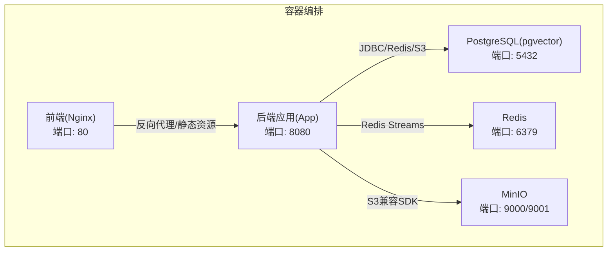
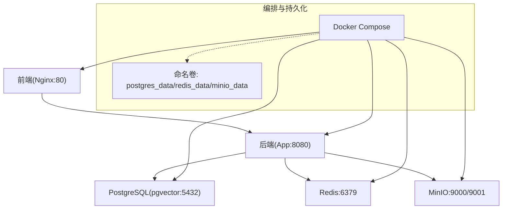
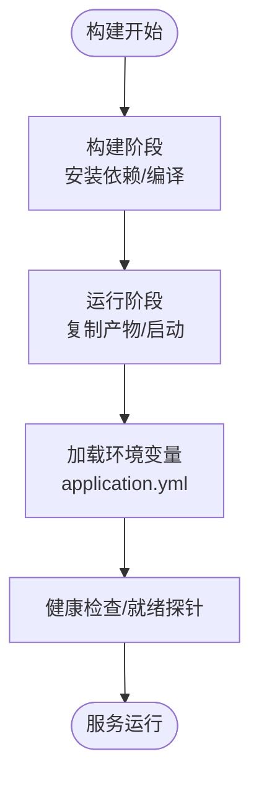
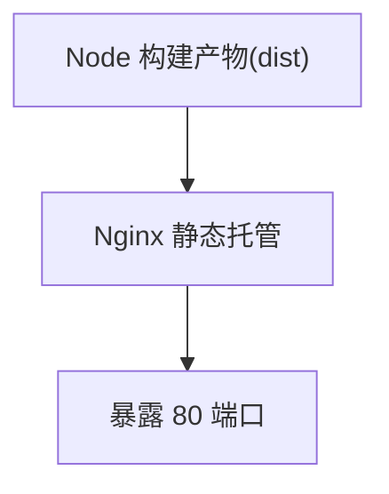
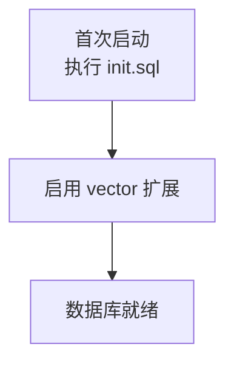
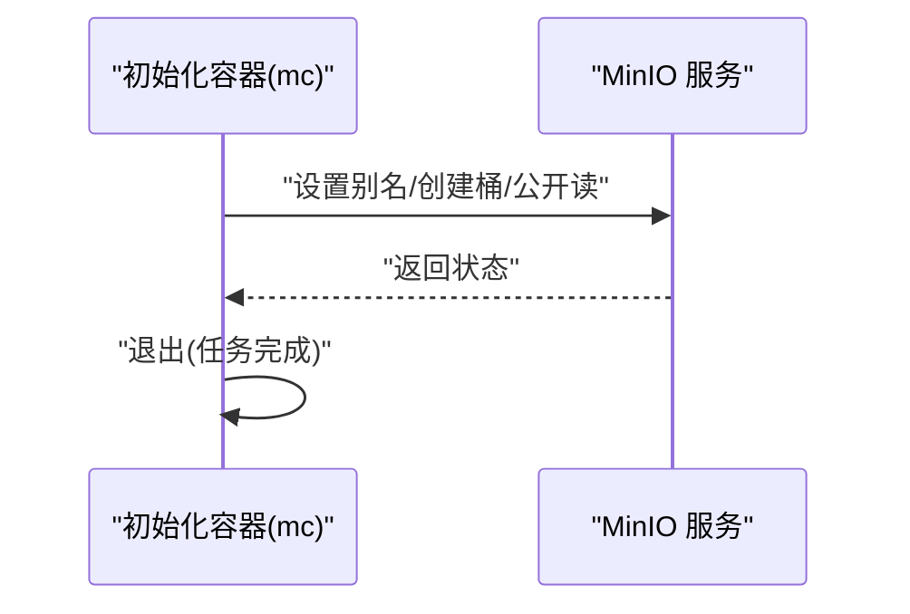
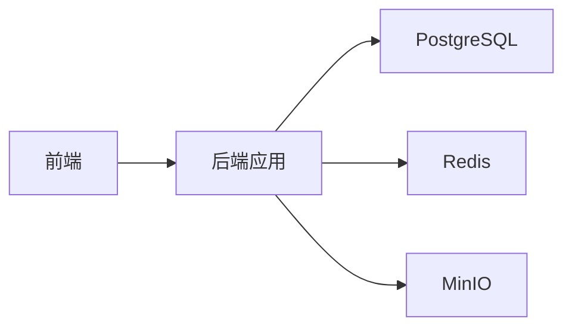

# 部署和运维

<cite>
**本文引用的文件**
- [docker-compose.yml](file://docker-compose.yml)
- [docker-compose.dev.yml](file://docker-compose.dev.yml)
- [app/Dockerfile](file://app/Dockerfile)
- [frontend/Dockerfile](file://frontend/Dockerfile)
- [app/build.gradle](file://app/build.gradle)
- [settings.gradle](file://settings.gradle)
- [app/src/main/resources/application.yml](file://app/src/main/resources/application.yml)
- [app/src/test/resources/application-test.yml](file://app/src/test/resources/application-test.yml)
- [docker/postgres/init.sql](file://docker/postgres/init.sql)
- [scripts/start-bmad-workflow.sh](file://scripts/start-bmad-workflow.sh)
</cite>

## 目录
1. [简介](#简介)
2. [项目结构](#项目结构)
3. [核心组件](#核心组件)
4. [架构总览](#架构总览)
5. [详细组件分析](#详细组件分析)
6. [依赖关系分析](#依赖关系分析)
7. [性能考虑](#性能考虑)
8. [故障排查指南](#故障排查指南)
9. [结论](#结论)
10. [附录](#附录)

## 简介
本文件面向面试指南平台的部署与运维，覆盖以下主题：
- Docker 容器化与镜像构建：后端与前端 Dockerfile 编写要点、多阶段构建、运行时配置
- Docker Compose 服务编排：服务定义、网络与卷、健康检查、环境变量注入
- CI/CD 流水线：自动化构建、测试集成、镜像推送与部署策略建议
- 监控与日志：应用日志、容器日志采集、健康检查与告警联动
- 性能优化：JVM/应用线程模型、数据库连接池、缓存与向量检索优化
- 运维脚本：开发工作流脚本与日常运维辅助
- 故障排查：日志分析、性能分析、问题定位方法
- 备份与灾难恢复：数据库与对象存储的数据保护策略

## 项目结构
本项目采用多模块与多容器协作的架构：
- 后端应用模块：Spring Boot 应用，提供 REST API、AI 能力、RAG 向量检索、简历与知识库处理
- 前端模块：Vue/React 应用，经 Nginx 托管
- 基础设施：PostgreSQL（带 pgvector）、Redis、MinIO（或 RustFS 开发替代）

图表来源
- [docker-compose.yml:13-197](file://docker-compose.yml#L13-L197)

章节来源
- [docker-compose.yml:1-197](file://docker-compose.yml#L1-L197)
- [docker-compose.dev.yml:1-64](file://docker-compose.dev.yml#L1-L64)

## 核心组件
- 数据库（PostgreSQL + pgvector）
  - 作用：持久化业务数据与向量索引，支持 RAG 检索
  - 特性：容器内自动初始化向量扩展
- 缓存与消息队列（Redis）
  - 作用：会话缓存、限流、异步任务（Stream）
- 对象存储（MinIO）
  - 作用：存储简历、头像、知识库文档等非结构化数据
  - 特性：S3 兼容协议，便于迁移
- 后端应用（Spring Boot）
  - 作用：REST API、AI 调用、RAG、简历/知识库处理
  - 特性：虚拟线程、HikariCP 连接池、OpenAPI 文档
- 前端（Nginx 托管）
  - 作用：SPA 静态资源与反向代理

章节来源
- [docker-compose.yml:13-197](file://docker-compose.yml#L13-L197)
- [app/src/main/resources/application.yml:48-124](file://app/src/main/resources/application.yml#L48-L124)

## 架构总览
下图展示容器间依赖与数据流：

图表来源
- [docker-compose.yml:13-197](file://docker-compose.yml#L13-L197)

## 详细组件分析

### 后端应用容器化（Spring Boot）
- 多阶段构建
  - 构建阶段：Node 环境安装依赖并打包（适用于需要预处理的场景；当前后端未使用）
  - 运行阶段：基于精简基础镜像，直接运行 Spring Boot 可执行产物
- 运行时配置
  - 端口：8080
  - 环境变量：数据库、Redis、对象存储、AI Provider 等均通过环境变量注入
  - 日志：统一 UTF-8 编码，控制台与文件输出
- 依赖与工具链
  - Gradle 项目，Java 21，Spring Boot 4，Spring AI，pgvector，Redisson，AWS S3 SDK，iText，DashScope SDK

图表来源
- [app/Dockerfile](file://app/Dockerfile)
- [app/src/main/resources/application.yml:9-47](file://app/src/main/resources/application.yml#L9-L47)

章节来源
- [app/Dockerfile](file://app/Dockerfile)
- [app/src/main/resources/application.yml:9-47](file://app/src/main/resources/application.yml#L9-L47)
- [app/build.gradle:104-135](file://app/build.gradle#L104-L135)

### 前端容器化（Nginx 托管）
- 多阶段构建：第一阶段使用 Node 构建静态资源；第二阶段使用 Nginx 托管
- 反向代理：通过 Nginx 配置将 API 请求转发至后端
- 端口：80

图表来源
- [frontend/Dockerfile:1-44](file://frontend/Dockerfile#L1-L44)

章节来源
- [frontend/Dockerfile:1-44](file://frontend/Dockerfile#L1-L44)

### 数据库（PostgreSQL + pgvector）
- 镜像：pgvector/pgvector:pg16
- 初始化：容器首次启动执行 /docker-entrypoint-initdb.d/init.sql，启用向量扩展
- 健康检查：pg_isready
- 卷：postgres_data 持久化

图表来源
- [docker-compose.yml:13-36](file://docker-compose.yml#L13-L36)
- [docker/postgres/init.sql:1-2](file://docker/postgres/init.sql#L1-L2)

章节来源
- [docker-compose.yml:13-36](file://docker-compose.yml#L13-L36)
- [docker/postgres/init.sql:1-2](file://docker/postgres/init.sql#L1-L2)

### 缓存与消息队列（Redis）
- 镜像：redis:7
- 健康检查：redis-cli ping
- 卷：redis_data
- 应用侧：Redisson 客户端配置，连接池参数已针对高并发与异步任务优化

章节来源
- [docker-compose.yml:47-59](file://docker-compose.yml#L47-L59)
- [app/src/main/resources/application.yml:86-98](file://app/src/main/resources/application.yml#L86-L98)

### 对象存储（MinIO）
- 镜像：minio/minio
- 端口：9000（API）、9001（控制台）
- 初始化容器：mc 客户端创建 bucket 并设置公开读
- 应用侧：S3 兼容 SDK，endpoint、accessKey、secretKey、bucket、region 通过环境变量注入

图表来源
- [docker-compose.yml:102-117](file://docker-compose.yml#L102-L117)

章节来源
- [docker-compose.yml:72-117](file://docker-compose.yml#L72-L117)
- [app/src/main/resources/application.yml:182-189](file://app/src/main/resources/application.yml#L182-L189)

### 开发环境替代（RustFS）
- 镜像：rustfs/rustfs
- 端口：9000（API）、9001（控制台）
- 通过健康检查验证服务可用
- 适用于本地开发替代 MinIO

章节来源
- [docker-compose.dev.yml:38-58](file://docker-compose.dev.yml#L38-L58)

### 应用配置（application.yml）
- 服务器与线程
  - Tomcat 线程与连接参数
  - 启用虚拟线程（Java 21+），提升 I/O 密集型并发
- 数据源与连接池
  - HikariCP 参数优化，适配虚拟线程
  - Hibernate 批量与 SQL 格式化优化
- Redisson
  - 单节点配置，连接池大小与空闲连接数
- Spring AI 与向量存储
  - DashScope OpenAI 兼容模式
  - pgvector 索引类型、距离度量、维度、schema 初始化策略
- 应用自定义配置
  - AI Provider、RAG 搜索参数、面试批处理、简历上传类型、CORS、语音面试参数、速率限制、音频参数等

章节来源
- [app/src/main/resources/application.yml:9-282](file://app/src/main/resources/application.yml#L9-L282)

### 测试配置（application-test.yml）
- H2 内存数据库，JPA DDL 自动化策略
- Redisson 单节点配置
- Spring AI 与向量存储测试参数
- 语音面试测试参数

章节来源
- [app/src/test/resources/application-test.yml:1-165](file://app/src/test/resources/application-test.yml#L1-L165)

### Gradle 构建与环境注入
- Gradle 插件：Spring Boot、依赖管理
- Java Toolchain：Java 21
- bootRun 任务：从 .env 注入环境变量，设置 JVM 编码为 UTF-8

章节来源
- [app/build.gradle:1-136](file://app/build.gradle#L1-L136)
- [settings.gradle:1-24](file://settings.gradle#L1-L24)

## 依赖关系分析
- 组件耦合
  - 后端对数据库、Redis、对象存储存在强依赖，Compose 中通过健康检查与依赖顺序保证启动顺序
  - 前端依赖后端 API，通过反向代理访问
- 外部依赖
  - Spring AI、pgvector、Redisson、AWS S3 SDK、DashScope SDK
- 环境变量契约
  - 数据库：host/port/db/user/password
  - Redis：host/port/password
  - 对象存储：endpoint/accessKey/secretKey/bucket/region
  - AI Provider：base-url/api-key/model
  - 面试参数：follow-up count、evaluation batch size 等

图表来源
- [docker-compose.yml:125-197](file://docker-compose.yml#L125-L197)
- [app/src/main/resources/application.yml:48-189](file://app/src/main/resources/application.yml#L48-L189)

章节来源
- [docker-compose.yml:125-197](file://docker-compose.yml#L125-L197)
- [app/src/main/resources/application.yml:48-189](file://app/src/main/resources/application.yml#L48-L189)

## 性能考虑
- 应用线程模型
  - 启用虚拟线程，提升 I/O 密集型场景并发（如 AI 调用、SSE 长连接）
- 数据库连接池
  - HikariCP 参数适配虚拟线程，避免过度连接
  - Hibernate 批量插入/更新优化
- 缓存与消息队列
  - Redisson 连接池参数合理设置，避免阻塞
  - Redis Stream 异步处理简历分析、文档向量化
- 向量检索
  - pgvector HNSW 索引与余弦距离，合理设置维度与 initialize-schema
- 前端静态资源
  - Nginx 托管，减少后端压力

章节来源
- [app/src/main/resources/application.yml:42-78](file://app/src/main/resources/application.yml#L42-L78)
- [app/src/main/resources/application.yml:86-124](file://app/src/main/resources/application.yml#L86-L124)

## 故障排查指南
- 启动顺序与健康检查
  - 数据库、Redis、MinIO 健康检查失败会导致后端无法启动
  - 检查容器日志：docker compose logs <service>
- 数据库初始化
  - 确认 init.sql 已执行，向量扩展已启用
- 对象存储
  - 初始化容器是否成功创建 bucket 并设置公开读
- 应用日志
  - application.yml 中已设置 UTF-8 编码，关注后端异常堆栈与 AI 调用错误
- 语音面试与实时流
  - 检查 DashScope 凭据、速率限制配置、音频参数

章节来源
- [docker-compose.yml:31-35](file://docker-compose.yml#L31-L35)
- [docker-compose.yml:54-58](file://docker-compose.yml#L54-L58)
- [docker-compose.yml:85-89](file://docker-compose.yml#L85-L89)
- [app/src/main/resources/application.yml:9-47](file://app/src/main/resources/application.yml#L9-L47)

## 结论
本部署方案以 Docker Compose 实现全栈容器化，后端应用充分利用虚拟线程与连接池优化，结合 Redis 与 MinIO 构建高性能、可扩展的面试指南平台。通过明确的环境变量契约与健康检查，确保服务稳定启动与运行。建议在生产环境中进一步完善 CI/CD、监控与日志、备份与灾难恢复策略。

## 附录

### CI/CD 流水线配置建议
- 构建阶段
  - 后端：Gradle 构建（跳过测试或仅运行单元测试），生成可执行产物
  - 前端：Node 构建静态资源，Nginx 镜像
- 测试阶段
  - 运行集成测试，连接 Compose 中的数据库与缓存
- 镜像与发布
  - 构建后端与前端镜像，推送到私有仓库
- 部署策略
  - 蓝绿/滚动发布，配合健康检查与回滚策略
  - 生产环境分离 initialize-schema 与 schema 管理

章节来源
- [app/build.gradle:100-102](file://app/build.gradle#L100-L102)
- [docker-compose.yml:125-197](file://docker-compose.yml#L125-L197)

### 监控与日志
- 应用日志
  - application.yml 已设置 UTF-8 编码，建议集中收集（如使用 ELK/Fluent Bit）
- 健康检查
  - 数据库、Redis、MinIO 健康检查已在 Compose 中定义
- 告警
  - 基于容器状态与日志关键词触发告警

章节来源
- [docker-compose.yml:31-35](file://docker-compose.yml#L31-L35)
- [docker-compose.yml:54-58](file://docker-compose.yml#L54-L58)
- [docker-compose.yml:85-89](file://docker-compose.yml#L85-L89)

### 运维脚本使用
- 开发工作流脚本
  - start-bmad-workflow.sh：引导 7 步标准化开发流程，创建 Git Worktree、安装依赖、生成设计与计划文档
  - 适用于团队协作与质量保障

章节来源
- [scripts/start-bmad-workflow.sh:1-253](file://scripts/start-bmad-workflow.sh#L1-L253)

### 备份与灾难恢复
- 数据持久化
  - 使用命名卷（postgres_data/redis_data/minio_data）保存关键数据
- 备份策略
  - 定期导出数据库（pg_dump）、备份 MinIO 数据
- 灾难恢复
  - 重建 Compose 环境，恢复卷数据，重新初始化对象存储桶

章节来源
- [docker-compose.yml:193-197](file://docker-compose.yml#L193-L197)